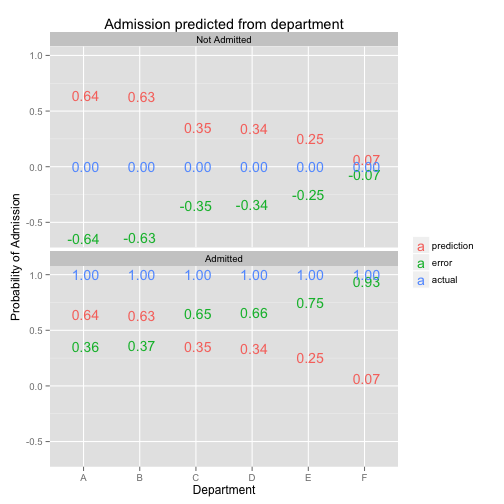
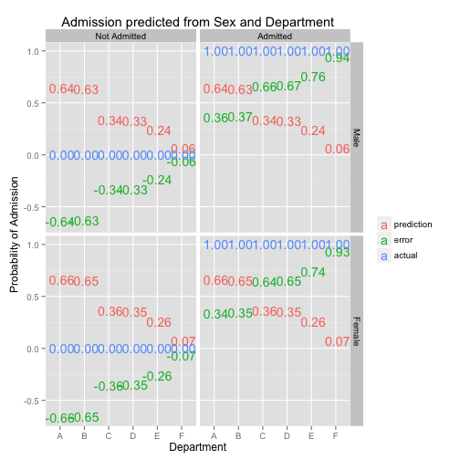

Asking the right questions
========================================================


### The case of Sally Clark

Sally Clark was convicted in British court of the murder of her two sons in 1999. Christopher, her first, was born on September 22nd 1996, and died three months later while home alone with his mother. Harry, her second son, was born November 29th, 1997, and died two months later, also while home alone with his mother. During the trial, an expert witness for the prosecution testified that the probability of each child independently dying of unexplained causes (sudden infant death syndrome, or SIDS) was 1/8543, and that the probability of both infants dying of SIDS was therefore around 1 in 73 million.


DISCUSSION: how likely is it that Sally Clark murdered her children?


The main problem with the 1 in 73 million figure is that it is an answer to the wrong question (it may have also been calculated incorrectly, but that is a relatively minor issue). In the case of Sally Clark, what we want is an answer to the question "How likely is it that Sally Clark killed her children?". Instead the prosecution answered the question "How likely is it that these deaths were both caused by SIDS?". Unfortunately, the answer to the second question is not the same as the answer to the first.

To see why the probability of two cases of SIDS in the same family is not the same as the probability that the infants were murdered, consider the following probability trees:


```
## Loading required package: lattice Loading required package: grid Loading
## required package: MASS Loading required package: nnet Loading required
## package: colorspace
## 
## Attaching package: 'effects'
## 
## The following object is masked from 'package:datasets':
## 
## Titanic
## 
## Loading required package: rJava Loading required package: car
## 
## Attaching package: 'car'
## 
## The following object is masked from 'package:effects':
## 
## Prestige
## 
## Attaching package: 'rockchalk'
## 
## The following object is masked from 'package:MASS':
## 
## mvrnorm
```

 


 


 


The mistake made in this case was the failure to recognize that the impressive-sounding 1 in 73 million odds of two SIDS cases in the same family was not the same as the odds that Sally Clark was innocent. The court should have focused on the *relative* probability of SIDS vs. murder, not on the probability of SIDS alone. While double SIDS is rare, murdering children is even more so. In fact the odds are about 6:1 in favor of SIDS! 1 in 73 million was a classic type III error (the answer to the wrong question), an error that resulted in the murder conviction of a mother who was likely innocent.

For those wishing for a more thorough analysis of the statistical issues in this case, [Ray Hill's walk-through](http://www.cse.salford.ac.uk/staff/RHill/ppe_5601.pdf) is highly recommended. For more on the Prosecutor's Fallacy (of which this case is an example) see [Thompson and Schumann (1987)](http://www.jstor.org/stable/1393631)


### Berkeley gender bias case

A court case brought against the University of California, Berkeley in the 1970's, claiming that female applicants were being discriminated against by the admissions system. Here are the actual admissions rates in the six largest departments at Berkeley in 1973 (from Wikipedia):

Female Applicant Data By Department
<!-- html table generated in R 3.0.1 by xtable 1.7-1 package -->
<!-- Fri Aug  2 12:21:38 2013 -->
<TABLE border=1>
<TR> <TH> Department </TH> <TH> Female_Applicants </TH> <TH> Females_Admitted </TH>  </TR>
  <TR> <TD> A </TD> <TD align="right"> 108 </TD> <TD align="right">  89 </TD> </TR>
  <TR> <TD> B </TD> <TD align="right">  25 </TD> <TD align="right">  17 </TD> </TR>
  <TR> <TD> C </TD> <TD align="right"> 593 </TD> <TD align="right"> 202 </TD> </TR>
  <TR> <TD> D </TD> <TD align="right"> 375 </TD> <TD align="right"> 131 </TD> </TR>
  <TR> <TD> E </TD> <TD align="right"> 393 </TD> <TD align="right">  94 </TD> </TR>
  <TR> <TD> F </TD> <TD align="right"> 341 </TD> <TD align="right">  24 </TD> </TR>
   </TABLE>
Male Applicant Data By Department
<!-- html table generated in R 3.0.1 by xtable 1.7-1 package -->
<!-- Fri Aug  2 12:21:38 2013 -->
<TABLE border=1>
<TR> <TH> Department </TH> <TH> Male_Applicants </TH> <TH> Males_Admitted </TH>  </TR>
  <TR> <TD> A </TD> <TD align="right"> 825 </TD> <TD align="right"> 512 </TD> </TR>
  <TR> <TD> B </TD> <TD align="right"> 560 </TD> <TD align="right"> 353 </TD> </TR>
  <TR> <TD> C </TD> <TD align="right"> 325 </TD> <TD align="right"> 120 </TD> </TR>
  <TR> <TD> D </TD> <TD align="right"> 417 </TD> <TD align="right"> 138 </TD> </TR>
  <TR> <TD> E </TD> <TD align="right"> 191 </TD> <TD align="right">  53 </TD> </TR>
  <TR> <TD> F </TD> <TD align="right"> 272 </TD> <TD align="right">  16 </TD> </TR>
   </TABLE>


EXERCISE: In groups of two, calculate admissions rate for males and females. Is there evidence of gender bias? If so, which gender appears to be discriminated against?


The strange thing about this table is that we get different results depending on how we add things up:

Female Applicant Data By Department
<!-- html table generated in R 3.0.1 by xtable 1.7-1 package -->
<!-- Fri Aug  2 12:21:38 2013 -->
<TABLE border=1>
<TR> <TH> Department </TH> <TH> Female_Applicants </TH> <TH> Females_Admitted </TH> <TH> Percent </TH>  </TR>
  <TR> <TD> A </TD> <TD align="right"> 108 </TD> <TD align="right">  89 </TD> <TD align="right"> 82.41 </TD> </TR>
  <TR> <TD> B </TD> <TD align="right">  25 </TD> <TD align="right">  17 </TD> <TD align="right"> 68.00 </TD> </TR>
  <TR> <TD> C </TD> <TD align="right"> 593 </TD> <TD align="right"> 202 </TD> <TD align="right"> 34.06 </TD> </TR>
  <TR> <TD> D </TD> <TD align="right"> 375 </TD> <TD align="right"> 131 </TD> <TD align="right"> 34.93 </TD> </TR>
  <TR> <TD> E </TD> <TD align="right"> 393 </TD> <TD align="right">  94 </TD> <TD align="right"> 23.92 </TD> </TR>
  <TR> <TD> F </TD> <TD align="right"> 341 </TD> <TD align="right">  24 </TD> <TD align="right"> 7.04 </TD> </TR>
  <TR> <TD> All </TD> <TD align="right"> 1835 </TD> <TD align="right"> 557 </TD> <TD align="right"> 30.35 </TD> </TR>
   </TABLE>
Male Applicant Data By Department
<!-- html table generated in R 3.0.1 by xtable 1.7-1 package -->
<!-- Fri Aug  2 12:21:38 2013 -->
<TABLE border=1>
<TR> <TH> Department </TH> <TH> Male_Applicants </TH> <TH> Males_Admitted </TH> <TH> Percent </TH>  </TR>
  <TR> <TD> A </TD> <TD align="right"> 825 </TD> <TD align="right"> 512 </TD> <TD align="right"> 62.06 </TD> </TR>
  <TR> <TD> B </TD> <TD align="right"> 560 </TD> <TD align="right"> 353 </TD> <TD align="right"> 63.04 </TD> </TR>
  <TR> <TD> C </TD> <TD align="right"> 325 </TD> <TD align="right"> 120 </TD> <TD align="right"> 36.92 </TD> </TR>
  <TR> <TD> D </TD> <TD align="right"> 417 </TD> <TD align="right"> 138 </TD> <TD align="right"> 33.09 </TD> </TR>
  <TR> <TD> E </TD> <TD align="right"> 191 </TD> <TD align="right">  53 </TD> <TD align="right"> 27.75 </TD> </TR>
  <TR> <TD> F </TD> <TD align="right"> 272 </TD> <TD align="right">  16 </TD> <TD align="right"> 5.88 </TD> </TR>
  <TR> <TD> All </TD> <TD align="right"> 2590 </TD> <TD align="right"> 1192 </TD> <TD align="right"> 46.02 </TD> </TR>
   </TABLE>


Why does this seemingly paradoxical result occur? Essentially because females applied to more competitive departments than did males.

There are two different angles from which we can approach this difficult issue. Way way to think about it is as an aggregation error: by comparing rates aggregated across departments will only give the same result as comparing rates within each department under very strong (and often wrong) assumptions. Making inferences about individuals based on information about groups is known as the ecological fallacy.

Another way to think about it is as an omitted variable problem. Summing the male and female columns across departments gives us the same result as if we had summed the whole university, ignoring department. From this perspective the problem is that by aggregating we have failed to account for differences across departments, and these between-department differences account for the apparent bias against female applicants.


#### Multiple regression
Recall the Berkely data example. Earlier we saw that we get different answers depending on how we sum across the table. 

    


#### Red State Blue State

Another example of the ecological fallacy:

Andrew Gelmans's book "Red State, Blue State, Rich State, Poor State: Why Americans Vote the Way They Do" describes a seeming paradox: richer states are more likely to vote for democrats, while richer individual people are more likely to vote for republicans. This counter-intuitive set of findings is an example of the ecological fallacy, or the fallacy of making inferences about individuals based on groups. In general it cannot be assumed that the associations between aggregated variables (e.g., averages at the state or country level) are the same (or even similar) to the associations between those variables at the individual level. In the "red state blue state" example the striking dissimilarity is (at least partly) explained by fact that at the individual level the association between wealth and voting behavior is stronger in poorer states than it is in richer ones.


#### Length of short answer responses and exam scores

DISCUSSION:

As another example of how easy it can be to ask the wrong question, try answering these ones:

Do you think the association between length of short-answer responses and exam grades is positive or negative? or negative? If you were taking an exam, would it be better to write a short answer or a long one?

Answer: Students who write short answers get higher marks. But you should still write a long answer!


### Education expenditures and SAT scores

http://goo.gl/N6u3x0
