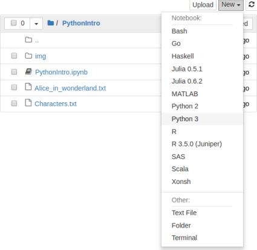
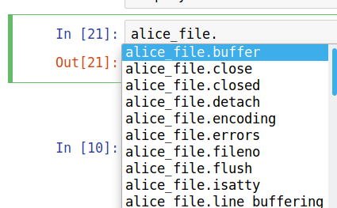
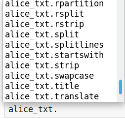

# Introduction to Python


## Setup instructions

###  Install the Anaconda Python distribution
If using your own computer please install the Anaconda Python distribution from [https://www.anaconda.com/download/](https://www.anaconda.com/download/). (Note that Python version$\leq$ 3.0 differs considerably from more recent releases. For this workshop you will need version$\geq$ 3.4.)

Accepting the defaults proposed by the Anaconda installer is generally recommended.

### Download workshop materials
Download the materials from [http://tutorials.iq.harvard.edu/Python/PythonIntro.zip](http://tutorials.iq.harvard.edu/Python/PythonIntro.zip) and extract the zipped directory (Right-click => Extract All on Windows, double-click on Mac).

### Launch Jupyter Notebook
Start the `Anaconda Navigator` program in the usual way. Click the or `Launch` button under `Jupyter Notebook`.

## Workshop goals and approach
In this workshop you will
- learn about the python package and application ecosystem,
- learn python language basics and common idioms, and,
- practice reading files and manipulating data in python.

A more general goal is to get you comfortable with Python so that it seems less scary and mystifying than it perhaps does now. Note that this is by no means a complete or thorough introduction to Python! It's just enough to get by.

This workshop is relatively *informal*, *example-oriented*, and *hands-on*. We won't spend much time examining language features in detail. Instead we will work through an example, and learn some things about the language along the way.

As an example project we will analyze the text of Lewis Carroll's *Alice's Adventures in Wonderland*. Among the questions we will use Python to answer are:
- How many total and unique words are there?
- How many chapters and paragraphs?
- How many words are in each chapter, and what is the average words per chapter?
- How many times is each main character mentioned?


## What is Python?
Python is a relatively easy to learn general purpose programming language. People use Python to manipulate, analyze, and visualize data, make web sites, write games, and much more. Youtube, DropBox, and BitTorrent are among the things people used python to make.

Like most popular open source programming languages, Python can be thought of as a *platform* that runs a huge number and variety of packages. The language itself is mostly valuable because it makes it easy to create and use a large number of useful packages.

## How can I interact with Python?
A number of interfaces designed to make it easy to interact with Python are available. The Anaconda distribution that we installed earlier includes both a web-based *Jupyter Notebook* and a more conventional Integrated Development Environment called *Spyder*. For this workshop I encourage you to use *Jupyter Notebook*. In real life you should experiment and choose the interface that you find most comfortable.

To get started, start the *Jupyter Notebook* application, and navigate to the *PythonIntro* directory you downloaded and extracted earlier. Start a new notebook by clicking `New => Python 3` as shown below.



A Jupyter Notebook contains one or more *cells* containing notes or code. To insert a new cell click the `+` button in the upper left. To execute a cell, select it and press `Control+Enter` or click the `Run` button at the top.


## Reading the text of Alice in Wonderland from a file
Reading information from a file is the first step in many projects, so we'll start there. The workshop materials you downloaded earlier include a file named `Alice_in_wonderland.txt` which contains the text of Lewis Carroll's *Alice's Adventures in Wonderland*.

We can open a connection to a file using the *open* function, and store the result using the `=` operator.

```python
alice_file = open("Alice_in_wonderland.txt")
```

The name on the left of the equals sign (`alice_file`) is one that we chose. When choosing names, *start with a letter*, and use only *letters*, *numbers* and *underscores*.

The `alice_file` object we just created does *not* contain the contents of `Alice_in_wonderland.txt`. It a representation in Python of the *file itself* rather than the *contents* of the file.

The `alice_file` object provides *methods* that we can use to do things with it. Methods are invoked using syntax that looks like `ObjectName.method()`. You can see the methods available for acting on an object by typing the object's name followed by a `.` and pressing the `tab` key. For example, typing `alice_file.` and pressing `tab` will display a list of methods as shown below. .

Among the methods we have for doing things with our `alice_file` object is one named `read`. We can use the `help` function to learn more about it.

```python
help(alice_file.read)
```

Since `alice_file.read` looks promising, we will invoke this method and see what it does.

```python
alice_txt = alice_file.read()
print(alice_txt[:500]) # the [:500] gets the first 500 character -- more on this later.
```

That's all there is to it! We've read the contents of `Alice_in_wonderland.txt` and stored this text in a Python object we named `alice_txt`. Now let's start to explore this object, and learn some more things about Python along the way.


## Counting chapters, lines, and words
Now that we have the text we can start answering some questions about it. To begin with, how many words does it contain? To answer this question we can split the text up so there is one element per word, and then count the number of words.

### Splitting a string into a list of words
How do we figure out how to split strings in Python? By asking Python what our `alice_txt` object is and what methods it provides. We can ask Python what things are using the `type` function, like this:

```python
type(alice_txt)
```

Python tells us that `alice_txt` is of type `str` (i.e., it is a string). We can find out what methods are available for working strings by typing `alice_txt.` and pressing `tab`. We'll see that among the methods is one named `split`, as shown below.
 
To learn how to use this method we can check the documentation.

```python
help(alice_txt.split)
```

Since the default is to split on whitespace (spaces, newlines, tabs) we can get a reasonable word count simply by calling the split method and counting the number of elements in the result.

```python
alice_words = alice_txt.split()
len(alice_words)
```

### Using sets to calculate the number of unique words
According to our computation above, there are about 26 thousand total words in *Alice's Adventures in Wonderland*. But how many *unique* words are there? Python has a special data structure called a *set* that makes it easy to find out. A *set* drops all duplicates, giving a collection of the unique elements.

```python
len(set(alice_words))
```

There are 5295 unique words in the text.


## Exercise: Reading text from a file and splitting
*Alice's Adventures in Wonderland* is full of memorable characters. The main characters from the story are listed, one-per-line, in the file named `Characters.txt`.

NOTE: we will not always explicitly demonstrate everything you need to know in order to complete an exercise. Instead we focus on teaching you how to discover available methods and how use the help function to learn how to use them. It is expected that you will spend some time during the exercises looking for appropriate methods and perhaps reading documentation.

1. Open the `Characters.txt` file and read its contents.

2. Split text on newlines to produce a list with one element per line. Store the result as "alice_characters".

# ```

### Working with lists
The `split` methods we used to break up the text of *Alice in Wonderland* into words produced a *list*. A lot of the techniques we'll use later to analyze this text also produce lists, so its worth taking a minute to learn more about them.

It is always a good idea to know what type of things you're working with in Python. As you gain experience, you won't have to look this things up as often, but even experienced Python programmers use the `type` function to learn about the objects they are working with.

```python
type(alice_words)
```

A *list* in Python is used to store a collection of items. As with other types in Python, you can get a list of methods by typing the name of the object followed by a `.` and pressing `tab`.

#### Extracting subsets from lists
Among the things you can do with a list is extract subsets using bracket indexing notation. This is useful in many situations, including the current one where we want to inspect a long list without printing out the whole thing.

The examples below show how indexing works in Python.

```python
alice_words[0] # first word (yes, we count from zero!)
```

```python
alice_words[1] # second word
```

```python
alice_words[:10] # first 10 words
```

```python
alice_words[10:20] # words 11 through 20
```

```python
alice_words[-1] # the last word
```

```python
alice_words[-10:] # the last 10 words
```

Note that the displayed representation of lists and other data structures in python often closely matches the syntax used to create them. For example, we can create a list using square brackets, just as we see when we print a list:

```python
['her',
 'own',
 'child-life,',
 'and',
 'the',
 'happy',
 'summer',
 'days.',
 'THE',
 'END']
```

#### Sorting and other in-place methods
There are many other things we can do with lists besides extracting subsets using bracket indexing. For example, there are methods to append and remove elements from a list. When using a list method that you are unfamiliar with, it is always a good idea to read the documentation. 

Note that many methods modify the object *in place*. For example, if we wanted to sort the last 10 words in `alice_words` we would do it like this:

```python
last_10 = alice_words[-10:]
print(last_10)
last_10.sort()
print(last_10)
```

### Counting chapters and paragraphs
Now that we know how to split a string and how to work with the resulting list, we can split on chapter markers to count the number of chapters. All we need to do is specify the string to split on. Since each chapter is marked with the string `'CHAPTER '` followed by the chapter number, we can split the text up into chapters using this as the separator.

```python
alice_chapters = alice_txt.split("CHAPTER ")
len(alice_chapters)
```

Since the first element contains the material *before* the first chapter, this tells us there are twelve chapters in the book.

We can count paragraphs in a similar way. Paragraphs are indicated by a blank line, i.e., two newlines in a row. When working with strings we can represent newlines with `\n`, so our basic paragraph separator is `\n\n`.

```python
alice_paragraphs = alice_txt.split("\n\n")
```

Before counting the number of paragraphs, I want to inspect the result to see if it looks correct:

```python
print(alice_paragraphs[0], "\n==========")
print(alice_paragraphs[1], "\n==========")
print(alice_paragraphs[2], "\n==========")
print(alice_paragraphs[3], "\n==========")
print(alice_paragraphs[4], "\n==========")
print(alice_paragraphs[5], "\n==========")

```

We're counting the title, author, and chapter lines as paragraphs, but this will do for a rough count.

```python
len(alice_paragraphs)
```

## Exercise: count the number of main characters
So far we've learned that there are 12 chapters, around 830 paragraphs, and about 26 thousand words in *Alice's Adventures in Wonderland*. Along the way we've also learned how to open a file and read its contents, split strings,  calculate the length of objects, discover methods for string and list objects, and index/subset lists in Python. Now it is time for you to put these skills to use to learn something about the main characters in the story.


1. Count the number of main characters in the story (i.e., get the length   of the list you created in previous exercise).


2. Extract and print just the first character from the list you created in
   the previous exercise.

3. (BONUS, optional): Sort the list you created in step 2 alphabetically, and then extract the last element.

## Working with nested structures: words within paragraphs within chapters
This far our analysis as treated the text as a "flat" data structure. For example, when we counted words we just counted words in the whole document, rather than counting the number of words in each chapter. If we want to treat our document as a nested structure, with words forming sentences, sentences forming paragraphs, paragraphs forming chapters, and chapters forming the book, we need to learn some additional tools. Specifically, we need to learn how to iterate over lists (or other collections) and do things with each element in a collection.

There are several ways to iterate in Python, of which we will focus on *for loops* and *list comprehensions*. 

### Iterating over paragraphs using for-loops
A *for loop* is a way of cycling through the elements of a collection and doing something with each one. As a simple example, we can cycle through the first 6 paragraphs and print each one\. Cycling through with a loop makes it easy to insert a separator between the paragraphs, making it much easier to read the output.

```python
for paragraph in alice_paragraphs[:6]:
    print(paragraph)
    print('==================================')
print('DONE.')
```

Notice that the syntax of a for-loop is 

`
for <thing> in <collection>:
    do stuff with <thing>
`

Notice also that the body of the for-loop is indented. This is important, because it is this indentation that defines the body of the loop. Notice that "DONE." is only printed once, since `print('DONE.')` is not indented and is therefore outside of the body of the loop.


Loops in Python are great because the syntax is relatively simple, and because they are very powerful. Inside of the body of a loop you can use all the tools you use elsewhere in python.

Here is one more example of a loop, this time iterating over all the chapters and calculating the number of paragraphs in each chapter.

```python
for chapter in alice_chapters[1:]:
    paragraphs = chapter.split("\n\n")
    print(len(paragraphs))
```

### Iterating and collecting paragraphs per chapter using list comprehension
We could use for-loops to fill in lists of values, but there is a special syntax in Python that is often better for this use case. This special syntax is called a *list comprehension* and it looks like this:

```python
paragraphs_per_chapter = [len(chapter.split("\n\n")) 
                          for chapter in alice_chapters[1:]]
print(paragraphs_per_chapter)
```

Notice that *list comprehension* is very similar to a *for loop*, though the order is different. In a *for-loop* the `for` part comes first and the expressions that make up the body come second and are indented. In a *list comprehension* the expression comes first and the `for` part comes afterward. Notice also the square brackets surrounding the whole thing -- these brackets are what tells Python that you want a list.

Here is another list comprehension that counts the number of times the name "Alice" appears in each chapter.

```python
alices_per_chapter = [chapter.count("Alice") for chapter in alice_chapters]
print(alices_per_chapter)
```

### Organizing results in dictionaries
Our code for calculating the number of of times "Alice" was mentioned per chapter worked, but with a little effort we can make it much easier to interpret by associating each count with the chapter it corresponds to. In Python we can use a `dict` (i.e., "dictionary") to store key-value pairs.

First, we can iterate over each chapter and grab just the first line (that is, the chapter titles). These will become our keys.

```python
chapter_names = [chapter.splitlines()[0] for chapter in alice_chapters[1:]]
print(chapter_names)
```

Finally we can combine the chapter titles and counts and convert them to a dictionary.

```python
dict(zip(chapter_names, 
         [chapter.count("Alice") 
          for chapter in alice_chapters]))
```

## Exercise: Iterating and counting things
Now that we know how to iterate using for-loops and list comprehensions the possibilities really start to open up. For example, we can use these techniques to count the number of times each character appears in the story. 

1. Make sure you have both the text and the list of characters.

Open and read both "Alice_in_wonderland.txt" and
"Characters.txt" if you have not already done so.

2. Which chapter has the most words?

Split the text into chaptes (i.e., split on "CHAPTER ")
and use a for-loop or list comprehension to iterate over
the chapters. For each chapter, split it into words and 
calculate the length.

3. How many times is each character mentioned in the text?

Iterate over the list of characters using a for-loop or 
list comprehension. For each character, call the count method
with that character as the argument.

4. (BONUS, optional): Put the character counts computed 
   above in a dictionary with character names as the keys and 
   counts as the values.
5. (BONUS, optional): Use a nested list comprehension 
   to calculate the number of times each character is 
   mentioned in each chapter.


## Importing numpy and calculating simple statistics
Now that we know how to iterate over lists and calculate numbers for each element, we may wish to do some simple math using these numbers. For example, we may want to calculate the mean and standard deviation of the distribution of the number of paragraphs in each chapter. Python has a handful of math functions built-in (e.g., `min` and `max`) but built-in math support is pretty limited.

When you find that something isn't available in Python itself, its time to look for a package that does it. Although it is somewhat overkill for simply calculating a mean we're going to use a popular package called *numpy* for this. The *numpy* package is included in the Anaconda Python distribution we are using, so we don't need to install it separately.

In order to use *numpy* or other packages, you must first import them. We can import numpy as follows:

```python
import numpy
```

The *numpy* package is very popular and includes a lot of useful functions. For example, we can use it to calculate means and standard deviations:

```python
print(numpy.mean(paragraphs_per_chapter))
print(numpy.std(paragraphs_per_chapter))
```

and compute correlations:

```python
words_per_chapter = [len(chapter.split()) for chapter in alice_chapters]
alices_per_chapter = [chapter.count("Alice") for chapter in alice_chapters]

print(numpy.corrcoef(words_per_chapter, alices_per_chapter))
```

## Where to go from here
By this time you've learned a lot about python, including how to read files, call functions, lookup and use methods, process text, manipulate lists and dictionaries, and iterate using loops and comprehensions. There is more to learn, but you probably know enough already to be dangerous. Your next steps are to a) keep learning Python basics and b) find and learn  how to use packages that help you accomplish your substantive goals.

Here are some packages you might be interested in learning:

- Graphics 
     - [matplotlib](https://matplotlib.org/) 
     - [seaborn](https://seaborn.pydata.org/)
     - [plotly](https://plot.ly/python/)

- Quantitative Data Analysis 
     - [numpy](http://www.numpy.org/) 
     - [scipy](https://www.scipy.org/) 
     - [pandas](https://pandas.pydata.org/) 
     - [scikit-learn](http://scikit-learn.org/stable/)
     - [statsmodels](http://www.statsmodels.org/stable/) 

- Text analysis 
     - [textblob](https://textblob.readthedocs.io/en/dev/)
     - [nltk](http://www.nltk.org/)
     - [Gensim](https://radimrehurek.com/gensim/) 

- Webscraping 
     - [scrapy](https://scrapy.org/)
     - [requests](http://docs.python-requests.org/en/master/)
     - [lxml](https://lxml.de/)
     - [BeautifulSoup](https://www.crummy.com/software/BeautifulSoup/) 

- Social Network Analysis 
     - [networkx](https://networkx.github.io/)
     - [graph-tool](https://graph-tool.skewed.de/)

