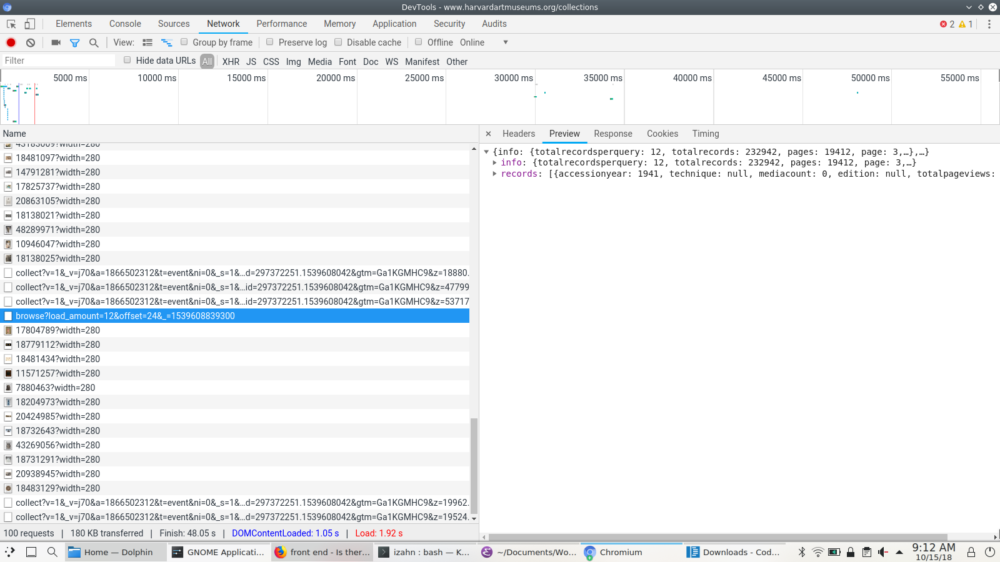
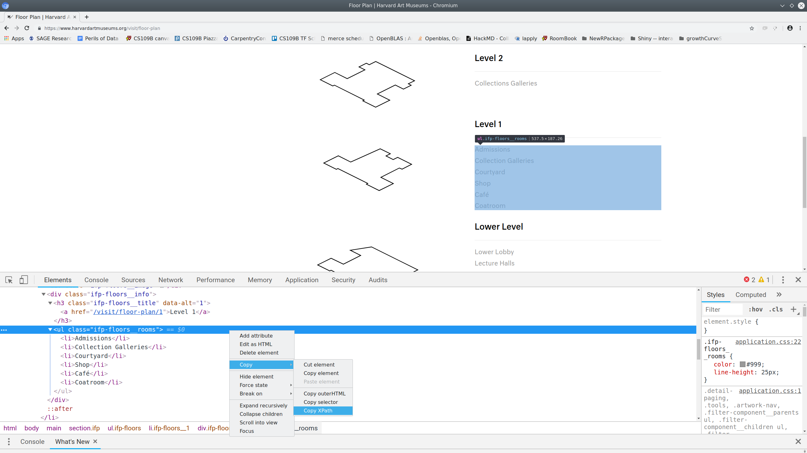

<style type="text/css">
pre code {
    display: block;
    unicode-bidi: embed;
    font-family: monospace;
    white-space: pre;
    max-height: 400px;
    overflow-x: scroll;
    overflow-y: scroll;
    }
</style>

```python
## This part is optional; it sets some printing options
## that make output look nicer.
from pprint import pprint as print
import pandas as pd
pd.set_option('display.width', 133)
pd.set_option('display.max_colwidth', 30)
pd.set_option('display.max_columns', 5)
```

## Exercise: Retrieve exhibits data
In this exercise you will retrieve information about the art
collections at Harvard Art Museums from
`https://www.harvardartmuseums.org/collections`

1. Using a web browser (Firefox or Chrome recommended) inspect the
   page at `https://www.harvardartmuseums.org/collections`. Examine
   the network traffic as you interact with the page. Try to find
   where the data displayed on that page comes from.


Looking at 



I see promising requests to
<https://www.harvardartmuseums.org/browse?load_amount=12&offset=24>

2. Make a `get` request in Python to retrieve the data from the URL
   identified in step1.

```python
import requests

museum_url = 'https://www.harvardartmuseums.org'
museum_collection = '/browse?load_amount=12'

collections0 = requests.get(museum_url
                            + museum_collection
                            + '&offset=0').json()

```

```python
print(collections0['info'])
```

```python
print(collections0['records'])
```

3. Write a *loop* or *list comprehension* in Python to retrieve data
   for the first 5 pages of collections data.

```python
collections = [requests.get(museum_url
                            + museum_collection
                            + '&offset='
                            + str(i)).json()
               for i in range(5)]
print(collections)
```

4. Bonus (optional): Arrange the data you retrieved into dict of
   lists. Convert it to a pandas `DataFrame` and save it to a `.csv`
   file.

```python
collection_records = []
for collection in collections:
    collection_records += collection['records']

col_keys = []
for collection in collection_records:
    col_keys += list(collection.keys())
col_keys = set(col_keys)

collections_data = {k: [collection.get(k, "NA")
                        for collection in collection_records]
                    for k in col_keys}

import pandas

collections_data = pandas.DataFrame.from_dict(collections_data)
collections_data.to_csv('collections.csv')

print(collections_data)
```


## Exercise: parsing HTML
In this exercise you will retrieve information about the physical
layout of the Harvard Art Museums. The web page at
<https://www.harvardartmuseums.org/visit/floor-plan> contains this
information in HTML from.

1. Using a web browser (Firefox or Chrome recommended) inspect the
   page at `https://www.harvardartmuseums.org/visit/floor-plan`. Copy
   the `XPath` to the element containing list of facilities located on
   **level 1**. information. (HINT: the element if interest is a `ul`,
   i.e., an "unordered list" of class `ifp-floors__rooms`.)
   
   
   
2. Make a `get` request in Python to retrieve the web page at
   <https://www.harvardartmuseums.org/visit/floor-plan>. Extract the
   content from your request object and parse it using `html.fromstring`
   from the `lxml` library.

```python
from lxml import html

floor_plan = requests.get('https://www.harvardartmuseums.org/visit/floor-plan')

floor_plan_html = html.fromstring(floor_plan.text)
```

3. Use the `XPath` you identified in step one to select the HTML list item
   containing level one information.

```python
level_one = floor_plan_html.xpath('/html/body/main/section/ul/li[5]/div[2]/ul')[0]
```

4. Use a *for loop* or *list comprehension* to iterate over the
   sub-elements of the list item you selected in the previous step and
   extract the text from each one.

```python
print([element.text_content() for element in level_one])
```

5. Bonus (optional): Extract the list of facilities available on each level.

```python
level_html = floor_plan_html.xpath('/html/body/main/section/ul/li')

level_info = [[element.text_content()
               for element in level.xpath('div[2]/ul')[0]]
              for level in level_html]

print(level_info)
```
