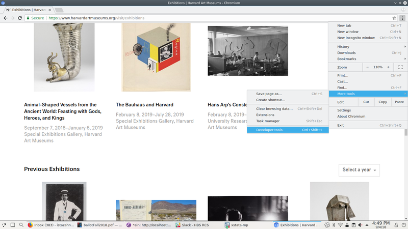
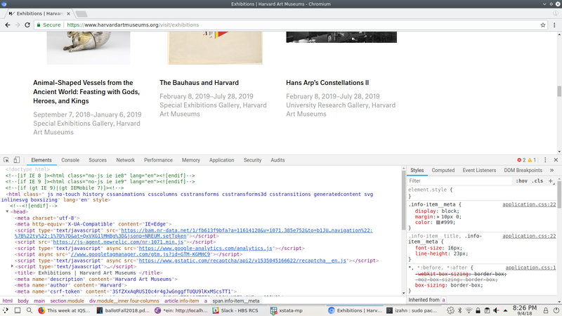
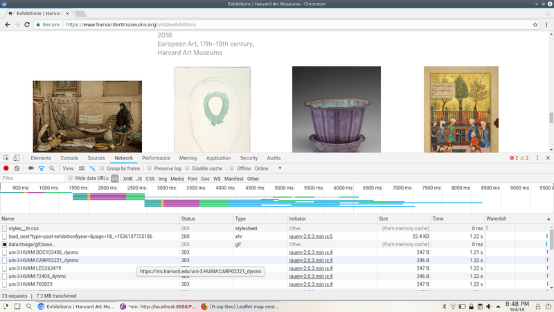
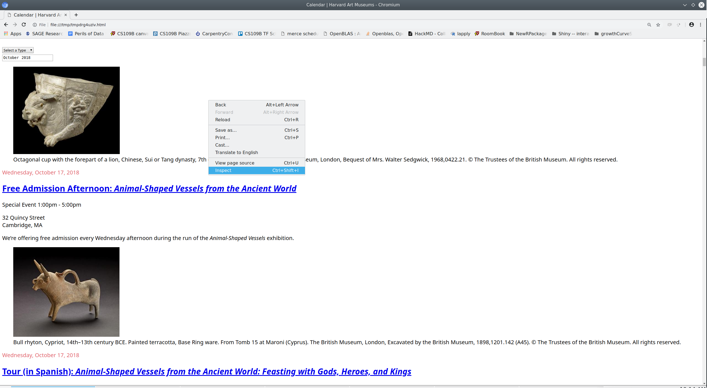
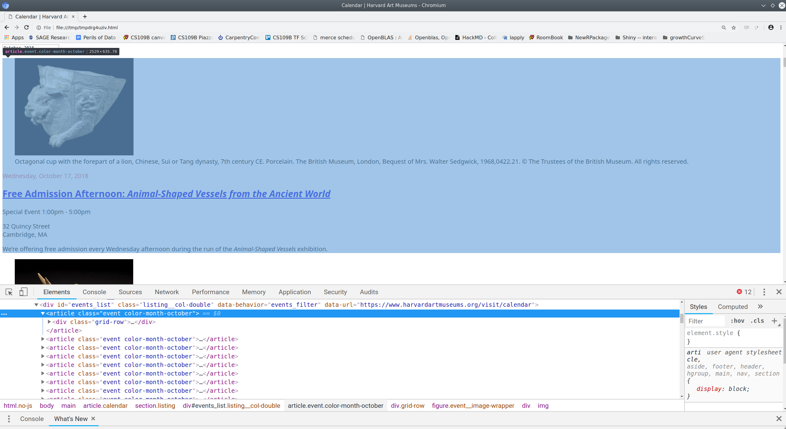
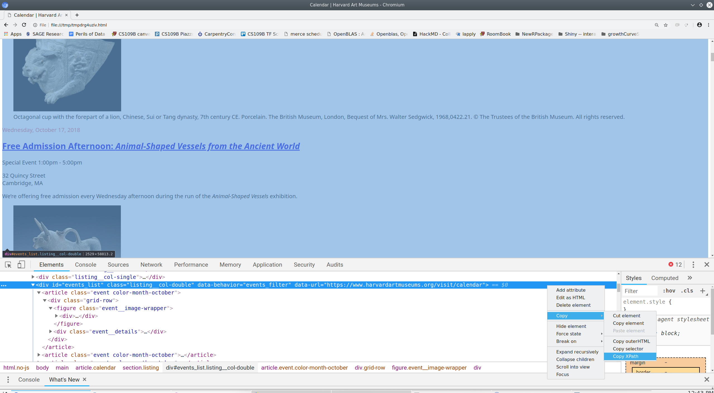
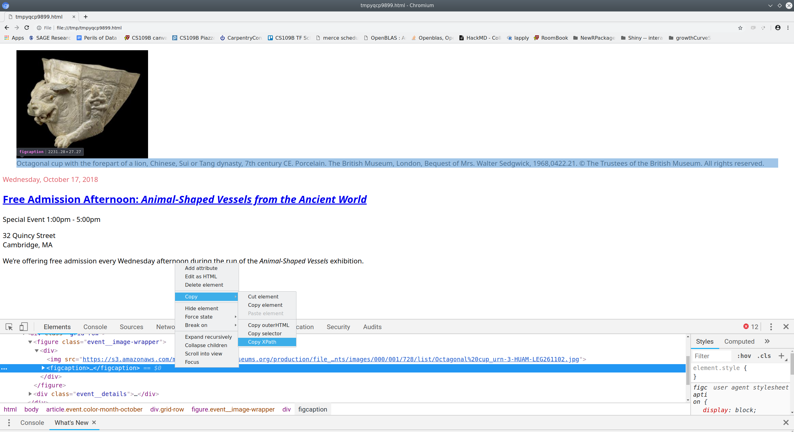

<style type="text/css">
pre code {
    display: block;
    unicode-bidi: embed;
    font-family: monospace;
    white-space: pre;
    max-height: 400px;
    overflow-x: scroll;
    overflow-y: scroll;
    }
</style>

```{python echo=FALSE, results='hide'}
## This part is optional; it sets some printing options
## that make output look nicer.
from pprint import pprint as print
import pandas as pd
pd.set_option('display.width', 133)
pd.set_option('display.max_colwidth', 30)
pd.set_option('display.max_columns', 5)
```

## Setup instructions

###  Install the Anaconda Python distribution
If using your own computer please install the Anaconda Python
distribution from
[https://www.anaconda.com/download/](https://www.anaconda.com/download/).
(Note that Python version $\leq$ 3.0 differs considerably from more
recent releases. For this workshop you will need version $\geq$ 3.4.)

Accepting the defaults proposed by the Anaconda installer is generally
recommended.

### Workshop notes
The class notes for this workshop are available on our website at
[dss.iq.harvard.edu](https://dss.iq.harvard.edu) under `Workshop
Materials ==> Python Workshop Materials => Python Web Scraping`. Click
the `All workshop materials` link to download the workshop materials.

Extract the `PythonWebScraping.zip` directory (`Right-click => Extract All` on
Windows, `double-click` on Mac).

Start the `Jupyter Notebook` application and open the
`Exercises.ipynb` file in the `PythonWebScraping` folder you
downloaded previously. You may also wish to start a new notebook for
your own notes.


## Workshop goals and approach
In this workshop you will

* learn basic web scraping principles and techniques,
* learn how to use the `requests` package in Python,
* practice making requests and manipulating responses from the server.

This workshop is relatively *informal*, *example-oriented*, and
*hands-on*. We will learn by working through an example web scraping
project.

Note that this is **not** an introductory workshop. Familiarity with
Python, including but not limited to knowledge of lists and
dictionaries, indexing, and loops and / or comprehensions is assumed.
If you need an introduction to Python or a refresher, we recommend the
[IQSS Introduction to Python](https://dss.iq.harvard.edu/workshop-materials#widget-0).

Note also that this workshop will not teach you everything you need to
know in order to retrieve data from any web service you might wish to
scrape. You can expect to learn just enough to be dangerous.

## Preliminary questions

### What is web scraping?
Web scraping is the activity of automating retrieval of information
from a web service designed for human interaction.

### Is web scraping legal? Is it ethical?
It depends. If you have legal questions seek legal counsel. You can
mitigate some ethical issues by building delays and restrictions into
your web scraping program so as to avoid impacting the availability of
the web service for other users or the cost of hosting the service for
the service provider.
 


## Example project overview and goals
In this workshop I will demonstrate web scraping techniques using the
Collections page at
<https://www.harvardartmuseums.org/collections> and let you use
the skills you'll learn to retrieve information from other parts of
the Harvard Art Museums website.

The basic strategy is pretty much the same for most scraping projects.
We will use our web browser (Chrome or Firefox recommended) to examine
the page you wish to retrieve data from, and copy/paste information
from your web browser into your scraping program.

## Take shortcuts if you can
We wish to extract information from
<https://www.harvardartmuseums.org/collections>. Like most
modern web pages, a lot goes on behind the scenes to produce the page
we see in our browser. Our goal is to pull back the curtain to see
what the website does when we interact with it. Once we see how the
website works we can start retrieving data from it. If we are lucky
we'll find a resource that returns the data we're looking for in a
structured format like [JSON](https://json.org/) or
[XML](https://en.wikipedia.org/wiki/XML).


### Examining the structure of our target web service

We start by opening the collections web page in a web browser and
inspecting it.





If we scroll down to the bottom of the Collections page, we'll see a
button that says "Load More". Let's see what happens when we click on
that button. To do so, click on "Network" in the developer tools
window, then click the "Load More Collections" button. You should see
a list of requests that were made as a result of clicking that button,
as shown below.




If we look at that second request, the one to a script named
`browse`, we'll see that it returns all the information we need, in
a convenient format called `JSON`. All we need to retrieve collection
data is call make `GET` requests to
<https://www.harvardartmuseums.org/browse> with the correct
parameters.

### Making requests using python
The URL we want to retrieve data from has the following structure

    scheme                    domain    path  parameters
     https www.harvardartmuseums.org  browse  load_amount=10&offset=0

It is often convenient to create variables containing the domain(s)
and path(s) you'll be working with, as this allows you to swap out
paths and parameters as needed. Note that the path is separated from
the domain with `/` and the parameters are separated from the path
with `?`. If there are multiple parameters they are separated from
each other with a `&`.

For example, we can define the domain and path of the collections URL
as follows:

```{python}
museum_domain = 'https://www.harvardartmuseums.org'
collection_path = 'browse'

collection_url = (museum_domain
                  + "/"
                  + collection_path)

print(collection_url)
```

Note that we omit the parameters here because it is usually easier to
pass them as a `dict` when using the `requests` library in Python.
This will become clearer shortly.

Now that we've constructed the URL we wish interact with we're ready
to make our first request in Python.

```{python}
import requests

collections1 = requests.get(
    collection_url,
    params = {'load_amount': 10,
                  'offset': 0}
)
```

```{python}
# ### Parsing JSON data
# We already know from inspecting network traffic in our web
# browser that this URL returns JSON, but we can use Python to verify
# this assumption.
collections1.headers['Content-Type']
```

Since JSON is a structured data format, parsing it into python data
structures is easy. In fact, there's a method for that!

```{python}
collections1 = collections1.json()
print(collections1)
```

That's it. Really, we are done here. Everyone go home!

OK not really, there is still more we can lean. But you have to admit
that was pretty easy. If you can identify a service that returns the
data you want in structured from, web scraping becomes a pretty
trivial enterprise. We'll discuss several other scenarios and topics,
but for some web scraping tasks this is really all you need to know.

### Organizing and saving the data

The records we retrieved from
`https://www.harvardartmuseums.org/browse` are arranged as a list of
dictionaries. We can easily select the fields of arrange these data 
into a pandas `DataFrame` to facilitate subsequent analysis.

```{python}
import pandas as pd
```

```{python}
records1 = pd.DataFrame.from_records(collections1['records'])
```

```{python}
print(records1)
```

and write the data to a file.

```{python}
records1.to_csv("records1.csv")
```

### Iterating to retrieve all the data

Of course we don't want just the first page of collections. How can we
retrieve all of them?

Now that we know the web service works, and how to make requests in
Python, we can iterate in the usual way.

```{python}
records = []
for offset in range(0, 50, 10):
    param_values = {'load_amount': 10, 'offset': offset}
    current_request = requests.get(collection_url, params = param_values)
    records += current_request.json()['records']
```

```{python}
## convert list of dicts to a `DataFrame`
records_final = pd.DataFrame.from_records(records)
```

```{python}
# write the data to a file.
records_final.to_csv("records_final.csv")
```

```{python}
print(records_final)
```

### Exercise: Retrieve exhibits data
In this exercise you will retrieve information about the art
exhibitions at Harvard Art Museums from
`https://www.harvardartmuseums.org/visit/exhibitions`

1. Using a web browser (Firefox or Chrome recommended) inspect the
   page at `https://www.harvardartmuseums.org/visit/exhibitions`. Examine
   the network traffic as you interact with the page. Try to find
   where the data displayed on that page comes from.
2. Make a `get` request in Python to retrieve the data from the URL
   identified in step1.
3. Write a *loop* or *list comprehension* in Python to retrieve data
   for the first 5 pages of exhibitions data.
4. Bonus (optional): Convert the data you retrieved into a pandas 
  `DataFrame` and save it to a `.csv` file.


   
## Parse html if you have to
As we've seen, you can often inspect network traffic or other sources
to locate the source of the data you are interested in and the API
used to retrieve it. You should always start by looking for these
shortcuts and using them where possible. If you are really lucky,
you'll find a shortcut that returns the data as JSON or XML. If you
are not quite so lucky, you will have to parse HTML to retrieve the
information you need.

For example, when I inspected the network traffic while interacting
with <https://www.harvardartmuseums.org/visit/calendar> I didn't see
any requests that returned JSON data. The best we can do appears to be
<https://www.harvardartmuseums.org/visit/calendar?date=>, which
unfortunately returns  HTML. 

### Retrieving HTML
The first step is the same as before: we make at `GET` request.

```{python}
calendar_path = 'visit/calendar'

calendar_url = (museum_domain # recall that we defined museum_domain earlier
                  + "/"
                  + calendar_path)

print(calendar_url)

events0 = requests.get(calendar_url, params = {'date': '2018-11'})
```

As before we can check the headers to see what type of content we
received in response to our request.

```{python}
events0.headers['Content-Type']
```

### Parsing HTML using the lxml library
Like JSON, HTML is structured; unlike JSON it is designed to be
rendered into a human-readable page rather than simply to store and
exchange data in a computer-readable format. Consequently, parsing
HTML and extracting information from it is somewhat more difficult
than parsing JSON.

While JSON parsing is built into the Python `requests` library, parsing
HTML requires a separate library. I recommend using the HTML parser
from the `lxml` library; others prefer an alternative called
`BeautyfulSoup`.

```{python}
from lxml import html

events_html = html.fromstring(events0.text)
```

### Using xpath to extract content from HTML
`XPath` is a tool for identifying particular elements withing a HTML
document. The developer tools built into modern web browsers make it
easy to generate `XPath`s that can used to identify the elements of a
web page that we wish to extract.

We can open the html document we retrieved and inspect it using
our web browser.

```{python results='hide'}
html.open_in_browser(events_html, encoding = 'UTF-8')
```





Once we identify the element containing the information of interest we
can use our web browser to copy the `XPath` that uniquely identifies
that element.



Next we can use python to extract the element of interest:

```{python}
events_list_html = events_html.xpath('//*[@id="events_list"]')[0]
```

Once again we can use a web browser to inspect the HTML we're
currently working with, and to figure out what we want to extract from
it. Let's look at the first element in our events list.

```{python results='hide'}
first_event_html = events_list_html[0]
html.open_in_browser(first_event_html, encoding = 'UTF-8')
```

As before we can use our browser to find the xpath of the elements we
want.



(Note that the `html.open_in_browser` function adds enclosing `html`
and `body` tags in order to create a complete web page for viewing.
This requires that we adjust the `xpath` accordingly.)

By repeating this process for each element we want, we can build a
list of the xpaths to those elements.

```{python}
elements_we_want = {'figcaption': 'div/figure/div/figcaption',
                    'date': 'div/div/header/time',
                    'title': 'div/div/header/h2/a',
                    'time': 'div/div/div/p[1]/time',
                    'localtion1': 'div/div/div/p[2]/span/span[1]',
                    'location2': 'div/div/div/p[2]/span/span[2]'
                    }
```

Finally, we can iterate over the elements we want and extract them.

```{python}
first_event_values = {}
for key in elements_we_want.keys():
    element = first_event_html.xpath(elements_we_want[key])[0]
    first_event_values[key] = element.text_content().strip()

print(first_event_values)
```

### Iterating to retrieve content from a list of HTML elements
So far we've retrieved information only for the first event. To
retrieve data for all the events listed on the page we need to iterate
over the events. If we are very lucky, each event will have exactly
the same information structured in exactly the same way and we can
simply extend the code we wrote above to iterate over the events list.

Unfortunately not all these elements are available for every event, so
we need to take care to handle the case where one or more of these
elements is not available. We can do that by defining a function that
tries to retrieve a value and returns an empty string if it fails.

```{python}
def get_event_info(event, path):
    try:
        info = event.xpath(path)[0].text.strip()
    except:
        info = ''
    return info
```

Armed with this function we can iterate over the list of events and
extract the available information for each one.

```{python}
all_event_values = {}
for key in elements_we_want.keys():
    key_values = []
    for event in events_list_html: 
        key_values.append(get_event_info(event, elements_we_want[key]))
    all_event_values[key] = key_values
```

For convenience we can arrange these values in a pandas `DataFrame`
and save them as .csv files, just as we did with our exhibitions data earlier.

```{python}
all_event_values = pd.DataFrame.from_dict(all_event_values)

all_event_values.to_csv("all_event_values.csv")

print(all_event_values)
```

### Exercise: parsing HTML
In this exercise you will retrieve information about the physical
layout of the Harvard Art Museums. The web page at
<https://www.harvardartmuseums.org/visit/floor-plan> contains this
information in HTML from.

1. Using a web browser (Firefox or Chrome recommended) inspect the
   page at `https://www.harvardartmuseums.org/visit/floor-plan`. Copy
   the `XPath` to the element containing the list of level
   information. (HINT: the element if interest is a `ul`, i.e.,
   `unordered list`.)
2. Make a `get` request in Python to retrieve the web page at
   <https://www.harvardartmuseums.org/visit/floor-plan>. Extract the
   content from your request object and parse it using `html.fromstring`
   from the `lxml` library.
3. Use your web browser to find the `XPath`s to the facilities housed on
   level one. Use Python to extract the text from those `Xpath`s.
4. Bonus (optional): Write a *loop* or *list comprehension* in Python
   to retrieve data for all the levels.


## Use Scrapy for large or complicated projects
Scraping websites using the `requests` library to make GET and POST
requests, and the `lxml` library to process HTML is a good way to
learn basic web scraping techniques. It is a good choice for small to
medium size projects. For very large or complicated scraping tasks the
`scrapy` library offers a number of conveniences, including
asynchronously retrieval, session management, convenient methods for
extracting and storing values, and more. More information about
`scrapy` can be found at <https://doc.scrapy.org>.

## Use a browser driver as a last resort
It is sometimes necessary (or sometimes just easier) to use a web
browser as an intermediary rather than communicating directly with a
web service. This method has the advantage of being about to use the
javascript engine and session management features of a web browser;
the main disadvantage is that it is slower and tends to be more
fragile than using `requests` or `scrapy` to make requests directly
from python. For small scraping projects involving complicated sites
with CAPTHAs or lots of complicated javascript using a browser driver
can be a good option. More information is available at 
<https://www.seleniumhq.org/docs/03_webdriver.jsp>.

