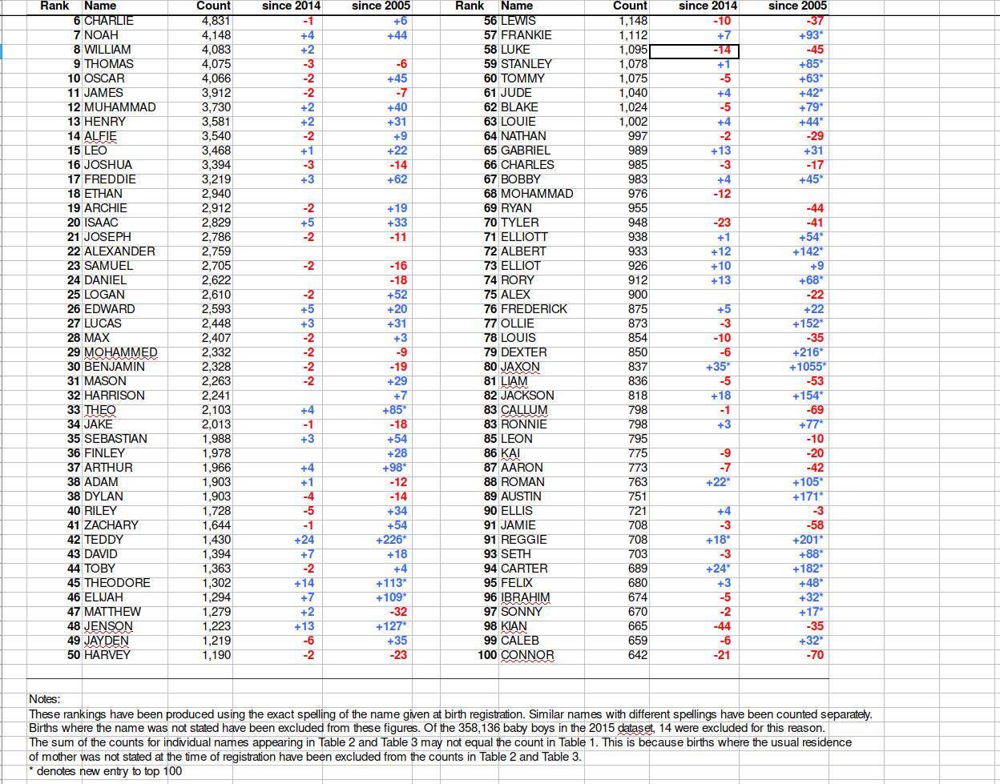

Workshop description
====================

Data scientists are known and celebrated for modeling and visually
displaying information, but down in the data science engine room there
is a lot of less glamorous work to be done. Before data can be used
effectively it must often be cleaned, corrected, and reformatted. This
workshop introduces the basic tools needed to make your data behave,
including data reshaping, regular expressions and other text
manipulation tools.

Prerequisites and Preparation
=============================

Prior to the workshop you should:

- install R from <https://cran.r-project.org/>
- install RStudio from <https://www.rstudio.com/products/rstudio/download/#download>
- install the tidyverse package in R with `install.packages("tidyverse")`

The lesson notes are available at
http://tutorials.iq.harvard.edu/R/RDataManagement/RDataManagement.html

This is an intermediate/advanced R course appropriate for those with
basic knowledge of R. If you need a refresher we recommend the
[the IQSS R intro](http://tutorials.iq.harvard.edu/R/Rintro/Rintro.html).

Example project overview
========================

It is common for data to be made available on a website somewhere, either by a
government agency, research group, or other organizations and entities. Often
the data you want is spread over many files, and retrieving it all one file at a
time is tedious and time consuming. Such is the case with the baby names data we
will be using today.

The UK [Office for National Statistics](https://www.ons.gov.uk) provides yearly
data on the most popular baby names going back to 1996. The data is provided
separately for boys and girls and is stored in Excel spreadsheets.

I have downloaded all the excel files containing boys names data from
https://www.ons.gov.uk/peoplepopulationandcommunity/birthsdeathsandmarriages/livebirths/datasets/babynamesenglandandwalesbabynamesstatisticsboys 
and made them available at 
http://tutorials.iq.harvard.edu/R/RDataManagement/data/boysNames.zip.

Our mission is to extract and graph the top 100 boys names in England
and Wales for every year since 1996. There are several things that
make this challenging.

Problems with the data
======================

While it was good of the UK Office for National Statistics to provide
baby name data, they were not very diligent about arranging it in a
convenient or consistent format.


Exercise 0
----------

1.  Download and extract the data from 
    http://tutorials.iq.harvard.edu/R/RDataManagement/data/boysNames.zip

```{r}
## You can download the file using a web browser, and extract using your file browser.
## For bonus points you can try doing it using R, but this is not required.
```

2.  Locate the file named `1996boys_tcm77-254026.xlsx` and open it in
    a spreadsheet. (If you don't have a spreadsheet program installed on
    your computer you can downloads one from
    https://www.libreoffice.org/download/download/). What issues can you
    identify that might make working with these data more difficult?

3.  Locate the file named `2015boysnamesfinal.xlsx` and open it in a
    spreadsheet. In what ways is the format different than the format
    of `1996boys_tcm77-254026.xlsx`? How might these differences make
    it more difficult to work with these data?


Exercise 0 solution<span class="tag" data-tag-name="prototype"></span>
----------------------------------------------------------------------

> 1.  Download and extract the data from 
>     http://tutorials.iq.harvard.edu/R/RDataManagement/data/boysNames.zip

> 2.  Locate the file named `1996boys_tcm77-254026.xlsx` and open it in
>     a spreadsheet. (If you don't have a spreadsheet program installed on
>     your computer you can downloads one from
>     https://www.libreoffice.org/download/download/). What issues can you
>     identify that might make working with these data more difficult?

The data does not start on row one. Headers are on row 7, followed by
a blank line, followed by the actual data.

The data is stored in an inconvenient way, with ranks 1-50 in the
first set of columns and ranks 51-100 in a separate set of columns.

There are notes below the data.

> 3.  Locate the file named `2015boysnamesfinal.xlsx` and open it in a
>     spreadsheet. In what ways is the format different than the format
>     of `1996boys_tcm77-254026.xlsx`? How might these differences make
>     it more difficult to work with these data?

The worksheet containing the data of interest is in different
positions and has different names from one year to the next. However,
it always includes "Table 1" in the worksheet name.

Some years include columns for "changes in rank", others do not.

These differences will make it more difficult to automate
re-arranging the data since we have to write code that can handle
different input formats.


Useful data manipulation packages
=================================

As you can see, the data is in quite a messy state. Note that this is
not a contrived example; this is exactly the way the data came to us
from the UK government website! Let's start cleaning and organizing
it. The `tidyverse` suite of packages provides many modern
conveniences that will make this job easier.

```{r}
library(tidyverse)
```

Working with Excel worksheets
=============================

Each Excel file contains a worksheet with the baby names data we want.
Each file also contains additional supplemental worksheets that we are
not currently interested in. As noted above, the worksheet of interest
differs from year to year, but always has "Table 1" in the sheet name.

The first step is to get a vector of file names.

```{r get list of data file names}
boy.file.names <- list.files("data/boys", full.names = TRUE)
```

Now that we've told R the names of the data files we can start working
with them. For example, the first file is

```{r}
boy.file.names[[1]]
```

and we can use the `excel_sheets` function from the *readxl* package
to list the worksheet names from this file.

```{r
library(readxl)

excel_sheets(boy.file.names[[1]])
```

Iterating over file names with `map`
-----------------------------------

Now that we know how to retrieve the names of the worksheets in an
Excel file we could start writing code to extract the sheet names from
each file, e.g.,

```{r}
excel_sheets(boy.file.names[[1]])
excel_sheets(boy.file.names[[2]])
## ...
excel_sheets(boy.file.names[[20]])
```

This is not a terrible idea for a small number of files, but it is
more convenient to let R do the iteration for us. We could use a `for`
loop, or `sapply`, but the `map` family of functions from the *purrr*
package gives us a more consistent alternative, so we'll use that.

```{r}
library(purrr)
map(boy.file.names, excel_sheets)
```

Filtering strings using regular expressions
--------------------------------------------

In order extract the correct worksheet names we need a way to extract
strings containing "Table 1". Base R provides some string manipulation
capabilities (see `?regex`, `?sub` and `?grep`), but we will use the
*stringr* package because it is more user-friendly.

The *stringr* package provides functions to *detect*, *locate*,
*extract*, *match*, *replace*, *combine* and *split* strings (among
other things). 

Here we want to detect the pattern "Table 1", and only
return elements with this pattern. We can do that using the
`str_subset` function. The first argument to `str_subset` is character
vector we want to search in. The second argument is a *regular
expression* matching the pattern we want to retain.

If you are not familiar with regular expressions, <http://www.regexr.com/> is a
good place to start.

Now that we know how to filter character vectors using `str_subset` we can
identify the correct sheet in a particular Excel file. For example,

```{r}
library(stringr)
str_subset(excel_sheets(boy.file.names[[1]]), "Table 1")
```


Writing your own functions
--------------------------

The `map*` functions are useful when you want to apply a function to a
list or vector of inputs and obtain the return values. This is very
convenient when a function already exists that does exactly what you
want. In the examples above we mapped the `excel_sheets` function to
the elements of a vector containing file names. But now there is no
function that both retrieves worksheet names and subsets them.
Fortunately, writing functions in R is easy.

```{r}
get.data.sheet.name <- function(file, pattern) {
    str_subset(excel_sheets(file), pattern)
}

```

Now we can map this new function over our vector of file names.

```{r}
map(boy.file.names,
    get.data.sheet.name,
    pattern = "Table 1")
```

Reading Excel data files
========================

Now that we know the correct worksheet from each file we can actually
read those data into R. We can do that using the `read_excel`
function.

We'll start by reading the data from the first file, just to check
that it works. Recall that the actual data starts on row 7, so we want
to skip the first 6 rows.

```{r}
tmp <- read_excel(
    boy.file.names[1],
    sheet = get.data.sheet.name(boy.file.names[1],
                                pattern = "Table 1"),
    skip = 6)

library(dplyr, quietly=TRUE)
glimpse(tmp)
```


Exercise 1
-----------

  1. Write a function that takes a file name as an argument and reads
     the worksheet containing "Table 1" from that file. Don't forget
     to skip the first 6 rows.
     
  2. Test your function by using it to read *one* of the boys names
     Excel files.
     
  3. Use the `map` function to read data from all the Excel files,
     using the function you wrote in step 1.


Exercise 1 solution<span class="tag" data-tag-name="prototype"></span>

```{r, results = 'hide', purl = FALSE}
  ## 1. Write a function that takes a file name as an argument and reads
  ##    the worksheet containing "Table 1" from that file.
  read.baby.names <- function(file) {
      sheet.name <- str_subset(excel_sheets(file), "Table 1")
      read_excel(file, sheet = sheet.name, skip = 6)
  }
  
  ## 2. Test your function by using it to read *one* of the boys names
  ##    Excel files.
  glimpse(read.baby.names(boy.file.names[1]))
     
  ## 3. Use the `map` function to read data from all the Excel files,
  ##    using the function you wrote in step 1.
  boysNames <- map(boy.file.names, read.baby.names)

```

Data cleanup
================

Now that we've read in the data we still have some cleanup to do.
Specifically, we need to:

1. fix column names
2. get rid of blank row and the top and the notes at the bottom
3. get rid of extraneous "changes in rank" columns if they exist
4. transform the side-by-side tables layout to a single table.

In short, we want to go from this:



to this:


There are many ways to do this kind of data manipulation in R. We're
going to use the *dplyr* and *tidyr* packages to make our lives
easier. (Both packages were installed as dependencies of the
*tidyverse* package.)

Fixing column names
-------------------------

The column names are in bad shape. In R we need column names to a)
start with a letter, b) contain only letters, numbers, underscores and
periods, and c) uniquely identify each column.

The actual column names look like this:
```{r examine the names from the excel sheet}
names(boysNames[[1]])
```

So we need to a) make sure each column has a name, and b) distinguish
between the first and second occurrences of "Name" and "Count". We
could do this step-by-step, but there is a handy function in R called
`make.names` that will do it for us.

```{r cleanup the names}
boysNames[[1]] <- setNames(
    boysNames[[1]],
    make.names(names(boysNames[[1]]),
               unique = TRUE))

names(boysNames[[1]])
```


Fixing all the names
--------------------

Of course we need to iterate over each data.frame in the `boysNames`
list and do this for each one. Fortunately the `map` function makes
this easy.

```{r use map to cleanup all the names}
boysNames <- map(
    boysNames,
    function(x) {
        setNames(x,
                 make.names(names(x),
                            unique = TRUE))
    }
)

```

Selecting columns
---------------

Next we want to retain just the `Name`, `Name__1` and `Count`,
`Count__1` columns. We can do that using the `select` function:

```{r select just the columns of interest}
boysNames[[1]]

boysNames[[1]] <- select(boysNames[[1]], Name, Name__1, Count, Count__1)
boysNames[[1]]
```

Dropping missing values
-----------------------

Next we want to remove blank rows and rows used for notes. An easy way
to do that is to use `drop_na` to remove rows with missing values.

```{r remove empty rows}
boysNames[[1]]

boysNames[[1]] <- drop_na(boysNames[[1]])
boysNames[[1]]
```

Finally, we will want to filter out missing do this for all the elements in `boysNames`, a
task I leave to you.

Exercise 2
-----------

  1. Write a function that takes a `data.frame` as an argument and
     returns a modified version including only columns named "Name",
     "Name\_\_1", "Count", or "Count\_\_1". 
     
  2. Test your function by using it to read *one* of the boys names
     Excel files.
     
  3. Use the `map` function to read data from all the Excel files,
     using the function you wrote in step 1.


Exercise 2 solution<span class="tag" data-tag-name="prototype"></span>

```{r, results = 'hide', purl = FALSE}
  ## 1. Write a function that takes a file name as an argument and reads
  ##    the worksheet containing "Table 1" from that file.
  read.baby.names <- function(file) {
      sheet.name <- str_subset(excel_sheets(file), "Table 1")
      read_excel(file, sheet = sheet.name, skip = 6)
  }
  
  ## 2. Test your function by using it to read *one* of the boys names
  ##    Excel files.
  glimpse(read.baby.names(boy.file.names[1]))
     
  ## 3. Use the `map` function to read data from all the Excel files,
  ##    using the function you wrote in step 1.
  boys.data <- map(boy.file.names, read.baby.names)

```


Re-arranging into a single table
-----------------------------------------

Our final task is to re-arrange to data so that it is all in a single
table instead of in two side-by-side tables. For many similar tasks
the `gather` function in the *tidyr* package is useful, but in this
case we will be better off using a combination of `select` and
`bind_rows`.

```{r stack to two halves of the data}
boysNames[[1]]
bind_rows(select(boysNames[[1]], Name, Count),
          select(boysNames[[1]], Name = Name__1, Count = Count__1))
```

Exercise: Cleanup all the data
=========================================

In the previous examples we learned how to drop empty rows with
`filter`, select only relevant columns with `select`, and re-arrange
our data with `select` and `bind_rows`. In each case we applied the
changes only to the first element of our `boysNames` list.

Your task now is to use the `map` function to apply each of these
transformations to all the elements in `boysNames`.


Exercise prototype
------------------
There are different ways you can go about it. Here is one:


```{r}

## write a function that does all the cleanup
cleanupNamesData <- function(x) {
    filtered <- filter(x, !is.na(Name)) # drop rows with no Name value
    selected <- select(filtered, Name, Count, Name__1, Count__1) # select just Name and Count columns
    bind_rows(select(selected, Name,  Count), # re-arrange into two columns
              select(selected, Name = Name__1, Count = Count__1))
}

## test it out on the second data.frame in the list
glimpse(boysNames[[2]]) # before cleanup
glimpse(cleanupNamesData(boysNames[[2]])) # after cleanup

## apply the cleanup function to all the data.frames in the list
boysNames <- map(boysNames, cleanupNamesData)
```


Adding derived columns
======================

It is often useful to add columns that are derived from one or more
existing columns. For example, we may wish to add a column to store
the length of each name:

```{r}
boysNames <- map(boysNames, mutate, Length = str_count(Name))
```

Exercise: Add a year column
=========================================

We originally read the data from each file listed in `boy.file.names`,
and the data is still in that order. Use the information contained in
`boy.file.names` to add a `Year` column to each table in `boysNames`.
(Hint: see `?map2`.)

--------
--------

Exercise prototype
------------------
There are different ways you can go about it. Here is one:


```{r}
## Extract years
years <- as.integer(str_extract(boy.file.names, "[0-9]{4}"))

## Insert year column in each table
boysNames <- map2(boysNames, years, function(x, y) mutate(x, Year = y))
```


Data organization and storage
=============================

Now that we have the data cleaned up and augmented, we can turn our
attention to organizing and storing the data.

Right now we have a list of tables, one for each year. This is not a
bad way to go. It has the advantage of making it easy to work with
individual years without needing to load data from other years. We can
store the data organized by year in `.csv` files, `.rds` files, or in
database tables. 

One table for each year
-----------------------

Right now we have a list of tables, one for each year. This is not a
bad way to go. It has the advantage of making it easy to work with
individual years without needing to load data from other years. It has
the disadvantage of making it more difficult to examine questions the
require data from multiple years.

We can store the data organized by year in `.csv` files, `.rds` files,
or in database tables. For now let's store these data in `.csv` files
and then see how easy it is to work with them.


```{r}
## make directory to store the data
dir.create("./data/byyear", recursive = TRUE)
## extract the years
years <- map_int(boysNames, function(x) unique(x$Year))
## construct paths
paths <- str_c("data/byyear/boys_names_", years, ".csv", sep = "")
## write out the data
walk2(boysNames, paths, write_csv)

## clear our workspace
rm(list = ls())
```

Exercise: work with tables organized by year
-------------------------

1. What where the five most popular names in 2013?
2. How has the popularity of the name "ANDREW" changed over time?

-------------------
-------------------

Exercise prototype
------------------
Number one is easy, number two is harder:

```{r}
## 1. What where the five most popular names in 2013?
boys2013 <- read_csv("./data/byyear/boys_names_2013.csv")
slice(arrange(boys2013, desc(Count)), 1:5)

## 2. How has the popularity of the name "ANDREW" changed over time?
boysNames <- map(list.files("./data/byyear", full.names = TRUE),
                 read_csv)

andrew <- map(boysNames, filter, Name == "ANDREW")
andrew <- bind_rows(andrew)

ggplot(andrew, aes(x = Year, y = Count)) +
    geom_line() +
    ggtitle("Popularity of \"Andrew\", over time")
```

One big table
-------------

By far the easiest approach is to store the data in one big table.
We've already seen how we can combine a list of tables into one big
one.


Exercise: Make one big table
-------------------------

Turn the list of boys names data.frames into a single table. 

Create a directory under `data/all` and write the data to a `.csv`
file.


Finally, repeat the previous exercise, this time working with the data
in one big table.

--------
--------

Exercise prototype
------------------

Working with the data in one big table is often easier.


```{r}
boysNames <- bind_rows(boysNames)

dir.create("data/all")

write_csv(boysNames, "data/all/boys_names.csv")

## What where the five most popular names in 2013?
slice(arrange(filter(boysNames, Year == 2013),
              desc(Count)),
      1:5)

## How has the popularity of the name "ANDREW" changed over time?
andrew <- filter(boysNames, Name == "ANDREW")

ggplot(andrew, aes(x = Year, y = Count)) +
    geom_line() +
    ggtitle("Popularity of \"Andrew\", over time")
```


Additional reading and resources
================================

-   Learn from the best: <http://adv-r.had.co.nz/>;
    <http://r4ds.had.co.nz/>
-   R documentation: <http://cran.r-project.org/manuals.html>
-   Collection of R tutorials:
    <http://cran.r-project.org/other-docs.html>

-   R for Programmers (by Norman Matloff, UC--Davis)

<http://heather.cs.ucdavis.edu/~matloff/R/RProg.pdf>

-   Calling C and Fortran from R (by Charles Geyer, UMinn)

<http://www.stat.umn.edu/~charlie/rc/>

-   State of the Art in Parallel Computing with R (Schmidberger et al.)

<http://www.jstatso>|.org/v31/i01/paper

-   Institute for Quantitative Social Science: <http://iq.harvard.edu>
-   IQSS Data Science Services: <http://dss.iq.harvard.edu/>
