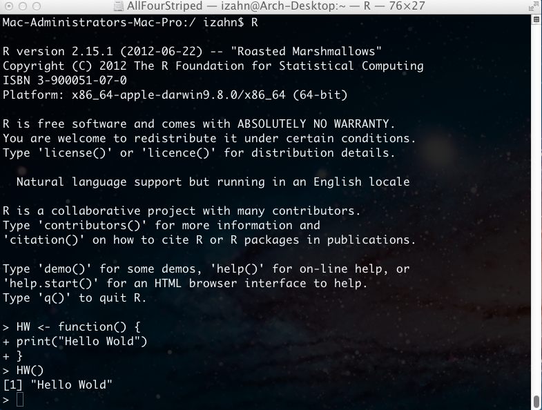
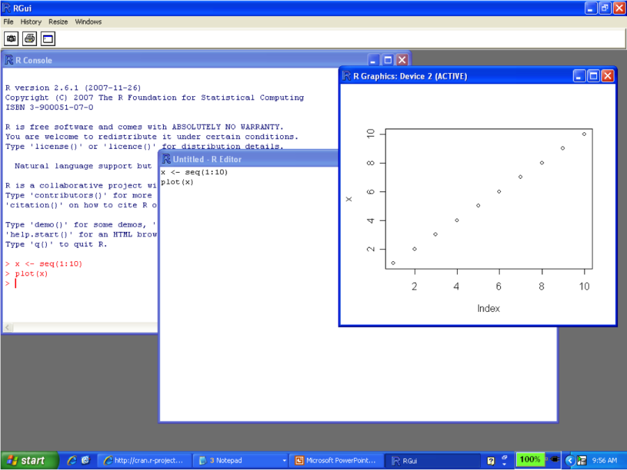
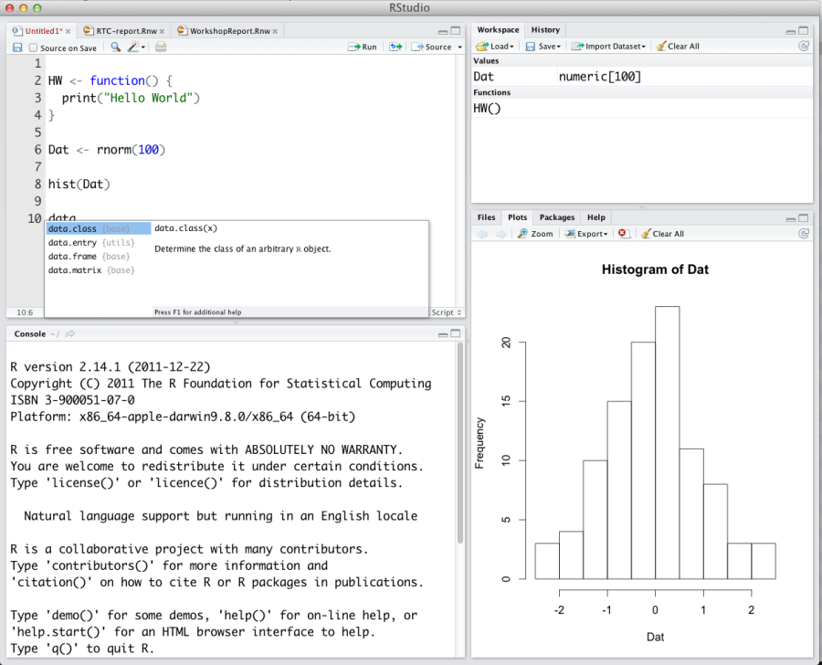
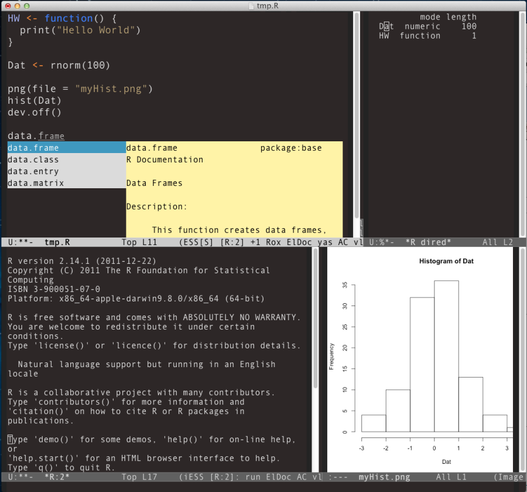
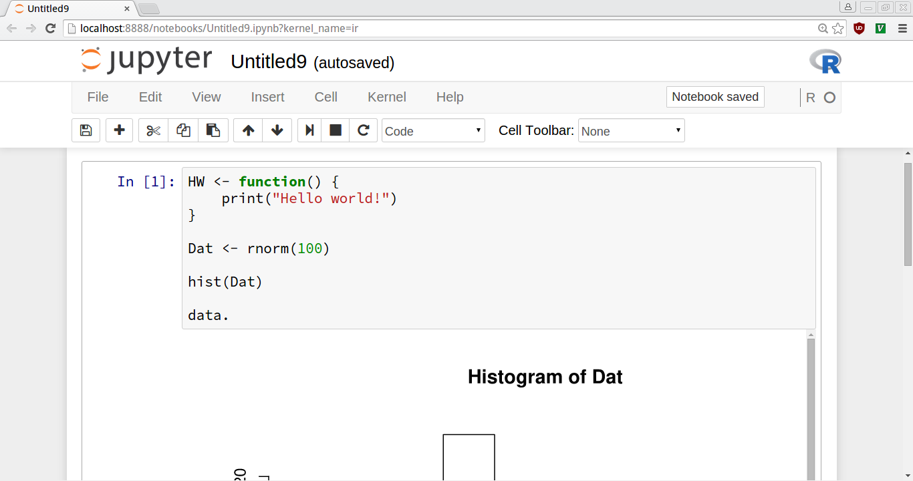

Materials and setup 
-------------------

**NOTE: skip this section if you are not running R locally** (e.g., if you are
running R in your browser using a remote Jupyter server)

You should have R installed --if not:

-   Download and install R from http://cran.r-project.org
-   Download and install RStudio from https://www.rstudio.com/products/rstudio/download/#download

Start RStudio and open a new R script:
- On Windows click the start button and search for rstudio. On Mac RStudio will be in your applications folder.
- In Rstudio go to `File -> New file -> R script`.

Group chat and notes:

- Group chat / collaborative note taking for this workshop is available at https://etherpad.wikimedia.org/p/cf-2017-rintro
- Instructor's live code available at http://tutorials-live.iq.harvard.edu/workshop_notes/Rintro.R
- Full notes available at http://tutorials.iq.harvard.edu/R/Rintro/Rintro.html


What is R?
----------

R is a *programming language designed for statistical computing*.
Notable characteristics include:

-   Vast capabilities, wide range of statistical and graphical
    techniques
-   Very popular in academia, growing popularity in business:
    <http://r4stats.com/articles/popularity/>
-   Written primarily by statisticians
-   FREE (no cost, open source)
-   Excellent community support: mailing list, blogs, tutorials
-   Easy to extend by writing new functions


InspiRation
-----------

OK, it's free and popular, but what makes R worth learning? In a word,
"packages". If you have a data manipulation, analysis or visualization task,
chances are good that there is an R package for that. Lets install some packages
and look at some examples.

```{r, results = 'hide'}
## install.packages(c("ggmap", "plotly", "rgl", "forecast"))
```

### Where are we? ###

```{r}
library(ggmap)
nwbuilding <- geocode("1737 Cambridge Street Cambridge, MA 02138", source = "google") 
ggmap(get_map("Cambridge, MA", zoom = 15)) +
  geom_point(data=nwbuilding, size = 7, shape = 13, color = "red")
```

### What will world population be in 2020? ###


```{r}
library(forecast)
library(plotly)

## from https://esa.un.org/unpd/wpp/Download/Standard/Population/
worldpop <- structure(c(2.525149312, 2.571867515, 2.617940399, 2.66402901,
2.710677773, 2.758314525, 2.807246148, 2.85766291, 2.909651396,
2.963216053, 3.018343828, 3.075073173, 3.133554362, 3.194075347,
3.256988501, 3.322495121, 3.390685523, 3.461343172, 3.533966901,
3.607865513, 3.682487691, 3.757734668, 3.833594894, 3.90972212,
3.985733775, 4.061399228, 4.13654207, 4.211322427, 4.286282447,
4.362189531, 4.439632465, 4.518602042, 4.599003374, 4.681210508,
4.765657562, 4.852540569, 4.942056118, 5.033804944, 5.126632694,
5.218978019, 5.309667699, 5.398328753, 5.485115276, 5.57004538,
5.653315893, 5.735123084, 5.815392305, 5.894155105, 5.971882825,
6.049205203, 6.126622121, 6.204310739, 6.282301767, 6.360764684,
6.439842408, 6.51963585, 6.600220247, 6.68160732, 6.763732879,
6.846479521, 6.92972504300001, 7.013427052, 7.097500453, 7.181715139,
7.265785946, 7.349472099), .Tsp = c(1950, 2015, 1), class = "ts")

## Projected numbers (in billions) of humans living on earth
fit <- auto.arima(worldpop)
ggplotly(autoplot(forecast(fit)))
```

-   Want to interactively explore the shape of the Churyumov–Gerasimenko
    comet?

```{r}
comet <- rgl::readOBJ(url("http://sci.esa.int/science-e/www/object/doc.cfm?fobjectid=54726"))
plot_ly(x = comet$vb[1,],
        y = comet$vb[2,],
        z = comet$vb[3,],
        i = comet$it[1,]-1,
        j= comet$it[2,]-1,
        k = comet$it[3,]-1,
        type = "mesh3d")
```

Whatever you're trying to do, you're probably not the first to try doing
it R. Chances are good that someone has already written a package for
that.

Coming to R
-----------

Coming from...

Stata
:   <http://www.princeton.edu/~otorres/RStata.pdf>

SAS/SPSS
:   <http://www.et.bs.ehu.es/~etptupaf/pub/R/RforSAS&SPSSusers.pdf>

matlab
:   <http://www.math.umaine.edu/~hiebeler/comp/matlabR.pdf>

Python
:   <http://mathesaurus.sourceforge.net/matlab-python-xref.pdf>

Graphical User Interfaces (GUIs)
================================

R GUI alternatives
------------------

The old-school way is to run R directly in a terminal



But hardly anybody does it that way anymore! The Windows version of R
comes with a GUI that looks like this:



The default windows GUI is not very good

-   No parentheses matching or syntax highlighting
-   No work-space browser

RStudio (an alternative GUI for R) is shown below.



Rstudio has many useful features, including parentheses matching and
auto-completion. Rstudio is not the only advanced R interface; other
alteratives include Emacs with ESS (shown below).



Emacs + ESS is a very powerful combination, but can be difficult to set
up.



Jupyter is a notebook interface that runs in your web browser. A lot of
people like it. You can access these workshop notes as a Jupyter
notebook at
<http://tutorials-live.iq.harvard.edu:8000/notebooks/workshops/R/Rintro/Rintro.ipynb>

Launch RStudio (skip if not using Rstudio)
----------------------------------------------------------------
**Note: skip this section if you are not using Rstudio (e.g., if you are running
these examples in a Jupyter notebook).**


-   Open the RStudio program
-   Open up today's R script
    -   In RStudio, Go to **File =&gt; Open Script**
    -   Locate and open the `Rintro.R` script in the Rintro folder on
        your desktop
-   Go to **Tools =&gt; Set working directory =&gt; To source file
    location** (more on the working directory later)
-   I encourage you to add your own notes to this file! Every line that
    starts with `#` is a comment that will be ignored by R. My comments
    all start with `##`; you can add your own, possibly using `#` or
    `###` to distinguish your comments from mine.

Now that we know what we're getting into and have our environment set up, let's
get to work.


Exercise 0
----------

The purpose of this exercise is mostly to give you an opportunity to
explore the interface provided by RStudio (or whichever GUI you've
decided to use). You may not know how to do these things; that's fine!
This is an opportunity to learn. If you don't know how to do something
you can can use internet search engines, search on
[StackOverflow](http:stackoverflow.com), or ask the person next to you.

Also keep in mind that we are living in a golden age of tab completion.
If you don't know the name of an R function, try guessing the first two
or three letters and pressing TAB. If you guessed correctly the function
you are looking for should appear in a pop up!

1.  Try to get R to add 2 plus 2.
```{r}
## write your answer here

```
2.  Try to calculate the square root of 10.
```{r}
## write your answer here

```
3.  There is an R package named `car`. Try to install this package.
```{r}
## write your answer here

```
4.  R includes extensive documentation, including a file named "An
    introduction to R". Try to find this help file.
5.  Open a new web browser or tab, go to <http://cran.r-project.org/web/views/> and
    skim the topic closest to your field/interests.

\

\

\

\

Exercise 0 solution<span class="tag" data-tag-name="prototype"></span>
----------------------------------------------------------------------

1. Add 2 plus 2.

```{r, purl = FALSE}
## 1. 2 plus 2
2 + 2
## or
sum(2, 2)

## 2. square root of 10:
sqrt(10)
## or
10^(1/2)

## 3. Install the "car" package:

## In Rstudio, go to the "Packages" tab and click the "Istall" button.
## Search in the pop-up window and click "Install".

## Alternatively, use the `install.packages` function like this:
install.packages("car")

## 4. Find "An Introduction to R".

## Go to the main help page by running 'help.start() or using the GUI
## menu, find and click on the link to "An Introduction to R".

## 5. Go to <http://cran.r-project.org/web/views/> and skim the topic
##     closest to your field/interests.

## I like the machine learning topic.
```

Example project overview: baby names!
------------------------

I would like to know what the most popular baby names are. In the course of
answering this question we will learn to call R functions, install and load
packages, assign values to names, read and write data, and more. 

The examples in this workshop use the baby names data provided by the
governments of the United States and the United Kingdom. A cleaned and
merged version of these data is in `dataSets/babyNames.csv`.

Our first goal is to read these data into R. In order to do that we need to
learn how to *call functions*, *install packages*, set out *working directory*, *read* as `.csv`
file, and *assign* the result to a name. Lets get to it.


R installing and using packages
==========

There are thousands of R packages that extend R's capabilities. Some
packages are distributed with R, and some of these are attached to the
search path by default. Many more are available in package repositories.

In order to make reading and analyzing our baby names data easier we will
install and use a collection of packages called `tidyverse`. *tidyverse* is a
meta package that loads the *dplyr* package for easier data manipulation the
*readr* package for easier data import/export, and several other useful
packages.

Packages can be installed using the `install.packages` function. 

Functions
---------

The general form for calling R functions is

```{r eval=FALSE}
## FunctionName(arg.1 = value.1, arg.2 = value.2, ..., arg.n - value.n)
```

Arguments can be matched by position or name. Lets see how that works, using the
`install.packages` function.

Installing and using R packages
---------------------------------------

Since this is the first time we are using the `install.packages` function we
will start by looking up its help page. This is almost always the first thing
you should do when using a function for the first time. You can look up the help
page for a function like this:

```{r}
?install.packages
```

As we can see from the documentation, the first (and only required) argument is
named `pkgs`. Additional arguments specify where this package should be
installed from (`repos`) and to (`lib`) among other things.

OK, lets install the "car" package from the repo at
"https://cran.rstudio.com". 

```{r}
install.packages("car", repos = "https://cran.rstudio.com")
```

**Installing a package** puts a copy of the package on your local computer, but
**does not make it available for use**. To use an installed package you must
attach it using the `library` function.


```{r eval=FALSE}
library("car")
```

Asking R for help
---------------------

Now that we've installed the `car` package, how do we use it? We've already seen
that we can look up the help page using `?`. This is actually a shortcut to the
`help` function:

```{r}
help(help)
```

The `help` function can be used to look up the documentation for a function, or
to look up the documentation to a package. We can learn how to use the `car`
package by reading its documentation like this:

```{r, eval=FALSE}
help(package = "car")
```

Exercise 1
----------

The purpose of this exercise is to practice using the package management
and help facilities.

1.  Install the `tidyverse` package.
```{r}
## write your answer here

```
2.  Use the `library` function to attach the `tidyverse` package.
```{r}
## write your answer here

```
3.  Look up the help page for the *readr* package (*readr* is attached by the
    *tidyverse* package). Which function would you use to read a comma separated
    values (`.csv`) file?
```{r}
## write your answer here

```

\

\

\

\

\

Exercise 1 solution<span class="tag" data-tag-name="prototype"></span>
----------------------------------------------------------------------

```{r, purl = FALSE}
## 1. install the tidyverse pacakge
install.packages("tidyverse")

## 2. attach the tidyverse pacakge
library("tidyverse")

## 3. look up the readr package documentation
help(package = "readr")
## I would use read_tsv to read a tab delimited file.
```

Now that we have installed and attached the `tidyverse` (and `readr`) packages,
and know which function to use to read our data (`read_csv`) we are almost ready
to read in the baby names data. Before we do that lets take a small excision to
learn about assignment and basic data types in R.

Data types and assignment
==================

Assignment
----------

Values can be assigned names and used in subsequent operations

-   The `<-` operator (less than followed by a dash) is used to save
    values
-   The name on the left gets the value on the right.

```{r}
x <- 10 # Assign the value 10 to a variable named x
x + 1 # Add 1 to x
```

```{r}
x # note that x is unchanged
```

```{r}
y <- x + 1 # Assign y the value x + 1
y
```

```{r}
x <- x + 100 # change the value of x
y ## note that y is unchanged.
```

Data types and conversion
-------------------------

The `x` and `y` data objects we created are numeric *vectors* of length
one. Vectors are the simplest data structure in R, and are the building
blocks used to make more complex data structures. Here are some more
vector examples.

```{r}
x <- c(10, 11, 12)
y <- c("10", "11", "12")
z <- c(TRUE, FALSE, TRUE, TRUE)
```

Notice that the `c` function combines its arguments into a vector.

All R objects have a *type* (aka *mode*) and *length*. Since it is impossible
for an object not to have these attributes they are called *intrinsic
attributes*. They can be retrieved using the `typeof` and `length` functions.

```{r}
c(x = x, type = typeof(x), length = length(x))

c(y = y, type = typeof(y), length = length(y))

c(z = z, type = typeof(z), length = length(z))
```

Data structures in R can be converted from one type to another using one
of the many functions beginning with `as.`. For example:

```{r}
typeof(x)
typeof(as.character(x))
```

```{r}
typeof(y)
typeof(as.numeric(y))
```

These vectors (*double*, *character*, *logical*) are called *atomic vectors*
because each element must be of the same type. Given inputs with conflicting
types R will convert them for you.

```{r}
typeof(c(1, 2))
typeof(c(1, "2"))
```


Now that we know how to do assignment using `<-` and how to understand basic
data types in R we are finally ready to read in the baby names data.

Getting data into R
===================

The "working directory" and listing files
-----------------------------------------

R knows the directory it was started in, and refers to this as the
"working directory". Since our workshop examples are in the Rintro folder, we
should all take a moment to set that as our working directory.


```{r eval=FALSE}
getwd() # what is my current working directory?
# setwd("~/Desktop/Rintro") # change directory
```

Note that "`~`" means "my home directory" but that this can mean
different things on different operating systems. You can also use the
Files tab in Rstudio to navigate to a directory, then click "More -&gt;
Set as working directory".

We can a set the working directory using paths relative to the current
working directory. Once we are in the "Rintro" folder we can navigate to
the "dataSets" folder like this:

```{r}
getwd() # get the current working directory
```

```{r}
setwd("dataSets") # set wd to the dataSets folder
getwd()

setwd("..") # set wd to enclosing folder ("up")
getwd()
```

It can be convenient to list files in a directory without leaving R

```{r}
list.files("dataSets") # list files in the dataSets folder
```

Readers for common file types
-----------------------------

In order to read data from a file, you have to know what kind of file it
is. The table below lists the functions that can import data from common
file formats.

  data type                 function         package
  ------------------------- ---------------  -----------------------------------------------------
  comma separated (.csv)    `read_csv()`     readr (tidyverse)
  other delimited formats   `read_delim()`   readr (tidyverse)
  R (.Rds)                  `read_rds()`     readr (tidyverse)
  Stata (.dta)              `read_stata()`   haven (tidyverse, needs to be attached separately)
  SPSS (.sav)               `read_spss()`    haven (tidyverse, needs to be attached separately)
  SAS (.sas7bdat)           `read_sas()`     haven (tidyverse, needs to be attached separately)
  Excel (.xls, .xlsx)       `read_excel()`   readxl (tidyverse, needs to be attached separately)

Exercise 2
----------

The purpose of this exercise is to practice reading data into R. The
data in "`dataSets/babyNames.csv`" is moderately tricky to read, making
it a good data set to practice on.

1.  Open the help page for the `read_csv` function. How can you limit
    the number of rows to be read in?
```{r}
## write your answer here

```    
2.  Read just the first 10 rows of "`dataSets/babyNames.csv`". Notice
    that the "Sex" column has been read as a logical (TRUE/FALSE).
```{r}
## write your answer here

```
3.  Read the `read_csv` help page to figure out how to make it read the
    "Sex" column as a character. Make adjustments to your code until you
    have read in the first 10 rows with the correct column types. "Year"
    and "Name.length" should be integer (int), "Count" and "Percent"
    should be double (dbl) and everything else should be
    character (chr).
```{r}
## write your answer here

```
4.  Once you have successfully read in the first 10 rows, read the whole
    file, assigning the result to the name `baby.names`.
```{r}
## write your answer here

```

\

\

\

\

\


Exercise 2 solution<span class="tag" data-tag-name="prototype"></span>
----------------------------------------------------------------------

```{r, results = 'hide', purl = FALSE}
## read ?read_csv
## limit rows with n_max argument
read_csv("http://tutorials.iq.harvard.edu/R/Rintro/dataSets/babyNames.csv", n_max = 10)

## specify column types in the col_types argument
read_csv("http://tutorials.iq.harvard.edu/R/Rintro/dataSets/babyNames.csv", n_max = 10, col_types = "??c????")

## read all the data
baby.names <- read_csv("http://tutorials.iq.harvard.edu/R/Rintro/dataSets/babyNames.csv", col_types = "??c????")
```

Checking imported data
----------------------

It is always a good idea to examine the imported data set--usually we
want the results to be a `data.frame`

```{r}
## we know that this object will have type and length, because all R objects do.
typeof(baby.names)
length(baby.names) # number of columns
```

```{r}
## additional information about this data object
class(baby.names) # check to see that test is a data.frame
```

```{r}
dim(baby.names) # how many rows and columns?
```

```{r}
names(baby.names) # or colnames(baby.names)
```

```{r}
str(baby.names) # more details
```

```{r}
glimpse(baby.names) # details, more compactly
```

Data Manipulation
=================

data.frame objects
------------------

Usually data read into R will be stored as a **data.frame**

-   A data.frame is a list of vectors of equal length
    -   Each vector in the list forms a column
    -   Each column can be a differnt type of vector
    -   Typically columns are variables and the rows are observations

A data.frame has two dimensions corresponding the number of rows and the
number of columns (in that order)

Slice and Filter data.frames rows
---------------------------------

You can extract subsets of data.frames using `slice` to select rows by
number and `filter` to select rows that match some condition. It works
like this:

```{r}
## make up some example data
(example.df <- data.frame(id  = rep(letters[1:4], each = 4),
                          t   = rep(1:4, times = 4),
                          var1 = runif(16),
                          var2 = sample(letters[1:3], 16, replace = TRUE)))
```

```{r}
## rows 2 and 4
slice(example.df, c(2, 4))
```

```{r}
## rows where id == "a"
filter(example.df, id == "a")
```

```{r}
## rows where id is either "a" or "b"
filter(example.df, id %in% c("a", "b"))
```

Select data.frame columns
-------------------------

`slice` and `filter` are used to extract rows. `select` is used to
extract columns

```{r}
select(example.df, id, var1)
```

```{r}
select(example.df, id, t, var1)
```

You can also conveniently select a single column using `$`, like this:

```{r}
example.df$t
```

Data manipulation commands can be combined:

```{r}
filter(select(example.df,
              id,
              var1),
       id == "a")
```

In the previous example we used == to filter rows where id was "a".
Other relational and logical operators are listed below.

  Operator   Meaning
  ---------- --------------------------
  ==         equal to
  !=         not equal to
  &gt;       greater than
  &gt;=      greater than or equal to
  &lt;       less than
  &lt;=      less than or equal to
  %in%       contained in
  &          and
  |          or

Adding, removing, and modifying data.frame columns
--------------------------------------------------

You can modify data.frames using the `mutate()` function. It works like
this:

```{r}
example.df
```

```{r}
## modify example.df and assign the modified data.frame the name example.df
example.df <- mutate(example.df,
       var2 = var1/t, # replace the values in var2
       var3 = 1:length(t), # create a new column named var3
       var4 = factor(letters[t]),
       t = NULL # delete the column named t
       )
```

```{r}
## examine our changes
example.df
```

Exporting Data
--------------

Now that we have made some changes to our data set, we might want to
save those changes to a file.

```{r}
# write data to a .csv file
write_csv(example.df, path = "example.csv")

# write data to an R file
write_rds(example.df, path = "example.rds")

# write data to a Stata file
library(haven)
write_dta(example.df, path = "example.dta")
```

Saving and loading R workspaces
-------------------------------

In addition to importing individual datasets, R can save and load entire
workspaces

```{r}
ls() # list objects in our workspace
save.image(file="myWorkspace.RData") # save workspace 
rm(list=ls()) # remove all objects from our workspace 
ls() # list stored objects to make sure they are deleted
```

Load the "myWorkspace.RData" file and check that it is restored

```{r}
load("myWorkspace.RData") # load myWorkspace.RData
ls() # list objects
```

Exercise 3: Data manipulation
-----------------------------

Read in the "babyNames.csv" file if you have not already done so,
assigning the result to `baby.names`. The file is located at "http://tutorials.iq.harvard.edu/R/Rintro/dataSets/babyNames.csv"

1.  Filter `baby.names` to show only names given to at least 5 percent
    of boys.
```{r}
## write your answer here

```
2.  Create a column named "Proportion" equal to Percent divided by 100.
```{r}
## write your answer here

```
3.  Filter `baby.names` to include only names given to at least 3
    percent of Girls. Save this to a Stata data set
    named "popularGirlNames.dta")
```{r}
## write your answer here

```

\

\

\

\

\

\

Exercise 3 solution<span class="tag" data-tag-name="prototype"></span>
----------------------------------------------------------------------

```{r, purl = FALSE}
filter(baby.names, Sex == "M" & Percent >= 5)

baby.names <- mutate(baby.names, Proportion = Percent/100)

popular.girl.names <- filter(baby.names, Sex == "F" & Percent >= 3)

write_csv(popular.girl.names, path = "popularGirlNames.dta")
```

Basic Statistics and Graphs
===========================

Basic statistics
----------------

Descriptive statistics of single variables are straightforward:

```{r}
sum(example.df$var1) # calculate sum of var 1
mean(example.df$var1)
median(example.df$var1)
```

```{r}
sd(example.df$var1) # calculate standard deviation of var1
var(example.df$var1)
```

```{r}
## summaries of individual columns
summary(example.df$var1)
```

```{r}
summary(example.df$var2)
```

```{r}
## summary of whole data.frame
summary(example.df)
```

Some of these functions (e.g., summary) will also work with data.frames
and other types of objects, others (such as `sd`) will not.

Statistics by grouping variable(s)
----------------------------------

The `summarize` function can be used to calculate statistics by grouping
variable. Here is how it works.

```{r}
summarize(group_by(example.df, id), mean(var1), sd(var1))
```

You can group by multiple variables:

```{r}
summarize(group_by(example.df, id, var3), mean(var1), sd(var1))
```

Save R output to a file
-----------------------

Earlier we learned how to write a data set to a file. But what if we
want to write something that isn't in a nice rectangular format, like
the output of `summary`? For that we can use the `sink()` function:

```{r}
sink(file="output.txt", split=TRUE) # start logging
print("This is the summary of example.df \n")
print(summary(example.df))
sink() ## sink with no arguments turns logging off
```

Exercise 4
----------

1.  Calculate the total number of children born.
```{r}
## write your answer here

```
2.  Filter the data to extract only Massachusetts (Location "MA"), and
    calculate the total number of children born in Massachusetts.
```{r}
## write your answer here

```
3.  Group and summarize the data to calculate the number of children
    born each year. Assign the result to the name `births.by.year`.
```{r}
## write your answer here

```
4.  Calculate the average number of characters in baby names (using the
    "Name.length" column).
```{r}
## write your answer here

```
5.  Group and summarize to calculate the average number of characters in
    baby names for each location. Assign the result to the name `name.length.by.location`.

\

\

\

\

\


Exercise 4 solution<span class="tag" data-tag-name="prototype"></span>
----------------------------------------------------------------------

```{r, purl = FALSE}
sum(baby.names$Count)

sum(filter(baby.names, Location == "MA")$Count)

births.by.year <- summarize(group_by(baby.names, Year), sum(Count))

mean(baby.names$Name.length)

name.length.by.location <- summarize(group_by(baby.names, Location), mean(Name.length))
```

Basic graphics: Frequency bars
------------------------------

Thanks to classes and methods, you can `plot()` many kinds of objects:

```{r}
plot(example.df$var4)
```

Basic graphics: Boxplots by group
---------------------------------

Thanks to classes and methods, you can `plot()` many kinds of objects:

```{r}
plot(select(example.df, id, var1))
```

Basic graphics: Mosaic chart
----------------------------

Thanks to classes and methods, you can `plot()` many kinds of objects:

```{r}
plot(select(example.df, id, var4))
```

Basic graphics: scatter plot
----------------------------

```{r}
plot(select(example.df, var1, var2))
```

Exercise 5 TBD
--------------

Wrap-up
=======

Help us make this workshop better!
----------------------------------

-   Please take a moment to fill out a very short feedback form
-   These workshops exist for you – tell us what you need!
-   <http://tinyurl.com/R-intro-feedback>

Additional resources
--------------------

-   IQSS workshops:
    <http://projects.iq.harvard.edu/rtc/filter_by/workshops>
-   IQSS statistical consulting: <http://dss.iq.harvard.edu>
-   Software (all free!):
    -   R and R package download: <http://cran.r-project.org>
    -   Rstudio download: <http://rstudio.org>
    -   ESS (emacs R package): <http://ess.r-project.org/>
-   Online tutorials
    -   <http://www.codeschool.com/courses/try-r>
    -   <http://www.datacamp.org>
    -   <http://swirlstats.com/>
    -   <http://r4ds.had.co.nz/>
-   Getting help:
    -   Documentation and tutorials:
        <http://cran.r-project.org/other-docs.html>
    -   Recommended R packages by topic:
        <http://cran.r-project.org/web/views/>
    -   Mailing list: <https://stat.ethz.ch/mailman/listinfo/r-help>
    -   StackOverflow: <http://stackoverflow.com/questions/tagged/r>
