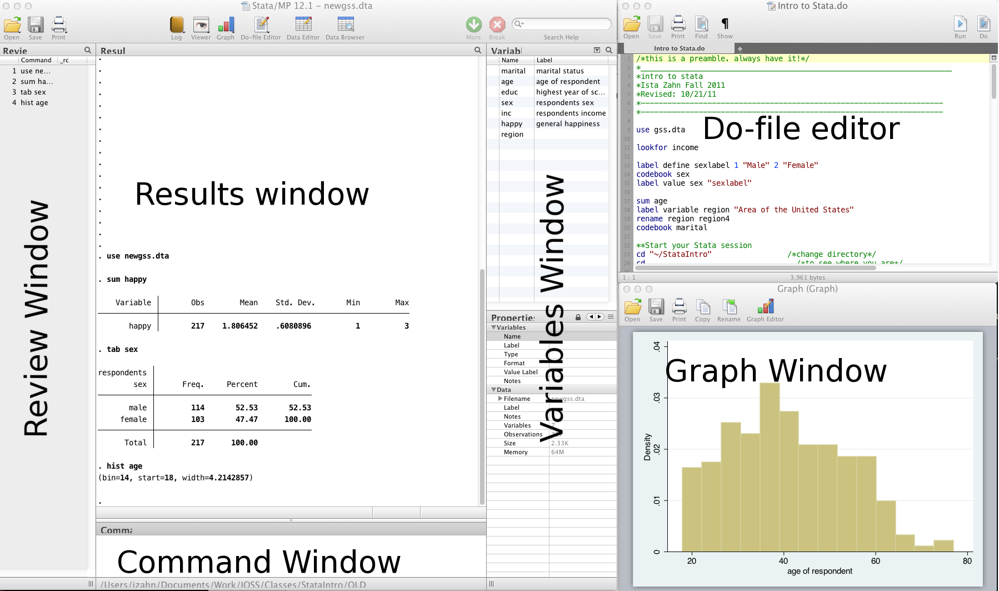

Introduction
============

Materials and setup<span class="tag" data-tag-name="labsetup"></span>
---------------------------------------------------------------------

Laptop users: you will need a copy of Stata installed on your machine. Harvard FAS affiliates can install a licensed version from <http://downloads.fas.harvard.edu/download>

-   Find class materials at <http://tutorials.iq.harvard.edu/Stata/StataIntro.zip>
-   Download and extract to your desktop!

Materials and setup<span class="tag" data-tag-name="mitsetup"></span>
---------------------------------------------------------------------

Laptop users: you will need a copy of Stata installed on your machine

Lab computer users: log in using your Athena user name and password

Everyone:

-   Find class materials at <http://tutorials.iq.harvard.edu/Stata/StataIntro.zip>
-   Download and extract to your desktop!

Organization
------------

-   Please feel free to ask questions at any point if they are relevant to the current topic (or if you are lost!)
    -   There will be a Q&A after class for more specific, personalized questions
-   Collaboration with your neighbors is encouraged
-   If you are using a laptop, you will need to adjust paths accordingly
-   Make comments in your Do-file rather than on hand-outs
    -   save on flash drive or email to yourself

Workshop descripton
-------------------

-   This is an **introduction** to Stata
-   Assumes no/very little knowledge of Stata
-   Not appropriate for people already well familiar with Stata
-   Learning Objectives:
    -   Familiarize yourself with the Stata interface
    -   Get data in and out of Stata
    -   Compute statistics and construct graphical displays
    -   Compute new variables and transformations

Why stata?
----------

-   Used in a variety of disciplines
-   User-friendly
-   Great guides available on web (as well as in HMDC computer lab library)
-   Student and other discount packages available at reasonable cost

Stata interface
---------------



-   Review and Variable windows can be closed (user preference)
-   Command window can be shortened (recommended)

Do-files
--------

-   You can type all the same commands into the Do-file that you would type into the command window
-   BUT...the Do-file allows you to **save** your commands
-   Your Do-file should contain ALL commands you executed -- at least all the "correct" commands!
-   I recommend never using the command window or menus to make CHANGES to data
-   Saving commands in Do-file allows you to keep a written record of everything you have done to your data
    -   Allows easy replication
    -   Allows you to go back and re-run commands, analyses and make modifications

Stata help
----------

To get help in Stata type `help` followed by topic or command, e.g., `help codebook`.

General Stata command syntax
----------------------------

Most Stata commands follow the same basic syntax: `Command varlist, options`.

Commenting and formatting syntax
--------------------------------

Start with comment describing your Do-file and use comments throughout


```stata
* Use '*' to comment a line and '//' for in-line comments

* Make Stata say hello:
disp "Hello " "World!" // 'disp' is short for 'display'

```

    Hello World!


-   Use `///` to break varlists over multiple lines:


```stata
disp "Hello" ///
     " World!"
```

    Hello World!


Let's get started
-----------------

-   Launch the Stata program (MP or SE, does not matter unless doing computationally intensive work)
    -   Open up a new Do-file
    -   Run our first Stata code!


```stata
* change directory
// cd "C://Users/dataclass/Desktop/StataIntro"
```


Getting data into Stata
=======================

Data file commands
------------------

-   Next, we want to open our data file
-   Open/save data sets with "use" and "save":


```stata
cd dataSets

// open the gss.dta data set
use gss.dta, clear

// save data file:
save newgss.dta, replace // "replace" option means OK to overwrite existing file
```

    
    /home/izahn/Documents/Work/Classes/IQSS_Stats_Workshops/Stata/StataIntro/dataSets
    
    
    file newgss.dta saved


A note about path names
-----------------------

-   If your path has no spaces in the name (that means all directories, folders, file names, etc. can have no spaces), you can write the path as is
-   If there are spaces, you need to put your pathname in quotes
-   Best to get in the habit of quoting paths

Where's my data?
----------------

-   Data editor (**browse**)
-   Data editor (**edit**)
    -   Using the data editor is discouraged (why?)
-   Always keep any changes to your data in your Do-file
-   Avoid temptation of making manual changes by viewing data via the browser rather than editor

What if my data is not a Stata file?
------------------------------------

-   Import delimited text files


```stata
* import data from a .csv file
import delimited gss.csv, clear

* save data to a .csv file
export delimited gss_new.csv, replace
```

    
    Picked up _JAVA_OPTIONS: -Dawt.useSystemAAFontSettings=gasp -Dswing.aatext=true -Dsun.java2d.opengl=true
    (7 vars, 451 obs)
    
    file gss_new.csv saved


-   Import data from SAS and Excel


```stata
* import/export SAS xport files
clear
import sasxport gss.xpt
export sasxport gss_new, replace
```

    
    
    
    file gss_new.xpt saved


What if my data is from another statistical software program?
-------------------------------------------------------------

-   SPSS/PASW will allow you to save your data as a Stata file
    -   Go to: file &gt; save as &gt; Stata (use most recent version available)
    -   Then you can just go into Stata and open it
-   Another option is **StatTransfer**, a program that converts data from/to many common formats, including SAS, SPSS, Stata, and many more

Exercise 1: Importing data
--------------------------

1.  Save any work you've done so far. Close down Stata and open a new session.
2.  Start Stata and open your `.do` file. 
3.  Change directory (`cd`) to the `dataSets` folder.
3.  Try opening the following files:
    -   A comma separated value file: gss.csv
    -   An Excel file: gss.xlsx

Statistics and graphs
=====================

Frequently used commands
------------------------

-   Commands for reviewing and inspecting data:
    -   describe // labels, storage type etc.
    -   sum // statistical summary (mean, sd, min/max etc.)
    -   codebook // storage type, unique values, labels
    -   list // print actuall values
    -   tab // (cross) tabulate variables
    -   browse // view the data in a spreadsheet-like window
-   Examples


```stata
use gss.dta, clear

sum educ // statistical summary of education
```

    
    
    
        Variable |        Obs        Mean    Std. Dev.       Min        Max
    -------------+---------------------------------------------------------
            educ |        217    13.52995      3.0687          1         20


```stata
codebook region // information about how region is coded
```

    
    ---------------------------------------------------------------------------------------------------------------------------------------------------------------------------------------------------------------------------------------------------------------
    region                                                                                                                                                                                                                                              (unlabeled)
    ---------------------------------------------------------------------------------------------------------------------------------------------------------------------------------------------------------------------------------------------------------------
    
                      type:  string (str5)
    
             unique values:  4                        missing "":  0/217
    
                tabulation:  Freq.  Value
                                54  "east"
                                48  "north"
                                48  "south"
                                67  "west"


```stata
tab sex // numbers of male and female participants
```

    
    respondents |
            sex |      Freq.     Percent        Cum.
    ------------+-----------------------------------
           male |        114       52.53       52.53
         female |        103       47.47      100.00
    ------------+-----------------------------------
          Total |        217      100.00


-   If you run these commands without specifying variables, Stata will produce output for every variable

Basic graphing commands
-----------------------

-   Univariate distribution(s) using **hist**


```stata
  /* Histograms */
  hist educ
```

    (bin=14, start=1, width=1.3571429)


<iframe frameborder="0" scrolling="no" height="436" width="600"                srcdoc="<html><body>&lt;?xml version=&quot;1.0&quot; encoding=&quot;UTF-8&quot; standalone=&quot;no&quot;?&gt;
&lt;!-- This is a Stata 15.1 generated SVG file (http://www.stata.com) --&gt;

&lt;svg version=&quot;1.1&quot; width=&quot;600px&quot; height=&quot;436px&quot; viewBox=&quot;0 0 3960 2880&quot; xmlns=&quot;http://www.w3.org/2000/svg&quot; xmlns:xlink=&quot;http://www.w3.org/1999/xlink&quot;&gt;
	&lt;desc&gt;Stata Graph - Graph&lt;/desc&gt;
	&lt;rect x=&quot;0&quot; y=&quot;0&quot; width=&quot;3960&quot; height=&quot;2880&quot; style=&quot;fill:#EAF2F3;stroke:none&quot;/&gt;
	&lt;rect x=&quot;0.00&quot; y=&quot;0.00&quot; width=&quot;3959.88&quot; height=&quot;2880.00&quot; style=&quot;fill:#EAF2F3&quot;/&gt;
	&lt;rect x=&quot;2.88&quot; y=&quot;2.88&quot; width=&quot;3954.12&quot; height=&quot;2874.24&quot; style=&quot;fill:none;stroke:#EAF2F3;stroke-width:5.76&quot;/&gt;
	&lt;rect x=&quot;390.80&quot; y=&quot;100.86&quot; width=&quot;3468.22&quot; height=&quot;2388.33&quot; style=&quot;fill:#FFFFFF&quot;/&gt;
	&lt;rect x=&quot;393.68&quot; y=&quot;103.74&quot; width=&quot;3462.46&quot; height=&quot;2382.57&quot; style=&quot;fill:none;stroke:#FFFFFF;stroke-width:5.76&quot;/&gt;
	&lt;line x1=&quot;390.80&quot; y1=&quot;2489.19&quot; x2=&quot;3859.02&quot; y2=&quot;2489.19&quot; style=&quot;stroke:#EAF2F3;stroke-width:8.64&quot;/&gt;
	&lt;line x1=&quot;390.80&quot; y1=&quot;1714.24&quot; x2=&quot;3859.02&quot; y2=&quot;1714.24&quot; style=&quot;stroke:#EAF2F3;stroke-width:8.64&quot;/&gt;
	&lt;line x1=&quot;390.80&quot; y1=&quot;939.17&quot; x2=&quot;3859.02&quot; y2=&quot;939.17&quot; style=&quot;stroke:#EAF2F3;stroke-width:8.64&quot;/&gt;
	&lt;line x1=&quot;390.80&quot; y1=&quot;164.22&quot; x2=&quot;3859.02&quot; y2=&quot;164.22&quot; style=&quot;stroke:#EAF2F3;stroke-width:8.64&quot;/&gt;
	&lt;rect x=&quot;621.23&quot; y=&quot;2410.23&quot; width=&quot;226.71&quot; height=&quot;78.95&quot; style=&quot;fill:#CAC27E&quot;/&gt;
	&lt;rect x=&quot;625.54&quot; y=&quot;2414.55&quot; width=&quot;218.07&quot; height=&quot;70.32&quot; style=&quot;fill:none;stroke:#D7D29E;stroke-width:8.64&quot;/&gt;
	&lt;rect x=&quot;1301.48&quot; y=&quot;2383.99&quot; width=&quot;226.71&quot; height=&quot;105.19&quot; style=&quot;fill:#CAC27E&quot;/&gt;
	&lt;rect x=&quot;1305.80&quot; y=&quot;2388.31&quot; width=&quot;218.07&quot; height=&quot;96.55&quot; style=&quot;fill:none;stroke:#D7D29E;stroke-width:8.64&quot;/&gt;
	&lt;rect x=&quot;1755.02&quot; y=&quot;2305.04&quot; width=&quot;226.71&quot; height=&quot;184.15&quot; style=&quot;fill:#CAC27E&quot;/&gt;
	&lt;rect x=&quot;1759.34&quot; y=&quot;2309.36&quot; width=&quot;218.07&quot; height=&quot;175.51&quot; style=&quot;fill:none;stroke:#D7D29E;stroke-width:8.64&quot;/&gt;
	&lt;rect x=&quot;1981.73&quot; y=&quot;2331.28&quot; width=&quot;226.71&quot; height=&quot;157.91&quot; style=&quot;fill:#CAC27E&quot;/&gt;
	&lt;rect x=&quot;1986.05&quot; y=&quot;2335.60&quot; width=&quot;218.07&quot; height=&quot;149.27&quot; style=&quot;fill:none;stroke:#D7D29E;stroke-width:8.64&quot;/&gt;
	&lt;rect x=&quot;2208.44&quot; y=&quot;2199.72&quot; width=&quot;226.83&quot; height=&quot;289.46&quot; style=&quot;fill:#CAC27E&quot;/&gt;
	&lt;rect x=&quot;2212.76&quot; y=&quot;2204.04&quot; width=&quot;218.19&quot; height=&quot;280.82&quot; style=&quot;fill:none;stroke:#D7D29E;stroke-width:8.64&quot;/&gt;
	&lt;rect x=&quot;2435.28&quot; y=&quot;331.29&quot; width=&quot;226.71&quot; height=&quot;2157.90&quot; style=&quot;fill:#CAC27E&quot;/&gt;
	&lt;rect x=&quot;2439.60&quot; y=&quot;335.61&quot; width=&quot;218.07&quot; height=&quot;2149.26&quot; style=&quot;fill:none;stroke:#D7D29E;stroke-width:8.64&quot;/&gt;
	&lt;rect x=&quot;2661.99&quot; y=&quot;1647.04&quot; width=&quot;226.71&quot; height=&quot;842.15&quot; style=&quot;fill:#CAC27E&quot;/&gt;
	&lt;rect x=&quot;2666.31&quot; y=&quot;1651.36&quot; width=&quot;218.07&quot; height=&quot;833.51&quot; style=&quot;fill:none;stroke:#D7D29E;stroke-width:8.64&quot;/&gt;
	&lt;rect x=&quot;2888.70&quot; y=&quot;2173.37&quot; width=&quot;226.83&quot; height=&quot;315.82&quot; style=&quot;fill:#CAC27E&quot;/&gt;
	&lt;rect x=&quot;2893.02&quot; y=&quot;2177.69&quot; width=&quot;218.19&quot; height=&quot;307.18&quot; style=&quot;fill:none;stroke:#D7D29E;stroke-width:8.64&quot;/&gt;
	&lt;rect x=&quot;3115.53&quot; y=&quot;1462.89&quot; width=&quot;226.71&quot; height=&quot;1026.29&quot; style=&quot;fill:#CAC27E&quot;/&gt;
	&lt;rect x=&quot;3119.85&quot; y=&quot;1467.21&quot; width=&quot;218.07&quot; height=&quot;1017.65&quot; style=&quot;fill:none;stroke:#D7D29E;stroke-width:8.64&quot;/&gt;
	&lt;rect x=&quot;3342.24&quot; y=&quot;2226.08&quot; width=&quot;226.71&quot; height=&quot;263.10&quot; style=&quot;fill:#CAC27E&quot;/&gt;
	&lt;rect x=&quot;3346.56&quot; y=&quot;2230.40&quot; width=&quot;218.07&quot; height=&quot;254.46&quot; style=&quot;fill:none;stroke:#D7D29E;stroke-width:8.64&quot;/&gt;
	&lt;rect x=&quot;3568.95&quot; y=&quot;2199.72&quot; width=&quot;226.71&quot; height=&quot;289.46&quot; style=&quot;fill:#CAC27E&quot;/&gt;
	&lt;rect x=&quot;3573.27&quot; y=&quot;2204.04&quot; width=&quot;218.07&quot; height=&quot;280.82&quot; style=&quot;fill:none;stroke:#D7D29E;stroke-width:8.64&quot;/&gt;
	&lt;line x1=&quot;390.80&quot; y1=&quot;2489.19&quot; x2=&quot;390.80&quot; y2=&quot;100.86&quot; style=&quot;stroke:#000000;stroke-width:5.76&quot;/&gt;
	&lt;line x1=&quot;390.80&quot; y1=&quot;2489.19&quot; x2=&quot;350.83&quot; y2=&quot;2489.19&quot; style=&quot;stroke:#000000;stroke-width:5.76&quot;/&gt;
	&lt;text x=&quot;300.72&quot; y=&quot;2489.19&quot; style=&quot;font-family:&#x27;Helvetica&#x27;;font-size:99.99px;fill:#000000&quot; transform=&quot;rotate(-90 300.72,2489.19)&quot; text-anchor=&quot;middle&quot;&gt;0&lt;/text&gt;
	&lt;line x1=&quot;390.80&quot; y1=&quot;1714.24&quot; x2=&quot;350.83&quot; y2=&quot;1714.24&quot; style=&quot;stroke:#000000;stroke-width:5.76&quot;/&gt;
	&lt;text x=&quot;300.72&quot; y=&quot;1714.24&quot; style=&quot;font-family:&#x27;Helvetica&#x27;;font-size:99.99px;fill:#000000&quot; transform=&quot;rotate(-90 300.72,1714.24)&quot; text-anchor=&quot;middle&quot;&gt;.1&lt;/text&gt;
	&lt;line x1=&quot;390.80&quot; y1=&quot;939.17&quot; x2=&quot;350.83&quot; y2=&quot;939.17&quot; style=&quot;stroke:#000000;stroke-width:5.76&quot;/&gt;
	&lt;text x=&quot;300.72&quot; y=&quot;939.17&quot; style=&quot;font-family:&#x27;Helvetica&#x27;;font-size:99.99px;fill:#000000&quot; transform=&quot;rotate(-90 300.72,939.17)&quot; text-anchor=&quot;middle&quot;&gt;.2&lt;/text&gt;
	&lt;line x1=&quot;390.80&quot; y1=&quot;164.22&quot; x2=&quot;350.83&quot; y2=&quot;164.22&quot; style=&quot;stroke:#000000;stroke-width:5.76&quot;/&gt;
	&lt;text x=&quot;300.72&quot; y=&quot;164.22&quot; style=&quot;font-family:&#x27;Helvetica&#x27;;font-size:99.99px;fill:#000000&quot; transform=&quot;rotate(-90 300.72,164.22)&quot; text-anchor=&quot;middle&quot;&gt;.3&lt;/text&gt;
	&lt;text x=&quot;190.71&quot; y=&quot;1294.96&quot; style=&quot;font-family:&#x27;Helvetica&#x27;;font-size:99.99px;fill:#000000&quot; transform=&quot;rotate(-90 190.71,1294.96)&quot; text-anchor=&quot;middle&quot;&gt;Density&lt;/text&gt;
	&lt;line x1=&quot;390.80&quot; y1=&quot;2489.19&quot; x2=&quot;3859.02&quot; y2=&quot;2489.19&quot; style=&quot;stroke:#000000;stroke-width:5.76&quot;/&gt;
	&lt;line x1=&quot;454.16&quot; y1=&quot;2489.19&quot; x2=&quot;454.16&quot; y2=&quot;2529.16&quot; style=&quot;stroke:#000000;stroke-width:5.76&quot;/&gt;
	&lt;text x=&quot;454.16&quot; y=&quot;2619.14&quot; style=&quot;font-family:&#x27;Helvetica&#x27;;font-size:99.99px;fill:#000000&quot; text-anchor=&quot;middle&quot;&gt;0&lt;/text&gt;
	&lt;line x1=&quot;1289.47&quot; y1=&quot;2489.19&quot; x2=&quot;1289.47&quot; y2=&quot;2529.16&quot; style=&quot;stroke:#000000;stroke-width:5.76&quot;/&gt;
	&lt;text x=&quot;1289.47&quot; y=&quot;2619.14&quot; style=&quot;font-family:&#x27;Helvetica&#x27;;font-size:99.99px;fill:#000000&quot; text-anchor=&quot;middle&quot;&gt;5&lt;/text&gt;
	&lt;line x1=&quot;2124.91&quot; y1=&quot;2489.19&quot; x2=&quot;2124.91&quot; y2=&quot;2529.16&quot; style=&quot;stroke:#000000;stroke-width:5.76&quot;/&gt;
	&lt;text x=&quot;2124.91&quot; y=&quot;2619.14&quot; style=&quot;font-family:&#x27;Helvetica&#x27;;font-size:99.99px;fill:#000000&quot; text-anchor=&quot;middle&quot;&gt;10&lt;/text&gt;
	&lt;line x1=&quot;2960.35&quot; y1=&quot;2489.19&quot; x2=&quot;2960.35&quot; y2=&quot;2529.16&quot; style=&quot;stroke:#000000;stroke-width:5.76&quot;/&gt;
	&lt;text x=&quot;2960.35&quot; y=&quot;2619.14&quot; style=&quot;font-family:&#x27;Helvetica&#x27;;font-size:99.99px;fill:#000000&quot; text-anchor=&quot;middle&quot;&gt;15&lt;/text&gt;
	&lt;line x1=&quot;3795.66&quot; y1=&quot;2489.19&quot; x2=&quot;3795.66&quot; y2=&quot;2529.16&quot; style=&quot;stroke:#000000;stroke-width:5.76&quot;/&gt;
	&lt;text x=&quot;3795.66&quot; y=&quot;2619.14&quot; style=&quot;font-family:&#x27;Helvetica&#x27;;font-size:99.99px;fill:#000000&quot; text-anchor=&quot;middle&quot;&gt;20&lt;/text&gt;
	&lt;text x=&quot;2124.91&quot; y=&quot;2729.16&quot; style=&quot;font-family:&#x27;Helvetica&#x27;;font-size:99.99px;fill:#000000&quot; text-anchor=&quot;middle&quot;&gt;highest year of school completed&lt;/text&gt;
&lt;/svg&gt;
</body></html>"></iframe>


    
    


```stata
  // histogram with normal curve; see 'help hist' for other options
  hist age, normal  
```

    (bin=14, start=18, width=4.2142857)


<iframe frameborder="0" scrolling="no" height="436" width="600"                srcdoc="<html><body>&lt;?xml version=&quot;1.0&quot; encoding=&quot;UTF-8&quot; standalone=&quot;no&quot;?&gt;
&lt;!-- This is a Stata 15.1 generated SVG file (http://www.stata.com) --&gt;

&lt;svg version=&quot;1.1&quot; width=&quot;600px&quot; height=&quot;436px&quot; viewBox=&quot;0 0 3960 2880&quot; xmlns=&quot;http://www.w3.org/2000/svg&quot; xmlns:xlink=&quot;http://www.w3.org/1999/xlink&quot;&gt;
	&lt;desc&gt;Stata Graph - Graph&lt;/desc&gt;
	&lt;rect x=&quot;0&quot; y=&quot;0&quot; width=&quot;3960&quot; height=&quot;2880&quot; style=&quot;fill:#EAF2F3;stroke:none&quot;/&gt;
	&lt;rect x=&quot;0.00&quot; y=&quot;0.00&quot; width=&quot;3959.88&quot; height=&quot;2880.00&quot; style=&quot;fill:#EAF2F3&quot;/&gt;
	&lt;rect x=&quot;2.88&quot; y=&quot;2.88&quot; width=&quot;3954.12&quot; height=&quot;2874.24&quot; style=&quot;fill:none;stroke:#EAF2F3;stroke-width:5.76&quot;/&gt;
	&lt;rect x=&quot;390.80&quot; y=&quot;100.86&quot; width=&quot;3468.22&quot; height=&quot;2388.33&quot; style=&quot;fill:#FFFFFF&quot;/&gt;
	&lt;rect x=&quot;393.68&quot; y=&quot;103.74&quot; width=&quot;3462.46&quot; height=&quot;2382.57&quot; style=&quot;fill:none;stroke:#FFFFFF;stroke-width:5.76&quot;/&gt;
	&lt;line x1=&quot;390.80&quot; y1=&quot;2489.19&quot; x2=&quot;3859.02&quot; y2=&quot;2489.19&quot; style=&quot;stroke:#EAF2F3;stroke-width:8.64&quot;/&gt;
	&lt;line x1=&quot;390.80&quot; y1=&quot;1907.91&quot; x2=&quot;3859.02&quot; y2=&quot;1907.91&quot; style=&quot;stroke:#EAF2F3;stroke-width:8.64&quot;/&gt;
	&lt;line x1=&quot;390.80&quot; y1=&quot;1326.64&quot; x2=&quot;3859.02&quot; y2=&quot;1326.64&quot; style=&quot;stroke:#EAF2F3;stroke-width:8.64&quot;/&gt;
	&lt;line x1=&quot;390.80&quot; y1=&quot;745.37&quot; x2=&quot;3859.02&quot; y2=&quot;745.37&quot; style=&quot;stroke:#EAF2F3;stroke-width:8.64&quot;/&gt;
	&lt;rect x=&quot;563.93&quot; y=&quot;1535.79&quot; width=&quot;219.66&quot; height=&quot;953.40&quot; style=&quot;fill:#CAC27E&quot;/&gt;
	&lt;rect x=&quot;568.25&quot; y=&quot;1540.11&quot; width=&quot;211.02&quot; height=&quot;944.76&quot; style=&quot;fill:none;stroke:#D7D29E;stroke-width:8.64&quot;/&gt;
	&lt;rect x=&quot;783.59&quot; y=&quot;1472.18&quot; width=&quot;219.78&quot; height=&quot;1017.01&quot; style=&quot;fill:#CAC27E&quot;/&gt;
	&lt;rect x=&quot;787.90&quot; y=&quot;1476.50&quot; width=&quot;211.14&quot; height=&quot;1008.37&quot; style=&quot;fill:none;stroke:#D7D29E;stroke-width:8.64&quot;/&gt;
	&lt;rect x=&quot;1003.37&quot; y=&quot;1027.28&quot; width=&quot;219.66&quot; height=&quot;1461.90&quot; style=&quot;fill:#CAC27E&quot;/&gt;
	&lt;rect x=&quot;1007.68&quot; y=&quot;1031.60&quot; width=&quot;211.02&quot; height=&quot;1453.26&quot; style=&quot;fill:none;stroke:#D7D29E;stroke-width:8.64&quot;/&gt;
	&lt;rect x=&quot;1223.02&quot; y=&quot;1154.38&quot; width=&quot;219.66&quot; height=&quot;1334.81&quot; style=&quot;fill:#CAC27E&quot;/&gt;
	&lt;rect x=&quot;1227.34&quot; y=&quot;1158.70&quot; width=&quot;211.02&quot; height=&quot;1326.17&quot; style=&quot;fill:none;stroke:#D7D29E;stroke-width:8.64&quot;/&gt;
	&lt;rect x=&quot;1442.68&quot; y=&quot;582.39&quot; width=&quot;219.66&quot; height=&quot;1906.80&quot; style=&quot;fill:#CAC27E&quot;/&gt;
	&lt;rect x=&quot;1447.00&quot; y=&quot;586.71&quot; width=&quot;211.02&quot; height=&quot;1898.16&quot; style=&quot;fill:none;stroke:#D7D29E;stroke-width:8.64&quot;/&gt;
	&lt;rect x=&quot;1662.33&quot; y=&quot;900.19&quot; width=&quot;219.66&quot; height=&quot;1589.00&quot; style=&quot;fill:#CAC27E&quot;/&gt;
	&lt;rect x=&quot;1666.65&quot; y=&quot;904.51&quot; width=&quot;211.02&quot; height=&quot;1580.36&quot; style=&quot;fill:none;stroke:#D7D29E;stroke-width:8.64&quot;/&gt;
	&lt;rect x=&quot;1881.99&quot; y=&quot;1281.60&quot; width=&quot;219.66&quot; height=&quot;1207.59&quot; style=&quot;fill:#CAC27E&quot;/&gt;
	&lt;rect x=&quot;1886.31&quot; y=&quot;1285.91&quot; width=&quot;211.02&quot; height=&quot;1198.95&quot; style=&quot;fill:none;stroke:#D7D29E;stroke-width:8.64&quot;/&gt;
	&lt;rect x=&quot;2101.65&quot; y=&quot;1281.60&quot; width=&quot;219.66&quot; height=&quot;1207.59&quot; style=&quot;fill:#CAC27E&quot;/&gt;
	&lt;rect x=&quot;2105.97&quot; y=&quot;1285.91&quot; width=&quot;211.02&quot; height=&quot;1198.95&quot; style=&quot;fill:none;stroke:#D7D29E;stroke-width:8.64&quot;/&gt;
	&lt;rect x=&quot;2321.30&quot; y=&quot;1408.69&quot; width=&quot;219.66&quot; height=&quot;1080.50&quot; style=&quot;fill:#CAC27E&quot;/&gt;
	&lt;rect x=&quot;2325.62&quot; y=&quot;1413.01&quot; width=&quot;211.02&quot; height=&quot;1071.86&quot; style=&quot;fill:none;stroke:#D7D29E;stroke-width:8.64&quot;/&gt;
	&lt;rect x=&quot;2540.96&quot; y=&quot;1408.69&quot; width=&quot;219.66&quot; height=&quot;1080.50&quot; style=&quot;fill:#CAC27E&quot;/&gt;
	&lt;rect x=&quot;2545.28&quot; y=&quot;1413.01&quot; width=&quot;211.02&quot; height=&quot;1071.86&quot; style=&quot;fill:none;stroke:#D7D29E;stroke-width:8.64&quot;/&gt;
	&lt;rect x=&quot;2760.61&quot; y=&quot;1917.19&quot; width=&quot;219.78&quot; height=&quot;571.99&quot; style=&quot;fill:#CAC27E&quot;/&gt;
	&lt;rect x=&quot;2764.93&quot; y=&quot;1921.51&quot; width=&quot;211.14&quot; height=&quot;563.35&quot; style=&quot;fill:none;stroke:#D7D29E;stroke-width:8.64&quot;/&gt;
	&lt;rect x=&quot;2980.39&quot; y=&quot;2298.48&quot; width=&quot;219.66&quot; height=&quot;190.70&quot; style=&quot;fill:#CAC27E&quot;/&gt;
	&lt;rect x=&quot;2984.71&quot; y=&quot;2302.80&quot; width=&quot;211.02&quot; height=&quot;182.06&quot; style=&quot;fill:none;stroke:#D7D29E;stroke-width:8.64&quot;/&gt;
	&lt;rect x=&quot;3200.05&quot; y=&quot;2425.70&quot; width=&quot;219.66&quot; height=&quot;63.49&quot; style=&quot;fill:#CAC27E&quot;/&gt;
	&lt;rect x=&quot;3204.37&quot; y=&quot;2430.02&quot; width=&quot;211.02&quot; height=&quot;54.85&quot; style=&quot;fill:none;stroke:#D7D29E;stroke-width:8.64&quot;/&gt;
	&lt;rect x=&quot;3419.71&quot; y=&quot;2362.09&quot; width=&quot;219.66&quot; height=&quot;127.10&quot; style=&quot;fill:#CAC27E&quot;/&gt;
	&lt;rect x=&quot;3424.03&quot; y=&quot;2366.41&quot; width=&quot;211.02&quot; height=&quot;118.46&quot; style=&quot;fill:none;stroke:#D7D29E;stroke-width:8.64&quot;/&gt;
	&lt;line x1=&quot;563.93&quot; y1=&quot;2130.05&quot; x2=&quot;574.20&quot; y2=&quot;2119.90&quot; stroke-linecap=&quot;round&quot; style=&quot;stroke:#2D6D66;stroke-width:8.64&quot;/&gt;
	&lt;line x1=&quot;574.20&quot; y1=&quot;2119.90&quot; x2=&quot;584.47&quot; y2=&quot;2109.51&quot; stroke-linecap=&quot;round&quot; style=&quot;stroke:#2D6D66;stroke-width:8.64&quot;/&gt;
	&lt;line x1=&quot;584.47&quot; y1=&quot;2109.51&quot; x2=&quot;594.74&quot; y2=&quot;2098.99&quot; stroke-linecap=&quot;round&quot; style=&quot;stroke:#2D6D66;stroke-width:8.64&quot;/&gt;
	&lt;line x1=&quot;594.74&quot; y1=&quot;2098.99&quot; x2=&quot;605.01&quot; y2=&quot;2088.22&quot; stroke-linecap=&quot;round&quot; style=&quot;stroke:#2D6D66;stroke-width:8.64&quot;/&gt;
	&lt;line x1=&quot;605.01&quot; y1=&quot;2088.22&quot; x2=&quot;615.28&quot; y2=&quot;2077.21&quot; stroke-linecap=&quot;round&quot; style=&quot;stroke:#2D6D66;stroke-width:8.64&quot;/&gt;
	&lt;line x1=&quot;615.28&quot; y1=&quot;2077.21&quot; x2=&quot;625.68&quot; y2=&quot;2066.07&quot; stroke-linecap=&quot;round&quot; style=&quot;stroke:#2D6D66;stroke-width:8.64&quot;/&gt;
	&lt;line x1=&quot;625.68&quot; y1=&quot;2066.07&quot; x2=&quot;635.95&quot; y2=&quot;2054.81&quot; stroke-linecap=&quot;round&quot; style=&quot;stroke:#2D6D66;stroke-width:8.64&quot;/&gt;
	&lt;line x1=&quot;635.95&quot; y1=&quot;2054.81&quot; x2=&quot;646.22&quot; y2=&quot;2043.18&quot; stroke-linecap=&quot;round&quot; style=&quot;stroke:#2D6D66;stroke-width:8.64&quot;/&gt;
	&lt;line x1=&quot;646.22&quot; y1=&quot;2043.18&quot; x2=&quot;656.49&quot; y2=&quot;2031.54&quot; stroke-linecap=&quot;round&quot; style=&quot;stroke:#2D6D66;stroke-width:8.64&quot;/&gt;
	&lt;line x1=&quot;656.49&quot; y1=&quot;2031.54&quot; x2=&quot;666.76&quot; y2=&quot;2019.54&quot; stroke-linecap=&quot;round&quot; style=&quot;stroke:#2D6D66;stroke-width:8.64&quot;/&gt;
	&lt;line x1=&quot;666.76&quot; y1=&quot;2019.54&quot; x2=&quot;677.04&quot; y2=&quot;2007.41&quot; stroke-linecap=&quot;round&quot; style=&quot;stroke:#2D6D66;stroke-width:8.64&quot;/&gt;
	&lt;line x1=&quot;677.04&quot; y1=&quot;2007.41&quot; x2=&quot;687.31&quot; y2=&quot;1995.16&quot; stroke-linecap=&quot;round&quot; style=&quot;stroke:#2D6D66;stroke-width:8.64&quot;/&gt;
	&lt;line x1=&quot;687.31&quot; y1=&quot;1995.16&quot; x2=&quot;697.58&quot; y2=&quot;1982.66&quot; stroke-linecap=&quot;round&quot; style=&quot;stroke:#2D6D66;stroke-width:8.64&quot;/&gt;
	&lt;line x1=&quot;697.58&quot; y1=&quot;1982.66&quot; x2=&quot;707.85&quot; y2=&quot;1969.91&quot; stroke-linecap=&quot;round&quot; style=&quot;stroke:#2D6D66;stroke-width:8.64&quot;/&gt;
	&lt;line x1=&quot;707.85&quot; y1=&quot;1969.91&quot; x2=&quot;718.25&quot; y2=&quot;1957.04&quot; stroke-linecap=&quot;round&quot; style=&quot;stroke:#2D6D66;stroke-width:8.64&quot;/&gt;
	&lt;line x1=&quot;718.25&quot; y1=&quot;1957.04&quot; x2=&quot;728.52&quot; y2=&quot;1943.93&quot; stroke-linecap=&quot;round&quot; style=&quot;stroke:#2D6D66;stroke-width:8.64&quot;/&gt;
	&lt;line x1=&quot;728.52&quot; y1=&quot;1943.93&quot; x2=&quot;738.79&quot; y2=&quot;1930.68&quot; stroke-linecap=&quot;round&quot; style=&quot;stroke:#2D6D66;stroke-width:8.64&quot;/&gt;
	&lt;line x1=&quot;738.79&quot; y1=&quot;1930.68&quot; x2=&quot;749.06&quot; y2=&quot;1917.19&quot; stroke-linecap=&quot;round&quot; style=&quot;stroke:#2D6D66;stroke-width:8.64&quot;/&gt;
	&lt;line x1=&quot;749.06&quot; y1=&quot;1917.19&quot; x2=&quot;759.33&quot; y2=&quot;1903.58&quot; stroke-linecap=&quot;round&quot; style=&quot;stroke:#2D6D66;stroke-width:8.64&quot;/&gt;
	&lt;line x1=&quot;759.33&quot; y1=&quot;1903.58&quot; x2=&quot;769.60&quot; y2=&quot;1889.72&quot; stroke-linecap=&quot;round&quot; style=&quot;stroke:#2D6D66;stroke-width:8.64&quot;/&gt;
	&lt;line x1=&quot;769.60&quot; y1=&quot;1889.72&quot; x2=&quot;779.87&quot; y2=&quot;1875.74&quot; stroke-linecap=&quot;round&quot; style=&quot;stroke:#2D6D66;stroke-width:8.64&quot;/&gt;
	&lt;line x1=&quot;779.87&quot; y1=&quot;1875.74&quot; x2=&quot;790.14&quot; y2=&quot;1861.63&quot; stroke-linecap=&quot;round&quot; style=&quot;stroke:#2D6D66;stroke-width:8.64&quot;/&gt;
	&lt;line x1=&quot;790.14&quot; y1=&quot;1861.63&quot; x2=&quot;800.54&quot; y2=&quot;1847.27&quot; stroke-linecap=&quot;round&quot; style=&quot;stroke:#2D6D66;stroke-width:8.64&quot;/&gt;
	&lt;line x1=&quot;800.54&quot; y1=&quot;1847.27&quot; x2=&quot;810.81&quot; y2=&quot;1832.67&quot; stroke-linecap=&quot;round&quot; style=&quot;stroke:#2D6D66;stroke-width:8.64&quot;/&gt;
	&lt;line x1=&quot;810.81&quot; y1=&quot;1832.67&quot; x2=&quot;821.08&quot; y2=&quot;1818.07&quot; stroke-linecap=&quot;round&quot; style=&quot;stroke:#2D6D66;stroke-width:8.64&quot;/&gt;
	&lt;line x1=&quot;821.08&quot; y1=&quot;1818.07&quot; x2=&quot;831.35&quot; y2=&quot;1803.22&quot; stroke-linecap=&quot;round&quot; style=&quot;stroke:#2D6D66;stroke-width:8.64&quot;/&gt;
	&lt;line x1=&quot;831.35&quot; y1=&quot;1803.22&quot; x2=&quot;841.62&quot; y2=&quot;1788.24&quot; stroke-linecap=&quot;round&quot; style=&quot;stroke:#2D6D66;stroke-width:8.64&quot;/&gt;
	&lt;line x1=&quot;841.62&quot; y1=&quot;1788.24&quot; x2=&quot;851.89&quot; y2=&quot;1773.02&quot; stroke-linecap=&quot;round&quot; style=&quot;stroke:#2D6D66;stroke-width:8.64&quot;/&gt;
	&lt;line x1=&quot;851.89&quot; y1=&quot;1773.02&quot; x2=&quot;862.17&quot; y2=&quot;1757.80&quot; stroke-linecap=&quot;round&quot; style=&quot;stroke:#2D6D66;stroke-width:8.64&quot;/&gt;
	&lt;line x1=&quot;862.17&quot; y1=&quot;1757.80&quot; x2=&quot;872.44&quot; y2=&quot;1742.33&quot; stroke-linecap=&quot;round&quot; style=&quot;stroke:#2D6D66;stroke-width:8.64&quot;/&gt;
	&lt;line x1=&quot;872.44&quot; y1=&quot;1742.33&quot; x2=&quot;882.71&quot; y2=&quot;1726.74&quot; stroke-linecap=&quot;round&quot; style=&quot;stroke:#2D6D66;stroke-width:8.64&quot;/&gt;
	&lt;line x1=&quot;882.71&quot; y1=&quot;1726.74&quot; x2=&quot;893.10&quot; y2=&quot;1711.02&quot; stroke-linecap=&quot;round&quot; style=&quot;stroke:#2D6D66;stroke-width:8.64&quot;/&gt;
	&lt;line x1=&quot;893.10&quot; y1=&quot;1711.02&quot; x2=&quot;903.38&quot; y2=&quot;1695.18&quot; stroke-linecap=&quot;round&quot; style=&quot;stroke:#2D6D66;stroke-width:8.64&quot;/&gt;
	&lt;line x1=&quot;903.38&quot; y1=&quot;1695.18&quot; x2=&quot;913.65&quot; y2=&quot;1679.09&quot; stroke-linecap=&quot;round&quot; style=&quot;stroke:#2D6D66;stroke-width:8.64&quot;/&gt;
	&lt;line x1=&quot;913.65&quot; y1=&quot;1679.09&quot; x2=&quot;923.92&quot; y2=&quot;1663.00&quot; stroke-linecap=&quot;round&quot; style=&quot;stroke:#2D6D66;stroke-width:8.64&quot;/&gt;
	&lt;line x1=&quot;923.92&quot; y1=&quot;1663.00&quot; x2=&quot;934.19&quot; y2=&quot;1646.79&quot; stroke-linecap=&quot;round&quot; style=&quot;stroke:#2D6D66;stroke-width:8.64&quot;/&gt;
	&lt;line x1=&quot;934.19&quot; y1=&quot;1646.79&quot; x2=&quot;944.46&quot; y2=&quot;1630.46&quot; stroke-linecap=&quot;round&quot; style=&quot;stroke:#2D6D66;stroke-width:8.64&quot;/&gt;
	&lt;line x1=&quot;944.46&quot; y1=&quot;1630.46&quot; x2=&quot;954.73&quot; y2=&quot;1614.00&quot; stroke-linecap=&quot;round&quot; style=&quot;stroke:#2D6D66;stroke-width:8.64&quot;/&gt;
	&lt;line x1=&quot;954.73&quot; y1=&quot;1614.00&quot; x2=&quot;965.00&quot; y2=&quot;1597.41&quot; stroke-linecap=&quot;round&quot; style=&quot;stroke:#2D6D66;stroke-width:8.64&quot;/&gt;
	&lt;line x1=&quot;965.00&quot; y1=&quot;1597.41&quot; x2=&quot;975.27&quot; y2=&quot;1580.83&quot; stroke-linecap=&quot;round&quot; style=&quot;stroke:#2D6D66;stroke-width:8.64&quot;/&gt;
	&lt;line x1=&quot;975.27&quot; y1=&quot;1580.83&quot; x2=&quot;985.67&quot; y2=&quot;1564.13&quot; stroke-linecap=&quot;round&quot; style=&quot;stroke:#2D6D66;stroke-width:8.64&quot;/&gt;
	&lt;line x1=&quot;985.67&quot; y1=&quot;1564.13&quot; x2=&quot;995.94&quot; y2=&quot;1547.29&quot; stroke-linecap=&quot;round&quot; style=&quot;stroke:#2D6D66;stroke-width:8.64&quot;/&gt;
	&lt;line x1=&quot;995.94&quot; y1=&quot;1547.29&quot; x2=&quot;1006.21&quot; y2=&quot;1530.46&quot; stroke-linecap=&quot;round&quot; style=&quot;stroke:#2D6D66;stroke-width:8.64&quot;/&gt;
	&lt;line x1=&quot;1006.21&quot; y1=&quot;1530.46&quot; x2=&quot;1016.48&quot; y2=&quot;1513.51&quot; stroke-linecap=&quot;round&quot; style=&quot;stroke:#2D6D66;stroke-width:8.64&quot;/&gt;
	&lt;line x1=&quot;1016.48&quot; y1=&quot;1513.51&quot; x2=&quot;1026.75&quot; y2=&quot;1496.43&quot; stroke-linecap=&quot;round&quot; style=&quot;stroke:#2D6D66;stroke-width:8.64&quot;/&gt;
	&lt;line x1=&quot;1026.75&quot; y1=&quot;1496.43&quot; x2=&quot;1037.03&quot; y2=&quot;1479.35&quot; stroke-linecap=&quot;round&quot; style=&quot;stroke:#2D6D66;stroke-width:8.64&quot;/&gt;
	&lt;line x1=&quot;1037.03&quot; y1=&quot;1479.35&quot; x2=&quot;1047.30&quot; y2=&quot;1462.28&quot; stroke-linecap=&quot;round&quot; style=&quot;stroke:#2D6D66;stroke-width:8.64&quot;/&gt;
	&lt;line x1=&quot;1047.30&quot; y1=&quot;1462.28&quot; x2=&quot;1057.57&quot; y2=&quot;1445.20&quot; stroke-linecap=&quot;round&quot; style=&quot;stroke:#2D6D66;stroke-width:8.64&quot;/&gt;
	&lt;line x1=&quot;1057.57&quot; y1=&quot;1445.20&quot; x2=&quot;1067.96&quot; y2=&quot;1428.00&quot; stroke-linecap=&quot;round&quot; style=&quot;stroke:#2D6D66;stroke-width:8.64&quot;/&gt;
	&lt;line x1=&quot;1067.96&quot; y1=&quot;1428.00&quot; x2=&quot;1078.23&quot; y2=&quot;1410.79&quot; stroke-linecap=&quot;round&quot; style=&quot;stroke:#2D6D66;stroke-width:8.64&quot;/&gt;
	&lt;line x1=&quot;1078.23&quot; y1=&quot;1410.79&quot; x2=&quot;1088.51&quot; y2=&quot;1393.59&quot; stroke-linecap=&quot;round&quot; style=&quot;stroke:#2D6D66;stroke-width:8.64&quot;/&gt;
	&lt;line x1=&quot;1088.51&quot; y1=&quot;1393.59&quot; x2=&quot;1098.78&quot; y2=&quot;1376.39&quot; stroke-linecap=&quot;round&quot; style=&quot;stroke:#2D6D66;stroke-width:8.64&quot;/&gt;
	&lt;line x1=&quot;1098.78&quot; y1=&quot;1376.39&quot; x2=&quot;1109.05&quot; y2=&quot;1359.19&quot; stroke-linecap=&quot;round&quot; style=&quot;stroke:#2D6D66;stroke-width:8.64&quot;/&gt;
	&lt;line x1=&quot;1109.05&quot; y1=&quot;1359.19&quot; x2=&quot;1119.32&quot; y2=&quot;1341.99&quot; stroke-linecap=&quot;round&quot; style=&quot;stroke:#2D6D66;stroke-width:8.64&quot;/&gt;
	&lt;line x1=&quot;1119.32&quot; y1=&quot;1341.99&quot; x2=&quot;1129.59&quot; y2=&quot;1324.79&quot; stroke-linecap=&quot;round&quot; style=&quot;stroke:#2D6D66;stroke-width:8.64&quot;/&gt;
	&lt;line x1=&quot;1129.59&quot; y1=&quot;1324.79&quot; x2=&quot;1139.86&quot; y2=&quot;1307.58&quot; stroke-linecap=&quot;round&quot; style=&quot;stroke:#2D6D66;stroke-width:8.64&quot;/&gt;
	&lt;line x1=&quot;1139.86&quot; y1=&quot;1307.58&quot; x2=&quot;1150.13&quot; y2=&quot;1290.51&quot; stroke-linecap=&quot;round&quot; style=&quot;stroke:#2D6D66;stroke-width:8.64&quot;/&gt;
	&lt;line x1=&quot;1150.13&quot; y1=&quot;1290.51&quot; x2=&quot;1160.53&quot; y2=&quot;1273.43&quot; stroke-linecap=&quot;round&quot; style=&quot;stroke:#2D6D66;stroke-width:8.64&quot;/&gt;
	&lt;line x1=&quot;1160.53&quot; y1=&quot;1273.43&quot; x2=&quot;1170.80&quot; y2=&quot;1256.47&quot; stroke-linecap=&quot;round&quot; style=&quot;stroke:#2D6D66;stroke-width:8.64&quot;/&gt;
	&lt;line x1=&quot;1170.80&quot; y1=&quot;1256.47&quot; x2=&quot;1181.07&quot; y2=&quot;1239.52&quot; stroke-linecap=&quot;round&quot; style=&quot;stroke:#2D6D66;stroke-width:8.64&quot;/&gt;
	&lt;line x1=&quot;1181.07&quot; y1=&quot;1239.52&quot; x2=&quot;1191.34&quot; y2=&quot;1222.56&quot; stroke-linecap=&quot;round&quot; style=&quot;stroke:#2D6D66;stroke-width:8.64&quot;/&gt;
	&lt;line x1=&quot;1191.34&quot; y1=&quot;1222.56&quot; x2=&quot;1201.61&quot; y2=&quot;1205.86&quot; stroke-linecap=&quot;round&quot; style=&quot;stroke:#2D6D66;stroke-width:8.64&quot;/&gt;
	&lt;line x1=&quot;1201.61&quot; y1=&quot;1205.86&quot; x2=&quot;1211.88&quot; y2=&quot;1189.15&quot; stroke-linecap=&quot;round&quot; style=&quot;stroke:#2D6D66;stroke-width:8.64&quot;/&gt;
	&lt;line x1=&quot;1211.88&quot; y1=&quot;1189.15&quot; x2=&quot;1222.15&quot; y2=&quot;1172.44&quot; stroke-linecap=&quot;round&quot; style=&quot;stroke:#2D6D66;stroke-width:8.64&quot;/&gt;
	&lt;line x1=&quot;1222.15&quot; y1=&quot;1172.44&quot; x2=&quot;1232.43&quot; y2=&quot;1155.98&quot; stroke-linecap=&quot;round&quot; style=&quot;stroke:#2D6D66;stroke-width:8.64&quot;/&gt;
	&lt;line x1=&quot;1232.43&quot; y1=&quot;1155.98&quot; x2=&quot;1242.70&quot; y2=&quot;1139.65&quot; stroke-linecap=&quot;round&quot; style=&quot;stroke:#2D6D66;stroke-width:8.64&quot;/&gt;
	&lt;line x1=&quot;1242.70&quot; y1=&quot;1139.65&quot; x2=&quot;1253.09&quot; y2=&quot;1123.44&quot; stroke-linecap=&quot;round&quot; style=&quot;stroke:#2D6D66;stroke-width:8.64&quot;/&gt;
	&lt;line x1=&quot;1253.09&quot; y1=&quot;1123.44&quot; x2=&quot;1263.36&quot; y2=&quot;1107.23&quot; stroke-linecap=&quot;round&quot; style=&quot;stroke:#2D6D66;stroke-width:8.64&quot;/&gt;
	&lt;line x1=&quot;1263.36&quot; y1=&quot;1107.23&quot; x2=&quot;1273.63&quot; y2=&quot;1091.26&quot; stroke-linecap=&quot;round&quot; style=&quot;stroke:#2D6D66;stroke-width:8.64&quot;/&gt;
	&lt;line x1=&quot;1273.63&quot; y1=&quot;1091.26&quot; x2=&quot;1283.91&quot; y2=&quot;1075.54&quot; stroke-linecap=&quot;round&quot; style=&quot;stroke:#2D6D66;stroke-width:8.64&quot;/&gt;
	&lt;line x1=&quot;1283.91&quot; y1=&quot;1075.54&quot; x2=&quot;1294.18&quot; y2=&quot;1059.83&quot; stroke-linecap=&quot;round&quot; style=&quot;stroke:#2D6D66;stroke-width:8.64&quot;/&gt;
	&lt;line x1=&quot;1294.18&quot; y1=&quot;1059.83&quot; x2=&quot;1304.45&quot; y2=&quot;1044.36&quot; stroke-linecap=&quot;round&quot; style=&quot;stroke:#2D6D66;stroke-width:8.64&quot;/&gt;
	&lt;line x1=&quot;1304.45&quot; y1=&quot;1044.36&quot; x2=&quot;1314.72&quot; y2=&quot;1029.14&quot; stroke-linecap=&quot;round&quot; style=&quot;stroke:#2D6D66;stroke-width:8.64&quot;/&gt;
	&lt;line x1=&quot;1314.72&quot; y1=&quot;1029.14&quot; x2=&quot;1324.99&quot; y2=&quot;1014.04&quot; stroke-linecap=&quot;round&quot; style=&quot;stroke:#2D6D66;stroke-width:8.64&quot;/&gt;
	&lt;line x1=&quot;1324.99&quot; y1=&quot;1014.04&quot; x2=&quot;1335.39&quot; y2=&quot;999.19&quot; stroke-linecap=&quot;round&quot; style=&quot;stroke:#2D6D66;stroke-width:8.64&quot;/&gt;
	&lt;line x1=&quot;1335.39&quot; y1=&quot;999.19&quot; x2=&quot;1345.66&quot; y2=&quot;984.59&quot; stroke-linecap=&quot;round&quot; style=&quot;stroke:#2D6D66;stroke-width:8.64&quot;/&gt;
	&lt;line x1=&quot;1345.66&quot; y1=&quot;984.59&quot; x2=&quot;1355.93&quot; y2=&quot;970.11&quot; stroke-linecap=&quot;round&quot; style=&quot;stroke:#2D6D66;stroke-width:8.64&quot;/&gt;
	&lt;line x1=&quot;1355.93&quot; y1=&quot;970.11&quot; x2=&quot;1366.20&quot; y2=&quot;955.87&quot; stroke-linecap=&quot;round&quot; style=&quot;stroke:#2D6D66;stroke-width:8.64&quot;/&gt;
	&lt;line x1=&quot;1366.20&quot; y1=&quot;955.87&quot; x2=&quot;1376.47&quot; y2=&quot;941.89&quot; stroke-linecap=&quot;round&quot; style=&quot;stroke:#2D6D66;stroke-width:8.64&quot;/&gt;
	&lt;line x1=&quot;1376.47&quot; y1=&quot;941.89&quot; x2=&quot;1386.74&quot; y2=&quot;928.15&quot; stroke-linecap=&quot;round&quot; style=&quot;stroke:#2D6D66;stroke-width:8.64&quot;/&gt;
	&lt;line x1=&quot;1386.74&quot; y1=&quot;928.15&quot; x2=&quot;1397.01&quot; y2=&quot;914.79&quot; stroke-linecap=&quot;round&quot; style=&quot;stroke:#2D6D66;stroke-width:8.64&quot;/&gt;
	&lt;line x1=&quot;1397.01&quot; y1=&quot;914.79&quot; x2=&quot;1407.29&quot; y2=&quot;901.55&quot; stroke-linecap=&quot;round&quot; style=&quot;stroke:#2D6D66;stroke-width:8.64&quot;/&gt;
	&lt;line x1=&quot;1407.29&quot; y1=&quot;901.55&quot; x2=&quot;1417.56&quot; y2=&quot;888.68&quot; stroke-linecap=&quot;round&quot; style=&quot;stroke:#2D6D66;stroke-width:8.64&quot;/&gt;
	&lt;line x1=&quot;1417.56&quot; y1=&quot;888.68&quot; x2=&quot;1427.95&quot; y2=&quot;876.05&quot; stroke-linecap=&quot;round&quot; style=&quot;stroke:#2D6D66;stroke-width:8.64&quot;/&gt;
	&lt;line x1=&quot;1427.95&quot; y1=&quot;876.05&quot; x2=&quot;1438.22&quot; y2=&quot;863.68&quot; stroke-linecap=&quot;round&quot; style=&quot;stroke:#2D6D66;stroke-width:8.64&quot;/&gt;
	&lt;line x1=&quot;1438.22&quot; y1=&quot;863.68&quot; x2=&quot;1448.49&quot; y2=&quot;851.67&quot; stroke-linecap=&quot;round&quot; style=&quot;stroke:#2D6D66;stroke-width:8.64&quot;/&gt;
	&lt;line x1=&quot;1448.49&quot; y1=&quot;851.67&quot; x2=&quot;1458.77&quot; y2=&quot;839.92&quot; stroke-linecap=&quot;round&quot; style=&quot;stroke:#2D6D66;stroke-width:8.64&quot;/&gt;
	&lt;line x1=&quot;1458.77&quot; y1=&quot;839.92&quot; x2=&quot;1469.04&quot; y2=&quot;828.53&quot; stroke-linecap=&quot;round&quot; style=&quot;stroke:#2D6D66;stroke-width:8.64&quot;/&gt;
	&lt;line x1=&quot;1469.04&quot; y1=&quot;828.53&quot; x2=&quot;1479.31&quot; y2=&quot;817.39&quot; stroke-linecap=&quot;round&quot; style=&quot;stroke:#2D6D66;stroke-width:8.64&quot;/&gt;
	&lt;line x1=&quot;1479.31&quot; y1=&quot;817.39&quot; x2=&quot;1489.58&quot; y2=&quot;806.63&quot; stroke-linecap=&quot;round&quot; style=&quot;stroke:#2D6D66;stroke-width:8.64&quot;/&gt;
	&lt;line x1=&quot;1489.58&quot; y1=&quot;806.63&quot; x2=&quot;1499.85&quot; y2=&quot;796.23&quot; stroke-linecap=&quot;round&quot; style=&quot;stroke:#2D6D66;stroke-width:8.64&quot;/&gt;
	&lt;line x1=&quot;1499.85&quot; y1=&quot;796.23&quot; x2=&quot;1510.12&quot; y2=&quot;786.21&quot; stroke-linecap=&quot;round&quot; style=&quot;stroke:#2D6D66;stroke-width:8.64&quot;/&gt;
	&lt;line x1=&quot;1510.12&quot; y1=&quot;786.21&quot; x2=&quot;1520.52&quot; y2=&quot;776.43&quot; stroke-linecap=&quot;round&quot; style=&quot;stroke:#2D6D66;stroke-width:8.64&quot;/&gt;
	&lt;line x1=&quot;1520.52&quot; y1=&quot;776.43&quot; x2=&quot;1530.79&quot; y2=&quot;767.15&quot; stroke-linecap=&quot;round&quot; style=&quot;stroke:#2D6D66;stroke-width:8.64&quot;/&gt;
	&lt;line x1=&quot;1530.79&quot; y1=&quot;767.15&quot; x2=&quot;1541.06&quot; y2=&quot;758.12&quot; stroke-linecap=&quot;round&quot; style=&quot;stroke:#2D6D66;stroke-width:8.64&quot;/&gt;
	&lt;line x1=&quot;1541.06&quot; y1=&quot;758.12&quot; x2=&quot;1551.33&quot; y2=&quot;749.58&quot; stroke-linecap=&quot;round&quot; style=&quot;stroke:#2D6D66;stroke-width:8.64&quot;/&gt;
	&lt;line x1=&quot;1551.33&quot; y1=&quot;749.58&quot; x2=&quot;1561.60&quot; y2=&quot;741.29&quot; stroke-linecap=&quot;round&quot; style=&quot;stroke:#2D6D66;stroke-width:8.64&quot;/&gt;
	&lt;line x1=&quot;1561.60&quot; y1=&quot;741.29&quot; x2=&quot;1571.87&quot; y2=&quot;733.49&quot; stroke-linecap=&quot;round&quot; style=&quot;stroke:#2D6D66;stroke-width:8.64&quot;/&gt;
	&lt;line x1=&quot;1571.87&quot; y1=&quot;733.49&quot; x2=&quot;1582.14&quot; y2=&quot;725.94&quot; stroke-linecap=&quot;round&quot; style=&quot;stroke:#2D6D66;stroke-width:8.64&quot;/&gt;
	&lt;line x1=&quot;1582.14&quot; y1=&quot;725.94&quot; x2=&quot;1592.41&quot; y2=&quot;718.89&quot; stroke-linecap=&quot;round&quot; style=&quot;stroke:#2D6D66;stroke-width:8.64&quot;/&gt;
	&lt;line x1=&quot;1592.41&quot; y1=&quot;718.89&quot; x2=&quot;1602.81&quot; y2=&quot;712.33&quot; stroke-linecap=&quot;round&quot; style=&quot;stroke:#2D6D66;stroke-width:8.64&quot;/&gt;
	&lt;line x1=&quot;1602.81&quot; y1=&quot;712.33&quot; x2=&quot;1613.08&quot; y2=&quot;706.02&quot; stroke-linecap=&quot;round&quot; style=&quot;stroke:#2D6D66;stroke-width:8.64&quot;/&gt;
	&lt;line x1=&quot;1613.08&quot; y1=&quot;706.02&quot; x2=&quot;1623.35&quot; y2=&quot;700.20&quot; stroke-linecap=&quot;round&quot; style=&quot;stroke:#2D6D66;stroke-width:8.64&quot;/&gt;
	&lt;line x1=&quot;1623.35&quot; y1=&quot;700.20&quot; x2=&quot;1633.62&quot; y2=&quot;694.75&quot; stroke-linecap=&quot;round&quot; style=&quot;stroke:#2D6D66;stroke-width:8.64&quot;/&gt;
	&lt;line x1=&quot;1633.62&quot; y1=&quot;694.75&quot; x2=&quot;1643.89&quot; y2=&quot;689.68&quot; stroke-linecap=&quot;round&quot; style=&quot;stroke:#2D6D66;stroke-width:8.64&quot;/&gt;
	&lt;line x1=&quot;1643.89&quot; y1=&quot;689.68&quot; x2=&quot;1654.17&quot; y2=&quot;685.10&quot; stroke-linecap=&quot;round&quot; style=&quot;stroke:#2D6D66;stroke-width:8.64&quot;/&gt;
	&lt;line x1=&quot;1654.17&quot; y1=&quot;685.10&quot; x2=&quot;1664.44&quot; y2=&quot;681.02&quot; stroke-linecap=&quot;round&quot; style=&quot;stroke:#2D6D66;stroke-width:8.64&quot;/&gt;
	&lt;line x1=&quot;1664.44&quot; y1=&quot;681.02&quot; x2=&quot;1674.71&quot; y2=&quot;677.30&quot; stroke-linecap=&quot;round&quot; style=&quot;stroke:#2D6D66;stroke-width:8.64&quot;/&gt;
	&lt;line x1=&quot;1674.71&quot; y1=&quot;677.30&quot; x2=&quot;1684.98&quot; y2=&quot;673.96&quot; stroke-linecap=&quot;round&quot; style=&quot;stroke:#2D6D66;stroke-width:8.64&quot;/&gt;
	&lt;line x1=&quot;1684.98&quot; y1=&quot;673.96&quot; x2=&quot;1695.38&quot; y2=&quot;671.12&quot; stroke-linecap=&quot;round&quot; style=&quot;stroke:#2D6D66;stroke-width:8.64&quot;/&gt;
	&lt;line x1=&quot;1695.38&quot; y1=&quot;671.12&quot; x2=&quot;1705.65&quot; y2=&quot;668.64&quot; stroke-linecap=&quot;round&quot; style=&quot;stroke:#2D6D66;stroke-width:8.64&quot;/&gt;
	&lt;line x1=&quot;1705.65&quot; y1=&quot;668.64&quot; x2=&quot;1715.92&quot; y2=&quot;666.66&quot; stroke-linecap=&quot;round&quot; style=&quot;stroke:#2D6D66;stroke-width:8.64&quot;/&gt;
	&lt;line x1=&quot;1715.92&quot; y1=&quot;666.66&quot; x2=&quot;1726.19&quot; y2=&quot;665.05&quot; stroke-linecap=&quot;round&quot; style=&quot;stroke:#2D6D66;stroke-width:8.64&quot;/&gt;
	&lt;line x1=&quot;1726.19&quot; y1=&quot;665.05&quot; x2=&quot;1736.46&quot; y2=&quot;663.94&quot; stroke-linecap=&quot;round&quot; style=&quot;stroke:#2D6D66;stroke-width:8.64&quot;/&gt;
	&lt;line x1=&quot;1736.46&quot; y1=&quot;663.94&quot; x2=&quot;1746.73&quot; y2=&quot;663.32&quot; stroke-linecap=&quot;round&quot; style=&quot;stroke:#2D6D66;stroke-width:8.64&quot;/&gt;
	&lt;line x1=&quot;1746.73&quot; y1=&quot;663.32&quot; x2=&quot;1757.00&quot; y2=&quot;663.07&quot; stroke-linecap=&quot;round&quot; style=&quot;stroke:#2D6D66;stroke-width:8.64&quot;/&gt;
	&lt;line x1=&quot;1757.00&quot; y1=&quot;663.07&quot; x2=&quot;1767.27&quot; y2=&quot;663.20&quot; stroke-linecap=&quot;round&quot; style=&quot;stroke:#2D6D66;stroke-width:8.64&quot;/&gt;
	&lt;line x1=&quot;1767.27&quot; y1=&quot;663.20&quot; x2=&quot;1777.55&quot; y2=&quot;663.82&quot; stroke-linecap=&quot;round&quot; style=&quot;stroke:#2D6D66;stroke-width:8.64&quot;/&gt;
	&lt;line x1=&quot;1777.55&quot; y1=&quot;663.82&quot; x2=&quot;1787.94&quot; y2=&quot;664.93&quot; stroke-linecap=&quot;round&quot; style=&quot;stroke:#2D6D66;stroke-width:8.64&quot;/&gt;
	&lt;line x1=&quot;1787.94&quot; y1=&quot;664.93&quot; x2=&quot;1798.21&quot; y2=&quot;666.41&quot; stroke-linecap=&quot;round&quot; style=&quot;stroke:#2D6D66;stroke-width:8.64&quot;/&gt;
	&lt;line x1=&quot;1798.21&quot; y1=&quot;666.41&quot; x2=&quot;1808.48&quot; y2=&quot;668.39&quot; stroke-linecap=&quot;round&quot; style=&quot;stroke:#2D6D66;stroke-width:8.64&quot;/&gt;
	&lt;line x1=&quot;1808.48&quot; y1=&quot;668.39&quot; x2=&quot;1818.75&quot; y2=&quot;670.87&quot; stroke-linecap=&quot;round&quot; style=&quot;stroke:#2D6D66;stroke-width:8.64&quot;/&gt;
	&lt;line x1=&quot;1818.75&quot; y1=&quot;670.87&quot; x2=&quot;1829.03&quot; y2=&quot;673.72&quot; stroke-linecap=&quot;round&quot; style=&quot;stroke:#2D6D66;stroke-width:8.64&quot;/&gt;
	&lt;line x1=&quot;1829.03&quot; y1=&quot;673.72&quot; x2=&quot;1839.30&quot; y2=&quot;676.93&quot; stroke-linecap=&quot;round&quot; style=&quot;stroke:#2D6D66;stroke-width:8.64&quot;/&gt;
	&lt;line x1=&quot;1839.30&quot; y1=&quot;676.93&quot; x2=&quot;1849.57&quot; y2=&quot;680.65&quot; stroke-linecap=&quot;round&quot; style=&quot;stroke:#2D6D66;stroke-width:8.64&quot;/&gt;
	&lt;line x1=&quot;1849.57&quot; y1=&quot;680.65&quot; x2=&quot;1859.84&quot; y2=&quot;684.73&quot; stroke-linecap=&quot;round&quot; style=&quot;stroke:#2D6D66;stroke-width:8.64&quot;/&gt;
	&lt;line x1=&quot;1859.84&quot; y1=&quot;684.73&quot; x2=&quot;1870.23&quot; y2=&quot;689.31&quot; stroke-linecap=&quot;round&quot; style=&quot;stroke:#2D6D66;stroke-width:8.64&quot;/&gt;
	&lt;line x1=&quot;1870.23&quot; y1=&quot;689.31&quot; x2=&quot;1880.51&quot; y2=&quot;694.26&quot; stroke-linecap=&quot;round&quot; style=&quot;stroke:#2D6D66;stroke-width:8.64&quot;/&gt;
	&lt;line x1=&quot;1880.51&quot; y1=&quot;694.26&quot; x2=&quot;1890.78&quot; y2=&quot;699.70&quot; stroke-linecap=&quot;round&quot; style=&quot;stroke:#2D6D66;stroke-width:8.64&quot;/&gt;
	&lt;line x1=&quot;1890.78&quot; y1=&quot;699.70&quot; x2=&quot;1901.05&quot; y2=&quot;705.52&quot; stroke-linecap=&quot;round&quot; style=&quot;stroke:#2D6D66;stroke-width:8.64&quot;/&gt;
	&lt;line x1=&quot;1901.05&quot; y1=&quot;705.52&quot; x2=&quot;1911.32&quot; y2=&quot;711.71&quot; stroke-linecap=&quot;round&quot; style=&quot;stroke:#2D6D66;stroke-width:8.64&quot;/&gt;
	&lt;line x1=&quot;1911.32&quot; y1=&quot;711.71&quot; x2=&quot;1921.59&quot; y2=&quot;718.27&quot; stroke-linecap=&quot;round&quot; style=&quot;stroke:#2D6D66;stroke-width:8.64&quot;/&gt;
	&lt;line x1=&quot;1921.59&quot; y1=&quot;718.27&quot; x2=&quot;1931.86&quot; y2=&quot;725.32&quot; stroke-linecap=&quot;round&quot; style=&quot;stroke:#2D6D66;stroke-width:8.64&quot;/&gt;
	&lt;line x1=&quot;1931.86&quot; y1=&quot;725.32&quot; x2=&quot;1942.13&quot; y2=&quot;732.75&quot; stroke-linecap=&quot;round&quot; style=&quot;stroke:#2D6D66;stroke-width:8.64&quot;/&gt;
	&lt;line x1=&quot;1942.13&quot; y1=&quot;732.75&quot; x2=&quot;1952.40&quot; y2=&quot;740.54&quot; stroke-linecap=&quot;round&quot; style=&quot;stroke:#2D6D66;stroke-width:8.64&quot;/&gt;
	&lt;line x1=&quot;1952.40&quot; y1=&quot;740.54&quot; x2=&quot;1962.80&quot; y2=&quot;748.71&quot; stroke-linecap=&quot;round&quot; style=&quot;stroke:#2D6D66;stroke-width:8.64&quot;/&gt;
	&lt;line x1=&quot;1962.80&quot; y1=&quot;748.71&quot; x2=&quot;1973.07&quot; y2=&quot;757.37&quot; stroke-linecap=&quot;round&quot; style=&quot;stroke:#2D6D66;stroke-width:8.64&quot;/&gt;
	&lt;line x1=&quot;1973.07&quot; y1=&quot;757.37&quot; x2=&quot;1983.34&quot; y2=&quot;766.28&quot; stroke-linecap=&quot;round&quot; style=&quot;stroke:#2D6D66;stroke-width:8.64&quot;/&gt;
	&lt;line x1=&quot;1983.34&quot; y1=&quot;766.28&quot; x2=&quot;1993.61&quot; y2=&quot;775.57&quot; stroke-linecap=&quot;round&quot; style=&quot;stroke:#2D6D66;stroke-width:8.64&quot;/&gt;
	&lt;line x1=&quot;1993.61&quot; y1=&quot;775.57&quot; x2=&quot;2003.88&quot; y2=&quot;785.22&quot; stroke-linecap=&quot;round&quot; style=&quot;stroke:#2D6D66;stroke-width:8.64&quot;/&gt;
	&lt;line x1=&quot;2003.88&quot; y1=&quot;785.22&quot; x2=&quot;2014.15&quot; y2=&quot;795.37&quot; stroke-linecap=&quot;round&quot; style=&quot;stroke:#2D6D66;stroke-width:8.64&quot;/&gt;
	&lt;line x1=&quot;2014.15&quot; y1=&quot;795.37&quot; x2=&quot;2024.43&quot; y2=&quot;805.64&quot; stroke-linecap=&quot;round&quot; style=&quot;stroke:#2D6D66;stroke-width:8.64&quot;/&gt;
	&lt;line x1=&quot;2024.43&quot; y1=&quot;805.64&quot; x2=&quot;2034.70&quot; y2=&quot;816.40&quot; stroke-linecap=&quot;round&quot; style=&quot;stroke:#2D6D66;stroke-width:8.64&quot;/&gt;
	&lt;line x1=&quot;2034.70&quot; y1=&quot;816.40&quot; x2=&quot;2044.97&quot; y2=&quot;827.42&quot; stroke-linecap=&quot;round&quot; style=&quot;stroke:#2D6D66;stroke-width:8.64&quot;/&gt;
	&lt;line x1=&quot;2044.97&quot; y1=&quot;827.42&quot; x2=&quot;2055.36&quot; y2=&quot;838.80&quot; stroke-linecap=&quot;round&quot; style=&quot;stroke:#2D6D66;stroke-width:8.64&quot;/&gt;
	&lt;line x1=&quot;2055.36&quot; y1=&quot;838.80&quot; x2=&quot;2065.64&quot; y2=&quot;850.56&quot; stroke-linecap=&quot;round&quot; style=&quot;stroke:#2D6D66;stroke-width:8.64&quot;/&gt;
	&lt;line x1=&quot;2065.64&quot; y1=&quot;850.56&quot; x2=&quot;2075.91&quot; y2=&quot;862.56&quot; stroke-linecap=&quot;round&quot; style=&quot;stroke:#2D6D66;stroke-width:8.64&quot;/&gt;
	&lt;line x1=&quot;2075.91&quot; y1=&quot;862.56&quot; x2=&quot;2086.18&quot; y2=&quot;874.82&quot; stroke-linecap=&quot;round&quot; style=&quot;stroke:#2D6D66;stroke-width:8.64&quot;/&gt;
	&lt;line x1=&quot;2086.18&quot; y1=&quot;874.82&quot; x2=&quot;2096.45&quot; y2=&quot;887.44&quot; stroke-linecap=&quot;round&quot; style=&quot;stroke:#2D6D66;stroke-width:8.64&quot;/&gt;
	&lt;line x1=&quot;2096.45&quot; y1=&quot;887.44&quot; x2=&quot;2106.72&quot; y2=&quot;900.31&quot; stroke-linecap=&quot;round&quot; style=&quot;stroke:#2D6D66;stroke-width:8.64&quot;/&gt;
	&lt;line x1=&quot;2106.72&quot; y1=&quot;900.31&quot; x2=&quot;2116.99&quot; y2=&quot;913.55&quot; stroke-linecap=&quot;round&quot; style=&quot;stroke:#2D6D66;stroke-width:8.64&quot;/&gt;
	&lt;line x1=&quot;2116.99&quot; y1=&quot;913.55&quot; x2=&quot;2127.26&quot; y2=&quot;926.92&quot; stroke-linecap=&quot;round&quot; style=&quot;stroke:#2D6D66;stroke-width:8.64&quot;/&gt;
	&lt;line x1=&quot;2127.26&quot; y1=&quot;926.92&quot; x2=&quot;2137.66&quot; y2=&quot;940.65&quot; stroke-linecap=&quot;round&quot; style=&quot;stroke:#2D6D66;stroke-width:8.64&quot;/&gt;
	&lt;line x1=&quot;2137.66&quot; y1=&quot;940.65&quot; x2=&quot;2147.93&quot; y2=&quot;954.64&quot; stroke-linecap=&quot;round&quot; style=&quot;stroke:#2D6D66;stroke-width:8.64&quot;/&gt;
	&lt;line x1=&quot;2147.93&quot; y1=&quot;954.64&quot; x2=&quot;2158.20&quot; y2=&quot;968.75&quot; stroke-linecap=&quot;round&quot; style=&quot;stroke:#2D6D66;stroke-width:8.64&quot;/&gt;
	&lt;line x1=&quot;2158.20&quot; y1=&quot;968.75&quot; x2=&quot;2168.47&quot; y2=&quot;983.22&quot; stroke-linecap=&quot;round&quot; style=&quot;stroke:#2D6D66;stroke-width:8.64&quot;/&gt;
	&lt;line x1=&quot;2168.47&quot; y1=&quot;983.22&quot; x2=&quot;2178.74&quot; y2=&quot;997.83&quot; stroke-linecap=&quot;round&quot; style=&quot;stroke:#2D6D66;stroke-width:8.64&quot;/&gt;
	&lt;line x1=&quot;2178.74&quot; y1=&quot;997.83&quot; x2=&quot;2189.01&quot; y2=&quot;1012.68&quot; stroke-linecap=&quot;round&quot; style=&quot;stroke:#2D6D66;stroke-width:8.64&quot;/&gt;
	&lt;line x1=&quot;2189.01&quot; y1=&quot;1012.68&quot; x2=&quot;2199.28&quot; y2=&quot;1027.78&quot; stroke-linecap=&quot;round&quot; style=&quot;stroke:#2D6D66;stroke-width:8.64&quot;/&gt;
	&lt;line x1=&quot;2199.28&quot; y1=&quot;1027.78&quot; x2=&quot;2209.56&quot; y2=&quot;1043.00&quot; stroke-linecap=&quot;round&quot; style=&quot;stroke:#2D6D66;stroke-width:8.64&quot;/&gt;
	&lt;line x1=&quot;2209.56&quot; y1=&quot;1043.00&quot; x2=&quot;2219.83&quot; y2=&quot;1058.47&quot; stroke-linecap=&quot;round&quot; style=&quot;stroke:#2D6D66;stroke-width:8.64&quot;/&gt;
	&lt;line x1=&quot;2219.83&quot; y1=&quot;1058.47&quot; x2=&quot;2230.22&quot; y2=&quot;1074.06&quot; stroke-linecap=&quot;round&quot; style=&quot;stroke:#2D6D66;stroke-width:8.64&quot;/&gt;
	&lt;line x1=&quot;2230.22&quot; y1=&quot;1074.06&quot; x2=&quot;2240.49&quot; y2=&quot;1089.90&quot; stroke-linecap=&quot;round&quot; style=&quot;stroke:#2D6D66;stroke-width:8.64&quot;/&gt;
	&lt;line x1=&quot;2240.49&quot; y1=&quot;1089.90&quot; x2=&quot;2250.76&quot; y2=&quot;1105.86&quot; stroke-linecap=&quot;round&quot; style=&quot;stroke:#2D6D66;stroke-width:8.64&quot;/&gt;
	&lt;line x1=&quot;2250.76&quot; y1=&quot;1105.86&quot; x2=&quot;2261.04&quot; y2=&quot;1121.95&quot; stroke-linecap=&quot;round&quot; style=&quot;stroke:#2D6D66;stroke-width:8.64&quot;/&gt;
	&lt;line x1=&quot;2261.04&quot; y1=&quot;1121.95&quot; x2=&quot;2271.31&quot; y2=&quot;1138.16&quot; stroke-linecap=&quot;round&quot; style=&quot;stroke:#2D6D66;stroke-width:8.64&quot;/&gt;
	&lt;line x1=&quot;2271.31&quot; y1=&quot;1138.16&quot; x2=&quot;2281.58&quot; y2=&quot;1154.50&quot; stroke-linecap=&quot;round&quot; style=&quot;stroke:#2D6D66;stroke-width:8.64&quot;/&gt;
	&lt;line x1=&quot;2281.58&quot; y1=&quot;1154.50&quot; x2=&quot;2291.85&quot; y2=&quot;1170.96&quot; stroke-linecap=&quot;round&quot; style=&quot;stroke:#2D6D66;stroke-width:8.64&quot;/&gt;
	&lt;line x1=&quot;2291.85&quot; y1=&quot;1170.96&quot; x2=&quot;2302.12&quot; y2=&quot;1187.54&quot; stroke-linecap=&quot;round&quot; style=&quot;stroke:#2D6D66;stroke-width:8.64&quot;/&gt;
	&lt;line x1=&quot;2302.12&quot; y1=&quot;1187.54&quot; x2=&quot;2312.39&quot; y2=&quot;1204.25&quot; stroke-linecap=&quot;round&quot; style=&quot;stroke:#2D6D66;stroke-width:8.64&quot;/&gt;
	&lt;line x1=&quot;2312.39&quot; y1=&quot;1204.25&quot; x2=&quot;2322.79&quot; y2=&quot;1221.08&quot; stroke-linecap=&quot;round&quot; style=&quot;stroke:#2D6D66;stroke-width:8.64&quot;/&gt;
	&lt;line x1=&quot;2322.79&quot; y1=&quot;1221.08&quot; x2=&quot;2333.06&quot; y2=&quot;1237.91&quot; stroke-linecap=&quot;round&quot; style=&quot;stroke:#2D6D66;stroke-width:8.64&quot;/&gt;
	&lt;line x1=&quot;2333.06&quot; y1=&quot;1237.91&quot; x2=&quot;2343.33&quot; y2=&quot;1254.86&quot; stroke-linecap=&quot;round&quot; style=&quot;stroke:#2D6D66;stroke-width:8.64&quot;/&gt;
	&lt;line x1=&quot;2343.33&quot; y1=&quot;1254.86&quot; x2=&quot;2353.60&quot; y2=&quot;1271.94&quot; stroke-linecap=&quot;round&quot; style=&quot;stroke:#2D6D66;stroke-width:8.64&quot;/&gt;
	&lt;line x1=&quot;2353.60&quot; y1=&quot;1271.94&quot; x2=&quot;2363.87&quot; y2=&quot;1288.90&quot; stroke-linecap=&quot;round&quot; style=&quot;stroke:#2D6D66;stroke-width:8.64&quot;/&gt;
	&lt;line x1=&quot;2363.87&quot; y1=&quot;1288.90&quot; x2=&quot;2374.14&quot; y2=&quot;1306.10&quot; stroke-linecap=&quot;round&quot; style=&quot;stroke:#2D6D66;stroke-width:8.64&quot;/&gt;
	&lt;line x1=&quot;2374.14&quot; y1=&quot;1306.10&quot; x2=&quot;2384.41&quot; y2=&quot;1323.18&quot; stroke-linecap=&quot;round&quot; style=&quot;stroke:#2D6D66;stroke-width:8.64&quot;/&gt;
	&lt;line x1=&quot;2384.41&quot; y1=&quot;1323.18&quot; x2=&quot;2394.69&quot; y2=&quot;1340.38&quot; stroke-linecap=&quot;round&quot; style=&quot;stroke:#2D6D66;stroke-width:8.64&quot;/&gt;
	&lt;line x1=&quot;2394.69&quot; y1=&quot;1340.38&quot; x2=&quot;2405.08&quot; y2=&quot;1357.58&quot; stroke-linecap=&quot;round&quot; style=&quot;stroke:#2D6D66;stroke-width:8.64&quot;/&gt;
	&lt;line x1=&quot;2405.08&quot; y1=&quot;1357.58&quot; x2=&quot;2415.35&quot; y2=&quot;1374.78&quot; stroke-linecap=&quot;round&quot; style=&quot;stroke:#2D6D66;stroke-width:8.64&quot;/&gt;
	&lt;line x1=&quot;2415.35&quot; y1=&quot;1374.78&quot; x2=&quot;2425.62&quot; y2=&quot;1391.98&quot; stroke-linecap=&quot;round&quot; style=&quot;stroke:#2D6D66;stroke-width:8.64&quot;/&gt;
	&lt;line x1=&quot;2425.62&quot; y1=&quot;1391.98&quot; x2=&quot;2435.89&quot; y2=&quot;1409.19&quot; stroke-linecap=&quot;round&quot; style=&quot;stroke:#2D6D66;stroke-width:8.64&quot;/&gt;
	&lt;line x1=&quot;2435.89&quot; y1=&quot;1409.19&quot; x2=&quot;2446.17&quot; y2=&quot;1426.39&quot; stroke-linecap=&quot;round&quot; style=&quot;stroke:#2D6D66;stroke-width:8.64&quot;/&gt;
	&lt;line x1=&quot;2446.17&quot; y1=&quot;1426.39&quot; x2=&quot;2456.44&quot; y2=&quot;1443.59&quot; stroke-linecap=&quot;round&quot; style=&quot;stroke:#2D6D66;stroke-width:8.64&quot;/&gt;
	&lt;line x1=&quot;2456.44&quot; y1=&quot;1443.59&quot; x2=&quot;2466.71&quot; y2=&quot;1460.79&quot; stroke-linecap=&quot;round&quot; style=&quot;stroke:#2D6D66;stroke-width:8.64&quot;/&gt;
	&lt;line x1=&quot;2466.71&quot; y1=&quot;1460.79&quot; x2=&quot;2476.98&quot; y2=&quot;1477.87&quot; stroke-linecap=&quot;round&quot; style=&quot;stroke:#2D6D66;stroke-width:8.64&quot;/&gt;
	&lt;line x1=&quot;2476.98&quot; y1=&quot;1477.87&quot; x2=&quot;2487.25&quot; y2=&quot;1494.95&quot; stroke-linecap=&quot;round&quot; style=&quot;stroke:#2D6D66;stroke-width:8.64&quot;/&gt;
	&lt;line x1=&quot;2487.25&quot; y1=&quot;1494.95&quot; x2=&quot;2497.65&quot; y2=&quot;1511.90&quot; stroke-linecap=&quot;round&quot; style=&quot;stroke:#2D6D66;stroke-width:8.64&quot;/&gt;
	&lt;line x1=&quot;2497.65&quot; y1=&quot;1511.90&quot; x2=&quot;2507.92&quot; y2=&quot;1528.86&quot; stroke-linecap=&quot;round&quot; style=&quot;stroke:#2D6D66;stroke-width:8.64&quot;/&gt;
	&lt;line x1=&quot;2507.92&quot; y1=&quot;1528.86&quot; x2=&quot;2518.19&quot; y2=&quot;1545.81&quot; stroke-linecap=&quot;round&quot; style=&quot;stroke:#2D6D66;stroke-width:8.64&quot;/&gt;
	&lt;line x1=&quot;2518.19&quot; y1=&quot;1545.81&quot; x2=&quot;2528.46&quot; y2=&quot;1562.52&quot; stroke-linecap=&quot;round&quot; style=&quot;stroke:#2D6D66;stroke-width:8.64&quot;/&gt;
	&lt;line x1=&quot;2528.46&quot; y1=&quot;1562.52&quot; x2=&quot;2538.73&quot; y2=&quot;1579.35&quot; stroke-linecap=&quot;round&quot; style=&quot;stroke:#2D6D66;stroke-width:8.64&quot;/&gt;
	&lt;line x1=&quot;2538.73&quot; y1=&quot;1579.35&quot; x2=&quot;2549.00&quot; y2=&quot;1595.93&quot; stroke-linecap=&quot;round&quot; style=&quot;stroke:#2D6D66;stroke-width:8.64&quot;/&gt;
	&lt;line x1=&quot;2549.00&quot; y1=&quot;1595.93&quot; x2=&quot;2559.27&quot; y2=&quot;1612.51&quot; stroke-linecap=&quot;round&quot; style=&quot;stroke:#2D6D66;stroke-width:8.64&quot;/&gt;
	&lt;line x1=&quot;2559.27&quot; y1=&quot;1612.51&quot; x2=&quot;2569.55&quot; y2=&quot;1628.97&quot; stroke-linecap=&quot;round&quot; style=&quot;stroke:#2D6D66;stroke-width:8.64&quot;/&gt;
	&lt;line x1=&quot;2569.55&quot; y1=&quot;1628.97&quot; x2=&quot;2579.82&quot; y2=&quot;1645.31&quot; stroke-linecap=&quot;round&quot; style=&quot;stroke:#2D6D66;stroke-width:8.64&quot;/&gt;
	&lt;line x1=&quot;2579.82&quot; y1=&quot;1645.31&quot; x2=&quot;2590.21&quot; y2=&quot;1661.52&quot; stroke-linecap=&quot;round&quot; style=&quot;stroke:#2D6D66;stroke-width:8.64&quot;/&gt;
	&lt;line x1=&quot;2590.21&quot; y1=&quot;1661.52&quot; x2=&quot;2600.48&quot; y2=&quot;1677.73&quot; stroke-linecap=&quot;round&quot; style=&quot;stroke:#2D6D66;stroke-width:8.64&quot;/&gt;
	&lt;line x1=&quot;2600.48&quot; y1=&quot;1677.73&quot; x2=&quot;2610.75&quot; y2=&quot;1693.70&quot; stroke-linecap=&quot;round&quot; style=&quot;stroke:#2D6D66;stroke-width:8.64&quot;/&gt;
	&lt;line x1=&quot;2610.75&quot; y1=&quot;1693.70&quot; x2=&quot;2621.03&quot; y2=&quot;1709.54&quot; stroke-linecap=&quot;round&quot; style=&quot;stroke:#2D6D66;stroke-width:8.64&quot;/&gt;
	&lt;line x1=&quot;2621.03&quot; y1=&quot;1709.54&quot; x2=&quot;2631.30&quot; y2=&quot;1725.25&quot; stroke-linecap=&quot;round&quot; style=&quot;stroke:#2D6D66;stroke-width:8.64&quot;/&gt;
	&lt;line x1=&quot;2631.30&quot; y1=&quot;1725.25&quot; x2=&quot;2641.57&quot; y2=&quot;1740.85&quot; stroke-linecap=&quot;round&quot; style=&quot;stroke:#2D6D66;stroke-width:8.64&quot;/&gt;
	&lt;line x1=&quot;2641.57&quot; y1=&quot;1740.85&quot; x2=&quot;2651.84&quot; y2=&quot;1756.31&quot; stroke-linecap=&quot;round&quot; style=&quot;stroke:#2D6D66;stroke-width:8.64&quot;/&gt;
	&lt;line x1=&quot;2651.84&quot; y1=&quot;1756.31&quot; x2=&quot;2662.11&quot; y2=&quot;1771.66&quot; stroke-linecap=&quot;round&quot; style=&quot;stroke:#2D6D66;stroke-width:8.64&quot;/&gt;
	&lt;line x1=&quot;2662.11&quot; y1=&quot;1771.66&quot; x2=&quot;2672.51&quot; y2=&quot;1786.88&quot; stroke-linecap=&quot;round&quot; style=&quot;stroke:#2D6D66;stroke-width:8.64&quot;/&gt;
	&lt;line x1=&quot;2672.51&quot; y1=&quot;1786.88&quot; x2=&quot;2682.78&quot; y2=&quot;1801.86&quot; stroke-linecap=&quot;round&quot; style=&quot;stroke:#2D6D66;stroke-width:8.64&quot;/&gt;
	&lt;line x1=&quot;2682.78&quot; y1=&quot;1801.86&quot; x2=&quot;2693.05&quot; y2=&quot;1816.71&quot; stroke-linecap=&quot;round&quot; style=&quot;stroke:#2D6D66;stroke-width:8.64&quot;/&gt;
	&lt;line x1=&quot;2693.05&quot; y1=&quot;1816.71&quot; x2=&quot;2703.32&quot; y2=&quot;1831.43&quot; stroke-linecap=&quot;round&quot; style=&quot;stroke:#2D6D66;stroke-width:8.64&quot;/&gt;
	&lt;line x1=&quot;2703.32&quot; y1=&quot;1831.43&quot; x2=&quot;2713.59&quot; y2=&quot;1845.91&quot; stroke-linecap=&quot;round&quot; style=&quot;stroke:#2D6D66;stroke-width:8.64&quot;/&gt;
	&lt;line x1=&quot;2713.59&quot; y1=&quot;1845.91&quot; x2=&quot;2723.86&quot; y2=&quot;1860.27&quot; stroke-linecap=&quot;round&quot; style=&quot;stroke:#2D6D66;stroke-width:8.64&quot;/&gt;
	&lt;line x1=&quot;2723.86&quot; y1=&quot;1860.27&quot; x2=&quot;2734.13&quot; y2=&quot;1874.50&quot; stroke-linecap=&quot;round&quot; style=&quot;stroke:#2D6D66;stroke-width:8.64&quot;/&gt;
	&lt;line x1=&quot;2734.13&quot; y1=&quot;1874.50&quot; x2=&quot;2744.40&quot; y2=&quot;1888.48&quot; stroke-linecap=&quot;round&quot; style=&quot;stroke:#2D6D66;stroke-width:8.64&quot;/&gt;
	&lt;line x1=&quot;2744.40&quot; y1=&quot;1888.48&quot; x2=&quot;2754.68&quot; y2=&quot;1902.34&quot; stroke-linecap=&quot;round&quot; style=&quot;stroke:#2D6D66;stroke-width:8.64&quot;/&gt;
	&lt;line x1=&quot;2754.68&quot; y1=&quot;1902.34&quot; x2=&quot;2765.07&quot; y2=&quot;1915.96&quot; stroke-linecap=&quot;round&quot; style=&quot;stroke:#2D6D66;stroke-width:8.64&quot;/&gt;
	&lt;line x1=&quot;2765.07&quot; y1=&quot;1915.96&quot; x2=&quot;2775.34&quot; y2=&quot;1929.45&quot; stroke-linecap=&quot;round&quot; style=&quot;stroke:#2D6D66;stroke-width:8.64&quot;/&gt;
	&lt;line x1=&quot;2775.34&quot; y1=&quot;1929.45&quot; x2=&quot;2785.61&quot; y2=&quot;1942.69&quot; stroke-linecap=&quot;round&quot; style=&quot;stroke:#2D6D66;stroke-width:8.64&quot;/&gt;
	&lt;line x1=&quot;2785.61&quot; y1=&quot;1942.69&quot; x2=&quot;2795.88&quot; y2=&quot;1955.81&quot; stroke-linecap=&quot;round&quot; style=&quot;stroke:#2D6D66;stroke-width:8.64&quot;/&gt;
	&lt;line x1=&quot;2795.88&quot; y1=&quot;1955.81&quot; x2=&quot;2806.16&quot; y2=&quot;1968.68&quot; stroke-linecap=&quot;round&quot; style=&quot;stroke:#2D6D66;stroke-width:8.64&quot;/&gt;
	&lt;line x1=&quot;2806.16&quot; y1=&quot;1968.68&quot; x2=&quot;2816.43&quot; y2=&quot;1981.42&quot; stroke-linecap=&quot;round&quot; style=&quot;stroke:#2D6D66;stroke-width:8.64&quot;/&gt;
	&lt;line x1=&quot;2816.43&quot; y1=&quot;1981.42&quot; x2=&quot;2826.70&quot; y2=&quot;1993.92&quot; stroke-linecap=&quot;round&quot; style=&quot;stroke:#2D6D66;stroke-width:8.64&quot;/&gt;
	&lt;line x1=&quot;2826.70&quot; y1=&quot;1993.92&quot; x2=&quot;2836.97&quot; y2=&quot;2006.30&quot; stroke-linecap=&quot;round&quot; style=&quot;stroke:#2D6D66;stroke-width:8.64&quot;/&gt;
	&lt;line x1=&quot;2836.97&quot; y1=&quot;2006.30&quot; x2=&quot;2847.24&quot; y2=&quot;2018.43&quot; stroke-linecap=&quot;round&quot; style=&quot;stroke:#2D6D66;stroke-width:8.64&quot;/&gt;
	&lt;line x1=&quot;2847.24&quot; y1=&quot;2018.43&quot; x2=&quot;2857.64&quot; y2=&quot;2030.43&quot; stroke-linecap=&quot;round&quot; style=&quot;stroke:#2D6D66;stroke-width:8.64&quot;/&gt;
	&lt;line x1=&quot;2857.64&quot; y1=&quot;2030.43&quot; x2=&quot;2867.91&quot; y2=&quot;2042.19&quot; stroke-linecap=&quot;round&quot; style=&quot;stroke:#2D6D66;stroke-width:8.64&quot;/&gt;
	&lt;line x1=&quot;2867.91&quot; y1=&quot;2042.19&quot; x2=&quot;2878.18&quot; y2=&quot;2053.70&quot; stroke-linecap=&quot;round&quot; style=&quot;stroke:#2D6D66;stroke-width:8.64&quot;/&gt;
	&lt;line x1=&quot;2878.18&quot; y1=&quot;2053.70&quot; x2=&quot;2888.45&quot; y2=&quot;2065.08&quot; stroke-linecap=&quot;round&quot; style=&quot;stroke:#2D6D66;stroke-width:8.64&quot;/&gt;
	&lt;line x1=&quot;2888.45&quot; y1=&quot;2065.08&quot; x2=&quot;2898.72&quot; y2=&quot;2076.22&quot; stroke-linecap=&quot;round&quot; style=&quot;stroke:#2D6D66;stroke-width:8.64&quot;/&gt;
	&lt;line x1=&quot;2898.72&quot; y1=&quot;2076.22&quot; x2=&quot;2908.99&quot; y2=&quot;2087.23&quot; stroke-linecap=&quot;round&quot; style=&quot;stroke:#2D6D66;stroke-width:8.64&quot;/&gt;
	&lt;line x1=&quot;2908.99&quot; y1=&quot;2087.23&quot; x2=&quot;2919.26&quot; y2=&quot;2098.00&quot; stroke-linecap=&quot;round&quot; style=&quot;stroke:#2D6D66;stroke-width:8.64&quot;/&gt;
	&lt;line x1=&quot;2919.26&quot; y1=&quot;2098.00&quot; x2=&quot;2929.53&quot; y2=&quot;2108.52&quot; stroke-linecap=&quot;round&quot; style=&quot;stroke:#2D6D66;stroke-width:8.64&quot;/&gt;
	&lt;line x1=&quot;2929.53&quot; y1=&quot;2108.52&quot; x2=&quot;2939.93&quot; y2=&quot;2118.91&quot; stroke-linecap=&quot;round&quot; style=&quot;stroke:#2D6D66;stroke-width:8.64&quot;/&gt;
	&lt;line x1=&quot;2939.93&quot; y1=&quot;2118.91&quot; x2=&quot;2950.20&quot; y2=&quot;2129.19&quot; stroke-linecap=&quot;round&quot; style=&quot;stroke:#2D6D66;stroke-width:8.64&quot;/&gt;
	&lt;line x1=&quot;2950.20&quot; y1=&quot;2129.19&quot; x2=&quot;2960.47&quot; y2=&quot;2139.09&quot; stroke-linecap=&quot;round&quot; style=&quot;stroke:#2D6D66;stroke-width:8.64&quot;/&gt;
	&lt;line x1=&quot;2960.47&quot; y1=&quot;2139.09&quot; x2=&quot;2970.74&quot; y2=&quot;2148.86&quot; stroke-linecap=&quot;round&quot; style=&quot;stroke:#2D6D66;stroke-width:8.64&quot;/&gt;
	&lt;line x1=&quot;2970.74&quot; y1=&quot;2148.86&quot; x2=&quot;2981.01&quot; y2=&quot;2158.51&quot; stroke-linecap=&quot;round&quot; style=&quot;stroke:#2D6D66;stroke-width:8.64&quot;/&gt;
	&lt;line x1=&quot;2981.01&quot; y1=&quot;2158.51&quot; x2=&quot;2991.28&quot; y2=&quot;2167.92&quot; stroke-linecap=&quot;round&quot; style=&quot;stroke:#2D6D66;stroke-width:8.64&quot;/&gt;
	&lt;line x1=&quot;2991.28&quot; y1=&quot;2167.92&quot; x2=&quot;3001.56&quot; y2=&quot;2177.08&quot; stroke-linecap=&quot;round&quot; style=&quot;stroke:#2D6D66;stroke-width:8.64&quot;/&gt;
	&lt;line x1=&quot;3001.56&quot; y1=&quot;2177.08&quot; x2=&quot;3011.83&quot; y2=&quot;2186.11&quot; stroke-linecap=&quot;round&quot; style=&quot;stroke:#2D6D66;stroke-width:8.64&quot;/&gt;
	&lt;line x1=&quot;3011.83&quot; y1=&quot;2186.11&quot; x2=&quot;3022.10&quot; y2=&quot;2195.02&quot; stroke-linecap=&quot;round&quot; style=&quot;stroke:#2D6D66;stroke-width:8.64&quot;/&gt;
	&lt;line x1=&quot;3022.10&quot; y1=&quot;2195.02&quot; x2=&quot;3032.49&quot; y2=&quot;2203.69&quot; stroke-linecap=&quot;round&quot; style=&quot;stroke:#2D6D66;stroke-width:8.64&quot;/&gt;
	&lt;line x1=&quot;3032.49&quot; y1=&quot;2203.69&quot; x2=&quot;3042.76&quot; y2=&quot;2212.10&quot; stroke-linecap=&quot;round&quot; style=&quot;stroke:#2D6D66;stroke-width:8.64&quot;/&gt;
	&lt;line x1=&quot;3042.76&quot; y1=&quot;2212.10&quot; x2=&quot;3053.04&quot; y2=&quot;2220.39&quot; stroke-linecap=&quot;round&quot; style=&quot;stroke:#2D6D66;stroke-width:8.64&quot;/&gt;
	&lt;line x1=&quot;3053.04&quot; y1=&quot;2220.39&quot; x2=&quot;3063.31&quot; y2=&quot;2228.44&quot; stroke-linecap=&quot;round&quot; style=&quot;stroke:#2D6D66;stroke-width:8.64&quot;/&gt;
	&lt;line x1=&quot;3063.31&quot; y1=&quot;2228.44&quot; x2=&quot;3073.58&quot; y2=&quot;2236.36&quot; stroke-linecap=&quot;round&quot; style=&quot;stroke:#2D6D66;stroke-width:8.64&quot;/&gt;
	&lt;line x1=&quot;3073.58&quot; y1=&quot;2236.36&quot; x2=&quot;3083.85&quot; y2=&quot;2244.03&quot; stroke-linecap=&quot;round&quot; style=&quot;stroke:#2D6D66;stroke-width:8.64&quot;/&gt;
	&lt;line x1=&quot;3083.85&quot; y1=&quot;2244.03&quot; x2=&quot;3094.12&quot; y2=&quot;2251.58&quot; stroke-linecap=&quot;round&quot; style=&quot;stroke:#2D6D66;stroke-width:8.64&quot;/&gt;
	&lt;line x1=&quot;3094.12&quot; y1=&quot;2251.58&quot; x2=&quot;3104.39&quot; y2=&quot;2259.00&quot; stroke-linecap=&quot;round&quot; style=&quot;stroke:#2D6D66;stroke-width:8.64&quot;/&gt;
	&lt;line x1=&quot;3104.39&quot; y1=&quot;2259.00&quot; x2=&quot;3114.66&quot; y2=&quot;2266.18&quot; stroke-linecap=&quot;round&quot; style=&quot;stroke:#2D6D66;stroke-width:8.64&quot;/&gt;
	&lt;line x1=&quot;3114.66&quot; y1=&quot;2266.18&quot; x2=&quot;3125.06&quot; y2=&quot;2273.23&quot; stroke-linecap=&quot;round&quot; style=&quot;stroke:#2D6D66;stroke-width:8.64&quot;/&gt;
	&lt;line x1=&quot;3125.06&quot; y1=&quot;2273.23&quot; x2=&quot;3135.33&quot; y2=&quot;2280.04&quot; stroke-linecap=&quot;round&quot; style=&quot;stroke:#2D6D66;stroke-width:8.64&quot;/&gt;
	&lt;line x1=&quot;3135.33&quot; y1=&quot;2280.04&quot; x2=&quot;3145.60&quot; y2=&quot;2286.72&quot; stroke-linecap=&quot;round&quot; style=&quot;stroke:#2D6D66;stroke-width:8.64&quot;/&gt;
	&lt;line x1=&quot;3145.60&quot; y1=&quot;2286.72&quot; x2=&quot;3155.87&quot; y2=&quot;2293.28&quot; stroke-linecap=&quot;round&quot; style=&quot;stroke:#2D6D66;stroke-width:8.64&quot;/&gt;
	&lt;line x1=&quot;3155.87&quot; y1=&quot;2293.28&quot; x2=&quot;3166.14&quot; y2=&quot;2299.59&quot; stroke-linecap=&quot;round&quot; style=&quot;stroke:#2D6D66;stroke-width:8.64&quot;/&gt;
	&lt;line x1=&quot;3166.14&quot; y1=&quot;2299.59&quot; x2=&quot;3176.41&quot; y2=&quot;2305.78&quot; stroke-linecap=&quot;round&quot; style=&quot;stroke:#2D6D66;stroke-width:8.64&quot;/&gt;
	&lt;line x1=&quot;3176.41&quot; y1=&quot;2305.78&quot; x2=&quot;3186.69&quot; y2=&quot;2311.85&quot; stroke-linecap=&quot;round&quot; style=&quot;stroke:#2D6D66;stroke-width:8.64&quot;/&gt;
	&lt;line x1=&quot;3186.69&quot; y1=&quot;2311.85&quot; x2=&quot;3196.96&quot; y2=&quot;2317.66&quot; stroke-linecap=&quot;round&quot; style=&quot;stroke:#2D6D66;stroke-width:8.64&quot;/&gt;
	&lt;line x1=&quot;3196.96&quot; y1=&quot;2317.66&quot; x2=&quot;3207.35&quot; y2=&quot;2323.48&quot; stroke-linecap=&quot;round&quot; style=&quot;stroke:#2D6D66;stroke-width:8.64&quot;/&gt;
	&lt;line x1=&quot;3207.35&quot; y1=&quot;2323.48&quot; x2=&quot;3217.62&quot; y2=&quot;2329.05&quot; stroke-linecap=&quot;round&quot; style=&quot;stroke:#2D6D66;stroke-width:8.64&quot;/&gt;
	&lt;line x1=&quot;3217.62&quot; y1=&quot;2329.05&quot; x2=&quot;3227.89&quot; y2=&quot;2334.37&quot; stroke-linecap=&quot;round&quot; style=&quot;stroke:#2D6D66;stroke-width:8.64&quot;/&gt;
	&lt;line x1=&quot;3227.89&quot; y1=&quot;2334.37&quot; x2=&quot;3238.17&quot; y2=&quot;2339.69&quot; stroke-linecap=&quot;round&quot; style=&quot;stroke:#2D6D66;stroke-width:8.64&quot;/&gt;
	&lt;line x1=&quot;3238.17&quot; y1=&quot;2339.69&quot; x2=&quot;3248.44&quot; y2=&quot;2344.89&quot; stroke-linecap=&quot;round&quot; style=&quot;stroke:#2D6D66;stroke-width:8.64&quot;/&gt;
	&lt;line x1=&quot;3248.44&quot; y1=&quot;2344.89&quot; x2=&quot;3258.71&quot; y2=&quot;2349.84&quot; stroke-linecap=&quot;round&quot; style=&quot;stroke:#2D6D66;stroke-width:8.64&quot;/&gt;
	&lt;line x1=&quot;3258.71&quot; y1=&quot;2349.84&quot; x2=&quot;3268.98&quot; y2=&quot;2354.66&quot; stroke-linecap=&quot;round&quot; style=&quot;stroke:#2D6D66;stroke-width:8.64&quot;/&gt;
	&lt;line x1=&quot;3268.98&quot; y1=&quot;2354.66&quot; x2=&quot;3279.25&quot; y2=&quot;2359.37&quot; stroke-linecap=&quot;round&quot; style=&quot;stroke:#2D6D66;stroke-width:8.64&quot;/&gt;
	&lt;line x1=&quot;3279.25&quot; y1=&quot;2359.37&quot; x2=&quot;3289.52&quot; y2=&quot;2363.95&quot; stroke-linecap=&quot;round&quot; style=&quot;stroke:#2D6D66;stroke-width:8.64&quot;/&gt;
	&lt;line x1=&quot;3289.52&quot; y1=&quot;2363.95&quot; x2=&quot;3299.92&quot; y2=&quot;2368.40&quot; stroke-linecap=&quot;round&quot; style=&quot;stroke:#2D6D66;stroke-width:8.64&quot;/&gt;
	&lt;line x1=&quot;3299.92&quot; y1=&quot;2368.40&quot; x2=&quot;3310.19&quot; y2=&quot;2372.73&quot; stroke-linecap=&quot;round&quot; style=&quot;stroke:#2D6D66;stroke-width:8.64&quot;/&gt;
	&lt;line x1=&quot;3310.19&quot; y1=&quot;2372.73&quot; x2=&quot;3320.46&quot; y2=&quot;2376.94&quot; stroke-linecap=&quot;round&quot; style=&quot;stroke:#2D6D66;stroke-width:8.64&quot;/&gt;
	&lt;line x1=&quot;3320.46&quot; y1=&quot;2376.94&quot; x2=&quot;3330.73&quot; y2=&quot;2380.90&quot; stroke-linecap=&quot;round&quot; style=&quot;stroke:#2D6D66;stroke-width:8.64&quot;/&gt;
	&lt;line x1=&quot;3330.73&quot; y1=&quot;2380.90&quot; x2=&quot;3341.00&quot; y2=&quot;2384.86&quot; stroke-linecap=&quot;round&quot; style=&quot;stroke:#2D6D66;stroke-width:8.64&quot;/&gt;
	&lt;line x1=&quot;3341.00&quot; y1=&quot;2384.86&quot; x2=&quot;3351.27&quot; y2=&quot;2388.70&quot; stroke-linecap=&quot;round&quot; style=&quot;stroke:#2D6D66;stroke-width:8.64&quot;/&gt;
	&lt;line x1=&quot;3351.27&quot; y1=&quot;2388.70&quot; x2=&quot;3361.55&quot; y2=&quot;2392.41&quot; stroke-linecap=&quot;round&quot; style=&quot;stroke:#2D6D66;stroke-width:8.64&quot;/&gt;
	&lt;line x1=&quot;3361.55&quot; y1=&quot;2392.41&quot; x2=&quot;3371.82&quot; y2=&quot;2396.00&quot; stroke-linecap=&quot;round&quot; style=&quot;stroke:#2D6D66;stroke-width:8.64&quot;/&gt;
	&lt;line x1=&quot;3371.82&quot; y1=&quot;2396.00&quot; x2=&quot;3382.09&quot; y2=&quot;2399.46&quot; stroke-linecap=&quot;round&quot; style=&quot;stroke:#2D6D66;stroke-width:8.64&quot;/&gt;
	&lt;line x1=&quot;3382.09&quot; y1=&quot;2399.46&quot; x2=&quot;3392.48&quot; y2=&quot;2402.81&quot; stroke-linecap=&quot;round&quot; style=&quot;stroke:#2D6D66;stroke-width:8.64&quot;/&gt;
	&lt;line x1=&quot;3392.48&quot; y1=&quot;2402.81&quot; x2=&quot;3402.75&quot; y2=&quot;2406.15&quot; stroke-linecap=&quot;round&quot; style=&quot;stroke:#2D6D66;stroke-width:8.64&quot;/&gt;
	&lt;line x1=&quot;3402.75&quot; y1=&quot;2406.15&quot; x2=&quot;3413.03&quot; y2=&quot;2409.24&quot; stroke-linecap=&quot;round&quot; style=&quot;stroke:#2D6D66;stroke-width:8.64&quot;/&gt;
	&lt;line x1=&quot;3413.03&quot; y1=&quot;2409.24&quot; x2=&quot;3423.30&quot; y2=&quot;2412.33&quot; stroke-linecap=&quot;round&quot; style=&quot;stroke:#2D6D66;stroke-width:8.64&quot;/&gt;
	&lt;line x1=&quot;3423.30&quot; y1=&quot;2412.33&quot; x2=&quot;3433.57&quot; y2=&quot;2415.30&quot; stroke-linecap=&quot;round&quot; style=&quot;stroke:#2D6D66;stroke-width:8.64&quot;/&gt;
	&lt;line x1=&quot;3433.57&quot; y1=&quot;2415.30&quot; x2=&quot;3443.84&quot; y2=&quot;2418.15&quot; stroke-linecap=&quot;round&quot; style=&quot;stroke:#2D6D66;stroke-width:8.64&quot;/&gt;
	&lt;line x1=&quot;3443.84&quot; y1=&quot;2418.15&quot; x2=&quot;3454.11&quot; y2=&quot;2420.87&quot; stroke-linecap=&quot;round&quot; style=&quot;stroke:#2D6D66;stroke-width:8.64&quot;/&gt;
	&lt;line x1=&quot;3454.11&quot; y1=&quot;2420.87&quot; x2=&quot;3464.38&quot; y2=&quot;2423.60&quot; stroke-linecap=&quot;round&quot; style=&quot;stroke:#2D6D66;stroke-width:8.64&quot;/&gt;
	&lt;line x1=&quot;3464.38&quot; y1=&quot;2423.60&quot; x2=&quot;3474.78&quot; y2=&quot;2426.19&quot; stroke-linecap=&quot;round&quot; style=&quot;stroke:#2D6D66;stroke-width:8.64&quot;/&gt;
	&lt;line x1=&quot;3474.78&quot; y1=&quot;2426.19&quot; x2=&quot;3485.05&quot; y2=&quot;2428.67&quot; stroke-linecap=&quot;round&quot; style=&quot;stroke:#2D6D66;stroke-width:8.64&quot;/&gt;
	&lt;line x1=&quot;3485.05&quot; y1=&quot;2428.67&quot; x2=&quot;3495.32&quot; y2=&quot;2431.14&quot; stroke-linecap=&quot;round&quot; style=&quot;stroke:#2D6D66;stroke-width:8.64&quot;/&gt;
	&lt;line x1=&quot;3495.32&quot; y1=&quot;2431.14&quot; x2=&quot;3505.59&quot; y2=&quot;2433.50&quot; stroke-linecap=&quot;round&quot; style=&quot;stroke:#2D6D66;stroke-width:8.64&quot;/&gt;
	&lt;line x1=&quot;3505.59&quot; y1=&quot;2433.50&quot; x2=&quot;3515.86&quot; y2=&quot;2435.72&quot; stroke-linecap=&quot;round&quot; style=&quot;stroke:#2D6D66;stroke-width:8.64&quot;/&gt;
	&lt;line x1=&quot;3515.86&quot; y1=&quot;2435.72&quot; x2=&quot;3526.13&quot; y2=&quot;2437.83&quot; stroke-linecap=&quot;round&quot; style=&quot;stroke:#2D6D66;stroke-width:8.64&quot;/&gt;
	&lt;line x1=&quot;3526.13&quot; y1=&quot;2437.83&quot; x2=&quot;3536.40&quot; y2=&quot;2439.93&quot; stroke-linecap=&quot;round&quot; style=&quot;stroke:#2D6D66;stroke-width:8.64&quot;/&gt;
	&lt;line x1=&quot;3536.40&quot; y1=&quot;2439.93&quot; x2=&quot;3546.68&quot; y2=&quot;2442.04&quot; stroke-linecap=&quot;round&quot; style=&quot;stroke:#2D6D66;stroke-width:8.64&quot;/&gt;
	&lt;line x1=&quot;3546.68&quot; y1=&quot;2442.04&quot; x2=&quot;3556.95&quot; y2=&quot;2443.89&quot; stroke-linecap=&quot;round&quot; style=&quot;stroke:#2D6D66;stroke-width:8.64&quot;/&gt;
	&lt;line x1=&quot;3556.95&quot; y1=&quot;2443.89&quot; x2=&quot;3567.34&quot; y2=&quot;2445.87&quot; stroke-linecap=&quot;round&quot; style=&quot;stroke:#2D6D66;stroke-width:8.64&quot;/&gt;
	&lt;line x1=&quot;3567.34&quot; y1=&quot;2445.87&quot; x2=&quot;3577.61&quot; y2=&quot;2447.60&quot; stroke-linecap=&quot;round&quot; style=&quot;stroke:#2D6D66;stroke-width:8.64&quot;/&gt;
	&lt;line x1=&quot;3577.61&quot; y1=&quot;2447.60&quot; x2=&quot;3587.88&quot; y2=&quot;2449.34&quot; stroke-linecap=&quot;round&quot; style=&quot;stroke:#2D6D66;stroke-width:8.64&quot;/&gt;
	&lt;line x1=&quot;3587.88&quot; y1=&quot;2449.34&quot; x2=&quot;3598.16&quot; y2=&quot;2451.07&quot; stroke-linecap=&quot;round&quot; style=&quot;stroke:#2D6D66;stroke-width:8.64&quot;/&gt;
	&lt;line x1=&quot;3598.16&quot; y1=&quot;2451.07&quot; x2=&quot;3608.43&quot; y2=&quot;2452.68&quot; stroke-linecap=&quot;round&quot; style=&quot;stroke:#2D6D66;stroke-width:8.64&quot;/&gt;
	&lt;line x1=&quot;3608.43&quot; y1=&quot;2452.68&quot; x2=&quot;3618.70&quot; y2=&quot;2454.29&quot; stroke-linecap=&quot;round&quot; style=&quot;stroke:#2D6D66;stroke-width:8.64&quot;/&gt;
	&lt;line x1=&quot;3618.70&quot; y1=&quot;2454.29&quot; x2=&quot;3628.97&quot; y2=&quot;2455.77&quot; stroke-linecap=&quot;round&quot; style=&quot;stroke:#2D6D66;stroke-width:8.64&quot;/&gt;
	&lt;line x1=&quot;3628.97&quot; y1=&quot;2455.77&quot; x2=&quot;3639.24&quot; y2=&quot;2457.13&quot; stroke-linecap=&quot;round&quot; style=&quot;stroke:#2D6D66;stroke-width:8.64&quot;/&gt;
	&lt;line x1=&quot;390.80&quot; y1=&quot;2489.19&quot; x2=&quot;390.80&quot; y2=&quot;100.86&quot; style=&quot;stroke:#000000;stroke-width:5.76&quot;/&gt;
	&lt;line x1=&quot;390.80&quot; y1=&quot;2489.19&quot; x2=&quot;350.83&quot; y2=&quot;2489.19&quot; style=&quot;stroke:#000000;stroke-width:5.76&quot;/&gt;
	&lt;text x=&quot;300.72&quot; y=&quot;2489.19&quot; style=&quot;font-family:&#x27;Helvetica&#x27;;font-size:99.99px;fill:#000000&quot; transform=&quot;rotate(-90 300.72,2489.19)&quot; text-anchor=&quot;middle&quot;&gt;0&lt;/text&gt;
	&lt;line x1=&quot;390.80&quot; y1=&quot;1907.91&quot; x2=&quot;350.83&quot; y2=&quot;1907.91&quot; style=&quot;stroke:#000000;stroke-width:5.76&quot;/&gt;
	&lt;text x=&quot;300.72&quot; y=&quot;1907.91&quot; style=&quot;font-family:&#x27;Helvetica&#x27;;font-size:99.99px;fill:#000000&quot; transform=&quot;rotate(-90 300.72,1907.91)&quot; text-anchor=&quot;middle&quot;&gt;.01&lt;/text&gt;
	&lt;line x1=&quot;390.80&quot; y1=&quot;1326.64&quot; x2=&quot;350.83&quot; y2=&quot;1326.64&quot; style=&quot;stroke:#000000;stroke-width:5.76&quot;/&gt;
	&lt;text x=&quot;300.72&quot; y=&quot;1326.64&quot; style=&quot;font-family:&#x27;Helvetica&#x27;;font-size:99.99px;fill:#000000&quot; transform=&quot;rotate(-90 300.72,1326.64)&quot; text-anchor=&quot;middle&quot;&gt;.02&lt;/text&gt;
	&lt;line x1=&quot;390.80&quot; y1=&quot;745.37&quot; x2=&quot;350.83&quot; y2=&quot;745.37&quot; style=&quot;stroke:#000000;stroke-width:5.76&quot;/&gt;
	&lt;text x=&quot;300.72&quot; y=&quot;745.37&quot; style=&quot;font-family:&#x27;Helvetica&#x27;;font-size:99.99px;fill:#000000&quot; transform=&quot;rotate(-90 300.72,745.37)&quot; text-anchor=&quot;middle&quot;&gt;.03&lt;/text&gt;
	&lt;line x1=&quot;390.80&quot; y1=&quot;164.22&quot; x2=&quot;350.83&quot; y2=&quot;164.22&quot; style=&quot;stroke:#000000;stroke-width:5.76&quot;/&gt;
	&lt;text x=&quot;300.72&quot; y=&quot;164.22&quot; style=&quot;font-family:&#x27;Helvetica&#x27;;font-size:99.99px;fill:#000000&quot; transform=&quot;rotate(-90 300.72,164.22)&quot; text-anchor=&quot;middle&quot;&gt;.04&lt;/text&gt;
	&lt;text x=&quot;190.71&quot; y=&quot;1294.96&quot; style=&quot;font-family:&#x27;Helvetica&#x27;;font-size:99.99px;fill:#000000&quot; transform=&quot;rotate(-90 190.71,1294.96)&quot; text-anchor=&quot;middle&quot;&gt;Density&lt;/text&gt;
	&lt;line x1=&quot;390.80&quot; y1=&quot;2489.19&quot; x2=&quot;3859.02&quot; y2=&quot;2489.19&quot; style=&quot;stroke:#000000;stroke-width:5.76&quot;/&gt;
	&lt;line x1=&quot;668.25&quot; y1=&quot;2489.19&quot; x2=&quot;668.25&quot; y2=&quot;2529.16&quot; style=&quot;stroke:#000000;stroke-width:5.76&quot;/&gt;
	&lt;text x=&quot;668.25&quot; y=&quot;2619.14&quot; style=&quot;font-family:&#x27;Helvetica&#x27;;font-size:99.99px;fill:#000000&quot; text-anchor=&quot;middle&quot;&gt;20&lt;/text&gt;
	&lt;line x1=&quot;1710.72&quot; y1=&quot;2489.19&quot; x2=&quot;1710.72&quot; y2=&quot;2529.16&quot; style=&quot;stroke:#000000;stroke-width:5.76&quot;/&gt;
	&lt;text x=&quot;1710.72&quot; y=&quot;2619.14&quot; style=&quot;font-family:&#x27;Helvetica&#x27;;font-size:99.99px;fill:#000000&quot; text-anchor=&quot;middle&quot;&gt;40&lt;/text&gt;
	&lt;line x1=&quot;2753.19&quot; y1=&quot;2489.19&quot; x2=&quot;2753.19&quot; y2=&quot;2529.16&quot; style=&quot;stroke:#000000;stroke-width:5.76&quot;/&gt;
	&lt;text x=&quot;2753.19&quot; y=&quot;2619.14&quot; style=&quot;font-family:&#x27;Helvetica&#x27;;font-size:99.99px;fill:#000000&quot; text-anchor=&quot;middle&quot;&gt;60&lt;/text&gt;
	&lt;line x1=&quot;3795.66&quot; y1=&quot;2489.19&quot; x2=&quot;3795.66&quot; y2=&quot;2529.16&quot; style=&quot;stroke:#000000;stroke-width:5.76&quot;/&gt;
	&lt;text x=&quot;3795.66&quot; y=&quot;2619.14&quot; style=&quot;font-family:&#x27;Helvetica&#x27;;font-size:99.99px;fill:#000000&quot; text-anchor=&quot;middle&quot;&gt;80&lt;/text&gt;
	&lt;text x=&quot;2124.91&quot; y=&quot;2729.16&quot; style=&quot;font-family:&#x27;Helvetica&#x27;;font-size:99.99px;fill:#000000&quot; text-anchor=&quot;middle&quot;&gt;age of respondent&lt;/text&gt;
&lt;/svg&gt;
</body></html>"></iframe>


    
    


-   View bivariate distributions with scatterplots


```stata
   /* scatterplots */
   twoway (scatter educ age)
```


<iframe frameborder="0" scrolling="no" height="436" width="600"                srcdoc="<html><body>&lt;?xml version=&quot;1.0&quot; encoding=&quot;UTF-8&quot; standalone=&quot;no&quot;?&gt;
&lt;!-- This is a Stata 15.1 generated SVG file (http://www.stata.com) --&gt;

&lt;svg version=&quot;1.1&quot; width=&quot;600px&quot; height=&quot;436px&quot; viewBox=&quot;0 0 3960 2880&quot; xmlns=&quot;http://www.w3.org/2000/svg&quot; xmlns:xlink=&quot;http://www.w3.org/1999/xlink&quot;&gt;
	&lt;desc&gt;Stata Graph - Graph&lt;/desc&gt;
	&lt;rect x=&quot;0&quot; y=&quot;0&quot; width=&quot;3960&quot; height=&quot;2880&quot; style=&quot;fill:#EAF2F3;stroke:none&quot;/&gt;
	&lt;rect x=&quot;0.00&quot; y=&quot;0.00&quot; width=&quot;3959.88&quot; height=&quot;2880.00&quot; style=&quot;fill:#EAF2F3&quot;/&gt;
	&lt;rect x=&quot;2.88&quot; y=&quot;2.88&quot; width=&quot;3954.12&quot; height=&quot;2874.24&quot; style=&quot;fill:none;stroke:#EAF2F3;stroke-width:5.76&quot;/&gt;
	&lt;rect x=&quot;390.80&quot; y=&quot;100.86&quot; width=&quot;3468.22&quot; height=&quot;2388.33&quot; style=&quot;fill:#FFFFFF&quot;/&gt;
	&lt;rect x=&quot;393.68&quot; y=&quot;103.74&quot; width=&quot;3462.46&quot; height=&quot;2382.57&quot; style=&quot;fill:none;stroke:#FFFFFF;stroke-width:5.76&quot;/&gt;
	&lt;line x1=&quot;390.80&quot; y1=&quot;2425.82&quot; x2=&quot;3859.02&quot; y2=&quot;2425.82&quot; style=&quot;stroke:#EAF2F3;stroke-width:8.64&quot;/&gt;
	&lt;line x1=&quot;390.80&quot; y1=&quot;1860.39&quot; x2=&quot;3859.02&quot; y2=&quot;1860.39&quot; style=&quot;stroke:#EAF2F3;stroke-width:8.64&quot;/&gt;
	&lt;line x1=&quot;390.80&quot; y1=&quot;1294.96&quot; x2=&quot;3859.02&quot; y2=&quot;1294.96&quot; style=&quot;stroke:#EAF2F3;stroke-width:8.64&quot;/&gt;
	&lt;line x1=&quot;390.80&quot; y1=&quot;729.53&quot; x2=&quot;3859.02&quot; y2=&quot;729.53&quot; style=&quot;stroke:#EAF2F3;stroke-width:8.64&quot;/&gt;
	&lt;line x1=&quot;390.80&quot; y1=&quot;164.22&quot; x2=&quot;3859.02&quot; y2=&quot;164.22&quot; style=&quot;stroke:#EAF2F3;stroke-width:8.64&quot;/&gt;
	&lt;circle cx=&quot;2394.32&quot; cy=&quot;729.65&quot; r=&quot;26.35&quot; style=&quot;fill:#1A476F&quot;/&gt;
	&lt;circle cx=&quot;2394.32&quot; cy=&quot;729.65&quot; r=&quot;22.03&quot; style=&quot;fill:none;stroke:#1A476F;stroke-width:8.64&quot;/&gt;
	&lt;circle cx=&quot;1316.45&quot; cy=&quot;1068.86&quot; r=&quot;26.35&quot; style=&quot;fill:#1A476F&quot;/&gt;
	&lt;circle cx=&quot;1316.45&quot; cy=&quot;1068.86&quot; r=&quot;22.03&quot; style=&quot;fill:none;stroke:#1A476F;stroke-width:8.64&quot;/&gt;
	&lt;circle cx=&quot;885.31&quot; cy=&quot;277.33&quot; r=&quot;26.35&quot; style=&quot;fill:#1A476F&quot;/&gt;
	&lt;circle cx=&quot;885.31&quot; cy=&quot;277.33&quot; r=&quot;22.03&quot; style=&quot;fill:none;stroke:#1A476F;stroke-width:8.64&quot;/&gt;
	&lt;circle cx=&quot;615.78&quot; cy=&quot;729.65&quot; r=&quot;26.35&quot; style=&quot;fill:#1A476F&quot;/&gt;
	&lt;circle cx=&quot;615.78&quot; cy=&quot;729.65&quot; r=&quot;22.03&quot; style=&quot;fill:none;stroke:#1A476F;stroke-width:8.64&quot;/&gt;
	&lt;circle cx=&quot;2340.48&quot; cy=&quot;390.44&quot; r=&quot;26.35&quot; style=&quot;fill:#1A476F&quot;/&gt;
	&lt;circle cx=&quot;2340.48&quot; cy=&quot;390.44&quot; r=&quot;22.03&quot; style=&quot;fill:none;stroke:#1A476F;stroke-width:8.64&quot;/&gt;
	&lt;circle cx=&quot;939.14&quot; cy=&quot;616.54&quot; r=&quot;26.35&quot; style=&quot;fill:#1A476F&quot;/&gt;
	&lt;circle cx=&quot;939.14&quot; cy=&quot;616.54&quot; r=&quot;22.03&quot; style=&quot;fill:none;stroke:#1A476F;stroke-width:8.64&quot;/&gt;
	&lt;circle cx=&quot;669.61&quot; cy=&quot;729.65&quot; r=&quot;26.35&quot; style=&quot;fill:#1A476F&quot;/&gt;
	&lt;circle cx=&quot;669.61&quot; cy=&quot;729.65&quot; r=&quot;22.03&quot; style=&quot;fill:none;stroke:#1A476F;stroke-width:8.64&quot;/&gt;
	&lt;circle cx=&quot;1046.92&quot; cy=&quot;1295.08&quot; r=&quot;26.35&quot; style=&quot;fill:#1A476F&quot;/&gt;
	&lt;circle cx=&quot;1046.92&quot; cy=&quot;1295.08&quot; r=&quot;22.03&quot; style=&quot;fill:none;stroke:#1A476F;stroke-width:8.64&quot;/&gt;
	&lt;circle cx=&quot;1100.88&quot; cy=&quot;1181.97&quot; r=&quot;26.35&quot; style=&quot;fill:#1A476F&quot;/&gt;
	&lt;circle cx=&quot;1100.88&quot; cy=&quot;1181.97&quot; r=&quot;22.03&quot; style=&quot;fill:none;stroke:#1A476F;stroke-width:8.64&quot;/&gt;
	&lt;circle cx=&quot;723.57&quot; cy=&quot;616.54&quot; r=&quot;26.35&quot; style=&quot;fill:#1A476F&quot;/&gt;
	&lt;circle cx=&quot;723.57&quot; cy=&quot;616.54&quot; r=&quot;22.03&quot; style=&quot;fill:none;stroke:#1A476F;stroke-width:8.64&quot;/&gt;
	&lt;circle cx=&quot;2556.06&quot; cy=&quot;842.76&quot; r=&quot;26.35&quot; style=&quot;fill:#1A476F&quot;/&gt;
	&lt;circle cx=&quot;2556.06&quot; cy=&quot;842.76&quot; r=&quot;22.03&quot; style=&quot;fill:none;stroke:#1A476F;stroke-width:8.64&quot;/&gt;
	&lt;circle cx=&quot;1639.81&quot; cy=&quot;1521.18&quot; r=&quot;26.35&quot; style=&quot;fill:#1A476F&quot;/&gt;
	&lt;circle cx=&quot;1639.81&quot; cy=&quot;1521.18&quot; r=&quot;22.03&quot; style=&quot;fill:none;stroke:#1A476F;stroke-width:8.64&quot;/&gt;
	&lt;circle cx=&quot;1154.71&quot; cy=&quot;1068.86&quot; r=&quot;26.35&quot; style=&quot;fill:#1A476F&quot;/&gt;
	&lt;circle cx=&quot;1154.71&quot; cy=&quot;1068.86&quot; r=&quot;22.03&quot; style=&quot;fill:none;stroke:#1A476F;stroke-width:8.64&quot;/&gt;
	&lt;circle cx=&quot;2556.06&quot; cy=&quot;1068.86&quot; r=&quot;26.35&quot; style=&quot;fill:#1A476F&quot;/&gt;
	&lt;circle cx=&quot;2556.06&quot; cy=&quot;1068.86&quot; r=&quot;22.03&quot; style=&quot;fill:none;stroke:#1A476F;stroke-width:8.64&quot;/&gt;
	&lt;circle cx=&quot;1262.50&quot; cy=&quot;1521.18&quot; r=&quot;26.35&quot; style=&quot;fill:#1A476F&quot;/&gt;
	&lt;circle cx=&quot;1262.50&quot; cy=&quot;1521.18&quot; r=&quot;22.03&quot; style=&quot;fill:none;stroke:#1A476F;stroke-width:8.64&quot;/&gt;
	&lt;circle cx=&quot;1639.81&quot; cy=&quot;842.76&quot; r=&quot;26.35&quot; style=&quot;fill:#1A476F&quot;/&gt;
	&lt;circle cx=&quot;1639.81&quot; cy=&quot;842.76&quot; r=&quot;22.03&quot; style=&quot;fill:none;stroke:#1A476F;stroke-width:8.64&quot;/&gt;
	&lt;circle cx=&quot;2771.63&quot; cy=&quot;1068.86&quot; r=&quot;26.35&quot; style=&quot;fill:#1A476F&quot;/&gt;
	&lt;circle cx=&quot;2771.63&quot; cy=&quot;1068.86&quot; r=&quot;22.03&quot; style=&quot;fill:none;stroke:#1A476F;stroke-width:8.64&quot;/&gt;
	&lt;circle cx=&quot;1801.43&quot; cy=&quot;955.75&quot; r=&quot;26.35&quot; style=&quot;fill:#1A476F&quot;/&gt;
	&lt;circle cx=&quot;1801.43&quot; cy=&quot;955.75&quot; r=&quot;22.03&quot; style=&quot;fill:none;stroke:#1A476F;stroke-width:8.64&quot;/&gt;
	&lt;circle cx=&quot;1693.64&quot; cy=&quot;1747.40&quot; r=&quot;26.35&quot; style=&quot;fill:#1A476F&quot;/&gt;
	&lt;circle cx=&quot;1693.64&quot; cy=&quot;1747.40&quot; r=&quot;22.03&quot; style=&quot;fill:none;stroke:#1A476F;stroke-width:8.64&quot;/&gt;
	&lt;circle cx=&quot;2448.27&quot; cy=&quot;2199.72&quot; r=&quot;26.35&quot; style=&quot;fill:#1A476F&quot;/&gt;
	&lt;circle cx=&quot;2448.27&quot; cy=&quot;2199.72&quot; r=&quot;22.03&quot; style=&quot;fill:none;stroke:#1A476F;stroke-width:8.64&quot;/&gt;
	&lt;circle cx=&quot;1855.38&quot; cy=&quot;842.76&quot; r=&quot;26.35&quot; style=&quot;fill:#1A476F&quot;/&gt;
	&lt;circle cx=&quot;1855.38&quot; cy=&quot;842.76&quot; r=&quot;22.03&quot; style=&quot;fill:none;stroke:#1A476F;stroke-width:8.64&quot;/&gt;
	&lt;circle cx=&quot;561.83&quot; cy=&quot;1068.86&quot; r=&quot;26.35&quot; style=&quot;fill:#1A476F&quot;/&gt;
	&lt;circle cx=&quot;561.83&quot; cy=&quot;1068.86&quot; r=&quot;22.03&quot; style=&quot;fill:none;stroke:#1A476F;stroke-width:8.64&quot;/&gt;
	&lt;circle cx=&quot;1747.60&quot; cy=&quot;1068.86&quot; r=&quot;26.35&quot; style=&quot;fill:#1A476F&quot;/&gt;
	&lt;circle cx=&quot;1747.60&quot; cy=&quot;1068.86&quot; r=&quot;22.03&quot; style=&quot;fill:none;stroke:#1A476F;stroke-width:8.64&quot;/&gt;
	&lt;circle cx=&quot;831.35&quot; cy=&quot;1521.18&quot; r=&quot;26.35&quot; style=&quot;fill:#1A476F&quot;/&gt;
	&lt;circle cx=&quot;831.35&quot; cy=&quot;1521.18&quot; r=&quot;22.03&quot; style=&quot;fill:none;stroke:#1A476F;stroke-width:8.64&quot;/&gt;
	&lt;circle cx=&quot;1585.86&quot; cy=&quot;1068.86&quot; r=&quot;26.35&quot; style=&quot;fill:#1A476F&quot;/&gt;
	&lt;circle cx=&quot;1585.86&quot; cy=&quot;1068.86&quot; r=&quot;22.03&quot; style=&quot;fill:none;stroke:#1A476F;stroke-width:8.64&quot;/&gt;
	&lt;circle cx=&quot;1909.34&quot; cy=&quot;1068.86&quot; r=&quot;26.35&quot; style=&quot;fill:#1A476F&quot;/&gt;
	&lt;circle cx=&quot;1909.34&quot; cy=&quot;1068.86&quot; r=&quot;22.03&quot; style=&quot;fill:none;stroke:#1A476F;stroke-width:8.64&quot;/&gt;
	&lt;circle cx=&quot;2879.41&quot; cy=&quot;729.65&quot; r=&quot;26.35&quot; style=&quot;fill:#1A476F&quot;/&gt;
	&lt;circle cx=&quot;2879.41&quot; cy=&quot;729.65&quot; r=&quot;22.03&quot; style=&quot;fill:none;stroke:#1A476F;stroke-width:8.64&quot;/&gt;
	&lt;circle cx=&quot;1585.86&quot; cy=&quot;955.75&quot; r=&quot;26.35&quot; style=&quot;fill:#1A476F&quot;/&gt;
	&lt;circle cx=&quot;1585.86&quot; cy=&quot;955.75&quot; r=&quot;22.03&quot; style=&quot;fill:none;stroke:#1A476F;stroke-width:8.64&quot;/&gt;
	&lt;circle cx=&quot;993.09&quot; cy=&quot;842.76&quot; r=&quot;26.35&quot; style=&quot;fill:#1A476F&quot;/&gt;
	&lt;circle cx=&quot;993.09&quot; cy=&quot;842.76&quot; r=&quot;22.03&quot; style=&quot;fill:none;stroke:#1A476F;stroke-width:8.64&quot;/&gt;
	&lt;circle cx=&quot;1909.34&quot; cy=&quot;955.75&quot; r=&quot;26.35&quot; style=&quot;fill:#1A476F&quot;/&gt;
	&lt;circle cx=&quot;1909.34&quot; cy=&quot;955.75&quot; r=&quot;22.03&quot; style=&quot;fill:none;stroke:#1A476F;stroke-width:8.64&quot;/&gt;
	&lt;circle cx=&quot;2394.32&quot; cy=&quot;729.65&quot; r=&quot;26.35&quot; style=&quot;fill:#1A476F&quot;/&gt;
	&lt;circle cx=&quot;2394.32&quot; cy=&quot;729.65&quot; r=&quot;22.03&quot; style=&quot;fill:none;stroke:#1A476F;stroke-width:8.64&quot;/&gt;
	&lt;circle cx=&quot;1693.64&quot; cy=&quot;277.33&quot; r=&quot;26.35&quot; style=&quot;fill:#1A476F&quot;/&gt;
	&lt;circle cx=&quot;1693.64&quot; cy=&quot;277.33&quot; r=&quot;22.03&quot; style=&quot;fill:none;stroke:#1A476F;stroke-width:8.64&quot;/&gt;
	&lt;circle cx=&quot;1532.03&quot; cy=&quot;842.76&quot; r=&quot;26.35&quot; style=&quot;fill:#1A476F&quot;/&gt;
	&lt;circle cx=&quot;1532.03&quot; cy=&quot;842.76&quot; r=&quot;22.03&quot; style=&quot;fill:none;stroke:#1A476F;stroke-width:8.64&quot;/&gt;
	&lt;circle cx=&quot;939.14&quot; cy=&quot;842.76&quot; r=&quot;26.35&quot; style=&quot;fill:#1A476F&quot;/&gt;
	&lt;circle cx=&quot;939.14&quot; cy=&quot;842.76&quot; r=&quot;22.03&quot; style=&quot;fill:none;stroke:#1A476F;stroke-width:8.64&quot;/&gt;
	&lt;circle cx=&quot;1424.24&quot; cy=&quot;164.22&quot; r=&quot;26.35&quot; style=&quot;fill:#1A476F&quot;/&gt;
	&lt;circle cx=&quot;1424.24&quot; cy=&quot;164.22&quot; r=&quot;22.03&quot; style=&quot;fill:none;stroke:#1A476F;stroke-width:8.64&quot;/&gt;
	&lt;circle cx=&quot;2286.53&quot; cy=&quot;842.76&quot; r=&quot;26.35&quot; style=&quot;fill:#1A476F&quot;/&gt;
	&lt;circle cx=&quot;2286.53&quot; cy=&quot;842.76&quot; r=&quot;22.03&quot; style=&quot;fill:none;stroke:#1A476F;stroke-width:8.64&quot;/&gt;
	&lt;circle cx=&quot;1747.60&quot; cy=&quot;503.43&quot; r=&quot;26.35&quot; style=&quot;fill:#1A476F&quot;/&gt;
	&lt;circle cx=&quot;1747.60&quot; cy=&quot;503.43&quot; r=&quot;22.03&quot; style=&quot;fill:none;stroke:#1A476F;stroke-width:8.64&quot;/&gt;
	&lt;circle cx=&quot;2394.32&quot; cy=&quot;390.44&quot; r=&quot;26.35&quot; style=&quot;fill:#1A476F&quot;/&gt;
	&lt;circle cx=&quot;2394.32&quot; cy=&quot;390.44&quot; r=&quot;22.03&quot; style=&quot;fill:none;stroke:#1A476F;stroke-width:8.64&quot;/&gt;
	&lt;circle cx=&quot;2987.20&quot; cy=&quot;1068.86&quot; r=&quot;26.35&quot; style=&quot;fill:#1A476F&quot;/&gt;
	&lt;circle cx=&quot;2987.20&quot; cy=&quot;1068.86&quot; r=&quot;22.03&quot; style=&quot;fill:none;stroke:#1A476F;stroke-width:8.64&quot;/&gt;
	&lt;circle cx=&quot;2178.74&quot; cy=&quot;503.43&quot; r=&quot;26.35&quot; style=&quot;fill:#1A476F&quot;/&gt;
	&lt;circle cx=&quot;2178.74&quot; cy=&quot;503.43&quot; r=&quot;22.03&quot; style=&quot;fill:none;stroke:#1A476F;stroke-width:8.64&quot;/&gt;
	&lt;circle cx=&quot;2017.12&quot; cy=&quot;955.75&quot; r=&quot;26.35&quot; style=&quot;fill:#1A476F&quot;/&gt;
	&lt;circle cx=&quot;2017.12&quot; cy=&quot;955.75&quot; r=&quot;22.03&quot; style=&quot;fill:none;stroke:#1A476F;stroke-width:8.64&quot;/&gt;
	&lt;circle cx=&quot;1262.50&quot; cy=&quot;842.76&quot; r=&quot;26.35&quot; style=&quot;fill:#1A476F&quot;/&gt;
	&lt;circle cx=&quot;1262.50&quot; cy=&quot;842.76&quot; r=&quot;22.03&quot; style=&quot;fill:none;stroke:#1A476F;stroke-width:8.64&quot;/&gt;
	&lt;circle cx=&quot;1424.24&quot; cy=&quot;955.75&quot; r=&quot;26.35&quot; style=&quot;fill:#1A476F&quot;/&gt;
	&lt;circle cx=&quot;1424.24&quot; cy=&quot;955.75&quot; r=&quot;22.03&quot; style=&quot;fill:none;stroke:#1A476F;stroke-width:8.64&quot;/&gt;
	&lt;circle cx=&quot;454.04&quot; cy=&quot;1181.97&quot; r=&quot;26.35&quot; style=&quot;fill:#1A476F&quot;/&gt;
	&lt;circle cx=&quot;454.04&quot; cy=&quot;1181.97&quot; r=&quot;22.03&quot; style=&quot;fill:none;stroke:#1A476F;stroke-width:8.64&quot;/&gt;
	&lt;circle cx=&quot;2286.53&quot; cy=&quot;842.76&quot; r=&quot;26.35&quot; style=&quot;fill:#1A476F&quot;/&gt;
	&lt;circle cx=&quot;2286.53&quot; cy=&quot;842.76&quot; r=&quot;22.03&quot; style=&quot;fill:none;stroke:#1A476F;stroke-width:8.64&quot;/&gt;
	&lt;circle cx=&quot;2017.12&quot; cy=&quot;729.65&quot; r=&quot;26.35&quot; style=&quot;fill:#1A476F&quot;/&gt;
	&lt;circle cx=&quot;2017.12&quot; cy=&quot;729.65&quot; r=&quot;22.03&quot; style=&quot;fill:none;stroke:#1A476F;stroke-width:8.64&quot;/&gt;
	&lt;circle cx=&quot;1478.07&quot; cy=&quot;842.76&quot; r=&quot;26.35&quot; style=&quot;fill:#1A476F&quot;/&gt;
	&lt;circle cx=&quot;1478.07&quot; cy=&quot;842.76&quot; r=&quot;22.03&quot; style=&quot;fill:none;stroke:#1A476F;stroke-width:8.64&quot;/&gt;
	&lt;circle cx=&quot;2448.27&quot; cy=&quot;277.33&quot; r=&quot;26.35&quot; style=&quot;fill:#1A476F&quot;/&gt;
	&lt;circle cx=&quot;2448.27&quot; cy=&quot;277.33&quot; r=&quot;22.03&quot; style=&quot;fill:none;stroke:#1A476F;stroke-width:8.64&quot;/&gt;
	&lt;circle cx=&quot;2609.89&quot; cy=&quot;616.54&quot; r=&quot;26.35&quot; style=&quot;fill:#1A476F&quot;/&gt;
	&lt;circle cx=&quot;2609.89&quot; cy=&quot;616.54&quot; r=&quot;22.03&quot; style=&quot;fill:none;stroke:#1A476F;stroke-width:8.64&quot;/&gt;
	&lt;circle cx=&quot;1801.43&quot; cy=&quot;616.54&quot; r=&quot;26.35&quot; style=&quot;fill:#1A476F&quot;/&gt;
	&lt;circle cx=&quot;1801.43&quot; cy=&quot;616.54&quot; r=&quot;22.03&quot; style=&quot;fill:none;stroke:#1A476F;stroke-width:8.64&quot;/&gt;
	&lt;circle cx=&quot;2178.74&quot; cy=&quot;390.44&quot; r=&quot;26.35&quot; style=&quot;fill:#1A476F&quot;/&gt;
	&lt;circle cx=&quot;2178.74&quot; cy=&quot;390.44&quot; r=&quot;22.03&quot; style=&quot;fill:none;stroke:#1A476F;stroke-width:8.64&quot;/&gt;
	&lt;circle cx=&quot;777.40&quot; cy=&quot;616.54&quot; r=&quot;26.35&quot; style=&quot;fill:#1A476F&quot;/&gt;
	&lt;circle cx=&quot;777.40&quot; cy=&quot;616.54&quot; r=&quot;22.03&quot; style=&quot;fill:none;stroke:#1A476F;stroke-width:8.64&quot;/&gt;
	&lt;circle cx=&quot;2448.27&quot; cy=&quot;955.75&quot; r=&quot;26.35&quot; style=&quot;fill:#1A476F&quot;/&gt;
	&lt;circle cx=&quot;2448.27&quot; cy=&quot;955.75&quot; r=&quot;22.03&quot; style=&quot;fill:none;stroke:#1A476F;stroke-width:8.64&quot;/&gt;
	&lt;circle cx=&quot;2448.27&quot; cy=&quot;616.54&quot; r=&quot;26.35&quot; style=&quot;fill:#1A476F&quot;/&gt;
	&lt;circle cx=&quot;2448.27&quot; cy=&quot;616.54&quot; r=&quot;22.03&quot; style=&quot;fill:none;stroke:#1A476F;stroke-width:8.64&quot;/&gt;
	&lt;circle cx=&quot;2178.74&quot; cy=&quot;616.54&quot; r=&quot;26.35&quot; style=&quot;fill:#1A476F&quot;/&gt;
	&lt;circle cx=&quot;2178.74&quot; cy=&quot;616.54&quot; r=&quot;22.03&quot; style=&quot;fill:none;stroke:#1A476F;stroke-width:8.64&quot;/&gt;
	&lt;circle cx=&quot;1639.81&quot; cy=&quot;390.44&quot; r=&quot;26.35&quot; style=&quot;fill:#1A476F&quot;/&gt;
	&lt;circle cx=&quot;1639.81&quot; cy=&quot;390.44&quot; r=&quot;22.03&quot; style=&quot;fill:none;stroke:#1A476F;stroke-width:8.64&quot;/&gt;
	&lt;circle cx=&quot;2232.70&quot; cy=&quot;616.54&quot; r=&quot;26.35&quot; style=&quot;fill:#1A476F&quot;/&gt;
	&lt;circle cx=&quot;2232.70&quot; cy=&quot;616.54&quot; r=&quot;22.03&quot; style=&quot;fill:none;stroke:#1A476F;stroke-width:8.64&quot;/&gt;
	&lt;circle cx=&quot;1316.45&quot; cy=&quot;1068.86&quot; r=&quot;26.35&quot; style=&quot;fill:#1A476F&quot;/&gt;
	&lt;circle cx=&quot;1316.45&quot; cy=&quot;1068.86&quot; r=&quot;22.03&quot; style=&quot;fill:none;stroke:#1A476F;stroke-width:8.64&quot;/&gt;
	&lt;circle cx=&quot;1639.81&quot; cy=&quot;842.76&quot; r=&quot;26.35&quot; style=&quot;fill:#1A476F&quot;/&gt;
	&lt;circle cx=&quot;1639.81&quot; cy=&quot;842.76&quot; r=&quot;22.03&quot; style=&quot;fill:none;stroke:#1A476F;stroke-width:8.64&quot;/&gt;
	&lt;circle cx=&quot;1046.92&quot; cy=&quot;955.75&quot; r=&quot;26.35&quot; style=&quot;fill:#1A476F&quot;/&gt;
	&lt;circle cx=&quot;1046.92&quot; cy=&quot;955.75&quot; r=&quot;22.03&quot; style=&quot;fill:none;stroke:#1A476F;stroke-width:8.64&quot;/&gt;
	&lt;circle cx=&quot;1639.81&quot; cy=&quot;955.75&quot; r=&quot;26.35&quot; style=&quot;fill:#1A476F&quot;/&gt;
	&lt;circle cx=&quot;1639.81&quot; cy=&quot;955.75&quot; r=&quot;22.03&quot; style=&quot;fill:none;stroke:#1A476F;stroke-width:8.64&quot;/&gt;
	&lt;circle cx=&quot;1424.24&quot; cy=&quot;1068.86&quot; r=&quot;26.35&quot; style=&quot;fill:#1A476F&quot;/&gt;
	&lt;circle cx=&quot;1424.24&quot; cy=&quot;1068.86&quot; r=&quot;22.03&quot; style=&quot;fill:none;stroke:#1A476F;stroke-width:8.64&quot;/&gt;
	&lt;circle cx=&quot;3633.92&quot; cy=&quot;955.75&quot; r=&quot;26.35&quot; style=&quot;fill:#1A476F&quot;/&gt;
	&lt;circle cx=&quot;3633.92&quot; cy=&quot;955.75&quot; r=&quot;22.03&quot; style=&quot;fill:none;stroke:#1A476F;stroke-width:8.64&quot;/&gt;
	&lt;circle cx=&quot;2070.96&quot; cy=&quot;1068.86&quot; r=&quot;26.35&quot; style=&quot;fill:#1A476F&quot;/&gt;
	&lt;circle cx=&quot;2070.96&quot; cy=&quot;1068.86&quot; r=&quot;22.03&quot; style=&quot;fill:none;stroke:#1A476F;stroke-width:8.64&quot;/&gt;
	&lt;circle cx=&quot;1424.24&quot; cy=&quot;842.76&quot; r=&quot;26.35&quot; style=&quot;fill:#1A476F&quot;/&gt;
	&lt;circle cx=&quot;1424.24&quot; cy=&quot;842.76&quot; r=&quot;22.03&quot; style=&quot;fill:none;stroke:#1A476F;stroke-width:8.64&quot;/&gt;
	&lt;circle cx=&quot;1316.45&quot; cy=&quot;1068.86&quot; r=&quot;26.35&quot; style=&quot;fill:#1A476F&quot;/&gt;
	&lt;circle cx=&quot;1316.45&quot; cy=&quot;1068.86&quot; r=&quot;22.03&quot; style=&quot;fill:none;stroke:#1A476F;stroke-width:8.64&quot;/&gt;
	&lt;circle cx=&quot;1693.64&quot; cy=&quot;1521.18&quot; r=&quot;26.35&quot; style=&quot;fill:#1A476F&quot;/&gt;
	&lt;circle cx=&quot;1693.64&quot; cy=&quot;1521.18&quot; r=&quot;22.03&quot; style=&quot;fill:none;stroke:#1A476F;stroke-width:8.64&quot;/&gt;
	&lt;circle cx=&quot;2663.84&quot; cy=&quot;1747.40&quot; r=&quot;26.35&quot; style=&quot;fill:#1A476F&quot;/&gt;
	&lt;circle cx=&quot;2663.84&quot; cy=&quot;1747.40&quot; r=&quot;22.03&quot; style=&quot;fill:none;stroke:#1A476F;stroke-width:8.64&quot;/&gt;
	&lt;circle cx=&quot;2609.89&quot; cy=&quot;1068.86&quot; r=&quot;26.35&quot; style=&quot;fill:#1A476F&quot;/&gt;
	&lt;circle cx=&quot;2609.89&quot; cy=&quot;1068.86&quot; r=&quot;22.03&quot; style=&quot;fill:none;stroke:#1A476F;stroke-width:8.64&quot;/&gt;
	&lt;circle cx=&quot;2609.89&quot; cy=&quot;842.76&quot; r=&quot;26.35&quot; style=&quot;fill:#1A476F&quot;/&gt;
	&lt;circle cx=&quot;2609.89&quot; cy=&quot;842.76&quot; r=&quot;22.03&quot; style=&quot;fill:none;stroke:#1A476F;stroke-width:8.64&quot;/&gt;
	&lt;circle cx=&quot;831.35&quot; cy=&quot;955.75&quot; r=&quot;26.35&quot; style=&quot;fill:#1A476F&quot;/&gt;
	&lt;circle cx=&quot;831.35&quot; cy=&quot;955.75&quot; r=&quot;22.03&quot; style=&quot;fill:none;stroke:#1A476F;stroke-width:8.64&quot;/&gt;
	&lt;circle cx=&quot;2286.53&quot; cy=&quot;390.44&quot; r=&quot;26.35&quot; style=&quot;fill:#1A476F&quot;/&gt;
	&lt;circle cx=&quot;2286.53&quot; cy=&quot;390.44&quot; r=&quot;22.03&quot; style=&quot;fill:none;stroke:#1A476F;stroke-width:8.64&quot;/&gt;
	&lt;circle cx=&quot;885.31&quot; cy=&quot;616.54&quot; r=&quot;26.35&quot; style=&quot;fill:#1A476F&quot;/&gt;
	&lt;circle cx=&quot;885.31&quot; cy=&quot;616.54&quot; r=&quot;22.03&quot; style=&quot;fill:none;stroke:#1A476F;stroke-width:8.64&quot;/&gt;
	&lt;circle cx=&quot;2017.12&quot; cy=&quot;1068.86&quot; r=&quot;26.35&quot; style=&quot;fill:#1A476F&quot;/&gt;
	&lt;circle cx=&quot;2017.12&quot; cy=&quot;1068.86&quot; r=&quot;22.03&quot; style=&quot;fill:none;stroke:#1A476F;stroke-width:8.64&quot;/&gt;
	&lt;circle cx=&quot;1801.43&quot; cy=&quot;842.76&quot; r=&quot;26.35&quot; style=&quot;fill:#1A476F&quot;/&gt;
	&lt;circle cx=&quot;1801.43&quot; cy=&quot;842.76&quot; r=&quot;22.03&quot; style=&quot;fill:none;stroke:#1A476F;stroke-width:8.64&quot;/&gt;
	&lt;circle cx=&quot;2717.67&quot; cy=&quot;1068.86&quot; r=&quot;26.35&quot; style=&quot;fill:#1A476F&quot;/&gt;
	&lt;circle cx=&quot;2717.67&quot; cy=&quot;1068.86&quot; r=&quot;22.03&quot; style=&quot;fill:none;stroke:#1A476F;stroke-width:8.64&quot;/&gt;
	&lt;circle cx=&quot;2717.67&quot; cy=&quot;955.75&quot; r=&quot;26.35&quot; style=&quot;fill:#1A476F&quot;/&gt;
	&lt;circle cx=&quot;2717.67&quot; cy=&quot;955.75&quot; r=&quot;22.03&quot; style=&quot;fill:none;stroke:#1A476F;stroke-width:8.64&quot;/&gt;
	&lt;circle cx=&quot;1478.07&quot; cy=&quot;1295.08&quot; r=&quot;26.35&quot; style=&quot;fill:#1A476F&quot;/&gt;
	&lt;circle cx=&quot;1478.07&quot; cy=&quot;1295.08&quot; r=&quot;22.03&quot; style=&quot;fill:none;stroke:#1A476F;stroke-width:8.64&quot;/&gt;
	&lt;circle cx=&quot;1747.60&quot; cy=&quot;1408.20&quot; r=&quot;26.35&quot; style=&quot;fill:#1A476F&quot;/&gt;
	&lt;circle cx=&quot;1747.60&quot; cy=&quot;1408.20&quot; r=&quot;22.03&quot; style=&quot;fill:none;stroke:#1A476F;stroke-width:8.64&quot;/&gt;
	&lt;circle cx=&quot;2070.96&quot; cy=&quot;1408.20&quot; r=&quot;26.35&quot; style=&quot;fill:#1A476F&quot;/&gt;
	&lt;circle cx=&quot;2070.96&quot; cy=&quot;1408.20&quot; r=&quot;22.03&quot; style=&quot;fill:none;stroke:#1A476F;stroke-width:8.64&quot;/&gt;
	&lt;circle cx=&quot;2879.41&quot; cy=&quot;616.54&quot; r=&quot;26.35&quot; style=&quot;fill:#1A476F&quot;/&gt;
	&lt;circle cx=&quot;2879.41&quot; cy=&quot;616.54&quot; r=&quot;22.03&quot; style=&quot;fill:none;stroke:#1A476F;stroke-width:8.64&quot;/&gt;
	&lt;circle cx=&quot;1424.24&quot; cy=&quot;390.44&quot; r=&quot;26.35&quot; style=&quot;fill:#1A476F&quot;/&gt;
	&lt;circle cx=&quot;1424.24&quot; cy=&quot;390.44&quot; r=&quot;22.03&quot; style=&quot;fill:none;stroke:#1A476F;stroke-width:8.64&quot;/&gt;
	&lt;circle cx=&quot;3472.30&quot; cy=&quot;842.76&quot; r=&quot;26.35&quot; style=&quot;fill:#1A476F&quot;/&gt;
	&lt;circle cx=&quot;3472.30&quot; cy=&quot;842.76&quot; r=&quot;22.03&quot; style=&quot;fill:none;stroke:#1A476F;stroke-width:8.64&quot;/&gt;
	&lt;circle cx=&quot;1208.67&quot; cy=&quot;955.75&quot; r=&quot;26.35&quot; style=&quot;fill:#1A476F&quot;/&gt;
	&lt;circle cx=&quot;1208.67&quot; cy=&quot;955.75&quot; r=&quot;22.03&quot; style=&quot;fill:none;stroke:#1A476F;stroke-width:8.64&quot;/&gt;
	&lt;circle cx=&quot;1909.34&quot; cy=&quot;1068.86&quot; r=&quot;26.35&quot; style=&quot;fill:#1A476F&quot;/&gt;
	&lt;circle cx=&quot;1909.34&quot; cy=&quot;1068.86&quot; r=&quot;22.03&quot; style=&quot;fill:none;stroke:#1A476F;stroke-width:8.64&quot;/&gt;
	&lt;circle cx=&quot;1370.28&quot; cy=&quot;1068.86&quot; r=&quot;26.35&quot; style=&quot;fill:#1A476F&quot;/&gt;
	&lt;circle cx=&quot;1370.28&quot; cy=&quot;1068.86&quot; r=&quot;22.03&quot; style=&quot;fill:none;stroke:#1A476F;stroke-width:8.64&quot;/&gt;
	&lt;circle cx=&quot;561.83&quot; cy=&quot;1068.86&quot; r=&quot;26.35&quot; style=&quot;fill:#1A476F&quot;/&gt;
	&lt;circle cx=&quot;561.83&quot; cy=&quot;1068.86&quot; r=&quot;22.03&quot; style=&quot;fill:none;stroke:#1A476F;stroke-width:8.64&quot;/&gt;
	&lt;circle cx=&quot;454.04&quot; cy=&quot;1181.97&quot; r=&quot;26.35&quot; style=&quot;fill:#1A476F&quot;/&gt;
	&lt;circle cx=&quot;454.04&quot; cy=&quot;1181.97&quot; r=&quot;22.03&quot; style=&quot;fill:none;stroke:#1A476F;stroke-width:8.64&quot;/&gt;
	&lt;circle cx=&quot;2232.70&quot; cy=&quot;616.54&quot; r=&quot;26.35&quot; style=&quot;fill:#1A476F&quot;/&gt;
	&lt;circle cx=&quot;2232.70&quot; cy=&quot;616.54&quot; r=&quot;22.03&quot; style=&quot;fill:none;stroke:#1A476F;stroke-width:8.64&quot;/&gt;
	&lt;circle cx=&quot;1370.28&quot; cy=&quot;1068.86&quot; r=&quot;26.35&quot; style=&quot;fill:#1A476F&quot;/&gt;
	&lt;circle cx=&quot;1370.28&quot; cy=&quot;1068.86&quot; r=&quot;22.03&quot; style=&quot;fill:none;stroke:#1A476F;stroke-width:8.64&quot;/&gt;
	&lt;circle cx=&quot;1963.17&quot; cy=&quot;842.76&quot; r=&quot;26.35&quot; style=&quot;fill:#1A476F&quot;/&gt;
	&lt;circle cx=&quot;1963.17&quot; cy=&quot;842.76&quot; r=&quot;22.03&quot; style=&quot;fill:none;stroke:#1A476F;stroke-width:8.64&quot;/&gt;
	&lt;circle cx=&quot;1262.50&quot; cy=&quot;842.76&quot; r=&quot;26.35&quot; style=&quot;fill:#1A476F&quot;/&gt;
	&lt;circle cx=&quot;1262.50&quot; cy=&quot;842.76&quot; r=&quot;22.03&quot; style=&quot;fill:none;stroke:#1A476F;stroke-width:8.64&quot;/&gt;
	&lt;circle cx=&quot;2124.91&quot; cy=&quot;1068.86&quot; r=&quot;26.35&quot; style=&quot;fill:#1A476F&quot;/&gt;
	&lt;circle cx=&quot;2124.91&quot; cy=&quot;1068.86&quot; r=&quot;22.03&quot; style=&quot;fill:none;stroke:#1A476F;stroke-width:8.64&quot;/&gt;
	&lt;circle cx=&quot;1585.86&quot; cy=&quot;616.54&quot; r=&quot;26.35&quot; style=&quot;fill:#1A476F&quot;/&gt;
	&lt;circle cx=&quot;1585.86&quot; cy=&quot;616.54&quot; r=&quot;22.03&quot; style=&quot;fill:none;stroke:#1A476F;stroke-width:8.64&quot;/&gt;
	&lt;circle cx=&quot;777.40&quot; cy=&quot;842.76&quot; r=&quot;26.35&quot; style=&quot;fill:#1A476F&quot;/&gt;
	&lt;circle cx=&quot;777.40&quot; cy=&quot;842.76&quot; r=&quot;22.03&quot; style=&quot;fill:none;stroke:#1A476F;stroke-width:8.64&quot;/&gt;
	&lt;circle cx=&quot;2771.63&quot; cy=&quot;2312.84&quot; r=&quot;26.35&quot; style=&quot;fill:#1A476F&quot;/&gt;
	&lt;circle cx=&quot;2771.63&quot; cy=&quot;2312.84&quot; r=&quot;22.03&quot; style=&quot;fill:none;stroke:#1A476F;stroke-width:8.64&quot;/&gt;
	&lt;circle cx=&quot;993.09&quot; cy=&quot;1068.86&quot; r=&quot;26.35&quot; style=&quot;fill:#1A476F&quot;/&gt;
	&lt;circle cx=&quot;993.09&quot; cy=&quot;1068.86&quot; r=&quot;22.03&quot; style=&quot;fill:none;stroke:#1A476F;stroke-width:8.64&quot;/&gt;
	&lt;circle cx=&quot;1532.03&quot; cy=&quot;390.44&quot; r=&quot;26.35&quot; style=&quot;fill:#1A476F&quot;/&gt;
	&lt;circle cx=&quot;1532.03&quot; cy=&quot;390.44&quot; r=&quot;22.03&quot; style=&quot;fill:none;stroke:#1A476F;stroke-width:8.64&quot;/&gt;
	&lt;circle cx=&quot;2070.96&quot; cy=&quot;842.76&quot; r=&quot;26.35&quot; style=&quot;fill:#1A476F&quot;/&gt;
	&lt;circle cx=&quot;2070.96&quot; cy=&quot;842.76&quot; r=&quot;22.03&quot; style=&quot;fill:none;stroke:#1A476F;stroke-width:8.64&quot;/&gt;
	&lt;circle cx=&quot;1585.86&quot; cy=&quot;955.75&quot; r=&quot;26.35&quot; style=&quot;fill:#1A476F&quot;/&gt;
	&lt;circle cx=&quot;1585.86&quot; cy=&quot;955.75&quot; r=&quot;22.03&quot; style=&quot;fill:none;stroke:#1A476F;stroke-width:8.64&quot;/&gt;
	&lt;circle cx=&quot;2717.67&quot; cy=&quot;390.44&quot; r=&quot;26.35&quot; style=&quot;fill:#1A476F&quot;/&gt;
	&lt;circle cx=&quot;2717.67&quot; cy=&quot;390.44&quot; r=&quot;22.03&quot; style=&quot;fill:none;stroke:#1A476F;stroke-width:8.64&quot;/&gt;
	&lt;circle cx=&quot;885.31&quot; cy=&quot;1068.86&quot; r=&quot;26.35&quot; style=&quot;fill:#1A476F&quot;/&gt;
	&lt;circle cx=&quot;885.31&quot; cy=&quot;1068.86&quot; r=&quot;22.03&quot; style=&quot;fill:none;stroke:#1A476F;stroke-width:8.64&quot;/&gt;
	&lt;circle cx=&quot;2825.58&quot; cy=&quot;842.76&quot; r=&quot;26.35&quot; style=&quot;fill:#1A476F&quot;/&gt;
	&lt;circle cx=&quot;2825.58&quot; cy=&quot;842.76&quot; r=&quot;22.03&quot; style=&quot;fill:none;stroke:#1A476F;stroke-width:8.64&quot;/&gt;
	&lt;circle cx=&quot;1585.86&quot; cy=&quot;503.43&quot; r=&quot;26.35&quot; style=&quot;fill:#1A476F&quot;/&gt;
	&lt;circle cx=&quot;1585.86&quot; cy=&quot;503.43&quot; r=&quot;22.03&quot; style=&quot;fill:none;stroke:#1A476F;stroke-width:8.64&quot;/&gt;
	&lt;circle cx=&quot;2070.96&quot; cy=&quot;1068.86&quot; r=&quot;26.35&quot; style=&quot;fill:#1A476F&quot;/&gt;
	&lt;circle cx=&quot;2070.96&quot; cy=&quot;1068.86&quot; r=&quot;22.03&quot; style=&quot;fill:none;stroke:#1A476F;stroke-width:8.64&quot;/&gt;
	&lt;circle cx=&quot;2070.96&quot; cy=&quot;1068.86&quot; r=&quot;26.35&quot; style=&quot;fill:#1A476F&quot;/&gt;
	&lt;circle cx=&quot;2070.96&quot; cy=&quot;1068.86&quot; r=&quot;22.03&quot; style=&quot;fill:none;stroke:#1A476F;stroke-width:8.64&quot;/&gt;
	&lt;circle cx=&quot;2232.70&quot; cy=&quot;842.76&quot; r=&quot;26.35&quot; style=&quot;fill:#1A476F&quot;/&gt;
	&lt;circle cx=&quot;2232.70&quot; cy=&quot;842.76&quot; r=&quot;22.03&quot; style=&quot;fill:none;stroke:#1A476F;stroke-width:8.64&quot;/&gt;
	&lt;circle cx=&quot;1316.45&quot; cy=&quot;1068.86&quot; r=&quot;26.35&quot; style=&quot;fill:#1A476F&quot;/&gt;
	&lt;circle cx=&quot;1316.45&quot; cy=&quot;1068.86&quot; r=&quot;22.03&quot; style=&quot;fill:none;stroke:#1A476F;stroke-width:8.64&quot;/&gt;
	&lt;circle cx=&quot;2663.84&quot; cy=&quot;1181.97&quot; r=&quot;26.35&quot; style=&quot;fill:#1A476F&quot;/&gt;
	&lt;circle cx=&quot;2663.84&quot; cy=&quot;1181.97&quot; r=&quot;22.03&quot; style=&quot;fill:none;stroke:#1A476F;stroke-width:8.64&quot;/&gt;
	&lt;circle cx=&quot;507.99&quot; cy=&quot;955.75&quot; r=&quot;26.35&quot; style=&quot;fill:#1A476F&quot;/&gt;
	&lt;circle cx=&quot;507.99&quot; cy=&quot;955.75&quot; r=&quot;22.03&quot; style=&quot;fill:none;stroke:#1A476F;stroke-width:8.64&quot;/&gt;
	&lt;circle cx=&quot;885.31&quot; cy=&quot;955.75&quot; r=&quot;26.35&quot; style=&quot;fill:#1A476F&quot;/&gt;
	&lt;circle cx=&quot;885.31&quot; cy=&quot;955.75&quot; r=&quot;22.03&quot; style=&quot;fill:none;stroke:#1A476F;stroke-width:8.64&quot;/&gt;
	&lt;circle cx=&quot;1909.34&quot; cy=&quot;1068.86&quot; r=&quot;26.35&quot; style=&quot;fill:#1A476F&quot;/&gt;
	&lt;circle cx=&quot;1909.34&quot; cy=&quot;1068.86&quot; r=&quot;22.03&quot; style=&quot;fill:none;stroke:#1A476F;stroke-width:8.64&quot;/&gt;
	&lt;circle cx=&quot;939.14&quot; cy=&quot;1747.40&quot; r=&quot;26.35&quot; style=&quot;fill:#1A476F&quot;/&gt;
	&lt;circle cx=&quot;939.14&quot; cy=&quot;1747.40&quot; r=&quot;22.03&quot; style=&quot;fill:none;stroke:#1A476F;stroke-width:8.64&quot;/&gt;
	&lt;circle cx=&quot;1855.38&quot; cy=&quot;277.33&quot; r=&quot;26.35&quot; style=&quot;fill:#1A476F&quot;/&gt;
	&lt;circle cx=&quot;1855.38&quot; cy=&quot;277.33&quot; r=&quot;22.03&quot; style=&quot;fill:none;stroke:#1A476F;stroke-width:8.64&quot;/&gt;
	&lt;circle cx=&quot;1693.64&quot; cy=&quot;729.65&quot; r=&quot;26.35&quot; style=&quot;fill:#1A476F&quot;/&gt;
	&lt;circle cx=&quot;1693.64&quot; cy=&quot;729.65&quot; r=&quot;22.03&quot; style=&quot;fill:none;stroke:#1A476F;stroke-width:8.64&quot;/&gt;
	&lt;circle cx=&quot;3148.94&quot; cy=&quot;616.54&quot; r=&quot;26.35&quot; style=&quot;fill:#1A476F&quot;/&gt;
	&lt;circle cx=&quot;3148.94&quot; cy=&quot;616.54&quot; r=&quot;22.03&quot; style=&quot;fill:none;stroke:#1A476F;stroke-width:8.64&quot;/&gt;
	&lt;circle cx=&quot;2286.53&quot; cy=&quot;1068.86&quot; r=&quot;26.35&quot; style=&quot;fill:#1A476F&quot;/&gt;
	&lt;circle cx=&quot;2286.53&quot; cy=&quot;1068.86&quot; r=&quot;22.03&quot; style=&quot;fill:none;stroke:#1A476F;stroke-width:8.64&quot;/&gt;
	&lt;circle cx=&quot;1855.38&quot; cy=&quot;390.44&quot; r=&quot;26.35&quot; style=&quot;fill:#1A476F&quot;/&gt;
	&lt;circle cx=&quot;1855.38&quot; cy=&quot;390.44&quot; r=&quot;22.03&quot; style=&quot;fill:none;stroke:#1A476F;stroke-width:8.64&quot;/&gt;
	&lt;circle cx=&quot;2448.27&quot; cy=&quot;616.54&quot; r=&quot;26.35&quot; style=&quot;fill:#1A476F&quot;/&gt;
	&lt;circle cx=&quot;2448.27&quot; cy=&quot;616.54&quot; r=&quot;22.03&quot; style=&quot;fill:none;stroke:#1A476F;stroke-width:8.64&quot;/&gt;
	&lt;circle cx=&quot;2232.70&quot; cy=&quot;729.65&quot; r=&quot;26.35&quot; style=&quot;fill:#1A476F&quot;/&gt;
	&lt;circle cx=&quot;2232.70&quot; cy=&quot;729.65&quot; r=&quot;22.03&quot; style=&quot;fill:none;stroke:#1A476F;stroke-width:8.64&quot;/&gt;
	&lt;circle cx=&quot;1963.17&quot; cy=&quot;1068.86&quot; r=&quot;26.35&quot; style=&quot;fill:#1A476F&quot;/&gt;
	&lt;circle cx=&quot;1963.17&quot; cy=&quot;1068.86&quot; r=&quot;22.03&quot; style=&quot;fill:none;stroke:#1A476F;stroke-width:8.64&quot;/&gt;
	&lt;circle cx=&quot;507.99&quot; cy=&quot;1068.86&quot; r=&quot;26.35&quot; style=&quot;fill:#1A476F&quot;/&gt;
	&lt;circle cx=&quot;507.99&quot; cy=&quot;1068.86&quot; r=&quot;22.03&quot; style=&quot;fill:none;stroke:#1A476F;stroke-width:8.64&quot;/&gt;
	&lt;circle cx=&quot;1100.88&quot; cy=&quot;842.76&quot; r=&quot;26.35&quot; style=&quot;fill:#1A476F&quot;/&gt;
	&lt;circle cx=&quot;1100.88&quot; cy=&quot;842.76&quot; r=&quot;22.03&quot; style=&quot;fill:none;stroke:#1A476F;stroke-width:8.64&quot;/&gt;
	&lt;circle cx=&quot;1963.17&quot; cy=&quot;842.76&quot; r=&quot;26.35&quot; style=&quot;fill:#1A476F&quot;/&gt;
	&lt;circle cx=&quot;1963.17&quot; cy=&quot;842.76&quot; r=&quot;22.03&quot; style=&quot;fill:none;stroke:#1A476F;stroke-width:8.64&quot;/&gt;
	&lt;circle cx=&quot;2502.10&quot; cy=&quot;1181.97&quot; r=&quot;26.35&quot; style=&quot;fill:#1A476F&quot;/&gt;
	&lt;circle cx=&quot;2502.10&quot; cy=&quot;1181.97&quot; r=&quot;22.03&quot; style=&quot;fill:none;stroke:#1A476F;stroke-width:8.64&quot;/&gt;
	&lt;circle cx=&quot;1963.17&quot; cy=&quot;1068.86&quot; r=&quot;26.35&quot; style=&quot;fill:#1A476F&quot;/&gt;
	&lt;circle cx=&quot;1963.17&quot; cy=&quot;1068.86&quot; r=&quot;22.03&quot; style=&quot;fill:none;stroke:#1A476F;stroke-width:8.64&quot;/&gt;
	&lt;circle cx=&quot;1316.45&quot; cy=&quot;503.43&quot; r=&quot;26.35&quot; style=&quot;fill:#1A476F&quot;/&gt;
	&lt;circle cx=&quot;1316.45&quot; cy=&quot;503.43&quot; r=&quot;22.03&quot; style=&quot;fill:none;stroke:#1A476F;stroke-width:8.64&quot;/&gt;
	&lt;circle cx=&quot;777.40&quot; cy=&quot;729.65&quot; r=&quot;26.35&quot; style=&quot;fill:#1A476F&quot;/&gt;
	&lt;circle cx=&quot;777.40&quot; cy=&quot;729.65&quot; r=&quot;22.03&quot; style=&quot;fill:none;stroke:#1A476F;stroke-width:8.64&quot;/&gt;
	&lt;circle cx=&quot;1424.24&quot; cy=&quot;1068.86&quot; r=&quot;26.35&quot; style=&quot;fill:#1A476F&quot;/&gt;
	&lt;circle cx=&quot;1424.24&quot; cy=&quot;1068.86&quot; r=&quot;22.03&quot; style=&quot;fill:none;stroke:#1A476F;stroke-width:8.64&quot;/&gt;
	&lt;circle cx=&quot;1747.60&quot; cy=&quot;503.43&quot; r=&quot;26.35&quot; style=&quot;fill:#1A476F&quot;/&gt;
	&lt;circle cx=&quot;1747.60&quot; cy=&quot;503.43&quot; r=&quot;22.03&quot; style=&quot;fill:none;stroke:#1A476F;stroke-width:8.64&quot;/&gt;
	&lt;circle cx=&quot;669.61&quot; cy=&quot;955.75&quot; r=&quot;26.35&quot; style=&quot;fill:#1A476F&quot;/&gt;
	&lt;circle cx=&quot;669.61&quot; cy=&quot;955.75&quot; r=&quot;22.03&quot; style=&quot;fill:none;stroke:#1A476F;stroke-width:8.64&quot;/&gt;
	&lt;circle cx=&quot;669.61&quot; cy=&quot;1408.20&quot; r=&quot;26.35&quot; style=&quot;fill:#1A476F&quot;/&gt;
	&lt;circle cx=&quot;669.61&quot; cy=&quot;1408.20&quot; r=&quot;22.03&quot; style=&quot;fill:none;stroke:#1A476F;stroke-width:8.64&quot;/&gt;
	&lt;circle cx=&quot;1909.34&quot; cy=&quot;616.54&quot; r=&quot;26.35&quot; style=&quot;fill:#1A476F&quot;/&gt;
	&lt;circle cx=&quot;1909.34&quot; cy=&quot;616.54&quot; r=&quot;22.03&quot; style=&quot;fill:none;stroke:#1A476F;stroke-width:8.64&quot;/&gt;
	&lt;circle cx=&quot;2394.32&quot; cy=&quot;503.43&quot; r=&quot;26.35&quot; style=&quot;fill:#1A476F&quot;/&gt;
	&lt;circle cx=&quot;2394.32&quot; cy=&quot;503.43&quot; r=&quot;22.03&quot; style=&quot;fill:none;stroke:#1A476F;stroke-width:8.64&quot;/&gt;
	&lt;circle cx=&quot;2448.27&quot; cy=&quot;955.75&quot; r=&quot;26.35&quot; style=&quot;fill:#1A476F&quot;/&gt;
	&lt;circle cx=&quot;2448.27&quot; cy=&quot;955.75&quot; r=&quot;22.03&quot; style=&quot;fill:none;stroke:#1A476F;stroke-width:8.64&quot;/&gt;
	&lt;circle cx=&quot;669.61&quot; cy=&quot;616.54&quot; r=&quot;26.35&quot; style=&quot;fill:#1A476F&quot;/&gt;
	&lt;circle cx=&quot;669.61&quot; cy=&quot;616.54&quot; r=&quot;22.03&quot; style=&quot;fill:none;stroke:#1A476F;stroke-width:8.64&quot;/&gt;
	&lt;circle cx=&quot;1424.24&quot; cy=&quot;164.22&quot; r=&quot;26.35&quot; style=&quot;fill:#1A476F&quot;/&gt;
	&lt;circle cx=&quot;1424.24&quot; cy=&quot;164.22&quot; r=&quot;22.03&quot; style=&quot;fill:none;stroke:#1A476F;stroke-width:8.64&quot;/&gt;
	&lt;circle cx=&quot;669.61&quot; cy=&quot;1068.86&quot; r=&quot;26.35&quot; style=&quot;fill:#1A476F&quot;/&gt;
	&lt;circle cx=&quot;669.61&quot; cy=&quot;1068.86&quot; r=&quot;22.03&quot; style=&quot;fill:none;stroke:#1A476F;stroke-width:8.64&quot;/&gt;
	&lt;circle cx=&quot;1370.28&quot; cy=&quot;1068.86&quot; r=&quot;26.35&quot; style=&quot;fill:#1A476F&quot;/&gt;
	&lt;circle cx=&quot;1370.28&quot; cy=&quot;1068.86&quot; r=&quot;22.03&quot; style=&quot;fill:none;stroke:#1A476F;stroke-width:8.64&quot;/&gt;
	&lt;circle cx=&quot;1424.24&quot; cy=&quot;955.75&quot; r=&quot;26.35&quot; style=&quot;fill:#1A476F&quot;/&gt;
	&lt;circle cx=&quot;1424.24&quot; cy=&quot;955.75&quot; r=&quot;22.03&quot; style=&quot;fill:none;stroke:#1A476F;stroke-width:8.64&quot;/&gt;
	&lt;circle cx=&quot;1693.64&quot; cy=&quot;842.76&quot; r=&quot;26.35&quot; style=&quot;fill:#1A476F&quot;/&gt;
	&lt;circle cx=&quot;1693.64&quot; cy=&quot;842.76&quot; r=&quot;22.03&quot; style=&quot;fill:none;stroke:#1A476F;stroke-width:8.64&quot;/&gt;
	&lt;circle cx=&quot;1316.45&quot; cy=&quot;1181.97&quot; r=&quot;26.35&quot; style=&quot;fill:#1A476F&quot;/&gt;
	&lt;circle cx=&quot;1316.45&quot; cy=&quot;1181.97&quot; r=&quot;22.03&quot; style=&quot;fill:none;stroke:#1A476F;stroke-width:8.64&quot;/&gt;
	&lt;circle cx=&quot;993.09&quot; cy=&quot;1295.08&quot; r=&quot;26.35&quot; style=&quot;fill:#1A476F&quot;/&gt;
	&lt;circle cx=&quot;993.09&quot; cy=&quot;1295.08&quot; r=&quot;22.03&quot; style=&quot;fill:none;stroke:#1A476F;stroke-width:8.64&quot;/&gt;
	&lt;circle cx=&quot;831.35&quot; cy=&quot;842.76&quot; r=&quot;26.35&quot; style=&quot;fill:#1A476F&quot;/&gt;
	&lt;circle cx=&quot;831.35&quot; cy=&quot;842.76&quot; r=&quot;22.03&quot; style=&quot;fill:none;stroke:#1A476F;stroke-width:8.64&quot;/&gt;
	&lt;circle cx=&quot;1100.88&quot; cy=&quot;616.54&quot; r=&quot;26.35&quot; style=&quot;fill:#1A476F&quot;/&gt;
	&lt;circle cx=&quot;1100.88&quot; cy=&quot;616.54&quot; r=&quot;22.03&quot; style=&quot;fill:none;stroke:#1A476F;stroke-width:8.64&quot;/&gt;
	&lt;circle cx=&quot;1909.34&quot; cy=&quot;164.22&quot; r=&quot;26.35&quot; style=&quot;fill:#1A476F&quot;/&gt;
	&lt;circle cx=&quot;1909.34&quot; cy=&quot;164.22&quot; r=&quot;22.03&quot; style=&quot;fill:none;stroke:#1A476F;stroke-width:8.64&quot;/&gt;
	&lt;circle cx=&quot;1639.81&quot; cy=&quot;1295.08&quot; r=&quot;26.35&quot; style=&quot;fill:#1A476F&quot;/&gt;
	&lt;circle cx=&quot;1639.81&quot; cy=&quot;1295.08&quot; r=&quot;22.03&quot; style=&quot;fill:none;stroke:#1A476F;stroke-width:8.64&quot;/&gt;
	&lt;circle cx=&quot;2771.63&quot; cy=&quot;955.75&quot; r=&quot;26.35&quot; style=&quot;fill:#1A476F&quot;/&gt;
	&lt;circle cx=&quot;2771.63&quot; cy=&quot;955.75&quot; r=&quot;22.03&quot; style=&quot;fill:none;stroke:#1A476F;stroke-width:8.64&quot;/&gt;
	&lt;circle cx=&quot;1478.07&quot; cy=&quot;503.43&quot; r=&quot;26.35&quot; style=&quot;fill:#1A476F&quot;/&gt;
	&lt;circle cx=&quot;1478.07&quot; cy=&quot;503.43&quot; r=&quot;22.03&quot; style=&quot;fill:none;stroke:#1A476F;stroke-width:8.64&quot;/&gt;
	&lt;circle cx=&quot;2340.48&quot; cy=&quot;1068.86&quot; r=&quot;26.35&quot; style=&quot;fill:#1A476F&quot;/&gt;
	&lt;circle cx=&quot;2340.48&quot; cy=&quot;1068.86&quot; r=&quot;22.03&quot; style=&quot;fill:none;stroke:#1A476F;stroke-width:8.64&quot;/&gt;
	&lt;circle cx=&quot;669.61&quot; cy=&quot;1068.86&quot; r=&quot;26.35&quot; style=&quot;fill:#1A476F&quot;/&gt;
	&lt;circle cx=&quot;669.61&quot; cy=&quot;1068.86&quot; r=&quot;22.03&quot; style=&quot;fill:none;stroke:#1A476F;stroke-width:8.64&quot;/&gt;
	&lt;circle cx=&quot;2933.37&quot; cy=&quot;616.54&quot; r=&quot;26.35&quot; style=&quot;fill:#1A476F&quot;/&gt;
	&lt;circle cx=&quot;2933.37&quot; cy=&quot;616.54&quot; r=&quot;22.03&quot; style=&quot;fill:none;stroke:#1A476F;stroke-width:8.64&quot;/&gt;
	&lt;circle cx=&quot;3256.73&quot; cy=&quot;1068.86&quot; r=&quot;26.35&quot; style=&quot;fill:#1A476F&quot;/&gt;
	&lt;circle cx=&quot;3256.73&quot; cy=&quot;1068.86&quot; r=&quot;22.03&quot; style=&quot;fill:none;stroke:#1A476F;stroke-width:8.64&quot;/&gt;
	&lt;circle cx=&quot;2232.70&quot; cy=&quot;842.76&quot; r=&quot;26.35&quot; style=&quot;fill:#1A476F&quot;/&gt;
	&lt;circle cx=&quot;2232.70&quot; cy=&quot;842.76&quot; r=&quot;22.03&quot; style=&quot;fill:none;stroke:#1A476F;stroke-width:8.64&quot;/&gt;
	&lt;circle cx=&quot;1424.24&quot; cy=&quot;1068.86&quot; r=&quot;26.35&quot; style=&quot;fill:#1A476F&quot;/&gt;
	&lt;circle cx=&quot;1424.24&quot; cy=&quot;1068.86&quot; r=&quot;22.03&quot; style=&quot;fill:none;stroke:#1A476F;stroke-width:8.64&quot;/&gt;
	&lt;circle cx=&quot;1370.28&quot; cy=&quot;2199.72&quot; r=&quot;26.35&quot; style=&quot;fill:#1A476F&quot;/&gt;
	&lt;circle cx=&quot;1370.28&quot; cy=&quot;2199.72&quot; r=&quot;22.03&quot; style=&quot;fill:none;stroke:#1A476F;stroke-width:8.64&quot;/&gt;
	&lt;circle cx=&quot;1154.71&quot; cy=&quot;616.54&quot; r=&quot;26.35&quot; style=&quot;fill:#1A476F&quot;/&gt;
	&lt;circle cx=&quot;1154.71&quot; cy=&quot;616.54&quot; r=&quot;22.03&quot; style=&quot;fill:none;stroke:#1A476F;stroke-width:8.64&quot;/&gt;
	&lt;circle cx=&quot;993.09&quot; cy=&quot;616.54&quot; r=&quot;26.35&quot; style=&quot;fill:#1A476F&quot;/&gt;
	&lt;circle cx=&quot;993.09&quot; cy=&quot;616.54&quot; r=&quot;22.03&quot; style=&quot;fill:none;stroke:#1A476F;stroke-width:8.64&quot;/&gt;
	&lt;circle cx=&quot;1424.24&quot; cy=&quot;842.76&quot; r=&quot;26.35&quot; style=&quot;fill:#1A476F&quot;/&gt;
	&lt;circle cx=&quot;1424.24&quot; cy=&quot;842.76&quot; r=&quot;22.03&quot; style=&quot;fill:none;stroke:#1A476F;stroke-width:8.64&quot;/&gt;
	&lt;circle cx=&quot;1747.60&quot; cy=&quot;1181.97&quot; r=&quot;26.35&quot; style=&quot;fill:#1A476F&quot;/&gt;
	&lt;circle cx=&quot;1747.60&quot; cy=&quot;1181.97&quot; r=&quot;22.03&quot; style=&quot;fill:none;stroke:#1A476F;stroke-width:8.64&quot;/&gt;
	&lt;circle cx=&quot;2609.89&quot; cy=&quot;164.22&quot; r=&quot;26.35&quot; style=&quot;fill:#1A476F&quot;/&gt;
	&lt;circle cx=&quot;2609.89&quot; cy=&quot;164.22&quot; r=&quot;22.03&quot; style=&quot;fill:none;stroke:#1A476F;stroke-width:8.64&quot;/&gt;
	&lt;circle cx=&quot;1262.50&quot; cy=&quot;1181.97&quot; r=&quot;26.35&quot; style=&quot;fill:#1A476F&quot;/&gt;
	&lt;circle cx=&quot;1262.50&quot; cy=&quot;1181.97&quot; r=&quot;22.03&quot; style=&quot;fill:none;stroke:#1A476F;stroke-width:8.64&quot;/&gt;
	&lt;circle cx=&quot;2017.12&quot; cy=&quot;1747.40&quot; r=&quot;26.35&quot; style=&quot;fill:#1A476F&quot;/&gt;
	&lt;circle cx=&quot;2017.12&quot; cy=&quot;1747.40&quot; r=&quot;22.03&quot; style=&quot;fill:none;stroke:#1A476F;stroke-width:8.64&quot;/&gt;
	&lt;circle cx=&quot;939.14&quot; cy=&quot;503.43&quot; r=&quot;26.35&quot; style=&quot;fill:#1A476F&quot;/&gt;
	&lt;circle cx=&quot;939.14&quot; cy=&quot;503.43&quot; r=&quot;22.03&quot; style=&quot;fill:none;stroke:#1A476F;stroke-width:8.64&quot;/&gt;
	&lt;circle cx=&quot;1316.45&quot; cy=&quot;955.75&quot; r=&quot;26.35&quot; style=&quot;fill:#1A476F&quot;/&gt;
	&lt;circle cx=&quot;1316.45&quot; cy=&quot;955.75&quot; r=&quot;22.03&quot; style=&quot;fill:none;stroke:#1A476F;stroke-width:8.64&quot;/&gt;
	&lt;circle cx=&quot;1532.03&quot; cy=&quot;1068.86&quot; r=&quot;26.35&quot; style=&quot;fill:#1A476F&quot;/&gt;
	&lt;circle cx=&quot;1532.03&quot; cy=&quot;1068.86&quot; r=&quot;22.03&quot; style=&quot;fill:none;stroke:#1A476F;stroke-width:8.64&quot;/&gt;
	&lt;circle cx=&quot;1316.45&quot; cy=&quot;616.54&quot; r=&quot;26.35&quot; style=&quot;fill:#1A476F&quot;/&gt;
	&lt;circle cx=&quot;1316.45&quot; cy=&quot;616.54&quot; r=&quot;22.03&quot; style=&quot;fill:none;stroke:#1A476F;stroke-width:8.64&quot;/&gt;
	&lt;circle cx=&quot;993.09&quot; cy=&quot;277.33&quot; r=&quot;26.35&quot; style=&quot;fill:#1A476F&quot;/&gt;
	&lt;circle cx=&quot;993.09&quot; cy=&quot;277.33&quot; r=&quot;22.03&quot; style=&quot;fill:none;stroke:#1A476F;stroke-width:8.64&quot;/&gt;
	&lt;circle cx=&quot;2070.96&quot; cy=&quot;616.54&quot; r=&quot;26.35&quot; style=&quot;fill:#1A476F&quot;/&gt;
	&lt;circle cx=&quot;2070.96&quot; cy=&quot;616.54&quot; r=&quot;22.03&quot; style=&quot;fill:none;stroke:#1A476F;stroke-width:8.64&quot;/&gt;
	&lt;circle cx=&quot;1478.07&quot; cy=&quot;1068.86&quot; r=&quot;26.35&quot; style=&quot;fill:#1A476F&quot;/&gt;
	&lt;circle cx=&quot;1478.07&quot; cy=&quot;1068.86&quot; r=&quot;22.03&quot; style=&quot;fill:none;stroke:#1A476F;stroke-width:8.64&quot;/&gt;
	&lt;circle cx=&quot;1424.24&quot; cy=&quot;955.75&quot; r=&quot;26.35&quot; style=&quot;fill:#1A476F&quot;/&gt;
	&lt;circle cx=&quot;1424.24&quot; cy=&quot;955.75&quot; r=&quot;22.03&quot; style=&quot;fill:none;stroke:#1A476F;stroke-width:8.64&quot;/&gt;
	&lt;circle cx=&quot;1316.45&quot; cy=&quot;616.54&quot; r=&quot;26.35&quot; style=&quot;fill:#1A476F&quot;/&gt;
	&lt;circle cx=&quot;1316.45&quot; cy=&quot;616.54&quot; r=&quot;22.03&quot; style=&quot;fill:none;stroke:#1A476F;stroke-width:8.64&quot;/&gt;
	&lt;circle cx=&quot;993.09&quot; cy=&quot;616.54&quot; r=&quot;26.35&quot; style=&quot;fill:#1A476F&quot;/&gt;
	&lt;circle cx=&quot;993.09&quot; cy=&quot;616.54&quot; r=&quot;22.03&quot; style=&quot;fill:none;stroke:#1A476F;stroke-width:8.64&quot;/&gt;
	&lt;circle cx=&quot;1747.60&quot; cy=&quot;955.75&quot; r=&quot;26.35&quot; style=&quot;fill:#1A476F&quot;/&gt;
	&lt;circle cx=&quot;1747.60&quot; cy=&quot;955.75&quot; r=&quot;22.03&quot; style=&quot;fill:none;stroke:#1A476F;stroke-width:8.64&quot;/&gt;
	&lt;circle cx=&quot;2663.84&quot; cy=&quot;1068.86&quot; r=&quot;26.35&quot; style=&quot;fill:#1A476F&quot;/&gt;
	&lt;circle cx=&quot;2663.84&quot; cy=&quot;1068.86&quot; r=&quot;22.03&quot; style=&quot;fill:none;stroke:#1A476F;stroke-width:8.64&quot;/&gt;
	&lt;circle cx=&quot;993.09&quot; cy=&quot;390.44&quot; r=&quot;26.35&quot; style=&quot;fill:#1A476F&quot;/&gt;
	&lt;circle cx=&quot;993.09&quot; cy=&quot;390.44&quot; r=&quot;22.03&quot; style=&quot;fill:none;stroke:#1A476F;stroke-width:8.64&quot;/&gt;
	&lt;circle cx=&quot;885.31&quot; cy=&quot;277.33&quot; r=&quot;26.35&quot; style=&quot;fill:#1A476F&quot;/&gt;
	&lt;circle cx=&quot;885.31&quot; cy=&quot;277.33&quot; r=&quot;22.03&quot; style=&quot;fill:none;stroke:#1A476F;stroke-width:8.64&quot;/&gt;
	&lt;circle cx=&quot;1208.67&quot; cy=&quot;729.65&quot; r=&quot;26.35&quot; style=&quot;fill:#1A476F&quot;/&gt;
	&lt;circle cx=&quot;1208.67&quot; cy=&quot;729.65&quot; r=&quot;22.03&quot; style=&quot;fill:none;stroke:#1A476F;stroke-width:8.64&quot;/&gt;
	&lt;circle cx=&quot;1909.34&quot; cy=&quot;616.54&quot; r=&quot;26.35&quot; style=&quot;fill:#1A476F&quot;/&gt;
	&lt;circle cx=&quot;1909.34&quot; cy=&quot;616.54&quot; r=&quot;22.03&quot; style=&quot;fill:none;stroke:#1A476F;stroke-width:8.64&quot;/&gt;
	&lt;circle cx=&quot;1801.43&quot; cy=&quot;955.75&quot; r=&quot;26.35&quot; style=&quot;fill:#1A476F&quot;/&gt;
	&lt;circle cx=&quot;1801.43&quot; cy=&quot;955.75&quot; r=&quot;22.03&quot; style=&quot;fill:none;stroke:#1A476F;stroke-width:8.64&quot;/&gt;
	&lt;circle cx=&quot;2178.74&quot; cy=&quot;955.75&quot; r=&quot;26.35&quot; style=&quot;fill:#1A476F&quot;/&gt;
	&lt;circle cx=&quot;2178.74&quot; cy=&quot;955.75&quot; r=&quot;22.03&quot; style=&quot;fill:none;stroke:#1A476F;stroke-width:8.64&quot;/&gt;
	&lt;circle cx=&quot;2502.10&quot; cy=&quot;616.54&quot; r=&quot;26.35&quot; style=&quot;fill:#1A476F&quot;/&gt;
	&lt;circle cx=&quot;2502.10&quot; cy=&quot;616.54&quot; r=&quot;22.03&quot; style=&quot;fill:none;stroke:#1A476F;stroke-width:8.64&quot;/&gt;
	&lt;circle cx=&quot;2124.91&quot; cy=&quot;1068.86&quot; r=&quot;26.35&quot; style=&quot;fill:#1A476F&quot;/&gt;
	&lt;circle cx=&quot;2124.91&quot; cy=&quot;1068.86&quot; r=&quot;22.03&quot; style=&quot;fill:none;stroke:#1A476F;stroke-width:8.64&quot;/&gt;
	&lt;circle cx=&quot;1370.28&quot; cy=&quot;729.65&quot; r=&quot;26.35&quot; style=&quot;fill:#1A476F&quot;/&gt;
	&lt;circle cx=&quot;1370.28&quot; cy=&quot;729.65&quot; r=&quot;22.03&quot; style=&quot;fill:none;stroke:#1A476F;stroke-width:8.64&quot;/&gt;
	&lt;circle cx=&quot;2825.58&quot; cy=&quot;1068.86&quot; r=&quot;26.35&quot; style=&quot;fill:#1A476F&quot;/&gt;
	&lt;circle cx=&quot;2825.58&quot; cy=&quot;1068.86&quot; r=&quot;22.03&quot; style=&quot;fill:none;stroke:#1A476F;stroke-width:8.64&quot;/&gt;
	&lt;circle cx=&quot;723.57&quot; cy=&quot;842.76&quot; r=&quot;26.35&quot; style=&quot;fill:#1A476F&quot;/&gt;
	&lt;circle cx=&quot;723.57&quot; cy=&quot;842.76&quot; r=&quot;22.03&quot; style=&quot;fill:none;stroke:#1A476F;stroke-width:8.64&quot;/&gt;
	&lt;circle cx=&quot;1262.50&quot; cy=&quot;1181.97&quot; r=&quot;26.35&quot; style=&quot;fill:#1A476F&quot;/&gt;
	&lt;circle cx=&quot;1262.50&quot; cy=&quot;1181.97&quot; r=&quot;22.03&quot; style=&quot;fill:none;stroke:#1A476F;stroke-width:8.64&quot;/&gt;
	&lt;circle cx=&quot;723.57&quot; cy=&quot;955.75&quot; r=&quot;26.35&quot; style=&quot;fill:#1A476F&quot;/&gt;
	&lt;circle cx=&quot;723.57&quot; cy=&quot;955.75&quot; r=&quot;22.03&quot; style=&quot;fill:none;stroke:#1A476F;stroke-width:8.64&quot;/&gt;
	&lt;circle cx=&quot;1100.88&quot; cy=&quot;164.22&quot; r=&quot;26.35&quot; style=&quot;fill:#1A476F&quot;/&gt;
	&lt;circle cx=&quot;1100.88&quot; cy=&quot;164.22&quot; r=&quot;22.03&quot; style=&quot;fill:none;stroke:#1A476F;stroke-width:8.64&quot;/&gt;
	&lt;circle cx=&quot;1046.92&quot; cy=&quot;842.76&quot; r=&quot;26.35&quot; style=&quot;fill:#1A476F&quot;/&gt;
	&lt;circle cx=&quot;1046.92&quot; cy=&quot;842.76&quot; r=&quot;22.03&quot; style=&quot;fill:none;stroke:#1A476F;stroke-width:8.64&quot;/&gt;
	&lt;circle cx=&quot;993.09&quot; cy=&quot;616.54&quot; r=&quot;26.35&quot; style=&quot;fill:#1A476F&quot;/&gt;
	&lt;circle cx=&quot;993.09&quot; cy=&quot;616.54&quot; r=&quot;22.03&quot; style=&quot;fill:none;stroke:#1A476F;stroke-width:8.64&quot;/&gt;
	&lt;circle cx=&quot;1639.81&quot; cy=&quot;1068.86&quot; r=&quot;26.35&quot; style=&quot;fill:#1A476F&quot;/&gt;
	&lt;circle cx=&quot;1639.81&quot; cy=&quot;1068.86&quot; r=&quot;22.03&quot; style=&quot;fill:none;stroke:#1A476F;stroke-width:8.64&quot;/&gt;
	&lt;circle cx=&quot;1801.43&quot; cy=&quot;1068.86&quot; r=&quot;26.35&quot; style=&quot;fill:#1A476F&quot;/&gt;
	&lt;circle cx=&quot;1801.43&quot; cy=&quot;1068.86&quot; r=&quot;22.03&quot; style=&quot;fill:none;stroke:#1A476F;stroke-width:8.64&quot;/&gt;
	&lt;circle cx=&quot;1693.64&quot; cy=&quot;842.76&quot; r=&quot;26.35&quot; style=&quot;fill:#1A476F&quot;/&gt;
	&lt;circle cx=&quot;1693.64&quot; cy=&quot;842.76&quot; r=&quot;22.03&quot; style=&quot;fill:none;stroke:#1A476F;stroke-width:8.64&quot;/&gt;
	&lt;circle cx=&quot;1316.45&quot; cy=&quot;729.65&quot; r=&quot;26.35&quot; style=&quot;fill:#1A476F&quot;/&gt;
	&lt;circle cx=&quot;1316.45&quot; cy=&quot;729.65&quot; r=&quot;22.03&quot; style=&quot;fill:none;stroke:#1A476F;stroke-width:8.64&quot;/&gt;
	&lt;circle cx=&quot;1532.03&quot; cy=&quot;955.75&quot; r=&quot;26.35&quot; style=&quot;fill:#1A476F&quot;/&gt;
	&lt;circle cx=&quot;1532.03&quot; cy=&quot;955.75&quot; r=&quot;22.03&quot; style=&quot;fill:none;stroke:#1A476F;stroke-width:8.64&quot;/&gt;
	&lt;circle cx=&quot;2394.32&quot; cy=&quot;616.54&quot; r=&quot;26.35&quot; style=&quot;fill:#1A476F&quot;/&gt;
	&lt;circle cx=&quot;2394.32&quot; cy=&quot;616.54&quot; r=&quot;22.03&quot; style=&quot;fill:none;stroke:#1A476F;stroke-width:8.64&quot;/&gt;
	&lt;circle cx=&quot;2663.84&quot; cy=&quot;1181.97&quot; r=&quot;26.35&quot; style=&quot;fill:#1A476F&quot;/&gt;
	&lt;circle cx=&quot;2663.84&quot; cy=&quot;1181.97&quot; r=&quot;22.03&quot; style=&quot;fill:none;stroke:#1A476F;stroke-width:8.64&quot;/&gt;
	&lt;circle cx=&quot;2987.20&quot; cy=&quot;1068.86&quot; r=&quot;26.35&quot; style=&quot;fill:#1A476F&quot;/&gt;
	&lt;circle cx=&quot;2987.20&quot; cy=&quot;1068.86&quot; r=&quot;22.03&quot; style=&quot;fill:none;stroke:#1A476F;stroke-width:8.64&quot;/&gt;
	&lt;circle cx=&quot;777.40&quot; cy=&quot;1295.08&quot; r=&quot;26.35&quot; style=&quot;fill:#1A476F&quot;/&gt;
	&lt;circle cx=&quot;777.40&quot; cy=&quot;1295.08&quot; r=&quot;22.03&quot; style=&quot;fill:none;stroke:#1A476F;stroke-width:8.64&quot;/&gt;
	&lt;circle cx=&quot;993.09&quot; cy=&quot;1181.97&quot; r=&quot;26.35&quot; style=&quot;fill:#1A476F&quot;/&gt;
	&lt;circle cx=&quot;993.09&quot; cy=&quot;1181.97&quot; r=&quot;22.03&quot; style=&quot;fill:none;stroke:#1A476F;stroke-width:8.64&quot;/&gt;
	&lt;circle cx=&quot;669.61&quot; cy=&quot;955.75&quot; r=&quot;26.35&quot; style=&quot;fill:#1A476F&quot;/&gt;
	&lt;circle cx=&quot;669.61&quot; cy=&quot;955.75&quot; r=&quot;22.03&quot; style=&quot;fill:none;stroke:#1A476F;stroke-width:8.64&quot;/&gt;
	&lt;circle cx=&quot;1693.64&quot; cy=&quot;1068.86&quot; r=&quot;26.35&quot; style=&quot;fill:#1A476F&quot;/&gt;
	&lt;circle cx=&quot;1693.64&quot; cy=&quot;1068.86&quot; r=&quot;22.03&quot; style=&quot;fill:none;stroke:#1A476F;stroke-width:8.64&quot;/&gt;
	&lt;circle cx=&quot;1046.92&quot; cy=&quot;1068.86&quot; r=&quot;26.35&quot; style=&quot;fill:#1A476F&quot;/&gt;
	&lt;circle cx=&quot;1046.92&quot; cy=&quot;1068.86&quot; r=&quot;22.03&quot; style=&quot;fill:none;stroke:#1A476F;stroke-width:8.64&quot;/&gt;
	&lt;circle cx=&quot;2771.63&quot; cy=&quot;1068.86&quot; r=&quot;26.35&quot; style=&quot;fill:#1A476F&quot;/&gt;
	&lt;circle cx=&quot;2771.63&quot; cy=&quot;1068.86&quot; r=&quot;22.03&quot; style=&quot;fill:none;stroke:#1A476F;stroke-width:8.64&quot;/&gt;
	&lt;circle cx=&quot;615.78&quot; cy=&quot;1068.86&quot; r=&quot;26.35&quot; style=&quot;fill:#1A476F&quot;/&gt;
	&lt;circle cx=&quot;615.78&quot; cy=&quot;1068.86&quot; r=&quot;22.03&quot; style=&quot;fill:none;stroke:#1A476F;stroke-width:8.64&quot;/&gt;
	&lt;circle cx=&quot;885.31&quot; cy=&quot;1068.86&quot; r=&quot;26.35&quot; style=&quot;fill:#1A476F&quot;/&gt;
	&lt;circle cx=&quot;885.31&quot; cy=&quot;1068.86&quot; r=&quot;22.03&quot; style=&quot;fill:none;stroke:#1A476F;stroke-width:8.64&quot;/&gt;
	&lt;circle cx=&quot;1262.50&quot; cy=&quot;1295.08&quot; r=&quot;26.35&quot; style=&quot;fill:#1A476F&quot;/&gt;
	&lt;circle cx=&quot;1262.50&quot; cy=&quot;1295.08&quot; r=&quot;22.03&quot; style=&quot;fill:none;stroke:#1A476F;stroke-width:8.64&quot;/&gt;
	&lt;circle cx=&quot;993.09&quot; cy=&quot;616.54&quot; r=&quot;26.35&quot; style=&quot;fill:#1A476F&quot;/&gt;
	&lt;circle cx=&quot;993.09&quot; cy=&quot;616.54&quot; r=&quot;22.03&quot; style=&quot;fill:none;stroke:#1A476F;stroke-width:8.64&quot;/&gt;
	&lt;circle cx=&quot;2070.96&quot; cy=&quot;1068.86&quot; r=&quot;26.35&quot; style=&quot;fill:#1A476F&quot;/&gt;
	&lt;circle cx=&quot;2070.96&quot; cy=&quot;1068.86&quot; r=&quot;22.03&quot; style=&quot;fill:none;stroke:#1A476F;stroke-width:8.64&quot;/&gt;
	&lt;circle cx=&quot;2124.91&quot; cy=&quot;1068.86&quot; r=&quot;26.35&quot; style=&quot;fill:#1A476F&quot;/&gt;
	&lt;circle cx=&quot;2124.91&quot; cy=&quot;1068.86&quot; r=&quot;22.03&quot; style=&quot;fill:none;stroke:#1A476F;stroke-width:8.64&quot;/&gt;
	&lt;circle cx=&quot;2556.06&quot; cy=&quot;503.43&quot; r=&quot;26.35&quot; style=&quot;fill:#1A476F&quot;/&gt;
	&lt;circle cx=&quot;2556.06&quot; cy=&quot;503.43&quot; r=&quot;22.03&quot; style=&quot;fill:none;stroke:#1A476F;stroke-width:8.64&quot;/&gt;
	&lt;circle cx=&quot;2663.84&quot; cy=&quot;1068.86&quot; r=&quot;26.35&quot; style=&quot;fill:#1A476F&quot;/&gt;
	&lt;circle cx=&quot;2663.84&quot; cy=&quot;1068.86&quot; r=&quot;22.03&quot; style=&quot;fill:none;stroke:#1A476F;stroke-width:8.64&quot;/&gt;
	&lt;circle cx=&quot;1154.71&quot; cy=&quot;842.76&quot; r=&quot;26.35&quot; style=&quot;fill:#1A476F&quot;/&gt;
	&lt;circle cx=&quot;1154.71&quot; cy=&quot;842.76&quot; r=&quot;22.03&quot; style=&quot;fill:none;stroke:#1A476F;stroke-width:8.64&quot;/&gt;
	&lt;circle cx=&quot;1100.88&quot; cy=&quot;503.43&quot; r=&quot;26.35&quot; style=&quot;fill:#1A476F&quot;/&gt;
	&lt;circle cx=&quot;1100.88&quot; cy=&quot;503.43&quot; r=&quot;22.03&quot; style=&quot;fill:none;stroke:#1A476F;stroke-width:8.64&quot;/&gt;
	&lt;circle cx=&quot;1963.17&quot; cy=&quot;842.76&quot; r=&quot;26.35&quot; style=&quot;fill:#1A476F&quot;/&gt;
	&lt;circle cx=&quot;1963.17&quot; cy=&quot;842.76&quot; r=&quot;22.03&quot; style=&quot;fill:none;stroke:#1A476F;stroke-width:8.64&quot;/&gt;
	&lt;circle cx=&quot;1424.24&quot; cy=&quot;1068.86&quot; r=&quot;26.35&quot; style=&quot;fill:#1A476F&quot;/&gt;
	&lt;circle cx=&quot;1424.24&quot; cy=&quot;1068.86&quot; r=&quot;22.03&quot; style=&quot;fill:none;stroke:#1A476F;stroke-width:8.64&quot;/&gt;
	&lt;line x1=&quot;390.80&quot; y1=&quot;2489.19&quot; x2=&quot;390.80&quot; y2=&quot;100.86&quot; style=&quot;stroke:#000000;stroke-width:5.76&quot;/&gt;
	&lt;line x1=&quot;390.80&quot; y1=&quot;2425.82&quot; x2=&quot;350.83&quot; y2=&quot;2425.82&quot; style=&quot;stroke:#000000;stroke-width:5.76&quot;/&gt;
	&lt;text x=&quot;300.72&quot; y=&quot;2425.82&quot; style=&quot;font-family:&#x27;Helvetica&#x27;;font-size:99.99px;fill:#000000&quot; transform=&quot;rotate(-90 300.72,2425.82)&quot; text-anchor=&quot;middle&quot;&gt;0&lt;/text&gt;
	&lt;line x1=&quot;390.80&quot; y1=&quot;1860.39&quot; x2=&quot;350.83&quot; y2=&quot;1860.39&quot; style=&quot;stroke:#000000;stroke-width:5.76&quot;/&gt;
	&lt;text x=&quot;300.72&quot; y=&quot;1860.39&quot; style=&quot;font-family:&#x27;Helvetica&#x27;;font-size:99.99px;fill:#000000&quot; transform=&quot;rotate(-90 300.72,1860.39)&quot; text-anchor=&quot;middle&quot;&gt;5&lt;/text&gt;
	&lt;line x1=&quot;390.80&quot; y1=&quot;1294.96&quot; x2=&quot;350.83&quot; y2=&quot;1294.96&quot; style=&quot;stroke:#000000;stroke-width:5.76&quot;/&gt;
	&lt;text x=&quot;300.72&quot; y=&quot;1294.96&quot; style=&quot;font-family:&#x27;Helvetica&#x27;;font-size:99.99px;fill:#000000&quot; transform=&quot;rotate(-90 300.72,1294.96)&quot; text-anchor=&quot;middle&quot;&gt;10&lt;/text&gt;
	&lt;line x1=&quot;390.80&quot; y1=&quot;729.53&quot; x2=&quot;350.83&quot; y2=&quot;729.53&quot; style=&quot;stroke:#000000;stroke-width:5.76&quot;/&gt;
	&lt;text x=&quot;300.72&quot; y=&quot;729.53&quot; style=&quot;font-family:&#x27;Helvetica&#x27;;font-size:99.99px;fill:#000000&quot; transform=&quot;rotate(-90 300.72,729.53)&quot; text-anchor=&quot;middle&quot;&gt;15&lt;/text&gt;
	&lt;line x1=&quot;390.80&quot; y1=&quot;164.22&quot; x2=&quot;350.83&quot; y2=&quot;164.22&quot; style=&quot;stroke:#000000;stroke-width:5.76&quot;/&gt;
	&lt;text x=&quot;300.72&quot; y=&quot;164.22&quot; style=&quot;font-family:&#x27;Helvetica&#x27;;font-size:99.99px;fill:#000000&quot; transform=&quot;rotate(-90 300.72,164.22)&quot; text-anchor=&quot;middle&quot;&gt;20&lt;/text&gt;
	&lt;text x=&quot;190.71&quot; y=&quot;1294.96&quot; style=&quot;font-family:&#x27;Helvetica&#x27;;font-size:99.99px;fill:#000000&quot; transform=&quot;rotate(-90 190.71,1294.96)&quot; text-anchor=&quot;middle&quot;&gt;highest year of school completed&lt;/text&gt;
	&lt;line x1=&quot;390.80&quot; y1=&quot;2489.19&quot; x2=&quot;3859.02&quot; y2=&quot;2489.19&quot; style=&quot;stroke:#000000;stroke-width:5.76&quot;/&gt;
	&lt;line x1=&quot;561.95&quot; y1=&quot;2489.19&quot; x2=&quot;561.95&quot; y2=&quot;2529.16&quot; style=&quot;stroke:#000000;stroke-width:5.76&quot;/&gt;
	&lt;text x=&quot;561.95&quot; y=&quot;2619.14&quot; style=&quot;font-family:&#x27;Helvetica&#x27;;font-size:99.99px;fill:#000000&quot; text-anchor=&quot;middle&quot;&gt;20&lt;/text&gt;
	&lt;line x1=&quot;1639.81&quot; y1=&quot;2489.19&quot; x2=&quot;1639.81&quot; y2=&quot;2529.16&quot; style=&quot;stroke:#000000;stroke-width:5.76&quot;/&gt;
	&lt;text x=&quot;1639.81&quot; y=&quot;2619.14&quot; style=&quot;font-family:&#x27;Helvetica&#x27;;font-size:99.99px;fill:#000000&quot; text-anchor=&quot;middle&quot;&gt;40&lt;/text&gt;
	&lt;line x1=&quot;2717.80&quot; y1=&quot;2489.19&quot; x2=&quot;2717.80&quot; y2=&quot;2529.16&quot; style=&quot;stroke:#000000;stroke-width:5.76&quot;/&gt;
	&lt;text x=&quot;2717.80&quot; y=&quot;2619.14&quot; style=&quot;font-family:&#x27;Helvetica&#x27;;font-size:99.99px;fill:#000000&quot; text-anchor=&quot;middle&quot;&gt;60&lt;/text&gt;
	&lt;line x1=&quot;3795.66&quot; y1=&quot;2489.19&quot; x2=&quot;3795.66&quot; y2=&quot;2529.16&quot; style=&quot;stroke:#000000;stroke-width:5.76&quot;/&gt;
	&lt;text x=&quot;3795.66&quot; y=&quot;2619.14&quot; style=&quot;font-family:&#x27;Helvetica&#x27;;font-size:99.99px;fill:#000000&quot; text-anchor=&quot;middle&quot;&gt;80&lt;/text&gt;
	&lt;text x=&quot;2124.91&quot; y=&quot;2729.16&quot; style=&quot;font-family:&#x27;Helvetica&#x27;;font-size:99.99px;fill:#000000&quot; text-anchor=&quot;middle&quot;&gt;age of respondent&lt;/text&gt;
&lt;/svg&gt;
</body></html>"></iframe>


```stata
graph matrix educ age inc
```


<iframe frameborder="0" scrolling="no" height="436" width="600"                srcdoc="<html><body>&lt;?xml version=&quot;1.0&quot; encoding=&quot;UTF-8&quot; standalone=&quot;no&quot;?&gt;
&lt;!-- This is a Stata 15.1 generated SVG file (http://www.stata.com) --&gt;

&lt;svg version=&quot;1.1&quot; width=&quot;600px&quot; height=&quot;436px&quot; viewBox=&quot;0 0 3960 2880&quot; xmlns=&quot;http://www.w3.org/2000/svg&quot; xmlns:xlink=&quot;http://www.w3.org/1999/xlink&quot;&gt;
	&lt;desc&gt;Stata Graph - Graph&lt;/desc&gt;
	&lt;rect x=&quot;0&quot; y=&quot;0&quot; width=&quot;3960&quot; height=&quot;2880&quot; style=&quot;fill:#EAF2F3;stroke:none&quot;/&gt;
	&lt;rect x=&quot;0.00&quot; y=&quot;0.00&quot; width=&quot;3959.88&quot; height=&quot;2880.00&quot; style=&quot;fill:#EAF2F3&quot;/&gt;
	&lt;rect x=&quot;2.88&quot; y=&quot;2.88&quot; width=&quot;3954.12&quot; height=&quot;2874.24&quot; style=&quot;fill:none;stroke:#EAF2F3;stroke-width:5.76&quot;/&gt;
	&lt;rect x=&quot;287.84&quot; y=&quot;252.83&quot; width=&quot;1128.11&quot; height=&quot;791.41&quot; style=&quot;fill:#FFFFFF;stroke:#000000;stroke-width:4.61&quot;/&gt;
	&lt;rect x=&quot;1415.95&quot; y=&quot;252.83&quot; width=&quot;1127.98&quot; height=&quot;791.41&quot; style=&quot;fill:#FFFFFF;stroke:#000000;stroke-width:4.61&quot;/&gt;
	&lt;rect x=&quot;2543.93&quot; y=&quot;252.83&quot; width=&quot;1128.11&quot; height=&quot;791.41&quot; style=&quot;fill:#FFFFFF;stroke:#000000;stroke-width:4.61&quot;/&gt;
	&lt;rect x=&quot;287.84&quot; y=&quot;1044.24&quot; width=&quot;1128.11&quot; height=&quot;791.53&quot; style=&quot;fill:#FFFFFF;stroke:#000000;stroke-width:4.61&quot;/&gt;
	&lt;rect x=&quot;1415.95&quot; y=&quot;1044.24&quot; width=&quot;1127.98&quot; height=&quot;791.53&quot; style=&quot;fill:#FFFFFF;stroke:#000000;stroke-width:4.61&quot;/&gt;
	&lt;rect x=&quot;2543.93&quot; y=&quot;1044.24&quot; width=&quot;1128.11&quot; height=&quot;791.53&quot; style=&quot;fill:#FFFFFF;stroke:#000000;stroke-width:4.61&quot;/&gt;
	&lt;rect x=&quot;287.84&quot; y=&quot;1835.76&quot; width=&quot;1128.11&quot; height=&quot;791.41&quot; style=&quot;fill:#FFFFFF;stroke:#000000;stroke-width:4.61&quot;/&gt;
	&lt;rect x=&quot;1415.95&quot; y=&quot;1835.76&quot; width=&quot;1127.98&quot; height=&quot;791.41&quot; style=&quot;fill:#FFFFFF;stroke:#000000;stroke-width:4.61&quot;/&gt;
	&lt;rect x=&quot;2543.93&quot; y=&quot;1835.76&quot; width=&quot;1128.11&quot; height=&quot;791.41&quot; style=&quot;fill:#FFFFFF;stroke:#000000;stroke-width:4.61&quot;/&gt;
	&lt;circle cx=&quot;2066.38&quot; cy=&quot;464.57&quot; r=&quot;21.03&quot; style=&quot;fill:#1A476F&quot;/&gt;
	&lt;circle cx=&quot;2066.38&quot; cy=&quot;464.57&quot; r=&quot;17.57&quot; style=&quot;fill:none;stroke:#1A476F;stroke-width:6.91&quot;/&gt;
	&lt;circle cx=&quot;1720.37&quot; cy=&quot;574.96&quot; r=&quot;21.03&quot; style=&quot;fill:#1A476F&quot;/&gt;
	&lt;circle cx=&quot;1720.37&quot; cy=&quot;574.96&quot; r=&quot;17.57&quot; style=&quot;fill:none;stroke:#1A476F;stroke-width:6.91&quot;/&gt;
	&lt;circle cx=&quot;1581.90&quot; cy=&quot;317.30&quot; r=&quot;21.03&quot; style=&quot;fill:#1A476F&quot;/&gt;
	&lt;circle cx=&quot;1581.90&quot; cy=&quot;317.30&quot; r=&quot;17.57&quot; style=&quot;fill:none;stroke:#1A476F;stroke-width:6.91&quot;/&gt;
	&lt;circle cx=&quot;1495.39&quot; cy=&quot;464.57&quot; r=&quot;21.03&quot; style=&quot;fill:#1A476F&quot;/&gt;
	&lt;circle cx=&quot;1495.39&quot; cy=&quot;464.57&quot; r=&quot;17.57&quot; style=&quot;fill:none;stroke:#1A476F;stroke-width:6.91&quot;/&gt;
	&lt;circle cx=&quot;2049.05&quot; cy=&quot;354.18&quot; r=&quot;21.03&quot; style=&quot;fill:#1A476F&quot;/&gt;
	&lt;circle cx=&quot;2049.05&quot; cy=&quot;354.18&quot; r=&quot;17.57&quot; style=&quot;fill:none;stroke:#1A476F;stroke-width:6.91&quot;/&gt;
	&lt;circle cx=&quot;1599.22&quot; cy=&quot;427.69&quot; r=&quot;21.03&quot; style=&quot;fill:#1A476F&quot;/&gt;
	&lt;circle cx=&quot;1599.22&quot; cy=&quot;427.69&quot; r=&quot;17.57&quot; style=&quot;fill:none;stroke:#1A476F;stroke-width:6.91&quot;/&gt;
	&lt;circle cx=&quot;1512.72&quot; cy=&quot;464.57&quot; r=&quot;21.03&quot; style=&quot;fill:#1A476F&quot;/&gt;
	&lt;circle cx=&quot;1512.72&quot; cy=&quot;464.57&quot; r=&quot;17.57&quot; style=&quot;fill:none;stroke:#1A476F;stroke-width:6.91&quot;/&gt;
	&lt;circle cx=&quot;1633.87&quot; cy=&quot;648.59&quot; r=&quot;21.03&quot; style=&quot;fill:#1A476F&quot;/&gt;
	&lt;circle cx=&quot;1633.87&quot; cy=&quot;648.59&quot; r=&quot;17.57&quot; style=&quot;fill:none;stroke:#1A476F;stroke-width:6.91&quot;/&gt;
	&lt;circle cx=&quot;1651.07&quot; cy=&quot;611.84&quot; r=&quot;21.03&quot; style=&quot;fill:#1A476F&quot;/&gt;
	&lt;circle cx=&quot;1651.07&quot; cy=&quot;611.84&quot; r=&quot;17.57&quot; style=&quot;fill:none;stroke:#1A476F;stroke-width:6.91&quot;/&gt;
	&lt;circle cx=&quot;1530.05&quot; cy=&quot;427.69&quot; r=&quot;21.03&quot; style=&quot;fill:#1A476F&quot;/&gt;
	&lt;circle cx=&quot;1530.05&quot; cy=&quot;427.69&quot; r=&quot;17.57&quot; style=&quot;fill:none;stroke:#1A476F;stroke-width:6.91&quot;/&gt;
	&lt;circle cx=&quot;2118.35&quot; cy=&quot;501.33&quot; r=&quot;21.03&quot; style=&quot;fill:#1A476F&quot;/&gt;
	&lt;circle cx=&quot;2118.35&quot; cy=&quot;501.33&quot; r=&quot;17.57&quot; style=&quot;fill:none;stroke:#1A476F;stroke-width:6.91&quot;/&gt;
	&lt;circle cx=&quot;1824.20&quot; cy=&quot;722.23&quot; r=&quot;21.03&quot; style=&quot;fill:#1A476F&quot;/&gt;
	&lt;circle cx=&quot;1824.20&quot; cy=&quot;722.23&quot; r=&quot;17.57&quot; style=&quot;fill:none;stroke:#1A476F;stroke-width:6.91&quot;/&gt;
	&lt;circle cx=&quot;1668.40&quot; cy=&quot;574.96&quot; r=&quot;21.03&quot; style=&quot;fill:#1A476F&quot;/&gt;
	&lt;circle cx=&quot;1668.40&quot; cy=&quot;574.96&quot; r=&quot;17.57&quot; style=&quot;fill:none;stroke:#1A476F;stroke-width:6.91&quot;/&gt;
	&lt;circle cx=&quot;2118.35&quot; cy=&quot;574.96&quot; r=&quot;21.03&quot; style=&quot;fill:#1A476F&quot;/&gt;
	&lt;circle cx=&quot;2118.35&quot; cy=&quot;574.96&quot; r=&quot;17.57&quot; style=&quot;fill:none;stroke:#1A476F;stroke-width:6.91&quot;/&gt;
	&lt;circle cx=&quot;1703.05&quot; cy=&quot;722.23&quot; r=&quot;21.03&quot; style=&quot;fill:#1A476F&quot;/&gt;
	&lt;circle cx=&quot;1703.05&quot; cy=&quot;722.23&quot; r=&quot;17.57&quot; style=&quot;fill:none;stroke:#1A476F;stroke-width:6.91&quot;/&gt;
	&lt;circle cx=&quot;1824.20&quot; cy=&quot;501.33&quot; r=&quot;21.03&quot; style=&quot;fill:#1A476F&quot;/&gt;
	&lt;circle cx=&quot;1824.20&quot; cy=&quot;501.33&quot; r=&quot;17.57&quot; style=&quot;fill:none;stroke:#1A476F;stroke-width:6.91&quot;/&gt;
	&lt;circle cx=&quot;2187.53&quot; cy=&quot;574.96&quot; r=&quot;21.03&quot; style=&quot;fill:#1A476F&quot;/&gt;
	&lt;circle cx=&quot;2187.53&quot; cy=&quot;574.96&quot; r=&quot;17.57&quot; style=&quot;fill:none;stroke:#1A476F;stroke-width:6.91&quot;/&gt;
	&lt;circle cx=&quot;1876.05&quot; cy=&quot;538.21&quot; r=&quot;21.03&quot; style=&quot;fill:#1A476F&quot;/&gt;
	&lt;circle cx=&quot;1876.05&quot; cy=&quot;538.21&quot; r=&quot;17.57&quot; style=&quot;fill:none;stroke:#1A476F;stroke-width:6.91&quot;/&gt;
	&lt;circle cx=&quot;1841.40&quot; cy=&quot;795.86&quot; r=&quot;21.03&quot; style=&quot;fill:#1A476F&quot;/&gt;
	&lt;circle cx=&quot;1841.40&quot; cy=&quot;795.86&quot; r=&quot;17.57&quot; style=&quot;fill:none;stroke:#1A476F;stroke-width:6.91&quot;/&gt;
	&lt;circle cx=&quot;2083.70&quot; cy=&quot;943.00&quot; r=&quot;21.03&quot; style=&quot;fill:#1A476F&quot;/&gt;
	&lt;circle cx=&quot;2083.70&quot; cy=&quot;943.00&quot; r=&quot;17.57&quot; style=&quot;fill:none;stroke:#1A476F;stroke-width:6.91&quot;/&gt;
	&lt;circle cx=&quot;1893.38&quot; cy=&quot;501.33&quot; r=&quot;21.03&quot; style=&quot;fill:#1A476F&quot;/&gt;
	&lt;circle cx=&quot;1893.38&quot; cy=&quot;501.33&quot; r=&quot;17.57&quot; style=&quot;fill:none;stroke:#1A476F;stroke-width:6.91&quot;/&gt;
	&lt;circle cx=&quot;1478.07&quot; cy=&quot;574.96&quot; r=&quot;21.03&quot; style=&quot;fill:#1A476F&quot;/&gt;
	&lt;circle cx=&quot;1478.07&quot; cy=&quot;574.96&quot; r=&quot;17.57&quot; style=&quot;fill:none;stroke:#1A476F;stroke-width:6.91&quot;/&gt;
	&lt;circle cx=&quot;1858.72&quot; cy=&quot;574.96&quot; r=&quot;21.03&quot; style=&quot;fill:#1A476F&quot;/&gt;
	&lt;circle cx=&quot;1858.72&quot; cy=&quot;574.96&quot; r=&quot;17.57&quot; style=&quot;fill:none;stroke:#1A476F;stroke-width:6.91&quot;/&gt;
	&lt;circle cx=&quot;1564.57&quot; cy=&quot;722.23&quot; r=&quot;21.03&quot; style=&quot;fill:#1A476F&quot;/&gt;
	&lt;circle cx=&quot;1564.57&quot; cy=&quot;722.23&quot; r=&quot;17.57&quot; style=&quot;fill:none;stroke:#1A476F;stroke-width:6.91&quot;/&gt;
	&lt;circle cx=&quot;1806.87&quot; cy=&quot;574.96&quot; r=&quot;21.03&quot; style=&quot;fill:#1A476F&quot;/&gt;
	&lt;circle cx=&quot;1806.87&quot; cy=&quot;574.96&quot; r=&quot;17.57&quot; style=&quot;fill:none;stroke:#1A476F;stroke-width:6.91&quot;/&gt;
	&lt;circle cx=&quot;1910.70&quot; cy=&quot;574.96&quot; r=&quot;21.03&quot; style=&quot;fill:#1A476F&quot;/&gt;
	&lt;circle cx=&quot;1910.70&quot; cy=&quot;574.96&quot; r=&quot;17.57&quot; style=&quot;fill:none;stroke:#1A476F;stroke-width:6.91&quot;/&gt;
	&lt;circle cx=&quot;2222.05&quot; cy=&quot;464.57&quot; r=&quot;21.03&quot; style=&quot;fill:#1A476F&quot;/&gt;
	&lt;circle cx=&quot;2222.05&quot; cy=&quot;464.57&quot; r=&quot;17.57&quot; style=&quot;fill:none;stroke:#1A476F;stroke-width:6.91&quot;/&gt;
	&lt;circle cx=&quot;1806.87&quot; cy=&quot;538.21&quot; r=&quot;21.03&quot; style=&quot;fill:#1A476F&quot;/&gt;
	&lt;circle cx=&quot;1806.87&quot; cy=&quot;538.21&quot; r=&quot;17.57&quot; style=&quot;fill:none;stroke:#1A476F;stroke-width:6.91&quot;/&gt;
	&lt;circle cx=&quot;1616.55&quot; cy=&quot;501.33&quot; r=&quot;21.03&quot; style=&quot;fill:#1A476F&quot;/&gt;
	&lt;circle cx=&quot;1616.55&quot; cy=&quot;501.33&quot; r=&quot;17.57&quot; style=&quot;fill:none;stroke:#1A476F;stroke-width:6.91&quot;/&gt;
	&lt;circle cx=&quot;1910.70&quot; cy=&quot;538.21&quot; r=&quot;21.03&quot; style=&quot;fill:#1A476F&quot;/&gt;
	&lt;circle cx=&quot;1910.70&quot; cy=&quot;538.21&quot; r=&quot;17.57&quot; style=&quot;fill:none;stroke:#1A476F;stroke-width:6.91&quot;/&gt;
	&lt;circle cx=&quot;2066.38&quot; cy=&quot;464.57&quot; r=&quot;21.03&quot; style=&quot;fill:#1A476F&quot;/&gt;
	&lt;circle cx=&quot;2066.38&quot; cy=&quot;464.57&quot; r=&quot;17.57&quot; style=&quot;fill:none;stroke:#1A476F;stroke-width:6.91&quot;/&gt;
	&lt;circle cx=&quot;1841.40&quot; cy=&quot;317.30&quot; r=&quot;21.03&quot; style=&quot;fill:#1A476F&quot;/&gt;
	&lt;circle cx=&quot;1841.40&quot; cy=&quot;317.30&quot; r=&quot;17.57&quot; style=&quot;fill:none;stroke:#1A476F;stroke-width:6.91&quot;/&gt;
	&lt;circle cx=&quot;1789.55&quot; cy=&quot;501.33&quot; r=&quot;21.03&quot; style=&quot;fill:#1A476F&quot;/&gt;
	&lt;circle cx=&quot;1789.55&quot; cy=&quot;501.33&quot; r=&quot;17.57&quot; style=&quot;fill:none;stroke:#1A476F;stroke-width:6.91&quot;/&gt;
	&lt;circle cx=&quot;1599.22&quot; cy=&quot;501.33&quot; r=&quot;21.03&quot; style=&quot;fill:#1A476F&quot;/&gt;
	&lt;circle cx=&quot;1599.22&quot; cy=&quot;501.33&quot; r=&quot;17.57&quot; style=&quot;fill:none;stroke:#1A476F;stroke-width:6.91&quot;/&gt;
	&lt;circle cx=&quot;1754.90&quot; cy=&quot;280.55&quot; r=&quot;21.03&quot; style=&quot;fill:#1A476F&quot;/&gt;
	&lt;circle cx=&quot;1754.90&quot; cy=&quot;280.55&quot; r=&quot;17.57&quot; style=&quot;fill:none;stroke:#1A476F;stroke-width:6.91&quot;/&gt;
	&lt;circle cx=&quot;2031.73&quot; cy=&quot;501.33&quot; r=&quot;21.03&quot; style=&quot;fill:#1A476F&quot;/&gt;
	&lt;circle cx=&quot;2031.73&quot; cy=&quot;501.33&quot; r=&quot;17.57&quot; style=&quot;fill:none;stroke:#1A476F;stroke-width:6.91&quot;/&gt;
	&lt;circle cx=&quot;1858.72&quot; cy=&quot;390.94&quot; r=&quot;21.03&quot; style=&quot;fill:#1A476F&quot;/&gt;
	&lt;circle cx=&quot;1858.72&quot; cy=&quot;390.94&quot; r=&quot;17.57&quot; style=&quot;fill:none;stroke:#1A476F;stroke-width:6.91&quot;/&gt;
	&lt;circle cx=&quot;2066.38&quot; cy=&quot;354.18&quot; r=&quot;21.03&quot; style=&quot;fill:#1A476F&quot;/&gt;
	&lt;circle cx=&quot;2066.38&quot; cy=&quot;354.18&quot; r=&quot;17.57&quot; style=&quot;fill:none;stroke:#1A476F;stroke-width:6.91&quot;/&gt;
	&lt;circle cx=&quot;2256.70&quot; cy=&quot;574.96&quot; r=&quot;21.03&quot; style=&quot;fill:#1A476F&quot;/&gt;
	&lt;circle cx=&quot;2256.70&quot; cy=&quot;574.96&quot; r=&quot;17.57&quot; style=&quot;fill:none;stroke:#1A476F;stroke-width:6.91&quot;/&gt;
	&lt;circle cx=&quot;1997.20&quot; cy=&quot;390.94&quot; r=&quot;21.03&quot; style=&quot;fill:#1A476F&quot;/&gt;
	&lt;circle cx=&quot;1997.20&quot; cy=&quot;390.94&quot; r=&quot;17.57&quot; style=&quot;fill:none;stroke:#1A476F;stroke-width:6.91&quot;/&gt;
	&lt;circle cx=&quot;1945.23&quot; cy=&quot;538.21&quot; r=&quot;21.03&quot; style=&quot;fill:#1A476F&quot;/&gt;
	&lt;circle cx=&quot;1945.23&quot; cy=&quot;538.21&quot; r=&quot;17.57&quot; style=&quot;fill:none;stroke:#1A476F;stroke-width:6.91&quot;/&gt;
	&lt;circle cx=&quot;1703.05&quot; cy=&quot;501.33&quot; r=&quot;21.03&quot; style=&quot;fill:#1A476F&quot;/&gt;
	&lt;circle cx=&quot;1703.05&quot; cy=&quot;501.33&quot; r=&quot;17.57&quot; style=&quot;fill:none;stroke:#1A476F;stroke-width:6.91&quot;/&gt;
	&lt;circle cx=&quot;1754.90&quot; cy=&quot;538.21&quot; r=&quot;21.03&quot; style=&quot;fill:#1A476F&quot;/&gt;
	&lt;circle cx=&quot;1754.90&quot; cy=&quot;538.21&quot; r=&quot;17.57&quot; style=&quot;fill:none;stroke:#1A476F;stroke-width:6.91&quot;/&gt;
	&lt;circle cx=&quot;1443.54&quot; cy=&quot;611.84&quot; r=&quot;21.03&quot; style=&quot;fill:#1A476F&quot;/&gt;
	&lt;circle cx=&quot;1443.54&quot; cy=&quot;611.84&quot; r=&quot;17.57&quot; style=&quot;fill:none;stroke:#1A476F;stroke-width:6.91&quot;/&gt;
	&lt;circle cx=&quot;2031.73&quot; cy=&quot;501.33&quot; r=&quot;21.03&quot; style=&quot;fill:#1A476F&quot;/&gt;
	&lt;circle cx=&quot;2031.73&quot; cy=&quot;501.33&quot; r=&quot;17.57&quot; style=&quot;fill:none;stroke:#1A476F;stroke-width:6.91&quot;/&gt;
	&lt;circle cx=&quot;1945.23&quot; cy=&quot;464.57&quot; r=&quot;21.03&quot; style=&quot;fill:#1A476F&quot;/&gt;
	&lt;circle cx=&quot;1945.23&quot; cy=&quot;464.57&quot; r=&quot;17.57&quot; style=&quot;fill:none;stroke:#1A476F;stroke-width:6.91&quot;/&gt;
	&lt;circle cx=&quot;1772.22&quot; cy=&quot;501.33&quot; r=&quot;21.03&quot; style=&quot;fill:#1A476F&quot;/&gt;
	&lt;circle cx=&quot;1772.22&quot; cy=&quot;501.33&quot; r=&quot;17.57&quot; style=&quot;fill:none;stroke:#1A476F;stroke-width:6.91&quot;/&gt;
	&lt;circle cx=&quot;2083.70&quot; cy=&quot;317.30&quot; r=&quot;21.03&quot; style=&quot;fill:#1A476F&quot;/&gt;
	&lt;circle cx=&quot;2083.70&quot; cy=&quot;317.30&quot; r=&quot;17.57&quot; style=&quot;fill:none;stroke:#1A476F;stroke-width:6.91&quot;/&gt;
	&lt;circle cx=&quot;2135.55&quot; cy=&quot;427.69&quot; r=&quot;21.03&quot; style=&quot;fill:#1A476F&quot;/&gt;
	&lt;circle cx=&quot;2135.55&quot; cy=&quot;427.69&quot; r=&quot;17.57&quot; style=&quot;fill:none;stroke:#1A476F;stroke-width:6.91&quot;/&gt;
	&lt;circle cx=&quot;1876.05&quot; cy=&quot;427.69&quot; r=&quot;21.03&quot; style=&quot;fill:#1A476F&quot;/&gt;
	&lt;circle cx=&quot;1876.05&quot; cy=&quot;427.69&quot; r=&quot;17.57&quot; style=&quot;fill:none;stroke:#1A476F;stroke-width:6.91&quot;/&gt;
	&lt;circle cx=&quot;1997.20&quot; cy=&quot;354.18&quot; r=&quot;21.03&quot; style=&quot;fill:#1A476F&quot;/&gt;
	&lt;circle cx=&quot;1997.20&quot; cy=&quot;354.18&quot; r=&quot;17.57&quot; style=&quot;fill:none;stroke:#1A476F;stroke-width:6.91&quot;/&gt;
	&lt;circle cx=&quot;1547.37&quot; cy=&quot;427.69&quot; r=&quot;21.03&quot; style=&quot;fill:#1A476F&quot;/&gt;
	&lt;circle cx=&quot;1547.37&quot; cy=&quot;427.69&quot; r=&quot;17.57&quot; style=&quot;fill:none;stroke:#1A476F;stroke-width:6.91&quot;/&gt;
	&lt;circle cx=&quot;2083.70&quot; cy=&quot;538.21&quot; r=&quot;21.03&quot; style=&quot;fill:#1A476F&quot;/&gt;
	&lt;circle cx=&quot;2083.70&quot; cy=&quot;538.21&quot; r=&quot;17.57&quot; style=&quot;fill:none;stroke:#1A476F;stroke-width:6.91&quot;/&gt;
	&lt;circle cx=&quot;2083.70&quot; cy=&quot;427.69&quot; r=&quot;21.03&quot; style=&quot;fill:#1A476F&quot;/&gt;
	&lt;circle cx=&quot;2083.70&quot; cy=&quot;427.69&quot; r=&quot;17.57&quot; style=&quot;fill:none;stroke:#1A476F;stroke-width:6.91&quot;/&gt;
	&lt;circle cx=&quot;1997.20&quot; cy=&quot;427.69&quot; r=&quot;21.03&quot; style=&quot;fill:#1A476F&quot;/&gt;
	&lt;circle cx=&quot;1997.20&quot; cy=&quot;427.69&quot; r=&quot;17.57&quot; style=&quot;fill:none;stroke:#1A476F;stroke-width:6.91&quot;/&gt;
	&lt;circle cx=&quot;1824.20&quot; cy=&quot;354.18&quot; r=&quot;21.03&quot; style=&quot;fill:#1A476F&quot;/&gt;
	&lt;circle cx=&quot;1824.20&quot; cy=&quot;354.18&quot; r=&quot;17.57&quot; style=&quot;fill:none;stroke:#1A476F;stroke-width:6.91&quot;/&gt;
	&lt;circle cx=&quot;2014.53&quot; cy=&quot;427.69&quot; r=&quot;21.03&quot; style=&quot;fill:#1A476F&quot;/&gt;
	&lt;circle cx=&quot;2014.53&quot; cy=&quot;427.69&quot; r=&quot;17.57&quot; style=&quot;fill:none;stroke:#1A476F;stroke-width:6.91&quot;/&gt;
	&lt;circle cx=&quot;1720.37&quot; cy=&quot;574.96&quot; r=&quot;21.03&quot; style=&quot;fill:#1A476F&quot;/&gt;
	&lt;circle cx=&quot;1720.37&quot; cy=&quot;574.96&quot; r=&quot;17.57&quot; style=&quot;fill:none;stroke:#1A476F;stroke-width:6.91&quot;/&gt;
	&lt;circle cx=&quot;1824.20&quot; cy=&quot;501.33&quot; r=&quot;21.03&quot; style=&quot;fill:#1A476F&quot;/&gt;
	&lt;circle cx=&quot;1824.20&quot; cy=&quot;501.33&quot; r=&quot;17.57&quot; style=&quot;fill:none;stroke:#1A476F;stroke-width:6.91&quot;/&gt;
	&lt;circle cx=&quot;1633.87&quot; cy=&quot;538.21&quot; r=&quot;21.03&quot; style=&quot;fill:#1A476F&quot;/&gt;
	&lt;circle cx=&quot;1633.87&quot; cy=&quot;538.21&quot; r=&quot;17.57&quot; style=&quot;fill:none;stroke:#1A476F;stroke-width:6.91&quot;/&gt;
	&lt;circle cx=&quot;1824.20&quot; cy=&quot;538.21&quot; r=&quot;21.03&quot; style=&quot;fill:#1A476F&quot;/&gt;
	&lt;circle cx=&quot;1824.20&quot; cy=&quot;538.21&quot; r=&quot;17.57&quot; style=&quot;fill:none;stroke:#1A476F;stroke-width:6.91&quot;/&gt;
	&lt;circle cx=&quot;1754.90&quot; cy=&quot;574.96&quot; r=&quot;21.03&quot; style=&quot;fill:#1A476F&quot;/&gt;
	&lt;circle cx=&quot;1754.90&quot; cy=&quot;574.96&quot; r=&quot;17.57&quot; style=&quot;fill:none;stroke:#1A476F;stroke-width:6.91&quot;/&gt;
	&lt;circle cx=&quot;2464.36&quot; cy=&quot;538.21&quot; r=&quot;21.03&quot; style=&quot;fill:#1A476F&quot;/&gt;
	&lt;circle cx=&quot;2464.36&quot; cy=&quot;538.21&quot; r=&quot;17.57&quot; style=&quot;fill:none;stroke:#1A476F;stroke-width:6.91&quot;/&gt;
	&lt;circle cx=&quot;1962.55&quot; cy=&quot;574.96&quot; r=&quot;21.03&quot; style=&quot;fill:#1A476F&quot;/&gt;
	&lt;circle cx=&quot;1962.55&quot; cy=&quot;574.96&quot; r=&quot;17.57&quot; style=&quot;fill:none;stroke:#1A476F;stroke-width:6.91&quot;/&gt;
	&lt;circle cx=&quot;1754.90&quot; cy=&quot;501.33&quot; r=&quot;21.03&quot; style=&quot;fill:#1A476F&quot;/&gt;
	&lt;circle cx=&quot;1754.90&quot; cy=&quot;501.33&quot; r=&quot;17.57&quot; style=&quot;fill:none;stroke:#1A476F;stroke-width:6.91&quot;/&gt;
	&lt;circle cx=&quot;1720.37&quot; cy=&quot;574.96&quot; r=&quot;21.03&quot; style=&quot;fill:#1A476F&quot;/&gt;
	&lt;circle cx=&quot;1720.37&quot; cy=&quot;574.96&quot; r=&quot;17.57&quot; style=&quot;fill:none;stroke:#1A476F;stroke-width:6.91&quot;/&gt;
	&lt;circle cx=&quot;1841.40&quot; cy=&quot;722.23&quot; r=&quot;21.03&quot; style=&quot;fill:#1A476F&quot;/&gt;
	&lt;circle cx=&quot;1841.40&quot; cy=&quot;722.23&quot; r=&quot;17.57&quot; style=&quot;fill:none;stroke:#1A476F;stroke-width:6.91&quot;/&gt;
	&lt;circle cx=&quot;2152.88&quot; cy=&quot;795.86&quot; r=&quot;21.03&quot; style=&quot;fill:#1A476F&quot;/&gt;
	&lt;circle cx=&quot;2152.88&quot; cy=&quot;795.86&quot; r=&quot;17.57&quot; style=&quot;fill:none;stroke:#1A476F;stroke-width:6.91&quot;/&gt;
	&lt;circle cx=&quot;2135.55&quot; cy=&quot;574.96&quot; r=&quot;21.03&quot; style=&quot;fill:#1A476F&quot;/&gt;
	&lt;circle cx=&quot;2135.55&quot; cy=&quot;574.96&quot; r=&quot;17.57&quot; style=&quot;fill:none;stroke:#1A476F;stroke-width:6.91&quot;/&gt;
	&lt;circle cx=&quot;2135.55&quot; cy=&quot;501.33&quot; r=&quot;21.03&quot; style=&quot;fill:#1A476F&quot;/&gt;
	&lt;circle cx=&quot;2135.55&quot; cy=&quot;501.33&quot; r=&quot;17.57&quot; style=&quot;fill:none;stroke:#1A476F;stroke-width:6.91&quot;/&gt;
	&lt;circle cx=&quot;1564.57&quot; cy=&quot;538.21&quot; r=&quot;21.03&quot; style=&quot;fill:#1A476F&quot;/&gt;
	&lt;circle cx=&quot;1564.57&quot; cy=&quot;538.21&quot; r=&quot;17.57&quot; style=&quot;fill:none;stroke:#1A476F;stroke-width:6.91&quot;/&gt;
	&lt;circle cx=&quot;2031.73&quot; cy=&quot;354.18&quot; r=&quot;21.03&quot; style=&quot;fill:#1A476F&quot;/&gt;
	&lt;circle cx=&quot;2031.73&quot; cy=&quot;354.18&quot; r=&quot;17.57&quot; style=&quot;fill:none;stroke:#1A476F;stroke-width:6.91&quot;/&gt;
	&lt;circle cx=&quot;1581.90&quot; cy=&quot;427.69&quot; r=&quot;21.03&quot; style=&quot;fill:#1A476F&quot;/&gt;
	&lt;circle cx=&quot;1581.90&quot; cy=&quot;427.69&quot; r=&quot;17.57&quot; style=&quot;fill:none;stroke:#1A476F;stroke-width:6.91&quot;/&gt;
	&lt;circle cx=&quot;1945.23&quot; cy=&quot;574.96&quot; r=&quot;21.03&quot; style=&quot;fill:#1A476F&quot;/&gt;
	&lt;circle cx=&quot;1945.23&quot; cy=&quot;574.96&quot; r=&quot;17.57&quot; style=&quot;fill:none;stroke:#1A476F;stroke-width:6.91&quot;/&gt;
	&lt;circle cx=&quot;1876.05&quot; cy=&quot;501.33&quot; r=&quot;21.03&quot; style=&quot;fill:#1A476F&quot;/&gt;
	&lt;circle cx=&quot;1876.05&quot; cy=&quot;501.33&quot; r=&quot;17.57&quot; style=&quot;fill:none;stroke:#1A476F;stroke-width:6.91&quot;/&gt;
	&lt;circle cx=&quot;2170.20&quot; cy=&quot;574.96&quot; r=&quot;21.03&quot; style=&quot;fill:#1A476F&quot;/&gt;
	&lt;circle cx=&quot;2170.20&quot; cy=&quot;574.96&quot; r=&quot;17.57&quot; style=&quot;fill:none;stroke:#1A476F;stroke-width:6.91&quot;/&gt;
	&lt;circle cx=&quot;2170.20&quot; cy=&quot;538.21&quot; r=&quot;21.03&quot; style=&quot;fill:#1A476F&quot;/&gt;
	&lt;circle cx=&quot;2170.20&quot; cy=&quot;538.21&quot; r=&quot;17.57&quot; style=&quot;fill:none;stroke:#1A476F;stroke-width:6.91&quot;/&gt;
	&lt;circle cx=&quot;1772.22&quot; cy=&quot;648.59&quot; r=&quot;21.03&quot; style=&quot;fill:#1A476F&quot;/&gt;
	&lt;circle cx=&quot;1772.22&quot; cy=&quot;648.59&quot; r=&quot;17.57&quot; style=&quot;fill:none;stroke:#1A476F;stroke-width:6.91&quot;/&gt;
	&lt;circle cx=&quot;1858.72&quot; cy=&quot;685.35&quot; r=&quot;21.03&quot; style=&quot;fill:#1A476F&quot;/&gt;
	&lt;circle cx=&quot;1858.72&quot; cy=&quot;685.35&quot; r=&quot;17.57&quot; style=&quot;fill:none;stroke:#1A476F;stroke-width:6.91&quot;/&gt;
	&lt;circle cx=&quot;1962.55&quot; cy=&quot;685.35&quot; r=&quot;21.03&quot; style=&quot;fill:#1A476F&quot;/&gt;
	&lt;circle cx=&quot;1962.55&quot; cy=&quot;685.35&quot; r=&quot;17.57&quot; style=&quot;fill:none;stroke:#1A476F;stroke-width:6.91&quot;/&gt;
	&lt;circle cx=&quot;2222.05&quot; cy=&quot;427.69&quot; r=&quot;21.03&quot; style=&quot;fill:#1A476F&quot;/&gt;
	&lt;circle cx=&quot;2222.05&quot; cy=&quot;427.69&quot; r=&quot;17.57&quot; style=&quot;fill:none;stroke:#1A476F;stroke-width:6.91&quot;/&gt;
	&lt;circle cx=&quot;1754.90&quot; cy=&quot;354.18&quot; r=&quot;21.03&quot; style=&quot;fill:#1A476F&quot;/&gt;
	&lt;circle cx=&quot;1754.90&quot; cy=&quot;354.18&quot; r=&quot;17.57&quot; style=&quot;fill:none;stroke:#1A476F;stroke-width:6.91&quot;/&gt;
	&lt;circle cx=&quot;2412.38&quot; cy=&quot;501.33&quot; r=&quot;21.03&quot; style=&quot;fill:#1A476F&quot;/&gt;
	&lt;circle cx=&quot;2412.38&quot; cy=&quot;501.33&quot; r=&quot;17.57&quot; style=&quot;fill:none;stroke:#1A476F;stroke-width:6.91&quot;/&gt;
	&lt;circle cx=&quot;1685.72&quot; cy=&quot;538.21&quot; r=&quot;21.03&quot; style=&quot;fill:#1A476F&quot;/&gt;
	&lt;circle cx=&quot;1685.72&quot; cy=&quot;538.21&quot; r=&quot;17.57&quot; style=&quot;fill:none;stroke:#1A476F;stroke-width:6.91&quot;/&gt;
	&lt;circle cx=&quot;1910.70&quot; cy=&quot;574.96&quot; r=&quot;21.03&quot; style=&quot;fill:#1A476F&quot;/&gt;
	&lt;circle cx=&quot;1910.70&quot; cy=&quot;574.96&quot; r=&quot;17.57&quot; style=&quot;fill:none;stroke:#1A476F;stroke-width:6.91&quot;/&gt;
	&lt;circle cx=&quot;1737.70&quot; cy=&quot;574.96&quot; r=&quot;21.03&quot; style=&quot;fill:#1A476F&quot;/&gt;
	&lt;circle cx=&quot;1737.70&quot; cy=&quot;574.96&quot; r=&quot;17.57&quot; style=&quot;fill:none;stroke:#1A476F;stroke-width:6.91&quot;/&gt;
	&lt;circle cx=&quot;1478.07&quot; cy=&quot;574.96&quot; r=&quot;21.03&quot; style=&quot;fill:#1A476F&quot;/&gt;
	&lt;circle cx=&quot;1478.07&quot; cy=&quot;574.96&quot; r=&quot;17.57&quot; style=&quot;fill:none;stroke:#1A476F;stroke-width:6.91&quot;/&gt;
	&lt;circle cx=&quot;1443.54&quot; cy=&quot;611.84&quot; r=&quot;21.03&quot; style=&quot;fill:#1A476F&quot;/&gt;
	&lt;circle cx=&quot;1443.54&quot; cy=&quot;611.84&quot; r=&quot;17.57&quot; style=&quot;fill:none;stroke:#1A476F;stroke-width:6.91&quot;/&gt;
	&lt;circle cx=&quot;2014.53&quot; cy=&quot;427.69&quot; r=&quot;21.03&quot; style=&quot;fill:#1A476F&quot;/&gt;
	&lt;circle cx=&quot;2014.53&quot; cy=&quot;427.69&quot; r=&quot;17.57&quot; style=&quot;fill:none;stroke:#1A476F;stroke-width:6.91&quot;/&gt;
	&lt;circle cx=&quot;1737.70&quot; cy=&quot;574.96&quot; r=&quot;21.03&quot; style=&quot;fill:#1A476F&quot;/&gt;
	&lt;circle cx=&quot;1737.70&quot; cy=&quot;574.96&quot; r=&quot;17.57&quot; style=&quot;fill:none;stroke:#1A476F;stroke-width:6.91&quot;/&gt;
	&lt;circle cx=&quot;1928.03&quot; cy=&quot;501.33&quot; r=&quot;21.03&quot; style=&quot;fill:#1A476F&quot;/&gt;
	&lt;circle cx=&quot;1928.03&quot; cy=&quot;501.33&quot; r=&quot;17.57&quot; style=&quot;fill:none;stroke:#1A476F;stroke-width:6.91&quot;/&gt;
	&lt;circle cx=&quot;1703.05&quot; cy=&quot;501.33&quot; r=&quot;21.03&quot; style=&quot;fill:#1A476F&quot;/&gt;
	&lt;circle cx=&quot;1703.05&quot; cy=&quot;501.33&quot; r=&quot;17.57&quot; style=&quot;fill:none;stroke:#1A476F;stroke-width:6.91&quot;/&gt;
	&lt;circle cx=&quot;1979.88&quot; cy=&quot;574.96&quot; r=&quot;21.03&quot; style=&quot;fill:#1A476F&quot;/&gt;
	&lt;circle cx=&quot;1979.88&quot; cy=&quot;574.96&quot; r=&quot;17.57&quot; style=&quot;fill:none;stroke:#1A476F;stroke-width:6.91&quot;/&gt;
	&lt;circle cx=&quot;1806.87&quot; cy=&quot;427.69&quot; r=&quot;21.03&quot; style=&quot;fill:#1A476F&quot;/&gt;
	&lt;circle cx=&quot;1806.87&quot; cy=&quot;427.69&quot; r=&quot;17.57&quot; style=&quot;fill:none;stroke:#1A476F;stroke-width:6.91&quot;/&gt;
	&lt;circle cx=&quot;1547.37&quot; cy=&quot;501.33&quot; r=&quot;21.03&quot; style=&quot;fill:#1A476F&quot;/&gt;
	&lt;circle cx=&quot;1547.37&quot; cy=&quot;501.33&quot; r=&quot;17.57&quot; style=&quot;fill:none;stroke:#1A476F;stroke-width:6.91&quot;/&gt;
	&lt;circle cx=&quot;2187.53&quot; cy=&quot;979.88&quot; r=&quot;21.03&quot; style=&quot;fill:#1A476F&quot;/&gt;
	&lt;circle cx=&quot;2187.53&quot; cy=&quot;979.88&quot; r=&quot;17.57&quot; style=&quot;fill:none;stroke:#1A476F;stroke-width:6.91&quot;/&gt;
	&lt;circle cx=&quot;1616.55&quot; cy=&quot;574.96&quot; r=&quot;21.03&quot; style=&quot;fill:#1A476F&quot;/&gt;
	&lt;circle cx=&quot;1616.55&quot; cy=&quot;574.96&quot; r=&quot;17.57&quot; style=&quot;fill:none;stroke:#1A476F;stroke-width:6.91&quot;/&gt;
	&lt;circle cx=&quot;1789.55&quot; cy=&quot;354.18&quot; r=&quot;21.03&quot; style=&quot;fill:#1A476F&quot;/&gt;
	&lt;circle cx=&quot;1789.55&quot; cy=&quot;354.18&quot; r=&quot;17.57&quot; style=&quot;fill:none;stroke:#1A476F;stroke-width:6.91&quot;/&gt;
	&lt;circle cx=&quot;1962.55&quot; cy=&quot;501.33&quot; r=&quot;21.03&quot; style=&quot;fill:#1A476F&quot;/&gt;
	&lt;circle cx=&quot;1962.55&quot; cy=&quot;501.33&quot; r=&quot;17.57&quot; style=&quot;fill:none;stroke:#1A476F;stroke-width:6.91&quot;/&gt;
	&lt;circle cx=&quot;1806.87&quot; cy=&quot;538.21&quot; r=&quot;21.03&quot; style=&quot;fill:#1A476F&quot;/&gt;
	&lt;circle cx=&quot;1806.87&quot; cy=&quot;538.21&quot; r=&quot;17.57&quot; style=&quot;fill:none;stroke:#1A476F;stroke-width:6.91&quot;/&gt;
	&lt;circle cx=&quot;2170.20&quot; cy=&quot;354.18&quot; r=&quot;21.03&quot; style=&quot;fill:#1A476F&quot;/&gt;
	&lt;circle cx=&quot;2170.20&quot; cy=&quot;354.18&quot; r=&quot;17.57&quot; style=&quot;fill:none;stroke:#1A476F;stroke-width:6.91&quot;/&gt;
	&lt;circle cx=&quot;1581.90&quot; cy=&quot;574.96&quot; r=&quot;21.03&quot; style=&quot;fill:#1A476F&quot;/&gt;
	&lt;circle cx=&quot;1581.90&quot; cy=&quot;574.96&quot; r=&quot;17.57&quot; style=&quot;fill:none;stroke:#1A476F;stroke-width:6.91&quot;/&gt;
	&lt;circle cx=&quot;2204.85&quot; cy=&quot;501.33&quot; r=&quot;21.03&quot; style=&quot;fill:#1A476F&quot;/&gt;
	&lt;circle cx=&quot;2204.85&quot; cy=&quot;501.33&quot; r=&quot;17.57&quot; style=&quot;fill:none;stroke:#1A476F;stroke-width:6.91&quot;/&gt;
	&lt;circle cx=&quot;1806.87&quot; cy=&quot;390.94&quot; r=&quot;21.03&quot; style=&quot;fill:#1A476F&quot;/&gt;
	&lt;circle cx=&quot;1806.87&quot; cy=&quot;390.94&quot; r=&quot;17.57&quot; style=&quot;fill:none;stroke:#1A476F;stroke-width:6.91&quot;/&gt;
	&lt;circle cx=&quot;1962.55&quot; cy=&quot;574.96&quot; r=&quot;21.03&quot; style=&quot;fill:#1A476F&quot;/&gt;
	&lt;circle cx=&quot;1962.55&quot; cy=&quot;574.96&quot; r=&quot;17.57&quot; style=&quot;fill:none;stroke:#1A476F;stroke-width:6.91&quot;/&gt;
	&lt;circle cx=&quot;1962.55&quot; cy=&quot;574.96&quot; r=&quot;21.03&quot; style=&quot;fill:#1A476F&quot;/&gt;
	&lt;circle cx=&quot;1962.55&quot; cy=&quot;574.96&quot; r=&quot;17.57&quot; style=&quot;fill:none;stroke:#1A476F;stroke-width:6.91&quot;/&gt;
	&lt;circle cx=&quot;2014.53&quot; cy=&quot;501.33&quot; r=&quot;21.03&quot; style=&quot;fill:#1A476F&quot;/&gt;
	&lt;circle cx=&quot;2014.53&quot; cy=&quot;501.33&quot; r=&quot;17.57&quot; style=&quot;fill:none;stroke:#1A476F;stroke-width:6.91&quot;/&gt;
	&lt;circle cx=&quot;1720.37&quot; cy=&quot;574.96&quot; r=&quot;21.03&quot; style=&quot;fill:#1A476F&quot;/&gt;
	&lt;circle cx=&quot;1720.37&quot; cy=&quot;574.96&quot; r=&quot;17.57&quot; style=&quot;fill:none;stroke:#1A476F;stroke-width:6.91&quot;/&gt;
	&lt;circle cx=&quot;2152.88&quot; cy=&quot;611.84&quot; r=&quot;21.03&quot; style=&quot;fill:#1A476F&quot;/&gt;
	&lt;circle cx=&quot;2152.88&quot; cy=&quot;611.84&quot; r=&quot;17.57&quot; style=&quot;fill:none;stroke:#1A476F;stroke-width:6.91&quot;/&gt;
	&lt;circle cx=&quot;1460.74&quot; cy=&quot;538.21&quot; r=&quot;21.03&quot; style=&quot;fill:#1A476F&quot;/&gt;
	&lt;circle cx=&quot;1460.74&quot; cy=&quot;538.21&quot; r=&quot;17.57&quot; style=&quot;fill:none;stroke:#1A476F;stroke-width:6.91&quot;/&gt;
	&lt;circle cx=&quot;1581.90&quot; cy=&quot;538.21&quot; r=&quot;21.03&quot; style=&quot;fill:#1A476F&quot;/&gt;
	&lt;circle cx=&quot;1581.90&quot; cy=&quot;538.21&quot; r=&quot;17.57&quot; style=&quot;fill:none;stroke:#1A476F;stroke-width:6.91&quot;/&gt;
	&lt;circle cx=&quot;1910.70&quot; cy=&quot;574.96&quot; r=&quot;21.03&quot; style=&quot;fill:#1A476F&quot;/&gt;
	&lt;circle cx=&quot;1910.70&quot; cy=&quot;574.96&quot; r=&quot;17.57&quot; style=&quot;fill:none;stroke:#1A476F;stroke-width:6.91&quot;/&gt;
	&lt;circle cx=&quot;1599.22&quot; cy=&quot;795.86&quot; r=&quot;21.03&quot; style=&quot;fill:#1A476F&quot;/&gt;
	&lt;circle cx=&quot;1599.22&quot; cy=&quot;795.86&quot; r=&quot;17.57&quot; style=&quot;fill:none;stroke:#1A476F;stroke-width:6.91&quot;/&gt;
	&lt;circle cx=&quot;1893.38&quot; cy=&quot;317.30&quot; r=&quot;21.03&quot; style=&quot;fill:#1A476F&quot;/&gt;
	&lt;circle cx=&quot;1893.38&quot; cy=&quot;317.30&quot; r=&quot;17.57&quot; style=&quot;fill:none;stroke:#1A476F;stroke-width:6.91&quot;/&gt;
	&lt;circle cx=&quot;1841.40&quot; cy=&quot;464.57&quot; r=&quot;21.03&quot; style=&quot;fill:#1A476F&quot;/&gt;
	&lt;circle cx=&quot;1841.40&quot; cy=&quot;464.57&quot; r=&quot;17.57&quot; style=&quot;fill:none;stroke:#1A476F;stroke-width:6.91&quot;/&gt;
	&lt;circle cx=&quot;2308.68&quot; cy=&quot;427.69&quot; r=&quot;21.03&quot; style=&quot;fill:#1A476F&quot;/&gt;
	&lt;circle cx=&quot;2308.68&quot; cy=&quot;427.69&quot; r=&quot;17.57&quot; style=&quot;fill:none;stroke:#1A476F;stroke-width:6.91&quot;/&gt;
	&lt;circle cx=&quot;2031.73&quot; cy=&quot;574.96&quot; r=&quot;21.03&quot; style=&quot;fill:#1A476F&quot;/&gt;
	&lt;circle cx=&quot;2031.73&quot; cy=&quot;574.96&quot; r=&quot;17.57&quot; style=&quot;fill:none;stroke:#1A476F;stroke-width:6.91&quot;/&gt;
	&lt;circle cx=&quot;1893.38&quot; cy=&quot;354.18&quot; r=&quot;21.03&quot; style=&quot;fill:#1A476F&quot;/&gt;
	&lt;circle cx=&quot;1893.38&quot; cy=&quot;354.18&quot; r=&quot;17.57&quot; style=&quot;fill:none;stroke:#1A476F;stroke-width:6.91&quot;/&gt;
	&lt;circle cx=&quot;2083.70&quot; cy=&quot;427.69&quot; r=&quot;21.03&quot; style=&quot;fill:#1A476F&quot;/&gt;
	&lt;circle cx=&quot;2083.70&quot; cy=&quot;427.69&quot; r=&quot;17.57&quot; style=&quot;fill:none;stroke:#1A476F;stroke-width:6.91&quot;/&gt;
	&lt;circle cx=&quot;2014.53&quot; cy=&quot;464.57&quot; r=&quot;21.03&quot; style=&quot;fill:#1A476F&quot;/&gt;
	&lt;circle cx=&quot;2014.53&quot; cy=&quot;464.57&quot; r=&quot;17.57&quot; style=&quot;fill:none;stroke:#1A476F;stroke-width:6.91&quot;/&gt;
	&lt;circle cx=&quot;1928.03&quot; cy=&quot;574.96&quot; r=&quot;21.03&quot; style=&quot;fill:#1A476F&quot;/&gt;
	&lt;circle cx=&quot;1928.03&quot; cy=&quot;574.96&quot; r=&quot;17.57&quot; style=&quot;fill:none;stroke:#1A476F;stroke-width:6.91&quot;/&gt;
	&lt;circle cx=&quot;1460.74&quot; cy=&quot;574.96&quot; r=&quot;21.03&quot; style=&quot;fill:#1A476F&quot;/&gt;
	&lt;circle cx=&quot;1460.74&quot; cy=&quot;574.96&quot; r=&quot;17.57&quot; style=&quot;fill:none;stroke:#1A476F;stroke-width:6.91&quot;/&gt;
	&lt;circle cx=&quot;1651.07&quot; cy=&quot;501.33&quot; r=&quot;21.03&quot; style=&quot;fill:#1A476F&quot;/&gt;
	&lt;circle cx=&quot;1651.07&quot; cy=&quot;501.33&quot; r=&quot;17.57&quot; style=&quot;fill:none;stroke:#1A476F;stroke-width:6.91&quot;/&gt;
	&lt;circle cx=&quot;1928.03&quot; cy=&quot;501.33&quot; r=&quot;21.03&quot; style=&quot;fill:#1A476F&quot;/&gt;
	&lt;circle cx=&quot;1928.03&quot; cy=&quot;501.33&quot; r=&quot;17.57&quot; style=&quot;fill:none;stroke:#1A476F;stroke-width:6.91&quot;/&gt;
	&lt;circle cx=&quot;2101.03&quot; cy=&quot;611.84&quot; r=&quot;21.03&quot; style=&quot;fill:#1A476F&quot;/&gt;
	&lt;circle cx=&quot;2101.03&quot; cy=&quot;611.84&quot; r=&quot;17.57&quot; style=&quot;fill:none;stroke:#1A476F;stroke-width:6.91&quot;/&gt;
	&lt;circle cx=&quot;1928.03&quot; cy=&quot;574.96&quot; r=&quot;21.03&quot; style=&quot;fill:#1A476F&quot;/&gt;
	&lt;circle cx=&quot;1928.03&quot; cy=&quot;574.96&quot; r=&quot;17.57&quot; style=&quot;fill:none;stroke:#1A476F;stroke-width:6.91&quot;/&gt;
	&lt;circle cx=&quot;1720.37&quot; cy=&quot;390.94&quot; r=&quot;21.03&quot; style=&quot;fill:#1A476F&quot;/&gt;
	&lt;circle cx=&quot;1720.37&quot; cy=&quot;390.94&quot; r=&quot;17.57&quot; style=&quot;fill:none;stroke:#1A476F;stroke-width:6.91&quot;/&gt;
	&lt;circle cx=&quot;1547.37&quot; cy=&quot;464.57&quot; r=&quot;21.03&quot; style=&quot;fill:#1A476F&quot;/&gt;
	&lt;circle cx=&quot;1547.37&quot; cy=&quot;464.57&quot; r=&quot;17.57&quot; style=&quot;fill:none;stroke:#1A476F;stroke-width:6.91&quot;/&gt;
	&lt;circle cx=&quot;1754.90&quot; cy=&quot;574.96&quot; r=&quot;21.03&quot; style=&quot;fill:#1A476F&quot;/&gt;
	&lt;circle cx=&quot;1754.90&quot; cy=&quot;574.96&quot; r=&quot;17.57&quot; style=&quot;fill:none;stroke:#1A476F;stroke-width:6.91&quot;/&gt;
	&lt;circle cx=&quot;1858.72&quot; cy=&quot;390.94&quot; r=&quot;21.03&quot; style=&quot;fill:#1A476F&quot;/&gt;
	&lt;circle cx=&quot;1858.72&quot; cy=&quot;390.94&quot; r=&quot;17.57&quot; style=&quot;fill:none;stroke:#1A476F;stroke-width:6.91&quot;/&gt;
	&lt;circle cx=&quot;1512.72&quot; cy=&quot;538.21&quot; r=&quot;21.03&quot; style=&quot;fill:#1A476F&quot;/&gt;
	&lt;circle cx=&quot;1512.72&quot; cy=&quot;538.21&quot; r=&quot;17.57&quot; style=&quot;fill:none;stroke:#1A476F;stroke-width:6.91&quot;/&gt;
	&lt;circle cx=&quot;1512.72&quot; cy=&quot;685.35&quot; r=&quot;21.03&quot; style=&quot;fill:#1A476F&quot;/&gt;
	&lt;circle cx=&quot;1512.72&quot; cy=&quot;685.35&quot; r=&quot;17.57&quot; style=&quot;fill:none;stroke:#1A476F;stroke-width:6.91&quot;/&gt;
	&lt;circle cx=&quot;1910.70&quot; cy=&quot;427.69&quot; r=&quot;21.03&quot; style=&quot;fill:#1A476F&quot;/&gt;
	&lt;circle cx=&quot;1910.70&quot; cy=&quot;427.69&quot; r=&quot;17.57&quot; style=&quot;fill:none;stroke:#1A476F;stroke-width:6.91&quot;/&gt;
	&lt;circle cx=&quot;2066.38&quot; cy=&quot;390.94&quot; r=&quot;21.03&quot; style=&quot;fill:#1A476F&quot;/&gt;
	&lt;circle cx=&quot;2066.38&quot; cy=&quot;390.94&quot; r=&quot;17.57&quot; style=&quot;fill:none;stroke:#1A476F;stroke-width:6.91&quot;/&gt;
	&lt;circle cx=&quot;2083.70&quot; cy=&quot;538.21&quot; r=&quot;21.03&quot; style=&quot;fill:#1A476F&quot;/&gt;
	&lt;circle cx=&quot;2083.70&quot; cy=&quot;538.21&quot; r=&quot;17.57&quot; style=&quot;fill:none;stroke:#1A476F;stroke-width:6.91&quot;/&gt;
	&lt;circle cx=&quot;1512.72&quot; cy=&quot;427.69&quot; r=&quot;21.03&quot; style=&quot;fill:#1A476F&quot;/&gt;
	&lt;circle cx=&quot;1512.72&quot; cy=&quot;427.69&quot; r=&quot;17.57&quot; style=&quot;fill:none;stroke:#1A476F;stroke-width:6.91&quot;/&gt;
	&lt;circle cx=&quot;1754.90&quot; cy=&quot;280.55&quot; r=&quot;21.03&quot; style=&quot;fill:#1A476F&quot;/&gt;
	&lt;circle cx=&quot;1754.90&quot; cy=&quot;280.55&quot; r=&quot;17.57&quot; style=&quot;fill:none;stroke:#1A476F;stroke-width:6.91&quot;/&gt;
	&lt;circle cx=&quot;1512.72&quot; cy=&quot;574.96&quot; r=&quot;21.03&quot; style=&quot;fill:#1A476F&quot;/&gt;
	&lt;circle cx=&quot;1512.72&quot; cy=&quot;574.96&quot; r=&quot;17.57&quot; style=&quot;fill:none;stroke:#1A476F;stroke-width:6.91&quot;/&gt;
	&lt;circle cx=&quot;1737.70&quot; cy=&quot;574.96&quot; r=&quot;21.03&quot; style=&quot;fill:#1A476F&quot;/&gt;
	&lt;circle cx=&quot;1737.70&quot; cy=&quot;574.96&quot; r=&quot;17.57&quot; style=&quot;fill:none;stroke:#1A476F;stroke-width:6.91&quot;/&gt;
	&lt;circle cx=&quot;1754.90&quot; cy=&quot;538.21&quot; r=&quot;21.03&quot; style=&quot;fill:#1A476F&quot;/&gt;
	&lt;circle cx=&quot;1754.90&quot; cy=&quot;538.21&quot; r=&quot;17.57&quot; style=&quot;fill:none;stroke:#1A476F;stroke-width:6.91&quot;/&gt;
	&lt;circle cx=&quot;1841.40&quot; cy=&quot;501.33&quot; r=&quot;21.03&quot; style=&quot;fill:#1A476F&quot;/&gt;
	&lt;circle cx=&quot;1841.40&quot; cy=&quot;501.33&quot; r=&quot;17.57&quot; style=&quot;fill:none;stroke:#1A476F;stroke-width:6.91&quot;/&gt;
	&lt;circle cx=&quot;1720.37&quot; cy=&quot;611.84&quot; r=&quot;21.03&quot; style=&quot;fill:#1A476F&quot;/&gt;
	&lt;circle cx=&quot;1720.37&quot; cy=&quot;611.84&quot; r=&quot;17.57&quot; style=&quot;fill:none;stroke:#1A476F;stroke-width:6.91&quot;/&gt;
	&lt;circle cx=&quot;1616.55&quot; cy=&quot;648.59&quot; r=&quot;21.03&quot; style=&quot;fill:#1A476F&quot;/&gt;
	&lt;circle cx=&quot;1616.55&quot; cy=&quot;648.59&quot; r=&quot;17.57&quot; style=&quot;fill:none;stroke:#1A476F;stroke-width:6.91&quot;/&gt;
	&lt;circle cx=&quot;1564.57&quot; cy=&quot;501.33&quot; r=&quot;21.03&quot; style=&quot;fill:#1A476F&quot;/&gt;
	&lt;circle cx=&quot;1564.57&quot; cy=&quot;501.33&quot; r=&quot;17.57&quot; style=&quot;fill:none;stroke:#1A476F;stroke-width:6.91&quot;/&gt;
	&lt;circle cx=&quot;1651.07&quot; cy=&quot;427.69&quot; r=&quot;21.03&quot; style=&quot;fill:#1A476F&quot;/&gt;
	&lt;circle cx=&quot;1651.07&quot; cy=&quot;427.69&quot; r=&quot;17.57&quot; style=&quot;fill:none;stroke:#1A476F;stroke-width:6.91&quot;/&gt;
	&lt;circle cx=&quot;1910.70&quot; cy=&quot;280.55&quot; r=&quot;21.03&quot; style=&quot;fill:#1A476F&quot;/&gt;
	&lt;circle cx=&quot;1910.70&quot; cy=&quot;280.55&quot; r=&quot;17.57&quot; style=&quot;fill:none;stroke:#1A476F;stroke-width:6.91&quot;/&gt;
	&lt;circle cx=&quot;1824.20&quot; cy=&quot;648.59&quot; r=&quot;21.03&quot; style=&quot;fill:#1A476F&quot;/&gt;
	&lt;circle cx=&quot;1824.20&quot; cy=&quot;648.59&quot; r=&quot;17.57&quot; style=&quot;fill:none;stroke:#1A476F;stroke-width:6.91&quot;/&gt;
	&lt;circle cx=&quot;2187.53&quot; cy=&quot;538.21&quot; r=&quot;21.03&quot; style=&quot;fill:#1A476F&quot;/&gt;
	&lt;circle cx=&quot;2187.53&quot; cy=&quot;538.21&quot; r=&quot;17.57&quot; style=&quot;fill:none;stroke:#1A476F;stroke-width:6.91&quot;/&gt;
	&lt;circle cx=&quot;1772.22&quot; cy=&quot;390.94&quot; r=&quot;21.03&quot; style=&quot;fill:#1A476F&quot;/&gt;
	&lt;circle cx=&quot;1772.22&quot; cy=&quot;390.94&quot; r=&quot;17.57&quot; style=&quot;fill:none;stroke:#1A476F;stroke-width:6.91&quot;/&gt;
	&lt;circle cx=&quot;2049.05&quot; cy=&quot;574.96&quot; r=&quot;21.03&quot; style=&quot;fill:#1A476F&quot;/&gt;
	&lt;circle cx=&quot;2049.05&quot; cy=&quot;574.96&quot; r=&quot;17.57&quot; style=&quot;fill:none;stroke:#1A476F;stroke-width:6.91&quot;/&gt;
	&lt;circle cx=&quot;1512.72&quot; cy=&quot;574.96&quot; r=&quot;21.03&quot; style=&quot;fill:#1A476F&quot;/&gt;
	&lt;circle cx=&quot;1512.72&quot; cy=&quot;574.96&quot; r=&quot;17.57&quot; style=&quot;fill:none;stroke:#1A476F;stroke-width:6.91&quot;/&gt;
	&lt;circle cx=&quot;2239.38&quot; cy=&quot;427.69&quot; r=&quot;21.03&quot; style=&quot;fill:#1A476F&quot;/&gt;
	&lt;circle cx=&quot;2239.38&quot; cy=&quot;427.69&quot; r=&quot;17.57&quot; style=&quot;fill:none;stroke:#1A476F;stroke-width:6.91&quot;/&gt;
	&lt;circle cx=&quot;2343.21&quot; cy=&quot;574.96&quot; r=&quot;21.03&quot; style=&quot;fill:#1A476F&quot;/&gt;
	&lt;circle cx=&quot;2343.21&quot; cy=&quot;574.96&quot; r=&quot;17.57&quot; style=&quot;fill:none;stroke:#1A476F;stroke-width:6.91&quot;/&gt;
	&lt;circle cx=&quot;2014.53&quot; cy=&quot;501.33&quot; r=&quot;21.03&quot; style=&quot;fill:#1A476F&quot;/&gt;
	&lt;circle cx=&quot;2014.53&quot; cy=&quot;501.33&quot; r=&quot;17.57&quot; style=&quot;fill:none;stroke:#1A476F;stroke-width:6.91&quot;/&gt;
	&lt;circle cx=&quot;1754.90&quot; cy=&quot;574.96&quot; r=&quot;21.03&quot; style=&quot;fill:#1A476F&quot;/&gt;
	&lt;circle cx=&quot;1754.90&quot; cy=&quot;574.96&quot; r=&quot;17.57&quot; style=&quot;fill:none;stroke:#1A476F;stroke-width:6.91&quot;/&gt;
	&lt;circle cx=&quot;1737.70&quot; cy=&quot;943.00&quot; r=&quot;21.03&quot; style=&quot;fill:#1A476F&quot;/&gt;
	&lt;circle cx=&quot;1737.70&quot; cy=&quot;943.00&quot; r=&quot;17.57&quot; style=&quot;fill:none;stroke:#1A476F;stroke-width:6.91&quot;/&gt;
	&lt;circle cx=&quot;1668.40&quot; cy=&quot;427.69&quot; r=&quot;21.03&quot; style=&quot;fill:#1A476F&quot;/&gt;
	&lt;circle cx=&quot;1668.40&quot; cy=&quot;427.69&quot; r=&quot;17.57&quot; style=&quot;fill:none;stroke:#1A476F;stroke-width:6.91&quot;/&gt;
	&lt;circle cx=&quot;1616.55&quot; cy=&quot;427.69&quot; r=&quot;21.03&quot; style=&quot;fill:#1A476F&quot;/&gt;
	&lt;circle cx=&quot;1616.55&quot; cy=&quot;427.69&quot; r=&quot;17.57&quot; style=&quot;fill:none;stroke:#1A476F;stroke-width:6.91&quot;/&gt;
	&lt;circle cx=&quot;1754.90&quot; cy=&quot;501.33&quot; r=&quot;21.03&quot; style=&quot;fill:#1A476F&quot;/&gt;
	&lt;circle cx=&quot;1754.90&quot; cy=&quot;501.33&quot; r=&quot;17.57&quot; style=&quot;fill:none;stroke:#1A476F;stroke-width:6.91&quot;/&gt;
	&lt;circle cx=&quot;1858.72&quot; cy=&quot;611.84&quot; r=&quot;21.03&quot; style=&quot;fill:#1A476F&quot;/&gt;
	&lt;circle cx=&quot;1858.72&quot; cy=&quot;611.84&quot; r=&quot;17.57&quot; style=&quot;fill:none;stroke:#1A476F;stroke-width:6.91&quot;/&gt;
	&lt;circle cx=&quot;2135.55&quot; cy=&quot;280.55&quot; r=&quot;21.03&quot; style=&quot;fill:#1A476F&quot;/&gt;
	&lt;circle cx=&quot;2135.55&quot; cy=&quot;280.55&quot; r=&quot;17.57&quot; style=&quot;fill:none;stroke:#1A476F;stroke-width:6.91&quot;/&gt;
	&lt;circle cx=&quot;1703.05&quot; cy=&quot;611.84&quot; r=&quot;21.03&quot; style=&quot;fill:#1A476F&quot;/&gt;
	&lt;circle cx=&quot;1703.05&quot; cy=&quot;611.84&quot; r=&quot;17.57&quot; style=&quot;fill:none;stroke:#1A476F;stroke-width:6.91&quot;/&gt;
	&lt;circle cx=&quot;1945.23&quot; cy=&quot;795.86&quot; r=&quot;21.03&quot; style=&quot;fill:#1A476F&quot;/&gt;
	&lt;circle cx=&quot;1945.23&quot; cy=&quot;795.86&quot; r=&quot;17.57&quot; style=&quot;fill:none;stroke:#1A476F;stroke-width:6.91&quot;/&gt;
	&lt;circle cx=&quot;1599.22&quot; cy=&quot;390.94&quot; r=&quot;21.03&quot; style=&quot;fill:#1A476F&quot;/&gt;
	&lt;circle cx=&quot;1599.22&quot; cy=&quot;390.94&quot; r=&quot;17.57&quot; style=&quot;fill:none;stroke:#1A476F;stroke-width:6.91&quot;/&gt;
	&lt;circle cx=&quot;1720.37&quot; cy=&quot;538.21&quot; r=&quot;21.03&quot; style=&quot;fill:#1A476F&quot;/&gt;
	&lt;circle cx=&quot;1720.37&quot; cy=&quot;538.21&quot; r=&quot;17.57&quot; style=&quot;fill:none;stroke:#1A476F;stroke-width:6.91&quot;/&gt;
	&lt;circle cx=&quot;1789.55&quot; cy=&quot;574.96&quot; r=&quot;21.03&quot; style=&quot;fill:#1A476F&quot;/&gt;
	&lt;circle cx=&quot;1789.55&quot; cy=&quot;574.96&quot; r=&quot;17.57&quot; style=&quot;fill:none;stroke:#1A476F;stroke-width:6.91&quot;/&gt;
	&lt;circle cx=&quot;1720.37&quot; cy=&quot;427.69&quot; r=&quot;21.03&quot; style=&quot;fill:#1A476F&quot;/&gt;
	&lt;circle cx=&quot;1720.37&quot; cy=&quot;427.69&quot; r=&quot;17.57&quot; style=&quot;fill:none;stroke:#1A476F;stroke-width:6.91&quot;/&gt;
	&lt;circle cx=&quot;1616.55&quot; cy=&quot;317.30&quot; r=&quot;21.03&quot; style=&quot;fill:#1A476F&quot;/&gt;
	&lt;circle cx=&quot;1616.55&quot; cy=&quot;317.30&quot; r=&quot;17.57&quot; style=&quot;fill:none;stroke:#1A476F;stroke-width:6.91&quot;/&gt;
	&lt;circle cx=&quot;1962.55&quot; cy=&quot;427.69&quot; r=&quot;21.03&quot; style=&quot;fill:#1A476F&quot;/&gt;
	&lt;circle cx=&quot;1962.55&quot; cy=&quot;427.69&quot; r=&quot;17.57&quot; style=&quot;fill:none;stroke:#1A476F;stroke-width:6.91&quot;/&gt;
	&lt;circle cx=&quot;1772.22&quot; cy=&quot;574.96&quot; r=&quot;21.03&quot; style=&quot;fill:#1A476F&quot;/&gt;
	&lt;circle cx=&quot;1772.22&quot; cy=&quot;574.96&quot; r=&quot;17.57&quot; style=&quot;fill:none;stroke:#1A476F;stroke-width:6.91&quot;/&gt;
	&lt;circle cx=&quot;1754.90&quot; cy=&quot;538.21&quot; r=&quot;21.03&quot; style=&quot;fill:#1A476F&quot;/&gt;
	&lt;circle cx=&quot;1754.90&quot; cy=&quot;538.21&quot; r=&quot;17.57&quot; style=&quot;fill:none;stroke:#1A476F;stroke-width:6.91&quot;/&gt;
	&lt;circle cx=&quot;1720.37&quot; cy=&quot;427.69&quot; r=&quot;21.03&quot; style=&quot;fill:#1A476F&quot;/&gt;
	&lt;circle cx=&quot;1720.37&quot; cy=&quot;427.69&quot; r=&quot;17.57&quot; style=&quot;fill:none;stroke:#1A476F;stroke-width:6.91&quot;/&gt;
	&lt;circle cx=&quot;1616.55&quot; cy=&quot;427.69&quot; r=&quot;21.03&quot; style=&quot;fill:#1A476F&quot;/&gt;
	&lt;circle cx=&quot;1616.55&quot; cy=&quot;427.69&quot; r=&quot;17.57&quot; style=&quot;fill:none;stroke:#1A476F;stroke-width:6.91&quot;/&gt;
	&lt;circle cx=&quot;1858.72&quot; cy=&quot;538.21&quot; r=&quot;21.03&quot; style=&quot;fill:#1A476F&quot;/&gt;
	&lt;circle cx=&quot;1858.72&quot; cy=&quot;538.21&quot; r=&quot;17.57&quot; style=&quot;fill:none;stroke:#1A476F;stroke-width:6.91&quot;/&gt;
	&lt;circle cx=&quot;2152.88&quot; cy=&quot;574.96&quot; r=&quot;21.03&quot; style=&quot;fill:#1A476F&quot;/&gt;
	&lt;circle cx=&quot;2152.88&quot; cy=&quot;574.96&quot; r=&quot;17.57&quot; style=&quot;fill:none;stroke:#1A476F;stroke-width:6.91&quot;/&gt;
	&lt;circle cx=&quot;1616.55&quot; cy=&quot;354.18&quot; r=&quot;21.03&quot; style=&quot;fill:#1A476F&quot;/&gt;
	&lt;circle cx=&quot;1616.55&quot; cy=&quot;354.18&quot; r=&quot;17.57&quot; style=&quot;fill:none;stroke:#1A476F;stroke-width:6.91&quot;/&gt;
	&lt;circle cx=&quot;1581.90&quot; cy=&quot;317.30&quot; r=&quot;21.03&quot; style=&quot;fill:#1A476F&quot;/&gt;
	&lt;circle cx=&quot;1581.90&quot; cy=&quot;317.30&quot; r=&quot;17.57&quot; style=&quot;fill:none;stroke:#1A476F;stroke-width:6.91&quot;/&gt;
	&lt;circle cx=&quot;1685.72&quot; cy=&quot;464.57&quot; r=&quot;21.03&quot; style=&quot;fill:#1A476F&quot;/&gt;
	&lt;circle cx=&quot;1685.72&quot; cy=&quot;464.57&quot; r=&quot;17.57&quot; style=&quot;fill:none;stroke:#1A476F;stroke-width:6.91&quot;/&gt;
	&lt;circle cx=&quot;1910.70&quot; cy=&quot;427.69&quot; r=&quot;21.03&quot; style=&quot;fill:#1A476F&quot;/&gt;
	&lt;circle cx=&quot;1910.70&quot; cy=&quot;427.69&quot; r=&quot;17.57&quot; style=&quot;fill:none;stroke:#1A476F;stroke-width:6.91&quot;/&gt;
	&lt;circle cx=&quot;1876.05&quot; cy=&quot;538.21&quot; r=&quot;21.03&quot; style=&quot;fill:#1A476F&quot;/&gt;
	&lt;circle cx=&quot;1876.05&quot; cy=&quot;538.21&quot; r=&quot;17.57&quot; style=&quot;fill:none;stroke:#1A476F;stroke-width:6.91&quot;/&gt;
	&lt;circle cx=&quot;1997.20&quot; cy=&quot;538.21&quot; r=&quot;21.03&quot; style=&quot;fill:#1A476F&quot;/&gt;
	&lt;circle cx=&quot;1997.20&quot; cy=&quot;538.21&quot; r=&quot;17.57&quot; style=&quot;fill:none;stroke:#1A476F;stroke-width:6.91&quot;/&gt;
	&lt;circle cx=&quot;2101.03&quot; cy=&quot;427.69&quot; r=&quot;21.03&quot; style=&quot;fill:#1A476F&quot;/&gt;
	&lt;circle cx=&quot;2101.03&quot; cy=&quot;427.69&quot; r=&quot;17.57&quot; style=&quot;fill:none;stroke:#1A476F;stroke-width:6.91&quot;/&gt;
	&lt;circle cx=&quot;1979.88&quot; cy=&quot;574.96&quot; r=&quot;21.03&quot; style=&quot;fill:#1A476F&quot;/&gt;
	&lt;circle cx=&quot;1979.88&quot; cy=&quot;574.96&quot; r=&quot;17.57&quot; style=&quot;fill:none;stroke:#1A476F;stroke-width:6.91&quot;/&gt;
	&lt;circle cx=&quot;1737.70&quot; cy=&quot;464.57&quot; r=&quot;21.03&quot; style=&quot;fill:#1A476F&quot;/&gt;
	&lt;circle cx=&quot;1737.70&quot; cy=&quot;464.57&quot; r=&quot;17.57&quot; style=&quot;fill:none;stroke:#1A476F;stroke-width:6.91&quot;/&gt;
	&lt;circle cx=&quot;2204.85&quot; cy=&quot;574.96&quot; r=&quot;21.03&quot; style=&quot;fill:#1A476F&quot;/&gt;
	&lt;circle cx=&quot;2204.85&quot; cy=&quot;574.96&quot; r=&quot;17.57&quot; style=&quot;fill:none;stroke:#1A476F;stroke-width:6.91&quot;/&gt;
	&lt;circle cx=&quot;1530.05&quot; cy=&quot;501.33&quot; r=&quot;21.03&quot; style=&quot;fill:#1A476F&quot;/&gt;
	&lt;circle cx=&quot;1530.05&quot; cy=&quot;501.33&quot; r=&quot;17.57&quot; style=&quot;fill:none;stroke:#1A476F;stroke-width:6.91&quot;/&gt;
	&lt;circle cx=&quot;1703.05&quot; cy=&quot;611.84&quot; r=&quot;21.03&quot; style=&quot;fill:#1A476F&quot;/&gt;
	&lt;circle cx=&quot;1703.05&quot; cy=&quot;611.84&quot; r=&quot;17.57&quot; style=&quot;fill:none;stroke:#1A476F;stroke-width:6.91&quot;/&gt;
	&lt;circle cx=&quot;1530.05&quot; cy=&quot;538.21&quot; r=&quot;21.03&quot; style=&quot;fill:#1A476F&quot;/&gt;
	&lt;circle cx=&quot;1530.05&quot; cy=&quot;538.21&quot; r=&quot;17.57&quot; style=&quot;fill:none;stroke:#1A476F;stroke-width:6.91&quot;/&gt;
	&lt;circle cx=&quot;1651.07&quot; cy=&quot;280.55&quot; r=&quot;21.03&quot; style=&quot;fill:#1A476F&quot;/&gt;
	&lt;circle cx=&quot;1651.07&quot; cy=&quot;280.55&quot; r=&quot;17.57&quot; style=&quot;fill:none;stroke:#1A476F;stroke-width:6.91&quot;/&gt;
	&lt;circle cx=&quot;1633.87&quot; cy=&quot;501.33&quot; r=&quot;21.03&quot; style=&quot;fill:#1A476F&quot;/&gt;
	&lt;circle cx=&quot;1633.87&quot; cy=&quot;501.33&quot; r=&quot;17.57&quot; style=&quot;fill:none;stroke:#1A476F;stroke-width:6.91&quot;/&gt;
	&lt;circle cx=&quot;1616.55&quot; cy=&quot;427.69&quot; r=&quot;21.03&quot; style=&quot;fill:#1A476F&quot;/&gt;
	&lt;circle cx=&quot;1616.55&quot; cy=&quot;427.69&quot; r=&quot;17.57&quot; style=&quot;fill:none;stroke:#1A476F;stroke-width:6.91&quot;/&gt;
	&lt;circle cx=&quot;1824.20&quot; cy=&quot;574.96&quot; r=&quot;21.03&quot; style=&quot;fill:#1A476F&quot;/&gt;
	&lt;circle cx=&quot;1824.20&quot; cy=&quot;574.96&quot; r=&quot;17.57&quot; style=&quot;fill:none;stroke:#1A476F;stroke-width:6.91&quot;/&gt;
	&lt;circle cx=&quot;1876.05&quot; cy=&quot;574.96&quot; r=&quot;21.03&quot; style=&quot;fill:#1A476F&quot;/&gt;
	&lt;circle cx=&quot;1876.05&quot; cy=&quot;574.96&quot; r=&quot;17.57&quot; style=&quot;fill:none;stroke:#1A476F;stroke-width:6.91&quot;/&gt;
	&lt;circle cx=&quot;1841.40&quot; cy=&quot;501.33&quot; r=&quot;21.03&quot; style=&quot;fill:#1A476F&quot;/&gt;
	&lt;circle cx=&quot;1841.40&quot; cy=&quot;501.33&quot; r=&quot;17.57&quot; style=&quot;fill:none;stroke:#1A476F;stroke-width:6.91&quot;/&gt;
	&lt;circle cx=&quot;1720.37&quot; cy=&quot;464.57&quot; r=&quot;21.03&quot; style=&quot;fill:#1A476F&quot;/&gt;
	&lt;circle cx=&quot;1720.37&quot; cy=&quot;464.57&quot; r=&quot;17.57&quot; style=&quot;fill:none;stroke:#1A476F;stroke-width:6.91&quot;/&gt;
	&lt;circle cx=&quot;1789.55&quot; cy=&quot;538.21&quot; r=&quot;21.03&quot; style=&quot;fill:#1A476F&quot;/&gt;
	&lt;circle cx=&quot;1789.55&quot; cy=&quot;538.21&quot; r=&quot;17.57&quot; style=&quot;fill:none;stroke:#1A476F;stroke-width:6.91&quot;/&gt;
	&lt;circle cx=&quot;2066.38&quot; cy=&quot;427.69&quot; r=&quot;21.03&quot; style=&quot;fill:#1A476F&quot;/&gt;
	&lt;circle cx=&quot;2066.38&quot; cy=&quot;427.69&quot; r=&quot;17.57&quot; style=&quot;fill:none;stroke:#1A476F;stroke-width:6.91&quot;/&gt;
	&lt;circle cx=&quot;2152.88&quot; cy=&quot;611.84&quot; r=&quot;21.03&quot; style=&quot;fill:#1A476F&quot;/&gt;
	&lt;circle cx=&quot;2152.88&quot; cy=&quot;611.84&quot; r=&quot;17.57&quot; style=&quot;fill:none;stroke:#1A476F;stroke-width:6.91&quot;/&gt;
	&lt;circle cx=&quot;2256.70&quot; cy=&quot;574.96&quot; r=&quot;21.03&quot; style=&quot;fill:#1A476F&quot;/&gt;
	&lt;circle cx=&quot;2256.70&quot; cy=&quot;574.96&quot; r=&quot;17.57&quot; style=&quot;fill:none;stroke:#1A476F;stroke-width:6.91&quot;/&gt;
	&lt;circle cx=&quot;1547.37&quot; cy=&quot;648.59&quot; r=&quot;21.03&quot; style=&quot;fill:#1A476F&quot;/&gt;
	&lt;circle cx=&quot;1547.37&quot; cy=&quot;648.59&quot; r=&quot;17.57&quot; style=&quot;fill:none;stroke:#1A476F;stroke-width:6.91&quot;/&gt;
	&lt;circle cx=&quot;1616.55&quot; cy=&quot;611.84&quot; r=&quot;21.03&quot; style=&quot;fill:#1A476F&quot;/&gt;
	&lt;circle cx=&quot;1616.55&quot; cy=&quot;611.84&quot; r=&quot;17.57&quot; style=&quot;fill:none;stroke:#1A476F;stroke-width:6.91&quot;/&gt;
	&lt;circle cx=&quot;1512.72&quot; cy=&quot;538.21&quot; r=&quot;21.03&quot; style=&quot;fill:#1A476F&quot;/&gt;
	&lt;circle cx=&quot;1512.72&quot; cy=&quot;538.21&quot; r=&quot;17.57&quot; style=&quot;fill:none;stroke:#1A476F;stroke-width:6.91&quot;/&gt;
	&lt;circle cx=&quot;1841.40&quot; cy=&quot;574.96&quot; r=&quot;21.03&quot; style=&quot;fill:#1A476F&quot;/&gt;
	&lt;circle cx=&quot;1841.40&quot; cy=&quot;574.96&quot; r=&quot;17.57&quot; style=&quot;fill:none;stroke:#1A476F;stroke-width:6.91&quot;/&gt;
	&lt;circle cx=&quot;1633.87&quot; cy=&quot;574.96&quot; r=&quot;21.03&quot; style=&quot;fill:#1A476F&quot;/&gt;
	&lt;circle cx=&quot;1633.87&quot; cy=&quot;574.96&quot; r=&quot;17.57&quot; style=&quot;fill:none;stroke:#1A476F;stroke-width:6.91&quot;/&gt;
	&lt;circle cx=&quot;2187.53&quot; cy=&quot;574.96&quot; r=&quot;21.03&quot; style=&quot;fill:#1A476F&quot;/&gt;
	&lt;circle cx=&quot;2187.53&quot; cy=&quot;574.96&quot; r=&quot;17.57&quot; style=&quot;fill:none;stroke:#1A476F;stroke-width:6.91&quot;/&gt;
	&lt;circle cx=&quot;1495.39&quot; cy=&quot;574.96&quot; r=&quot;21.03&quot; style=&quot;fill:#1A476F&quot;/&gt;
	&lt;circle cx=&quot;1495.39&quot; cy=&quot;574.96&quot; r=&quot;17.57&quot; style=&quot;fill:none;stroke:#1A476F;stroke-width:6.91&quot;/&gt;
	&lt;circle cx=&quot;1581.90&quot; cy=&quot;574.96&quot; r=&quot;21.03&quot; style=&quot;fill:#1A476F&quot;/&gt;
	&lt;circle cx=&quot;1581.90&quot; cy=&quot;574.96&quot; r=&quot;17.57&quot; style=&quot;fill:none;stroke:#1A476F;stroke-width:6.91&quot;/&gt;
	&lt;circle cx=&quot;1703.05&quot; cy=&quot;648.59&quot; r=&quot;21.03&quot; style=&quot;fill:#1A476F&quot;/&gt;
	&lt;circle cx=&quot;1703.05&quot; cy=&quot;648.59&quot; r=&quot;17.57&quot; style=&quot;fill:none;stroke:#1A476F;stroke-width:6.91&quot;/&gt;
	&lt;circle cx=&quot;1616.55&quot; cy=&quot;427.69&quot; r=&quot;21.03&quot; style=&quot;fill:#1A476F&quot;/&gt;
	&lt;circle cx=&quot;1616.55&quot; cy=&quot;427.69&quot; r=&quot;17.57&quot; style=&quot;fill:none;stroke:#1A476F;stroke-width:6.91&quot;/&gt;
	&lt;circle cx=&quot;1962.55&quot; cy=&quot;574.96&quot; r=&quot;21.03&quot; style=&quot;fill:#1A476F&quot;/&gt;
	&lt;circle cx=&quot;1962.55&quot; cy=&quot;574.96&quot; r=&quot;17.57&quot; style=&quot;fill:none;stroke:#1A476F;stroke-width:6.91&quot;/&gt;
	&lt;circle cx=&quot;1979.88&quot; cy=&quot;574.96&quot; r=&quot;21.03&quot; style=&quot;fill:#1A476F&quot;/&gt;
	&lt;circle cx=&quot;1979.88&quot; cy=&quot;574.96&quot; r=&quot;17.57&quot; style=&quot;fill:none;stroke:#1A476F;stroke-width:6.91&quot;/&gt;
	&lt;circle cx=&quot;2118.35&quot; cy=&quot;390.94&quot; r=&quot;21.03&quot; style=&quot;fill:#1A476F&quot;/&gt;
	&lt;circle cx=&quot;2118.35&quot; cy=&quot;390.94&quot; r=&quot;17.57&quot; style=&quot;fill:none;stroke:#1A476F;stroke-width:6.91&quot;/&gt;
	&lt;circle cx=&quot;2152.88&quot; cy=&quot;574.96&quot; r=&quot;21.03&quot; style=&quot;fill:#1A476F&quot;/&gt;
	&lt;circle cx=&quot;2152.88&quot; cy=&quot;574.96&quot; r=&quot;17.57&quot; style=&quot;fill:none;stroke:#1A476F;stroke-width:6.91&quot;/&gt;
	&lt;circle cx=&quot;1668.40&quot; cy=&quot;501.33&quot; r=&quot;21.03&quot; style=&quot;fill:#1A476F&quot;/&gt;
	&lt;circle cx=&quot;1668.40&quot; cy=&quot;501.33&quot; r=&quot;17.57&quot; style=&quot;fill:none;stroke:#1A476F;stroke-width:6.91&quot;/&gt;
	&lt;circle cx=&quot;1651.07&quot; cy=&quot;390.94&quot; r=&quot;21.03&quot; style=&quot;fill:#1A476F&quot;/&gt;
	&lt;circle cx=&quot;1651.07&quot; cy=&quot;390.94&quot; r=&quot;17.57&quot; style=&quot;fill:none;stroke:#1A476F;stroke-width:6.91&quot;/&gt;
	&lt;circle cx=&quot;1928.03&quot; cy=&quot;501.33&quot; r=&quot;21.03&quot; style=&quot;fill:#1A476F&quot;/&gt;
	&lt;circle cx=&quot;1928.03&quot; cy=&quot;501.33&quot; r=&quot;17.57&quot; style=&quot;fill:none;stroke:#1A476F;stroke-width:6.91&quot;/&gt;
	&lt;circle cx=&quot;1754.90&quot; cy=&quot;574.96&quot; r=&quot;21.03&quot; style=&quot;fill:#1A476F&quot;/&gt;
	&lt;circle cx=&quot;1754.90&quot; cy=&quot;574.96&quot; r=&quot;17.57&quot; style=&quot;fill:none;stroke:#1A476F;stroke-width:6.91&quot;/&gt;
	&lt;circle cx=&quot;3250.91&quot; cy=&quot;464.57&quot; r=&quot;21.03&quot; style=&quot;fill:#1A476F&quot;/&gt;
	&lt;circle cx=&quot;3250.91&quot; cy=&quot;464.57&quot; r=&quot;17.57&quot; style=&quot;fill:none;stroke:#1A476F;stroke-width:6.91&quot;/&gt;
	&lt;circle cx=&quot;3000.69&quot; cy=&quot;574.96&quot; r=&quot;21.03&quot; style=&quot;fill:#1A476F&quot;/&gt;
	&lt;circle cx=&quot;3000.69&quot; cy=&quot;574.96&quot; r=&quot;17.57&quot; style=&quot;fill:none;stroke:#1A476F;stroke-width:6.91&quot;/&gt;
	&lt;circle cx=&quot;2786.11&quot; cy=&quot;317.30&quot; r=&quot;21.03&quot; style=&quot;fill:#1A476F&quot;/&gt;
	&lt;circle cx=&quot;2786.11&quot; cy=&quot;317.30&quot; r=&quot;17.57&quot; style=&quot;fill:none;stroke:#1A476F;stroke-width:6.91&quot;/&gt;
	&lt;circle cx=&quot;2678.82&quot; cy=&quot;464.57&quot; r=&quot;21.03&quot; style=&quot;fill:#1A476F&quot;/&gt;
	&lt;circle cx=&quot;2678.82&quot; cy=&quot;464.57&quot; r=&quot;17.57&quot; style=&quot;fill:none;stroke:#1A476F;stroke-width:6.91&quot;/&gt;
	&lt;circle cx=&quot;3179.39&quot; cy=&quot;354.18&quot; r=&quot;21.03&quot; style=&quot;fill:#1A476F&quot;/&gt;
	&lt;circle cx=&quot;3179.39&quot; cy=&quot;354.18&quot; r=&quot;17.57&quot; style=&quot;fill:none;stroke:#1A476F;stroke-width:6.91&quot;/&gt;
	&lt;circle cx=&quot;3143.62&quot; cy=&quot;427.69&quot; r=&quot;21.03&quot; style=&quot;fill:#1A476F&quot;/&gt;
	&lt;circle cx=&quot;3143.62&quot; cy=&quot;427.69&quot; r=&quot;17.57&quot; style=&quot;fill:none;stroke:#1A476F;stroke-width:6.91&quot;/&gt;
	&lt;circle cx=&quot;3000.69&quot; cy=&quot;464.57&quot; r=&quot;21.03&quot; style=&quot;fill:#1A476F&quot;/&gt;
	&lt;circle cx=&quot;3000.69&quot; cy=&quot;464.57&quot; r=&quot;17.57&quot; style=&quot;fill:none;stroke:#1A476F;stroke-width:6.91&quot;/&gt;
	&lt;circle cx=&quot;2821.87&quot; cy=&quot;648.59&quot; r=&quot;21.03&quot; style=&quot;fill:#1A476F&quot;/&gt;
	&lt;circle cx=&quot;2821.87&quot; cy=&quot;648.59&quot; r=&quot;17.57&quot; style=&quot;fill:none;stroke:#1A476F;stroke-width:6.91&quot;/&gt;
	&lt;circle cx=&quot;2607.29&quot; cy=&quot;611.84&quot; r=&quot;21.03&quot; style=&quot;fill:#1A476F&quot;/&gt;
	&lt;circle cx=&quot;2607.29&quot; cy=&quot;611.84&quot; r=&quot;17.57&quot; style=&quot;fill:none;stroke:#1A476F;stroke-width:6.91&quot;/&gt;
	&lt;circle cx=&quot;3179.39&quot; cy=&quot;427.69&quot; r=&quot;21.03&quot; style=&quot;fill:#1A476F&quot;/&gt;
	&lt;circle cx=&quot;3179.39&quot; cy=&quot;427.69&quot; r=&quot;17.57&quot; style=&quot;fill:none;stroke:#1A476F;stroke-width:6.91&quot;/&gt;
	&lt;circle cx=&quot;3250.91&quot; cy=&quot;501.33&quot; r=&quot;21.03&quot; style=&quot;fill:#1A476F&quot;/&gt;
	&lt;circle cx=&quot;3250.91&quot; cy=&quot;501.33&quot; r=&quot;17.57&quot; style=&quot;fill:none;stroke:#1A476F;stroke-width:6.91&quot;/&gt;
	&lt;circle cx=&quot;3179.39&quot; cy=&quot;722.23&quot; r=&quot;21.03&quot; style=&quot;fill:#1A476F&quot;/&gt;
	&lt;circle cx=&quot;3179.39&quot; cy=&quot;722.23&quot; r=&quot;17.57&quot; style=&quot;fill:none;stroke:#1A476F;stroke-width:6.91&quot;/&gt;
	&lt;circle cx=&quot;2964.93&quot; cy=&quot;574.96&quot; r=&quot;21.03&quot; style=&quot;fill:#1A476F&quot;/&gt;
	&lt;circle cx=&quot;2964.93&quot; cy=&quot;574.96&quot; r=&quot;17.57&quot; style=&quot;fill:none;stroke:#1A476F;stroke-width:6.91&quot;/&gt;
	&lt;circle cx=&quot;3322.44&quot; cy=&quot;574.96&quot; r=&quot;21.03&quot; style=&quot;fill:#1A476F&quot;/&gt;
	&lt;circle cx=&quot;3322.44&quot; cy=&quot;574.96&quot; r=&quot;17.57&quot; style=&quot;fill:none;stroke:#1A476F;stroke-width:6.91&quot;/&gt;
	&lt;circle cx=&quot;2714.58&quot; cy=&quot;722.23&quot; r=&quot;21.03&quot; style=&quot;fill:#1A476F&quot;/&gt;
	&lt;circle cx=&quot;2714.58&quot; cy=&quot;722.23&quot; r=&quot;17.57&quot; style=&quot;fill:none;stroke:#1A476F;stroke-width:6.91&quot;/&gt;
	&lt;circle cx=&quot;2714.58&quot; cy=&quot;501.33&quot; r=&quot;21.03&quot; style=&quot;fill:#1A476F&quot;/&gt;
	&lt;circle cx=&quot;2714.58&quot; cy=&quot;501.33&quot; r=&quot;17.57&quot; style=&quot;fill:none;stroke:#1A476F;stroke-width:6.91&quot;/&gt;
	&lt;circle cx=&quot;3179.39&quot; cy=&quot;574.96&quot; r=&quot;21.03&quot; style=&quot;fill:#1A476F&quot;/&gt;
	&lt;circle cx=&quot;3179.39&quot; cy=&quot;574.96&quot; r=&quot;17.57&quot; style=&quot;fill:none;stroke:#1A476F;stroke-width:6.91&quot;/&gt;
	&lt;circle cx=&quot;3143.62&quot; cy=&quot;538.21&quot; r=&quot;21.03&quot; style=&quot;fill:#1A476F&quot;/&gt;
	&lt;circle cx=&quot;3143.62&quot; cy=&quot;538.21&quot; r=&quot;17.57&quot; style=&quot;fill:none;stroke:#1A476F;stroke-width:6.91&quot;/&gt;
	&lt;circle cx=&quot;3143.62&quot; cy=&quot;795.86&quot; r=&quot;21.03&quot; style=&quot;fill:#1A476F&quot;/&gt;
	&lt;circle cx=&quot;3143.62&quot; cy=&quot;795.86&quot; r=&quot;17.57&quot; style=&quot;fill:none;stroke:#1A476F;stroke-width:6.91&quot;/&gt;
	&lt;circle cx=&quot;2964.93&quot; cy=&quot;943.00&quot; r=&quot;21.03&quot; style=&quot;fill:#1A476F&quot;/&gt;
	&lt;circle cx=&quot;2964.93&quot; cy=&quot;943.00&quot; r=&quot;17.57&quot; style=&quot;fill:none;stroke:#1A476F;stroke-width:6.91&quot;/&gt;
	&lt;circle cx=&quot;3501.26&quot; cy=&quot;501.33&quot; r=&quot;21.03&quot; style=&quot;fill:#1A476F&quot;/&gt;
	&lt;circle cx=&quot;3501.26&quot; cy=&quot;501.33&quot; r=&quot;17.57&quot; style=&quot;fill:none;stroke:#1A476F;stroke-width:6.91&quot;/&gt;
	&lt;circle cx=&quot;3501.26&quot; cy=&quot;574.96&quot; r=&quot;21.03&quot; style=&quot;fill:#1A476F&quot;/&gt;
	&lt;circle cx=&quot;3501.26&quot; cy=&quot;574.96&quot; r=&quot;17.57&quot; style=&quot;fill:none;stroke:#1A476F;stroke-width:6.91&quot;/&gt;
	&lt;circle cx=&quot;3143.62&quot; cy=&quot;574.96&quot; r=&quot;21.03&quot; style=&quot;fill:#1A476F&quot;/&gt;
	&lt;circle cx=&quot;3143.62&quot; cy=&quot;574.96&quot; r=&quot;17.57&quot; style=&quot;fill:none;stroke:#1A476F;stroke-width:6.91&quot;/&gt;
	&lt;circle cx=&quot;2643.05&quot; cy=&quot;722.23&quot; r=&quot;21.03&quot; style=&quot;fill:#1A476F&quot;/&gt;
	&lt;circle cx=&quot;2643.05&quot; cy=&quot;722.23&quot; r=&quot;17.57&quot; style=&quot;fill:none;stroke:#1A476F;stroke-width:6.91&quot;/&gt;
	&lt;circle cx=&quot;3286.68&quot; cy=&quot;574.96&quot; r=&quot;21.03&quot; style=&quot;fill:#1A476F&quot;/&gt;
	&lt;circle cx=&quot;3286.68&quot; cy=&quot;574.96&quot; r=&quot;17.57&quot; style=&quot;fill:none;stroke:#1A476F;stroke-width:6.91&quot;/&gt;
	&lt;circle cx=&quot;3107.98&quot; cy=&quot;574.96&quot; r=&quot;21.03&quot; style=&quot;fill:#1A476F&quot;/&gt;
	&lt;circle cx=&quot;3107.98&quot; cy=&quot;574.96&quot; r=&quot;17.57&quot; style=&quot;fill:none;stroke:#1A476F;stroke-width:6.91&quot;/&gt;
	&lt;circle cx=&quot;3429.73&quot; cy=&quot;464.57&quot; r=&quot;21.03&quot; style=&quot;fill:#1A476F&quot;/&gt;
	&lt;circle cx=&quot;3429.73&quot; cy=&quot;464.57&quot; r=&quot;17.57&quot; style=&quot;fill:none;stroke:#1A476F;stroke-width:6.91&quot;/&gt;
	&lt;circle cx=&quot;3215.15&quot; cy=&quot;538.21&quot; r=&quot;21.03&quot; style=&quot;fill:#1A476F&quot;/&gt;
	&lt;circle cx=&quot;3215.15&quot; cy=&quot;538.21&quot; r=&quot;17.57&quot; style=&quot;fill:none;stroke:#1A476F;stroke-width:6.91&quot;/&gt;
	&lt;circle cx=&quot;3501.26&quot; cy=&quot;501.33&quot; r=&quot;21.03&quot; style=&quot;fill:#1A476F&quot;/&gt;
	&lt;circle cx=&quot;3501.26&quot; cy=&quot;501.33&quot; r=&quot;17.57&quot; style=&quot;fill:none;stroke:#1A476F;stroke-width:6.91&quot;/&gt;
	&lt;circle cx=&quot;3072.22&quot; cy=&quot;538.21&quot; r=&quot;21.03&quot; style=&quot;fill:#1A476F&quot;/&gt;
	&lt;circle cx=&quot;3072.22&quot; cy=&quot;538.21&quot; r=&quot;17.57&quot; style=&quot;fill:none;stroke:#1A476F;stroke-width:6.91&quot;/&gt;
	&lt;circle cx=&quot;3501.26&quot; cy=&quot;464.57&quot; r=&quot;21.03&quot; style=&quot;fill:#1A476F&quot;/&gt;
	&lt;circle cx=&quot;3501.26&quot; cy=&quot;464.57&quot; r=&quot;17.57&quot; style=&quot;fill:none;stroke:#1A476F;stroke-width:6.91&quot;/&gt;
	&lt;circle cx=&quot;3036.45&quot; cy=&quot;317.30&quot; r=&quot;21.03&quot; style=&quot;fill:#1A476F&quot;/&gt;
	&lt;circle cx=&quot;3036.45&quot; cy=&quot;317.30&quot; r=&quot;17.57&quot; style=&quot;fill:none;stroke:#1A476F;stroke-width:6.91&quot;/&gt;
	&lt;circle cx=&quot;3143.62&quot; cy=&quot;501.33&quot; r=&quot;21.03&quot; style=&quot;fill:#1A476F&quot;/&gt;
	&lt;circle cx=&quot;3143.62&quot; cy=&quot;501.33&quot; r=&quot;17.57&quot; style=&quot;fill:none;stroke:#1A476F;stroke-width:6.91&quot;/&gt;
	&lt;circle cx=&quot;2643.05&quot; cy=&quot;501.33&quot; r=&quot;21.03&quot; style=&quot;fill:#1A476F&quot;/&gt;
	&lt;circle cx=&quot;2643.05&quot; cy=&quot;501.33&quot; r=&quot;17.57&quot; style=&quot;fill:none;stroke:#1A476F;stroke-width:6.91&quot;/&gt;
	&lt;circle cx=&quot;3250.91&quot; cy=&quot;280.55&quot; r=&quot;21.03&quot; style=&quot;fill:#1A476F&quot;/&gt;
	&lt;circle cx=&quot;3250.91&quot; cy=&quot;280.55&quot; r=&quot;17.57&quot; style=&quot;fill:none;stroke:#1A476F;stroke-width:6.91&quot;/&gt;
	&lt;circle cx=&quot;3501.26&quot; cy=&quot;501.33&quot; r=&quot;21.03&quot; style=&quot;fill:#1A476F&quot;/&gt;
	&lt;circle cx=&quot;3501.26&quot; cy=&quot;501.33&quot; r=&quot;17.57&quot; style=&quot;fill:none;stroke:#1A476F;stroke-width:6.91&quot;/&gt;
	&lt;circle cx=&quot;2893.40&quot; cy=&quot;390.94&quot; r=&quot;21.03&quot; style=&quot;fill:#1A476F&quot;/&gt;
	&lt;circle cx=&quot;2893.40&quot; cy=&quot;390.94&quot; r=&quot;17.57&quot; style=&quot;fill:none;stroke:#1A476F;stroke-width:6.91&quot;/&gt;
	&lt;circle cx=&quot;3501.26&quot; cy=&quot;354.18&quot; r=&quot;21.03&quot; style=&quot;fill:#1A476F&quot;/&gt;
	&lt;circle cx=&quot;3501.26&quot; cy=&quot;354.18&quot; r=&quot;17.57&quot; style=&quot;fill:none;stroke:#1A476F;stroke-width:6.91&quot;/&gt;
	&lt;circle cx=&quot;3036.45&quot; cy=&quot;574.96&quot; r=&quot;21.03&quot; style=&quot;fill:#1A476F&quot;/&gt;
	&lt;circle cx=&quot;3036.45&quot; cy=&quot;574.96&quot; r=&quot;17.57&quot; style=&quot;fill:none;stroke:#1A476F;stroke-width:6.91&quot;/&gt;
	&lt;circle cx=&quot;3393.97&quot; cy=&quot;390.94&quot; r=&quot;21.03&quot; style=&quot;fill:#1A476F&quot;/&gt;
	&lt;circle cx=&quot;3393.97&quot; cy=&quot;390.94&quot; r=&quot;17.57&quot; style=&quot;fill:none;stroke:#1A476F;stroke-width:6.91&quot;/&gt;
	&lt;circle cx=&quot;3215.15&quot; cy=&quot;538.21&quot; r=&quot;21.03&quot; style=&quot;fill:#1A476F&quot;/&gt;
	&lt;circle cx=&quot;3215.15&quot; cy=&quot;538.21&quot; r=&quot;17.57&quot; style=&quot;fill:none;stroke:#1A476F;stroke-width:6.91&quot;/&gt;
	&lt;circle cx=&quot;3107.98&quot; cy=&quot;501.33&quot; r=&quot;21.03&quot; style=&quot;fill:#1A476F&quot;/&gt;
	&lt;circle cx=&quot;3107.98&quot; cy=&quot;501.33&quot; r=&quot;17.57&quot; style=&quot;fill:none;stroke:#1A476F;stroke-width:6.91&quot;/&gt;
	&lt;circle cx=&quot;3107.98&quot; cy=&quot;538.21&quot; r=&quot;21.03&quot; style=&quot;fill:#1A476F&quot;/&gt;
	&lt;circle cx=&quot;3107.98&quot; cy=&quot;538.21&quot; r=&quot;17.57&quot; style=&quot;fill:none;stroke:#1A476F;stroke-width:6.91&quot;/&gt;
	&lt;circle cx=&quot;2607.29&quot; cy=&quot;611.84&quot; r=&quot;21.03&quot; style=&quot;fill:#1A476F&quot;/&gt;
	&lt;circle cx=&quot;2607.29&quot; cy=&quot;611.84&quot; r=&quot;17.57&quot; style=&quot;fill:none;stroke:#1A476F;stroke-width:6.91&quot;/&gt;
	&lt;circle cx=&quot;3072.22&quot; cy=&quot;501.33&quot; r=&quot;21.03&quot; style=&quot;fill:#1A476F&quot;/&gt;
	&lt;circle cx=&quot;3072.22&quot; cy=&quot;501.33&quot; r=&quot;17.57&quot; style=&quot;fill:none;stroke:#1A476F;stroke-width:6.91&quot;/&gt;
	&lt;circle cx=&quot;3501.26&quot; cy=&quot;464.57&quot; r=&quot;21.03&quot; style=&quot;fill:#1A476F&quot;/&gt;
	&lt;circle cx=&quot;3501.26&quot; cy=&quot;464.57&quot; r=&quot;17.57&quot; style=&quot;fill:none;stroke:#1A476F;stroke-width:6.91&quot;/&gt;
	&lt;circle cx=&quot;3250.91&quot; cy=&quot;501.33&quot; r=&quot;21.03&quot; style=&quot;fill:#1A476F&quot;/&gt;
	&lt;circle cx=&quot;3250.91&quot; cy=&quot;501.33&quot; r=&quot;17.57&quot; style=&quot;fill:none;stroke:#1A476F;stroke-width:6.91&quot;/&gt;
	&lt;circle cx=&quot;3286.68&quot; cy=&quot;317.30&quot; r=&quot;21.03&quot; style=&quot;fill:#1A476F&quot;/&gt;
	&lt;circle cx=&quot;3286.68&quot; cy=&quot;317.30&quot; r=&quot;17.57&quot; style=&quot;fill:none;stroke:#1A476F;stroke-width:6.91&quot;/&gt;
	&lt;circle cx=&quot;3358.20&quot; cy=&quot;427.69&quot; r=&quot;21.03&quot; style=&quot;fill:#1A476F&quot;/&gt;
	&lt;circle cx=&quot;3358.20&quot; cy=&quot;427.69&quot; r=&quot;17.57&quot; style=&quot;fill:none;stroke:#1A476F;stroke-width:6.91&quot;/&gt;
	&lt;circle cx=&quot;3215.15&quot; cy=&quot;427.69&quot; r=&quot;21.03&quot; style=&quot;fill:#1A476F&quot;/&gt;
	&lt;circle cx=&quot;3215.15&quot; cy=&quot;427.69&quot; r=&quot;17.57&quot; style=&quot;fill:none;stroke:#1A476F;stroke-width:6.91&quot;/&gt;
	&lt;circle cx=&quot;3215.15&quot; cy=&quot;354.18&quot; r=&quot;21.03&quot; style=&quot;fill:#1A476F&quot;/&gt;
	&lt;circle cx=&quot;3215.15&quot; cy=&quot;354.18&quot; r=&quot;17.57&quot; style=&quot;fill:none;stroke:#1A476F;stroke-width:6.91&quot;/&gt;
	&lt;circle cx=&quot;3179.39&quot; cy=&quot;427.69&quot; r=&quot;21.03&quot; style=&quot;fill:#1A476F&quot;/&gt;
	&lt;circle cx=&quot;3179.39&quot; cy=&quot;427.69&quot; r=&quot;17.57&quot; style=&quot;fill:none;stroke:#1A476F;stroke-width:6.91&quot;/&gt;
	&lt;circle cx=&quot;3215.15&quot; cy=&quot;538.21&quot; r=&quot;21.03&quot; style=&quot;fill:#1A476F&quot;/&gt;
	&lt;circle cx=&quot;3215.15&quot; cy=&quot;538.21&quot; r=&quot;17.57&quot; style=&quot;fill:none;stroke:#1A476F;stroke-width:6.91&quot;/&gt;
	&lt;circle cx=&quot;3072.22&quot; cy=&quot;427.69&quot; r=&quot;21.03&quot; style=&quot;fill:#1A476F&quot;/&gt;
	&lt;circle cx=&quot;3072.22&quot; cy=&quot;427.69&quot; r=&quot;17.57&quot; style=&quot;fill:none;stroke:#1A476F;stroke-width:6.91&quot;/&gt;
	&lt;circle cx=&quot;3250.91&quot; cy=&quot;427.69&quot; r=&quot;21.03&quot; style=&quot;fill:#1A476F&quot;/&gt;
	&lt;circle cx=&quot;3250.91&quot; cy=&quot;427.69&quot; r=&quot;17.57&quot; style=&quot;fill:none;stroke:#1A476F;stroke-width:6.91&quot;/&gt;
	&lt;circle cx=&quot;3250.91&quot; cy=&quot;354.18&quot; r=&quot;21.03&quot; style=&quot;fill:#1A476F&quot;/&gt;
	&lt;circle cx=&quot;3250.91&quot; cy=&quot;354.18&quot; r=&quot;17.57&quot; style=&quot;fill:none;stroke:#1A476F;stroke-width:6.91&quot;/&gt;
	&lt;circle cx=&quot;3215.15&quot; cy=&quot;427.69&quot; r=&quot;21.03&quot; style=&quot;fill:#1A476F&quot;/&gt;
	&lt;circle cx=&quot;3215.15&quot; cy=&quot;427.69&quot; r=&quot;17.57&quot; style=&quot;fill:none;stroke:#1A476F;stroke-width:6.91&quot;/&gt;
	&lt;circle cx=&quot;3179.39&quot; cy=&quot;574.96&quot; r=&quot;21.03&quot; style=&quot;fill:#1A476F&quot;/&gt;
	&lt;circle cx=&quot;3179.39&quot; cy=&quot;574.96&quot; r=&quot;17.57&quot; style=&quot;fill:none;stroke:#1A476F;stroke-width:6.91&quot;/&gt;
	&lt;circle cx=&quot;3072.22&quot; cy=&quot;501.33&quot; r=&quot;21.03&quot; style=&quot;fill:#1A476F&quot;/&gt;
	&lt;circle cx=&quot;3072.22&quot; cy=&quot;501.33&quot; r=&quot;17.57&quot; style=&quot;fill:none;stroke:#1A476F;stroke-width:6.91&quot;/&gt;
	&lt;circle cx=&quot;3501.26&quot; cy=&quot;538.21&quot; r=&quot;21.03&quot; style=&quot;fill:#1A476F&quot;/&gt;
	&lt;circle cx=&quot;3501.26&quot; cy=&quot;538.21&quot; r=&quot;17.57&quot; style=&quot;fill:none;stroke:#1A476F;stroke-width:6.91&quot;/&gt;
	&lt;circle cx=&quot;3072.22&quot; cy=&quot;538.21&quot; r=&quot;21.03&quot; style=&quot;fill:#1A476F&quot;/&gt;
	&lt;circle cx=&quot;3072.22&quot; cy=&quot;538.21&quot; r=&quot;17.57&quot; style=&quot;fill:none;stroke:#1A476F;stroke-width:6.91&quot;/&gt;
	&lt;circle cx=&quot;3286.68&quot; cy=&quot;574.96&quot; r=&quot;21.03&quot; style=&quot;fill:#1A476F&quot;/&gt;
	&lt;circle cx=&quot;3286.68&quot; cy=&quot;574.96&quot; r=&quot;17.57&quot; style=&quot;fill:none;stroke:#1A476F;stroke-width:6.91&quot;/&gt;
	&lt;circle cx=&quot;2714.58&quot; cy=&quot;538.21&quot; r=&quot;21.03&quot; style=&quot;fill:#1A476F&quot;/&gt;
	&lt;circle cx=&quot;2714.58&quot; cy=&quot;538.21&quot; r=&quot;17.57&quot; style=&quot;fill:none;stroke:#1A476F;stroke-width:6.91&quot;/&gt;
	&lt;circle cx=&quot;3107.98&quot; cy=&quot;574.96&quot; r=&quot;21.03&quot; style=&quot;fill:#1A476F&quot;/&gt;
	&lt;circle cx=&quot;3107.98&quot; cy=&quot;574.96&quot; r=&quot;17.57&quot; style=&quot;fill:none;stroke:#1A476F;stroke-width:6.91&quot;/&gt;
	&lt;circle cx=&quot;3179.39&quot; cy=&quot;501.33&quot; r=&quot;21.03&quot; style=&quot;fill:#1A476F&quot;/&gt;
	&lt;circle cx=&quot;3179.39&quot; cy=&quot;501.33&quot; r=&quot;17.57&quot; style=&quot;fill:none;stroke:#1A476F;stroke-width:6.91&quot;/&gt;
	&lt;circle cx=&quot;3215.15&quot; cy=&quot;574.96&quot; r=&quot;21.03&quot; style=&quot;fill:#1A476F&quot;/&gt;
	&lt;circle cx=&quot;3215.15&quot; cy=&quot;574.96&quot; r=&quot;17.57&quot; style=&quot;fill:none;stroke:#1A476F;stroke-width:6.91&quot;/&gt;
	&lt;circle cx=&quot;3143.62&quot; cy=&quot;722.23&quot; r=&quot;21.03&quot; style=&quot;fill:#1A476F&quot;/&gt;
	&lt;circle cx=&quot;3143.62&quot; cy=&quot;722.23&quot; r=&quot;17.57&quot; style=&quot;fill:none;stroke:#1A476F;stroke-width:6.91&quot;/&gt;
	&lt;circle cx=&quot;2929.16&quot; cy=&quot;795.86&quot; r=&quot;21.03&quot; style=&quot;fill:#1A476F&quot;/&gt;
	&lt;circle cx=&quot;2929.16&quot; cy=&quot;795.86&quot; r=&quot;17.57&quot; style=&quot;fill:none;stroke:#1A476F;stroke-width:6.91&quot;/&gt;
	&lt;circle cx=&quot;2714.58&quot; cy=&quot;574.96&quot; r=&quot;21.03&quot; style=&quot;fill:#1A476F&quot;/&gt;
	&lt;circle cx=&quot;2714.58&quot; cy=&quot;574.96&quot; r=&quot;17.57&quot; style=&quot;fill:none;stroke:#1A476F;stroke-width:6.91&quot;/&gt;
	&lt;circle cx=&quot;3393.97&quot; cy=&quot;501.33&quot; r=&quot;21.03&quot; style=&quot;fill:#1A476F&quot;/&gt;
	&lt;circle cx=&quot;3393.97&quot; cy=&quot;501.33&quot; r=&quot;17.57&quot; style=&quot;fill:none;stroke:#1A476F;stroke-width:6.91&quot;/&gt;
	&lt;circle cx=&quot;3215.15&quot; cy=&quot;538.21&quot; r=&quot;21.03&quot; style=&quot;fill:#1A476F&quot;/&gt;
	&lt;circle cx=&quot;3215.15&quot; cy=&quot;538.21&quot; r=&quot;17.57&quot; style=&quot;fill:none;stroke:#1A476F;stroke-width:6.91&quot;/&gt;
	&lt;circle cx=&quot;3465.49&quot; cy=&quot;354.18&quot; r=&quot;21.03&quot; style=&quot;fill:#1A476F&quot;/&gt;
	&lt;circle cx=&quot;3465.49&quot; cy=&quot;354.18&quot; r=&quot;17.57&quot; style=&quot;fill:none;stroke:#1A476F;stroke-width:6.91&quot;/&gt;
	&lt;circle cx=&quot;3250.91&quot; cy=&quot;427.69&quot; r=&quot;21.03&quot; style=&quot;fill:#1A476F&quot;/&gt;
	&lt;circle cx=&quot;3250.91&quot; cy=&quot;427.69&quot; r=&quot;17.57&quot; style=&quot;fill:none;stroke:#1A476F;stroke-width:6.91&quot;/&gt;
	&lt;circle cx=&quot;3143.62&quot; cy=&quot;574.96&quot; r=&quot;21.03&quot; style=&quot;fill:#1A476F&quot;/&gt;
	&lt;circle cx=&quot;3143.62&quot; cy=&quot;574.96&quot; r=&quot;17.57&quot; style=&quot;fill:none;stroke:#1A476F;stroke-width:6.91&quot;/&gt;
	&lt;circle cx=&quot;3107.98&quot; cy=&quot;501.33&quot; r=&quot;21.03&quot; style=&quot;fill:#1A476F&quot;/&gt;
	&lt;circle cx=&quot;3107.98&quot; cy=&quot;501.33&quot; r=&quot;17.57&quot; style=&quot;fill:none;stroke:#1A476F;stroke-width:6.91&quot;/&gt;
	&lt;circle cx=&quot;3179.39&quot; cy=&quot;574.96&quot; r=&quot;21.03&quot; style=&quot;fill:#1A476F&quot;/&gt;
	&lt;circle cx=&quot;3179.39&quot; cy=&quot;574.96&quot; r=&quot;17.57&quot; style=&quot;fill:none;stroke:#1A476F;stroke-width:6.91&quot;/&gt;
	&lt;circle cx=&quot;3250.91&quot; cy=&quot;538.21&quot; r=&quot;21.03&quot; style=&quot;fill:#1A476F&quot;/&gt;
	&lt;circle cx=&quot;3250.91&quot; cy=&quot;538.21&quot; r=&quot;17.57&quot; style=&quot;fill:none;stroke:#1A476F;stroke-width:6.91&quot;/&gt;
	&lt;circle cx=&quot;2750.34&quot; cy=&quot;648.59&quot; r=&quot;21.03&quot; style=&quot;fill:#1A476F&quot;/&gt;
	&lt;circle cx=&quot;2750.34&quot; cy=&quot;648.59&quot; r=&quot;17.57&quot; style=&quot;fill:none;stroke:#1A476F;stroke-width:6.91&quot;/&gt;
	&lt;circle cx=&quot;2821.87&quot; cy=&quot;685.35&quot; r=&quot;21.03&quot; style=&quot;fill:#1A476F&quot;/&gt;
	&lt;circle cx=&quot;2821.87&quot; cy=&quot;685.35&quot; r=&quot;17.57&quot; style=&quot;fill:none;stroke:#1A476F;stroke-width:6.91&quot;/&gt;
	&lt;circle cx=&quot;3036.45&quot; cy=&quot;685.35&quot; r=&quot;21.03&quot; style=&quot;fill:#1A476F&quot;/&gt;
	&lt;circle cx=&quot;3036.45&quot; cy=&quot;685.35&quot; r=&quot;17.57&quot; style=&quot;fill:none;stroke:#1A476F;stroke-width:6.91&quot;/&gt;
	&lt;circle cx=&quot;2714.58&quot; cy=&quot;427.69&quot; r=&quot;21.03&quot; style=&quot;fill:#1A476F&quot;/&gt;
	&lt;circle cx=&quot;2714.58&quot; cy=&quot;427.69&quot; r=&quot;17.57&quot; style=&quot;fill:none;stroke:#1A476F;stroke-width:6.91&quot;/&gt;
	&lt;circle cx=&quot;3501.26&quot; cy=&quot;354.18&quot; r=&quot;21.03&quot; style=&quot;fill:#1A476F&quot;/&gt;
	&lt;circle cx=&quot;3501.26&quot; cy=&quot;354.18&quot; r=&quot;17.57&quot; style=&quot;fill:none;stroke:#1A476F;stroke-width:6.91&quot;/&gt;
	&lt;circle cx=&quot;3179.39&quot; cy=&quot;501.33&quot; r=&quot;21.03&quot; style=&quot;fill:#1A476F&quot;/&gt;
	&lt;circle cx=&quot;3179.39&quot; cy=&quot;501.33&quot; r=&quot;17.57&quot; style=&quot;fill:none;stroke:#1A476F;stroke-width:6.91&quot;/&gt;
	&lt;circle cx=&quot;3215.15&quot; cy=&quot;538.21&quot; r=&quot;21.03&quot; style=&quot;fill:#1A476F&quot;/&gt;
	&lt;circle cx=&quot;3215.15&quot; cy=&quot;538.21&quot; r=&quot;17.57&quot; style=&quot;fill:none;stroke:#1A476F;stroke-width:6.91&quot;/&gt;
	&lt;circle cx=&quot;3501.26&quot; cy=&quot;574.96&quot; r=&quot;21.03&quot; style=&quot;fill:#1A476F&quot;/&gt;
	&lt;circle cx=&quot;3501.26&quot; cy=&quot;574.96&quot; r=&quot;17.57&quot; style=&quot;fill:none;stroke:#1A476F;stroke-width:6.91&quot;/&gt;
	&lt;circle cx=&quot;3215.15&quot; cy=&quot;574.96&quot; r=&quot;21.03&quot; style=&quot;fill:#1A476F&quot;/&gt;
	&lt;circle cx=&quot;3215.15&quot; cy=&quot;574.96&quot; r=&quot;17.57&quot; style=&quot;fill:none;stroke:#1A476F;stroke-width:6.91&quot;/&gt;
	&lt;circle cx=&quot;2857.64&quot; cy=&quot;574.96&quot; r=&quot;21.03&quot; style=&quot;fill:#1A476F&quot;/&gt;
	&lt;circle cx=&quot;2857.64&quot; cy=&quot;574.96&quot; r=&quot;17.57&quot; style=&quot;fill:none;stroke:#1A476F;stroke-width:6.91&quot;/&gt;
	&lt;circle cx=&quot;2643.05&quot; cy=&quot;611.84&quot; r=&quot;21.03&quot; style=&quot;fill:#1A476F&quot;/&gt;
	&lt;circle cx=&quot;2643.05&quot; cy=&quot;611.84&quot; r=&quot;17.57&quot; style=&quot;fill:none;stroke:#1A476F;stroke-width:6.91&quot;/&gt;
	&lt;circle cx=&quot;3143.62&quot; cy=&quot;427.69&quot; r=&quot;21.03&quot; style=&quot;fill:#1A476F&quot;/&gt;
	&lt;circle cx=&quot;3143.62&quot; cy=&quot;427.69&quot; r=&quot;17.57&quot; style=&quot;fill:none;stroke:#1A476F;stroke-width:6.91&quot;/&gt;
	&lt;circle cx=&quot;2893.40&quot; cy=&quot;574.96&quot; r=&quot;21.03&quot; style=&quot;fill:#1A476F&quot;/&gt;
	&lt;circle cx=&quot;2893.40&quot; cy=&quot;574.96&quot; r=&quot;17.57&quot; style=&quot;fill:none;stroke:#1A476F;stroke-width:6.91&quot;/&gt;
	&lt;circle cx=&quot;3465.49&quot; cy=&quot;501.33&quot; r=&quot;21.03&quot; style=&quot;fill:#1A476F&quot;/&gt;
	&lt;circle cx=&quot;3465.49&quot; cy=&quot;501.33&quot; r=&quot;17.57&quot; style=&quot;fill:none;stroke:#1A476F;stroke-width:6.91&quot;/&gt;
	&lt;circle cx=&quot;3501.26&quot; cy=&quot;501.33&quot; r=&quot;21.03&quot; style=&quot;fill:#1A476F&quot;/&gt;
	&lt;circle cx=&quot;3501.26&quot; cy=&quot;501.33&quot; r=&quot;17.57&quot; style=&quot;fill:none;stroke:#1A476F;stroke-width:6.91&quot;/&gt;
	&lt;circle cx=&quot;3036.45&quot; cy=&quot;574.96&quot; r=&quot;21.03&quot; style=&quot;fill:#1A476F&quot;/&gt;
	&lt;circle cx=&quot;3036.45&quot; cy=&quot;574.96&quot; r=&quot;17.57&quot; style=&quot;fill:none;stroke:#1A476F;stroke-width:6.91&quot;/&gt;
	&lt;circle cx=&quot;3179.39&quot; cy=&quot;427.69&quot; r=&quot;21.03&quot; style=&quot;fill:#1A476F&quot;/&gt;
	&lt;circle cx=&quot;3179.39&quot; cy=&quot;427.69&quot; r=&quot;17.57&quot; style=&quot;fill:none;stroke:#1A476F;stroke-width:6.91&quot;/&gt;
	&lt;circle cx=&quot;2643.05&quot; cy=&quot;501.33&quot; r=&quot;21.03&quot; style=&quot;fill:#1A476F&quot;/&gt;
	&lt;circle cx=&quot;2643.05&quot; cy=&quot;501.33&quot; r=&quot;17.57&quot; style=&quot;fill:none;stroke:#1A476F;stroke-width:6.91&quot;/&gt;
	&lt;circle cx=&quot;2607.29&quot; cy=&quot;979.88&quot; r=&quot;21.03&quot; style=&quot;fill:#1A476F&quot;/&gt;
	&lt;circle cx=&quot;2607.29&quot; cy=&quot;979.88&quot; r=&quot;17.57&quot; style=&quot;fill:none;stroke:#1A476F;stroke-width:6.91&quot;/&gt;
	&lt;circle cx=&quot;2750.34&quot; cy=&quot;574.96&quot; r=&quot;21.03&quot; style=&quot;fill:#1A476F&quot;/&gt;
	&lt;circle cx=&quot;2750.34&quot; cy=&quot;574.96&quot; r=&quot;17.57&quot; style=&quot;fill:none;stroke:#1A476F;stroke-width:6.91&quot;/&gt;
	&lt;circle cx=&quot;3143.62&quot; cy=&quot;354.18&quot; r=&quot;21.03&quot; style=&quot;fill:#1A476F&quot;/&gt;
	&lt;circle cx=&quot;3143.62&quot; cy=&quot;354.18&quot; r=&quot;17.57&quot; style=&quot;fill:none;stroke:#1A476F;stroke-width:6.91&quot;/&gt;
	&lt;circle cx=&quot;3501.26&quot; cy=&quot;501.33&quot; r=&quot;21.03&quot; style=&quot;fill:#1A476F&quot;/&gt;
	&lt;circle cx=&quot;3501.26&quot; cy=&quot;501.33&quot; r=&quot;17.57&quot; style=&quot;fill:none;stroke:#1A476F;stroke-width:6.91&quot;/&gt;
	&lt;circle cx=&quot;3501.26&quot; cy=&quot;538.21&quot; r=&quot;21.03&quot; style=&quot;fill:#1A476F&quot;/&gt;
	&lt;circle cx=&quot;3501.26&quot; cy=&quot;538.21&quot; r=&quot;17.57&quot; style=&quot;fill:none;stroke:#1A476F;stroke-width:6.91&quot;/&gt;
	&lt;circle cx=&quot;3501.26&quot; cy=&quot;354.18&quot; r=&quot;21.03&quot; style=&quot;fill:#1A476F&quot;/&gt;
	&lt;circle cx=&quot;3501.26&quot; cy=&quot;354.18&quot; r=&quot;17.57&quot; style=&quot;fill:none;stroke:#1A476F;stroke-width:6.91&quot;/&gt;
	&lt;circle cx=&quot;3000.69&quot; cy=&quot;574.96&quot; r=&quot;21.03&quot; style=&quot;fill:#1A476F&quot;/&gt;
	&lt;circle cx=&quot;3000.69&quot; cy=&quot;574.96&quot; r=&quot;17.57&quot; style=&quot;fill:none;stroke:#1A476F;stroke-width:6.91&quot;/&gt;
	&lt;circle cx=&quot;3358.20&quot; cy=&quot;501.33&quot; r=&quot;21.03&quot; style=&quot;fill:#1A476F&quot;/&gt;
	&lt;circle cx=&quot;3358.20&quot; cy=&quot;501.33&quot; r=&quot;17.57&quot; style=&quot;fill:none;stroke:#1A476F;stroke-width:6.91&quot;/&gt;
	&lt;circle cx=&quot;3286.68&quot; cy=&quot;390.94&quot; r=&quot;21.03&quot; style=&quot;fill:#1A476F&quot;/&gt;
	&lt;circle cx=&quot;3286.68&quot; cy=&quot;390.94&quot; r=&quot;17.57&quot; style=&quot;fill:none;stroke:#1A476F;stroke-width:6.91&quot;/&gt;
	&lt;circle cx=&quot;3250.91&quot; cy=&quot;574.96&quot; r=&quot;21.03&quot; style=&quot;fill:#1A476F&quot;/&gt;
	&lt;circle cx=&quot;3250.91&quot; cy=&quot;574.96&quot; r=&quot;17.57&quot; style=&quot;fill:none;stroke:#1A476F;stroke-width:6.91&quot;/&gt;
	&lt;circle cx=&quot;3179.39&quot; cy=&quot;574.96&quot; r=&quot;21.03&quot; style=&quot;fill:#1A476F&quot;/&gt;
	&lt;circle cx=&quot;3179.39&quot; cy=&quot;574.96&quot; r=&quot;17.57&quot; style=&quot;fill:none;stroke:#1A476F;stroke-width:6.91&quot;/&gt;
	&lt;circle cx=&quot;3250.91&quot; cy=&quot;501.33&quot; r=&quot;21.03&quot; style=&quot;fill:#1A476F&quot;/&gt;
	&lt;circle cx=&quot;3250.91&quot; cy=&quot;501.33&quot; r=&quot;17.57&quot; style=&quot;fill:none;stroke:#1A476F;stroke-width:6.91&quot;/&gt;
	&lt;circle cx=&quot;3179.39&quot; cy=&quot;574.96&quot; r=&quot;21.03&quot; style=&quot;fill:#1A476F&quot;/&gt;
	&lt;circle cx=&quot;3179.39&quot; cy=&quot;574.96&quot; r=&quot;17.57&quot; style=&quot;fill:none;stroke:#1A476F;stroke-width:6.91&quot;/&gt;
	&lt;circle cx=&quot;3179.39&quot; cy=&quot;611.84&quot; r=&quot;21.03&quot; style=&quot;fill:#1A476F&quot;/&gt;
	&lt;circle cx=&quot;3179.39&quot; cy=&quot;611.84&quot; r=&quot;17.57&quot; style=&quot;fill:none;stroke:#1A476F;stroke-width:6.91&quot;/&gt;
	&lt;circle cx=&quot;2857.64&quot; cy=&quot;538.21&quot; r=&quot;21.03&quot; style=&quot;fill:#1A476F&quot;/&gt;
	&lt;circle cx=&quot;2857.64&quot; cy=&quot;538.21&quot; r=&quot;17.57&quot; style=&quot;fill:none;stroke:#1A476F;stroke-width:6.91&quot;/&gt;
	&lt;circle cx=&quot;2929.16&quot; cy=&quot;538.21&quot; r=&quot;21.03&quot; style=&quot;fill:#1A476F&quot;/&gt;
	&lt;circle cx=&quot;2929.16&quot; cy=&quot;538.21&quot; r=&quot;17.57&quot; style=&quot;fill:none;stroke:#1A476F;stroke-width:6.91&quot;/&gt;
	&lt;circle cx=&quot;3179.39&quot; cy=&quot;574.96&quot; r=&quot;21.03&quot; style=&quot;fill:#1A476F&quot;/&gt;
	&lt;circle cx=&quot;3179.39&quot; cy=&quot;574.96&quot; r=&quot;17.57&quot; style=&quot;fill:none;stroke:#1A476F;stroke-width:6.91&quot;/&gt;
	&lt;circle cx=&quot;3215.15&quot; cy=&quot;795.86&quot; r=&quot;21.03&quot; style=&quot;fill:#1A476F&quot;/&gt;
	&lt;circle cx=&quot;3215.15&quot; cy=&quot;795.86&quot; r=&quot;17.57&quot; style=&quot;fill:none;stroke:#1A476F;stroke-width:6.91&quot;/&gt;
	&lt;circle cx=&quot;2643.05&quot; cy=&quot;317.30&quot; r=&quot;21.03&quot; style=&quot;fill:#1A476F&quot;/&gt;
	&lt;circle cx=&quot;2643.05&quot; cy=&quot;317.30&quot; r=&quot;17.57&quot; style=&quot;fill:none;stroke:#1A476F;stroke-width:6.91&quot;/&gt;
	&lt;circle cx=&quot;3215.15&quot; cy=&quot;464.57&quot; r=&quot;21.03&quot; style=&quot;fill:#1A476F&quot;/&gt;
	&lt;circle cx=&quot;3215.15&quot; cy=&quot;464.57&quot; r=&quot;17.57&quot; style=&quot;fill:none;stroke:#1A476F;stroke-width:6.91&quot;/&gt;
	&lt;circle cx=&quot;3322.44&quot; cy=&quot;427.69&quot; r=&quot;21.03&quot; style=&quot;fill:#1A476F&quot;/&gt;
	&lt;circle cx=&quot;3322.44&quot; cy=&quot;427.69&quot; r=&quot;17.57&quot; style=&quot;fill:none;stroke:#1A476F;stroke-width:6.91&quot;/&gt;
	&lt;circle cx=&quot;2929.16&quot; cy=&quot;574.96&quot; r=&quot;21.03&quot; style=&quot;fill:#1A476F&quot;/&gt;
	&lt;circle cx=&quot;2929.16&quot; cy=&quot;574.96&quot; r=&quot;17.57&quot; style=&quot;fill:none;stroke:#1A476F;stroke-width:6.91&quot;/&gt;
	&lt;circle cx=&quot;3250.91&quot; cy=&quot;354.18&quot; r=&quot;21.03&quot; style=&quot;fill:#1A476F&quot;/&gt;
	&lt;circle cx=&quot;3250.91&quot; cy=&quot;354.18&quot; r=&quot;17.57&quot; style=&quot;fill:none;stroke:#1A476F;stroke-width:6.91&quot;/&gt;
	&lt;circle cx=&quot;3358.20&quot; cy=&quot;427.69&quot; r=&quot;21.03&quot; style=&quot;fill:#1A476F&quot;/&gt;
	&lt;circle cx=&quot;3358.20&quot; cy=&quot;427.69&quot; r=&quot;17.57&quot; style=&quot;fill:none;stroke:#1A476F;stroke-width:6.91&quot;/&gt;
	&lt;circle cx=&quot;3286.68&quot; cy=&quot;464.57&quot; r=&quot;21.03&quot; style=&quot;fill:#1A476F&quot;/&gt;
	&lt;circle cx=&quot;3286.68&quot; cy=&quot;464.57&quot; r=&quot;17.57&quot; style=&quot;fill:none;stroke:#1A476F;stroke-width:6.91&quot;/&gt;
	&lt;circle cx=&quot;3286.68&quot; cy=&quot;574.96&quot; r=&quot;21.03&quot; style=&quot;fill:#1A476F&quot;/&gt;
	&lt;circle cx=&quot;3286.68&quot; cy=&quot;574.96&quot; r=&quot;17.57&quot; style=&quot;fill:none;stroke:#1A476F;stroke-width:6.91&quot;/&gt;
	&lt;circle cx=&quot;2893.40&quot; cy=&quot;574.96&quot; r=&quot;21.03&quot; style=&quot;fill:#1A476F&quot;/&gt;
	&lt;circle cx=&quot;2893.40&quot; cy=&quot;574.96&quot; r=&quot;17.57&quot; style=&quot;fill:none;stroke:#1A476F;stroke-width:6.91&quot;/&gt;
	&lt;circle cx=&quot;2893.40&quot; cy=&quot;501.33&quot; r=&quot;21.03&quot; style=&quot;fill:#1A476F&quot;/&gt;
	&lt;circle cx=&quot;2893.40&quot; cy=&quot;501.33&quot; r=&quot;17.57&quot; style=&quot;fill:none;stroke:#1A476F;stroke-width:6.91&quot;/&gt;
	&lt;circle cx=&quot;2964.93&quot; cy=&quot;501.33&quot; r=&quot;21.03&quot; style=&quot;fill:#1A476F&quot;/&gt;
	&lt;circle cx=&quot;2964.93&quot; cy=&quot;501.33&quot; r=&quot;17.57&quot; style=&quot;fill:none;stroke:#1A476F;stroke-width:6.91&quot;/&gt;
	&lt;circle cx=&quot;3107.98&quot; cy=&quot;611.84&quot; r=&quot;21.03&quot; style=&quot;fill:#1A476F&quot;/&gt;
	&lt;circle cx=&quot;3107.98&quot; cy=&quot;611.84&quot; r=&quot;17.57&quot; style=&quot;fill:none;stroke:#1A476F;stroke-width:6.91&quot;/&gt;
	&lt;circle cx=&quot;2929.16&quot; cy=&quot;574.96&quot; r=&quot;21.03&quot; style=&quot;fill:#1A476F&quot;/&gt;
	&lt;circle cx=&quot;2929.16&quot; cy=&quot;574.96&quot; r=&quot;17.57&quot; style=&quot;fill:none;stroke:#1A476F;stroke-width:6.91&quot;/&gt;
	&lt;circle cx=&quot;3322.44&quot; cy=&quot;390.94&quot; r=&quot;21.03&quot; style=&quot;fill:#1A476F&quot;/&gt;
	&lt;circle cx=&quot;3322.44&quot; cy=&quot;390.94&quot; r=&quot;17.57&quot; style=&quot;fill:none;stroke:#1A476F;stroke-width:6.91&quot;/&gt;
	&lt;circle cx=&quot;2857.64&quot; cy=&quot;464.57&quot; r=&quot;21.03&quot; style=&quot;fill:#1A476F&quot;/&gt;
	&lt;circle cx=&quot;2857.64&quot; cy=&quot;464.57&quot; r=&quot;17.57&quot; style=&quot;fill:none;stroke:#1A476F;stroke-width:6.91&quot;/&gt;
	&lt;circle cx=&quot;3179.39&quot; cy=&quot;574.96&quot; r=&quot;21.03&quot; style=&quot;fill:#1A476F&quot;/&gt;
	&lt;circle cx=&quot;3179.39&quot; cy=&quot;574.96&quot; r=&quot;17.57&quot; style=&quot;fill:none;stroke:#1A476F;stroke-width:6.91&quot;/&gt;
	&lt;circle cx=&quot;2786.11&quot; cy=&quot;390.94&quot; r=&quot;21.03&quot; style=&quot;fill:#1A476F&quot;/&gt;
	&lt;circle cx=&quot;2786.11&quot; cy=&quot;390.94&quot; r=&quot;17.57&quot; style=&quot;fill:none;stroke:#1A476F;stroke-width:6.91&quot;/&gt;
	&lt;circle cx=&quot;2714.58&quot; cy=&quot;538.21&quot; r=&quot;21.03&quot; style=&quot;fill:#1A476F&quot;/&gt;
	&lt;circle cx=&quot;2714.58&quot; cy=&quot;538.21&quot; r=&quot;17.57&quot; style=&quot;fill:none;stroke:#1A476F;stroke-width:6.91&quot;/&gt;
	&lt;circle cx=&quot;2750.34&quot; cy=&quot;685.35&quot; r=&quot;21.03&quot; style=&quot;fill:#1A476F&quot;/&gt;
	&lt;circle cx=&quot;2750.34&quot; cy=&quot;685.35&quot; r=&quot;17.57&quot; style=&quot;fill:none;stroke:#1A476F;stroke-width:6.91&quot;/&gt;
	&lt;circle cx=&quot;3465.49&quot; cy=&quot;427.69&quot; r=&quot;21.03&quot; style=&quot;fill:#1A476F&quot;/&gt;
	&lt;circle cx=&quot;3465.49&quot; cy=&quot;427.69&quot; r=&quot;17.57&quot; style=&quot;fill:none;stroke:#1A476F;stroke-width:6.91&quot;/&gt;
	&lt;circle cx=&quot;3179.39&quot; cy=&quot;390.94&quot; r=&quot;21.03&quot; style=&quot;fill:#1A476F&quot;/&gt;
	&lt;circle cx=&quot;3179.39&quot; cy=&quot;390.94&quot; r=&quot;17.57&quot; style=&quot;fill:none;stroke:#1A476F;stroke-width:6.91&quot;/&gt;
	&lt;circle cx=&quot;3465.49&quot; cy=&quot;538.21&quot; r=&quot;21.03&quot; style=&quot;fill:#1A476F&quot;/&gt;
	&lt;circle cx=&quot;3465.49&quot; cy=&quot;538.21&quot; r=&quot;17.57&quot; style=&quot;fill:none;stroke:#1A476F;stroke-width:6.91&quot;/&gt;
	&lt;circle cx=&quot;2643.05&quot; cy=&quot;427.69&quot; r=&quot;21.03&quot; style=&quot;fill:#1A476F&quot;/&gt;
	&lt;circle cx=&quot;2643.05&quot; cy=&quot;427.69&quot; r=&quot;17.57&quot; style=&quot;fill:none;stroke:#1A476F;stroke-width:6.91&quot;/&gt;
	&lt;circle cx=&quot;3215.15&quot; cy=&quot;280.55&quot; r=&quot;21.03&quot; style=&quot;fill:#1A476F&quot;/&gt;
	&lt;circle cx=&quot;3215.15&quot; cy=&quot;280.55&quot; r=&quot;17.57&quot; style=&quot;fill:none;stroke:#1A476F;stroke-width:6.91&quot;/&gt;
	&lt;circle cx=&quot;2929.16&quot; cy=&quot;574.96&quot; r=&quot;21.03&quot; style=&quot;fill:#1A476F&quot;/&gt;
	&lt;circle cx=&quot;2929.16&quot; cy=&quot;574.96&quot; r=&quot;17.57&quot; style=&quot;fill:none;stroke:#1A476F;stroke-width:6.91&quot;/&gt;
	&lt;circle cx=&quot;3107.98&quot; cy=&quot;574.96&quot; r=&quot;21.03&quot; style=&quot;fill:#1A476F&quot;/&gt;
	&lt;circle cx=&quot;3107.98&quot; cy=&quot;574.96&quot; r=&quot;17.57&quot; style=&quot;fill:none;stroke:#1A476F;stroke-width:6.91&quot;/&gt;
	&lt;circle cx=&quot;3215.15&quot; cy=&quot;538.21&quot; r=&quot;21.03&quot; style=&quot;fill:#1A476F&quot;/&gt;
	&lt;circle cx=&quot;3215.15&quot; cy=&quot;538.21&quot; r=&quot;17.57&quot; style=&quot;fill:none;stroke:#1A476F;stroke-width:6.91&quot;/&gt;
	&lt;circle cx=&quot;3036.45&quot; cy=&quot;501.33&quot; r=&quot;21.03&quot; style=&quot;fill:#1A476F&quot;/&gt;
	&lt;circle cx=&quot;3036.45&quot; cy=&quot;501.33&quot; r=&quot;17.57&quot; style=&quot;fill:none;stroke:#1A476F;stroke-width:6.91&quot;/&gt;
	&lt;circle cx=&quot;3036.45&quot; cy=&quot;611.84&quot; r=&quot;21.03&quot; style=&quot;fill:#1A476F&quot;/&gt;
	&lt;circle cx=&quot;3036.45&quot; cy=&quot;611.84&quot; r=&quot;17.57&quot; style=&quot;fill:none;stroke:#1A476F;stroke-width:6.91&quot;/&gt;
	&lt;circle cx=&quot;2929.16&quot; cy=&quot;648.59&quot; r=&quot;21.03&quot; style=&quot;fill:#1A476F&quot;/&gt;
	&lt;circle cx=&quot;2929.16&quot; cy=&quot;648.59&quot; r=&quot;17.57&quot; style=&quot;fill:none;stroke:#1A476F;stroke-width:6.91&quot;/&gt;
	&lt;circle cx=&quot;3036.45&quot; cy=&quot;501.33&quot; r=&quot;21.03&quot; style=&quot;fill:#1A476F&quot;/&gt;
	&lt;circle cx=&quot;3036.45&quot; cy=&quot;501.33&quot; r=&quot;17.57&quot; style=&quot;fill:none;stroke:#1A476F;stroke-width:6.91&quot;/&gt;
	&lt;circle cx=&quot;3143.62&quot; cy=&quot;427.69&quot; r=&quot;21.03&quot; style=&quot;fill:#1A476F&quot;/&gt;
	&lt;circle cx=&quot;3143.62&quot; cy=&quot;427.69&quot; r=&quot;17.57&quot; style=&quot;fill:none;stroke:#1A476F;stroke-width:6.91&quot;/&gt;
	&lt;circle cx=&quot;3465.49&quot; cy=&quot;280.55&quot; r=&quot;21.03&quot; style=&quot;fill:#1A476F&quot;/&gt;
	&lt;circle cx=&quot;3465.49&quot; cy=&quot;280.55&quot; r=&quot;17.57&quot; style=&quot;fill:none;stroke:#1A476F;stroke-width:6.91&quot;/&gt;
	&lt;circle cx=&quot;3215.15&quot; cy=&quot;648.59&quot; r=&quot;21.03&quot; style=&quot;fill:#1A476F&quot;/&gt;
	&lt;circle cx=&quot;3215.15&quot; cy=&quot;648.59&quot; r=&quot;17.57&quot; style=&quot;fill:none;stroke:#1A476F;stroke-width:6.91&quot;/&gt;
	&lt;circle cx=&quot;3250.91&quot; cy=&quot;538.21&quot; r=&quot;21.03&quot; style=&quot;fill:#1A476F&quot;/&gt;
	&lt;circle cx=&quot;3250.91&quot; cy=&quot;538.21&quot; r=&quot;17.57&quot; style=&quot;fill:none;stroke:#1A476F;stroke-width:6.91&quot;/&gt;
	&lt;circle cx=&quot;3179.39&quot; cy=&quot;390.94&quot; r=&quot;21.03&quot; style=&quot;fill:#1A476F&quot;/&gt;
	&lt;circle cx=&quot;3179.39&quot; cy=&quot;390.94&quot; r=&quot;17.57&quot; style=&quot;fill:none;stroke:#1A476F;stroke-width:6.91&quot;/&gt;
	&lt;circle cx=&quot;3465.49&quot; cy=&quot;574.96&quot; r=&quot;21.03&quot; style=&quot;fill:#1A476F&quot;/&gt;
	&lt;circle cx=&quot;3465.49&quot; cy=&quot;574.96&quot; r=&quot;17.57&quot; style=&quot;fill:none;stroke:#1A476F;stroke-width:6.91&quot;/&gt;
	&lt;circle cx=&quot;3036.45&quot; cy=&quot;574.96&quot; r=&quot;21.03&quot; style=&quot;fill:#1A476F&quot;/&gt;
	&lt;circle cx=&quot;3036.45&quot; cy=&quot;574.96&quot; r=&quot;17.57&quot; style=&quot;fill:none;stroke:#1A476F;stroke-width:6.91&quot;/&gt;
	&lt;circle cx=&quot;2607.29&quot; cy=&quot;427.69&quot; r=&quot;21.03&quot; style=&quot;fill:#1A476F&quot;/&gt;
	&lt;circle cx=&quot;2607.29&quot; cy=&quot;427.69&quot; r=&quot;17.57&quot; style=&quot;fill:none;stroke:#1A476F;stroke-width:6.91&quot;/&gt;
	&lt;circle cx=&quot;2750.34&quot; cy=&quot;574.96&quot; r=&quot;21.03&quot; style=&quot;fill:#1A476F&quot;/&gt;
	&lt;circle cx=&quot;2750.34&quot; cy=&quot;574.96&quot; r=&quot;17.57&quot; style=&quot;fill:none;stroke:#1A476F;stroke-width:6.91&quot;/&gt;
	&lt;circle cx=&quot;3286.68&quot; cy=&quot;501.33&quot; r=&quot;21.03&quot; style=&quot;fill:#1A476F&quot;/&gt;
	&lt;circle cx=&quot;3286.68&quot; cy=&quot;501.33&quot; r=&quot;17.57&quot; style=&quot;fill:none;stroke:#1A476F;stroke-width:6.91&quot;/&gt;
	&lt;circle cx=&quot;3250.91&quot; cy=&quot;574.96&quot; r=&quot;21.03&quot; style=&quot;fill:#1A476F&quot;/&gt;
	&lt;circle cx=&quot;3250.91&quot; cy=&quot;574.96&quot; r=&quot;17.57&quot; style=&quot;fill:none;stroke:#1A476F;stroke-width:6.91&quot;/&gt;
	&lt;circle cx=&quot;3107.98&quot; cy=&quot;943.00&quot; r=&quot;21.03&quot; style=&quot;fill:#1A476F&quot;/&gt;
	&lt;circle cx=&quot;3107.98&quot; cy=&quot;943.00&quot; r=&quot;17.57&quot; style=&quot;fill:none;stroke:#1A476F;stroke-width:6.91&quot;/&gt;
	&lt;circle cx=&quot;3036.45&quot; cy=&quot;427.69&quot; r=&quot;21.03&quot; style=&quot;fill:#1A476F&quot;/&gt;
	&lt;circle cx=&quot;3036.45&quot; cy=&quot;427.69&quot; r=&quot;17.57&quot; style=&quot;fill:none;stroke:#1A476F;stroke-width:6.91&quot;/&gt;
	&lt;circle cx=&quot;3501.26&quot; cy=&quot;427.69&quot; r=&quot;21.03&quot; style=&quot;fill:#1A476F&quot;/&gt;
	&lt;circle cx=&quot;3501.26&quot; cy=&quot;427.69&quot; r=&quot;17.57&quot; style=&quot;fill:none;stroke:#1A476F;stroke-width:6.91&quot;/&gt;
	&lt;circle cx=&quot;2821.87&quot; cy=&quot;501.33&quot; r=&quot;21.03&quot; style=&quot;fill:#1A476F&quot;/&gt;
	&lt;circle cx=&quot;2821.87&quot; cy=&quot;501.33&quot; r=&quot;17.57&quot; style=&quot;fill:none;stroke:#1A476F;stroke-width:6.91&quot;/&gt;
	&lt;circle cx=&quot;3179.39&quot; cy=&quot;611.84&quot; r=&quot;21.03&quot; style=&quot;fill:#1A476F&quot;/&gt;
	&lt;circle cx=&quot;3179.39&quot; cy=&quot;611.84&quot; r=&quot;17.57&quot; style=&quot;fill:none;stroke:#1A476F;stroke-width:6.91&quot;/&gt;
	&lt;circle cx=&quot;3250.91&quot; cy=&quot;280.55&quot; r=&quot;21.03&quot; style=&quot;fill:#1A476F&quot;/&gt;
	&lt;circle cx=&quot;3250.91&quot; cy=&quot;280.55&quot; r=&quot;17.57&quot; style=&quot;fill:none;stroke:#1A476F;stroke-width:6.91&quot;/&gt;
	&lt;circle cx=&quot;3107.98&quot; cy=&quot;611.84&quot; r=&quot;21.03&quot; style=&quot;fill:#1A476F&quot;/&gt;
	&lt;circle cx=&quot;3107.98&quot; cy=&quot;611.84&quot; r=&quot;17.57&quot; style=&quot;fill:none;stroke:#1A476F;stroke-width:6.91&quot;/&gt;
	&lt;circle cx=&quot;3143.62&quot; cy=&quot;795.86&quot; r=&quot;21.03&quot; style=&quot;fill:#1A476F&quot;/&gt;
	&lt;circle cx=&quot;3143.62&quot; cy=&quot;795.86&quot; r=&quot;17.57&quot; style=&quot;fill:none;stroke:#1A476F;stroke-width:6.91&quot;/&gt;
	&lt;circle cx=&quot;3143.62&quot; cy=&quot;390.94&quot; r=&quot;21.03&quot; style=&quot;fill:#1A476F&quot;/&gt;
	&lt;circle cx=&quot;3143.62&quot; cy=&quot;390.94&quot; r=&quot;17.57&quot; style=&quot;fill:none;stroke:#1A476F;stroke-width:6.91&quot;/&gt;
	&lt;circle cx=&quot;3179.39&quot; cy=&quot;538.21&quot; r=&quot;21.03&quot; style=&quot;fill:#1A476F&quot;/&gt;
	&lt;circle cx=&quot;3179.39&quot; cy=&quot;538.21&quot; r=&quot;17.57&quot; style=&quot;fill:none;stroke:#1A476F;stroke-width:6.91&quot;/&gt;
	&lt;circle cx=&quot;2893.40&quot; cy=&quot;574.96&quot; r=&quot;21.03&quot; style=&quot;fill:#1A476F&quot;/&gt;
	&lt;circle cx=&quot;2893.40&quot; cy=&quot;574.96&quot; r=&quot;17.57&quot; style=&quot;fill:none;stroke:#1A476F;stroke-width:6.91&quot;/&gt;
	&lt;circle cx=&quot;3501.26&quot; cy=&quot;427.69&quot; r=&quot;21.03&quot; style=&quot;fill:#1A476F&quot;/&gt;
	&lt;circle cx=&quot;3501.26&quot; cy=&quot;427.69&quot; r=&quot;17.57&quot; style=&quot;fill:none;stroke:#1A476F;stroke-width:6.91&quot;/&gt;
	&lt;circle cx=&quot;3250.91&quot; cy=&quot;317.30&quot; r=&quot;21.03&quot; style=&quot;fill:#1A476F&quot;/&gt;
	&lt;circle cx=&quot;3250.91&quot; cy=&quot;317.30&quot; r=&quot;17.57&quot; style=&quot;fill:none;stroke:#1A476F;stroke-width:6.91&quot;/&gt;
	&lt;circle cx=&quot;2857.64&quot; cy=&quot;427.69&quot; r=&quot;21.03&quot; style=&quot;fill:#1A476F&quot;/&gt;
	&lt;circle cx=&quot;2857.64&quot; cy=&quot;427.69&quot; r=&quot;17.57&quot; style=&quot;fill:none;stroke:#1A476F;stroke-width:6.91&quot;/&gt;
	&lt;circle cx=&quot;3215.15&quot; cy=&quot;574.96&quot; r=&quot;21.03&quot; style=&quot;fill:#1A476F&quot;/&gt;
	&lt;circle cx=&quot;3215.15&quot; cy=&quot;574.96&quot; r=&quot;17.57&quot; style=&quot;fill:none;stroke:#1A476F;stroke-width:6.91&quot;/&gt;
	&lt;circle cx=&quot;3250.91&quot; cy=&quot;538.21&quot; r=&quot;21.03&quot; style=&quot;fill:#1A476F&quot;/&gt;
	&lt;circle cx=&quot;3250.91&quot; cy=&quot;538.21&quot; r=&quot;17.57&quot; style=&quot;fill:none;stroke:#1A476F;stroke-width:6.91&quot;/&gt;
	&lt;circle cx=&quot;3322.44&quot; cy=&quot;427.69&quot; r=&quot;21.03&quot; style=&quot;fill:#1A476F&quot;/&gt;
	&lt;circle cx=&quot;3322.44&quot; cy=&quot;427.69&quot; r=&quot;17.57&quot; style=&quot;fill:none;stroke:#1A476F;stroke-width:6.91&quot;/&gt;
	&lt;circle cx=&quot;3072.22&quot; cy=&quot;427.69&quot; r=&quot;21.03&quot; style=&quot;fill:#1A476F&quot;/&gt;
	&lt;circle cx=&quot;3072.22&quot; cy=&quot;427.69&quot; r=&quot;17.57&quot; style=&quot;fill:none;stroke:#1A476F;stroke-width:6.91&quot;/&gt;
	&lt;circle cx=&quot;2964.93&quot; cy=&quot;538.21&quot; r=&quot;21.03&quot; style=&quot;fill:#1A476F&quot;/&gt;
	&lt;circle cx=&quot;2964.93&quot; cy=&quot;538.21&quot; r=&quot;17.57&quot; style=&quot;fill:none;stroke:#1A476F;stroke-width:6.91&quot;/&gt;
	&lt;circle cx=&quot;3358.20&quot; cy=&quot;574.96&quot; r=&quot;21.03&quot; style=&quot;fill:#1A476F&quot;/&gt;
	&lt;circle cx=&quot;3358.20&quot; cy=&quot;574.96&quot; r=&quot;17.57&quot; style=&quot;fill:none;stroke:#1A476F;stroke-width:6.91&quot;/&gt;
	&lt;circle cx=&quot;3215.15&quot; cy=&quot;354.18&quot; r=&quot;21.03&quot; style=&quot;fill:#1A476F&quot;/&gt;
	&lt;circle cx=&quot;3215.15&quot; cy=&quot;354.18&quot; r=&quot;17.57&quot; style=&quot;fill:none;stroke:#1A476F;stroke-width:6.91&quot;/&gt;
	&lt;circle cx=&quot;3143.62&quot; cy=&quot;317.30&quot; r=&quot;21.03&quot; style=&quot;fill:#1A476F&quot;/&gt;
	&lt;circle cx=&quot;3143.62&quot; cy=&quot;317.30&quot; r=&quot;17.57&quot; style=&quot;fill:none;stroke:#1A476F;stroke-width:6.91&quot;/&gt;
	&lt;circle cx=&quot;2643.05&quot; cy=&quot;464.57&quot; r=&quot;21.03&quot; style=&quot;fill:#1A476F&quot;/&gt;
	&lt;circle cx=&quot;2643.05&quot; cy=&quot;464.57&quot; r=&quot;17.57&quot; style=&quot;fill:none;stroke:#1A476F;stroke-width:6.91&quot;/&gt;
	&lt;circle cx=&quot;3215.15&quot; cy=&quot;427.69&quot; r=&quot;21.03&quot; style=&quot;fill:#1A476F&quot;/&gt;
	&lt;circle cx=&quot;3215.15&quot; cy=&quot;427.69&quot; r=&quot;17.57&quot; style=&quot;fill:none;stroke:#1A476F;stroke-width:6.91&quot;/&gt;
	&lt;circle cx=&quot;2821.87&quot; cy=&quot;538.21&quot; r=&quot;21.03&quot; style=&quot;fill:#1A476F&quot;/&gt;
	&lt;circle cx=&quot;2821.87&quot; cy=&quot;538.21&quot; r=&quot;17.57&quot; style=&quot;fill:none;stroke:#1A476F;stroke-width:6.91&quot;/&gt;
	&lt;circle cx=&quot;2964.93&quot; cy=&quot;538.21&quot; r=&quot;21.03&quot; style=&quot;fill:#1A476F&quot;/&gt;
	&lt;circle cx=&quot;2964.93&quot; cy=&quot;538.21&quot; r=&quot;17.57&quot; style=&quot;fill:none;stroke:#1A476F;stroke-width:6.91&quot;/&gt;
	&lt;circle cx=&quot;3286.68&quot; cy=&quot;427.69&quot; r=&quot;21.03&quot; style=&quot;fill:#1A476F&quot;/&gt;
	&lt;circle cx=&quot;3286.68&quot; cy=&quot;427.69&quot; r=&quot;17.57&quot; style=&quot;fill:none;stroke:#1A476F;stroke-width:6.91&quot;/&gt;
	&lt;circle cx=&quot;3501.26&quot; cy=&quot;574.96&quot; r=&quot;21.03&quot; style=&quot;fill:#1A476F&quot;/&gt;
	&lt;circle cx=&quot;3501.26&quot; cy=&quot;574.96&quot; r=&quot;17.57&quot; style=&quot;fill:none;stroke:#1A476F;stroke-width:6.91&quot;/&gt;
	&lt;circle cx=&quot;2929.16&quot; cy=&quot;464.57&quot; r=&quot;21.03&quot; style=&quot;fill:#1A476F&quot;/&gt;
	&lt;circle cx=&quot;2929.16&quot; cy=&quot;464.57&quot; r=&quot;17.57&quot; style=&quot;fill:none;stroke:#1A476F;stroke-width:6.91&quot;/&gt;
	&lt;circle cx=&quot;2857.64&quot; cy=&quot;574.96&quot; r=&quot;21.03&quot; style=&quot;fill:#1A476F&quot;/&gt;
	&lt;circle cx=&quot;2857.64&quot; cy=&quot;574.96&quot; r=&quot;17.57&quot; style=&quot;fill:none;stroke:#1A476F;stroke-width:6.91&quot;/&gt;
	&lt;circle cx=&quot;2893.40&quot; cy=&quot;501.33&quot; r=&quot;21.03&quot; style=&quot;fill:#1A476F&quot;/&gt;
	&lt;circle cx=&quot;2893.40&quot; cy=&quot;501.33&quot; r=&quot;17.57&quot; style=&quot;fill:none;stroke:#1A476F;stroke-width:6.91&quot;/&gt;
	&lt;circle cx=&quot;2929.16&quot; cy=&quot;611.84&quot; r=&quot;21.03&quot; style=&quot;fill:#1A476F&quot;/&gt;
	&lt;circle cx=&quot;2929.16&quot; cy=&quot;611.84&quot; r=&quot;17.57&quot; style=&quot;fill:none;stroke:#1A476F;stroke-width:6.91&quot;/&gt;
	&lt;circle cx=&quot;2929.16&quot; cy=&quot;538.21&quot; r=&quot;21.03&quot; style=&quot;fill:#1A476F&quot;/&gt;
	&lt;circle cx=&quot;2929.16&quot; cy=&quot;538.21&quot; r=&quot;17.57&quot; style=&quot;fill:none;stroke:#1A476F;stroke-width:6.91&quot;/&gt;
	&lt;circle cx=&quot;3215.15&quot; cy=&quot;280.55&quot; r=&quot;21.03&quot; style=&quot;fill:#1A476F&quot;/&gt;
	&lt;circle cx=&quot;3215.15&quot; cy=&quot;280.55&quot; r=&quot;17.57&quot; style=&quot;fill:none;stroke:#1A476F;stroke-width:6.91&quot;/&gt;
	&lt;circle cx=&quot;3215.15&quot; cy=&quot;501.33&quot; r=&quot;21.03&quot; style=&quot;fill:#1A476F&quot;/&gt;
	&lt;circle cx=&quot;3215.15&quot; cy=&quot;501.33&quot; r=&quot;17.57&quot; style=&quot;fill:none;stroke:#1A476F;stroke-width:6.91&quot;/&gt;
	&lt;circle cx=&quot;2786.11&quot; cy=&quot;427.69&quot; r=&quot;21.03&quot; style=&quot;fill:#1A476F&quot;/&gt;
	&lt;circle cx=&quot;2786.11&quot; cy=&quot;427.69&quot; r=&quot;17.57&quot; style=&quot;fill:none;stroke:#1A476F;stroke-width:6.91&quot;/&gt;
	&lt;circle cx=&quot;3215.15&quot; cy=&quot;574.96&quot; r=&quot;21.03&quot; style=&quot;fill:#1A476F&quot;/&gt;
	&lt;circle cx=&quot;3215.15&quot; cy=&quot;574.96&quot; r=&quot;17.57&quot; style=&quot;fill:none;stroke:#1A476F;stroke-width:6.91&quot;/&gt;
	&lt;circle cx=&quot;3072.22&quot; cy=&quot;574.96&quot; r=&quot;21.03&quot; style=&quot;fill:#1A476F&quot;/&gt;
	&lt;circle cx=&quot;3072.22&quot; cy=&quot;574.96&quot; r=&quot;17.57&quot; style=&quot;fill:none;stroke:#1A476F;stroke-width:6.91&quot;/&gt;
	&lt;circle cx=&quot;3072.22&quot; cy=&quot;501.33&quot; r=&quot;21.03&quot; style=&quot;fill:#1A476F&quot;/&gt;
	&lt;circle cx=&quot;3072.22&quot; cy=&quot;501.33&quot; r=&quot;17.57&quot; style=&quot;fill:none;stroke:#1A476F;stroke-width:6.91&quot;/&gt;
	&lt;circle cx=&quot;3501.26&quot; cy=&quot;464.57&quot; r=&quot;21.03&quot; style=&quot;fill:#1A476F&quot;/&gt;
	&lt;circle cx=&quot;3501.26&quot; cy=&quot;464.57&quot; r=&quot;17.57&quot; style=&quot;fill:none;stroke:#1A476F;stroke-width:6.91&quot;/&gt;
	&lt;circle cx=&quot;3107.98&quot; cy=&quot;538.21&quot; r=&quot;21.03&quot; style=&quot;fill:#1A476F&quot;/&gt;
	&lt;circle cx=&quot;3107.98&quot; cy=&quot;538.21&quot; r=&quot;17.57&quot; style=&quot;fill:none;stroke:#1A476F;stroke-width:6.91&quot;/&gt;
	&lt;circle cx=&quot;3501.26&quot; cy=&quot;427.69&quot; r=&quot;21.03&quot; style=&quot;fill:#1A476F&quot;/&gt;
	&lt;circle cx=&quot;3501.26&quot; cy=&quot;427.69&quot; r=&quot;17.57&quot; style=&quot;fill:none;stroke:#1A476F;stroke-width:6.91&quot;/&gt;
	&lt;circle cx=&quot;3501.26&quot; cy=&quot;611.84&quot; r=&quot;21.03&quot; style=&quot;fill:#1A476F&quot;/&gt;
	&lt;circle cx=&quot;3501.26&quot; cy=&quot;611.84&quot; r=&quot;17.57&quot; style=&quot;fill:none;stroke:#1A476F;stroke-width:6.91&quot;/&gt;
	&lt;circle cx=&quot;2929.16&quot; cy=&quot;574.96&quot; r=&quot;21.03&quot; style=&quot;fill:#1A476F&quot;/&gt;
	&lt;circle cx=&quot;2929.16&quot; cy=&quot;574.96&quot; r=&quot;17.57&quot; style=&quot;fill:none;stroke:#1A476F;stroke-width:6.91&quot;/&gt;
	&lt;circle cx=&quot;3036.45&quot; cy=&quot;648.59&quot; r=&quot;21.03&quot; style=&quot;fill:#1A476F&quot;/&gt;
	&lt;circle cx=&quot;3036.45&quot; cy=&quot;648.59&quot; r=&quot;17.57&quot; style=&quot;fill:none;stroke:#1A476F;stroke-width:6.91&quot;/&gt;
	&lt;circle cx=&quot;3143.62&quot; cy=&quot;611.84&quot; r=&quot;21.03&quot; style=&quot;fill:#1A476F&quot;/&gt;
	&lt;circle cx=&quot;3143.62&quot; cy=&quot;611.84&quot; r=&quot;17.57&quot; style=&quot;fill:none;stroke:#1A476F;stroke-width:6.91&quot;/&gt;
	&lt;circle cx=&quot;2786.11&quot; cy=&quot;538.21&quot; r=&quot;21.03&quot; style=&quot;fill:#1A476F&quot;/&gt;
	&lt;circle cx=&quot;2786.11&quot; cy=&quot;538.21&quot; r=&quot;17.57&quot; style=&quot;fill:none;stroke:#1A476F;stroke-width:6.91&quot;/&gt;
	&lt;circle cx=&quot;3501.26&quot; cy=&quot;574.96&quot; r=&quot;21.03&quot; style=&quot;fill:#1A476F&quot;/&gt;
	&lt;circle cx=&quot;3501.26&quot; cy=&quot;574.96&quot; r=&quot;17.57&quot; style=&quot;fill:none;stroke:#1A476F;stroke-width:6.91&quot;/&gt;
	&lt;circle cx=&quot;3000.69&quot; cy=&quot;574.96&quot; r=&quot;21.03&quot; style=&quot;fill:#1A476F&quot;/&gt;
	&lt;circle cx=&quot;3000.69&quot; cy=&quot;574.96&quot; r=&quot;17.57&quot; style=&quot;fill:none;stroke:#1A476F;stroke-width:6.91&quot;/&gt;
	&lt;circle cx=&quot;2893.40&quot; cy=&quot;574.96&quot; r=&quot;21.03&quot; style=&quot;fill:#1A476F&quot;/&gt;
	&lt;circle cx=&quot;2893.40&quot; cy=&quot;574.96&quot; r=&quot;17.57&quot; style=&quot;fill:none;stroke:#1A476F;stroke-width:6.91&quot;/&gt;
	&lt;circle cx=&quot;3036.45&quot; cy=&quot;574.96&quot; r=&quot;21.03&quot; style=&quot;fill:#1A476F&quot;/&gt;
	&lt;circle cx=&quot;3036.45&quot; cy=&quot;574.96&quot; r=&quot;17.57&quot; style=&quot;fill:none;stroke:#1A476F;stroke-width:6.91&quot;/&gt;
	&lt;circle cx=&quot;3107.98&quot; cy=&quot;574.96&quot; r=&quot;21.03&quot; style=&quot;fill:#1A476F&quot;/&gt;
	&lt;circle cx=&quot;3107.98&quot; cy=&quot;574.96&quot; r=&quot;17.57&quot; style=&quot;fill:none;stroke:#1A476F;stroke-width:6.91&quot;/&gt;
	&lt;circle cx=&quot;3501.26&quot; cy=&quot;648.59&quot; r=&quot;21.03&quot; style=&quot;fill:#1A476F&quot;/&gt;
	&lt;circle cx=&quot;3501.26&quot; cy=&quot;648.59&quot; r=&quot;17.57&quot; style=&quot;fill:none;stroke:#1A476F;stroke-width:6.91&quot;/&gt;
	&lt;circle cx=&quot;3215.15&quot; cy=&quot;427.69&quot; r=&quot;21.03&quot; style=&quot;fill:#1A476F&quot;/&gt;
	&lt;circle cx=&quot;3215.15&quot; cy=&quot;427.69&quot; r=&quot;17.57&quot; style=&quot;fill:none;stroke:#1A476F;stroke-width:6.91&quot;/&gt;
	&lt;circle cx=&quot;3072.22&quot; cy=&quot;574.96&quot; r=&quot;21.03&quot; style=&quot;fill:#1A476F&quot;/&gt;
	&lt;circle cx=&quot;3072.22&quot; cy=&quot;574.96&quot; r=&quot;17.57&quot; style=&quot;fill:none;stroke:#1A476F;stroke-width:6.91&quot;/&gt;
	&lt;circle cx=&quot;3358.20&quot; cy=&quot;574.96&quot; r=&quot;21.03&quot; style=&quot;fill:#1A476F&quot;/&gt;
	&lt;circle cx=&quot;3358.20&quot; cy=&quot;574.96&quot; r=&quot;17.57&quot; style=&quot;fill:none;stroke:#1A476F;stroke-width:6.91&quot;/&gt;
	&lt;circle cx=&quot;3501.26&quot; cy=&quot;390.94&quot; r=&quot;21.03&quot; style=&quot;fill:#1A476F&quot;/&gt;
	&lt;circle cx=&quot;3501.26&quot; cy=&quot;390.94&quot; r=&quot;17.57&quot; style=&quot;fill:none;stroke:#1A476F;stroke-width:6.91&quot;/&gt;
	&lt;circle cx=&quot;3286.68&quot; cy=&quot;574.96&quot; r=&quot;21.03&quot; style=&quot;fill:#1A476F&quot;/&gt;
	&lt;circle cx=&quot;3286.68&quot; cy=&quot;574.96&quot; r=&quot;17.57&quot; style=&quot;fill:none;stroke:#1A476F;stroke-width:6.91&quot;/&gt;
	&lt;circle cx=&quot;3215.15&quot; cy=&quot;501.33&quot; r=&quot;21.03&quot; style=&quot;fill:#1A476F&quot;/&gt;
	&lt;circle cx=&quot;3215.15&quot; cy=&quot;501.33&quot; r=&quot;17.57&quot; style=&quot;fill:none;stroke:#1A476F;stroke-width:6.91&quot;/&gt;
	&lt;circle cx=&quot;2857.64&quot; cy=&quot;390.94&quot; r=&quot;21.03&quot; style=&quot;fill:#1A476F&quot;/&gt;
	&lt;circle cx=&quot;2857.64&quot; cy=&quot;390.94&quot; r=&quot;17.57&quot; style=&quot;fill:none;stroke:#1A476F;stroke-width:6.91&quot;/&gt;
	&lt;circle cx=&quot;2929.16&quot; cy=&quot;501.33&quot; r=&quot;21.03&quot; style=&quot;fill:#1A476F&quot;/&gt;
	&lt;circle cx=&quot;2929.16&quot; cy=&quot;501.33&quot; r=&quot;17.57&quot; style=&quot;fill:none;stroke:#1A476F;stroke-width:6.91&quot;/&gt;
	&lt;circle cx=&quot;2678.82&quot; cy=&quot;574.96&quot; r=&quot;21.03&quot; style=&quot;fill:#1A476F&quot;/&gt;
	&lt;circle cx=&quot;2678.82&quot; cy=&quot;574.96&quot; r=&quot;17.57&quot; style=&quot;fill:none;stroke:#1A476F;stroke-width:6.91&quot;/&gt;
	&lt;circle cx=&quot;1120.06&quot; cy=&quot;1380.72&quot; r=&quot;21.03&quot; style=&quot;fill:#1A476F&quot;/&gt;
	&lt;circle cx=&quot;1120.06&quot; cy=&quot;1380.72&quot; r=&quot;17.57&quot; style=&quot;fill:none;stroke:#1A476F;stroke-width:6.91&quot;/&gt;
	&lt;circle cx=&quot;959.06&quot; cy=&quot;1618.21&quot; r=&quot;21.03&quot; style=&quot;fill:#1A476F&quot;/&gt;
	&lt;circle cx=&quot;959.06&quot; cy=&quot;1618.21&quot; r=&quot;17.57&quot; style=&quot;fill:none;stroke:#1A476F;stroke-width:6.91&quot;/&gt;
	&lt;circle cx=&quot;1334.52&quot; cy=&quot;1713.12&quot; r=&quot;21.03&quot; style=&quot;fill:#1A476F&quot;/&gt;
	&lt;circle cx=&quot;1334.52&quot; cy=&quot;1713.12&quot; r=&quot;17.57&quot; style=&quot;fill:none;stroke:#1A476F;stroke-width:6.91&quot;/&gt;
	&lt;circle cx=&quot;1120.06&quot; cy=&quot;1772.53&quot; r=&quot;21.03&quot; style=&quot;fill:#1A476F&quot;/&gt;
	&lt;circle cx=&quot;1120.06&quot; cy=&quot;1772.53&quot; r=&quot;17.57&quot; style=&quot;fill:none;stroke:#1A476F;stroke-width:6.91&quot;/&gt;
	&lt;circle cx=&quot;1280.94&quot; cy=&quot;1392.60&quot; r=&quot;21.03&quot; style=&quot;fill:#1A476F&quot;/&gt;
	&lt;circle cx=&quot;1280.94&quot; cy=&quot;1392.60&quot; r=&quot;17.57&quot; style=&quot;fill:none;stroke:#1A476F;stroke-width:6.91&quot;/&gt;
	&lt;circle cx=&quot;1173.64&quot; cy=&quot;1701.24&quot; r=&quot;21.03&quot; style=&quot;fill:#1A476F&quot;/&gt;
	&lt;circle cx=&quot;1173.64&quot; cy=&quot;1701.24&quot; r=&quot;17.57&quot; style=&quot;fill:none;stroke:#1A476F;stroke-width:6.91&quot;/&gt;
	&lt;circle cx=&quot;1120.06&quot; cy=&quot;1760.65&quot; r=&quot;21.03&quot; style=&quot;fill:#1A476F&quot;/&gt;
	&lt;circle cx=&quot;1120.06&quot; cy=&quot;1760.65&quot; r=&quot;17.57&quot; style=&quot;fill:none;stroke:#1A476F;stroke-width:6.91&quot;/&gt;
	&lt;circle cx=&quot;851.77&quot; cy=&quot;1677.48&quot; r=&quot;21.03&quot; style=&quot;fill:#1A476F&quot;/&gt;
	&lt;circle cx=&quot;851.77&quot; cy=&quot;1677.48&quot; r=&quot;17.57&quot; style=&quot;fill:none;stroke:#1A476F;stroke-width:6.91&quot;/&gt;
	&lt;circle cx=&quot;905.48&quot; cy=&quot;1665.60&quot; r=&quot;21.03&quot; style=&quot;fill:#1A476F&quot;/&gt;
	&lt;circle cx=&quot;905.48&quot; cy=&quot;1665.60&quot; r=&quot;17.57&quot; style=&quot;fill:none;stroke:#1A476F;stroke-width:6.91&quot;/&gt;
	&lt;circle cx=&quot;1173.64&quot; cy=&quot;1748.77&quot; r=&quot;21.03&quot; style=&quot;fill:#1A476F&quot;/&gt;
	&lt;circle cx=&quot;1173.64&quot; cy=&quot;1748.77&quot; r=&quot;17.57&quot; style=&quot;fill:none;stroke:#1A476F;stroke-width:6.91&quot;/&gt;
	&lt;circle cx=&quot;1066.35&quot; cy=&quot;1345.08&quot; r=&quot;21.03&quot; style=&quot;fill:#1A476F&quot;/&gt;
	&lt;circle cx=&quot;1066.35&quot; cy=&quot;1345.08&quot; r=&quot;17.57&quot; style=&quot;fill:none;stroke:#1A476F;stroke-width:6.91&quot;/&gt;
	&lt;circle cx=&quot;744.60&quot; cy=&quot;1546.92&quot; r=&quot;21.03&quot; style=&quot;fill:#1A476F&quot;/&gt;
	&lt;circle cx=&quot;744.60&quot; cy=&quot;1546.92&quot; r=&quot;17.57&quot; style=&quot;fill:none;stroke:#1A476F;stroke-width:6.91&quot;/&gt;
	&lt;circle cx=&quot;959.06&quot; cy=&quot;1653.85&quot; r=&quot;21.03&quot; style=&quot;fill:#1A476F&quot;/&gt;
	&lt;circle cx=&quot;959.06&quot; cy=&quot;1653.85&quot; r=&quot;17.57&quot; style=&quot;fill:none;stroke:#1A476F;stroke-width:6.91&quot;/&gt;
	&lt;circle cx=&quot;959.06&quot; cy=&quot;1345.08&quot; r=&quot;21.03&quot; style=&quot;fill:#1A476F&quot;/&gt;
	&lt;circle cx=&quot;959.06&quot; cy=&quot;1345.08&quot; r=&quot;17.57&quot; style=&quot;fill:none;stroke:#1A476F;stroke-width:6.91&quot;/&gt;
	&lt;circle cx=&quot;744.60&quot; cy=&quot;1630.09&quot; r=&quot;21.03&quot; style=&quot;fill:#1A476F&quot;/&gt;
	&lt;circle cx=&quot;744.60&quot; cy=&quot;1630.09&quot; r=&quot;17.57&quot; style=&quot;fill:none;stroke:#1A476F;stroke-width:6.91&quot;/&gt;
	&lt;circle cx=&quot;1066.35&quot; cy=&quot;1546.92&quot; r=&quot;21.03&quot; style=&quot;fill:#1A476F&quot;/&gt;
	&lt;circle cx=&quot;1066.35&quot; cy=&quot;1546.92&quot; r=&quot;17.57&quot; style=&quot;fill:none;stroke:#1A476F;stroke-width:6.91&quot;/&gt;
	&lt;circle cx=&quot;959.06&quot; cy=&quot;1297.56&quot; r=&quot;21.03&quot; style=&quot;fill:#1A476F&quot;/&gt;
	&lt;circle cx=&quot;959.06&quot; cy=&quot;1297.56&quot; r=&quot;17.57&quot; style=&quot;fill:none;stroke:#1A476F;stroke-width:6.91&quot;/&gt;
	&lt;circle cx=&quot;1012.77&quot; cy=&quot;1511.28&quot; r=&quot;21.03&quot; style=&quot;fill:#1A476F&quot;/&gt;
	&lt;circle cx=&quot;1012.77&quot; cy=&quot;1511.28&quot; r=&quot;17.57&quot; style=&quot;fill:none;stroke:#1A476F;stroke-width:6.91&quot;/&gt;
	&lt;circle cx=&quot;637.31&quot; cy=&quot;1535.04&quot; r=&quot;21.03&quot; style=&quot;fill:#1A476F&quot;/&gt;
	&lt;circle cx=&quot;637.31&quot; cy=&quot;1535.04&quot; r=&quot;17.57&quot; style=&quot;fill:none;stroke:#1A476F;stroke-width:6.91&quot;/&gt;
	&lt;circle cx=&quot;422.73&quot; cy=&quot;1368.84&quot; r=&quot;21.03&quot; style=&quot;fill:#1A476F&quot;/&gt;
	&lt;circle cx=&quot;422.73&quot; cy=&quot;1368.84&quot; r=&quot;17.57&quot; style=&quot;fill:none;stroke:#1A476F;stroke-width:6.91&quot;/&gt;
	&lt;circle cx=&quot;1066.35&quot; cy=&quot;1499.40&quot; r=&quot;21.03&quot; style=&quot;fill:#1A476F&quot;/&gt;
	&lt;circle cx=&quot;1066.35&quot; cy=&quot;1499.40&quot; r=&quot;17.57&quot; style=&quot;fill:none;stroke:#1A476F;stroke-width:6.91&quot;/&gt;
	&lt;circle cx=&quot;959.06&quot; cy=&quot;1784.41&quot; r=&quot;21.03&quot; style=&quot;fill:#1A476F&quot;/&gt;
	&lt;circle cx=&quot;959.06&quot; cy=&quot;1784.41&quot; r=&quot;17.57&quot; style=&quot;fill:none;stroke:#1A476F;stroke-width:6.91&quot;/&gt;
	&lt;circle cx=&quot;959.06&quot; cy=&quot;1523.16&quot; r=&quot;21.03&quot; style=&quot;fill:#1A476F&quot;/&gt;
	&lt;circle cx=&quot;959.06&quot; cy=&quot;1523.16&quot; r=&quot;17.57&quot; style=&quot;fill:none;stroke:#1A476F;stroke-width:6.91&quot;/&gt;
	&lt;circle cx=&quot;744.60&quot; cy=&quot;1725.01&quot; r=&quot;21.03&quot; style=&quot;fill:#1A476F&quot;/&gt;
	&lt;circle cx=&quot;744.60&quot; cy=&quot;1725.01&quot; r=&quot;17.57&quot; style=&quot;fill:none;stroke:#1A476F;stroke-width:6.91&quot;/&gt;
	&lt;circle cx=&quot;959.06&quot; cy=&quot;1558.80&quot; r=&quot;21.03&quot; style=&quot;fill:#1A476F&quot;/&gt;
	&lt;circle cx=&quot;959.06&quot; cy=&quot;1558.80&quot; r=&quot;17.57&quot; style=&quot;fill:none;stroke:#1A476F;stroke-width:6.91&quot;/&gt;
	&lt;circle cx=&quot;959.06&quot; cy=&quot;1487.52&quot; r=&quot;21.03&quot; style=&quot;fill:#1A476F&quot;/&gt;
	&lt;circle cx=&quot;959.06&quot; cy=&quot;1487.52&quot; r=&quot;17.57&quot; style=&quot;fill:none;stroke:#1A476F;stroke-width:6.91&quot;/&gt;
	&lt;circle cx=&quot;1120.06&quot; cy=&quot;1273.80&quot; r=&quot;21.03&quot; style=&quot;fill:#1A476F&quot;/&gt;
	&lt;circle cx=&quot;1120.06&quot; cy=&quot;1273.80&quot; r=&quot;17.57&quot; style=&quot;fill:none;stroke:#1A476F;stroke-width:6.91&quot;/&gt;
	&lt;circle cx=&quot;1012.77&quot; cy=&quot;1558.80&quot; r=&quot;21.03&quot; style=&quot;fill:#1A476F&quot;/&gt;
	&lt;circle cx=&quot;1012.77&quot; cy=&quot;1558.80&quot; r=&quot;17.57&quot; style=&quot;fill:none;stroke:#1A476F;stroke-width:6.91&quot;/&gt;
	&lt;circle cx=&quot;1066.35&quot; cy=&quot;1689.36&quot; r=&quot;21.03&quot; style=&quot;fill:#1A476F&quot;/&gt;
	&lt;circle cx=&quot;1066.35&quot; cy=&quot;1689.36&quot; r=&quot;17.57&quot; style=&quot;fill:none;stroke:#1A476F;stroke-width:6.91&quot;/&gt;
	&lt;circle cx=&quot;1012.77&quot; cy=&quot;1487.52&quot; r=&quot;21.03&quot; style=&quot;fill:#1A476F&quot;/&gt;
	&lt;circle cx=&quot;1012.77&quot; cy=&quot;1487.52&quot; r=&quot;17.57&quot; style=&quot;fill:none;stroke:#1A476F;stroke-width:6.91&quot;/&gt;
	&lt;circle cx=&quot;1120.06&quot; cy=&quot;1380.72&quot; r=&quot;21.03&quot; style=&quot;fill:#1A476F&quot;/&gt;
	&lt;circle cx=&quot;1120.06&quot; cy=&quot;1380.72&quot; r=&quot;17.57&quot; style=&quot;fill:none;stroke:#1A476F;stroke-width:6.91&quot;/&gt;
	&lt;circle cx=&quot;1334.52&quot; cy=&quot;1535.04&quot; r=&quot;21.03&quot; style=&quot;fill:#1A476F&quot;/&gt;
	&lt;circle cx=&quot;1334.52&quot; cy=&quot;1535.04&quot; r=&quot;17.57&quot; style=&quot;fill:none;stroke:#1A476F;stroke-width:6.91&quot;/&gt;
	&lt;circle cx=&quot;1066.35&quot; cy=&quot;1570.68&quot; r=&quot;21.03&quot; style=&quot;fill:#1A476F&quot;/&gt;
	&lt;circle cx=&quot;1066.35&quot; cy=&quot;1570.68&quot; r=&quot;17.57&quot; style=&quot;fill:none;stroke:#1A476F;stroke-width:6.91&quot;/&gt;
	&lt;circle cx=&quot;1066.35&quot; cy=&quot;1701.24&quot; r=&quot;21.03&quot; style=&quot;fill:#1A476F&quot;/&gt;
	&lt;circle cx=&quot;1066.35&quot; cy=&quot;1701.24&quot; r=&quot;17.57&quot; style=&quot;fill:none;stroke:#1A476F;stroke-width:6.91&quot;/&gt;
	&lt;circle cx=&quot;1388.23&quot; cy=&quot;1594.44&quot; r=&quot;21.03&quot; style=&quot;fill:#1A476F&quot;/&gt;
	&lt;circle cx=&quot;1388.23&quot; cy=&quot;1594.44&quot; r=&quot;17.57&quot; style=&quot;fill:none;stroke:#1A476F;stroke-width:6.91&quot;/&gt;
	&lt;circle cx=&quot;1066.35&quot; cy=&quot;1404.48&quot; r=&quot;21.03&quot; style=&quot;fill:#1A476F&quot;/&gt;
	&lt;circle cx=&quot;1066.35&quot; cy=&quot;1404.48&quot; r=&quot;17.57&quot; style=&quot;fill:none;stroke:#1A476F;stroke-width:6.91&quot;/&gt;
	&lt;circle cx=&quot;1227.35&quot; cy=&quot;1523.16&quot; r=&quot;21.03&quot; style=&quot;fill:#1A476F&quot;/&gt;
	&lt;circle cx=&quot;1227.35&quot; cy=&quot;1523.16&quot; r=&quot;17.57&quot; style=&quot;fill:none;stroke:#1A476F;stroke-width:6.91&quot;/&gt;
	&lt;circle cx=&quot;1280.94&quot; cy=&quot;1380.72&quot; r=&quot;21.03&quot; style=&quot;fill:#1A476F&quot;/&gt;
	&lt;circle cx=&quot;1280.94&quot; cy=&quot;1380.72&quot; r=&quot;17.57&quot; style=&quot;fill:none;stroke:#1A476F;stroke-width:6.91&quot;/&gt;
	&lt;circle cx=&quot;959.06&quot; cy=&quot;1250.04&quot; r=&quot;21.03&quot; style=&quot;fill:#1A476F&quot;/&gt;
	&lt;circle cx=&quot;959.06&quot; cy=&quot;1250.04&quot; r=&quot;17.57&quot; style=&quot;fill:none;stroke:#1A476F;stroke-width:6.91&quot;/&gt;
	&lt;circle cx=&quot;1227.35&quot; cy=&quot;1428.24&quot; r=&quot;21.03&quot; style=&quot;fill:#1A476F&quot;/&gt;
	&lt;circle cx=&quot;1227.35&quot; cy=&quot;1428.24&quot; r=&quot;17.57&quot; style=&quot;fill:none;stroke:#1A476F;stroke-width:6.91&quot;/&gt;
	&lt;circle cx=&quot;1012.77&quot; cy=&quot;1463.76&quot; r=&quot;21.03&quot; style=&quot;fill:#1A476F&quot;/&gt;
	&lt;circle cx=&quot;1012.77&quot; cy=&quot;1463.76&quot; r=&quot;17.57&quot; style=&quot;fill:none;stroke:#1A476F;stroke-width:6.91&quot;/&gt;
	&lt;circle cx=&quot;1066.35&quot; cy=&quot;1630.09&quot; r=&quot;21.03&quot; style=&quot;fill:#1A476F&quot;/&gt;
	&lt;circle cx=&quot;1066.35&quot; cy=&quot;1630.09&quot; r=&quot;17.57&quot; style=&quot;fill:none;stroke:#1A476F;stroke-width:6.91&quot;/&gt;
	&lt;circle cx=&quot;1012.77&quot; cy=&quot;1594.44&quot; r=&quot;21.03&quot; style=&quot;fill:#1A476F&quot;/&gt;
	&lt;circle cx=&quot;1012.77&quot; cy=&quot;1594.44&quot; r=&quot;17.57&quot; style=&quot;fill:none;stroke:#1A476F;stroke-width:6.91&quot;/&gt;
	&lt;circle cx=&quot;905.48&quot; cy=&quot;1808.17&quot; r=&quot;21.03&quot; style=&quot;fill:#1A476F&quot;/&gt;
	&lt;circle cx=&quot;905.48&quot; cy=&quot;1808.17&quot; r=&quot;17.57&quot; style=&quot;fill:none;stroke:#1A476F;stroke-width:6.91&quot;/&gt;
	&lt;circle cx=&quot;1066.35&quot; cy=&quot;1404.48&quot; r=&quot;21.03&quot; style=&quot;fill:#1A476F&quot;/&gt;
	&lt;circle cx=&quot;1066.35&quot; cy=&quot;1404.48&quot; r=&quot;17.57&quot; style=&quot;fill:none;stroke:#1A476F;stroke-width:6.91&quot;/&gt;
	&lt;circle cx=&quot;1120.06&quot; cy=&quot;1463.76&quot; r=&quot;21.03&quot; style=&quot;fill:#1A476F&quot;/&gt;
	&lt;circle cx=&quot;1120.06&quot; cy=&quot;1463.76&quot; r=&quot;17.57&quot; style=&quot;fill:none;stroke:#1A476F;stroke-width:6.91&quot;/&gt;
	&lt;circle cx=&quot;1066.35&quot; cy=&quot;1582.56&quot; r=&quot;21.03&quot; style=&quot;fill:#1A476F&quot;/&gt;
	&lt;circle cx=&quot;1066.35&quot; cy=&quot;1582.56&quot; r=&quot;17.57&quot; style=&quot;fill:none;stroke:#1A476F;stroke-width:6.91&quot;/&gt;
	&lt;circle cx=&quot;1334.52&quot; cy=&quot;1368.84&quot; r=&quot;21.03&quot; style=&quot;fill:#1A476F&quot;/&gt;
	&lt;circle cx=&quot;1334.52&quot; cy=&quot;1368.84&quot; r=&quot;17.57&quot; style=&quot;fill:none;stroke:#1A476F;stroke-width:6.91&quot;/&gt;
	&lt;circle cx=&quot;1173.64&quot; cy=&quot;1333.20&quot; r=&quot;21.03&quot; style=&quot;fill:#1A476F&quot;/&gt;
	&lt;circle cx=&quot;1173.64&quot; cy=&quot;1333.20&quot; r=&quot;17.57&quot; style=&quot;fill:none;stroke:#1A476F;stroke-width:6.91&quot;/&gt;
	&lt;circle cx=&quot;1173.64&quot; cy=&quot;1511.28&quot; r=&quot;21.03&quot; style=&quot;fill:#1A476F&quot;/&gt;
	&lt;circle cx=&quot;1173.64&quot; cy=&quot;1511.28&quot; r=&quot;17.57&quot; style=&quot;fill:none;stroke:#1A476F;stroke-width:6.91&quot;/&gt;
	&lt;circle cx=&quot;1280.94&quot; cy=&quot;1428.24&quot; r=&quot;21.03&quot; style=&quot;fill:#1A476F&quot;/&gt;
	&lt;circle cx=&quot;1280.94&quot; cy=&quot;1428.24&quot; r=&quot;17.57&quot; style=&quot;fill:none;stroke:#1A476F;stroke-width:6.91&quot;/&gt;
	&lt;circle cx=&quot;1173.64&quot; cy=&quot;1736.89&quot; r=&quot;21.03&quot; style=&quot;fill:#1A476F&quot;/&gt;
	&lt;circle cx=&quot;1173.64&quot; cy=&quot;1736.89&quot; r=&quot;17.57&quot; style=&quot;fill:none;stroke:#1A476F;stroke-width:6.91&quot;/&gt;
	&lt;circle cx=&quot;1012.77&quot; cy=&quot;1368.84&quot; r=&quot;21.03&quot; style=&quot;fill:#1A476F&quot;/&gt;
	&lt;circle cx=&quot;1012.77&quot; cy=&quot;1368.84&quot; r=&quot;17.57&quot; style=&quot;fill:none;stroke:#1A476F;stroke-width:6.91&quot;/&gt;
	&lt;circle cx=&quot;1173.64&quot; cy=&quot;1368.84&quot; r=&quot;21.03&quot; style=&quot;fill:#1A476F&quot;/&gt;
	&lt;circle cx=&quot;1173.64&quot; cy=&quot;1368.84&quot; r=&quot;17.57&quot; style=&quot;fill:none;stroke:#1A476F;stroke-width:6.91&quot;/&gt;
	&lt;circle cx=&quot;1173.64&quot; cy=&quot;1428.24&quot; r=&quot;21.03&quot; style=&quot;fill:#1A476F&quot;/&gt;
	&lt;circle cx=&quot;1173.64&quot; cy=&quot;1428.24&quot; r=&quot;17.57&quot; style=&quot;fill:none;stroke:#1A476F;stroke-width:6.91&quot;/&gt;
	&lt;circle cx=&quot;1280.94&quot; cy=&quot;1546.92&quot; r=&quot;21.03&quot; style=&quot;fill:#1A476F&quot;/&gt;
	&lt;circle cx=&quot;1280.94&quot; cy=&quot;1546.92&quot; r=&quot;17.57&quot; style=&quot;fill:none;stroke:#1A476F;stroke-width:6.91&quot;/&gt;
	&lt;circle cx=&quot;1173.64&quot; cy=&quot;1416.36&quot; r=&quot;21.03&quot; style=&quot;fill:#1A476F&quot;/&gt;
	&lt;circle cx=&quot;1173.64&quot; cy=&quot;1416.36&quot; r=&quot;17.57&quot; style=&quot;fill:none;stroke:#1A476F;stroke-width:6.91&quot;/&gt;
	&lt;circle cx=&quot;959.06&quot; cy=&quot;1618.21&quot; r=&quot;21.03&quot; style=&quot;fill:#1A476F&quot;/&gt;
	&lt;circle cx=&quot;959.06&quot; cy=&quot;1618.21&quot; r=&quot;17.57&quot; style=&quot;fill:none;stroke:#1A476F;stroke-width:6.91&quot;/&gt;
	&lt;circle cx=&quot;1066.35&quot; cy=&quot;1546.92&quot; r=&quot;21.03&quot; style=&quot;fill:#1A476F&quot;/&gt;
	&lt;circle cx=&quot;1066.35&quot; cy=&quot;1546.92&quot; r=&quot;17.57&quot; style=&quot;fill:none;stroke:#1A476F;stroke-width:6.91&quot;/&gt;
	&lt;circle cx=&quot;1012.77&quot; cy=&quot;1677.48&quot; r=&quot;21.03&quot; style=&quot;fill:#1A476F&quot;/&gt;
	&lt;circle cx=&quot;1012.77&quot; cy=&quot;1677.48&quot; r=&quot;17.57&quot; style=&quot;fill:none;stroke:#1A476F;stroke-width:6.91&quot;/&gt;
	&lt;circle cx=&quot;1012.77&quot; cy=&quot;1546.92&quot; r=&quot;21.03&quot; style=&quot;fill:#1A476F&quot;/&gt;
	&lt;circle cx=&quot;1012.77&quot; cy=&quot;1546.92&quot; r=&quot;17.57&quot; style=&quot;fill:none;stroke:#1A476F;stroke-width:6.91&quot;/&gt;
	&lt;circle cx=&quot;959.06&quot; cy=&quot;1594.44&quot; r=&quot;21.03&quot; style=&quot;fill:#1A476F&quot;/&gt;
	&lt;circle cx=&quot;959.06&quot; cy=&quot;1594.44&quot; r=&quot;17.57&quot; style=&quot;fill:none;stroke:#1A476F;stroke-width:6.91&quot;/&gt;
	&lt;circle cx=&quot;1012.77&quot; cy=&quot;1107.60&quot; r=&quot;21.03&quot; style=&quot;fill:#1A476F&quot;/&gt;
	&lt;circle cx=&quot;1012.77&quot; cy=&quot;1107.60&quot; r=&quot;17.57&quot; style=&quot;fill:none;stroke:#1A476F;stroke-width:6.91&quot;/&gt;
	&lt;circle cx=&quot;959.06&quot; cy=&quot;1451.88&quot; r=&quot;21.03&quot; style=&quot;fill:#1A476F&quot;/&gt;
	&lt;circle cx=&quot;959.06&quot; cy=&quot;1451.88&quot; r=&quot;17.57&quot; style=&quot;fill:none;stroke:#1A476F;stroke-width:6.91&quot;/&gt;
	&lt;circle cx=&quot;1066.35&quot; cy=&quot;1594.44&quot; r=&quot;21.03&quot; style=&quot;fill:#1A476F&quot;/&gt;
	&lt;circle cx=&quot;1066.35&quot; cy=&quot;1594.44&quot; r=&quot;17.57&quot; style=&quot;fill:none;stroke:#1A476F;stroke-width:6.91&quot;/&gt;
	&lt;circle cx=&quot;959.06&quot; cy=&quot;1618.21&quot; r=&quot;21.03&quot; style=&quot;fill:#1A476F&quot;/&gt;
	&lt;circle cx=&quot;959.06&quot; cy=&quot;1618.21&quot; r=&quot;17.57&quot; style=&quot;fill:none;stroke:#1A476F;stroke-width:6.91&quot;/&gt;
	&lt;circle cx=&quot;744.60&quot; cy=&quot;1535.04&quot; r=&quot;21.03&quot; style=&quot;fill:#1A476F&quot;/&gt;
	&lt;circle cx=&quot;744.60&quot; cy=&quot;1535.04&quot; r=&quot;17.57&quot; style=&quot;fill:none;stroke:#1A476F;stroke-width:6.91&quot;/&gt;
	&lt;circle cx=&quot;637.31&quot; cy=&quot;1321.32&quot; r=&quot;21.03&quot; style=&quot;fill:#1A476F&quot;/&gt;
	&lt;circle cx=&quot;637.31&quot; cy=&quot;1321.32&quot; r=&quot;17.57&quot; style=&quot;fill:none;stroke:#1A476F;stroke-width:6.91&quot;/&gt;
	&lt;circle cx=&quot;959.06&quot; cy=&quot;1333.20&quot; r=&quot;21.03&quot; style=&quot;fill:#1A476F&quot;/&gt;
	&lt;circle cx=&quot;959.06&quot; cy=&quot;1333.20&quot; r=&quot;17.57&quot; style=&quot;fill:none;stroke:#1A476F;stroke-width:6.91&quot;/&gt;
	&lt;circle cx=&quot;1066.35&quot; cy=&quot;1333.20&quot; r=&quot;21.03&quot; style=&quot;fill:#1A476F&quot;/&gt;
	&lt;circle cx=&quot;1066.35&quot; cy=&quot;1333.20&quot; r=&quot;17.57&quot; style=&quot;fill:none;stroke:#1A476F;stroke-width:6.91&quot;/&gt;
	&lt;circle cx=&quot;1012.77&quot; cy=&quot;1725.01&quot; r=&quot;21.03&quot; style=&quot;fill:#1A476F&quot;/&gt;
	&lt;circle cx=&quot;1012.77&quot; cy=&quot;1725.01&quot; r=&quot;17.57&quot; style=&quot;fill:none;stroke:#1A476F;stroke-width:6.91&quot;/&gt;
	&lt;circle cx=&quot;1280.94&quot; cy=&quot;1404.48&quot; r=&quot;21.03&quot; style=&quot;fill:#1A476F&quot;/&gt;
	&lt;circle cx=&quot;1280.94&quot; cy=&quot;1404.48&quot; r=&quot;17.57&quot; style=&quot;fill:none;stroke:#1A476F;stroke-width:6.91&quot;/&gt;
	&lt;circle cx=&quot;1173.64&quot; cy=&quot;1713.12&quot; r=&quot;21.03&quot; style=&quot;fill:#1A476F&quot;/&gt;
	&lt;circle cx=&quot;1173.64&quot; cy=&quot;1713.12&quot; r=&quot;17.57&quot; style=&quot;fill:none;stroke:#1A476F;stroke-width:6.91&quot;/&gt;
	&lt;circle cx=&quot;959.06&quot; cy=&quot;1463.76&quot; r=&quot;21.03&quot; style=&quot;fill:#1A476F&quot;/&gt;
	&lt;circle cx=&quot;959.06&quot; cy=&quot;1463.76&quot; r=&quot;17.57&quot; style=&quot;fill:none;stroke:#1A476F;stroke-width:6.91&quot;/&gt;
	&lt;circle cx=&quot;1066.35&quot; cy=&quot;1511.28&quot; r=&quot;21.03&quot; style=&quot;fill:#1A476F&quot;/&gt;
	&lt;circle cx=&quot;1066.35&quot; cy=&quot;1511.28&quot; r=&quot;17.57&quot; style=&quot;fill:none;stroke:#1A476F;stroke-width:6.91&quot;/&gt;
	&lt;circle cx=&quot;959.06&quot; cy=&quot;1309.44&quot; r=&quot;21.03&quot; style=&quot;fill:#1A476F&quot;/&gt;
	&lt;circle cx=&quot;959.06&quot; cy=&quot;1309.44&quot; r=&quot;17.57&quot; style=&quot;fill:none;stroke:#1A476F;stroke-width:6.91&quot;/&gt;
	&lt;circle cx=&quot;1012.77&quot; cy=&quot;1309.44&quot; r=&quot;21.03&quot; style=&quot;fill:#1A476F&quot;/&gt;
	&lt;circle cx=&quot;1012.77&quot; cy=&quot;1309.44&quot; r=&quot;17.57&quot; style=&quot;fill:none;stroke:#1A476F;stroke-width:6.91&quot;/&gt;
	&lt;circle cx=&quot;851.77&quot; cy=&quot;1582.56&quot; r=&quot;21.03&quot; style=&quot;fill:#1A476F&quot;/&gt;
	&lt;circle cx=&quot;851.77&quot; cy=&quot;1582.56&quot; r=&quot;17.57&quot; style=&quot;fill:none;stroke:#1A476F;stroke-width:6.91&quot;/&gt;
	&lt;circle cx=&quot;798.19&quot; cy=&quot;1523.16&quot; r=&quot;21.03&quot; style=&quot;fill:#1A476F&quot;/&gt;
	&lt;circle cx=&quot;798.19&quot; cy=&quot;1523.16&quot; r=&quot;17.57&quot; style=&quot;fill:none;stroke:#1A476F;stroke-width:6.91&quot;/&gt;
	&lt;circle cx=&quot;798.19&quot; cy=&quot;1451.88&quot; r=&quot;21.03&quot; style=&quot;fill:#1A476F&quot;/&gt;
	&lt;circle cx=&quot;798.19&quot; cy=&quot;1451.88&quot; r=&quot;17.57&quot; style=&quot;fill:none;stroke:#1A476F;stroke-width:6.91&quot;/&gt;
	&lt;circle cx=&quot;1173.64&quot; cy=&quot;1273.80&quot; r=&quot;21.03&quot; style=&quot;fill:#1A476F&quot;/&gt;
	&lt;circle cx=&quot;1173.64&quot; cy=&quot;1273.80&quot; r=&quot;17.57&quot; style=&quot;fill:none;stroke:#1A476F;stroke-width:6.91&quot;/&gt;
	&lt;circle cx=&quot;1280.94&quot; cy=&quot;1594.44&quot; r=&quot;21.03&quot; style=&quot;fill:#1A476F&quot;/&gt;
	&lt;circle cx=&quot;1280.94&quot; cy=&quot;1594.44&quot; r=&quot;17.57&quot; style=&quot;fill:none;stroke:#1A476F;stroke-width:6.91&quot;/&gt;
	&lt;circle cx=&quot;1066.35&quot; cy=&quot;1143.24&quot; r=&quot;21.03&quot; style=&quot;fill:#1A476F&quot;/&gt;
	&lt;circle cx=&quot;1066.35&quot; cy=&quot;1143.24&quot; r=&quot;17.57&quot; style=&quot;fill:none;stroke:#1A476F;stroke-width:6.91&quot;/&gt;
	&lt;circle cx=&quot;1012.77&quot; cy=&quot;1641.97&quot; r=&quot;21.03&quot; style=&quot;fill:#1A476F&quot;/&gt;
	&lt;circle cx=&quot;1012.77&quot; cy=&quot;1641.97&quot; r=&quot;17.57&quot; style=&quot;fill:none;stroke:#1A476F;stroke-width:6.91&quot;/&gt;
	&lt;circle cx=&quot;959.06&quot; cy=&quot;1487.52&quot; r=&quot;21.03&quot; style=&quot;fill:#1A476F&quot;/&gt;
	&lt;circle cx=&quot;959.06&quot; cy=&quot;1487.52&quot; r=&quot;17.57&quot; style=&quot;fill:none;stroke:#1A476F;stroke-width:6.91&quot;/&gt;
	&lt;circle cx=&quot;959.06&quot; cy=&quot;1606.33&quot; r=&quot;21.03&quot; style=&quot;fill:#1A476F&quot;/&gt;
	&lt;circle cx=&quot;959.06&quot; cy=&quot;1606.33&quot; r=&quot;17.57&quot; style=&quot;fill:none;stroke:#1A476F;stroke-width:6.91&quot;/&gt;
	&lt;circle cx=&quot;959.06&quot; cy=&quot;1784.41&quot; r=&quot;21.03&quot; style=&quot;fill:#1A476F&quot;/&gt;
	&lt;circle cx=&quot;959.06&quot; cy=&quot;1784.41&quot; r=&quot;17.57&quot; style=&quot;fill:none;stroke:#1A476F;stroke-width:6.91&quot;/&gt;
	&lt;circle cx=&quot;905.48&quot; cy=&quot;1808.17&quot; r=&quot;21.03&quot; style=&quot;fill:#1A476F&quot;/&gt;
	&lt;circle cx=&quot;905.48&quot; cy=&quot;1808.17&quot; r=&quot;17.57&quot; style=&quot;fill:none;stroke:#1A476F;stroke-width:6.91&quot;/&gt;
	&lt;circle cx=&quot;1173.64&quot; cy=&quot;1416.36&quot; r=&quot;21.03&quot; style=&quot;fill:#1A476F&quot;/&gt;
	&lt;circle cx=&quot;1173.64&quot; cy=&quot;1416.36&quot; r=&quot;17.57&quot; style=&quot;fill:none;stroke:#1A476F;stroke-width:6.91&quot;/&gt;
	&lt;circle cx=&quot;959.06&quot; cy=&quot;1606.33&quot; r=&quot;21.03&quot; style=&quot;fill:#1A476F&quot;/&gt;
	&lt;circle cx=&quot;959.06&quot; cy=&quot;1606.33&quot; r=&quot;17.57&quot; style=&quot;fill:none;stroke:#1A476F;stroke-width:6.91&quot;/&gt;
	&lt;circle cx=&quot;1066.35&quot; cy=&quot;1475.64&quot; r=&quot;21.03&quot; style=&quot;fill:#1A476F&quot;/&gt;
	&lt;circle cx=&quot;1066.35&quot; cy=&quot;1475.64&quot; r=&quot;17.57&quot; style=&quot;fill:none;stroke:#1A476F;stroke-width:6.91&quot;/&gt;
	&lt;circle cx=&quot;1066.35&quot; cy=&quot;1630.09&quot; r=&quot;21.03&quot; style=&quot;fill:#1A476F&quot;/&gt;
	&lt;circle cx=&quot;1066.35&quot; cy=&quot;1630.09&quot; r=&quot;17.57&quot; style=&quot;fill:none;stroke:#1A476F;stroke-width:6.91&quot;/&gt;
	&lt;circle cx=&quot;959.06&quot; cy=&quot;1440.00&quot; r=&quot;21.03&quot; style=&quot;fill:#1A476F&quot;/&gt;
	&lt;circle cx=&quot;959.06&quot; cy=&quot;1440.00&quot; r=&quot;17.57&quot; style=&quot;fill:none;stroke:#1A476F;stroke-width:6.91&quot;/&gt;
	&lt;circle cx=&quot;1173.64&quot; cy=&quot;1558.80&quot; r=&quot;21.03&quot; style=&quot;fill:#1A476F&quot;/&gt;
	&lt;circle cx=&quot;1173.64&quot; cy=&quot;1558.80&quot; r=&quot;17.57&quot; style=&quot;fill:none;stroke:#1A476F;stroke-width:6.91&quot;/&gt;
	&lt;circle cx=&quot;1066.35&quot; cy=&quot;1736.89&quot; r=&quot;21.03&quot; style=&quot;fill:#1A476F&quot;/&gt;
	&lt;circle cx=&quot;1066.35&quot; cy=&quot;1736.89&quot; r=&quot;17.57&quot; style=&quot;fill:none;stroke:#1A476F;stroke-width:6.91&quot;/&gt;
	&lt;circle cx=&quot;369.15&quot; cy=&quot;1297.56&quot; r=&quot;21.03&quot; style=&quot;fill:#1A476F&quot;/&gt;
	&lt;circle cx=&quot;369.15&quot; cy=&quot;1297.56&quot; r=&quot;17.57&quot; style=&quot;fill:none;stroke:#1A476F;stroke-width:6.91&quot;/&gt;
	&lt;circle cx=&quot;959.06&quot; cy=&quot;1689.36&quot; r=&quot;21.03&quot; style=&quot;fill:#1A476F&quot;/&gt;
	&lt;circle cx=&quot;959.06&quot; cy=&quot;1689.36&quot; r=&quot;17.57&quot; style=&quot;fill:none;stroke:#1A476F;stroke-width:6.91&quot;/&gt;
	&lt;circle cx=&quot;1280.94&quot; cy=&quot;1570.68&quot; r=&quot;21.03&quot; style=&quot;fill:#1A476F&quot;/&gt;
	&lt;circle cx=&quot;1280.94&quot; cy=&quot;1570.68&quot; r=&quot;17.57&quot; style=&quot;fill:none;stroke:#1A476F;stroke-width:6.91&quot;/&gt;
	&lt;circle cx=&quot;1066.35&quot; cy=&quot;1451.88&quot; r=&quot;21.03&quot; style=&quot;fill:#1A476F&quot;/&gt;
	&lt;circle cx=&quot;1066.35&quot; cy=&quot;1451.88&quot; r=&quot;17.57&quot; style=&quot;fill:none;stroke:#1A476F;stroke-width:6.91&quot;/&gt;
	&lt;circle cx=&quot;1012.77&quot; cy=&quot;1558.80&quot; r=&quot;21.03&quot; style=&quot;fill:#1A476F&quot;/&gt;
	&lt;circle cx=&quot;1012.77&quot; cy=&quot;1558.80&quot; r=&quot;17.57&quot; style=&quot;fill:none;stroke:#1A476F;stroke-width:6.91&quot;/&gt;
	&lt;circle cx=&quot;1280.94&quot; cy=&quot;1309.44&quot; r=&quot;21.03&quot; style=&quot;fill:#1A476F&quot;/&gt;
	&lt;circle cx=&quot;1280.94&quot; cy=&quot;1309.44&quot; r=&quot;17.57&quot; style=&quot;fill:none;stroke:#1A476F;stroke-width:6.91&quot;/&gt;
	&lt;circle cx=&quot;959.06&quot; cy=&quot;1713.12&quot; r=&quot;21.03&quot; style=&quot;fill:#1A476F&quot;/&gt;
	&lt;circle cx=&quot;959.06&quot; cy=&quot;1713.12&quot; r=&quot;17.57&quot; style=&quot;fill:none;stroke:#1A476F;stroke-width:6.91&quot;/&gt;
	&lt;circle cx=&quot;1066.35&quot; cy=&quot;1285.68&quot; r=&quot;21.03&quot; style=&quot;fill:#1A476F&quot;/&gt;
	&lt;circle cx=&quot;1066.35&quot; cy=&quot;1285.68&quot; r=&quot;17.57&quot; style=&quot;fill:none;stroke:#1A476F;stroke-width:6.91&quot;/&gt;
	&lt;circle cx=&quot;1227.35&quot; cy=&quot;1558.80&quot; r=&quot;21.03&quot; style=&quot;fill:#1A476F&quot;/&gt;
	&lt;circle cx=&quot;1227.35&quot; cy=&quot;1558.80&quot; r=&quot;17.57&quot; style=&quot;fill:none;stroke:#1A476F;stroke-width:6.91&quot;/&gt;
	&lt;circle cx=&quot;959.06&quot; cy=&quot;1451.88&quot; r=&quot;21.03&quot; style=&quot;fill:#1A476F&quot;/&gt;
	&lt;circle cx=&quot;959.06&quot; cy=&quot;1451.88&quot; r=&quot;17.57&quot; style=&quot;fill:none;stroke:#1A476F;stroke-width:6.91&quot;/&gt;
	&lt;circle cx=&quot;959.06&quot; cy=&quot;1451.88&quot; r=&quot;21.03&quot; style=&quot;fill:#1A476F&quot;/&gt;
	&lt;circle cx=&quot;959.06&quot; cy=&quot;1451.88&quot; r=&quot;17.57&quot; style=&quot;fill:none;stroke:#1A476F;stroke-width:6.91&quot;/&gt;
	&lt;circle cx=&quot;1066.35&quot; cy=&quot;1416.36&quot; r=&quot;21.03&quot; style=&quot;fill:#1A476F&quot;/&gt;
	&lt;circle cx=&quot;1066.35&quot; cy=&quot;1416.36&quot; r=&quot;17.57&quot; style=&quot;fill:none;stroke:#1A476F;stroke-width:6.91&quot;/&gt;
	&lt;circle cx=&quot;959.06&quot; cy=&quot;1618.21&quot; r=&quot;21.03&quot; style=&quot;fill:#1A476F&quot;/&gt;
	&lt;circle cx=&quot;959.06&quot; cy=&quot;1618.21&quot; r=&quot;17.57&quot; style=&quot;fill:none;stroke:#1A476F;stroke-width:6.91&quot;/&gt;
	&lt;circle cx=&quot;905.48&quot; cy=&quot;1321.32&quot; r=&quot;21.03&quot; style=&quot;fill:#1A476F&quot;/&gt;
	&lt;circle cx=&quot;905.48&quot; cy=&quot;1321.32&quot; r=&quot;17.57&quot; style=&quot;fill:none;stroke:#1A476F;stroke-width:6.91&quot;/&gt;
	&lt;circle cx=&quot;1012.77&quot; cy=&quot;1796.29&quot; r=&quot;21.03&quot; style=&quot;fill:#1A476F&quot;/&gt;
	&lt;circle cx=&quot;1012.77&quot; cy=&quot;1796.29&quot; r=&quot;17.57&quot; style=&quot;fill:none;stroke:#1A476F;stroke-width:6.91&quot;/&gt;
	&lt;circle cx=&quot;1012.77&quot; cy=&quot;1713.12&quot; r=&quot;21.03&quot; style=&quot;fill:#1A476F&quot;/&gt;
	&lt;circle cx=&quot;1012.77&quot; cy=&quot;1713.12&quot; r=&quot;17.57&quot; style=&quot;fill:none;stroke:#1A476F;stroke-width:6.91&quot;/&gt;
	&lt;circle cx=&quot;959.06&quot; cy=&quot;1487.52&quot; r=&quot;21.03&quot; style=&quot;fill:#1A476F&quot;/&gt;
	&lt;circle cx=&quot;959.06&quot; cy=&quot;1487.52&quot; r=&quot;17.57&quot; style=&quot;fill:none;stroke:#1A476F;stroke-width:6.91&quot;/&gt;
	&lt;circle cx=&quot;637.31&quot; cy=&quot;1701.24&quot; r=&quot;21.03&quot; style=&quot;fill:#1A476F&quot;/&gt;
	&lt;circle cx=&quot;637.31&quot; cy=&quot;1701.24&quot; r=&quot;17.57&quot; style=&quot;fill:none;stroke:#1A476F;stroke-width:6.91&quot;/&gt;
	&lt;circle cx=&quot;1334.52&quot; cy=&quot;1499.40&quot; r=&quot;21.03&quot; style=&quot;fill:#1A476F&quot;/&gt;
	&lt;circle cx=&quot;1334.52&quot; cy=&quot;1499.40&quot; r=&quot;17.57&quot; style=&quot;fill:none;stroke:#1A476F;stroke-width:6.91&quot;/&gt;
	&lt;circle cx=&quot;1120.06&quot; cy=&quot;1535.04&quot; r=&quot;21.03&quot; style=&quot;fill:#1A476F&quot;/&gt;
	&lt;circle cx=&quot;1120.06&quot; cy=&quot;1535.04&quot; r=&quot;17.57&quot; style=&quot;fill:none;stroke:#1A476F;stroke-width:6.91&quot;/&gt;
	&lt;circle cx=&quot;1173.64&quot; cy=&quot;1214.52&quot; r=&quot;21.03&quot; style=&quot;fill:#1A476F&quot;/&gt;
	&lt;circle cx=&quot;1173.64&quot; cy=&quot;1214.52&quot; r=&quot;17.57&quot; style=&quot;fill:none;stroke:#1A476F;stroke-width:6.91&quot;/&gt;
	&lt;circle cx=&quot;959.06&quot; cy=&quot;1404.48&quot; r=&quot;21.03&quot; style=&quot;fill:#1A476F&quot;/&gt;
	&lt;circle cx=&quot;959.06&quot; cy=&quot;1404.48&quot; r=&quot;17.57&quot; style=&quot;fill:none;stroke:#1A476F;stroke-width:6.91&quot;/&gt;
	&lt;circle cx=&quot;1280.94&quot; cy=&quot;1499.40&quot; r=&quot;21.03&quot; style=&quot;fill:#1A476F&quot;/&gt;
	&lt;circle cx=&quot;1280.94&quot; cy=&quot;1499.40&quot; r=&quot;17.57&quot; style=&quot;fill:none;stroke:#1A476F;stroke-width:6.91&quot;/&gt;
	&lt;circle cx=&quot;1173.64&quot; cy=&quot;1368.84&quot; r=&quot;21.03&quot; style=&quot;fill:#1A476F&quot;/&gt;
	&lt;circle cx=&quot;1173.64&quot; cy=&quot;1368.84&quot; r=&quot;17.57&quot; style=&quot;fill:none;stroke:#1A476F;stroke-width:6.91&quot;/&gt;
	&lt;circle cx=&quot;1120.06&quot; cy=&quot;1416.36&quot; r=&quot;21.03&quot; style=&quot;fill:#1A476F&quot;/&gt;
	&lt;circle cx=&quot;1120.06&quot; cy=&quot;1416.36&quot; r=&quot;17.57&quot; style=&quot;fill:none;stroke:#1A476F;stroke-width:6.91&quot;/&gt;
	&lt;circle cx=&quot;959.06&quot; cy=&quot;1475.64&quot; r=&quot;21.03&quot; style=&quot;fill:#1A476F&quot;/&gt;
	&lt;circle cx=&quot;959.06&quot; cy=&quot;1475.64&quot; r=&quot;17.57&quot; style=&quot;fill:none;stroke:#1A476F;stroke-width:6.91&quot;/&gt;
	&lt;circle cx=&quot;959.06&quot; cy=&quot;1796.29&quot; r=&quot;21.03&quot; style=&quot;fill:#1A476F&quot;/&gt;
	&lt;circle cx=&quot;959.06&quot; cy=&quot;1796.29&quot; r=&quot;17.57&quot; style=&quot;fill:none;stroke:#1A476F;stroke-width:6.91&quot;/&gt;
	&lt;circle cx=&quot;1066.35&quot; cy=&quot;1665.60&quot; r=&quot;21.03&quot; style=&quot;fill:#1A476F&quot;/&gt;
	&lt;circle cx=&quot;1066.35&quot; cy=&quot;1665.60&quot; r=&quot;17.57&quot; style=&quot;fill:none;stroke:#1A476F;stroke-width:6.91&quot;/&gt;
	&lt;circle cx=&quot;1066.35&quot; cy=&quot;1475.64&quot; r=&quot;21.03&quot; style=&quot;fill:#1A476F&quot;/&gt;
	&lt;circle cx=&quot;1066.35&quot; cy=&quot;1475.64&quot; r=&quot;17.57&quot; style=&quot;fill:none;stroke:#1A476F;stroke-width:6.91&quot;/&gt;
	&lt;circle cx=&quot;905.48&quot; cy=&quot;1356.96&quot; r=&quot;21.03&quot; style=&quot;fill:#1A476F&quot;/&gt;
	&lt;circle cx=&quot;905.48&quot; cy=&quot;1356.96&quot; r=&quot;17.57&quot; style=&quot;fill:none;stroke:#1A476F;stroke-width:6.91&quot;/&gt;
	&lt;circle cx=&quot;959.06&quot; cy=&quot;1475.64&quot; r=&quot;21.03&quot; style=&quot;fill:#1A476F&quot;/&gt;
	&lt;circle cx=&quot;959.06&quot; cy=&quot;1475.64&quot; r=&quot;17.57&quot; style=&quot;fill:none;stroke:#1A476F;stroke-width:6.91&quot;/&gt;
	&lt;circle cx=&quot;1227.35&quot; cy=&quot;1618.21&quot; r=&quot;21.03&quot; style=&quot;fill:#1A476F&quot;/&gt;
	&lt;circle cx=&quot;1227.35&quot; cy=&quot;1618.21&quot; r=&quot;17.57&quot; style=&quot;fill:none;stroke:#1A476F;stroke-width:6.91&quot;/&gt;
	&lt;circle cx=&quot;1120.06&quot; cy=&quot;1736.89&quot; r=&quot;21.03&quot; style=&quot;fill:#1A476F&quot;/&gt;
	&lt;circle cx=&quot;1120.06&quot; cy=&quot;1736.89&quot; r=&quot;17.57&quot; style=&quot;fill:none;stroke:#1A476F;stroke-width:6.91&quot;/&gt;
	&lt;circle cx=&quot;959.06&quot; cy=&quot;1594.44&quot; r=&quot;21.03&quot; style=&quot;fill:#1A476F&quot;/&gt;
	&lt;circle cx=&quot;959.06&quot; cy=&quot;1594.44&quot; r=&quot;17.57&quot; style=&quot;fill:none;stroke:#1A476F;stroke-width:6.91&quot;/&gt;
	&lt;circle cx=&quot;1227.35&quot; cy=&quot;1523.16&quot; r=&quot;21.03&quot; style=&quot;fill:#1A476F&quot;/&gt;
	&lt;circle cx=&quot;1227.35&quot; cy=&quot;1523.16&quot; r=&quot;17.57&quot; style=&quot;fill:none;stroke:#1A476F;stroke-width:6.91&quot;/&gt;
	&lt;circle cx=&quot;1012.77&quot; cy=&quot;1760.65&quot; r=&quot;21.03&quot; style=&quot;fill:#1A476F&quot;/&gt;
	&lt;circle cx=&quot;1012.77&quot; cy=&quot;1760.65&quot; r=&quot;17.57&quot; style=&quot;fill:none;stroke:#1A476F;stroke-width:6.91&quot;/&gt;
	&lt;circle cx=&quot;798.19&quot; cy=&quot;1760.65&quot; r=&quot;21.03&quot; style=&quot;fill:#1A476F&quot;/&gt;
	&lt;circle cx=&quot;798.19&quot; cy=&quot;1760.65&quot; r=&quot;17.57&quot; style=&quot;fill:none;stroke:#1A476F;stroke-width:6.91&quot;/&gt;
	&lt;circle cx=&quot;1173.64&quot; cy=&quot;1487.52&quot; r=&quot;21.03&quot; style=&quot;fill:#1A476F&quot;/&gt;
	&lt;circle cx=&quot;1173.64&quot; cy=&quot;1487.52&quot; r=&quot;17.57&quot; style=&quot;fill:none;stroke:#1A476F;stroke-width:6.91&quot;/&gt;
	&lt;circle cx=&quot;1227.35&quot; cy=&quot;1380.72&quot; r=&quot;21.03&quot; style=&quot;fill:#1A476F&quot;/&gt;
	&lt;circle cx=&quot;1227.35&quot; cy=&quot;1380.72&quot; r=&quot;17.57&quot; style=&quot;fill:none;stroke:#1A476F;stroke-width:6.91&quot;/&gt;
	&lt;circle cx=&quot;1012.77&quot; cy=&quot;1368.84&quot; r=&quot;21.03&quot; style=&quot;fill:#1A476F&quot;/&gt;
	&lt;circle cx=&quot;1012.77&quot; cy=&quot;1368.84&quot; r=&quot;17.57&quot; style=&quot;fill:none;stroke:#1A476F;stroke-width:6.91&quot;/&gt;
	&lt;circle cx=&quot;1173.64&quot; cy=&quot;1760.65&quot; r=&quot;21.03&quot; style=&quot;fill:#1A476F&quot;/&gt;
	&lt;circle cx=&quot;1173.64&quot; cy=&quot;1760.65&quot; r=&quot;17.57&quot; style=&quot;fill:none;stroke:#1A476F;stroke-width:6.91&quot;/&gt;
	&lt;circle cx=&quot;1388.23&quot; cy=&quot;1594.44&quot; r=&quot;21.03&quot; style=&quot;fill:#1A476F&quot;/&gt;
	&lt;circle cx=&quot;1388.23&quot; cy=&quot;1594.44&quot; r=&quot;17.57&quot; style=&quot;fill:none;stroke:#1A476F;stroke-width:6.91&quot;/&gt;
	&lt;circle cx=&quot;959.06&quot; cy=&quot;1760.65&quot; r=&quot;21.03&quot; style=&quot;fill:#1A476F&quot;/&gt;
	&lt;circle cx=&quot;959.06&quot; cy=&quot;1760.65&quot; r=&quot;17.57&quot; style=&quot;fill:none;stroke:#1A476F;stroke-width:6.91&quot;/&gt;
	&lt;circle cx=&quot;959.06&quot; cy=&quot;1606.33&quot; r=&quot;21.03&quot; style=&quot;fill:#1A476F&quot;/&gt;
	&lt;circle cx=&quot;959.06&quot; cy=&quot;1606.33&quot; r=&quot;17.57&quot; style=&quot;fill:none;stroke:#1A476F;stroke-width:6.91&quot;/&gt;
	&lt;circle cx=&quot;1012.77&quot; cy=&quot;1594.44&quot; r=&quot;21.03&quot; style=&quot;fill:#1A476F&quot;/&gt;
	&lt;circle cx=&quot;1012.77&quot; cy=&quot;1594.44&quot; r=&quot;17.57&quot; style=&quot;fill:none;stroke:#1A476F;stroke-width:6.91&quot;/&gt;
	&lt;circle cx=&quot;1066.35&quot; cy=&quot;1535.04&quot; r=&quot;21.03&quot; style=&quot;fill:#1A476F&quot;/&gt;
	&lt;circle cx=&quot;1066.35&quot; cy=&quot;1535.04&quot; r=&quot;17.57&quot; style=&quot;fill:none;stroke:#1A476F;stroke-width:6.91&quot;/&gt;
	&lt;circle cx=&quot;905.48&quot; cy=&quot;1618.21&quot; r=&quot;21.03&quot; style=&quot;fill:#1A476F&quot;/&gt;
	&lt;circle cx=&quot;905.48&quot; cy=&quot;1618.21&quot; r=&quot;17.57&quot; style=&quot;fill:none;stroke:#1A476F;stroke-width:6.91&quot;/&gt;
	&lt;circle cx=&quot;851.77&quot; cy=&quot;1689.36&quot; r=&quot;21.03&quot; style=&quot;fill:#1A476F&quot;/&gt;
	&lt;circle cx=&quot;851.77&quot; cy=&quot;1689.36&quot; r=&quot;17.57&quot; style=&quot;fill:none;stroke:#1A476F;stroke-width:6.91&quot;/&gt;
	&lt;circle cx=&quot;1066.35&quot; cy=&quot;1725.01&quot; r=&quot;21.03&quot; style=&quot;fill:#1A476F&quot;/&gt;
	&lt;circle cx=&quot;1066.35&quot; cy=&quot;1725.01&quot; r=&quot;17.57&quot; style=&quot;fill:none;stroke:#1A476F;stroke-width:6.91&quot;/&gt;
	&lt;circle cx=&quot;1173.64&quot; cy=&quot;1665.60&quot; r=&quot;21.03&quot; style=&quot;fill:#1A476F&quot;/&gt;
	&lt;circle cx=&quot;1173.64&quot; cy=&quot;1665.60&quot; r=&quot;17.57&quot; style=&quot;fill:none;stroke:#1A476F;stroke-width:6.91&quot;/&gt;
	&lt;circle cx=&quot;1388.23&quot; cy=&quot;1487.52&quot; r=&quot;21.03&quot; style=&quot;fill:#1A476F&quot;/&gt;
	&lt;circle cx=&quot;1388.23&quot; cy=&quot;1487.52&quot; r=&quot;17.57&quot; style=&quot;fill:none;stroke:#1A476F;stroke-width:6.91&quot;/&gt;
	&lt;circle cx=&quot;851.77&quot; cy=&quot;1546.92&quot; r=&quot;21.03&quot; style=&quot;fill:#1A476F&quot;/&gt;
	&lt;circle cx=&quot;851.77&quot; cy=&quot;1546.92&quot; r=&quot;17.57&quot; style=&quot;fill:none;stroke:#1A476F;stroke-width:6.91&quot;/&gt;
	&lt;circle cx=&quot;1012.77&quot; cy=&quot;1297.56&quot; r=&quot;21.03&quot; style=&quot;fill:#1A476F&quot;/&gt;
	&lt;circle cx=&quot;1012.77&quot; cy=&quot;1297.56&quot; r=&quot;17.57&quot; style=&quot;fill:none;stroke:#1A476F;stroke-width:6.91&quot;/&gt;
	&lt;circle cx=&quot;1227.35&quot; cy=&quot;1582.56&quot; r=&quot;21.03&quot; style=&quot;fill:#1A476F&quot;/&gt;
	&lt;circle cx=&quot;1227.35&quot; cy=&quot;1582.56&quot; r=&quot;17.57&quot; style=&quot;fill:none;stroke:#1A476F;stroke-width:6.91&quot;/&gt;
	&lt;circle cx=&quot;959.06&quot; cy=&quot;1392.60&quot; r=&quot;21.03&quot; style=&quot;fill:#1A476F&quot;/&gt;
	&lt;circle cx=&quot;959.06&quot; cy=&quot;1392.60&quot; r=&quot;17.57&quot; style=&quot;fill:none;stroke:#1A476F;stroke-width:6.91&quot;/&gt;
	&lt;circle cx=&quot;959.06&quot; cy=&quot;1760.65&quot; r=&quot;21.03&quot; style=&quot;fill:#1A476F&quot;/&gt;
	&lt;circle cx=&quot;959.06&quot; cy=&quot;1760.65&quot; r=&quot;17.57&quot; style=&quot;fill:none;stroke:#1A476F;stroke-width:6.91&quot;/&gt;
	&lt;circle cx=&quot;1173.64&quot; cy=&quot;1261.92&quot; r=&quot;21.03&quot; style=&quot;fill:#1A476F&quot;/&gt;
	&lt;circle cx=&quot;1173.64&quot; cy=&quot;1261.92&quot; r=&quot;17.57&quot; style=&quot;fill:none;stroke:#1A476F;stroke-width:6.91&quot;/&gt;
	&lt;circle cx=&quot;959.06&quot; cy=&quot;1190.76&quot; r=&quot;21.03&quot; style=&quot;fill:#1A476F&quot;/&gt;
	&lt;circle cx=&quot;959.06&quot; cy=&quot;1190.76&quot; r=&quot;17.57&quot; style=&quot;fill:none;stroke:#1A476F;stroke-width:6.91&quot;/&gt;
	&lt;circle cx=&quot;1066.35&quot; cy=&quot;1416.36&quot; r=&quot;21.03&quot; style=&quot;fill:#1A476F&quot;/&gt;
	&lt;circle cx=&quot;1066.35&quot; cy=&quot;1416.36&quot; r=&quot;17.57&quot; style=&quot;fill:none;stroke:#1A476F;stroke-width:6.91&quot;/&gt;
	&lt;circle cx=&quot;959.06&quot; cy=&quot;1594.44&quot; r=&quot;21.03&quot; style=&quot;fill:#1A476F&quot;/&gt;
	&lt;circle cx=&quot;959.06&quot; cy=&quot;1594.44&quot; r=&quot;17.57&quot; style=&quot;fill:none;stroke:#1A476F;stroke-width:6.91&quot;/&gt;
	&lt;circle cx=&quot;422.73&quot; cy=&quot;1606.33&quot; r=&quot;21.03&quot; style=&quot;fill:#1A476F&quot;/&gt;
	&lt;circle cx=&quot;422.73&quot; cy=&quot;1606.33&quot; r=&quot;17.57&quot; style=&quot;fill:none;stroke:#1A476F;stroke-width:6.91&quot;/&gt;
	&lt;circle cx=&quot;1173.64&quot; cy=&quot;1653.85&quot; r=&quot;21.03&quot; style=&quot;fill:#1A476F&quot;/&gt;
	&lt;circle cx=&quot;1173.64&quot; cy=&quot;1653.85&quot; r=&quot;17.57&quot; style=&quot;fill:none;stroke:#1A476F;stroke-width:6.91&quot;/&gt;
	&lt;circle cx=&quot;1173.64&quot; cy=&quot;1689.36&quot; r=&quot;21.03&quot; style=&quot;fill:#1A476F&quot;/&gt;
	&lt;circle cx=&quot;1173.64&quot; cy=&quot;1689.36&quot; r=&quot;17.57&quot; style=&quot;fill:none;stroke:#1A476F;stroke-width:6.91&quot;/&gt;
	&lt;circle cx=&quot;1066.35&quot; cy=&quot;1594.44&quot; r=&quot;21.03&quot; style=&quot;fill:#1A476F&quot;/&gt;
	&lt;circle cx=&quot;1066.35&quot; cy=&quot;1594.44&quot; r=&quot;17.57&quot; style=&quot;fill:none;stroke:#1A476F;stroke-width:6.91&quot;/&gt;
	&lt;circle cx=&quot;905.48&quot; cy=&quot;1523.16&quot; r=&quot;21.03&quot; style=&quot;fill:#1A476F&quot;/&gt;
	&lt;circle cx=&quot;905.48&quot; cy=&quot;1523.16&quot; r=&quot;17.57&quot; style=&quot;fill:none;stroke:#1A476F;stroke-width:6.91&quot;/&gt;
	&lt;circle cx=&quot;1388.23&quot; cy=&quot;1333.20&quot; r=&quot;21.03&quot; style=&quot;fill:#1A476F&quot;/&gt;
	&lt;circle cx=&quot;1388.23&quot; cy=&quot;1333.20&quot; r=&quot;17.57&quot; style=&quot;fill:none;stroke:#1A476F;stroke-width:6.91&quot;/&gt;
	&lt;circle cx=&quot;905.48&quot; cy=&quot;1630.09&quot; r=&quot;21.03&quot; style=&quot;fill:#1A476F&quot;/&gt;
	&lt;circle cx=&quot;905.48&quot; cy=&quot;1630.09&quot; r=&quot;17.57&quot; style=&quot;fill:none;stroke:#1A476F;stroke-width:6.91&quot;/&gt;
	&lt;circle cx=&quot;637.31&quot; cy=&quot;1463.76&quot; r=&quot;21.03&quot; style=&quot;fill:#1A476F&quot;/&gt;
	&lt;circle cx=&quot;637.31&quot; cy=&quot;1463.76&quot; r=&quot;17.57&quot; style=&quot;fill:none;stroke:#1A476F;stroke-width:6.91&quot;/&gt;
	&lt;circle cx=&quot;1227.35&quot; cy=&quot;1701.24&quot; r=&quot;21.03&quot; style=&quot;fill:#1A476F&quot;/&gt;
	&lt;circle cx=&quot;1227.35&quot; cy=&quot;1701.24&quot; r=&quot;17.57&quot; style=&quot;fill:none;stroke:#1A476F;stroke-width:6.91&quot;/&gt;
	&lt;circle cx=&quot;1012.77&quot; cy=&quot;1618.21&quot; r=&quot;21.03&quot; style=&quot;fill:#1A476F&quot;/&gt;
	&lt;circle cx=&quot;1012.77&quot; cy=&quot;1618.21&quot; r=&quot;17.57&quot; style=&quot;fill:none;stroke:#1A476F;stroke-width:6.91&quot;/&gt;
	&lt;circle cx=&quot;959.06&quot; cy=&quot;1570.68&quot; r=&quot;21.03&quot; style=&quot;fill:#1A476F&quot;/&gt;
	&lt;circle cx=&quot;959.06&quot; cy=&quot;1570.68&quot; r=&quot;17.57&quot; style=&quot;fill:none;stroke:#1A476F;stroke-width:6.91&quot;/&gt;
	&lt;circle cx=&quot;1173.64&quot; cy=&quot;1618.21&quot; r=&quot;21.03&quot; style=&quot;fill:#1A476F&quot;/&gt;
	&lt;circle cx=&quot;1173.64&quot; cy=&quot;1618.21&quot; r=&quot;17.57&quot; style=&quot;fill:none;stroke:#1A476F;stroke-width:6.91&quot;/&gt;
	&lt;circle cx=&quot;1334.52&quot; cy=&quot;1689.36&quot; r=&quot;21.03&quot; style=&quot;fill:#1A476F&quot;/&gt;
	&lt;circle cx=&quot;1334.52&quot; cy=&quot;1689.36&quot; r=&quot;17.57&quot; style=&quot;fill:none;stroke:#1A476F;stroke-width:6.91&quot;/&gt;
	&lt;circle cx=&quot;1173.64&quot; cy=&quot;1451.88&quot; r=&quot;21.03&quot; style=&quot;fill:#1A476F&quot;/&gt;
	&lt;circle cx=&quot;1173.64&quot; cy=&quot;1451.88&quot; r=&quot;17.57&quot; style=&quot;fill:none;stroke:#1A476F;stroke-width:6.91&quot;/&gt;
	&lt;circle cx=&quot;959.06&quot; cy=&quot;1582.56&quot; r=&quot;21.03&quot; style=&quot;fill:#1A476F&quot;/&gt;
	&lt;circle cx=&quot;959.06&quot; cy=&quot;1582.56&quot; r=&quot;17.57&quot; style=&quot;fill:none;stroke:#1A476F;stroke-width:6.91&quot;/&gt;
	&lt;circle cx=&quot;1012.77&quot; cy=&quot;1594.44&quot; r=&quot;21.03&quot; style=&quot;fill:#1A476F&quot;/&gt;
	&lt;circle cx=&quot;1012.77&quot; cy=&quot;1594.44&quot; r=&quot;17.57&quot; style=&quot;fill:none;stroke:#1A476F;stroke-width:6.91&quot;/&gt;
	&lt;circle cx=&quot;1173.64&quot; cy=&quot;1618.21&quot; r=&quot;21.03&quot; style=&quot;fill:#1A476F&quot;/&gt;
	&lt;circle cx=&quot;1173.64&quot; cy=&quot;1618.21&quot; r=&quot;17.57&quot; style=&quot;fill:none;stroke:#1A476F;stroke-width:6.91&quot;/&gt;
	&lt;circle cx=&quot;1173.64&quot; cy=&quot;1689.36&quot; r=&quot;21.03&quot; style=&quot;fill:#1A476F&quot;/&gt;
	&lt;circle cx=&quot;1173.64&quot; cy=&quot;1689.36&quot; r=&quot;17.57&quot; style=&quot;fill:none;stroke:#1A476F;stroke-width:6.91&quot;/&gt;
	&lt;circle cx=&quot;1012.77&quot; cy=&quot;1523.16&quot; r=&quot;21.03&quot; style=&quot;fill:#1A476F&quot;/&gt;
	&lt;circle cx=&quot;1012.77&quot; cy=&quot;1523.16&quot; r=&quot;17.57&quot; style=&quot;fill:none;stroke:#1A476F;stroke-width:6.91&quot;/&gt;
	&lt;circle cx=&quot;959.06&quot; cy=&quot;1321.32&quot; r=&quot;21.03&quot; style=&quot;fill:#1A476F&quot;/&gt;
	&lt;circle cx=&quot;959.06&quot; cy=&quot;1321.32&quot; r=&quot;17.57&quot; style=&quot;fill:none;stroke:#1A476F;stroke-width:6.91&quot;/&gt;
	&lt;circle cx=&quot;1280.94&quot; cy=&quot;1689.36&quot; r=&quot;21.03&quot; style=&quot;fill:#1A476F&quot;/&gt;
	&lt;circle cx=&quot;1280.94&quot; cy=&quot;1689.36&quot; r=&quot;17.57&quot; style=&quot;fill:none;stroke:#1A476F;stroke-width:6.91&quot;/&gt;
	&lt;circle cx=&quot;1334.52&quot; cy=&quot;1713.12&quot; r=&quot;21.03&quot; style=&quot;fill:#1A476F&quot;/&gt;
	&lt;circle cx=&quot;1334.52&quot; cy=&quot;1713.12&quot; r=&quot;17.57&quot; style=&quot;fill:none;stroke:#1A476F;stroke-width:6.91&quot;/&gt;
	&lt;circle cx=&quot;1120.06&quot; cy=&quot;1641.97&quot; r=&quot;21.03&quot; style=&quot;fill:#1A476F&quot;/&gt;
	&lt;circle cx=&quot;1120.06&quot; cy=&quot;1641.97&quot; r=&quot;17.57&quot; style=&quot;fill:none;stroke:#1A476F;stroke-width:6.91&quot;/&gt;
	&lt;circle cx=&quot;1173.64&quot; cy=&quot;1487.52&quot; r=&quot;21.03&quot; style=&quot;fill:#1A476F&quot;/&gt;
	&lt;circle cx=&quot;1173.64&quot; cy=&quot;1487.52&quot; r=&quot;17.57&quot; style=&quot;fill:none;stroke:#1A476F;stroke-width:6.91&quot;/&gt;
	&lt;circle cx=&quot;1012.77&quot; cy=&quot;1511.28&quot; r=&quot;21.03&quot; style=&quot;fill:#1A476F&quot;/&gt;
	&lt;circle cx=&quot;1012.77&quot; cy=&quot;1511.28&quot; r=&quot;17.57&quot; style=&quot;fill:none;stroke:#1A476F;stroke-width:6.91&quot;/&gt;
	&lt;circle cx=&quot;1012.77&quot; cy=&quot;1428.24&quot; r=&quot;21.03&quot; style=&quot;fill:#1A476F&quot;/&gt;
	&lt;circle cx=&quot;1012.77&quot; cy=&quot;1428.24&quot; r=&quot;17.57&quot; style=&quot;fill:none;stroke:#1A476F;stroke-width:6.91&quot;/&gt;
	&lt;circle cx=&quot;1173.64&quot; cy=&quot;1356.96&quot; r=&quot;21.03&quot; style=&quot;fill:#1A476F&quot;/&gt;
	&lt;circle cx=&quot;1173.64&quot; cy=&quot;1356.96&quot; r=&quot;17.57&quot; style=&quot;fill:none;stroke:#1A476F;stroke-width:6.91&quot;/&gt;
	&lt;circle cx=&quot;959.06&quot; cy=&quot;1440.00&quot; r=&quot;21.03&quot; style=&quot;fill:#1A476F&quot;/&gt;
	&lt;circle cx=&quot;959.06&quot; cy=&quot;1440.00&quot; r=&quot;17.57&quot; style=&quot;fill:none;stroke:#1A476F;stroke-width:6.91&quot;/&gt;
	&lt;circle cx=&quot;1120.06&quot; cy=&quot;1606.33&quot; r=&quot;21.03&quot; style=&quot;fill:#1A476F&quot;/&gt;
	&lt;circle cx=&quot;1120.06&quot; cy=&quot;1606.33&quot; r=&quot;17.57&quot; style=&quot;fill:none;stroke:#1A476F;stroke-width:6.91&quot;/&gt;
	&lt;circle cx=&quot;959.06&quot; cy=&quot;1285.68&quot; r=&quot;21.03&quot; style=&quot;fill:#1A476F&quot;/&gt;
	&lt;circle cx=&quot;959.06&quot; cy=&quot;1285.68&quot; r=&quot;17.57&quot; style=&quot;fill:none;stroke:#1A476F;stroke-width:6.91&quot;/&gt;
	&lt;circle cx=&quot;1066.35&quot; cy=&quot;1748.77&quot; r=&quot;21.03&quot; style=&quot;fill:#1A476F&quot;/&gt;
	&lt;circle cx=&quot;1066.35&quot; cy=&quot;1748.77&quot; r=&quot;17.57&quot; style=&quot;fill:none;stroke:#1A476F;stroke-width:6.91&quot;/&gt;
	&lt;circle cx=&quot;905.48&quot; cy=&quot;1630.09&quot; r=&quot;21.03&quot; style=&quot;fill:#1A476F&quot;/&gt;
	&lt;circle cx=&quot;905.48&quot; cy=&quot;1630.09&quot; r=&quot;17.57&quot; style=&quot;fill:none;stroke:#1A476F;stroke-width:6.91&quot;/&gt;
	&lt;circle cx=&quot;1012.77&quot; cy=&quot;1748.77&quot; r=&quot;21.03&quot; style=&quot;fill:#1A476F&quot;/&gt;
	&lt;circle cx=&quot;1012.77&quot; cy=&quot;1748.77&quot; r=&quot;17.57&quot; style=&quot;fill:none;stroke:#1A476F;stroke-width:6.91&quot;/&gt;
	&lt;circle cx=&quot;1388.23&quot; cy=&quot;1665.60&quot; r=&quot;21.03&quot; style=&quot;fill:#1A476F&quot;/&gt;
	&lt;circle cx=&quot;1388.23&quot; cy=&quot;1665.60&quot; r=&quot;17.57&quot; style=&quot;fill:none;stroke:#1A476F;stroke-width:6.91&quot;/&gt;
	&lt;circle cx=&quot;1066.35&quot; cy=&quot;1677.48&quot; r=&quot;21.03&quot; style=&quot;fill:#1A476F&quot;/&gt;
	&lt;circle cx=&quot;1066.35&quot; cy=&quot;1677.48&quot; r=&quot;17.57&quot; style=&quot;fill:none;stroke:#1A476F;stroke-width:6.91&quot;/&gt;
	&lt;circle cx=&quot;1173.64&quot; cy=&quot;1689.36&quot; r=&quot;21.03&quot; style=&quot;fill:#1A476F&quot;/&gt;
	&lt;circle cx=&quot;1173.64&quot; cy=&quot;1689.36&quot; r=&quot;17.57&quot; style=&quot;fill:none;stroke:#1A476F;stroke-width:6.91&quot;/&gt;
	&lt;circle cx=&quot;959.06&quot; cy=&quot;1546.92&quot; r=&quot;21.03&quot; style=&quot;fill:#1A476F&quot;/&gt;
	&lt;circle cx=&quot;959.06&quot; cy=&quot;1546.92&quot; r=&quot;17.57&quot; style=&quot;fill:none;stroke:#1A476F;stroke-width:6.91&quot;/&gt;
	&lt;circle cx=&quot;959.06&quot; cy=&quot;1511.28&quot; r=&quot;21.03&quot; style=&quot;fill:#1A476F&quot;/&gt;
	&lt;circle cx=&quot;959.06&quot; cy=&quot;1511.28&quot; r=&quot;17.57&quot; style=&quot;fill:none;stroke:#1A476F;stroke-width:6.91&quot;/&gt;
	&lt;circle cx=&quot;1066.35&quot; cy=&quot;1535.04&quot; r=&quot;21.03&quot; style=&quot;fill:#1A476F&quot;/&gt;
	&lt;circle cx=&quot;1066.35&quot; cy=&quot;1535.04&quot; r=&quot;17.57&quot; style=&quot;fill:none;stroke:#1A476F;stroke-width:6.91&quot;/&gt;
	&lt;circle cx=&quot;1120.06&quot; cy=&quot;1618.21&quot; r=&quot;21.03&quot; style=&quot;fill:#1A476F&quot;/&gt;
	&lt;circle cx=&quot;1120.06&quot; cy=&quot;1618.21&quot; r=&quot;17.57&quot; style=&quot;fill:none;stroke:#1A476F;stroke-width:6.91&quot;/&gt;
	&lt;circle cx=&quot;1012.77&quot; cy=&quot;1570.68&quot; r=&quot;21.03&quot; style=&quot;fill:#1A476F&quot;/&gt;
	&lt;circle cx=&quot;1012.77&quot; cy=&quot;1570.68&quot; r=&quot;17.57&quot; style=&quot;fill:none;stroke:#1A476F;stroke-width:6.91&quot;/&gt;
	&lt;circle cx=&quot;1173.64&quot; cy=&quot;1380.72&quot; r=&quot;21.03&quot; style=&quot;fill:#1A476F&quot;/&gt;
	&lt;circle cx=&quot;1173.64&quot; cy=&quot;1380.72&quot; r=&quot;17.57&quot; style=&quot;fill:none;stroke:#1A476F;stroke-width:6.91&quot;/&gt;
	&lt;circle cx=&quot;905.48&quot; cy=&quot;1321.32&quot; r=&quot;21.03&quot; style=&quot;fill:#1A476F&quot;/&gt;
	&lt;circle cx=&quot;905.48&quot; cy=&quot;1321.32&quot; r=&quot;17.57&quot; style=&quot;fill:none;stroke:#1A476F;stroke-width:6.91&quot;/&gt;
	&lt;circle cx=&quot;959.06&quot; cy=&quot;1250.04&quot; r=&quot;21.03&quot; style=&quot;fill:#1A476F&quot;/&gt;
	&lt;circle cx=&quot;959.06&quot; cy=&quot;1250.04&quot; r=&quot;17.57&quot; style=&quot;fill:none;stroke:#1A476F;stroke-width:6.91&quot;/&gt;
	&lt;circle cx=&quot;851.77&quot; cy=&quot;1736.89&quot; r=&quot;21.03&quot; style=&quot;fill:#1A476F&quot;/&gt;
	&lt;circle cx=&quot;851.77&quot; cy=&quot;1736.89&quot; r=&quot;17.57&quot; style=&quot;fill:none;stroke:#1A476F;stroke-width:6.91&quot;/&gt;
	&lt;circle cx=&quot;905.48&quot; cy=&quot;1689.36&quot; r=&quot;21.03&quot; style=&quot;fill:#1A476F&quot;/&gt;
	&lt;circle cx=&quot;905.48&quot; cy=&quot;1689.36&quot; r=&quot;17.57&quot; style=&quot;fill:none;stroke:#1A476F;stroke-width:6.91&quot;/&gt;
	&lt;circle cx=&quot;1012.77&quot; cy=&quot;1760.65&quot; r=&quot;21.03&quot; style=&quot;fill:#1A476F&quot;/&gt;
	&lt;circle cx=&quot;1012.77&quot; cy=&quot;1760.65&quot; r=&quot;17.57&quot; style=&quot;fill:none;stroke:#1A476F;stroke-width:6.91&quot;/&gt;
	&lt;circle cx=&quot;959.06&quot; cy=&quot;1535.04&quot; r=&quot;21.03&quot; style=&quot;fill:#1A476F&quot;/&gt;
	&lt;circle cx=&quot;959.06&quot; cy=&quot;1535.04&quot; r=&quot;17.57&quot; style=&quot;fill:none;stroke:#1A476F;stroke-width:6.91&quot;/&gt;
	&lt;circle cx=&quot;959.06&quot; cy=&quot;1677.48&quot; r=&quot;21.03&quot; style=&quot;fill:#1A476F&quot;/&gt;
	&lt;circle cx=&quot;959.06&quot; cy=&quot;1677.48&quot; r=&quot;17.57&quot; style=&quot;fill:none;stroke:#1A476F;stroke-width:6.91&quot;/&gt;
	&lt;circle cx=&quot;959.06&quot; cy=&quot;1297.56&quot; r=&quot;21.03&quot; style=&quot;fill:#1A476F&quot;/&gt;
	&lt;circle cx=&quot;959.06&quot; cy=&quot;1297.56&quot; r=&quot;17.57&quot; style=&quot;fill:none;stroke:#1A476F;stroke-width:6.91&quot;/&gt;
	&lt;circle cx=&quot;959.06&quot; cy=&quot;1772.53&quot; r=&quot;21.03&quot; style=&quot;fill:#1A476F&quot;/&gt;
	&lt;circle cx=&quot;959.06&quot; cy=&quot;1772.53&quot; r=&quot;17.57&quot; style=&quot;fill:none;stroke:#1A476F;stroke-width:6.91&quot;/&gt;
	&lt;circle cx=&quot;959.06&quot; cy=&quot;1713.12&quot; r=&quot;21.03&quot; style=&quot;fill:#1A476F&quot;/&gt;
	&lt;circle cx=&quot;959.06&quot; cy=&quot;1713.12&quot; r=&quot;17.57&quot; style=&quot;fill:none;stroke:#1A476F;stroke-width:6.91&quot;/&gt;
	&lt;circle cx=&quot;851.77&quot; cy=&quot;1630.09&quot; r=&quot;21.03&quot; style=&quot;fill:#1A476F&quot;/&gt;
	&lt;circle cx=&quot;851.77&quot; cy=&quot;1630.09&quot; r=&quot;17.57&quot; style=&quot;fill:none;stroke:#1A476F;stroke-width:6.91&quot;/&gt;
	&lt;circle cx=&quot;1173.64&quot; cy=&quot;1689.36&quot; r=&quot;21.03&quot; style=&quot;fill:#1A476F&quot;/&gt;
	&lt;circle cx=&quot;1173.64&quot; cy=&quot;1689.36&quot; r=&quot;17.57&quot; style=&quot;fill:none;stroke:#1A476F;stroke-width:6.91&quot;/&gt;
	&lt;circle cx=&quot;959.06&quot; cy=&quot;1451.88&quot; r=&quot;21.03&quot; style=&quot;fill:#1A476F&quot;/&gt;
	&lt;circle cx=&quot;959.06&quot; cy=&quot;1451.88&quot; r=&quot;17.57&quot; style=&quot;fill:none;stroke:#1A476F;stroke-width:6.91&quot;/&gt;
	&lt;circle cx=&quot;959.06&quot; cy=&quot;1440.00&quot; r=&quot;21.03&quot; style=&quot;fill:#1A476F&quot;/&gt;
	&lt;circle cx=&quot;959.06&quot; cy=&quot;1440.00&quot; r=&quot;17.57&quot; style=&quot;fill:none;stroke:#1A476F;stroke-width:6.91&quot;/&gt;
	&lt;circle cx=&quot;1227.35&quot; cy=&quot;1345.08&quot; r=&quot;21.03&quot; style=&quot;fill:#1A476F&quot;/&gt;
	&lt;circle cx=&quot;1227.35&quot; cy=&quot;1345.08&quot; r=&quot;17.57&quot; style=&quot;fill:none;stroke:#1A476F;stroke-width:6.91&quot;/&gt;
	&lt;circle cx=&quot;959.06&quot; cy=&quot;1321.32&quot; r=&quot;21.03&quot; style=&quot;fill:#1A476F&quot;/&gt;
	&lt;circle cx=&quot;959.06&quot; cy=&quot;1321.32&quot; r=&quot;17.57&quot; style=&quot;fill:none;stroke:#1A476F;stroke-width:6.91&quot;/&gt;
	&lt;circle cx=&quot;1066.35&quot; cy=&quot;1653.85&quot; r=&quot;21.03&quot; style=&quot;fill:#1A476F&quot;/&gt;
	&lt;circle cx=&quot;1066.35&quot; cy=&quot;1653.85&quot; r=&quot;17.57&quot; style=&quot;fill:none;stroke:#1A476F;stroke-width:6.91&quot;/&gt;
	&lt;circle cx=&quot;1227.35&quot; cy=&quot;1665.60&quot; r=&quot;21.03&quot; style=&quot;fill:#1A476F&quot;/&gt;
	&lt;circle cx=&quot;1227.35&quot; cy=&quot;1665.60&quot; r=&quot;17.57&quot; style=&quot;fill:none;stroke:#1A476F;stroke-width:6.91&quot;/&gt;
	&lt;circle cx=&quot;1066.35&quot; cy=&quot;1475.64&quot; r=&quot;21.03&quot; style=&quot;fill:#1A476F&quot;/&gt;
	&lt;circle cx=&quot;1066.35&quot; cy=&quot;1475.64&quot; r=&quot;17.57&quot; style=&quot;fill:none;stroke:#1A476F;stroke-width:6.91&quot;/&gt;
	&lt;circle cx=&quot;959.06&quot; cy=&quot;1594.44&quot; r=&quot;21.03&quot; style=&quot;fill:#1A476F&quot;/&gt;
	&lt;circle cx=&quot;959.06&quot; cy=&quot;1594.44&quot; r=&quot;17.57&quot; style=&quot;fill:none;stroke:#1A476F;stroke-width:6.91&quot;/&gt;
	&lt;circle cx=&quot;3250.91&quot; cy=&quot;1380.72&quot; r=&quot;21.03&quot; style=&quot;fill:#1A476F&quot;/&gt;
	&lt;circle cx=&quot;3250.91&quot; cy=&quot;1380.72&quot; r=&quot;17.57&quot; style=&quot;fill:none;stroke:#1A476F;stroke-width:6.91&quot;/&gt;
	&lt;circle cx=&quot;3000.69&quot; cy=&quot;1618.21&quot; r=&quot;21.03&quot; style=&quot;fill:#1A476F&quot;/&gt;
	&lt;circle cx=&quot;3000.69&quot; cy=&quot;1618.21&quot; r=&quot;17.57&quot; style=&quot;fill:none;stroke:#1A476F;stroke-width:6.91&quot;/&gt;
	&lt;circle cx=&quot;2786.11&quot; cy=&quot;1713.12&quot; r=&quot;21.03&quot; style=&quot;fill:#1A476F&quot;/&gt;
	&lt;circle cx=&quot;2786.11&quot; cy=&quot;1713.12&quot; r=&quot;17.57&quot; style=&quot;fill:none;stroke:#1A476F;stroke-width:6.91&quot;/&gt;
	&lt;circle cx=&quot;2678.82&quot; cy=&quot;1772.53&quot; r=&quot;21.03&quot; style=&quot;fill:#1A476F&quot;/&gt;
	&lt;circle cx=&quot;2678.82&quot; cy=&quot;1772.53&quot; r=&quot;17.57&quot; style=&quot;fill:none;stroke:#1A476F;stroke-width:6.91&quot;/&gt;
	&lt;circle cx=&quot;3179.39&quot; cy=&quot;1392.60&quot; r=&quot;21.03&quot; style=&quot;fill:#1A476F&quot;/&gt;
	&lt;circle cx=&quot;3179.39&quot; cy=&quot;1392.60&quot; r=&quot;17.57&quot; style=&quot;fill:none;stroke:#1A476F;stroke-width:6.91&quot;/&gt;
	&lt;circle cx=&quot;3143.62&quot; cy=&quot;1701.24&quot; r=&quot;21.03&quot; style=&quot;fill:#1A476F&quot;/&gt;
	&lt;circle cx=&quot;3143.62&quot; cy=&quot;1701.24&quot; r=&quot;17.57&quot; style=&quot;fill:none;stroke:#1A476F;stroke-width:6.91&quot;/&gt;
	&lt;circle cx=&quot;3000.69&quot; cy=&quot;1760.65&quot; r=&quot;21.03&quot; style=&quot;fill:#1A476F&quot;/&gt;
	&lt;circle cx=&quot;3000.69&quot; cy=&quot;1760.65&quot; r=&quot;17.57&quot; style=&quot;fill:none;stroke:#1A476F;stroke-width:6.91&quot;/&gt;
	&lt;circle cx=&quot;2821.87&quot; cy=&quot;1677.48&quot; r=&quot;21.03&quot; style=&quot;fill:#1A476F&quot;/&gt;
	&lt;circle cx=&quot;2821.87&quot; cy=&quot;1677.48&quot; r=&quot;17.57&quot; style=&quot;fill:none;stroke:#1A476F;stroke-width:6.91&quot;/&gt;
	&lt;circle cx=&quot;2607.29&quot; cy=&quot;1665.60&quot; r=&quot;21.03&quot; style=&quot;fill:#1A476F&quot;/&gt;
	&lt;circle cx=&quot;2607.29&quot; cy=&quot;1665.60&quot; r=&quot;17.57&quot; style=&quot;fill:none;stroke:#1A476F;stroke-width:6.91&quot;/&gt;
	&lt;circle cx=&quot;3179.39&quot; cy=&quot;1748.77&quot; r=&quot;21.03&quot; style=&quot;fill:#1A476F&quot;/&gt;
	&lt;circle cx=&quot;3179.39&quot; cy=&quot;1748.77&quot; r=&quot;17.57&quot; style=&quot;fill:none;stroke:#1A476F;stroke-width:6.91&quot;/&gt;
	&lt;circle cx=&quot;3250.91&quot; cy=&quot;1345.08&quot; r=&quot;21.03&quot; style=&quot;fill:#1A476F&quot;/&gt;
	&lt;circle cx=&quot;3250.91&quot; cy=&quot;1345.08&quot; r=&quot;17.57&quot; style=&quot;fill:none;stroke:#1A476F;stroke-width:6.91&quot;/&gt;
	&lt;circle cx=&quot;3179.39&quot; cy=&quot;1546.92&quot; r=&quot;21.03&quot; style=&quot;fill:#1A476F&quot;/&gt;
	&lt;circle cx=&quot;3179.39&quot; cy=&quot;1546.92&quot; r=&quot;17.57&quot; style=&quot;fill:none;stroke:#1A476F;stroke-width:6.91&quot;/&gt;
	&lt;circle cx=&quot;2964.93&quot; cy=&quot;1653.85&quot; r=&quot;21.03&quot; style=&quot;fill:#1A476F&quot;/&gt;
	&lt;circle cx=&quot;2964.93&quot; cy=&quot;1653.85&quot; r=&quot;17.57&quot; style=&quot;fill:none;stroke:#1A476F;stroke-width:6.91&quot;/&gt;
	&lt;circle cx=&quot;3322.44&quot; cy=&quot;1345.08&quot; r=&quot;21.03&quot; style=&quot;fill:#1A476F&quot;/&gt;
	&lt;circle cx=&quot;3322.44&quot; cy=&quot;1345.08&quot; r=&quot;17.57&quot; style=&quot;fill:none;stroke:#1A476F;stroke-width:6.91&quot;/&gt;
	&lt;circle cx=&quot;2714.58&quot; cy=&quot;1630.09&quot; r=&quot;21.03&quot; style=&quot;fill:#1A476F&quot;/&gt;
	&lt;circle cx=&quot;2714.58&quot; cy=&quot;1630.09&quot; r=&quot;17.57&quot; style=&quot;fill:none;stroke:#1A476F;stroke-width:6.91&quot;/&gt;
	&lt;circle cx=&quot;2714.58&quot; cy=&quot;1546.92&quot; r=&quot;21.03&quot; style=&quot;fill:#1A476F&quot;/&gt;
	&lt;circle cx=&quot;2714.58&quot; cy=&quot;1546.92&quot; r=&quot;17.57&quot; style=&quot;fill:none;stroke:#1A476F;stroke-width:6.91&quot;/&gt;
	&lt;circle cx=&quot;3179.39&quot; cy=&quot;1297.56&quot; r=&quot;21.03&quot; style=&quot;fill:#1A476F&quot;/&gt;
	&lt;circle cx=&quot;3179.39&quot; cy=&quot;1297.56&quot; r=&quot;17.57&quot; style=&quot;fill:none;stroke:#1A476F;stroke-width:6.91&quot;/&gt;
	&lt;circle cx=&quot;3143.62&quot; cy=&quot;1511.28&quot; r=&quot;21.03&quot; style=&quot;fill:#1A476F&quot;/&gt;
	&lt;circle cx=&quot;3143.62&quot; cy=&quot;1511.28&quot; r=&quot;17.57&quot; style=&quot;fill:none;stroke:#1A476F;stroke-width:6.91&quot;/&gt;
	&lt;circle cx=&quot;3143.62&quot; cy=&quot;1535.04&quot; r=&quot;21.03&quot; style=&quot;fill:#1A476F&quot;/&gt;
	&lt;circle cx=&quot;3143.62&quot; cy=&quot;1535.04&quot; r=&quot;17.57&quot; style=&quot;fill:none;stroke:#1A476F;stroke-width:6.91&quot;/&gt;
	&lt;circle cx=&quot;2964.93&quot; cy=&quot;1368.84&quot; r=&quot;21.03&quot; style=&quot;fill:#1A476F&quot;/&gt;
	&lt;circle cx=&quot;2964.93&quot; cy=&quot;1368.84&quot; r=&quot;17.57&quot; style=&quot;fill:none;stroke:#1A476F;stroke-width:6.91&quot;/&gt;
	&lt;circle cx=&quot;3501.26&quot; cy=&quot;1499.40&quot; r=&quot;21.03&quot; style=&quot;fill:#1A476F&quot;/&gt;
	&lt;circle cx=&quot;3501.26&quot; cy=&quot;1499.40&quot; r=&quot;17.57&quot; style=&quot;fill:none;stroke:#1A476F;stroke-width:6.91&quot;/&gt;
	&lt;circle cx=&quot;3501.26&quot; cy=&quot;1784.41&quot; r=&quot;21.03&quot; style=&quot;fill:#1A476F&quot;/&gt;
	&lt;circle cx=&quot;3501.26&quot; cy=&quot;1784.41&quot; r=&quot;17.57&quot; style=&quot;fill:none;stroke:#1A476F;stroke-width:6.91&quot;/&gt;
	&lt;circle cx=&quot;3143.62&quot; cy=&quot;1523.16&quot; r=&quot;21.03&quot; style=&quot;fill:#1A476F&quot;/&gt;
	&lt;circle cx=&quot;3143.62&quot; cy=&quot;1523.16&quot; r=&quot;17.57&quot; style=&quot;fill:none;stroke:#1A476F;stroke-width:6.91&quot;/&gt;
	&lt;circle cx=&quot;2643.05&quot; cy=&quot;1725.01&quot; r=&quot;21.03&quot; style=&quot;fill:#1A476F&quot;/&gt;
	&lt;circle cx=&quot;2643.05&quot; cy=&quot;1725.01&quot; r=&quot;17.57&quot; style=&quot;fill:none;stroke:#1A476F;stroke-width:6.91&quot;/&gt;
	&lt;circle cx=&quot;3286.68&quot; cy=&quot;1558.80&quot; r=&quot;21.03&quot; style=&quot;fill:#1A476F&quot;/&gt;
	&lt;circle cx=&quot;3286.68&quot; cy=&quot;1558.80&quot; r=&quot;17.57&quot; style=&quot;fill:none;stroke:#1A476F;stroke-width:6.91&quot;/&gt;
	&lt;circle cx=&quot;3107.98&quot; cy=&quot;1487.52&quot; r=&quot;21.03&quot; style=&quot;fill:#1A476F&quot;/&gt;
	&lt;circle cx=&quot;3107.98&quot; cy=&quot;1487.52&quot; r=&quot;17.57&quot; style=&quot;fill:none;stroke:#1A476F;stroke-width:6.91&quot;/&gt;
	&lt;circle cx=&quot;3429.73&quot; cy=&quot;1273.80&quot; r=&quot;21.03&quot; style=&quot;fill:#1A476F&quot;/&gt;
	&lt;circle cx=&quot;3429.73&quot; cy=&quot;1273.80&quot; r=&quot;17.57&quot; style=&quot;fill:none;stroke:#1A476F;stroke-width:6.91&quot;/&gt;
	&lt;circle cx=&quot;3215.15&quot; cy=&quot;1558.80&quot; r=&quot;21.03&quot; style=&quot;fill:#1A476F&quot;/&gt;
	&lt;circle cx=&quot;3215.15&quot; cy=&quot;1558.80&quot; r=&quot;17.57&quot; style=&quot;fill:none;stroke:#1A476F;stroke-width:6.91&quot;/&gt;
	&lt;circle cx=&quot;3501.26&quot; cy=&quot;1689.36&quot; r=&quot;21.03&quot; style=&quot;fill:#1A476F&quot;/&gt;
	&lt;circle cx=&quot;3501.26&quot; cy=&quot;1689.36&quot; r=&quot;17.57&quot; style=&quot;fill:none;stroke:#1A476F;stroke-width:6.91&quot;/&gt;
	&lt;circle cx=&quot;3072.22&quot; cy=&quot;1487.52&quot; r=&quot;21.03&quot; style=&quot;fill:#1A476F&quot;/&gt;
	&lt;circle cx=&quot;3072.22&quot; cy=&quot;1487.52&quot; r=&quot;17.57&quot; style=&quot;fill:none;stroke:#1A476F;stroke-width:6.91&quot;/&gt;
	&lt;circle cx=&quot;3501.26&quot; cy=&quot;1380.72&quot; r=&quot;21.03&quot; style=&quot;fill:#1A476F&quot;/&gt;
	&lt;circle cx=&quot;3501.26&quot; cy=&quot;1380.72&quot; r=&quot;17.57&quot; style=&quot;fill:none;stroke:#1A476F;stroke-width:6.91&quot;/&gt;
	&lt;circle cx=&quot;3036.45&quot; cy=&quot;1535.04&quot; r=&quot;21.03&quot; style=&quot;fill:#1A476F&quot;/&gt;
	&lt;circle cx=&quot;3036.45&quot; cy=&quot;1535.04&quot; r=&quot;17.57&quot; style=&quot;fill:none;stroke:#1A476F;stroke-width:6.91&quot;/&gt;
	&lt;circle cx=&quot;3143.62&quot; cy=&quot;1570.68&quot; r=&quot;21.03&quot; style=&quot;fill:#1A476F&quot;/&gt;
	&lt;circle cx=&quot;3143.62&quot; cy=&quot;1570.68&quot; r=&quot;17.57&quot; style=&quot;fill:none;stroke:#1A476F;stroke-width:6.91&quot;/&gt;
	&lt;circle cx=&quot;2643.05&quot; cy=&quot;1701.24&quot; r=&quot;21.03&quot; style=&quot;fill:#1A476F&quot;/&gt;
	&lt;circle cx=&quot;2643.05&quot; cy=&quot;1701.24&quot; r=&quot;17.57&quot; style=&quot;fill:none;stroke:#1A476F;stroke-width:6.91&quot;/&gt;
	&lt;circle cx=&quot;3250.91&quot; cy=&quot;1594.44&quot; r=&quot;21.03&quot; style=&quot;fill:#1A476F&quot;/&gt;
	&lt;circle cx=&quot;3250.91&quot; cy=&quot;1594.44&quot; r=&quot;17.57&quot; style=&quot;fill:none;stroke:#1A476F;stroke-width:6.91&quot;/&gt;
	&lt;circle cx=&quot;3501.26&quot; cy=&quot;1404.48&quot; r=&quot;21.03&quot; style=&quot;fill:#1A476F&quot;/&gt;
	&lt;circle cx=&quot;3501.26&quot; cy=&quot;1404.48&quot; r=&quot;17.57&quot; style=&quot;fill:none;stroke:#1A476F;stroke-width:6.91&quot;/&gt;
	&lt;circle cx=&quot;2893.40&quot; cy=&quot;1523.16&quot; r=&quot;21.03&quot; style=&quot;fill:#1A476F&quot;/&gt;
	&lt;circle cx=&quot;2893.40&quot; cy=&quot;1523.16&quot; r=&quot;17.57&quot; style=&quot;fill:none;stroke:#1A476F;stroke-width:6.91&quot;/&gt;
	&lt;circle cx=&quot;3501.26&quot; cy=&quot;1380.72&quot; r=&quot;21.03&quot; style=&quot;fill:#1A476F&quot;/&gt;
	&lt;circle cx=&quot;3501.26&quot; cy=&quot;1380.72&quot; r=&quot;17.57&quot; style=&quot;fill:none;stroke:#1A476F;stroke-width:6.91&quot;/&gt;
	&lt;circle cx=&quot;3036.45&quot; cy=&quot;1250.04&quot; r=&quot;21.03&quot; style=&quot;fill:#1A476F&quot;/&gt;
	&lt;circle cx=&quot;3036.45&quot; cy=&quot;1250.04&quot; r=&quot;17.57&quot; style=&quot;fill:none;stroke:#1A476F;stroke-width:6.91&quot;/&gt;
	&lt;circle cx=&quot;3393.97&quot; cy=&quot;1428.24&quot; r=&quot;21.03&quot; style=&quot;fill:#1A476F&quot;/&gt;
	&lt;circle cx=&quot;3393.97&quot; cy=&quot;1428.24&quot; r=&quot;17.57&quot; style=&quot;fill:none;stroke:#1A476F;stroke-width:6.91&quot;/&gt;
	&lt;circle cx=&quot;3215.15&quot; cy=&quot;1463.76&quot; r=&quot;21.03&quot; style=&quot;fill:#1A476F&quot;/&gt;
	&lt;circle cx=&quot;3215.15&quot; cy=&quot;1463.76&quot; r=&quot;17.57&quot; style=&quot;fill:none;stroke:#1A476F;stroke-width:6.91&quot;/&gt;
	&lt;circle cx=&quot;3107.98&quot; cy=&quot;1630.09&quot; r=&quot;21.03&quot; style=&quot;fill:#1A476F&quot;/&gt;
	&lt;circle cx=&quot;3107.98&quot; cy=&quot;1630.09&quot; r=&quot;17.57&quot; style=&quot;fill:none;stroke:#1A476F;stroke-width:6.91&quot;/&gt;
	&lt;circle cx=&quot;3107.98&quot; cy=&quot;1594.44&quot; r=&quot;21.03&quot; style=&quot;fill:#1A476F&quot;/&gt;
	&lt;circle cx=&quot;3107.98&quot; cy=&quot;1594.44&quot; r=&quot;17.57&quot; style=&quot;fill:none;stroke:#1A476F;stroke-width:6.91&quot;/&gt;
	&lt;circle cx=&quot;2607.29&quot; cy=&quot;1808.17&quot; r=&quot;21.03&quot; style=&quot;fill:#1A476F&quot;/&gt;
	&lt;circle cx=&quot;2607.29&quot; cy=&quot;1808.17&quot; r=&quot;17.57&quot; style=&quot;fill:none;stroke:#1A476F;stroke-width:6.91&quot;/&gt;
	&lt;circle cx=&quot;3072.22&quot; cy=&quot;1404.48&quot; r=&quot;21.03&quot; style=&quot;fill:#1A476F&quot;/&gt;
	&lt;circle cx=&quot;3072.22&quot; cy=&quot;1404.48&quot; r=&quot;17.57&quot; style=&quot;fill:none;stroke:#1A476F;stroke-width:6.91&quot;/&gt;
	&lt;circle cx=&quot;3501.26&quot; cy=&quot;1463.76&quot; r=&quot;21.03&quot; style=&quot;fill:#1A476F&quot;/&gt;
	&lt;circle cx=&quot;3501.26&quot; cy=&quot;1463.76&quot; r=&quot;17.57&quot; style=&quot;fill:none;stroke:#1A476F;stroke-width:6.91&quot;/&gt;
	&lt;circle cx=&quot;3250.91&quot; cy=&quot;1582.56&quot; r=&quot;21.03&quot; style=&quot;fill:#1A476F&quot;/&gt;
	&lt;circle cx=&quot;3250.91&quot; cy=&quot;1582.56&quot; r=&quot;17.57&quot; style=&quot;fill:none;stroke:#1A476F;stroke-width:6.91&quot;/&gt;
	&lt;circle cx=&quot;3286.68&quot; cy=&quot;1368.84&quot; r=&quot;21.03&quot; style=&quot;fill:#1A476F&quot;/&gt;
	&lt;circle cx=&quot;3286.68&quot; cy=&quot;1368.84&quot; r=&quot;17.57&quot; style=&quot;fill:none;stroke:#1A476F;stroke-width:6.91&quot;/&gt;
	&lt;circle cx=&quot;3358.20&quot; cy=&quot;1333.20&quot; r=&quot;21.03&quot; style=&quot;fill:#1A476F&quot;/&gt;
	&lt;circle cx=&quot;3358.20&quot; cy=&quot;1333.20&quot; r=&quot;17.57&quot; style=&quot;fill:none;stroke:#1A476F;stroke-width:6.91&quot;/&gt;
	&lt;circle cx=&quot;3215.15&quot; cy=&quot;1511.28&quot; r=&quot;21.03&quot; style=&quot;fill:#1A476F&quot;/&gt;
	&lt;circle cx=&quot;3215.15&quot; cy=&quot;1511.28&quot; r=&quot;17.57&quot; style=&quot;fill:none;stroke:#1A476F;stroke-width:6.91&quot;/&gt;
	&lt;circle cx=&quot;3215.15&quot; cy=&quot;1428.24&quot; r=&quot;21.03&quot; style=&quot;fill:#1A476F&quot;/&gt;
	&lt;circle cx=&quot;3215.15&quot; cy=&quot;1428.24&quot; r=&quot;17.57&quot; style=&quot;fill:none;stroke:#1A476F;stroke-width:6.91&quot;/&gt;
	&lt;circle cx=&quot;3179.39&quot; cy=&quot;1736.89&quot; r=&quot;21.03&quot; style=&quot;fill:#1A476F&quot;/&gt;
	&lt;circle cx=&quot;3179.39&quot; cy=&quot;1736.89&quot; r=&quot;17.57&quot; style=&quot;fill:none;stroke:#1A476F;stroke-width:6.91&quot;/&gt;
	&lt;circle cx=&quot;3215.15&quot; cy=&quot;1368.84&quot; r=&quot;21.03&quot; style=&quot;fill:#1A476F&quot;/&gt;
	&lt;circle cx=&quot;3215.15&quot; cy=&quot;1368.84&quot; r=&quot;17.57&quot; style=&quot;fill:none;stroke:#1A476F;stroke-width:6.91&quot;/&gt;
	&lt;circle cx=&quot;3072.22&quot; cy=&quot;1368.84&quot; r=&quot;21.03&quot; style=&quot;fill:#1A476F&quot;/&gt;
	&lt;circle cx=&quot;3072.22&quot; cy=&quot;1368.84&quot; r=&quot;17.57&quot; style=&quot;fill:none;stroke:#1A476F;stroke-width:6.91&quot;/&gt;
	&lt;circle cx=&quot;3250.91&quot; cy=&quot;1428.24&quot; r=&quot;21.03&quot; style=&quot;fill:#1A476F&quot;/&gt;
	&lt;circle cx=&quot;3250.91&quot; cy=&quot;1428.24&quot; r=&quot;17.57&quot; style=&quot;fill:none;stroke:#1A476F;stroke-width:6.91&quot;/&gt;
	&lt;circle cx=&quot;3250.91&quot; cy=&quot;1546.92&quot; r=&quot;21.03&quot; style=&quot;fill:#1A476F&quot;/&gt;
	&lt;circle cx=&quot;3250.91&quot; cy=&quot;1546.92&quot; r=&quot;17.57&quot; style=&quot;fill:none;stroke:#1A476F;stroke-width:6.91&quot;/&gt;
	&lt;circle cx=&quot;3215.15&quot; cy=&quot;1416.36&quot; r=&quot;21.03&quot; style=&quot;fill:#1A476F&quot;/&gt;
	&lt;circle cx=&quot;3215.15&quot; cy=&quot;1416.36&quot; r=&quot;17.57&quot; style=&quot;fill:none;stroke:#1A476F;stroke-width:6.91&quot;/&gt;
	&lt;circle cx=&quot;3179.39&quot; cy=&quot;1618.21&quot; r=&quot;21.03&quot; style=&quot;fill:#1A476F&quot;/&gt;
	&lt;circle cx=&quot;3179.39&quot; cy=&quot;1618.21&quot; r=&quot;17.57&quot; style=&quot;fill:none;stroke:#1A476F;stroke-width:6.91&quot;/&gt;
	&lt;circle cx=&quot;3072.22&quot; cy=&quot;1546.92&quot; r=&quot;21.03&quot; style=&quot;fill:#1A476F&quot;/&gt;
	&lt;circle cx=&quot;3072.22&quot; cy=&quot;1546.92&quot; r=&quot;17.57&quot; style=&quot;fill:none;stroke:#1A476F;stroke-width:6.91&quot;/&gt;
	&lt;circle cx=&quot;3501.26&quot; cy=&quot;1677.48&quot; r=&quot;21.03&quot; style=&quot;fill:#1A476F&quot;/&gt;
	&lt;circle cx=&quot;3501.26&quot; cy=&quot;1677.48&quot; r=&quot;17.57&quot; style=&quot;fill:none;stroke:#1A476F;stroke-width:6.91&quot;/&gt;
	&lt;circle cx=&quot;3072.22&quot; cy=&quot;1546.92&quot; r=&quot;21.03&quot; style=&quot;fill:#1A476F&quot;/&gt;
	&lt;circle cx=&quot;3072.22&quot; cy=&quot;1546.92&quot; r=&quot;17.57&quot; style=&quot;fill:none;stroke:#1A476F;stroke-width:6.91&quot;/&gt;
	&lt;circle cx=&quot;3286.68&quot; cy=&quot;1594.44&quot; r=&quot;21.03&quot; style=&quot;fill:#1A476F&quot;/&gt;
	&lt;circle cx=&quot;3286.68&quot; cy=&quot;1594.44&quot; r=&quot;17.57&quot; style=&quot;fill:none;stroke:#1A476F;stroke-width:6.91&quot;/&gt;
	&lt;circle cx=&quot;2714.58&quot; cy=&quot;1107.60&quot; r=&quot;21.03&quot; style=&quot;fill:#1A476F&quot;/&gt;
	&lt;circle cx=&quot;2714.58&quot; cy=&quot;1107.60&quot; r=&quot;17.57&quot; style=&quot;fill:none;stroke:#1A476F;stroke-width:6.91&quot;/&gt;
	&lt;circle cx=&quot;3107.98&quot; cy=&quot;1451.88&quot; r=&quot;21.03&quot; style=&quot;fill:#1A476F&quot;/&gt;
	&lt;circle cx=&quot;3107.98&quot; cy=&quot;1451.88&quot; r=&quot;17.57&quot; style=&quot;fill:none;stroke:#1A476F;stroke-width:6.91&quot;/&gt;
	&lt;circle cx=&quot;3179.39&quot; cy=&quot;1594.44&quot; r=&quot;21.03&quot; style=&quot;fill:#1A476F&quot;/&gt;
	&lt;circle cx=&quot;3179.39&quot; cy=&quot;1594.44&quot; r=&quot;17.57&quot; style=&quot;fill:none;stroke:#1A476F;stroke-width:6.91&quot;/&gt;
	&lt;circle cx=&quot;3215.15&quot; cy=&quot;1618.21&quot; r=&quot;21.03&quot; style=&quot;fill:#1A476F&quot;/&gt;
	&lt;circle cx=&quot;3215.15&quot; cy=&quot;1618.21&quot; r=&quot;17.57&quot; style=&quot;fill:none;stroke:#1A476F;stroke-width:6.91&quot;/&gt;
	&lt;circle cx=&quot;3143.62&quot; cy=&quot;1535.04&quot; r=&quot;21.03&quot; style=&quot;fill:#1A476F&quot;/&gt;
	&lt;circle cx=&quot;3143.62&quot; cy=&quot;1535.04&quot; r=&quot;17.57&quot; style=&quot;fill:none;stroke:#1A476F;stroke-width:6.91&quot;/&gt;
	&lt;circle cx=&quot;2929.16&quot; cy=&quot;1321.32&quot; r=&quot;21.03&quot; style=&quot;fill:#1A476F&quot;/&gt;
	&lt;circle cx=&quot;2929.16&quot; cy=&quot;1321.32&quot; r=&quot;17.57&quot; style=&quot;fill:none;stroke:#1A476F;stroke-width:6.91&quot;/&gt;
	&lt;circle cx=&quot;2714.58&quot; cy=&quot;1333.20&quot; r=&quot;21.03&quot; style=&quot;fill:#1A476F&quot;/&gt;
	&lt;circle cx=&quot;2714.58&quot; cy=&quot;1333.20&quot; r=&quot;17.57&quot; style=&quot;fill:none;stroke:#1A476F;stroke-width:6.91&quot;/&gt;
	&lt;circle cx=&quot;3393.97&quot; cy=&quot;1333.20&quot; r=&quot;21.03&quot; style=&quot;fill:#1A476F&quot;/&gt;
	&lt;circle cx=&quot;3393.97&quot; cy=&quot;1333.20&quot; r=&quot;17.57&quot; style=&quot;fill:none;stroke:#1A476F;stroke-width:6.91&quot;/&gt;
	&lt;circle cx=&quot;3215.15&quot; cy=&quot;1725.01&quot; r=&quot;21.03&quot; style=&quot;fill:#1A476F&quot;/&gt;
	&lt;circle cx=&quot;3215.15&quot; cy=&quot;1725.01&quot; r=&quot;17.57&quot; style=&quot;fill:none;stroke:#1A476F;stroke-width:6.91&quot;/&gt;
	&lt;circle cx=&quot;3465.49&quot; cy=&quot;1404.48&quot; r=&quot;21.03&quot; style=&quot;fill:#1A476F&quot;/&gt;
	&lt;circle cx=&quot;3465.49&quot; cy=&quot;1404.48&quot; r=&quot;17.57&quot; style=&quot;fill:none;stroke:#1A476F;stroke-width:6.91&quot;/&gt;
	&lt;circle cx=&quot;3250.91&quot; cy=&quot;1713.12&quot; r=&quot;21.03&quot; style=&quot;fill:#1A476F&quot;/&gt;
	&lt;circle cx=&quot;3250.91&quot; cy=&quot;1713.12&quot; r=&quot;17.57&quot; style=&quot;fill:none;stroke:#1A476F;stroke-width:6.91&quot;/&gt;
	&lt;circle cx=&quot;3143.62&quot; cy=&quot;1463.76&quot; r=&quot;21.03&quot; style=&quot;fill:#1A476F&quot;/&gt;
	&lt;circle cx=&quot;3143.62&quot; cy=&quot;1463.76&quot; r=&quot;17.57&quot; style=&quot;fill:none;stroke:#1A476F;stroke-width:6.91&quot;/&gt;
	&lt;circle cx=&quot;3107.98&quot; cy=&quot;1511.28&quot; r=&quot;21.03&quot; style=&quot;fill:#1A476F&quot;/&gt;
	&lt;circle cx=&quot;3107.98&quot; cy=&quot;1511.28&quot; r=&quot;17.57&quot; style=&quot;fill:none;stroke:#1A476F;stroke-width:6.91&quot;/&gt;
	&lt;circle cx=&quot;3179.39&quot; cy=&quot;1309.44&quot; r=&quot;21.03&quot; style=&quot;fill:#1A476F&quot;/&gt;
	&lt;circle cx=&quot;3179.39&quot; cy=&quot;1309.44&quot; r=&quot;17.57&quot; style=&quot;fill:none;stroke:#1A476F;stroke-width:6.91&quot;/&gt;
	&lt;circle cx=&quot;3250.91&quot; cy=&quot;1309.44&quot; r=&quot;21.03&quot; style=&quot;fill:#1A476F&quot;/&gt;
	&lt;circle cx=&quot;3250.91&quot; cy=&quot;1309.44&quot; r=&quot;17.57&quot; style=&quot;fill:none;stroke:#1A476F;stroke-width:6.91&quot;/&gt;
	&lt;circle cx=&quot;2750.34&quot; cy=&quot;1582.56&quot; r=&quot;21.03&quot; style=&quot;fill:#1A476F&quot;/&gt;
	&lt;circle cx=&quot;2750.34&quot; cy=&quot;1582.56&quot; r=&quot;17.57&quot; style=&quot;fill:none;stroke:#1A476F;stroke-width:6.91&quot;/&gt;
	&lt;circle cx=&quot;2821.87&quot; cy=&quot;1523.16&quot; r=&quot;21.03&quot; style=&quot;fill:#1A476F&quot;/&gt;
	&lt;circle cx=&quot;2821.87&quot; cy=&quot;1523.16&quot; r=&quot;17.57&quot; style=&quot;fill:none;stroke:#1A476F;stroke-width:6.91&quot;/&gt;
	&lt;circle cx=&quot;3036.45&quot; cy=&quot;1451.88&quot; r=&quot;21.03&quot; style=&quot;fill:#1A476F&quot;/&gt;
	&lt;circle cx=&quot;3036.45&quot; cy=&quot;1451.88&quot; r=&quot;17.57&quot; style=&quot;fill:none;stroke:#1A476F;stroke-width:6.91&quot;/&gt;
	&lt;circle cx=&quot;2714.58&quot; cy=&quot;1273.80&quot; r=&quot;21.03&quot; style=&quot;fill:#1A476F&quot;/&gt;
	&lt;circle cx=&quot;2714.58&quot; cy=&quot;1273.80&quot; r=&quot;17.57&quot; style=&quot;fill:none;stroke:#1A476F;stroke-width:6.91&quot;/&gt;
	&lt;circle cx=&quot;3501.26&quot; cy=&quot;1594.44&quot; r=&quot;21.03&quot; style=&quot;fill:#1A476F&quot;/&gt;
	&lt;circle cx=&quot;3501.26&quot; cy=&quot;1594.44&quot; r=&quot;17.57&quot; style=&quot;fill:none;stroke:#1A476F;stroke-width:6.91&quot;/&gt;
	&lt;circle cx=&quot;3179.39&quot; cy=&quot;1143.24&quot; r=&quot;21.03&quot; style=&quot;fill:#1A476F&quot;/&gt;
	&lt;circle cx=&quot;3179.39&quot; cy=&quot;1143.24&quot; r=&quot;17.57&quot; style=&quot;fill:none;stroke:#1A476F;stroke-width:6.91&quot;/&gt;
	&lt;circle cx=&quot;3215.15&quot; cy=&quot;1641.97&quot; r=&quot;21.03&quot; style=&quot;fill:#1A476F&quot;/&gt;
	&lt;circle cx=&quot;3215.15&quot; cy=&quot;1641.97&quot; r=&quot;17.57&quot; style=&quot;fill:none;stroke:#1A476F;stroke-width:6.91&quot;/&gt;
	&lt;circle cx=&quot;3501.26&quot; cy=&quot;1487.52&quot; r=&quot;21.03&quot; style=&quot;fill:#1A476F&quot;/&gt;
	&lt;circle cx=&quot;3501.26&quot; cy=&quot;1487.52&quot; r=&quot;17.57&quot; style=&quot;fill:none;stroke:#1A476F;stroke-width:6.91&quot;/&gt;
	&lt;circle cx=&quot;3215.15&quot; cy=&quot;1606.33&quot; r=&quot;21.03&quot; style=&quot;fill:#1A476F&quot;/&gt;
	&lt;circle cx=&quot;3215.15&quot; cy=&quot;1606.33&quot; r=&quot;17.57&quot; style=&quot;fill:none;stroke:#1A476F;stroke-width:6.91&quot;/&gt;
	&lt;circle cx=&quot;2857.64&quot; cy=&quot;1784.41&quot; r=&quot;21.03&quot; style=&quot;fill:#1A476F&quot;/&gt;
	&lt;circle cx=&quot;2857.64&quot; cy=&quot;1784.41&quot; r=&quot;17.57&quot; style=&quot;fill:none;stroke:#1A476F;stroke-width:6.91&quot;/&gt;
	&lt;circle cx=&quot;2643.05&quot; cy=&quot;1808.17&quot; r=&quot;21.03&quot; style=&quot;fill:#1A476F&quot;/&gt;
	&lt;circle cx=&quot;2643.05&quot; cy=&quot;1808.17&quot; r=&quot;17.57&quot; style=&quot;fill:none;stroke:#1A476F;stroke-width:6.91&quot;/&gt;
	&lt;circle cx=&quot;3143.62&quot; cy=&quot;1416.36&quot; r=&quot;21.03&quot; style=&quot;fill:#1A476F&quot;/&gt;
	&lt;circle cx=&quot;3143.62&quot; cy=&quot;1416.36&quot; r=&quot;17.57&quot; style=&quot;fill:none;stroke:#1A476F;stroke-width:6.91&quot;/&gt;
	&lt;circle cx=&quot;2893.40&quot; cy=&quot;1606.33&quot; r=&quot;21.03&quot; style=&quot;fill:#1A476F&quot;/&gt;
	&lt;circle cx=&quot;2893.40&quot; cy=&quot;1606.33&quot; r=&quot;17.57&quot; style=&quot;fill:none;stroke:#1A476F;stroke-width:6.91&quot;/&gt;
	&lt;circle cx=&quot;3465.49&quot; cy=&quot;1475.64&quot; r=&quot;21.03&quot; style=&quot;fill:#1A476F&quot;/&gt;
	&lt;circle cx=&quot;3465.49&quot; cy=&quot;1475.64&quot; r=&quot;17.57&quot; style=&quot;fill:none;stroke:#1A476F;stroke-width:6.91&quot;/&gt;
	&lt;circle cx=&quot;3501.26&quot; cy=&quot;1630.09&quot; r=&quot;21.03&quot; style=&quot;fill:#1A476F&quot;/&gt;
	&lt;circle cx=&quot;3501.26&quot; cy=&quot;1630.09&quot; r=&quot;17.57&quot; style=&quot;fill:none;stroke:#1A476F;stroke-width:6.91&quot;/&gt;
	&lt;circle cx=&quot;3036.45&quot; cy=&quot;1440.00&quot; r=&quot;21.03&quot; style=&quot;fill:#1A476F&quot;/&gt;
	&lt;circle cx=&quot;3036.45&quot; cy=&quot;1440.00&quot; r=&quot;17.57&quot; style=&quot;fill:none;stroke:#1A476F;stroke-width:6.91&quot;/&gt;
	&lt;circle cx=&quot;3179.39&quot; cy=&quot;1558.80&quot; r=&quot;21.03&quot; style=&quot;fill:#1A476F&quot;/&gt;
	&lt;circle cx=&quot;3179.39&quot; cy=&quot;1558.80&quot; r=&quot;17.57&quot; style=&quot;fill:none;stroke:#1A476F;stroke-width:6.91&quot;/&gt;
	&lt;circle cx=&quot;2643.05&quot; cy=&quot;1736.89&quot; r=&quot;21.03&quot; style=&quot;fill:#1A476F&quot;/&gt;
	&lt;circle cx=&quot;2643.05&quot; cy=&quot;1736.89&quot; r=&quot;17.57&quot; style=&quot;fill:none;stroke:#1A476F;stroke-width:6.91&quot;/&gt;
	&lt;circle cx=&quot;2607.29&quot; cy=&quot;1297.56&quot; r=&quot;21.03&quot; style=&quot;fill:#1A476F&quot;/&gt;
	&lt;circle cx=&quot;2607.29&quot; cy=&quot;1297.56&quot; r=&quot;17.57&quot; style=&quot;fill:none;stroke:#1A476F;stroke-width:6.91&quot;/&gt;
	&lt;circle cx=&quot;2750.34&quot; cy=&quot;1689.36&quot; r=&quot;21.03&quot; style=&quot;fill:#1A476F&quot;/&gt;
	&lt;circle cx=&quot;2750.34&quot; cy=&quot;1689.36&quot; r=&quot;17.57&quot; style=&quot;fill:none;stroke:#1A476F;stroke-width:6.91&quot;/&gt;
	&lt;circle cx=&quot;3143.62&quot; cy=&quot;1570.68&quot; r=&quot;21.03&quot; style=&quot;fill:#1A476F&quot;/&gt;
	&lt;circle cx=&quot;3143.62&quot; cy=&quot;1570.68&quot; r=&quot;17.57&quot; style=&quot;fill:none;stroke:#1A476F;stroke-width:6.91&quot;/&gt;
	&lt;circle cx=&quot;3501.26&quot; cy=&quot;1451.88&quot; r=&quot;21.03&quot; style=&quot;fill:#1A476F&quot;/&gt;
	&lt;circle cx=&quot;3501.26&quot; cy=&quot;1451.88&quot; r=&quot;17.57&quot; style=&quot;fill:none;stroke:#1A476F;stroke-width:6.91&quot;/&gt;
	&lt;circle cx=&quot;3501.26&quot; cy=&quot;1558.80&quot; r=&quot;21.03&quot; style=&quot;fill:#1A476F&quot;/&gt;
	&lt;circle cx=&quot;3501.26&quot; cy=&quot;1558.80&quot; r=&quot;17.57&quot; style=&quot;fill:none;stroke:#1A476F;stroke-width:6.91&quot;/&gt;
	&lt;circle cx=&quot;3501.26&quot; cy=&quot;1309.44&quot; r=&quot;21.03&quot; style=&quot;fill:#1A476F&quot;/&gt;
	&lt;circle cx=&quot;3501.26&quot; cy=&quot;1309.44&quot; r=&quot;17.57&quot; style=&quot;fill:none;stroke:#1A476F;stroke-width:6.91&quot;/&gt;
	&lt;circle cx=&quot;3000.69&quot; cy=&quot;1713.12&quot; r=&quot;21.03&quot; style=&quot;fill:#1A476F&quot;/&gt;
	&lt;circle cx=&quot;3000.69&quot; cy=&quot;1713.12&quot; r=&quot;17.57&quot; style=&quot;fill:none;stroke:#1A476F;stroke-width:6.91&quot;/&gt;
	&lt;circle cx=&quot;3358.20&quot; cy=&quot;1285.68&quot; r=&quot;21.03&quot; style=&quot;fill:#1A476F&quot;/&gt;
	&lt;circle cx=&quot;3358.20&quot; cy=&quot;1285.68&quot; r=&quot;17.57&quot; style=&quot;fill:none;stroke:#1A476F;stroke-width:6.91&quot;/&gt;
	&lt;circle cx=&quot;3286.68&quot; cy=&quot;1558.80&quot; r=&quot;21.03&quot; style=&quot;fill:#1A476F&quot;/&gt;
	&lt;circle cx=&quot;3286.68&quot; cy=&quot;1558.80&quot; r=&quot;17.57&quot; style=&quot;fill:none;stroke:#1A476F;stroke-width:6.91&quot;/&gt;
	&lt;circle cx=&quot;3250.91&quot; cy=&quot;1451.88&quot; r=&quot;21.03&quot; style=&quot;fill:#1A476F&quot;/&gt;
	&lt;circle cx=&quot;3250.91&quot; cy=&quot;1451.88&quot; r=&quot;17.57&quot; style=&quot;fill:none;stroke:#1A476F;stroke-width:6.91&quot;/&gt;
	&lt;circle cx=&quot;3179.39&quot; cy=&quot;1451.88&quot; r=&quot;21.03&quot; style=&quot;fill:#1A476F&quot;/&gt;
	&lt;circle cx=&quot;3179.39&quot; cy=&quot;1451.88&quot; r=&quot;17.57&quot; style=&quot;fill:none;stroke:#1A476F;stroke-width:6.91&quot;/&gt;
	&lt;circle cx=&quot;3250.91&quot; cy=&quot;1416.36&quot; r=&quot;21.03&quot; style=&quot;fill:#1A476F&quot;/&gt;
	&lt;circle cx=&quot;3250.91&quot; cy=&quot;1416.36&quot; r=&quot;17.57&quot; style=&quot;fill:none;stroke:#1A476F;stroke-width:6.91&quot;/&gt;
	&lt;circle cx=&quot;3179.39&quot; cy=&quot;1618.21&quot; r=&quot;21.03&quot; style=&quot;fill:#1A476F&quot;/&gt;
	&lt;circle cx=&quot;3179.39&quot; cy=&quot;1618.21&quot; r=&quot;17.57&quot; style=&quot;fill:none;stroke:#1A476F;stroke-width:6.91&quot;/&gt;
	&lt;circle cx=&quot;3179.39&quot; cy=&quot;1321.32&quot; r=&quot;21.03&quot; style=&quot;fill:#1A476F&quot;/&gt;
	&lt;circle cx=&quot;3179.39&quot; cy=&quot;1321.32&quot; r=&quot;17.57&quot; style=&quot;fill:none;stroke:#1A476F;stroke-width:6.91&quot;/&gt;
	&lt;circle cx=&quot;2857.64&quot; cy=&quot;1796.29&quot; r=&quot;21.03&quot; style=&quot;fill:#1A476F&quot;/&gt;
	&lt;circle cx=&quot;2857.64&quot; cy=&quot;1796.29&quot; r=&quot;17.57&quot; style=&quot;fill:none;stroke:#1A476F;stroke-width:6.91&quot;/&gt;
	&lt;circle cx=&quot;2929.16&quot; cy=&quot;1713.12&quot; r=&quot;21.03&quot; style=&quot;fill:#1A476F&quot;/&gt;
	&lt;circle cx=&quot;2929.16&quot; cy=&quot;1713.12&quot; r=&quot;17.57&quot; style=&quot;fill:none;stroke:#1A476F;stroke-width:6.91&quot;/&gt;
	&lt;circle cx=&quot;3179.39&quot; cy=&quot;1487.52&quot; r=&quot;21.03&quot; style=&quot;fill:#1A476F&quot;/&gt;
	&lt;circle cx=&quot;3179.39&quot; cy=&quot;1487.52&quot; r=&quot;17.57&quot; style=&quot;fill:none;stroke:#1A476F;stroke-width:6.91&quot;/&gt;
	&lt;circle cx=&quot;3215.15&quot; cy=&quot;1701.24&quot; r=&quot;21.03&quot; style=&quot;fill:#1A476F&quot;/&gt;
	&lt;circle cx=&quot;3215.15&quot; cy=&quot;1701.24&quot; r=&quot;17.57&quot; style=&quot;fill:none;stroke:#1A476F;stroke-width:6.91&quot;/&gt;
	&lt;circle cx=&quot;2643.05&quot; cy=&quot;1499.40&quot; r=&quot;21.03&quot; style=&quot;fill:#1A476F&quot;/&gt;
	&lt;circle cx=&quot;2643.05&quot; cy=&quot;1499.40&quot; r=&quot;17.57&quot; style=&quot;fill:none;stroke:#1A476F;stroke-width:6.91&quot;/&gt;
	&lt;circle cx=&quot;3215.15&quot; cy=&quot;1535.04&quot; r=&quot;21.03&quot; style=&quot;fill:#1A476F&quot;/&gt;
	&lt;circle cx=&quot;3215.15&quot; cy=&quot;1535.04&quot; r=&quot;17.57&quot; style=&quot;fill:none;stroke:#1A476F;stroke-width:6.91&quot;/&gt;
	&lt;circle cx=&quot;3322.44&quot; cy=&quot;1214.52&quot; r=&quot;21.03&quot; style=&quot;fill:#1A476F&quot;/&gt;
	&lt;circle cx=&quot;3322.44&quot; cy=&quot;1214.52&quot; r=&quot;17.57&quot; style=&quot;fill:none;stroke:#1A476F;stroke-width:6.91&quot;/&gt;
	&lt;circle cx=&quot;2929.16&quot; cy=&quot;1404.48&quot; r=&quot;21.03&quot; style=&quot;fill:#1A476F&quot;/&gt;
	&lt;circle cx=&quot;2929.16&quot; cy=&quot;1404.48&quot; r=&quot;17.57&quot; style=&quot;fill:none;stroke:#1A476F;stroke-width:6.91&quot;/&gt;
	&lt;circle cx=&quot;3250.91&quot; cy=&quot;1499.40&quot; r=&quot;21.03&quot; style=&quot;fill:#1A476F&quot;/&gt;
	&lt;circle cx=&quot;3250.91&quot; cy=&quot;1499.40&quot; r=&quot;17.57&quot; style=&quot;fill:none;stroke:#1A476F;stroke-width:6.91&quot;/&gt;
	&lt;circle cx=&quot;3358.20&quot; cy=&quot;1368.84&quot; r=&quot;21.03&quot; style=&quot;fill:#1A476F&quot;/&gt;
	&lt;circle cx=&quot;3358.20&quot; cy=&quot;1368.84&quot; r=&quot;17.57&quot; style=&quot;fill:none;stroke:#1A476F;stroke-width:6.91&quot;/&gt;
	&lt;circle cx=&quot;3286.68&quot; cy=&quot;1416.36&quot; r=&quot;21.03&quot; style=&quot;fill:#1A476F&quot;/&gt;
	&lt;circle cx=&quot;3286.68&quot; cy=&quot;1416.36&quot; r=&quot;17.57&quot; style=&quot;fill:none;stroke:#1A476F;stroke-width:6.91&quot;/&gt;
	&lt;circle cx=&quot;3286.68&quot; cy=&quot;1475.64&quot; r=&quot;21.03&quot; style=&quot;fill:#1A476F&quot;/&gt;
	&lt;circle cx=&quot;3286.68&quot; cy=&quot;1475.64&quot; r=&quot;17.57&quot; style=&quot;fill:none;stroke:#1A476F;stroke-width:6.91&quot;/&gt;
	&lt;circle cx=&quot;2893.40&quot; cy=&quot;1796.29&quot; r=&quot;21.03&quot; style=&quot;fill:#1A476F&quot;/&gt;
	&lt;circle cx=&quot;2893.40&quot; cy=&quot;1796.29&quot; r=&quot;17.57&quot; style=&quot;fill:none;stroke:#1A476F;stroke-width:6.91&quot;/&gt;
	&lt;circle cx=&quot;2893.40&quot; cy=&quot;1665.60&quot; r=&quot;21.03&quot; style=&quot;fill:#1A476F&quot;/&gt;
	&lt;circle cx=&quot;2893.40&quot; cy=&quot;1665.60&quot; r=&quot;17.57&quot; style=&quot;fill:none;stroke:#1A476F;stroke-width:6.91&quot;/&gt;
	&lt;circle cx=&quot;2964.93&quot; cy=&quot;1475.64&quot; r=&quot;21.03&quot; style=&quot;fill:#1A476F&quot;/&gt;
	&lt;circle cx=&quot;2964.93&quot; cy=&quot;1475.64&quot; r=&quot;17.57&quot; style=&quot;fill:none;stroke:#1A476F;stroke-width:6.91&quot;/&gt;
	&lt;circle cx=&quot;3107.98&quot; cy=&quot;1356.96&quot; r=&quot;21.03&quot; style=&quot;fill:#1A476F&quot;/&gt;
	&lt;circle cx=&quot;3107.98&quot; cy=&quot;1356.96&quot; r=&quot;17.57&quot; style=&quot;fill:none;stroke:#1A476F;stroke-width:6.91&quot;/&gt;
	&lt;circle cx=&quot;2929.16&quot; cy=&quot;1475.64&quot; r=&quot;21.03&quot; style=&quot;fill:#1A476F&quot;/&gt;
	&lt;circle cx=&quot;2929.16&quot; cy=&quot;1475.64&quot; r=&quot;17.57&quot; style=&quot;fill:none;stroke:#1A476F;stroke-width:6.91&quot;/&gt;
	&lt;circle cx=&quot;3322.44&quot; cy=&quot;1618.21&quot; r=&quot;21.03&quot; style=&quot;fill:#1A476F&quot;/&gt;
	&lt;circle cx=&quot;3322.44&quot; cy=&quot;1618.21&quot; r=&quot;17.57&quot; style=&quot;fill:none;stroke:#1A476F;stroke-width:6.91&quot;/&gt;
	&lt;circle cx=&quot;2857.64&quot; cy=&quot;1736.89&quot; r=&quot;21.03&quot; style=&quot;fill:#1A476F&quot;/&gt;
	&lt;circle cx=&quot;2857.64&quot; cy=&quot;1736.89&quot; r=&quot;17.57&quot; style=&quot;fill:none;stroke:#1A476F;stroke-width:6.91&quot;/&gt;
	&lt;circle cx=&quot;3179.39&quot; cy=&quot;1594.44&quot; r=&quot;21.03&quot; style=&quot;fill:#1A476F&quot;/&gt;
	&lt;circle cx=&quot;3179.39&quot; cy=&quot;1594.44&quot; r=&quot;17.57&quot; style=&quot;fill:none;stroke:#1A476F;stroke-width:6.91&quot;/&gt;
	&lt;circle cx=&quot;2786.11&quot; cy=&quot;1523.16&quot; r=&quot;21.03&quot; style=&quot;fill:#1A476F&quot;/&gt;
	&lt;circle cx=&quot;2786.11&quot; cy=&quot;1523.16&quot; r=&quot;17.57&quot; style=&quot;fill:none;stroke:#1A476F;stroke-width:6.91&quot;/&gt;
	&lt;circle cx=&quot;2714.58&quot; cy=&quot;1760.65&quot; r=&quot;21.03&quot; style=&quot;fill:#1A476F&quot;/&gt;
	&lt;circle cx=&quot;2714.58&quot; cy=&quot;1760.65&quot; r=&quot;17.57&quot; style=&quot;fill:none;stroke:#1A476F;stroke-width:6.91&quot;/&gt;
	&lt;circle cx=&quot;2750.34&quot; cy=&quot;1760.65&quot; r=&quot;21.03&quot; style=&quot;fill:#1A476F&quot;/&gt;
	&lt;circle cx=&quot;2750.34&quot; cy=&quot;1760.65&quot; r=&quot;17.57&quot; style=&quot;fill:none;stroke:#1A476F;stroke-width:6.91&quot;/&gt;
	&lt;circle cx=&quot;3465.49&quot; cy=&quot;1487.52&quot; r=&quot;21.03&quot; style=&quot;fill:#1A476F&quot;/&gt;
	&lt;circle cx=&quot;3465.49&quot; cy=&quot;1487.52&quot; r=&quot;17.57&quot; style=&quot;fill:none;stroke:#1A476F;stroke-width:6.91&quot;/&gt;
	&lt;circle cx=&quot;3179.39&quot; cy=&quot;1380.72&quot; r=&quot;21.03&quot; style=&quot;fill:#1A476F&quot;/&gt;
	&lt;circle cx=&quot;3179.39&quot; cy=&quot;1380.72&quot; r=&quot;17.57&quot; style=&quot;fill:none;stroke:#1A476F;stroke-width:6.91&quot;/&gt;
	&lt;circle cx=&quot;3465.49&quot; cy=&quot;1368.84&quot; r=&quot;21.03&quot; style=&quot;fill:#1A476F&quot;/&gt;
	&lt;circle cx=&quot;3465.49&quot; cy=&quot;1368.84&quot; r=&quot;17.57&quot; style=&quot;fill:none;stroke:#1A476F;stroke-width:6.91&quot;/&gt;
	&lt;circle cx=&quot;2643.05&quot; cy=&quot;1760.65&quot; r=&quot;21.03&quot; style=&quot;fill:#1A476F&quot;/&gt;
	&lt;circle cx=&quot;2643.05&quot; cy=&quot;1760.65&quot; r=&quot;17.57&quot; style=&quot;fill:none;stroke:#1A476F;stroke-width:6.91&quot;/&gt;
	&lt;circle cx=&quot;3215.15&quot; cy=&quot;1594.44&quot; r=&quot;21.03&quot; style=&quot;fill:#1A476F&quot;/&gt;
	&lt;circle cx=&quot;3215.15&quot; cy=&quot;1594.44&quot; r=&quot;17.57&quot; style=&quot;fill:none;stroke:#1A476F;stroke-width:6.91&quot;/&gt;
	&lt;circle cx=&quot;2929.16&quot; cy=&quot;1760.65&quot; r=&quot;21.03&quot; style=&quot;fill:#1A476F&quot;/&gt;
	&lt;circle cx=&quot;2929.16&quot; cy=&quot;1760.65&quot; r=&quot;17.57&quot; style=&quot;fill:none;stroke:#1A476F;stroke-width:6.91&quot;/&gt;
	&lt;circle cx=&quot;3107.98&quot; cy=&quot;1606.33&quot; r=&quot;21.03&quot; style=&quot;fill:#1A476F&quot;/&gt;
	&lt;circle cx=&quot;3107.98&quot; cy=&quot;1606.33&quot; r=&quot;17.57&quot; style=&quot;fill:none;stroke:#1A476F;stroke-width:6.91&quot;/&gt;
	&lt;circle cx=&quot;3215.15&quot; cy=&quot;1594.44&quot; r=&quot;21.03&quot; style=&quot;fill:#1A476F&quot;/&gt;
	&lt;circle cx=&quot;3215.15&quot; cy=&quot;1594.44&quot; r=&quot;17.57&quot; style=&quot;fill:none;stroke:#1A476F;stroke-width:6.91&quot;/&gt;
	&lt;circle cx=&quot;3036.45&quot; cy=&quot;1535.04&quot; r=&quot;21.03&quot; style=&quot;fill:#1A476F&quot;/&gt;
	&lt;circle cx=&quot;3036.45&quot; cy=&quot;1535.04&quot; r=&quot;17.57&quot; style=&quot;fill:none;stroke:#1A476F;stroke-width:6.91&quot;/&gt;
	&lt;circle cx=&quot;3036.45&quot; cy=&quot;1618.21&quot; r=&quot;21.03&quot; style=&quot;fill:#1A476F&quot;/&gt;
	&lt;circle cx=&quot;3036.45&quot; cy=&quot;1618.21&quot; r=&quot;17.57&quot; style=&quot;fill:none;stroke:#1A476F;stroke-width:6.91&quot;/&gt;
	&lt;circle cx=&quot;2929.16&quot; cy=&quot;1689.36&quot; r=&quot;21.03&quot; style=&quot;fill:#1A476F&quot;/&gt;
	&lt;circle cx=&quot;2929.16&quot; cy=&quot;1689.36&quot; r=&quot;17.57&quot; style=&quot;fill:none;stroke:#1A476F;stroke-width:6.91&quot;/&gt;
	&lt;circle cx=&quot;3036.45&quot; cy=&quot;1725.01&quot; r=&quot;21.03&quot; style=&quot;fill:#1A476F&quot;/&gt;
	&lt;circle cx=&quot;3036.45&quot; cy=&quot;1725.01&quot; r=&quot;17.57&quot; style=&quot;fill:none;stroke:#1A476F;stroke-width:6.91&quot;/&gt;
	&lt;circle cx=&quot;3143.62&quot; cy=&quot;1665.60&quot; r=&quot;21.03&quot; style=&quot;fill:#1A476F&quot;/&gt;
	&lt;circle cx=&quot;3143.62&quot; cy=&quot;1665.60&quot; r=&quot;17.57&quot; style=&quot;fill:none;stroke:#1A476F;stroke-width:6.91&quot;/&gt;
	&lt;circle cx=&quot;3465.49&quot; cy=&quot;1487.52&quot; r=&quot;21.03&quot; style=&quot;fill:#1A476F&quot;/&gt;
	&lt;circle cx=&quot;3465.49&quot; cy=&quot;1487.52&quot; r=&quot;17.57&quot; style=&quot;fill:none;stroke:#1A476F;stroke-width:6.91&quot;/&gt;
	&lt;circle cx=&quot;3215.15&quot; cy=&quot;1546.92&quot; r=&quot;21.03&quot; style=&quot;fill:#1A476F&quot;/&gt;
	&lt;circle cx=&quot;3215.15&quot; cy=&quot;1546.92&quot; r=&quot;17.57&quot; style=&quot;fill:none;stroke:#1A476F;stroke-width:6.91&quot;/&gt;
	&lt;circle cx=&quot;3250.91&quot; cy=&quot;1297.56&quot; r=&quot;21.03&quot; style=&quot;fill:#1A476F&quot;/&gt;
	&lt;circle cx=&quot;3250.91&quot; cy=&quot;1297.56&quot; r=&quot;17.57&quot; style=&quot;fill:none;stroke:#1A476F;stroke-width:6.91&quot;/&gt;
	&lt;circle cx=&quot;3179.39&quot; cy=&quot;1582.56&quot; r=&quot;21.03&quot; style=&quot;fill:#1A476F&quot;/&gt;
	&lt;circle cx=&quot;3179.39&quot; cy=&quot;1582.56&quot; r=&quot;17.57&quot; style=&quot;fill:none;stroke:#1A476F;stroke-width:6.91&quot;/&gt;
	&lt;circle cx=&quot;3465.49&quot; cy=&quot;1392.60&quot; r=&quot;21.03&quot; style=&quot;fill:#1A476F&quot;/&gt;
	&lt;circle cx=&quot;3465.49&quot; cy=&quot;1392.60&quot; r=&quot;17.57&quot; style=&quot;fill:none;stroke:#1A476F;stroke-width:6.91&quot;/&gt;
	&lt;circle cx=&quot;3036.45&quot; cy=&quot;1760.65&quot; r=&quot;21.03&quot; style=&quot;fill:#1A476F&quot;/&gt;
	&lt;circle cx=&quot;3036.45&quot; cy=&quot;1760.65&quot; r=&quot;17.57&quot; style=&quot;fill:none;stroke:#1A476F;stroke-width:6.91&quot;/&gt;
	&lt;circle cx=&quot;2607.29&quot; cy=&quot;1261.92&quot; r=&quot;21.03&quot; style=&quot;fill:#1A476F&quot;/&gt;
	&lt;circle cx=&quot;2607.29&quot; cy=&quot;1261.92&quot; r=&quot;17.57&quot; style=&quot;fill:none;stroke:#1A476F;stroke-width:6.91&quot;/&gt;
	&lt;circle cx=&quot;2750.34&quot; cy=&quot;1190.76&quot; r=&quot;21.03&quot; style=&quot;fill:#1A476F&quot;/&gt;
	&lt;circle cx=&quot;2750.34&quot; cy=&quot;1190.76&quot; r=&quot;17.57&quot; style=&quot;fill:none;stroke:#1A476F;stroke-width:6.91&quot;/&gt;
	&lt;circle cx=&quot;3286.68&quot; cy=&quot;1416.36&quot; r=&quot;21.03&quot; style=&quot;fill:#1A476F&quot;/&gt;
	&lt;circle cx=&quot;3286.68&quot; cy=&quot;1416.36&quot; r=&quot;17.57&quot; style=&quot;fill:none;stroke:#1A476F;stroke-width:6.91&quot;/&gt;
	&lt;circle cx=&quot;3250.91&quot; cy=&quot;1594.44&quot; r=&quot;21.03&quot; style=&quot;fill:#1A476F&quot;/&gt;
	&lt;circle cx=&quot;3250.91&quot; cy=&quot;1594.44&quot; r=&quot;17.57&quot; style=&quot;fill:none;stroke:#1A476F;stroke-width:6.91&quot;/&gt;
	&lt;circle cx=&quot;3107.98&quot; cy=&quot;1606.33&quot; r=&quot;21.03&quot; style=&quot;fill:#1A476F&quot;/&gt;
	&lt;circle cx=&quot;3107.98&quot; cy=&quot;1606.33&quot; r=&quot;17.57&quot; style=&quot;fill:none;stroke:#1A476F;stroke-width:6.91&quot;/&gt;
	&lt;circle cx=&quot;3036.45&quot; cy=&quot;1653.85&quot; r=&quot;21.03&quot; style=&quot;fill:#1A476F&quot;/&gt;
	&lt;circle cx=&quot;3036.45&quot; cy=&quot;1653.85&quot; r=&quot;17.57&quot; style=&quot;fill:none;stroke:#1A476F;stroke-width:6.91&quot;/&gt;
	&lt;circle cx=&quot;3501.26&quot; cy=&quot;1689.36&quot; r=&quot;21.03&quot; style=&quot;fill:#1A476F&quot;/&gt;
	&lt;circle cx=&quot;3501.26&quot; cy=&quot;1689.36&quot; r=&quot;17.57&quot; style=&quot;fill:none;stroke:#1A476F;stroke-width:6.91&quot;/&gt;
	&lt;circle cx=&quot;2821.87&quot; cy=&quot;1594.44&quot; r=&quot;21.03&quot; style=&quot;fill:#1A476F&quot;/&gt;
	&lt;circle cx=&quot;2821.87&quot; cy=&quot;1594.44&quot; r=&quot;17.57&quot; style=&quot;fill:none;stroke:#1A476F;stroke-width:6.91&quot;/&gt;
	&lt;circle cx=&quot;3179.39&quot; cy=&quot;1523.16&quot; r=&quot;21.03&quot; style=&quot;fill:#1A476F&quot;/&gt;
	&lt;circle cx=&quot;3179.39&quot; cy=&quot;1523.16&quot; r=&quot;17.57&quot; style=&quot;fill:none;stroke:#1A476F;stroke-width:6.91&quot;/&gt;
	&lt;circle cx=&quot;3250.91&quot; cy=&quot;1333.20&quot; r=&quot;21.03&quot; style=&quot;fill:#1A476F&quot;/&gt;
	&lt;circle cx=&quot;3250.91&quot; cy=&quot;1333.20&quot; r=&quot;17.57&quot; style=&quot;fill:none;stroke:#1A476F;stroke-width:6.91&quot;/&gt;
	&lt;circle cx=&quot;3107.98&quot; cy=&quot;1630.09&quot; r=&quot;21.03&quot; style=&quot;fill:#1A476F&quot;/&gt;
	&lt;circle cx=&quot;3107.98&quot; cy=&quot;1630.09&quot; r=&quot;17.57&quot; style=&quot;fill:none;stroke:#1A476F;stroke-width:6.91&quot;/&gt;
	&lt;circle cx=&quot;3143.62&quot; cy=&quot;1463.76&quot; r=&quot;21.03&quot; style=&quot;fill:#1A476F&quot;/&gt;
	&lt;circle cx=&quot;3143.62&quot; cy=&quot;1463.76&quot; r=&quot;17.57&quot; style=&quot;fill:none;stroke:#1A476F;stroke-width:6.91&quot;/&gt;
	&lt;circle cx=&quot;3143.62&quot; cy=&quot;1701.24&quot; r=&quot;21.03&quot; style=&quot;fill:#1A476F&quot;/&gt;
	&lt;circle cx=&quot;3143.62&quot; cy=&quot;1701.24&quot; r=&quot;17.57&quot; style=&quot;fill:none;stroke:#1A476F;stroke-width:6.91&quot;/&gt;
	&lt;circle cx=&quot;3179.39&quot; cy=&quot;1618.21&quot; r=&quot;21.03&quot; style=&quot;fill:#1A476F&quot;/&gt;
	&lt;circle cx=&quot;3179.39&quot; cy=&quot;1618.21&quot; r=&quot;17.57&quot; style=&quot;fill:none;stroke:#1A476F;stroke-width:6.91&quot;/&gt;
	&lt;circle cx=&quot;2893.40&quot; cy=&quot;1570.68&quot; r=&quot;21.03&quot; style=&quot;fill:#1A476F&quot;/&gt;
	&lt;circle cx=&quot;2893.40&quot; cy=&quot;1570.68&quot; r=&quot;17.57&quot; style=&quot;fill:none;stroke:#1A476F;stroke-width:6.91&quot;/&gt;
	&lt;circle cx=&quot;3501.26&quot; cy=&quot;1618.21&quot; r=&quot;21.03&quot; style=&quot;fill:#1A476F&quot;/&gt;
	&lt;circle cx=&quot;3501.26&quot; cy=&quot;1618.21&quot; r=&quot;17.57&quot; style=&quot;fill:none;stroke:#1A476F;stroke-width:6.91&quot;/&gt;
	&lt;circle cx=&quot;3250.91&quot; cy=&quot;1689.36&quot; r=&quot;21.03&quot; style=&quot;fill:#1A476F&quot;/&gt;
	&lt;circle cx=&quot;3250.91&quot; cy=&quot;1689.36&quot; r=&quot;17.57&quot; style=&quot;fill:none;stroke:#1A476F;stroke-width:6.91&quot;/&gt;
	&lt;circle cx=&quot;2857.64&quot; cy=&quot;1451.88&quot; r=&quot;21.03&quot; style=&quot;fill:#1A476F&quot;/&gt;
	&lt;circle cx=&quot;2857.64&quot; cy=&quot;1451.88&quot; r=&quot;17.57&quot; style=&quot;fill:none;stroke:#1A476F;stroke-width:6.91&quot;/&gt;
	&lt;circle cx=&quot;3215.15&quot; cy=&quot;1582.56&quot; r=&quot;21.03&quot; style=&quot;fill:#1A476F&quot;/&gt;
	&lt;circle cx=&quot;3215.15&quot; cy=&quot;1582.56&quot; r=&quot;17.57&quot; style=&quot;fill:none;stroke:#1A476F;stroke-width:6.91&quot;/&gt;
	&lt;circle cx=&quot;3250.91&quot; cy=&quot;1594.44&quot; r=&quot;21.03&quot; style=&quot;fill:#1A476F&quot;/&gt;
	&lt;circle cx=&quot;3250.91&quot; cy=&quot;1594.44&quot; r=&quot;17.57&quot; style=&quot;fill:none;stroke:#1A476F;stroke-width:6.91&quot;/&gt;
	&lt;circle cx=&quot;3322.44&quot; cy=&quot;1618.21&quot; r=&quot;21.03&quot; style=&quot;fill:#1A476F&quot;/&gt;
	&lt;circle cx=&quot;3322.44&quot; cy=&quot;1618.21&quot; r=&quot;17.57&quot; style=&quot;fill:none;stroke:#1A476F;stroke-width:6.91&quot;/&gt;
	&lt;circle cx=&quot;3072.22&quot; cy=&quot;1689.36&quot; r=&quot;21.03&quot; style=&quot;fill:#1A476F&quot;/&gt;
	&lt;circle cx=&quot;3072.22&quot; cy=&quot;1689.36&quot; r=&quot;17.57&quot; style=&quot;fill:none;stroke:#1A476F;stroke-width:6.91&quot;/&gt;
	&lt;circle cx=&quot;2964.93&quot; cy=&quot;1523.16&quot; r=&quot;21.03&quot; style=&quot;fill:#1A476F&quot;/&gt;
	&lt;circle cx=&quot;2964.93&quot; cy=&quot;1523.16&quot; r=&quot;17.57&quot; style=&quot;fill:none;stroke:#1A476F;stroke-width:6.91&quot;/&gt;
	&lt;circle cx=&quot;3358.20&quot; cy=&quot;1321.32&quot; r=&quot;21.03&quot; style=&quot;fill:#1A476F&quot;/&gt;
	&lt;circle cx=&quot;3358.20&quot; cy=&quot;1321.32&quot; r=&quot;17.57&quot; style=&quot;fill:none;stroke:#1A476F;stroke-width:6.91&quot;/&gt;
	&lt;circle cx=&quot;3215.15&quot; cy=&quot;1689.36&quot; r=&quot;21.03&quot; style=&quot;fill:#1A476F&quot;/&gt;
	&lt;circle cx=&quot;3215.15&quot; cy=&quot;1689.36&quot; r=&quot;17.57&quot; style=&quot;fill:none;stroke:#1A476F;stroke-width:6.91&quot;/&gt;
	&lt;circle cx=&quot;3143.62&quot; cy=&quot;1713.12&quot; r=&quot;21.03&quot; style=&quot;fill:#1A476F&quot;/&gt;
	&lt;circle cx=&quot;3143.62&quot; cy=&quot;1713.12&quot; r=&quot;17.57&quot; style=&quot;fill:none;stroke:#1A476F;stroke-width:6.91&quot;/&gt;
	&lt;circle cx=&quot;2643.05&quot; cy=&quot;1641.97&quot; r=&quot;21.03&quot; style=&quot;fill:#1A476F&quot;/&gt;
	&lt;circle cx=&quot;2643.05&quot; cy=&quot;1641.97&quot; r=&quot;17.57&quot; style=&quot;fill:none;stroke:#1A476F;stroke-width:6.91&quot;/&gt;
	&lt;circle cx=&quot;3215.15&quot; cy=&quot;1487.52&quot; r=&quot;21.03&quot; style=&quot;fill:#1A476F&quot;/&gt;
	&lt;circle cx=&quot;3215.15&quot; cy=&quot;1487.52&quot; r=&quot;17.57&quot; style=&quot;fill:none;stroke:#1A476F;stroke-width:6.91&quot;/&gt;
	&lt;circle cx=&quot;2821.87&quot; cy=&quot;1511.28&quot; r=&quot;21.03&quot; style=&quot;fill:#1A476F&quot;/&gt;
	&lt;circle cx=&quot;2821.87&quot; cy=&quot;1511.28&quot; r=&quot;17.57&quot; style=&quot;fill:none;stroke:#1A476F;stroke-width:6.91&quot;/&gt;
	&lt;circle cx=&quot;2964.93&quot; cy=&quot;1428.24&quot; r=&quot;21.03&quot; style=&quot;fill:#1A476F&quot;/&gt;
	&lt;circle cx=&quot;2964.93&quot; cy=&quot;1428.24&quot; r=&quot;17.57&quot; style=&quot;fill:none;stroke:#1A476F;stroke-width:6.91&quot;/&gt;
	&lt;circle cx=&quot;3286.68&quot; cy=&quot;1356.96&quot; r=&quot;21.03&quot; style=&quot;fill:#1A476F&quot;/&gt;
	&lt;circle cx=&quot;3286.68&quot; cy=&quot;1356.96&quot; r=&quot;17.57&quot; style=&quot;fill:none;stroke:#1A476F;stroke-width:6.91&quot;/&gt;
	&lt;circle cx=&quot;3501.26&quot; cy=&quot;1440.00&quot; r=&quot;21.03&quot; style=&quot;fill:#1A476F&quot;/&gt;
	&lt;circle cx=&quot;3501.26&quot; cy=&quot;1440.00&quot; r=&quot;17.57&quot; style=&quot;fill:none;stroke:#1A476F;stroke-width:6.91&quot;/&gt;
	&lt;circle cx=&quot;2929.16&quot; cy=&quot;1606.33&quot; r=&quot;21.03&quot; style=&quot;fill:#1A476F&quot;/&gt;
	&lt;circle cx=&quot;2929.16&quot; cy=&quot;1606.33&quot; r=&quot;17.57&quot; style=&quot;fill:none;stroke:#1A476F;stroke-width:6.91&quot;/&gt;
	&lt;circle cx=&quot;2857.64&quot; cy=&quot;1285.68&quot; r=&quot;21.03&quot; style=&quot;fill:#1A476F&quot;/&gt;
	&lt;circle cx=&quot;2857.64&quot; cy=&quot;1285.68&quot; r=&quot;17.57&quot; style=&quot;fill:none;stroke:#1A476F;stroke-width:6.91&quot;/&gt;
	&lt;circle cx=&quot;2893.40&quot; cy=&quot;1748.77&quot; r=&quot;21.03&quot; style=&quot;fill:#1A476F&quot;/&gt;
	&lt;circle cx=&quot;2893.40&quot; cy=&quot;1748.77&quot; r=&quot;17.57&quot; style=&quot;fill:none;stroke:#1A476F;stroke-width:6.91&quot;/&gt;
	&lt;circle cx=&quot;2929.16&quot; cy=&quot;1630.09&quot; r=&quot;21.03&quot; style=&quot;fill:#1A476F&quot;/&gt;
	&lt;circle cx=&quot;2929.16&quot; cy=&quot;1630.09&quot; r=&quot;17.57&quot; style=&quot;fill:none;stroke:#1A476F;stroke-width:6.91&quot;/&gt;
	&lt;circle cx=&quot;2929.16&quot; cy=&quot;1748.77&quot; r=&quot;21.03&quot; style=&quot;fill:#1A476F&quot;/&gt;
	&lt;circle cx=&quot;2929.16&quot; cy=&quot;1748.77&quot; r=&quot;17.57&quot; style=&quot;fill:none;stroke:#1A476F;stroke-width:6.91&quot;/&gt;
	&lt;circle cx=&quot;3215.15&quot; cy=&quot;1665.60&quot; r=&quot;21.03&quot; style=&quot;fill:#1A476F&quot;/&gt;
	&lt;circle cx=&quot;3215.15&quot; cy=&quot;1665.60&quot; r=&quot;17.57&quot; style=&quot;fill:none;stroke:#1A476F;stroke-width:6.91&quot;/&gt;
	&lt;circle cx=&quot;3215.15&quot; cy=&quot;1677.48&quot; r=&quot;21.03&quot; style=&quot;fill:#1A476F&quot;/&gt;
	&lt;circle cx=&quot;3215.15&quot; cy=&quot;1677.48&quot; r=&quot;17.57&quot; style=&quot;fill:none;stroke:#1A476F;stroke-width:6.91&quot;/&gt;
	&lt;circle cx=&quot;2786.11&quot; cy=&quot;1689.36&quot; r=&quot;21.03&quot; style=&quot;fill:#1A476F&quot;/&gt;
	&lt;circle cx=&quot;2786.11&quot; cy=&quot;1689.36&quot; r=&quot;17.57&quot; style=&quot;fill:none;stroke:#1A476F;stroke-width:6.91&quot;/&gt;
	&lt;circle cx=&quot;3215.15&quot; cy=&quot;1546.92&quot; r=&quot;21.03&quot; style=&quot;fill:#1A476F&quot;/&gt;
	&lt;circle cx=&quot;3215.15&quot; cy=&quot;1546.92&quot; r=&quot;17.57&quot; style=&quot;fill:none;stroke:#1A476F;stroke-width:6.91&quot;/&gt;
	&lt;circle cx=&quot;3072.22&quot; cy=&quot;1511.28&quot; r=&quot;21.03&quot; style=&quot;fill:#1A476F&quot;/&gt;
	&lt;circle cx=&quot;3072.22&quot; cy=&quot;1511.28&quot; r=&quot;17.57&quot; style=&quot;fill:none;stroke:#1A476F;stroke-width:6.91&quot;/&gt;
	&lt;circle cx=&quot;3072.22&quot; cy=&quot;1535.04&quot; r=&quot;21.03&quot; style=&quot;fill:#1A476F&quot;/&gt;
	&lt;circle cx=&quot;3072.22&quot; cy=&quot;1535.04&quot; r=&quot;17.57&quot; style=&quot;fill:none;stroke:#1A476F;stroke-width:6.91&quot;/&gt;
	&lt;circle cx=&quot;3501.26&quot; cy=&quot;1618.21&quot; r=&quot;21.03&quot; style=&quot;fill:#1A476F&quot;/&gt;
	&lt;circle cx=&quot;3501.26&quot; cy=&quot;1618.21&quot; r=&quot;17.57&quot; style=&quot;fill:none;stroke:#1A476F;stroke-width:6.91&quot;/&gt;
	&lt;circle cx=&quot;3107.98&quot; cy=&quot;1570.68&quot; r=&quot;21.03&quot; style=&quot;fill:#1A476F&quot;/&gt;
	&lt;circle cx=&quot;3107.98&quot; cy=&quot;1570.68&quot; r=&quot;17.57&quot; style=&quot;fill:none;stroke:#1A476F;stroke-width:6.91&quot;/&gt;
	&lt;circle cx=&quot;3501.26&quot; cy=&quot;1380.72&quot; r=&quot;21.03&quot; style=&quot;fill:#1A476F&quot;/&gt;
	&lt;circle cx=&quot;3501.26&quot; cy=&quot;1380.72&quot; r=&quot;17.57&quot; style=&quot;fill:none;stroke:#1A476F;stroke-width:6.91&quot;/&gt;
	&lt;circle cx=&quot;3501.26&quot; cy=&quot;1321.32&quot; r=&quot;21.03&quot; style=&quot;fill:#1A476F&quot;/&gt;
	&lt;circle cx=&quot;3501.26&quot; cy=&quot;1321.32&quot; r=&quot;17.57&quot; style=&quot;fill:none;stroke:#1A476F;stroke-width:6.91&quot;/&gt;
	&lt;circle cx=&quot;2929.16&quot; cy=&quot;1250.04&quot; r=&quot;21.03&quot; style=&quot;fill:#1A476F&quot;/&gt;
	&lt;circle cx=&quot;2929.16&quot; cy=&quot;1250.04&quot; r=&quot;17.57&quot; style=&quot;fill:none;stroke:#1A476F;stroke-width:6.91&quot;/&gt;
	&lt;circle cx=&quot;3036.45&quot; cy=&quot;1736.89&quot; r=&quot;21.03&quot; style=&quot;fill:#1A476F&quot;/&gt;
	&lt;circle cx=&quot;3036.45&quot; cy=&quot;1736.89&quot; r=&quot;17.57&quot; style=&quot;fill:none;stroke:#1A476F;stroke-width:6.91&quot;/&gt;
	&lt;circle cx=&quot;3143.62&quot; cy=&quot;1689.36&quot; r=&quot;21.03&quot; style=&quot;fill:#1A476F&quot;/&gt;
	&lt;circle cx=&quot;3143.62&quot; cy=&quot;1689.36&quot; r=&quot;17.57&quot; style=&quot;fill:none;stroke:#1A476F;stroke-width:6.91&quot;/&gt;
	&lt;circle cx=&quot;2786.11&quot; cy=&quot;1760.65&quot; r=&quot;21.03&quot; style=&quot;fill:#1A476F&quot;/&gt;
	&lt;circle cx=&quot;2786.11&quot; cy=&quot;1760.65&quot; r=&quot;17.57&quot; style=&quot;fill:none;stroke:#1A476F;stroke-width:6.91&quot;/&gt;
	&lt;circle cx=&quot;3501.26&quot; cy=&quot;1535.04&quot; r=&quot;21.03&quot; style=&quot;fill:#1A476F&quot;/&gt;
	&lt;circle cx=&quot;3501.26&quot; cy=&quot;1535.04&quot; r=&quot;17.57&quot; style=&quot;fill:none;stroke:#1A476F;stroke-width:6.91&quot;/&gt;
	&lt;circle cx=&quot;3000.69&quot; cy=&quot;1677.48&quot; r=&quot;21.03&quot; style=&quot;fill:#1A476F&quot;/&gt;
	&lt;circle cx=&quot;3000.69&quot; cy=&quot;1677.48&quot; r=&quot;17.57&quot; style=&quot;fill:none;stroke:#1A476F;stroke-width:6.91&quot;/&gt;
	&lt;circle cx=&quot;2893.40&quot; cy=&quot;1297.56&quot; r=&quot;21.03&quot; style=&quot;fill:#1A476F&quot;/&gt;
	&lt;circle cx=&quot;2893.40&quot; cy=&quot;1297.56&quot; r=&quot;17.57&quot; style=&quot;fill:none;stroke:#1A476F;stroke-width:6.91&quot;/&gt;
	&lt;circle cx=&quot;3036.45&quot; cy=&quot;1772.53&quot; r=&quot;21.03&quot; style=&quot;fill:#1A476F&quot;/&gt;
	&lt;circle cx=&quot;3036.45&quot; cy=&quot;1772.53&quot; r=&quot;17.57&quot; style=&quot;fill:none;stroke:#1A476F;stroke-width:6.91&quot;/&gt;
	&lt;circle cx=&quot;3107.98&quot; cy=&quot;1713.12&quot; r=&quot;21.03&quot; style=&quot;fill:#1A476F&quot;/&gt;
	&lt;circle cx=&quot;3107.98&quot; cy=&quot;1713.12&quot; r=&quot;17.57&quot; style=&quot;fill:none;stroke:#1A476F;stroke-width:6.91&quot;/&gt;
	&lt;circle cx=&quot;3501.26&quot; cy=&quot;1630.09&quot; r=&quot;21.03&quot; style=&quot;fill:#1A476F&quot;/&gt;
	&lt;circle cx=&quot;3501.26&quot; cy=&quot;1630.09&quot; r=&quot;17.57&quot; style=&quot;fill:none;stroke:#1A476F;stroke-width:6.91&quot;/&gt;
	&lt;circle cx=&quot;3215.15&quot; cy=&quot;1689.36&quot; r=&quot;21.03&quot; style=&quot;fill:#1A476F&quot;/&gt;
	&lt;circle cx=&quot;3215.15&quot; cy=&quot;1689.36&quot; r=&quot;17.57&quot; style=&quot;fill:none;stroke:#1A476F;stroke-width:6.91&quot;/&gt;
	&lt;circle cx=&quot;3072.22&quot; cy=&quot;1451.88&quot; r=&quot;21.03&quot; style=&quot;fill:#1A476F&quot;/&gt;
	&lt;circle cx=&quot;3072.22&quot; cy=&quot;1451.88&quot; r=&quot;17.57&quot; style=&quot;fill:none;stroke:#1A476F;stroke-width:6.91&quot;/&gt;
	&lt;circle cx=&quot;3358.20&quot; cy=&quot;1440.00&quot; r=&quot;21.03&quot; style=&quot;fill:#1A476F&quot;/&gt;
	&lt;circle cx=&quot;3358.20&quot; cy=&quot;1440.00&quot; r=&quot;17.57&quot; style=&quot;fill:none;stroke:#1A476F;stroke-width:6.91&quot;/&gt;
	&lt;circle cx=&quot;3501.26&quot; cy=&quot;1345.08&quot; r=&quot;21.03&quot; style=&quot;fill:#1A476F&quot;/&gt;
	&lt;circle cx=&quot;3501.26&quot; cy=&quot;1345.08&quot; r=&quot;17.57&quot; style=&quot;fill:none;stroke:#1A476F;stroke-width:6.91&quot;/&gt;
	&lt;circle cx=&quot;3286.68&quot; cy=&quot;1321.32&quot; r=&quot;21.03&quot; style=&quot;fill:#1A476F&quot;/&gt;
	&lt;circle cx=&quot;3286.68&quot; cy=&quot;1321.32&quot; r=&quot;17.57&quot; style=&quot;fill:none;stroke:#1A476F;stroke-width:6.91&quot;/&gt;
	&lt;circle cx=&quot;3215.15&quot; cy=&quot;1653.85&quot; r=&quot;21.03&quot; style=&quot;fill:#1A476F&quot;/&gt;
	&lt;circle cx=&quot;3215.15&quot; cy=&quot;1653.85&quot; r=&quot;17.57&quot; style=&quot;fill:none;stroke:#1A476F;stroke-width:6.91&quot;/&gt;
	&lt;circle cx=&quot;2857.64&quot; cy=&quot;1665.60&quot; r=&quot;21.03&quot; style=&quot;fill:#1A476F&quot;/&gt;
	&lt;circle cx=&quot;2857.64&quot; cy=&quot;1665.60&quot; r=&quot;17.57&quot; style=&quot;fill:none;stroke:#1A476F;stroke-width:6.91&quot;/&gt;
	&lt;circle cx=&quot;2929.16&quot; cy=&quot;1475.64&quot; r=&quot;21.03&quot; style=&quot;fill:#1A476F&quot;/&gt;
	&lt;circle cx=&quot;2929.16&quot; cy=&quot;1475.64&quot; r=&quot;17.57&quot; style=&quot;fill:none;stroke:#1A476F;stroke-width:6.91&quot;/&gt;
	&lt;circle cx=&quot;2678.82&quot; cy=&quot;1594.44&quot; r=&quot;21.03&quot; style=&quot;fill:#1A476F&quot;/&gt;
	&lt;circle cx=&quot;2678.82&quot; cy=&quot;1594.44&quot; r=&quot;17.57&quot; style=&quot;fill:none;stroke:#1A476F;stroke-width:6.91&quot;/&gt;
	&lt;circle cx=&quot;1120.06&quot; cy=&quot;2133.39&quot; r=&quot;21.03&quot; style=&quot;fill:#1A476F&quot;/&gt;
	&lt;circle cx=&quot;1120.06&quot; cy=&quot;2133.39&quot; r=&quot;17.57&quot; style=&quot;fill:none;stroke:#1A476F;stroke-width:6.91&quot;/&gt;
	&lt;circle cx=&quot;959.06&quot; cy=&quot;2305.16&quot; r=&quot;21.03&quot; style=&quot;fill:#1A476F&quot;/&gt;
	&lt;circle cx=&quot;959.06&quot; cy=&quot;2305.16&quot; r=&quot;17.57&quot; style=&quot;fill:none;stroke:#1A476F;stroke-width:6.91&quot;/&gt;
	&lt;circle cx=&quot;1334.52&quot; cy=&quot;2452.43&quot; r=&quot;21.03&quot; style=&quot;fill:#1A476F&quot;/&gt;
	&lt;circle cx=&quot;1334.52&quot; cy=&quot;2452.43&quot; r=&quot;17.57&quot; style=&quot;fill:none;stroke:#1A476F;stroke-width:6.91&quot;/&gt;
	&lt;circle cx=&quot;1120.06&quot; cy=&quot;2525.94&quot; r=&quot;21.03&quot; style=&quot;fill:#1A476F&quot;/&gt;
	&lt;circle cx=&quot;1120.06&quot; cy=&quot;2525.94&quot; r=&quot;17.57&quot; style=&quot;fill:none;stroke:#1A476F;stroke-width:6.91&quot;/&gt;
	&lt;circle cx=&quot;1280.94&quot; cy=&quot;2182.40&quot; r=&quot;21.03&quot; style=&quot;fill:#1A476F&quot;/&gt;
	&lt;circle cx=&quot;1280.94&quot; cy=&quot;2182.40&quot; r=&quot;17.57&quot; style=&quot;fill:none;stroke:#1A476F;stroke-width:6.91&quot;/&gt;
	&lt;circle cx=&quot;1173.64&quot; cy=&quot;2207.03&quot; r=&quot;21.03&quot; style=&quot;fill:#1A476F&quot;/&gt;
	&lt;circle cx=&quot;1173.64&quot; cy=&quot;2207.03&quot; r=&quot;17.57&quot; style=&quot;fill:none;stroke:#1A476F;stroke-width:6.91&quot;/&gt;
	&lt;circle cx=&quot;1120.06&quot; cy=&quot;2305.16&quot; r=&quot;21.03&quot; style=&quot;fill:#1A476F&quot;/&gt;
	&lt;circle cx=&quot;1120.06&quot; cy=&quot;2305.16&quot; r=&quot;17.57&quot; style=&quot;fill:none;stroke:#1A476F;stroke-width:6.91&quot;/&gt;
	&lt;circle cx=&quot;851.77&quot; cy=&quot;2427.80&quot; r=&quot;21.03&quot; style=&quot;fill:#1A476F&quot;/&gt;
	&lt;circle cx=&quot;851.77&quot; cy=&quot;2427.80&quot; r=&quot;17.57&quot; style=&quot;fill:none;stroke:#1A476F;stroke-width:6.91&quot;/&gt;
	&lt;circle cx=&quot;905.48&quot; cy=&quot;2575.07&quot; r=&quot;21.03&quot; style=&quot;fill:#1A476F&quot;/&gt;
	&lt;circle cx=&quot;905.48&quot; cy=&quot;2575.07&quot; r=&quot;17.57&quot; style=&quot;fill:none;stroke:#1A476F;stroke-width:6.91&quot;/&gt;
	&lt;circle cx=&quot;1173.64&quot; cy=&quot;2182.40&quot; r=&quot;21.03&quot; style=&quot;fill:#1A476F&quot;/&gt;
	&lt;circle cx=&quot;1173.64&quot; cy=&quot;2182.40&quot; r=&quot;17.57&quot; style=&quot;fill:none;stroke:#1A476F;stroke-width:6.91&quot;/&gt;
	&lt;circle cx=&quot;1066.35&quot; cy=&quot;2133.39&quot; r=&quot;21.03&quot; style=&quot;fill:#1A476F&quot;/&gt;
	&lt;circle cx=&quot;1066.35&quot; cy=&quot;2133.39&quot; r=&quot;17.57&quot; style=&quot;fill:none;stroke:#1A476F;stroke-width:6.91&quot;/&gt;
	&lt;circle cx=&quot;744.60&quot; cy=&quot;2182.40&quot; r=&quot;21.03&quot; style=&quot;fill:#1A476F&quot;/&gt;
	&lt;circle cx=&quot;744.60&quot; cy=&quot;2182.40&quot; r=&quot;17.57&quot; style=&quot;fill:none;stroke:#1A476F;stroke-width:6.91&quot;/&gt;
	&lt;circle cx=&quot;959.06&quot; cy=&quot;2329.67&quot; r=&quot;21.03&quot; style=&quot;fill:#1A476F&quot;/&gt;
	&lt;circle cx=&quot;959.06&quot; cy=&quot;2329.67&quot; r=&quot;17.57&quot; style=&quot;fill:none;stroke:#1A476F;stroke-width:6.91&quot;/&gt;
	&lt;circle cx=&quot;959.06&quot; cy=&quot;2084.26&quot; r=&quot;21.03&quot; style=&quot;fill:#1A476F&quot;/&gt;
	&lt;circle cx=&quot;959.06&quot; cy=&quot;2084.26&quot; r=&quot;17.57&quot; style=&quot;fill:none;stroke:#1A476F;stroke-width:6.91&quot;/&gt;
	&lt;circle cx=&quot;744.60&quot; cy=&quot;2501.44&quot; r=&quot;21.03&quot; style=&quot;fill:#1A476F&quot;/&gt;
	&lt;circle cx=&quot;744.60&quot; cy=&quot;2501.44&quot; r=&quot;17.57&quot; style=&quot;fill:none;stroke:#1A476F;stroke-width:6.91&quot;/&gt;
	&lt;circle cx=&quot;1066.35&quot; cy=&quot;2501.44&quot; r=&quot;21.03&quot; style=&quot;fill:#1A476F&quot;/&gt;
	&lt;circle cx=&quot;1066.35&quot; cy=&quot;2501.44&quot; r=&quot;17.57&quot; style=&quot;fill:none;stroke:#1A476F;stroke-width:6.91&quot;/&gt;
	&lt;circle cx=&quot;959.06&quot; cy=&quot;2182.40&quot; r=&quot;21.03&quot; style=&quot;fill:#1A476F&quot;/&gt;
	&lt;circle cx=&quot;959.06&quot; cy=&quot;2182.40&quot; r=&quot;17.57&quot; style=&quot;fill:none;stroke:#1A476F;stroke-width:6.91&quot;/&gt;
	&lt;circle cx=&quot;1012.77&quot; cy=&quot;2207.03&quot; r=&quot;21.03&quot; style=&quot;fill:#1A476F&quot;/&gt;
	&lt;circle cx=&quot;1012.77&quot; cy=&quot;2207.03&quot; r=&quot;17.57&quot; style=&quot;fill:none;stroke:#1A476F;stroke-width:6.91&quot;/&gt;
	&lt;circle cx=&quot;637.31&quot; cy=&quot;2207.03&quot; r=&quot;21.03&quot; style=&quot;fill:#1A476F&quot;/&gt;
	&lt;circle cx=&quot;637.31&quot; cy=&quot;2207.03&quot; r=&quot;17.57&quot; style=&quot;fill:none;stroke:#1A476F;stroke-width:6.91&quot;/&gt;
	&lt;circle cx=&quot;422.73&quot; cy=&quot;2329.67&quot; r=&quot;21.03&quot; style=&quot;fill:#1A476F&quot;/&gt;
	&lt;circle cx=&quot;422.73&quot; cy=&quot;2329.67&quot; r=&quot;17.57&quot; style=&quot;fill:none;stroke:#1A476F;stroke-width:6.91&quot;/&gt;
	&lt;circle cx=&quot;1066.35&quot; cy=&quot;1961.62&quot; r=&quot;21.03&quot; style=&quot;fill:#1A476F&quot;/&gt;
	&lt;circle cx=&quot;1066.35&quot; cy=&quot;1961.62&quot; r=&quot;17.57&quot; style=&quot;fill:none;stroke:#1A476F;stroke-width:6.91&quot;/&gt;
	&lt;circle cx=&quot;959.06&quot; cy=&quot;1961.62&quot; r=&quot;21.03&quot; style=&quot;fill:#1A476F&quot;/&gt;
	&lt;circle cx=&quot;959.06&quot; cy=&quot;1961.62&quot; r=&quot;17.57&quot; style=&quot;fill:none;stroke:#1A476F;stroke-width:6.91&quot;/&gt;
	&lt;circle cx=&quot;959.06&quot; cy=&quot;2207.03&quot; r=&quot;21.03&quot; style=&quot;fill:#1A476F&quot;/&gt;
	&lt;circle cx=&quot;959.06&quot; cy=&quot;2207.03&quot; r=&quot;17.57&quot; style=&quot;fill:none;stroke:#1A476F;stroke-width:6.91&quot;/&gt;
	&lt;circle cx=&quot;744.60&quot; cy=&quot;2550.57&quot; r=&quot;21.03&quot; style=&quot;fill:#1A476F&quot;/&gt;
	&lt;circle cx=&quot;744.60&quot; cy=&quot;2550.57&quot; r=&quot;17.57&quot; style=&quot;fill:none;stroke:#1A476F;stroke-width:6.91&quot;/&gt;
	&lt;circle cx=&quot;959.06&quot; cy=&quot;2108.89&quot; r=&quot;21.03&quot; style=&quot;fill:#1A476F&quot;/&gt;
	&lt;circle cx=&quot;959.06&quot; cy=&quot;2108.89&quot; r=&quot;17.57&quot; style=&quot;fill:none;stroke:#1A476F;stroke-width:6.91&quot;/&gt;
	&lt;circle cx=&quot;959.06&quot; cy=&quot;2231.53&quot; r=&quot;21.03&quot; style=&quot;fill:#1A476F&quot;/&gt;
	&lt;circle cx=&quot;959.06&quot; cy=&quot;2231.53&quot; r=&quot;17.57&quot; style=&quot;fill:none;stroke:#1A476F;stroke-width:6.91&quot;/&gt;
	&lt;circle cx=&quot;1120.06&quot; cy=&quot;2010.63&quot; r=&quot;21.03&quot; style=&quot;fill:#1A476F&quot;/&gt;
	&lt;circle cx=&quot;1120.06&quot; cy=&quot;2010.63&quot; r=&quot;17.57&quot; style=&quot;fill:none;stroke:#1A476F;stroke-width:6.91&quot;/&gt;
	&lt;circle cx=&quot;1012.77&quot; cy=&quot;2157.90&quot; r=&quot;21.03&quot; style=&quot;fill:#1A476F&quot;/&gt;
	&lt;circle cx=&quot;1012.77&quot; cy=&quot;2157.90&quot; r=&quot;17.57&quot; style=&quot;fill:none;stroke:#1A476F;stroke-width:6.91&quot;/&gt;
	&lt;circle cx=&quot;1066.35&quot; cy=&quot;1961.62&quot; r=&quot;21.03&quot; style=&quot;fill:#1A476F&quot;/&gt;
	&lt;circle cx=&quot;1066.35&quot; cy=&quot;1961.62&quot; r=&quot;17.57&quot; style=&quot;fill:none;stroke:#1A476F;stroke-width:6.91&quot;/&gt;
	&lt;circle cx=&quot;1012.77&quot; cy=&quot;2256.03&quot; r=&quot;21.03&quot; style=&quot;fill:#1A476F&quot;/&gt;
	&lt;circle cx=&quot;1012.77&quot; cy=&quot;2256.03&quot; r=&quot;17.57&quot; style=&quot;fill:none;stroke:#1A476F;stroke-width:6.91&quot;/&gt;
	&lt;circle cx=&quot;1120.06&quot; cy=&quot;1961.62&quot; r=&quot;21.03&quot; style=&quot;fill:#1A476F&quot;/&gt;
	&lt;circle cx=&quot;1120.06&quot; cy=&quot;1961.62&quot; r=&quot;17.57&quot; style=&quot;fill:none;stroke:#1A476F;stroke-width:6.91&quot;/&gt;
	&lt;circle cx=&quot;1334.52&quot; cy=&quot;2280.66&quot; r=&quot;21.03&quot; style=&quot;fill:#1A476F&quot;/&gt;
	&lt;circle cx=&quot;1334.52&quot; cy=&quot;2280.66&quot; r=&quot;17.57&quot; style=&quot;fill:none;stroke:#1A476F;stroke-width:6.91&quot;/&gt;
	&lt;circle cx=&quot;1066.35&quot; cy=&quot;2207.03&quot; r=&quot;21.03&quot; style=&quot;fill:#1A476F&quot;/&gt;
	&lt;circle cx=&quot;1066.35&quot; cy=&quot;2207.03&quot; r=&quot;17.57&quot; style=&quot;fill:none;stroke:#1A476F;stroke-width:6.91&quot;/&gt;
	&lt;circle cx=&quot;1066.35&quot; cy=&quot;2550.57&quot; r=&quot;21.03&quot; style=&quot;fill:#1A476F&quot;/&gt;
	&lt;circle cx=&quot;1066.35&quot; cy=&quot;2550.57&quot; r=&quot;17.57&quot; style=&quot;fill:none;stroke:#1A476F;stroke-width:6.91&quot;/&gt;
	&lt;circle cx=&quot;1388.23&quot; cy=&quot;2133.39&quot; r=&quot;21.03&quot; style=&quot;fill:#1A476F&quot;/&gt;
	&lt;circle cx=&quot;1388.23&quot; cy=&quot;2133.39&quot; r=&quot;17.57&quot; style=&quot;fill:none;stroke:#1A476F;stroke-width:6.91&quot;/&gt;
	&lt;circle cx=&quot;1066.35&quot; cy=&quot;1961.62&quot; r=&quot;21.03&quot; style=&quot;fill:#1A476F&quot;/&gt;
	&lt;circle cx=&quot;1066.35&quot; cy=&quot;1961.62&quot; r=&quot;17.57&quot; style=&quot;fill:none;stroke:#1A476F;stroke-width:6.91&quot;/&gt;
	&lt;circle cx=&quot;1227.35&quot; cy=&quot;2378.80&quot; r=&quot;21.03&quot; style=&quot;fill:#1A476F&quot;/&gt;
	&lt;circle cx=&quot;1227.35&quot; cy=&quot;2378.80&quot; r=&quot;17.57&quot; style=&quot;fill:none;stroke:#1A476F;stroke-width:6.91&quot;/&gt;
	&lt;circle cx=&quot;1280.94&quot; cy=&quot;1961.62&quot; r=&quot;21.03&quot; style=&quot;fill:#1A476F&quot;/&gt;
	&lt;circle cx=&quot;1280.94&quot; cy=&quot;1961.62&quot; r=&quot;17.57&quot; style=&quot;fill:none;stroke:#1A476F;stroke-width:6.91&quot;/&gt;
	&lt;circle cx=&quot;959.06&quot; cy=&quot;2280.66&quot; r=&quot;21.03&quot; style=&quot;fill:#1A476F&quot;/&gt;
	&lt;circle cx=&quot;959.06&quot; cy=&quot;2280.66&quot; r=&quot;17.57&quot; style=&quot;fill:none;stroke:#1A476F;stroke-width:6.91&quot;/&gt;
	&lt;circle cx=&quot;1227.35&quot; cy=&quot;2035.26&quot; r=&quot;21.03&quot; style=&quot;fill:#1A476F&quot;/&gt;
	&lt;circle cx=&quot;1227.35&quot; cy=&quot;2035.26&quot; r=&quot;17.57&quot; style=&quot;fill:none;stroke:#1A476F;stroke-width:6.91&quot;/&gt;
	&lt;circle cx=&quot;1012.77&quot; cy=&quot;2157.90&quot; r=&quot;21.03&quot; style=&quot;fill:#1A476F&quot;/&gt;
	&lt;circle cx=&quot;1012.77&quot; cy=&quot;2157.90&quot; r=&quot;17.57&quot; style=&quot;fill:none;stroke:#1A476F;stroke-width:6.91&quot;/&gt;
	&lt;circle cx=&quot;1066.35&quot; cy=&quot;2231.53&quot; r=&quot;21.03&quot; style=&quot;fill:#1A476F&quot;/&gt;
	&lt;circle cx=&quot;1066.35&quot; cy=&quot;2231.53&quot; r=&quot;17.57&quot; style=&quot;fill:none;stroke:#1A476F;stroke-width:6.91&quot;/&gt;
	&lt;circle cx=&quot;1012.77&quot; cy=&quot;2231.53&quot; r=&quot;21.03&quot; style=&quot;fill:#1A476F&quot;/&gt;
	&lt;circle cx=&quot;1012.77&quot; cy=&quot;2231.53&quot; r=&quot;17.57&quot; style=&quot;fill:none;stroke:#1A476F;stroke-width:6.91&quot;/&gt;
	&lt;circle cx=&quot;905.48&quot; cy=&quot;2575.07&quot; r=&quot;21.03&quot; style=&quot;fill:#1A476F&quot;/&gt;
	&lt;circle cx=&quot;905.48&quot; cy=&quot;2575.07&quot; r=&quot;17.57&quot; style=&quot;fill:none;stroke:#1A476F;stroke-width:6.91&quot;/&gt;
	&lt;circle cx=&quot;1066.35&quot; cy=&quot;2256.03&quot; r=&quot;21.03&quot; style=&quot;fill:#1A476F&quot;/&gt;
	&lt;circle cx=&quot;1066.35&quot; cy=&quot;2256.03&quot; r=&quot;17.57&quot; style=&quot;fill:none;stroke:#1A476F;stroke-width:6.91&quot;/&gt;
	&lt;circle cx=&quot;1120.06&quot; cy=&quot;1961.62&quot; r=&quot;21.03&quot; style=&quot;fill:#1A476F&quot;/&gt;
	&lt;circle cx=&quot;1120.06&quot; cy=&quot;1961.62&quot; r=&quot;17.57&quot; style=&quot;fill:none;stroke:#1A476F;stroke-width:6.91&quot;/&gt;
	&lt;circle cx=&quot;1066.35&quot; cy=&quot;2133.39&quot; r=&quot;21.03&quot; style=&quot;fill:#1A476F&quot;/&gt;
	&lt;circle cx=&quot;1066.35&quot; cy=&quot;2133.39&quot; r=&quot;17.57&quot; style=&quot;fill:none;stroke:#1A476F;stroke-width:6.91&quot;/&gt;
	&lt;circle cx=&quot;1334.52&quot; cy=&quot;2108.89&quot; r=&quot;21.03&quot; style=&quot;fill:#1A476F&quot;/&gt;
	&lt;circle cx=&quot;1334.52&quot; cy=&quot;2108.89&quot; r=&quot;17.57&quot; style=&quot;fill:none;stroke:#1A476F;stroke-width:6.91&quot;/&gt;
	&lt;circle cx=&quot;1173.64&quot; cy=&quot;2059.76&quot; r=&quot;21.03&quot; style=&quot;fill:#1A476F&quot;/&gt;
	&lt;circle cx=&quot;1173.64&quot; cy=&quot;2059.76&quot; r=&quot;17.57&quot; style=&quot;fill:none;stroke:#1A476F;stroke-width:6.91&quot;/&gt;
	&lt;circle cx=&quot;1173.64&quot; cy=&quot;2157.90&quot; r=&quot;21.03&quot; style=&quot;fill:#1A476F&quot;/&gt;
	&lt;circle cx=&quot;1173.64&quot; cy=&quot;2157.90&quot; r=&quot;17.57&quot; style=&quot;fill:none;stroke:#1A476F;stroke-width:6.91&quot;/&gt;
	&lt;circle cx=&quot;1280.94&quot; cy=&quot;2157.90&quot; r=&quot;21.03&quot; style=&quot;fill:#1A476F&quot;/&gt;
	&lt;circle cx=&quot;1280.94&quot; cy=&quot;2157.90&quot; r=&quot;17.57&quot; style=&quot;fill:none;stroke:#1A476F;stroke-width:6.91&quot;/&gt;
	&lt;circle cx=&quot;1173.64&quot; cy=&quot;2182.40&quot; r=&quot;21.03&quot; style=&quot;fill:#1A476F&quot;/&gt;
	&lt;circle cx=&quot;1173.64&quot; cy=&quot;2182.40&quot; r=&quot;17.57&quot; style=&quot;fill:none;stroke:#1A476F;stroke-width:6.91&quot;/&gt;
	&lt;circle cx=&quot;1012.77&quot; cy=&quot;2157.90&quot; r=&quot;21.03&quot; style=&quot;fill:#1A476F&quot;/&gt;
	&lt;circle cx=&quot;1012.77&quot; cy=&quot;2157.90&quot; r=&quot;17.57&quot; style=&quot;fill:none;stroke:#1A476F;stroke-width:6.91&quot;/&gt;
	&lt;circle cx=&quot;1173.64&quot; cy=&quot;2256.03&quot; r=&quot;21.03&quot; style=&quot;fill:#1A476F&quot;/&gt;
	&lt;circle cx=&quot;1173.64&quot; cy=&quot;2256.03&quot; r=&quot;17.57&quot; style=&quot;fill:none;stroke:#1A476F;stroke-width:6.91&quot;/&gt;
	&lt;circle cx=&quot;1173.64&quot; cy=&quot;2133.39&quot; r=&quot;21.03&quot; style=&quot;fill:#1A476F&quot;/&gt;
	&lt;circle cx=&quot;1173.64&quot; cy=&quot;2133.39&quot; r=&quot;17.57&quot; style=&quot;fill:none;stroke:#1A476F;stroke-width:6.91&quot;/&gt;
	&lt;circle cx=&quot;1280.94&quot; cy=&quot;2133.39&quot; r=&quot;21.03&quot; style=&quot;fill:#1A476F&quot;/&gt;
	&lt;circle cx=&quot;1280.94&quot; cy=&quot;2133.39&quot; r=&quot;17.57&quot; style=&quot;fill:none;stroke:#1A476F;stroke-width:6.91&quot;/&gt;
	&lt;circle cx=&quot;1173.64&quot; cy=&quot;2157.90&quot; r=&quot;21.03&quot; style=&quot;fill:#1A476F&quot;/&gt;
	&lt;circle cx=&quot;1173.64&quot; cy=&quot;2157.90&quot; r=&quot;17.57&quot; style=&quot;fill:none;stroke:#1A476F;stroke-width:6.91&quot;/&gt;
	&lt;circle cx=&quot;959.06&quot; cy=&quot;2182.40&quot; r=&quot;21.03&quot; style=&quot;fill:#1A476F&quot;/&gt;
	&lt;circle cx=&quot;959.06&quot; cy=&quot;2182.40&quot; r=&quot;17.57&quot; style=&quot;fill:none;stroke:#1A476F;stroke-width:6.91&quot;/&gt;
	&lt;circle cx=&quot;1066.35&quot; cy=&quot;2256.03&quot; r=&quot;21.03&quot; style=&quot;fill:#1A476F&quot;/&gt;
	&lt;circle cx=&quot;1066.35&quot; cy=&quot;2256.03&quot; r=&quot;17.57&quot; style=&quot;fill:none;stroke:#1A476F;stroke-width:6.91&quot;/&gt;
	&lt;circle cx=&quot;1012.77&quot; cy=&quot;1961.62&quot; r=&quot;21.03&quot; style=&quot;fill:#1A476F&quot;/&gt;
	&lt;circle cx=&quot;1012.77&quot; cy=&quot;1961.62&quot; r=&quot;17.57&quot; style=&quot;fill:none;stroke:#1A476F;stroke-width:6.91&quot;/&gt;
	&lt;circle cx=&quot;1012.77&quot; cy=&quot;2256.03&quot; r=&quot;21.03&quot; style=&quot;fill:#1A476F&quot;/&gt;
	&lt;circle cx=&quot;1012.77&quot; cy=&quot;2256.03&quot; r=&quot;17.57&quot; style=&quot;fill:none;stroke:#1A476F;stroke-width:6.91&quot;/&gt;
	&lt;circle cx=&quot;959.06&quot; cy=&quot;2108.89&quot; r=&quot;21.03&quot; style=&quot;fill:#1A476F&quot;/&gt;
	&lt;circle cx=&quot;959.06&quot; cy=&quot;2108.89&quot; r=&quot;17.57&quot; style=&quot;fill:none;stroke:#1A476F;stroke-width:6.91&quot;/&gt;
	&lt;circle cx=&quot;1012.77&quot; cy=&quot;2501.44&quot; r=&quot;21.03&quot; style=&quot;fill:#1A476F&quot;/&gt;
	&lt;circle cx=&quot;1012.77&quot; cy=&quot;2501.44&quot; r=&quot;17.57&quot; style=&quot;fill:none;stroke:#1A476F;stroke-width:6.91&quot;/&gt;
	&lt;circle cx=&quot;959.06&quot; cy=&quot;2231.53&quot; r=&quot;21.03&quot; style=&quot;fill:#1A476F&quot;/&gt;
	&lt;circle cx=&quot;959.06&quot; cy=&quot;2231.53&quot; r=&quot;17.57&quot; style=&quot;fill:none;stroke:#1A476F;stroke-width:6.91&quot;/&gt;
	&lt;circle cx=&quot;1066.35&quot; cy=&quot;2182.40&quot; r=&quot;21.03&quot; style=&quot;fill:#1A476F&quot;/&gt;
	&lt;circle cx=&quot;1066.35&quot; cy=&quot;2182.40&quot; r=&quot;17.57&quot; style=&quot;fill:none;stroke:#1A476F;stroke-width:6.91&quot;/&gt;
	&lt;circle cx=&quot;959.06&quot; cy=&quot;2157.90&quot; r=&quot;21.03&quot; style=&quot;fill:#1A476F&quot;/&gt;
	&lt;circle cx=&quot;959.06&quot; cy=&quot;2157.90&quot; r=&quot;17.57&quot; style=&quot;fill:none;stroke:#1A476F;stroke-width:6.91&quot;/&gt;
	&lt;circle cx=&quot;744.60&quot; cy=&quot;2207.03&quot; r=&quot;21.03&quot; style=&quot;fill:#1A476F&quot;/&gt;
	&lt;circle cx=&quot;744.60&quot; cy=&quot;2207.03&quot; r=&quot;17.57&quot; style=&quot;fill:none;stroke:#1A476F;stroke-width:6.91&quot;/&gt;
	&lt;circle cx=&quot;637.31&quot; cy=&quot;2354.17&quot; r=&quot;21.03&quot; style=&quot;fill:#1A476F&quot;/&gt;
	&lt;circle cx=&quot;637.31&quot; cy=&quot;2354.17&quot; r=&quot;17.57&quot; style=&quot;fill:none;stroke:#1A476F;stroke-width:6.91&quot;/&gt;
	&lt;circle cx=&quot;959.06&quot; cy=&quot;2501.44&quot; r=&quot;21.03&quot; style=&quot;fill:#1A476F&quot;/&gt;
	&lt;circle cx=&quot;959.06&quot; cy=&quot;2501.44&quot; r=&quot;17.57&quot; style=&quot;fill:none;stroke:#1A476F;stroke-width:6.91&quot;/&gt;
	&lt;circle cx=&quot;1066.35&quot; cy=&quot;2035.26&quot; r=&quot;21.03&quot; style=&quot;fill:#1A476F&quot;/&gt;
	&lt;circle cx=&quot;1066.35&quot; cy=&quot;2035.26&quot; r=&quot;17.57&quot; style=&quot;fill:none;stroke:#1A476F;stroke-width:6.91&quot;/&gt;
	&lt;circle cx=&quot;1012.77&quot; cy=&quot;2157.90&quot; r=&quot;21.03&quot; style=&quot;fill:#1A476F&quot;/&gt;
	&lt;circle cx=&quot;1012.77&quot; cy=&quot;2157.90&quot; r=&quot;17.57&quot; style=&quot;fill:none;stroke:#1A476F;stroke-width:6.91&quot;/&gt;
	&lt;circle cx=&quot;1280.94&quot; cy=&quot;1986.13&quot; r=&quot;21.03&quot; style=&quot;fill:#1A476F&quot;/&gt;
	&lt;circle cx=&quot;1280.94&quot; cy=&quot;1986.13&quot; r=&quot;17.57&quot; style=&quot;fill:none;stroke:#1A476F;stroke-width:6.91&quot;/&gt;
	&lt;circle cx=&quot;1173.64&quot; cy=&quot;2133.39&quot; r=&quot;21.03&quot; style=&quot;fill:#1A476F&quot;/&gt;
	&lt;circle cx=&quot;1173.64&quot; cy=&quot;2133.39&quot; r=&quot;17.57&quot; style=&quot;fill:none;stroke:#1A476F;stroke-width:6.91&quot;/&gt;
	&lt;circle cx=&quot;959.06&quot; cy=&quot;2207.03&quot; r=&quot;21.03&quot; style=&quot;fill:#1A476F&quot;/&gt;
	&lt;circle cx=&quot;959.06&quot; cy=&quot;2207.03&quot; r=&quot;17.57&quot; style=&quot;fill:none;stroke:#1A476F;stroke-width:6.91&quot;/&gt;
	&lt;circle cx=&quot;1066.35&quot; cy=&quot;2231.53&quot; r=&quot;21.03&quot; style=&quot;fill:#1A476F&quot;/&gt;
	&lt;circle cx=&quot;1066.35&quot; cy=&quot;2231.53&quot; r=&quot;17.57&quot; style=&quot;fill:none;stroke:#1A476F;stroke-width:6.91&quot;/&gt;
	&lt;circle cx=&quot;959.06&quot; cy=&quot;2182.40&quot; r=&quot;21.03&quot; style=&quot;fill:#1A476F&quot;/&gt;
	&lt;circle cx=&quot;959.06&quot; cy=&quot;2182.40&quot; r=&quot;17.57&quot; style=&quot;fill:none;stroke:#1A476F;stroke-width:6.91&quot;/&gt;
	&lt;circle cx=&quot;1012.77&quot; cy=&quot;2133.39&quot; r=&quot;21.03&quot; style=&quot;fill:#1A476F&quot;/&gt;
	&lt;circle cx=&quot;1012.77&quot; cy=&quot;2133.39&quot; r=&quot;17.57&quot; style=&quot;fill:none;stroke:#1A476F;stroke-width:6.91&quot;/&gt;
	&lt;circle cx=&quot;851.77&quot; cy=&quot;2476.93&quot; r=&quot;21.03&quot; style=&quot;fill:#1A476F&quot;/&gt;
	&lt;circle cx=&quot;851.77&quot; cy=&quot;2476.93&quot; r=&quot;17.57&quot; style=&quot;fill:none;stroke:#1A476F;stroke-width:6.91&quot;/&gt;
	&lt;circle cx=&quot;798.19&quot; cy=&quot;2427.80&quot; r=&quot;21.03&quot; style=&quot;fill:#1A476F&quot;/&gt;
	&lt;circle cx=&quot;798.19&quot; cy=&quot;2427.80&quot; r=&quot;17.57&quot; style=&quot;fill:none;stroke:#1A476F;stroke-width:6.91&quot;/&gt;
	&lt;circle cx=&quot;798.19&quot; cy=&quot;2280.66&quot; r=&quot;21.03&quot; style=&quot;fill:#1A476F&quot;/&gt;
	&lt;circle cx=&quot;798.19&quot; cy=&quot;2280.66&quot; r=&quot;17.57&quot; style=&quot;fill:none;stroke:#1A476F;stroke-width:6.91&quot;/&gt;
	&lt;circle cx=&quot;1173.64&quot; cy=&quot;2501.44&quot; r=&quot;21.03&quot; style=&quot;fill:#1A476F&quot;/&gt;
	&lt;circle cx=&quot;1173.64&quot; cy=&quot;2501.44&quot; r=&quot;17.57&quot; style=&quot;fill:none;stroke:#1A476F;stroke-width:6.91&quot;/&gt;
	&lt;circle cx=&quot;1280.94&quot; cy=&quot;1961.62&quot; r=&quot;21.03&quot; style=&quot;fill:#1A476F&quot;/&gt;
	&lt;circle cx=&quot;1280.94&quot; cy=&quot;1961.62&quot; r=&quot;17.57&quot; style=&quot;fill:none;stroke:#1A476F;stroke-width:6.91&quot;/&gt;
	&lt;circle cx=&quot;1066.35&quot; cy=&quot;2182.40&quot; r=&quot;21.03&quot; style=&quot;fill:#1A476F&quot;/&gt;
	&lt;circle cx=&quot;1066.35&quot; cy=&quot;2182.40&quot; r=&quot;17.57&quot; style=&quot;fill:none;stroke:#1A476F;stroke-width:6.91&quot;/&gt;
	&lt;circle cx=&quot;1012.77&quot; cy=&quot;2157.90&quot; r=&quot;21.03&quot; style=&quot;fill:#1A476F&quot;/&gt;
	&lt;circle cx=&quot;1012.77&quot; cy=&quot;2157.90&quot; r=&quot;17.57&quot; style=&quot;fill:none;stroke:#1A476F;stroke-width:6.91&quot;/&gt;
	&lt;circle cx=&quot;959.06&quot; cy=&quot;1961.62&quot; r=&quot;21.03&quot; style=&quot;fill:#1A476F&quot;/&gt;
	&lt;circle cx=&quot;959.06&quot; cy=&quot;1961.62&quot; r=&quot;17.57&quot; style=&quot;fill:none;stroke:#1A476F;stroke-width:6.91&quot;/&gt;
	&lt;circle cx=&quot;959.06&quot; cy=&quot;2157.90&quot; r=&quot;21.03&quot; style=&quot;fill:#1A476F&quot;/&gt;
	&lt;circle cx=&quot;959.06&quot; cy=&quot;2157.90&quot; r=&quot;17.57&quot; style=&quot;fill:none;stroke:#1A476F;stroke-width:6.91&quot;/&gt;
	&lt;circle cx=&quot;959.06&quot; cy=&quot;2403.30&quot; r=&quot;21.03&quot; style=&quot;fill:#1A476F&quot;/&gt;
	&lt;circle cx=&quot;959.06&quot; cy=&quot;2403.30&quot; r=&quot;17.57&quot; style=&quot;fill:none;stroke:#1A476F;stroke-width:6.91&quot;/&gt;
	&lt;circle cx=&quot;905.48&quot; cy=&quot;2550.57&quot; r=&quot;21.03&quot; style=&quot;fill:#1A476F&quot;/&gt;
	&lt;circle cx=&quot;905.48&quot; cy=&quot;2550.57&quot; r=&quot;17.57&quot; style=&quot;fill:none;stroke:#1A476F;stroke-width:6.91&quot;/&gt;
	&lt;circle cx=&quot;1173.64&quot; cy=&quot;2207.03&quot; r=&quot;21.03&quot; style=&quot;fill:#1A476F&quot;/&gt;
	&lt;circle cx=&quot;1173.64&quot; cy=&quot;2207.03&quot; r=&quot;17.57&quot; style=&quot;fill:none;stroke:#1A476F;stroke-width:6.91&quot;/&gt;
	&lt;circle cx=&quot;959.06&quot; cy=&quot;2378.80&quot; r=&quot;21.03&quot; style=&quot;fill:#1A476F&quot;/&gt;
	&lt;circle cx=&quot;959.06&quot; cy=&quot;2378.80&quot; r=&quot;17.57&quot; style=&quot;fill:none;stroke:#1A476F;stroke-width:6.91&quot;/&gt;
	&lt;circle cx=&quot;1066.35&quot; cy=&quot;1986.13&quot; r=&quot;21.03&quot; style=&quot;fill:#1A476F&quot;/&gt;
	&lt;circle cx=&quot;1066.35&quot; cy=&quot;1986.13&quot; r=&quot;17.57&quot; style=&quot;fill:none;stroke:#1A476F;stroke-width:6.91&quot;/&gt;
	&lt;circle cx=&quot;1066.35&quot; cy=&quot;1961.62&quot; r=&quot;21.03&quot; style=&quot;fill:#1A476F&quot;/&gt;
	&lt;circle cx=&quot;1066.35&quot; cy=&quot;1961.62&quot; r=&quot;17.57&quot; style=&quot;fill:none;stroke:#1A476F;stroke-width:6.91&quot;/&gt;
	&lt;circle cx=&quot;959.06&quot; cy=&quot;2280.66&quot; r=&quot;21.03&quot; style=&quot;fill:#1A476F&quot;/&gt;
	&lt;circle cx=&quot;959.06&quot; cy=&quot;2280.66&quot; r=&quot;17.57&quot; style=&quot;fill:none;stroke:#1A476F;stroke-width:6.91&quot;/&gt;
	&lt;circle cx=&quot;1173.64&quot; cy=&quot;2182.40&quot; r=&quot;21.03&quot; style=&quot;fill:#1A476F&quot;/&gt;
	&lt;circle cx=&quot;1173.64&quot; cy=&quot;2182.40&quot; r=&quot;17.57&quot; style=&quot;fill:none;stroke:#1A476F;stroke-width:6.91&quot;/&gt;
	&lt;circle cx=&quot;1066.35&quot; cy=&quot;2550.57&quot; r=&quot;21.03&quot; style=&quot;fill:#1A476F&quot;/&gt;
	&lt;circle cx=&quot;1066.35&quot; cy=&quot;2550.57&quot; r=&quot;17.57&quot; style=&quot;fill:none;stroke:#1A476F;stroke-width:6.91&quot;/&gt;
	&lt;circle cx=&quot;369.15&quot; cy=&quot;2575.07&quot; r=&quot;21.03&quot; style=&quot;fill:#1A476F&quot;/&gt;
	&lt;circle cx=&quot;369.15&quot; cy=&quot;2575.07&quot; r=&quot;17.57&quot; style=&quot;fill:none;stroke:#1A476F;stroke-width:6.91&quot;/&gt;
	&lt;circle cx=&quot;959.06&quot; cy=&quot;2476.93&quot; r=&quot;21.03&quot; style=&quot;fill:#1A476F&quot;/&gt;
	&lt;circle cx=&quot;959.06&quot; cy=&quot;2476.93&quot; r=&quot;17.57&quot; style=&quot;fill:none;stroke:#1A476F;stroke-width:6.91&quot;/&gt;
	&lt;circle cx=&quot;1280.94&quot; cy=&quot;2207.03&quot; r=&quot;21.03&quot; style=&quot;fill:#1A476F&quot;/&gt;
	&lt;circle cx=&quot;1280.94&quot; cy=&quot;2207.03&quot; r=&quot;17.57&quot; style=&quot;fill:none;stroke:#1A476F;stroke-width:6.91&quot;/&gt;
	&lt;circle cx=&quot;1066.35&quot; cy=&quot;1961.62&quot; r=&quot;21.03&quot; style=&quot;fill:#1A476F&quot;/&gt;
	&lt;circle cx=&quot;1066.35&quot; cy=&quot;1961.62&quot; r=&quot;17.57&quot; style=&quot;fill:none;stroke:#1A476F;stroke-width:6.91&quot;/&gt;
	&lt;circle cx=&quot;1012.77&quot; cy=&quot;1961.62&quot; r=&quot;21.03&quot; style=&quot;fill:#1A476F&quot;/&gt;
	&lt;circle cx=&quot;1012.77&quot; cy=&quot;1961.62&quot; r=&quot;17.57&quot; style=&quot;fill:none;stroke:#1A476F;stroke-width:6.91&quot;/&gt;
	&lt;circle cx=&quot;1280.94&quot; cy=&quot;1961.62&quot; r=&quot;21.03&quot; style=&quot;fill:#1A476F&quot;/&gt;
	&lt;circle cx=&quot;1280.94&quot; cy=&quot;1961.62&quot; r=&quot;17.57&quot; style=&quot;fill:none;stroke:#1A476F;stroke-width:6.91&quot;/&gt;
	&lt;circle cx=&quot;959.06&quot; cy=&quot;2305.16&quot; r=&quot;21.03&quot; style=&quot;fill:#1A476F&quot;/&gt;
	&lt;circle cx=&quot;959.06&quot; cy=&quot;2305.16&quot; r=&quot;17.57&quot; style=&quot;fill:none;stroke:#1A476F;stroke-width:6.91&quot;/&gt;
	&lt;circle cx=&quot;1066.35&quot; cy=&quot;2059.76&quot; r=&quot;21.03&quot; style=&quot;fill:#1A476F&quot;/&gt;
	&lt;circle cx=&quot;1066.35&quot; cy=&quot;2059.76&quot; r=&quot;17.57&quot; style=&quot;fill:none;stroke:#1A476F;stroke-width:6.91&quot;/&gt;
	&lt;circle cx=&quot;1227.35&quot; cy=&quot;2108.89&quot; r=&quot;21.03&quot; style=&quot;fill:#1A476F&quot;/&gt;
	&lt;circle cx=&quot;1227.35&quot; cy=&quot;2108.89&quot; r=&quot;17.57&quot; style=&quot;fill:none;stroke:#1A476F;stroke-width:6.91&quot;/&gt;
	&lt;circle cx=&quot;959.06&quot; cy=&quot;2133.39&quot; r=&quot;21.03&quot; style=&quot;fill:#1A476F&quot;/&gt;
	&lt;circle cx=&quot;959.06&quot; cy=&quot;2133.39&quot; r=&quot;17.57&quot; style=&quot;fill:none;stroke:#1A476F;stroke-width:6.91&quot;/&gt;
	&lt;circle cx=&quot;959.06&quot; cy=&quot;2182.40&quot; r=&quot;21.03&quot; style=&quot;fill:#1A476F&quot;/&gt;
	&lt;circle cx=&quot;959.06&quot; cy=&quot;2182.40&quot; r=&quot;17.57&quot; style=&quot;fill:none;stroke:#1A476F;stroke-width:6.91&quot;/&gt;
	&lt;circle cx=&quot;1066.35&quot; cy=&quot;2133.39&quot; r=&quot;21.03&quot; style=&quot;fill:#1A476F&quot;/&gt;
	&lt;circle cx=&quot;1066.35&quot; cy=&quot;2133.39&quot; r=&quot;17.57&quot; style=&quot;fill:none;stroke:#1A476F;stroke-width:6.91&quot;/&gt;
	&lt;circle cx=&quot;959.06&quot; cy=&quot;2182.40&quot; r=&quot;21.03&quot; style=&quot;fill:#1A476F&quot;/&gt;
	&lt;circle cx=&quot;959.06&quot; cy=&quot;2182.40&quot; r=&quot;17.57&quot; style=&quot;fill:none;stroke:#1A476F;stroke-width:6.91&quot;/&gt;
	&lt;circle cx=&quot;905.48&quot; cy=&quot;2182.40&quot; r=&quot;21.03&quot; style=&quot;fill:#1A476F&quot;/&gt;
	&lt;circle cx=&quot;905.48&quot; cy=&quot;2182.40&quot; r=&quot;17.57&quot; style=&quot;fill:none;stroke:#1A476F;stroke-width:6.91&quot;/&gt;
	&lt;circle cx=&quot;1012.77&quot; cy=&quot;2403.30&quot; r=&quot;21.03&quot; style=&quot;fill:#1A476F&quot;/&gt;
	&lt;circle cx=&quot;1012.77&quot; cy=&quot;2403.30&quot; r=&quot;17.57&quot; style=&quot;fill:none;stroke:#1A476F;stroke-width:6.91&quot;/&gt;
	&lt;circle cx=&quot;1012.77&quot; cy=&quot;2354.17&quot; r=&quot;21.03&quot; style=&quot;fill:#1A476F&quot;/&gt;
	&lt;circle cx=&quot;1012.77&quot; cy=&quot;2354.17&quot; r=&quot;17.57&quot; style=&quot;fill:none;stroke:#1A476F;stroke-width:6.91&quot;/&gt;
	&lt;circle cx=&quot;959.06&quot; cy=&quot;2182.40&quot; r=&quot;21.03&quot; style=&quot;fill:#1A476F&quot;/&gt;
	&lt;circle cx=&quot;959.06&quot; cy=&quot;2182.40&quot; r=&quot;17.57&quot; style=&quot;fill:none;stroke:#1A476F;stroke-width:6.91&quot;/&gt;
	&lt;circle cx=&quot;637.31&quot; cy=&quot;2157.90&quot; r=&quot;21.03&quot; style=&quot;fill:#1A476F&quot;/&gt;
	&lt;circle cx=&quot;637.31&quot; cy=&quot;2157.90&quot; r=&quot;17.57&quot; style=&quot;fill:none;stroke:#1A476F;stroke-width:6.91&quot;/&gt;
	&lt;circle cx=&quot;1334.52&quot; cy=&quot;2550.57&quot; r=&quot;21.03&quot; style=&quot;fill:#1A476F&quot;/&gt;
	&lt;circle cx=&quot;1334.52&quot; cy=&quot;2550.57&quot; r=&quot;17.57&quot; style=&quot;fill:none;stroke:#1A476F;stroke-width:6.91&quot;/&gt;
	&lt;circle cx=&quot;1120.06&quot; cy=&quot;2157.90&quot; r=&quot;21.03&quot; style=&quot;fill:#1A476F&quot;/&gt;
	&lt;circle cx=&quot;1120.06&quot; cy=&quot;2157.90&quot; r=&quot;17.57&quot; style=&quot;fill:none;stroke:#1A476F;stroke-width:6.91&quot;/&gt;
	&lt;circle cx=&quot;1173.64&quot; cy=&quot;2084.26&quot; r=&quot;21.03&quot; style=&quot;fill:#1A476F&quot;/&gt;
	&lt;circle cx=&quot;1173.64&quot; cy=&quot;2084.26&quot; r=&quot;17.57&quot; style=&quot;fill:none;stroke:#1A476F;stroke-width:6.91&quot;/&gt;
	&lt;circle cx=&quot;959.06&quot; cy=&quot;2354.17&quot; r=&quot;21.03&quot; style=&quot;fill:#1A476F&quot;/&gt;
	&lt;circle cx=&quot;959.06&quot; cy=&quot;2354.17&quot; r=&quot;17.57&quot; style=&quot;fill:none;stroke:#1A476F;stroke-width:6.91&quot;/&gt;
	&lt;circle cx=&quot;1280.94&quot; cy=&quot;2133.39&quot; r=&quot;21.03&quot; style=&quot;fill:#1A476F&quot;/&gt;
	&lt;circle cx=&quot;1280.94&quot; cy=&quot;2133.39&quot; r=&quot;17.57&quot; style=&quot;fill:none;stroke:#1A476F;stroke-width:6.91&quot;/&gt;
	&lt;circle cx=&quot;1173.64&quot; cy=&quot;2059.76&quot; r=&quot;21.03&quot; style=&quot;fill:#1A476F&quot;/&gt;
	&lt;circle cx=&quot;1173.64&quot; cy=&quot;2059.76&quot; r=&quot;17.57&quot; style=&quot;fill:none;stroke:#1A476F;stroke-width:6.91&quot;/&gt;
	&lt;circle cx=&quot;1120.06&quot; cy=&quot;2108.89&quot; r=&quot;21.03&quot; style=&quot;fill:#1A476F&quot;/&gt;
	&lt;circle cx=&quot;1120.06&quot; cy=&quot;2108.89&quot; r=&quot;17.57&quot; style=&quot;fill:none;stroke:#1A476F;stroke-width:6.91&quot;/&gt;
	&lt;circle cx=&quot;959.06&quot; cy=&quot;2108.89&quot; r=&quot;21.03&quot; style=&quot;fill:#1A476F&quot;/&gt;
	&lt;circle cx=&quot;959.06&quot; cy=&quot;2108.89&quot; r=&quot;17.57&quot; style=&quot;fill:none;stroke:#1A476F;stroke-width:6.91&quot;/&gt;
	&lt;circle cx=&quot;959.06&quot; cy=&quot;2378.80&quot; r=&quot;21.03&quot; style=&quot;fill:#1A476F&quot;/&gt;
	&lt;circle cx=&quot;959.06&quot; cy=&quot;2378.80&quot; r=&quot;17.57&quot; style=&quot;fill:none;stroke:#1A476F;stroke-width:6.91&quot;/&gt;
	&lt;circle cx=&quot;1066.35&quot; cy=&quot;2378.80&quot; r=&quot;21.03&quot; style=&quot;fill:#1A476F&quot;/&gt;
	&lt;circle cx=&quot;1066.35&quot; cy=&quot;2378.80&quot; r=&quot;17.57&quot; style=&quot;fill:none;stroke:#1A476F;stroke-width:6.91&quot;/&gt;
	&lt;circle cx=&quot;1066.35&quot; cy=&quot;2329.67&quot; r=&quot;21.03&quot; style=&quot;fill:#1A476F&quot;/&gt;
	&lt;circle cx=&quot;1066.35&quot; cy=&quot;2329.67&quot; r=&quot;17.57&quot; style=&quot;fill:none;stroke:#1A476F;stroke-width:6.91&quot;/&gt;
	&lt;circle cx=&quot;905.48&quot; cy=&quot;2231.53&quot; r=&quot;21.03&quot; style=&quot;fill:#1A476F&quot;/&gt;
	&lt;circle cx=&quot;905.48&quot; cy=&quot;2231.53&quot; r=&quot;17.57&quot; style=&quot;fill:none;stroke:#1A476F;stroke-width:6.91&quot;/&gt;
	&lt;circle cx=&quot;959.06&quot; cy=&quot;2354.17&quot; r=&quot;21.03&quot; style=&quot;fill:#1A476F&quot;/&gt;
	&lt;circle cx=&quot;959.06&quot; cy=&quot;2354.17&quot; r=&quot;17.57&quot; style=&quot;fill:none;stroke:#1A476F;stroke-width:6.91&quot;/&gt;
	&lt;circle cx=&quot;1227.35&quot; cy=&quot;2084.26&quot; r=&quot;21.03&quot; style=&quot;fill:#1A476F&quot;/&gt;
	&lt;circle cx=&quot;1227.35&quot; cy=&quot;2084.26&quot; r=&quot;17.57&quot; style=&quot;fill:none;stroke:#1A476F;stroke-width:6.91&quot;/&gt;
	&lt;circle cx=&quot;1120.06&quot; cy=&quot;2403.30&quot; r=&quot;21.03&quot; style=&quot;fill:#1A476F&quot;/&gt;
	&lt;circle cx=&quot;1120.06&quot; cy=&quot;2403.30&quot; r=&quot;17.57&quot; style=&quot;fill:none;stroke:#1A476F;stroke-width:6.91&quot;/&gt;
	&lt;circle cx=&quot;959.06&quot; cy=&quot;2182.40&quot; r=&quot;21.03&quot; style=&quot;fill:#1A476F&quot;/&gt;
	&lt;circle cx=&quot;959.06&quot; cy=&quot;2182.40&quot; r=&quot;17.57&quot; style=&quot;fill:none;stroke:#1A476F;stroke-width:6.91&quot;/&gt;
	&lt;circle cx=&quot;1227.35&quot; cy=&quot;2452.43&quot; r=&quot;21.03&quot; style=&quot;fill:#1A476F&quot;/&gt;
	&lt;circle cx=&quot;1227.35&quot; cy=&quot;2452.43&quot; r=&quot;17.57&quot; style=&quot;fill:none;stroke:#1A476F;stroke-width:6.91&quot;/&gt;
	&lt;circle cx=&quot;1012.77&quot; cy=&quot;2501.44&quot; r=&quot;21.03&quot; style=&quot;fill:#1A476F&quot;/&gt;
	&lt;circle cx=&quot;1012.77&quot; cy=&quot;2501.44&quot; r=&quot;17.57&quot; style=&quot;fill:none;stroke:#1A476F;stroke-width:6.91&quot;/&gt;
	&lt;circle cx=&quot;798.19&quot; cy=&quot;2476.93&quot; r=&quot;21.03&quot; style=&quot;fill:#1A476F&quot;/&gt;
	&lt;circle cx=&quot;798.19&quot; cy=&quot;2476.93&quot; r=&quot;17.57&quot; style=&quot;fill:none;stroke:#1A476F;stroke-width:6.91&quot;/&gt;
	&lt;circle cx=&quot;1173.64&quot; cy=&quot;1986.13&quot; r=&quot;21.03&quot; style=&quot;fill:#1A476F&quot;/&gt;
	&lt;circle cx=&quot;1173.64&quot; cy=&quot;1986.13&quot; r=&quot;17.57&quot; style=&quot;fill:none;stroke:#1A476F;stroke-width:6.91&quot;/&gt;
	&lt;circle cx=&quot;1227.35&quot; cy=&quot;2182.40&quot; r=&quot;21.03&quot; style=&quot;fill:#1A476F&quot;/&gt;
	&lt;circle cx=&quot;1227.35&quot; cy=&quot;2182.40&quot; r=&quot;17.57&quot; style=&quot;fill:none;stroke:#1A476F;stroke-width:6.91&quot;/&gt;
	&lt;circle cx=&quot;1012.77&quot; cy=&quot;1986.13&quot; r=&quot;21.03&quot; style=&quot;fill:#1A476F&quot;/&gt;
	&lt;circle cx=&quot;1012.77&quot; cy=&quot;1986.13&quot; r=&quot;17.57&quot; style=&quot;fill:none;stroke:#1A476F;stroke-width:6.91&quot;/&gt;
	&lt;circle cx=&quot;1173.64&quot; cy=&quot;2550.57&quot; r=&quot;21.03&quot; style=&quot;fill:#1A476F&quot;/&gt;
	&lt;circle cx=&quot;1173.64&quot; cy=&quot;2550.57&quot; r=&quot;17.57&quot; style=&quot;fill:none;stroke:#1A476F;stroke-width:6.91&quot;/&gt;
	&lt;circle cx=&quot;1388.23&quot; cy=&quot;2157.90&quot; r=&quot;21.03&quot; style=&quot;fill:#1A476F&quot;/&gt;
	&lt;circle cx=&quot;1388.23&quot; cy=&quot;2157.90&quot; r=&quot;17.57&quot; style=&quot;fill:none;stroke:#1A476F;stroke-width:6.91&quot;/&gt;
	&lt;circle cx=&quot;959.06&quot; cy=&quot;2354.17&quot; r=&quot;21.03&quot; style=&quot;fill:#1A476F&quot;/&gt;
	&lt;circle cx=&quot;959.06&quot; cy=&quot;2354.17&quot; r=&quot;17.57&quot; style=&quot;fill:none;stroke:#1A476F;stroke-width:6.91&quot;/&gt;
	&lt;circle cx=&quot;959.06&quot; cy=&quot;2231.53&quot; r=&quot;21.03&quot; style=&quot;fill:#1A476F&quot;/&gt;
	&lt;circle cx=&quot;959.06&quot; cy=&quot;2231.53&quot; r=&quot;17.57&quot; style=&quot;fill:none;stroke:#1A476F;stroke-width:6.91&quot;/&gt;
	&lt;circle cx=&quot;1012.77&quot; cy=&quot;2157.90&quot; r=&quot;21.03&quot; style=&quot;fill:#1A476F&quot;/&gt;
	&lt;circle cx=&quot;1012.77&quot; cy=&quot;2157.90&quot; r=&quot;17.57&quot; style=&quot;fill:none;stroke:#1A476F;stroke-width:6.91&quot;/&gt;
	&lt;circle cx=&quot;1066.35&quot; cy=&quot;2280.66&quot; r=&quot;21.03&quot; style=&quot;fill:#1A476F&quot;/&gt;
	&lt;circle cx=&quot;1066.35&quot; cy=&quot;2280.66&quot; r=&quot;17.57&quot; style=&quot;fill:none;stroke:#1A476F;stroke-width:6.91&quot;/&gt;
	&lt;circle cx=&quot;905.48&quot; cy=&quot;2280.66&quot; r=&quot;21.03&quot; style=&quot;fill:#1A476F&quot;/&gt;
	&lt;circle cx=&quot;905.48&quot; cy=&quot;2280.66&quot; r=&quot;17.57&quot; style=&quot;fill:none;stroke:#1A476F;stroke-width:6.91&quot;/&gt;
	&lt;circle cx=&quot;851.77&quot; cy=&quot;2354.17&quot; r=&quot;21.03&quot; style=&quot;fill:#1A476F&quot;/&gt;
	&lt;circle cx=&quot;851.77&quot; cy=&quot;2354.17&quot; r=&quot;17.57&quot; style=&quot;fill:none;stroke:#1A476F;stroke-width:6.91&quot;/&gt;
	&lt;circle cx=&quot;1066.35&quot; cy=&quot;2280.66&quot; r=&quot;21.03&quot; style=&quot;fill:#1A476F&quot;/&gt;
	&lt;circle cx=&quot;1066.35&quot; cy=&quot;2280.66&quot; r=&quot;17.57&quot; style=&quot;fill:none;stroke:#1A476F;stroke-width:6.91&quot;/&gt;
	&lt;circle cx=&quot;1173.64&quot; cy=&quot;2207.03&quot; r=&quot;21.03&quot; style=&quot;fill:#1A476F&quot;/&gt;
	&lt;circle cx=&quot;1173.64&quot; cy=&quot;2207.03&quot; r=&quot;17.57&quot; style=&quot;fill:none;stroke:#1A476F;stroke-width:6.91&quot;/&gt;
	&lt;circle cx=&quot;1388.23&quot; cy=&quot;1986.13&quot; r=&quot;21.03&quot; style=&quot;fill:#1A476F&quot;/&gt;
	&lt;circle cx=&quot;1388.23&quot; cy=&quot;1986.13&quot; r=&quot;17.57&quot; style=&quot;fill:none;stroke:#1A476F;stroke-width:6.91&quot;/&gt;
	&lt;circle cx=&quot;851.77&quot; cy=&quot;2157.90&quot; r=&quot;21.03&quot; style=&quot;fill:#1A476F&quot;/&gt;
	&lt;circle cx=&quot;851.77&quot; cy=&quot;2157.90&quot; r=&quot;17.57&quot; style=&quot;fill:none;stroke:#1A476F;stroke-width:6.91&quot;/&gt;
	&lt;circle cx=&quot;1012.77&quot; cy=&quot;2133.39&quot; r=&quot;21.03&quot; style=&quot;fill:#1A476F&quot;/&gt;
	&lt;circle cx=&quot;1012.77&quot; cy=&quot;2133.39&quot; r=&quot;17.57&quot; style=&quot;fill:none;stroke:#1A476F;stroke-width:6.91&quot;/&gt;
	&lt;circle cx=&quot;1227.35&quot; cy=&quot;2182.40&quot; r=&quot;21.03&quot; style=&quot;fill:#1A476F&quot;/&gt;
	&lt;circle cx=&quot;1227.35&quot; cy=&quot;2182.40&quot; r=&quot;17.57&quot; style=&quot;fill:none;stroke:#1A476F;stroke-width:6.91&quot;/&gt;
	&lt;circle cx=&quot;959.06&quot; cy=&quot;1986.13&quot; r=&quot;21.03&quot; style=&quot;fill:#1A476F&quot;/&gt;
	&lt;circle cx=&quot;959.06&quot; cy=&quot;1986.13&quot; r=&quot;17.57&quot; style=&quot;fill:none;stroke:#1A476F;stroke-width:6.91&quot;/&gt;
	&lt;circle cx=&quot;959.06&quot; cy=&quot;2280.66&quot; r=&quot;21.03&quot; style=&quot;fill:#1A476F&quot;/&gt;
	&lt;circle cx=&quot;959.06&quot; cy=&quot;2280.66&quot; r=&quot;17.57&quot; style=&quot;fill:none;stroke:#1A476F;stroke-width:6.91&quot;/&gt;
	&lt;circle cx=&quot;1173.64&quot; cy=&quot;2575.07&quot; r=&quot;21.03&quot; style=&quot;fill:#1A476F&quot;/&gt;
	&lt;circle cx=&quot;1173.64&quot; cy=&quot;2575.07&quot; r=&quot;17.57&quot; style=&quot;fill:none;stroke:#1A476F;stroke-width:6.91&quot;/&gt;
	&lt;circle cx=&quot;959.06&quot; cy=&quot;2476.93&quot; r=&quot;21.03&quot; style=&quot;fill:#1A476F&quot;/&gt;
	&lt;circle cx=&quot;959.06&quot; cy=&quot;2476.93&quot; r=&quot;17.57&quot; style=&quot;fill:none;stroke:#1A476F;stroke-width:6.91&quot;/&gt;
	&lt;circle cx=&quot;1066.35&quot; cy=&quot;2108.89&quot; r=&quot;21.03&quot; style=&quot;fill:#1A476F&quot;/&gt;
	&lt;circle cx=&quot;1066.35&quot; cy=&quot;2108.89&quot; r=&quot;17.57&quot; style=&quot;fill:none;stroke:#1A476F;stroke-width:6.91&quot;/&gt;
	&lt;circle cx=&quot;959.06&quot; cy=&quot;2133.39&quot; r=&quot;21.03&quot; style=&quot;fill:#1A476F&quot;/&gt;
	&lt;circle cx=&quot;959.06&quot; cy=&quot;2133.39&quot; r=&quot;17.57&quot; style=&quot;fill:none;stroke:#1A476F;stroke-width:6.91&quot;/&gt;
	&lt;circle cx=&quot;422.73&quot; cy=&quot;2231.53&quot; r=&quot;21.03&quot; style=&quot;fill:#1A476F&quot;/&gt;
	&lt;circle cx=&quot;422.73&quot; cy=&quot;2231.53&quot; r=&quot;17.57&quot; style=&quot;fill:none;stroke:#1A476F;stroke-width:6.91&quot;/&gt;
	&lt;circle cx=&quot;1173.64&quot; cy=&quot;2280.66&quot; r=&quot;21.03&quot; style=&quot;fill:#1A476F&quot;/&gt;
	&lt;circle cx=&quot;1173.64&quot; cy=&quot;2280.66&quot; r=&quot;17.57&quot; style=&quot;fill:none;stroke:#1A476F;stroke-width:6.91&quot;/&gt;
	&lt;circle cx=&quot;1173.64&quot; cy=&quot;1961.62&quot; r=&quot;21.03&quot; style=&quot;fill:#1A476F&quot;/&gt;
	&lt;circle cx=&quot;1173.64&quot; cy=&quot;1961.62&quot; r=&quot;17.57&quot; style=&quot;fill:none;stroke:#1A476F;stroke-width:6.91&quot;/&gt;
	&lt;circle cx=&quot;1066.35&quot; cy=&quot;2427.80&quot; r=&quot;21.03&quot; style=&quot;fill:#1A476F&quot;/&gt;
	&lt;circle cx=&quot;1066.35&quot; cy=&quot;2427.80&quot; r=&quot;17.57&quot; style=&quot;fill:none;stroke:#1A476F;stroke-width:6.91&quot;/&gt;
	&lt;circle cx=&quot;905.48&quot; cy=&quot;2182.40&quot; r=&quot;21.03&quot; style=&quot;fill:#1A476F&quot;/&gt;
	&lt;circle cx=&quot;905.48&quot; cy=&quot;2182.40&quot; r=&quot;17.57&quot; style=&quot;fill:none;stroke:#1A476F;stroke-width:6.91&quot;/&gt;
	&lt;circle cx=&quot;1388.23&quot; cy=&quot;2133.39&quot; r=&quot;21.03&quot; style=&quot;fill:#1A476F&quot;/&gt;
	&lt;circle cx=&quot;1388.23&quot; cy=&quot;2133.39&quot; r=&quot;17.57&quot; style=&quot;fill:none;stroke:#1A476F;stroke-width:6.91&quot;/&gt;
	&lt;circle cx=&quot;905.48&quot; cy=&quot;2231.53&quot; r=&quot;21.03&quot; style=&quot;fill:#1A476F&quot;/&gt;
	&lt;circle cx=&quot;905.48&quot; cy=&quot;2231.53&quot; r=&quot;17.57&quot; style=&quot;fill:none;stroke:#1A476F;stroke-width:6.91&quot;/&gt;
	&lt;circle cx=&quot;637.31&quot; cy=&quot;2207.03&quot; r=&quot;21.03&quot; style=&quot;fill:#1A476F&quot;/&gt;
	&lt;circle cx=&quot;637.31&quot; cy=&quot;2207.03&quot; r=&quot;17.57&quot; style=&quot;fill:none;stroke:#1A476F;stroke-width:6.91&quot;/&gt;
	&lt;circle cx=&quot;1227.35&quot; cy=&quot;2207.03&quot; r=&quot;21.03&quot; style=&quot;fill:#1A476F&quot;/&gt;
	&lt;circle cx=&quot;1227.35&quot; cy=&quot;2207.03&quot; r=&quot;17.57&quot; style=&quot;fill:none;stroke:#1A476F;stroke-width:6.91&quot;/&gt;
	&lt;circle cx=&quot;1012.77&quot; cy=&quot;2182.40&quot; r=&quot;21.03&quot; style=&quot;fill:#1A476F&quot;/&gt;
	&lt;circle cx=&quot;1012.77&quot; cy=&quot;2182.40&quot; r=&quot;17.57&quot; style=&quot;fill:none;stroke:#1A476F;stroke-width:6.91&quot;/&gt;
	&lt;circle cx=&quot;959.06&quot; cy=&quot;2378.80&quot; r=&quot;21.03&quot; style=&quot;fill:#1A476F&quot;/&gt;
	&lt;circle cx=&quot;959.06&quot; cy=&quot;2378.80&quot; r=&quot;17.57&quot; style=&quot;fill:none;stroke:#1A476F;stroke-width:6.91&quot;/&gt;
	&lt;circle cx=&quot;1173.64&quot; cy=&quot;1961.62&quot; r=&quot;21.03&quot; style=&quot;fill:#1A476F&quot;/&gt;
	&lt;circle cx=&quot;1173.64&quot; cy=&quot;1961.62&quot; r=&quot;17.57&quot; style=&quot;fill:none;stroke:#1A476F;stroke-width:6.91&quot;/&gt;
	&lt;circle cx=&quot;1334.52&quot; cy=&quot;2133.39&quot; r=&quot;21.03&quot; style=&quot;fill:#1A476F&quot;/&gt;
	&lt;circle cx=&quot;1334.52&quot; cy=&quot;2133.39&quot; r=&quot;17.57&quot; style=&quot;fill:none;stroke:#1A476F;stroke-width:6.91&quot;/&gt;
	&lt;circle cx=&quot;1173.64&quot; cy=&quot;2403.30&quot; r=&quot;21.03&quot; style=&quot;fill:#1A476F&quot;/&gt;
	&lt;circle cx=&quot;1173.64&quot; cy=&quot;2403.30&quot; r=&quot;17.57&quot; style=&quot;fill:none;stroke:#1A476F;stroke-width:6.91&quot;/&gt;
	&lt;circle cx=&quot;959.06&quot; cy=&quot;2157.90&quot; r=&quot;21.03&quot; style=&quot;fill:#1A476F&quot;/&gt;
	&lt;circle cx=&quot;959.06&quot; cy=&quot;2157.90&quot; r=&quot;17.57&quot; style=&quot;fill:none;stroke:#1A476F;stroke-width:6.91&quot;/&gt;
	&lt;circle cx=&quot;1012.77&quot; cy=&quot;2133.39&quot; r=&quot;21.03&quot; style=&quot;fill:#1A476F&quot;/&gt;
	&lt;circle cx=&quot;1012.77&quot; cy=&quot;2133.39&quot; r=&quot;17.57&quot; style=&quot;fill:none;stroke:#1A476F;stroke-width:6.91&quot;/&gt;
	&lt;circle cx=&quot;1173.64&quot; cy=&quot;2084.26&quot; r=&quot;21.03&quot; style=&quot;fill:#1A476F&quot;/&gt;
	&lt;circle cx=&quot;1173.64&quot; cy=&quot;2084.26&quot; r=&quot;17.57&quot; style=&quot;fill:none;stroke:#1A476F;stroke-width:6.91&quot;/&gt;
	&lt;circle cx=&quot;1173.64&quot; cy=&quot;2256.03&quot; r=&quot;21.03&quot; style=&quot;fill:#1A476F&quot;/&gt;
	&lt;circle cx=&quot;1173.64&quot; cy=&quot;2256.03&quot; r=&quot;17.57&quot; style=&quot;fill:none;stroke:#1A476F;stroke-width:6.91&quot;/&gt;
	&lt;circle cx=&quot;1012.77&quot; cy=&quot;2329.67&quot; r=&quot;21.03&quot; style=&quot;fill:#1A476F&quot;/&gt;
	&lt;circle cx=&quot;1012.77&quot; cy=&quot;2329.67&quot; r=&quot;17.57&quot; style=&quot;fill:none;stroke:#1A476F;stroke-width:6.91&quot;/&gt;
	&lt;circle cx=&quot;959.06&quot; cy=&quot;2059.76&quot; r=&quot;21.03&quot; style=&quot;fill:#1A476F&quot;/&gt;
	&lt;circle cx=&quot;959.06&quot; cy=&quot;2059.76&quot; r=&quot;17.57&quot; style=&quot;fill:none;stroke:#1A476F;stroke-width:6.91&quot;/&gt;
	&lt;circle cx=&quot;1280.94&quot; cy=&quot;2157.90&quot; r=&quot;21.03&quot; style=&quot;fill:#1A476F&quot;/&gt;
	&lt;circle cx=&quot;1280.94&quot; cy=&quot;2157.90&quot; r=&quot;17.57&quot; style=&quot;fill:none;stroke:#1A476F;stroke-width:6.91&quot;/&gt;
	&lt;circle cx=&quot;1334.52&quot; cy=&quot;2207.03&quot; r=&quot;21.03&quot; style=&quot;fill:#1A476F&quot;/&gt;
	&lt;circle cx=&quot;1334.52&quot; cy=&quot;2207.03&quot; r=&quot;17.57&quot; style=&quot;fill:none;stroke:#1A476F;stroke-width:6.91&quot;/&gt;
	&lt;circle cx=&quot;1120.06&quot; cy=&quot;2550.57&quot; r=&quot;21.03&quot; style=&quot;fill:#1A476F&quot;/&gt;
	&lt;circle cx=&quot;1120.06&quot; cy=&quot;2550.57&quot; r=&quot;17.57&quot; style=&quot;fill:none;stroke:#1A476F;stroke-width:6.91&quot;/&gt;
	&lt;circle cx=&quot;1173.64&quot; cy=&quot;2157.90&quot; r=&quot;21.03&quot; style=&quot;fill:#1A476F&quot;/&gt;
	&lt;circle cx=&quot;1173.64&quot; cy=&quot;2157.90&quot; r=&quot;17.57&quot; style=&quot;fill:none;stroke:#1A476F;stroke-width:6.91&quot;/&gt;
	&lt;circle cx=&quot;1012.77&quot; cy=&quot;2427.80&quot; r=&quot;21.03&quot; style=&quot;fill:#1A476F&quot;/&gt;
	&lt;circle cx=&quot;1012.77&quot; cy=&quot;2427.80&quot; r=&quot;17.57&quot; style=&quot;fill:none;stroke:#1A476F;stroke-width:6.91&quot;/&gt;
	&lt;circle cx=&quot;1012.77&quot; cy=&quot;2329.67&quot; r=&quot;21.03&quot; style=&quot;fill:#1A476F&quot;/&gt;
	&lt;circle cx=&quot;1012.77&quot; cy=&quot;2329.67&quot; r=&quot;17.57&quot; style=&quot;fill:none;stroke:#1A476F;stroke-width:6.91&quot;/&gt;
	&lt;circle cx=&quot;1173.64&quot; cy=&quot;2108.89&quot; r=&quot;21.03&quot; style=&quot;fill:#1A476F&quot;/&gt;
	&lt;circle cx=&quot;1173.64&quot; cy=&quot;2108.89&quot; r=&quot;17.57&quot; style=&quot;fill:none;stroke:#1A476F;stroke-width:6.91&quot;/&gt;
	&lt;circle cx=&quot;959.06&quot; cy=&quot;1961.62&quot; r=&quot;21.03&quot; style=&quot;fill:#1A476F&quot;/&gt;
	&lt;circle cx=&quot;959.06&quot; cy=&quot;1961.62&quot; r=&quot;17.57&quot; style=&quot;fill:none;stroke:#1A476F;stroke-width:6.91&quot;/&gt;
	&lt;circle cx=&quot;1120.06&quot; cy=&quot;2354.17&quot; r=&quot;21.03&quot; style=&quot;fill:#1A476F&quot;/&gt;
	&lt;circle cx=&quot;1120.06&quot; cy=&quot;2354.17&quot; r=&quot;17.57&quot; style=&quot;fill:none;stroke:#1A476F;stroke-width:6.91&quot;/&gt;
	&lt;circle cx=&quot;959.06&quot; cy=&quot;2403.30&quot; r=&quot;21.03&quot; style=&quot;fill:#1A476F&quot;/&gt;
	&lt;circle cx=&quot;959.06&quot; cy=&quot;2403.30&quot; r=&quot;17.57&quot; style=&quot;fill:none;stroke:#1A476F;stroke-width:6.91&quot;/&gt;
	&lt;circle cx=&quot;1066.35&quot; cy=&quot;2378.80&quot; r=&quot;21.03&quot; style=&quot;fill:#1A476F&quot;/&gt;
	&lt;circle cx=&quot;1066.35&quot; cy=&quot;2378.80&quot; r=&quot;17.57&quot; style=&quot;fill:none;stroke:#1A476F;stroke-width:6.91&quot;/&gt;
	&lt;circle cx=&quot;905.48&quot; cy=&quot;2354.17&quot; r=&quot;21.03&quot; style=&quot;fill:#1A476F&quot;/&gt;
	&lt;circle cx=&quot;905.48&quot; cy=&quot;2354.17&quot; r=&quot;17.57&quot; style=&quot;fill:none;stroke:#1A476F;stroke-width:6.91&quot;/&gt;
	&lt;circle cx=&quot;1012.77&quot; cy=&quot;2354.17&quot; r=&quot;21.03&quot; style=&quot;fill:#1A476F&quot;/&gt;
	&lt;circle cx=&quot;1012.77&quot; cy=&quot;2354.17&quot; r=&quot;17.57&quot; style=&quot;fill:none;stroke:#1A476F;stroke-width:6.91&quot;/&gt;
	&lt;circle cx=&quot;1388.23&quot; cy=&quot;2157.90&quot; r=&quot;21.03&quot; style=&quot;fill:#1A476F&quot;/&gt;
	&lt;circle cx=&quot;1388.23&quot; cy=&quot;2157.90&quot; r=&quot;17.57&quot; style=&quot;fill:none;stroke:#1A476F;stroke-width:6.91&quot;/&gt;
	&lt;circle cx=&quot;1066.35&quot; cy=&quot;2157.90&quot; r=&quot;21.03&quot; style=&quot;fill:#1A476F&quot;/&gt;
	&lt;circle cx=&quot;1066.35&quot; cy=&quot;2157.90&quot; r=&quot;17.57&quot; style=&quot;fill:none;stroke:#1A476F;stroke-width:6.91&quot;/&gt;
	&lt;circle cx=&quot;1173.64&quot; cy=&quot;2452.43&quot; r=&quot;21.03&quot; style=&quot;fill:#1A476F&quot;/&gt;
	&lt;circle cx=&quot;1173.64&quot; cy=&quot;2452.43&quot; r=&quot;17.57&quot; style=&quot;fill:none;stroke:#1A476F;stroke-width:6.91&quot;/&gt;
	&lt;circle cx=&quot;959.06&quot; cy=&quot;2157.90&quot; r=&quot;21.03&quot; style=&quot;fill:#1A476F&quot;/&gt;
	&lt;circle cx=&quot;959.06&quot; cy=&quot;2157.90&quot; r=&quot;17.57&quot; style=&quot;fill:none;stroke:#1A476F;stroke-width:6.91&quot;/&gt;
	&lt;circle cx=&quot;959.06&quot; cy=&quot;2256.03&quot; r=&quot;21.03&quot; style=&quot;fill:#1A476F&quot;/&gt;
	&lt;circle cx=&quot;959.06&quot; cy=&quot;2256.03&quot; r=&quot;17.57&quot; style=&quot;fill:none;stroke:#1A476F;stroke-width:6.91&quot;/&gt;
	&lt;circle cx=&quot;1066.35&quot; cy=&quot;2256.03&quot; r=&quot;21.03&quot; style=&quot;fill:#1A476F&quot;/&gt;
	&lt;circle cx=&quot;1066.35&quot; cy=&quot;2256.03&quot; r=&quot;17.57&quot; style=&quot;fill:none;stroke:#1A476F;stroke-width:6.91&quot;/&gt;
	&lt;circle cx=&quot;1120.06&quot; cy=&quot;1961.62&quot; r=&quot;21.03&quot; style=&quot;fill:#1A476F&quot;/&gt;
	&lt;circle cx=&quot;1120.06&quot; cy=&quot;1961.62&quot; r=&quot;17.57&quot; style=&quot;fill:none;stroke:#1A476F;stroke-width:6.91&quot;/&gt;
	&lt;circle cx=&quot;1012.77&quot; cy=&quot;2231.53&quot; r=&quot;21.03&quot; style=&quot;fill:#1A476F&quot;/&gt;
	&lt;circle cx=&quot;1012.77&quot; cy=&quot;2231.53&quot; r=&quot;17.57&quot; style=&quot;fill:none;stroke:#1A476F;stroke-width:6.91&quot;/&gt;
	&lt;circle cx=&quot;1173.64&quot; cy=&quot;1961.62&quot; r=&quot;21.03&quot; style=&quot;fill:#1A476F&quot;/&gt;
	&lt;circle cx=&quot;1173.64&quot; cy=&quot;1961.62&quot; r=&quot;17.57&quot; style=&quot;fill:none;stroke:#1A476F;stroke-width:6.91&quot;/&gt;
	&lt;circle cx=&quot;905.48&quot; cy=&quot;1961.62&quot; r=&quot;21.03&quot; style=&quot;fill:#1A476F&quot;/&gt;
	&lt;circle cx=&quot;905.48&quot; cy=&quot;1961.62&quot; r=&quot;17.57&quot; style=&quot;fill:none;stroke:#1A476F;stroke-width:6.91&quot;/&gt;
	&lt;circle cx=&quot;959.06&quot; cy=&quot;2354.17&quot; r=&quot;21.03&quot; style=&quot;fill:#1A476F&quot;/&gt;
	&lt;circle cx=&quot;959.06&quot; cy=&quot;2354.17&quot; r=&quot;17.57&quot; style=&quot;fill:none;stroke:#1A476F;stroke-width:6.91&quot;/&gt;
	&lt;circle cx=&quot;851.77&quot; cy=&quot;2280.66&quot; r=&quot;21.03&quot; style=&quot;fill:#1A476F&quot;/&gt;
	&lt;circle cx=&quot;851.77&quot; cy=&quot;2280.66&quot; r=&quot;17.57&quot; style=&quot;fill:none;stroke:#1A476F;stroke-width:6.91&quot;/&gt;
	&lt;circle cx=&quot;905.48&quot; cy=&quot;2207.03&quot; r=&quot;21.03&quot; style=&quot;fill:#1A476F&quot;/&gt;
	&lt;circle cx=&quot;905.48&quot; cy=&quot;2207.03&quot; r=&quot;17.57&quot; style=&quot;fill:none;stroke:#1A476F;stroke-width:6.91&quot;/&gt;
	&lt;circle cx=&quot;1012.77&quot; cy=&quot;2452.43&quot; r=&quot;21.03&quot; style=&quot;fill:#1A476F&quot;/&gt;
	&lt;circle cx=&quot;1012.77&quot; cy=&quot;2452.43&quot; r=&quot;17.57&quot; style=&quot;fill:none;stroke:#1A476F;stroke-width:6.91&quot;/&gt;
	&lt;circle cx=&quot;959.06&quot; cy=&quot;1961.62&quot; r=&quot;21.03&quot; style=&quot;fill:#1A476F&quot;/&gt;
	&lt;circle cx=&quot;959.06&quot; cy=&quot;1961.62&quot; r=&quot;17.57&quot; style=&quot;fill:none;stroke:#1A476F;stroke-width:6.91&quot;/&gt;
	&lt;circle cx=&quot;959.06&quot; cy=&quot;2305.16&quot; r=&quot;21.03&quot; style=&quot;fill:#1A476F&quot;/&gt;
	&lt;circle cx=&quot;959.06&quot; cy=&quot;2305.16&quot; r=&quot;17.57&quot; style=&quot;fill:none;stroke:#1A476F;stroke-width:6.91&quot;/&gt;
	&lt;circle cx=&quot;959.06&quot; cy=&quot;2378.80&quot; r=&quot;21.03&quot; style=&quot;fill:#1A476F&quot;/&gt;
	&lt;circle cx=&quot;959.06&quot; cy=&quot;2378.80&quot; r=&quot;17.57&quot; style=&quot;fill:none;stroke:#1A476F;stroke-width:6.91&quot;/&gt;
	&lt;circle cx=&quot;959.06&quot; cy=&quot;2280.66&quot; r=&quot;21.03&quot; style=&quot;fill:#1A476F&quot;/&gt;
	&lt;circle cx=&quot;959.06&quot; cy=&quot;2280.66&quot; r=&quot;17.57&quot; style=&quot;fill:none;stroke:#1A476F;stroke-width:6.91&quot;/&gt;
	&lt;circle cx=&quot;959.06&quot; cy=&quot;2231.53&quot; r=&quot;21.03&quot; style=&quot;fill:#1A476F&quot;/&gt;
	&lt;circle cx=&quot;959.06&quot; cy=&quot;2231.53&quot; r=&quot;17.57&quot; style=&quot;fill:none;stroke:#1A476F;stroke-width:6.91&quot;/&gt;
	&lt;circle cx=&quot;851.77&quot; cy=&quot;1961.62&quot; r=&quot;21.03&quot; style=&quot;fill:#1A476F&quot;/&gt;
	&lt;circle cx=&quot;851.77&quot; cy=&quot;1961.62&quot; r=&quot;17.57&quot; style=&quot;fill:none;stroke:#1A476F;stroke-width:6.91&quot;/&gt;
	&lt;circle cx=&quot;1173.64&quot; cy=&quot;2157.90&quot; r=&quot;21.03&quot; style=&quot;fill:#1A476F&quot;/&gt;
	&lt;circle cx=&quot;1173.64&quot; cy=&quot;2157.90&quot; r=&quot;17.57&quot; style=&quot;fill:none;stroke:#1A476F;stroke-width:6.91&quot;/&gt;
	&lt;circle cx=&quot;959.06&quot; cy=&quot;2256.03&quot; r=&quot;21.03&quot; style=&quot;fill:#1A476F&quot;/&gt;
	&lt;circle cx=&quot;959.06&quot; cy=&quot;2256.03&quot; r=&quot;17.57&quot; style=&quot;fill:none;stroke:#1A476F;stroke-width:6.91&quot;/&gt;
	&lt;circle cx=&quot;959.06&quot; cy=&quot;2059.76&quot; r=&quot;21.03&quot; style=&quot;fill:#1A476F&quot;/&gt;
	&lt;circle cx=&quot;959.06&quot; cy=&quot;2059.76&quot; r=&quot;17.57&quot; style=&quot;fill:none;stroke:#1A476F;stroke-width:6.91&quot;/&gt;
	&lt;circle cx=&quot;1227.35&quot; cy=&quot;1961.62&quot; r=&quot;21.03&quot; style=&quot;fill:#1A476F&quot;/&gt;
	&lt;circle cx=&quot;1227.35&quot; cy=&quot;1961.62&quot; r=&quot;17.57&quot; style=&quot;fill:none;stroke:#1A476F;stroke-width:6.91&quot;/&gt;
	&lt;circle cx=&quot;959.06&quot; cy=&quot;2108.89&quot; r=&quot;21.03&quot; style=&quot;fill:#1A476F&quot;/&gt;
	&lt;circle cx=&quot;959.06&quot; cy=&quot;2108.89&quot; r=&quot;17.57&quot; style=&quot;fill:none;stroke:#1A476F;stroke-width:6.91&quot;/&gt;
	&lt;circle cx=&quot;1066.35&quot; cy=&quot;2157.90&quot; r=&quot;21.03&quot; style=&quot;fill:#1A476F&quot;/&gt;
	&lt;circle cx=&quot;1066.35&quot; cy=&quot;2157.90&quot; r=&quot;17.57&quot; style=&quot;fill:none;stroke:#1A476F;stroke-width:6.91&quot;/&gt;
	&lt;circle cx=&quot;1227.35&quot; cy=&quot;2403.30&quot; r=&quot;21.03&quot; style=&quot;fill:#1A476F&quot;/&gt;
	&lt;circle cx=&quot;1227.35&quot; cy=&quot;2403.30&quot; r=&quot;17.57&quot; style=&quot;fill:none;stroke:#1A476F;stroke-width:6.91&quot;/&gt;
	&lt;circle cx=&quot;1066.35&quot; cy=&quot;2354.17&quot; r=&quot;21.03&quot; style=&quot;fill:#1A476F&quot;/&gt;
	&lt;circle cx=&quot;1066.35&quot; cy=&quot;2354.17&quot; r=&quot;17.57&quot; style=&quot;fill:none;stroke:#1A476F;stroke-width:6.91&quot;/&gt;
	&lt;circle cx=&quot;959.06&quot; cy=&quot;2525.94&quot; r=&quot;21.03&quot; style=&quot;fill:#1A476F&quot;/&gt;
	&lt;circle cx=&quot;959.06&quot; cy=&quot;2525.94&quot; r=&quot;17.57&quot; style=&quot;fill:none;stroke:#1A476F;stroke-width:6.91&quot;/&gt;
	&lt;circle cx=&quot;2066.38&quot; cy=&quot;2133.39&quot; r=&quot;21.03&quot; style=&quot;fill:#1A476F&quot;/&gt;
	&lt;circle cx=&quot;2066.38&quot; cy=&quot;2133.39&quot; r=&quot;17.57&quot; style=&quot;fill:none;stroke:#1A476F;stroke-width:6.91&quot;/&gt;
	&lt;circle cx=&quot;1720.37&quot; cy=&quot;2305.16&quot; r=&quot;21.03&quot; style=&quot;fill:#1A476F&quot;/&gt;
	&lt;circle cx=&quot;1720.37&quot; cy=&quot;2305.16&quot; r=&quot;17.57&quot; style=&quot;fill:none;stroke:#1A476F;stroke-width:6.91&quot;/&gt;
	&lt;circle cx=&quot;1581.90&quot; cy=&quot;2452.43&quot; r=&quot;21.03&quot; style=&quot;fill:#1A476F&quot;/&gt;
	&lt;circle cx=&quot;1581.90&quot; cy=&quot;2452.43&quot; r=&quot;17.57&quot; style=&quot;fill:none;stroke:#1A476F;stroke-width:6.91&quot;/&gt;
	&lt;circle cx=&quot;1495.39&quot; cy=&quot;2525.94&quot; r=&quot;21.03&quot; style=&quot;fill:#1A476F&quot;/&gt;
	&lt;circle cx=&quot;1495.39&quot; cy=&quot;2525.94&quot; r=&quot;17.57&quot; style=&quot;fill:none;stroke:#1A476F;stroke-width:6.91&quot;/&gt;
	&lt;circle cx=&quot;2049.05&quot; cy=&quot;2182.40&quot; r=&quot;21.03&quot; style=&quot;fill:#1A476F&quot;/&gt;
	&lt;circle cx=&quot;2049.05&quot; cy=&quot;2182.40&quot; r=&quot;17.57&quot; style=&quot;fill:none;stroke:#1A476F;stroke-width:6.91&quot;/&gt;
	&lt;circle cx=&quot;1599.22&quot; cy=&quot;2207.03&quot; r=&quot;21.03&quot; style=&quot;fill:#1A476F&quot;/&gt;
	&lt;circle cx=&quot;1599.22&quot; cy=&quot;2207.03&quot; r=&quot;17.57&quot; style=&quot;fill:none;stroke:#1A476F;stroke-width:6.91&quot;/&gt;
	&lt;circle cx=&quot;1512.72&quot; cy=&quot;2305.16&quot; r=&quot;21.03&quot; style=&quot;fill:#1A476F&quot;/&gt;
	&lt;circle cx=&quot;1512.72&quot; cy=&quot;2305.16&quot; r=&quot;17.57&quot; style=&quot;fill:none;stroke:#1A476F;stroke-width:6.91&quot;/&gt;
	&lt;circle cx=&quot;1633.87&quot; cy=&quot;2427.80&quot; r=&quot;21.03&quot; style=&quot;fill:#1A476F&quot;/&gt;
	&lt;circle cx=&quot;1633.87&quot; cy=&quot;2427.80&quot; r=&quot;17.57&quot; style=&quot;fill:none;stroke:#1A476F;stroke-width:6.91&quot;/&gt;
	&lt;circle cx=&quot;1651.07&quot; cy=&quot;2575.07&quot; r=&quot;21.03&quot; style=&quot;fill:#1A476F&quot;/&gt;
	&lt;circle cx=&quot;1651.07&quot; cy=&quot;2575.07&quot; r=&quot;17.57&quot; style=&quot;fill:none;stroke:#1A476F;stroke-width:6.91&quot;/&gt;
	&lt;circle cx=&quot;1530.05&quot; cy=&quot;2182.40&quot; r=&quot;21.03&quot; style=&quot;fill:#1A476F&quot;/&gt;
	&lt;circle cx=&quot;1530.05&quot; cy=&quot;2182.40&quot; r=&quot;17.57&quot; style=&quot;fill:none;stroke:#1A476F;stroke-width:6.91&quot;/&gt;
	&lt;circle cx=&quot;2118.35&quot; cy=&quot;2133.39&quot; r=&quot;21.03&quot; style=&quot;fill:#1A476F&quot;/&gt;
	&lt;circle cx=&quot;2118.35&quot; cy=&quot;2133.39&quot; r=&quot;17.57&quot; style=&quot;fill:none;stroke:#1A476F;stroke-width:6.91&quot;/&gt;
	&lt;circle cx=&quot;1824.20&quot; cy=&quot;2182.40&quot; r=&quot;21.03&quot; style=&quot;fill:#1A476F&quot;/&gt;
	&lt;circle cx=&quot;1824.20&quot; cy=&quot;2182.40&quot; r=&quot;17.57&quot; style=&quot;fill:none;stroke:#1A476F;stroke-width:6.91&quot;/&gt;
	&lt;circle cx=&quot;1668.40&quot; cy=&quot;2329.67&quot; r=&quot;21.03&quot; style=&quot;fill:#1A476F&quot;/&gt;
	&lt;circle cx=&quot;1668.40&quot; cy=&quot;2329.67&quot; r=&quot;17.57&quot; style=&quot;fill:none;stroke:#1A476F;stroke-width:6.91&quot;/&gt;
	&lt;circle cx=&quot;2118.35&quot; cy=&quot;2084.26&quot; r=&quot;21.03&quot; style=&quot;fill:#1A476F&quot;/&gt;
	&lt;circle cx=&quot;2118.35&quot; cy=&quot;2084.26&quot; r=&quot;17.57&quot; style=&quot;fill:none;stroke:#1A476F;stroke-width:6.91&quot;/&gt;
	&lt;circle cx=&quot;1703.05&quot; cy=&quot;2501.44&quot; r=&quot;21.03&quot; style=&quot;fill:#1A476F&quot;/&gt;
	&lt;circle cx=&quot;1703.05&quot; cy=&quot;2501.44&quot; r=&quot;17.57&quot; style=&quot;fill:none;stroke:#1A476F;stroke-width:6.91&quot;/&gt;
	&lt;circle cx=&quot;1824.20&quot; cy=&quot;2501.44&quot; r=&quot;21.03&quot; style=&quot;fill:#1A476F&quot;/&gt;
	&lt;circle cx=&quot;1824.20&quot; cy=&quot;2501.44&quot; r=&quot;17.57&quot; style=&quot;fill:none;stroke:#1A476F;stroke-width:6.91&quot;/&gt;
	&lt;circle cx=&quot;2187.53&quot; cy=&quot;2182.40&quot; r=&quot;21.03&quot; style=&quot;fill:#1A476F&quot;/&gt;
	&lt;circle cx=&quot;2187.53&quot; cy=&quot;2182.40&quot; r=&quot;17.57&quot; style=&quot;fill:none;stroke:#1A476F;stroke-width:6.91&quot;/&gt;
	&lt;circle cx=&quot;1876.05&quot; cy=&quot;2207.03&quot; r=&quot;21.03&quot; style=&quot;fill:#1A476F&quot;/&gt;
	&lt;circle cx=&quot;1876.05&quot; cy=&quot;2207.03&quot; r=&quot;17.57&quot; style=&quot;fill:none;stroke:#1A476F;stroke-width:6.91&quot;/&gt;
	&lt;circle cx=&quot;1841.40&quot; cy=&quot;2207.03&quot; r=&quot;21.03&quot; style=&quot;fill:#1A476F&quot;/&gt;
	&lt;circle cx=&quot;1841.40&quot; cy=&quot;2207.03&quot; r=&quot;17.57&quot; style=&quot;fill:none;stroke:#1A476F;stroke-width:6.91&quot;/&gt;
	&lt;circle cx=&quot;2083.70&quot; cy=&quot;2329.67&quot; r=&quot;21.03&quot; style=&quot;fill:#1A476F&quot;/&gt;
	&lt;circle cx=&quot;2083.70&quot; cy=&quot;2329.67&quot; r=&quot;17.57&quot; style=&quot;fill:none;stroke:#1A476F;stroke-width:6.91&quot;/&gt;
	&lt;circle cx=&quot;1893.38&quot; cy=&quot;1961.62&quot; r=&quot;21.03&quot; style=&quot;fill:#1A476F&quot;/&gt;
	&lt;circle cx=&quot;1893.38&quot; cy=&quot;1961.62&quot; r=&quot;17.57&quot; style=&quot;fill:none;stroke:#1A476F;stroke-width:6.91&quot;/&gt;
	&lt;circle cx=&quot;1478.07&quot; cy=&quot;1961.62&quot; r=&quot;21.03&quot; style=&quot;fill:#1A476F&quot;/&gt;
	&lt;circle cx=&quot;1478.07&quot; cy=&quot;1961.62&quot; r=&quot;17.57&quot; style=&quot;fill:none;stroke:#1A476F;stroke-width:6.91&quot;/&gt;
	&lt;circle cx=&quot;1858.72&quot; cy=&quot;2207.03&quot; r=&quot;21.03&quot; style=&quot;fill:#1A476F&quot;/&gt;
	&lt;circle cx=&quot;1858.72&quot; cy=&quot;2207.03&quot; r=&quot;17.57&quot; style=&quot;fill:none;stroke:#1A476F;stroke-width:6.91&quot;/&gt;
	&lt;circle cx=&quot;1564.57&quot; cy=&quot;2550.57&quot; r=&quot;21.03&quot; style=&quot;fill:#1A476F&quot;/&gt;
	&lt;circle cx=&quot;1564.57&quot; cy=&quot;2550.57&quot; r=&quot;17.57&quot; style=&quot;fill:none;stroke:#1A476F;stroke-width:6.91&quot;/&gt;
	&lt;circle cx=&quot;1806.87&quot; cy=&quot;2108.89&quot; r=&quot;21.03&quot; style=&quot;fill:#1A476F&quot;/&gt;
	&lt;circle cx=&quot;1806.87&quot; cy=&quot;2108.89&quot; r=&quot;17.57&quot; style=&quot;fill:none;stroke:#1A476F;stroke-width:6.91&quot;/&gt;
	&lt;circle cx=&quot;1910.70&quot; cy=&quot;2231.53&quot; r=&quot;21.03&quot; style=&quot;fill:#1A476F&quot;/&gt;
	&lt;circle cx=&quot;1910.70&quot; cy=&quot;2231.53&quot; r=&quot;17.57&quot; style=&quot;fill:none;stroke:#1A476F;stroke-width:6.91&quot;/&gt;
	&lt;circle cx=&quot;2222.05&quot; cy=&quot;2010.63&quot; r=&quot;21.03&quot; style=&quot;fill:#1A476F&quot;/&gt;
	&lt;circle cx=&quot;2222.05&quot; cy=&quot;2010.63&quot; r=&quot;17.57&quot; style=&quot;fill:none;stroke:#1A476F;stroke-width:6.91&quot;/&gt;
	&lt;circle cx=&quot;1806.87&quot; cy=&quot;2157.90&quot; r=&quot;21.03&quot; style=&quot;fill:#1A476F&quot;/&gt;
	&lt;circle cx=&quot;1806.87&quot; cy=&quot;2157.90&quot; r=&quot;17.57&quot; style=&quot;fill:none;stroke:#1A476F;stroke-width:6.91&quot;/&gt;
	&lt;circle cx=&quot;1616.55&quot; cy=&quot;1961.62&quot; r=&quot;21.03&quot; style=&quot;fill:#1A476F&quot;/&gt;
	&lt;circle cx=&quot;1616.55&quot; cy=&quot;1961.62&quot; r=&quot;17.57&quot; style=&quot;fill:none;stroke:#1A476F;stroke-width:6.91&quot;/&gt;
	&lt;circle cx=&quot;1910.70&quot; cy=&quot;2256.03&quot; r=&quot;21.03&quot; style=&quot;fill:#1A476F&quot;/&gt;
	&lt;circle cx=&quot;1910.70&quot; cy=&quot;2256.03&quot; r=&quot;17.57&quot; style=&quot;fill:none;stroke:#1A476F;stroke-width:6.91&quot;/&gt;
	&lt;circle cx=&quot;2066.38&quot; cy=&quot;1961.62&quot; r=&quot;21.03&quot; style=&quot;fill:#1A476F&quot;/&gt;
	&lt;circle cx=&quot;2066.38&quot; cy=&quot;1961.62&quot; r=&quot;17.57&quot; style=&quot;fill:none;stroke:#1A476F;stroke-width:6.91&quot;/&gt;
	&lt;circle cx=&quot;1841.40&quot; cy=&quot;2280.66&quot; r=&quot;21.03&quot; style=&quot;fill:#1A476F&quot;/&gt;
	&lt;circle cx=&quot;1841.40&quot; cy=&quot;2280.66&quot; r=&quot;17.57&quot; style=&quot;fill:none;stroke:#1A476F;stroke-width:6.91&quot;/&gt;
	&lt;circle cx=&quot;1789.55&quot; cy=&quot;2207.03&quot; r=&quot;21.03&quot; style=&quot;fill:#1A476F&quot;/&gt;
	&lt;circle cx=&quot;1789.55&quot; cy=&quot;2207.03&quot; r=&quot;17.57&quot; style=&quot;fill:none;stroke:#1A476F;stroke-width:6.91&quot;/&gt;
	&lt;circle cx=&quot;1599.22&quot; cy=&quot;2550.57&quot; r=&quot;21.03&quot; style=&quot;fill:#1A476F&quot;/&gt;
	&lt;circle cx=&quot;1599.22&quot; cy=&quot;2550.57&quot; r=&quot;17.57&quot; style=&quot;fill:none;stroke:#1A476F;stroke-width:6.91&quot;/&gt;
	&lt;circle cx=&quot;1754.90&quot; cy=&quot;2133.39&quot; r=&quot;21.03&quot; style=&quot;fill:#1A476F&quot;/&gt;
	&lt;circle cx=&quot;1754.90&quot; cy=&quot;2133.39&quot; r=&quot;17.57&quot; style=&quot;fill:none;stroke:#1A476F;stroke-width:6.91&quot;/&gt;
	&lt;circle cx=&quot;2031.73&quot; cy=&quot;1961.62&quot; r=&quot;21.03&quot; style=&quot;fill:#1A476F&quot;/&gt;
	&lt;circle cx=&quot;2031.73&quot; cy=&quot;1961.62&quot; r=&quot;17.57&quot; style=&quot;fill:none;stroke:#1A476F;stroke-width:6.91&quot;/&gt;
	&lt;circle cx=&quot;1858.72&quot; cy=&quot;2378.80&quot; r=&quot;21.03&quot; style=&quot;fill:#1A476F&quot;/&gt;
	&lt;circle cx=&quot;1858.72&quot; cy=&quot;2378.80&quot; r=&quot;17.57&quot; style=&quot;fill:none;stroke:#1A476F;stroke-width:6.91&quot;/&gt;
	&lt;circle cx=&quot;2066.38&quot; cy=&quot;1961.62&quot; r=&quot;21.03&quot; style=&quot;fill:#1A476F&quot;/&gt;
	&lt;circle cx=&quot;2066.38&quot; cy=&quot;1961.62&quot; r=&quot;17.57&quot; style=&quot;fill:none;stroke:#1A476F;stroke-width:6.91&quot;/&gt;
	&lt;circle cx=&quot;2256.70&quot; cy=&quot;2280.66&quot; r=&quot;21.03&quot; style=&quot;fill:#1A476F&quot;/&gt;
	&lt;circle cx=&quot;2256.70&quot; cy=&quot;2280.66&quot; r=&quot;17.57&quot; style=&quot;fill:none;stroke:#1A476F;stroke-width:6.91&quot;/&gt;
	&lt;circle cx=&quot;1997.20&quot; cy=&quot;2035.26&quot; r=&quot;21.03&quot; style=&quot;fill:#1A476F&quot;/&gt;
	&lt;circle cx=&quot;1997.20&quot; cy=&quot;2035.26&quot; r=&quot;17.57&quot; style=&quot;fill:none;stroke:#1A476F;stroke-width:6.91&quot;/&gt;
	&lt;circle cx=&quot;1945.23&quot; cy=&quot;2157.90&quot; r=&quot;21.03&quot; style=&quot;fill:#1A476F&quot;/&gt;
	&lt;circle cx=&quot;1945.23&quot; cy=&quot;2157.90&quot; r=&quot;17.57&quot; style=&quot;fill:none;stroke:#1A476F;stroke-width:6.91&quot;/&gt;
	&lt;circle cx=&quot;1703.05&quot; cy=&quot;2231.53&quot; r=&quot;21.03&quot; style=&quot;fill:#1A476F&quot;/&gt;
	&lt;circle cx=&quot;1703.05&quot; cy=&quot;2231.53&quot; r=&quot;17.57&quot; style=&quot;fill:none;stroke:#1A476F;stroke-width:6.91&quot;/&gt;
	&lt;circle cx=&quot;1754.90&quot; cy=&quot;2231.53&quot; r=&quot;21.03&quot; style=&quot;fill:#1A476F&quot;/&gt;
	&lt;circle cx=&quot;1754.90&quot; cy=&quot;2231.53&quot; r=&quot;17.57&quot; style=&quot;fill:none;stroke:#1A476F;stroke-width:6.91&quot;/&gt;
	&lt;circle cx=&quot;1443.54&quot; cy=&quot;2575.07&quot; r=&quot;21.03&quot; style=&quot;fill:#1A476F&quot;/&gt;
	&lt;circle cx=&quot;1443.54&quot; cy=&quot;2575.07&quot; r=&quot;17.57&quot; style=&quot;fill:none;stroke:#1A476F;stroke-width:6.91&quot;/&gt;
	&lt;circle cx=&quot;2031.73&quot; cy=&quot;2256.03&quot; r=&quot;21.03&quot; style=&quot;fill:#1A476F&quot;/&gt;
	&lt;circle cx=&quot;2031.73&quot; cy=&quot;2256.03&quot; r=&quot;17.57&quot; style=&quot;fill:none;stroke:#1A476F;stroke-width:6.91&quot;/&gt;
	&lt;circle cx=&quot;1945.23&quot; cy=&quot;1961.62&quot; r=&quot;21.03&quot; style=&quot;fill:#1A476F&quot;/&gt;
	&lt;circle cx=&quot;1945.23&quot; cy=&quot;1961.62&quot; r=&quot;17.57&quot; style=&quot;fill:none;stroke:#1A476F;stroke-width:6.91&quot;/&gt;
	&lt;circle cx=&quot;1772.22&quot; cy=&quot;2133.39&quot; r=&quot;21.03&quot; style=&quot;fill:#1A476F&quot;/&gt;
	&lt;circle cx=&quot;1772.22&quot; cy=&quot;2133.39&quot; r=&quot;17.57&quot; style=&quot;fill:none;stroke:#1A476F;stroke-width:6.91&quot;/&gt;
	&lt;circle cx=&quot;2083.70&quot; cy=&quot;2108.89&quot; r=&quot;21.03&quot; style=&quot;fill:#1A476F&quot;/&gt;
	&lt;circle cx=&quot;2083.70&quot; cy=&quot;2108.89&quot; r=&quot;17.57&quot; style=&quot;fill:none;stroke:#1A476F;stroke-width:6.91&quot;/&gt;
	&lt;circle cx=&quot;2135.55&quot; cy=&quot;2059.76&quot; r=&quot;21.03&quot; style=&quot;fill:#1A476F&quot;/&gt;
	&lt;circle cx=&quot;2135.55&quot; cy=&quot;2059.76&quot; r=&quot;17.57&quot; style=&quot;fill:none;stroke:#1A476F;stroke-width:6.91&quot;/&gt;
	&lt;circle cx=&quot;1876.05&quot; cy=&quot;2157.90&quot; r=&quot;21.03&quot; style=&quot;fill:#1A476F&quot;/&gt;
	&lt;circle cx=&quot;1876.05&quot; cy=&quot;2157.90&quot; r=&quot;17.57&quot; style=&quot;fill:none;stroke:#1A476F;stroke-width:6.91&quot;/&gt;
	&lt;circle cx=&quot;1997.20&quot; cy=&quot;2157.90&quot; r=&quot;21.03&quot; style=&quot;fill:#1A476F&quot;/&gt;
	&lt;circle cx=&quot;1997.20&quot; cy=&quot;2157.90&quot; r=&quot;17.57&quot; style=&quot;fill:none;stroke:#1A476F;stroke-width:6.91&quot;/&gt;
	&lt;circle cx=&quot;1547.37&quot; cy=&quot;2182.40&quot; r=&quot;21.03&quot; style=&quot;fill:#1A476F&quot;/&gt;
	&lt;circle cx=&quot;1547.37&quot; cy=&quot;2182.40&quot; r=&quot;17.57&quot; style=&quot;fill:none;stroke:#1A476F;stroke-width:6.91&quot;/&gt;
	&lt;circle cx=&quot;2083.70&quot; cy=&quot;2157.90&quot; r=&quot;21.03&quot; style=&quot;fill:#1A476F&quot;/&gt;
	&lt;circle cx=&quot;2083.70&quot; cy=&quot;2157.90&quot; r=&quot;17.57&quot; style=&quot;fill:none;stroke:#1A476F;stroke-width:6.91&quot;/&gt;
	&lt;circle cx=&quot;2083.70&quot; cy=&quot;2256.03&quot; r=&quot;21.03&quot; style=&quot;fill:#1A476F&quot;/&gt;
	&lt;circle cx=&quot;2083.70&quot; cy=&quot;2256.03&quot; r=&quot;17.57&quot; style=&quot;fill:none;stroke:#1A476F;stroke-width:6.91&quot;/&gt;
	&lt;circle cx=&quot;1997.20&quot; cy=&quot;2133.39&quot; r=&quot;21.03&quot; style=&quot;fill:#1A476F&quot;/&gt;
	&lt;circle cx=&quot;1997.20&quot; cy=&quot;2133.39&quot; r=&quot;17.57&quot; style=&quot;fill:none;stroke:#1A476F;stroke-width:6.91&quot;/&gt;
	&lt;circle cx=&quot;1824.20&quot; cy=&quot;2133.39&quot; r=&quot;21.03&quot; style=&quot;fill:#1A476F&quot;/&gt;
	&lt;circle cx=&quot;1824.20&quot; cy=&quot;2133.39&quot; r=&quot;17.57&quot; style=&quot;fill:none;stroke:#1A476F;stroke-width:6.91&quot;/&gt;
	&lt;circle cx=&quot;2014.53&quot; cy=&quot;2157.90&quot; r=&quot;21.03&quot; style=&quot;fill:#1A476F&quot;/&gt;
	&lt;circle cx=&quot;2014.53&quot; cy=&quot;2157.90&quot; r=&quot;17.57&quot; style=&quot;fill:none;stroke:#1A476F;stroke-width:6.91&quot;/&gt;
	&lt;circle cx=&quot;1720.37&quot; cy=&quot;2182.40&quot; r=&quot;21.03&quot; style=&quot;fill:#1A476F&quot;/&gt;
	&lt;circle cx=&quot;1720.37&quot; cy=&quot;2182.40&quot; r=&quot;17.57&quot; style=&quot;fill:none;stroke:#1A476F;stroke-width:6.91&quot;/&gt;
	&lt;circle cx=&quot;1824.20&quot; cy=&quot;2256.03&quot; r=&quot;21.03&quot; style=&quot;fill:#1A476F&quot;/&gt;
	&lt;circle cx=&quot;1824.20&quot; cy=&quot;2256.03&quot; r=&quot;17.57&quot; style=&quot;fill:none;stroke:#1A476F;stroke-width:6.91&quot;/&gt;
	&lt;circle cx=&quot;1633.87&quot; cy=&quot;1961.62&quot; r=&quot;21.03&quot; style=&quot;fill:#1A476F&quot;/&gt;
	&lt;circle cx=&quot;1633.87&quot; cy=&quot;1961.62&quot; r=&quot;17.57&quot; style=&quot;fill:none;stroke:#1A476F;stroke-width:6.91&quot;/&gt;
	&lt;circle cx=&quot;1824.20&quot; cy=&quot;2256.03&quot; r=&quot;21.03&quot; style=&quot;fill:#1A476F&quot;/&gt;
	&lt;circle cx=&quot;1824.20&quot; cy=&quot;2256.03&quot; r=&quot;17.57&quot; style=&quot;fill:none;stroke:#1A476F;stroke-width:6.91&quot;/&gt;
	&lt;circle cx=&quot;1754.90&quot; cy=&quot;2108.89&quot; r=&quot;21.03&quot; style=&quot;fill:#1A476F&quot;/&gt;
	&lt;circle cx=&quot;1754.90&quot; cy=&quot;2108.89&quot; r=&quot;17.57&quot; style=&quot;fill:none;stroke:#1A476F;stroke-width:6.91&quot;/&gt;
	&lt;circle cx=&quot;2464.36&quot; cy=&quot;2501.44&quot; r=&quot;21.03&quot; style=&quot;fill:#1A476F&quot;/&gt;
	&lt;circle cx=&quot;2464.36&quot; cy=&quot;2501.44&quot; r=&quot;17.57&quot; style=&quot;fill:none;stroke:#1A476F;stroke-width:6.91&quot;/&gt;
	&lt;circle cx=&quot;1962.55&quot; cy=&quot;2231.53&quot; r=&quot;21.03&quot; style=&quot;fill:#1A476F&quot;/&gt;
	&lt;circle cx=&quot;1962.55&quot; cy=&quot;2231.53&quot; r=&quot;17.57&quot; style=&quot;fill:none;stroke:#1A476F;stroke-width:6.91&quot;/&gt;
	&lt;circle cx=&quot;1754.90&quot; cy=&quot;2182.40&quot; r=&quot;21.03&quot; style=&quot;fill:#1A476F&quot;/&gt;
	&lt;circle cx=&quot;1754.90&quot; cy=&quot;2182.40&quot; r=&quot;17.57&quot; style=&quot;fill:none;stroke:#1A476F;stroke-width:6.91&quot;/&gt;
	&lt;circle cx=&quot;1720.37&quot; cy=&quot;2157.90&quot; r=&quot;21.03&quot; style=&quot;fill:#1A476F&quot;/&gt;
	&lt;circle cx=&quot;1720.37&quot; cy=&quot;2157.90&quot; r=&quot;17.57&quot; style=&quot;fill:none;stroke:#1A476F;stroke-width:6.91&quot;/&gt;
	&lt;circle cx=&quot;1841.40&quot; cy=&quot;2207.03&quot; r=&quot;21.03&quot; style=&quot;fill:#1A476F&quot;/&gt;
	&lt;circle cx=&quot;1841.40&quot; cy=&quot;2207.03&quot; r=&quot;17.57&quot; style=&quot;fill:none;stroke:#1A476F;stroke-width:6.91&quot;/&gt;
	&lt;circle cx=&quot;2152.88&quot; cy=&quot;2354.17&quot; r=&quot;21.03&quot; style=&quot;fill:#1A476F&quot;/&gt;
	&lt;circle cx=&quot;2152.88&quot; cy=&quot;2354.17&quot; r=&quot;17.57&quot; style=&quot;fill:none;stroke:#1A476F;stroke-width:6.91&quot;/&gt;
	&lt;circle cx=&quot;2135.55&quot; cy=&quot;2501.44&quot; r=&quot;21.03&quot; style=&quot;fill:#1A476F&quot;/&gt;
	&lt;circle cx=&quot;2135.55&quot; cy=&quot;2501.44&quot; r=&quot;17.57&quot; style=&quot;fill:none;stroke:#1A476F;stroke-width:6.91&quot;/&gt;
	&lt;circle cx=&quot;2135.55&quot; cy=&quot;2035.26&quot; r=&quot;21.03&quot; style=&quot;fill:#1A476F&quot;/&gt;
	&lt;circle cx=&quot;2135.55&quot; cy=&quot;2035.26&quot; r=&quot;17.57&quot; style=&quot;fill:none;stroke:#1A476F;stroke-width:6.91&quot;/&gt;
	&lt;circle cx=&quot;1564.57&quot; cy=&quot;2157.90&quot; r=&quot;21.03&quot; style=&quot;fill:#1A476F&quot;/&gt;
	&lt;circle cx=&quot;1564.57&quot; cy=&quot;2157.90&quot; r=&quot;17.57&quot; style=&quot;fill:none;stroke:#1A476F;stroke-width:6.91&quot;/&gt;
	&lt;circle cx=&quot;2031.73&quot; cy=&quot;1986.13&quot; r=&quot;21.03&quot; style=&quot;fill:#1A476F&quot;/&gt;
	&lt;circle cx=&quot;2031.73&quot; cy=&quot;1986.13&quot; r=&quot;17.57&quot; style=&quot;fill:none;stroke:#1A476F;stroke-width:6.91&quot;/&gt;
	&lt;circle cx=&quot;1581.90&quot; cy=&quot;2133.39&quot; r=&quot;21.03&quot; style=&quot;fill:#1A476F&quot;/&gt;
	&lt;circle cx=&quot;1581.90&quot; cy=&quot;2133.39&quot; r=&quot;17.57&quot; style=&quot;fill:none;stroke:#1A476F;stroke-width:6.91&quot;/&gt;
	&lt;circle cx=&quot;1945.23&quot; cy=&quot;2207.03&quot; r=&quot;21.03&quot; style=&quot;fill:#1A476F&quot;/&gt;
	&lt;circle cx=&quot;1945.23&quot; cy=&quot;2207.03&quot; r=&quot;17.57&quot; style=&quot;fill:none;stroke:#1A476F;stroke-width:6.91&quot;/&gt;
	&lt;circle cx=&quot;1876.05&quot; cy=&quot;2231.53&quot; r=&quot;21.03&quot; style=&quot;fill:#1A476F&quot;/&gt;
	&lt;circle cx=&quot;1876.05&quot; cy=&quot;2231.53&quot; r=&quot;17.57&quot; style=&quot;fill:none;stroke:#1A476F;stroke-width:6.91&quot;/&gt;
	&lt;circle cx=&quot;2170.20&quot; cy=&quot;2182.40&quot; r=&quot;21.03&quot; style=&quot;fill:#1A476F&quot;/&gt;
	&lt;circle cx=&quot;2170.20&quot; cy=&quot;2182.40&quot; r=&quot;17.57&quot; style=&quot;fill:none;stroke:#1A476F;stroke-width:6.91&quot;/&gt;
	&lt;circle cx=&quot;2170.20&quot; cy=&quot;2133.39&quot; r=&quot;21.03&quot; style=&quot;fill:#1A476F&quot;/&gt;
	&lt;circle cx=&quot;2170.20&quot; cy=&quot;2133.39&quot; r=&quot;17.57&quot; style=&quot;fill:none;stroke:#1A476F;stroke-width:6.91&quot;/&gt;
	&lt;circle cx=&quot;1772.22&quot; cy=&quot;2476.93&quot; r=&quot;21.03&quot; style=&quot;fill:#1A476F&quot;/&gt;
	&lt;circle cx=&quot;1772.22&quot; cy=&quot;2476.93&quot; r=&quot;17.57&quot; style=&quot;fill:none;stroke:#1A476F;stroke-width:6.91&quot;/&gt;
	&lt;circle cx=&quot;1858.72&quot; cy=&quot;2427.80&quot; r=&quot;21.03&quot; style=&quot;fill:#1A476F&quot;/&gt;
	&lt;circle cx=&quot;1858.72&quot; cy=&quot;2427.80&quot; r=&quot;17.57&quot; style=&quot;fill:none;stroke:#1A476F;stroke-width:6.91&quot;/&gt;
	&lt;circle cx=&quot;1962.55&quot; cy=&quot;2280.66&quot; r=&quot;21.03&quot; style=&quot;fill:#1A476F&quot;/&gt;
	&lt;circle cx=&quot;1962.55&quot; cy=&quot;2280.66&quot; r=&quot;17.57&quot; style=&quot;fill:none;stroke:#1A476F;stroke-width:6.91&quot;/&gt;
	&lt;circle cx=&quot;2222.05&quot; cy=&quot;2501.44&quot; r=&quot;21.03&quot; style=&quot;fill:#1A476F&quot;/&gt;
	&lt;circle cx=&quot;2222.05&quot; cy=&quot;2501.44&quot; r=&quot;17.57&quot; style=&quot;fill:none;stroke:#1A476F;stroke-width:6.91&quot;/&gt;
	&lt;circle cx=&quot;1754.90&quot; cy=&quot;1961.62&quot; r=&quot;21.03&quot; style=&quot;fill:#1A476F&quot;/&gt;
	&lt;circle cx=&quot;1754.90&quot; cy=&quot;1961.62&quot; r=&quot;17.57&quot; style=&quot;fill:none;stroke:#1A476F;stroke-width:6.91&quot;/&gt;
	&lt;circle cx=&quot;2412.38&quot; cy=&quot;2182.40&quot; r=&quot;21.03&quot; style=&quot;fill:#1A476F&quot;/&gt;
	&lt;circle cx=&quot;2412.38&quot; cy=&quot;2182.40&quot; r=&quot;17.57&quot; style=&quot;fill:none;stroke:#1A476F;stroke-width:6.91&quot;/&gt;
	&lt;circle cx=&quot;1685.72&quot; cy=&quot;2157.90&quot; r=&quot;21.03&quot; style=&quot;fill:#1A476F&quot;/&gt;
	&lt;circle cx=&quot;1685.72&quot; cy=&quot;2157.90&quot; r=&quot;17.57&quot; style=&quot;fill:none;stroke:#1A476F;stroke-width:6.91&quot;/&gt;
	&lt;circle cx=&quot;1910.70&quot; cy=&quot;1961.62&quot; r=&quot;21.03&quot; style=&quot;fill:#1A476F&quot;/&gt;
	&lt;circle cx=&quot;1910.70&quot; cy=&quot;1961.62&quot; r=&quot;17.57&quot; style=&quot;fill:none;stroke:#1A476F;stroke-width:6.91&quot;/&gt;
	&lt;circle cx=&quot;1737.70&quot; cy=&quot;2157.90&quot; r=&quot;21.03&quot; style=&quot;fill:#1A476F&quot;/&gt;
	&lt;circle cx=&quot;1737.70&quot; cy=&quot;2157.90&quot; r=&quot;17.57&quot; style=&quot;fill:none;stroke:#1A476F;stroke-width:6.91&quot;/&gt;
	&lt;circle cx=&quot;1478.07&quot; cy=&quot;2403.30&quot; r=&quot;21.03&quot; style=&quot;fill:#1A476F&quot;/&gt;
	&lt;circle cx=&quot;1478.07&quot; cy=&quot;2403.30&quot; r=&quot;17.57&quot; style=&quot;fill:none;stroke:#1A476F;stroke-width:6.91&quot;/&gt;
	&lt;circle cx=&quot;1443.54&quot; cy=&quot;2550.57&quot; r=&quot;21.03&quot; style=&quot;fill:#1A476F&quot;/&gt;
	&lt;circle cx=&quot;1443.54&quot; cy=&quot;2550.57&quot; r=&quot;17.57&quot; style=&quot;fill:none;stroke:#1A476F;stroke-width:6.91&quot;/&gt;
	&lt;circle cx=&quot;2014.53&quot; cy=&quot;2207.03&quot; r=&quot;21.03&quot; style=&quot;fill:#1A476F&quot;/&gt;
	&lt;circle cx=&quot;2014.53&quot; cy=&quot;2207.03&quot; r=&quot;17.57&quot; style=&quot;fill:none;stroke:#1A476F;stroke-width:6.91&quot;/&gt;
	&lt;circle cx=&quot;1737.70&quot; cy=&quot;2378.80&quot; r=&quot;21.03&quot; style=&quot;fill:#1A476F&quot;/&gt;
	&lt;circle cx=&quot;1737.70&quot; cy=&quot;2378.80&quot; r=&quot;17.57&quot; style=&quot;fill:none;stroke:#1A476F;stroke-width:6.91&quot;/&gt;
	&lt;circle cx=&quot;1928.03&quot; cy=&quot;1986.13&quot; r=&quot;21.03&quot; style=&quot;fill:#1A476F&quot;/&gt;
	&lt;circle cx=&quot;1928.03&quot; cy=&quot;1986.13&quot; r=&quot;17.57&quot; style=&quot;fill:none;stroke:#1A476F;stroke-width:6.91&quot;/&gt;
	&lt;circle cx=&quot;1703.05&quot; cy=&quot;1961.62&quot; r=&quot;21.03&quot; style=&quot;fill:#1A476F&quot;/&gt;
	&lt;circle cx=&quot;1703.05&quot; cy=&quot;1961.62&quot; r=&quot;17.57&quot; style=&quot;fill:none;stroke:#1A476F;stroke-width:6.91&quot;/&gt;
	&lt;circle cx=&quot;1979.88&quot; cy=&quot;2280.66&quot; r=&quot;21.03&quot; style=&quot;fill:#1A476F&quot;/&gt;
	&lt;circle cx=&quot;1979.88&quot; cy=&quot;2280.66&quot; r=&quot;17.57&quot; style=&quot;fill:none;stroke:#1A476F;stroke-width:6.91&quot;/&gt;
	&lt;circle cx=&quot;1806.87&quot; cy=&quot;2182.40&quot; r=&quot;21.03&quot; style=&quot;fill:#1A476F&quot;/&gt;
	&lt;circle cx=&quot;1806.87&quot; cy=&quot;2182.40&quot; r=&quot;17.57&quot; style=&quot;fill:none;stroke:#1A476F;stroke-width:6.91&quot;/&gt;
	&lt;circle cx=&quot;1547.37&quot; cy=&quot;2550.57&quot; r=&quot;21.03&quot; style=&quot;fill:#1A476F&quot;/&gt;
	&lt;circle cx=&quot;1547.37&quot; cy=&quot;2550.57&quot; r=&quot;17.57&quot; style=&quot;fill:none;stroke:#1A476F;stroke-width:6.91&quot;/&gt;
	&lt;circle cx=&quot;2187.53&quot; cy=&quot;2575.07&quot; r=&quot;21.03&quot; style=&quot;fill:#1A476F&quot;/&gt;
	&lt;circle cx=&quot;2187.53&quot; cy=&quot;2575.07&quot; r=&quot;17.57&quot; style=&quot;fill:none;stroke:#1A476F;stroke-width:6.91&quot;/&gt;
	&lt;circle cx=&quot;1616.55&quot; cy=&quot;2476.93&quot; r=&quot;21.03&quot; style=&quot;fill:#1A476F&quot;/&gt;
	&lt;circle cx=&quot;1616.55&quot; cy=&quot;2476.93&quot; r=&quot;17.57&quot; style=&quot;fill:none;stroke:#1A476F;stroke-width:6.91&quot;/&gt;
	&lt;circle cx=&quot;1789.55&quot; cy=&quot;2207.03&quot; r=&quot;21.03&quot; style=&quot;fill:#1A476F&quot;/&gt;
	&lt;circle cx=&quot;1789.55&quot; cy=&quot;2207.03&quot; r=&quot;17.57&quot; style=&quot;fill:none;stroke:#1A476F;stroke-width:6.91&quot;/&gt;
	&lt;circle cx=&quot;1962.55&quot; cy=&quot;1961.62&quot; r=&quot;21.03&quot; style=&quot;fill:#1A476F&quot;/&gt;
	&lt;circle cx=&quot;1962.55&quot; cy=&quot;1961.62&quot; r=&quot;17.57&quot; style=&quot;fill:none;stroke:#1A476F;stroke-width:6.91&quot;/&gt;
	&lt;circle cx=&quot;1806.87&quot; cy=&quot;1961.62&quot; r=&quot;21.03&quot; style=&quot;fill:#1A476F&quot;/&gt;
	&lt;circle cx=&quot;1806.87&quot; cy=&quot;1961.62&quot; r=&quot;17.57&quot; style=&quot;fill:none;stroke:#1A476F;stroke-width:6.91&quot;/&gt;
	&lt;circle cx=&quot;2170.20&quot; cy=&quot;1961.62&quot; r=&quot;21.03&quot; style=&quot;fill:#1A476F&quot;/&gt;
	&lt;circle cx=&quot;2170.20&quot; cy=&quot;1961.62&quot; r=&quot;17.57&quot; style=&quot;fill:none;stroke:#1A476F;stroke-width:6.91&quot;/&gt;
	&lt;circle cx=&quot;1581.90&quot; cy=&quot;2305.16&quot; r=&quot;21.03&quot; style=&quot;fill:#1A476F&quot;/&gt;
	&lt;circle cx=&quot;1581.90&quot; cy=&quot;2305.16&quot; r=&quot;17.57&quot; style=&quot;fill:none;stroke:#1A476F;stroke-width:6.91&quot;/&gt;
	&lt;circle cx=&quot;2204.85&quot; cy=&quot;2059.76&quot; r=&quot;21.03&quot; style=&quot;fill:#1A476F&quot;/&gt;
	&lt;circle cx=&quot;2204.85&quot; cy=&quot;2059.76&quot; r=&quot;17.57&quot; style=&quot;fill:none;stroke:#1A476F;stroke-width:6.91&quot;/&gt;
	&lt;circle cx=&quot;1806.87&quot; cy=&quot;2108.89&quot; r=&quot;21.03&quot; style=&quot;fill:#1A476F&quot;/&gt;
	&lt;circle cx=&quot;1806.87&quot; cy=&quot;2108.89&quot; r=&quot;17.57&quot; style=&quot;fill:none;stroke:#1A476F;stroke-width:6.91&quot;/&gt;
	&lt;circle cx=&quot;1962.55&quot; cy=&quot;2133.39&quot; r=&quot;21.03&quot; style=&quot;fill:#1A476F&quot;/&gt;
	&lt;circle cx=&quot;1962.55&quot; cy=&quot;2133.39&quot; r=&quot;17.57&quot; style=&quot;fill:none;stroke:#1A476F;stroke-width:6.91&quot;/&gt;
	&lt;circle cx=&quot;1962.55&quot; cy=&quot;2182.40&quot; r=&quot;21.03&quot; style=&quot;fill:#1A476F&quot;/&gt;
	&lt;circle cx=&quot;1962.55&quot; cy=&quot;2182.40&quot; r=&quot;17.57&quot; style=&quot;fill:none;stroke:#1A476F;stroke-width:6.91&quot;/&gt;
	&lt;circle cx=&quot;2014.53&quot; cy=&quot;2133.39&quot; r=&quot;21.03&quot; style=&quot;fill:#1A476F&quot;/&gt;
	&lt;circle cx=&quot;2014.53&quot; cy=&quot;2133.39&quot; r=&quot;17.57&quot; style=&quot;fill:none;stroke:#1A476F;stroke-width:6.91&quot;/&gt;
	&lt;circle cx=&quot;1720.37&quot; cy=&quot;2182.40&quot; r=&quot;21.03&quot; style=&quot;fill:#1A476F&quot;/&gt;
	&lt;circle cx=&quot;1720.37&quot; cy=&quot;2182.40&quot; r=&quot;17.57&quot; style=&quot;fill:none;stroke:#1A476F;stroke-width:6.91&quot;/&gt;
	&lt;circle cx=&quot;2152.88&quot; cy=&quot;2182.40&quot; r=&quot;21.03&quot; style=&quot;fill:#1A476F&quot;/&gt;
	&lt;circle cx=&quot;2152.88&quot; cy=&quot;2182.40&quot; r=&quot;17.57&quot; style=&quot;fill:none;stroke:#1A476F;stroke-width:6.91&quot;/&gt;
	&lt;circle cx=&quot;1460.74&quot; cy=&quot;2403.30&quot; r=&quot;21.03&quot; style=&quot;fill:#1A476F&quot;/&gt;
	&lt;circle cx=&quot;1460.74&quot; cy=&quot;2403.30&quot; r=&quot;17.57&quot; style=&quot;fill:none;stroke:#1A476F;stroke-width:6.91&quot;/&gt;
	&lt;circle cx=&quot;1581.90&quot; cy=&quot;2354.17&quot; r=&quot;21.03&quot; style=&quot;fill:#1A476F&quot;/&gt;
	&lt;circle cx=&quot;1581.90&quot; cy=&quot;2354.17&quot; r=&quot;17.57&quot; style=&quot;fill:none;stroke:#1A476F;stroke-width:6.91&quot;/&gt;
	&lt;circle cx=&quot;1910.70&quot; cy=&quot;2182.40&quot; r=&quot;21.03&quot; style=&quot;fill:#1A476F&quot;/&gt;
	&lt;circle cx=&quot;1910.70&quot; cy=&quot;2182.40&quot; r=&quot;17.57&quot; style=&quot;fill:none;stroke:#1A476F;stroke-width:6.91&quot;/&gt;
	&lt;circle cx=&quot;1599.22&quot; cy=&quot;2157.90&quot; r=&quot;21.03&quot; style=&quot;fill:#1A476F&quot;/&gt;
	&lt;circle cx=&quot;1599.22&quot; cy=&quot;2157.90&quot; r=&quot;17.57&quot; style=&quot;fill:none;stroke:#1A476F;stroke-width:6.91&quot;/&gt;
	&lt;circle cx=&quot;1893.38&quot; cy=&quot;2550.57&quot; r=&quot;21.03&quot; style=&quot;fill:#1A476F&quot;/&gt;
	&lt;circle cx=&quot;1893.38&quot; cy=&quot;2550.57&quot; r=&quot;17.57&quot; style=&quot;fill:none;stroke:#1A476F;stroke-width:6.91&quot;/&gt;
	&lt;circle cx=&quot;1841.40&quot; cy=&quot;2157.90&quot; r=&quot;21.03&quot; style=&quot;fill:#1A476F&quot;/&gt;
	&lt;circle cx=&quot;1841.40&quot; cy=&quot;2157.90&quot; r=&quot;17.57&quot; style=&quot;fill:none;stroke:#1A476F;stroke-width:6.91&quot;/&gt;
	&lt;circle cx=&quot;2308.68&quot; cy=&quot;2084.26&quot; r=&quot;21.03&quot; style=&quot;fill:#1A476F&quot;/&gt;
	&lt;circle cx=&quot;2308.68&quot; cy=&quot;2084.26&quot; r=&quot;17.57&quot; style=&quot;fill:none;stroke:#1A476F;stroke-width:6.91&quot;/&gt;
	&lt;circle cx=&quot;2031.73&quot; cy=&quot;2354.17&quot; r=&quot;21.03&quot; style=&quot;fill:#1A476F&quot;/&gt;
	&lt;circle cx=&quot;2031.73&quot; cy=&quot;2354.17&quot; r=&quot;17.57&quot; style=&quot;fill:none;stroke:#1A476F;stroke-width:6.91&quot;/&gt;
	&lt;circle cx=&quot;1893.38&quot; cy=&quot;2133.39&quot; r=&quot;21.03&quot; style=&quot;fill:#1A476F&quot;/&gt;
	&lt;circle cx=&quot;1893.38&quot; cy=&quot;2133.39&quot; r=&quot;17.57&quot; style=&quot;fill:none;stroke:#1A476F;stroke-width:6.91&quot;/&gt;
	&lt;circle cx=&quot;2083.70&quot; cy=&quot;2059.76&quot; r=&quot;21.03&quot; style=&quot;fill:#1A476F&quot;/&gt;
	&lt;circle cx=&quot;2083.70&quot; cy=&quot;2059.76&quot; r=&quot;17.57&quot; style=&quot;fill:none;stroke:#1A476F;stroke-width:6.91&quot;/&gt;
	&lt;circle cx=&quot;2014.53&quot; cy=&quot;2108.89&quot; r=&quot;21.03&quot; style=&quot;fill:#1A476F&quot;/&gt;
	&lt;circle cx=&quot;2014.53&quot; cy=&quot;2108.89&quot; r=&quot;17.57&quot; style=&quot;fill:none;stroke:#1A476F;stroke-width:6.91&quot;/&gt;
	&lt;circle cx=&quot;1928.03&quot; cy=&quot;2108.89&quot; r=&quot;21.03&quot; style=&quot;fill:#1A476F&quot;/&gt;
	&lt;circle cx=&quot;1928.03&quot; cy=&quot;2108.89&quot; r=&quot;17.57&quot; style=&quot;fill:none;stroke:#1A476F;stroke-width:6.91&quot;/&gt;
	&lt;circle cx=&quot;1460.74&quot; cy=&quot;2378.80&quot; r=&quot;21.03&quot; style=&quot;fill:#1A476F&quot;/&gt;
	&lt;circle cx=&quot;1460.74&quot; cy=&quot;2378.80&quot; r=&quot;17.57&quot; style=&quot;fill:none;stroke:#1A476F;stroke-width:6.91&quot;/&gt;
	&lt;circle cx=&quot;1651.07&quot; cy=&quot;2378.80&quot; r=&quot;21.03&quot; style=&quot;fill:#1A476F&quot;/&gt;
	&lt;circle cx=&quot;1651.07&quot; cy=&quot;2378.80&quot; r=&quot;17.57&quot; style=&quot;fill:none;stroke:#1A476F;stroke-width:6.91&quot;/&gt;
	&lt;circle cx=&quot;1928.03&quot; cy=&quot;2329.67&quot; r=&quot;21.03&quot; style=&quot;fill:#1A476F&quot;/&gt;
	&lt;circle cx=&quot;1928.03&quot; cy=&quot;2329.67&quot; r=&quot;17.57&quot; style=&quot;fill:none;stroke:#1A476F;stroke-width:6.91&quot;/&gt;
	&lt;circle cx=&quot;2101.03&quot; cy=&quot;2231.53&quot; r=&quot;21.03&quot; style=&quot;fill:#1A476F&quot;/&gt;
	&lt;circle cx=&quot;2101.03&quot; cy=&quot;2231.53&quot; r=&quot;17.57&quot; style=&quot;fill:none;stroke:#1A476F;stroke-width:6.91&quot;/&gt;
	&lt;circle cx=&quot;1928.03&quot; cy=&quot;2354.17&quot; r=&quot;21.03&quot; style=&quot;fill:#1A476F&quot;/&gt;
	&lt;circle cx=&quot;1928.03&quot; cy=&quot;2354.17&quot; r=&quot;17.57&quot; style=&quot;fill:none;stroke:#1A476F;stroke-width:6.91&quot;/&gt;
	&lt;circle cx=&quot;1720.37&quot; cy=&quot;2084.26&quot; r=&quot;21.03&quot; style=&quot;fill:#1A476F&quot;/&gt;
	&lt;circle cx=&quot;1720.37&quot; cy=&quot;2084.26&quot; r=&quot;17.57&quot; style=&quot;fill:none;stroke:#1A476F;stroke-width:6.91&quot;/&gt;
	&lt;circle cx=&quot;1547.37&quot; cy=&quot;2403.30&quot; r=&quot;21.03&quot; style=&quot;fill:#1A476F&quot;/&gt;
	&lt;circle cx=&quot;1547.37&quot; cy=&quot;2403.30&quot; r=&quot;17.57&quot; style=&quot;fill:none;stroke:#1A476F;stroke-width:6.91&quot;/&gt;
	&lt;circle cx=&quot;1754.90&quot; cy=&quot;2182.40&quot; r=&quot;21.03&quot; style=&quot;fill:#1A476F&quot;/&gt;
	&lt;circle cx=&quot;1754.90&quot; cy=&quot;2182.40&quot; r=&quot;17.57&quot; style=&quot;fill:none;stroke:#1A476F;stroke-width:6.91&quot;/&gt;
	&lt;circle cx=&quot;1858.72&quot; cy=&quot;2452.43&quot; r=&quot;21.03&quot; style=&quot;fill:#1A476F&quot;/&gt;
	&lt;circle cx=&quot;1858.72&quot; cy=&quot;2452.43&quot; r=&quot;17.57&quot; style=&quot;fill:none;stroke:#1A476F;stroke-width:6.91&quot;/&gt;
	&lt;circle cx=&quot;1512.72&quot; cy=&quot;2501.44&quot; r=&quot;21.03&quot; style=&quot;fill:#1A476F&quot;/&gt;
	&lt;circle cx=&quot;1512.72&quot; cy=&quot;2501.44&quot; r=&quot;17.57&quot; style=&quot;fill:none;stroke:#1A476F;stroke-width:6.91&quot;/&gt;
	&lt;circle cx=&quot;1512.72&quot; cy=&quot;2476.93&quot; r=&quot;21.03&quot; style=&quot;fill:#1A476F&quot;/&gt;
	&lt;circle cx=&quot;1512.72&quot; cy=&quot;2476.93&quot; r=&quot;17.57&quot; style=&quot;fill:none;stroke:#1A476F;stroke-width:6.91&quot;/&gt;
	&lt;circle cx=&quot;1910.70&quot; cy=&quot;1986.13&quot; r=&quot;21.03&quot; style=&quot;fill:#1A476F&quot;/&gt;
	&lt;circle cx=&quot;1910.70&quot; cy=&quot;1986.13&quot; r=&quot;17.57&quot; style=&quot;fill:none;stroke:#1A476F;stroke-width:6.91&quot;/&gt;
	&lt;circle cx=&quot;2066.38&quot; cy=&quot;2182.40&quot; r=&quot;21.03&quot; style=&quot;fill:#1A476F&quot;/&gt;
	&lt;circle cx=&quot;2066.38&quot; cy=&quot;2182.40&quot; r=&quot;17.57&quot; style=&quot;fill:none;stroke:#1A476F;stroke-width:6.91&quot;/&gt;
	&lt;circle cx=&quot;2083.70&quot; cy=&quot;1986.13&quot; r=&quot;21.03&quot; style=&quot;fill:#1A476F&quot;/&gt;
	&lt;circle cx=&quot;2083.70&quot; cy=&quot;1986.13&quot; r=&quot;17.57&quot; style=&quot;fill:none;stroke:#1A476F;stroke-width:6.91&quot;/&gt;
	&lt;circle cx=&quot;1512.72&quot; cy=&quot;2550.57&quot; r=&quot;21.03&quot; style=&quot;fill:#1A476F&quot;/&gt;
	&lt;circle cx=&quot;1512.72&quot; cy=&quot;2550.57&quot; r=&quot;17.57&quot; style=&quot;fill:none;stroke:#1A476F;stroke-width:6.91&quot;/&gt;
	&lt;circle cx=&quot;1754.90&quot; cy=&quot;2157.90&quot; r=&quot;21.03&quot; style=&quot;fill:#1A476F&quot;/&gt;
	&lt;circle cx=&quot;1754.90&quot; cy=&quot;2157.90&quot; r=&quot;17.57&quot; style=&quot;fill:none;stroke:#1A476F;stroke-width:6.91&quot;/&gt;
	&lt;circle cx=&quot;1512.72&quot; cy=&quot;2354.17&quot; r=&quot;21.03&quot; style=&quot;fill:#1A476F&quot;/&gt;
	&lt;circle cx=&quot;1512.72&quot; cy=&quot;2354.17&quot; r=&quot;17.57&quot; style=&quot;fill:none;stroke:#1A476F;stroke-width:6.91&quot;/&gt;
	&lt;circle cx=&quot;1737.70&quot; cy=&quot;2231.53&quot; r=&quot;21.03&quot; style=&quot;fill:#1A476F&quot;/&gt;
	&lt;circle cx=&quot;1737.70&quot; cy=&quot;2231.53&quot; r=&quot;17.57&quot; style=&quot;fill:none;stroke:#1A476F;stroke-width:6.91&quot;/&gt;
	&lt;circle cx=&quot;1754.90&quot; cy=&quot;2157.90&quot; r=&quot;21.03&quot; style=&quot;fill:#1A476F&quot;/&gt;
	&lt;circle cx=&quot;1754.90&quot; cy=&quot;2157.90&quot; r=&quot;17.57&quot; style=&quot;fill:none;stroke:#1A476F;stroke-width:6.91&quot;/&gt;
	&lt;circle cx=&quot;1841.40&quot; cy=&quot;2280.66&quot; r=&quot;21.03&quot; style=&quot;fill:#1A476F&quot;/&gt;
	&lt;circle cx=&quot;1841.40&quot; cy=&quot;2280.66&quot; r=&quot;17.57&quot; style=&quot;fill:none;stroke:#1A476F;stroke-width:6.91&quot;/&gt;
	&lt;circle cx=&quot;1720.37&quot; cy=&quot;2280.66&quot; r=&quot;21.03&quot; style=&quot;fill:#1A476F&quot;/&gt;
	&lt;circle cx=&quot;1720.37&quot; cy=&quot;2280.66&quot; r=&quot;17.57&quot; style=&quot;fill:none;stroke:#1A476F;stroke-width:6.91&quot;/&gt;
	&lt;circle cx=&quot;1616.55&quot; cy=&quot;2354.17&quot; r=&quot;21.03&quot; style=&quot;fill:#1A476F&quot;/&gt;
	&lt;circle cx=&quot;1616.55&quot; cy=&quot;2354.17&quot; r=&quot;17.57&quot; style=&quot;fill:none;stroke:#1A476F;stroke-width:6.91&quot;/&gt;
	&lt;circle cx=&quot;1564.57&quot; cy=&quot;2280.66&quot; r=&quot;21.03&quot; style=&quot;fill:#1A476F&quot;/&gt;
	&lt;circle cx=&quot;1564.57&quot; cy=&quot;2280.66&quot; r=&quot;17.57&quot; style=&quot;fill:none;stroke:#1A476F;stroke-width:6.91&quot;/&gt;
	&lt;circle cx=&quot;1651.07&quot; cy=&quot;2207.03&quot; r=&quot;21.03&quot; style=&quot;fill:#1A476F&quot;/&gt;
	&lt;circle cx=&quot;1651.07&quot; cy=&quot;2207.03&quot; r=&quot;17.57&quot; style=&quot;fill:none;stroke:#1A476F;stroke-width:6.91&quot;/&gt;
	&lt;circle cx=&quot;1910.70&quot; cy=&quot;1986.13&quot; r=&quot;21.03&quot; style=&quot;fill:#1A476F&quot;/&gt;
	&lt;circle cx=&quot;1910.70&quot; cy=&quot;1986.13&quot; r=&quot;17.57&quot; style=&quot;fill:none;stroke:#1A476F;stroke-width:6.91&quot;/&gt;
	&lt;circle cx=&quot;1824.20&quot; cy=&quot;2157.90&quot; r=&quot;21.03&quot; style=&quot;fill:#1A476F&quot;/&gt;
	&lt;circle cx=&quot;1824.20&quot; cy=&quot;2157.90&quot; r=&quot;17.57&quot; style=&quot;fill:none;stroke:#1A476F;stroke-width:6.91&quot;/&gt;
	&lt;circle cx=&quot;2187.53&quot; cy=&quot;2133.39&quot; r=&quot;21.03&quot; style=&quot;fill:#1A476F&quot;/&gt;
	&lt;circle cx=&quot;2187.53&quot; cy=&quot;2133.39&quot; r=&quot;17.57&quot; style=&quot;fill:none;stroke:#1A476F;stroke-width:6.91&quot;/&gt;
	&lt;circle cx=&quot;1772.22&quot; cy=&quot;2182.40&quot; r=&quot;21.03&quot; style=&quot;fill:#1A476F&quot;/&gt;
	&lt;circle cx=&quot;1772.22&quot; cy=&quot;2182.40&quot; r=&quot;17.57&quot; style=&quot;fill:none;stroke:#1A476F;stroke-width:6.91&quot;/&gt;
	&lt;circle cx=&quot;2049.05&quot; cy=&quot;1986.13&quot; r=&quot;21.03&quot; style=&quot;fill:#1A476F&quot;/&gt;
	&lt;circle cx=&quot;2049.05&quot; cy=&quot;1986.13&quot; r=&quot;17.57&quot; style=&quot;fill:none;stroke:#1A476F;stroke-width:6.91&quot;/&gt;
	&lt;circle cx=&quot;1512.72&quot; cy=&quot;2280.66&quot; r=&quot;21.03&quot; style=&quot;fill:#1A476F&quot;/&gt;
	&lt;circle cx=&quot;1512.72&quot; cy=&quot;2280.66&quot; r=&quot;17.57&quot; style=&quot;fill:none;stroke:#1A476F;stroke-width:6.91&quot;/&gt;
	&lt;circle cx=&quot;2239.38&quot; cy=&quot;2575.07&quot; r=&quot;21.03&quot; style=&quot;fill:#1A476F&quot;/&gt;
	&lt;circle cx=&quot;2239.38&quot; cy=&quot;2575.07&quot; r=&quot;17.57&quot; style=&quot;fill:none;stroke:#1A476F;stroke-width:6.91&quot;/&gt;
	&lt;circle cx=&quot;2343.21&quot; cy=&quot;2476.93&quot; r=&quot;21.03&quot; style=&quot;fill:#1A476F&quot;/&gt;
	&lt;circle cx=&quot;2343.21&quot; cy=&quot;2476.93&quot; r=&quot;17.57&quot; style=&quot;fill:none;stroke:#1A476F;stroke-width:6.91&quot;/&gt;
	&lt;circle cx=&quot;2014.53&quot; cy=&quot;2108.89&quot; r=&quot;21.03&quot; style=&quot;fill:#1A476F&quot;/&gt;
	&lt;circle cx=&quot;2014.53&quot; cy=&quot;2108.89&quot; r=&quot;17.57&quot; style=&quot;fill:none;stroke:#1A476F;stroke-width:6.91&quot;/&gt;
	&lt;circle cx=&quot;1754.90&quot; cy=&quot;2133.39&quot; r=&quot;21.03&quot; style=&quot;fill:#1A476F&quot;/&gt;
	&lt;circle cx=&quot;1754.90&quot; cy=&quot;2133.39&quot; r=&quot;17.57&quot; style=&quot;fill:none;stroke:#1A476F;stroke-width:6.91&quot;/&gt;
	&lt;circle cx=&quot;1737.70&quot; cy=&quot;2231.53&quot; r=&quot;21.03&quot; style=&quot;fill:#1A476F&quot;/&gt;
	&lt;circle cx=&quot;1737.70&quot; cy=&quot;2231.53&quot; r=&quot;17.57&quot; style=&quot;fill:none;stroke:#1A476F;stroke-width:6.91&quot;/&gt;
	&lt;circle cx=&quot;1668.40&quot; cy=&quot;2280.66&quot; r=&quot;21.03&quot; style=&quot;fill:#1A476F&quot;/&gt;
	&lt;circle cx=&quot;1668.40&quot; cy=&quot;2280.66&quot; r=&quot;17.57&quot; style=&quot;fill:none;stroke:#1A476F;stroke-width:6.91&quot;/&gt;
	&lt;circle cx=&quot;1616.55&quot; cy=&quot;1961.62&quot; r=&quot;21.03&quot; style=&quot;fill:#1A476F&quot;/&gt;
	&lt;circle cx=&quot;1616.55&quot; cy=&quot;1961.62&quot; r=&quot;17.57&quot; style=&quot;fill:none;stroke:#1A476F;stroke-width:6.91&quot;/&gt;
	&lt;circle cx=&quot;1754.90&quot; cy=&quot;2427.80&quot; r=&quot;21.03&quot; style=&quot;fill:#1A476F&quot;/&gt;
	&lt;circle cx=&quot;1754.90&quot; cy=&quot;2427.80&quot; r=&quot;17.57&quot; style=&quot;fill:none;stroke:#1A476F;stroke-width:6.91&quot;/&gt;
	&lt;circle cx=&quot;1858.72&quot; cy=&quot;2182.40&quot; r=&quot;21.03&quot; style=&quot;fill:#1A476F&quot;/&gt;
	&lt;circle cx=&quot;1858.72&quot; cy=&quot;2182.40&quot; r=&quot;17.57&quot; style=&quot;fill:none;stroke:#1A476F;stroke-width:6.91&quot;/&gt;
	&lt;circle cx=&quot;2135.55&quot; cy=&quot;2133.39&quot; r=&quot;21.03&quot; style=&quot;fill:#1A476F&quot;/&gt;
	&lt;circle cx=&quot;2135.55&quot; cy=&quot;2133.39&quot; r=&quot;17.57&quot; style=&quot;fill:none;stroke:#1A476F;stroke-width:6.91&quot;/&gt;
	&lt;circle cx=&quot;1703.05&quot; cy=&quot;2231.53&quot; r=&quot;21.03&quot; style=&quot;fill:#1A476F&quot;/&gt;
	&lt;circle cx=&quot;1703.05&quot; cy=&quot;2231.53&quot; r=&quot;17.57&quot; style=&quot;fill:none;stroke:#1A476F;stroke-width:6.91&quot;/&gt;
	&lt;circle cx=&quot;1945.23&quot; cy=&quot;2207.03&quot; r=&quot;21.03&quot; style=&quot;fill:#1A476F&quot;/&gt;
	&lt;circle cx=&quot;1945.23&quot; cy=&quot;2207.03&quot; r=&quot;17.57&quot; style=&quot;fill:none;stroke:#1A476F;stroke-width:6.91&quot;/&gt;
	&lt;circle cx=&quot;1599.22&quot; cy=&quot;2207.03&quot; r=&quot;21.03&quot; style=&quot;fill:#1A476F&quot;/&gt;
	&lt;circle cx=&quot;1599.22&quot; cy=&quot;2207.03&quot; r=&quot;17.57&quot; style=&quot;fill:none;stroke:#1A476F;stroke-width:6.91&quot;/&gt;
	&lt;circle cx=&quot;1720.37&quot; cy=&quot;2182.40&quot; r=&quot;21.03&quot; style=&quot;fill:#1A476F&quot;/&gt;
	&lt;circle cx=&quot;1720.37&quot; cy=&quot;2182.40&quot; r=&quot;17.57&quot; style=&quot;fill:none;stroke:#1A476F;stroke-width:6.91&quot;/&gt;
	&lt;circle cx=&quot;1789.55&quot; cy=&quot;2378.80&quot; r=&quot;21.03&quot; style=&quot;fill:#1A476F&quot;/&gt;
	&lt;circle cx=&quot;1789.55&quot; cy=&quot;2378.80&quot; r=&quot;17.57&quot; style=&quot;fill:none;stroke:#1A476F;stroke-width:6.91&quot;/&gt;
	&lt;circle cx=&quot;1720.37&quot; cy=&quot;1961.62&quot; r=&quot;21.03&quot; style=&quot;fill:#1A476F&quot;/&gt;
	&lt;circle cx=&quot;1720.37&quot; cy=&quot;1961.62&quot; r=&quot;17.57&quot; style=&quot;fill:none;stroke:#1A476F;stroke-width:6.91&quot;/&gt;
	&lt;circle cx=&quot;1616.55&quot; cy=&quot;2133.39&quot; r=&quot;21.03&quot; style=&quot;fill:#1A476F&quot;/&gt;
	&lt;circle cx=&quot;1616.55&quot; cy=&quot;2133.39&quot; r=&quot;17.57&quot; style=&quot;fill:none;stroke:#1A476F;stroke-width:6.91&quot;/&gt;
	&lt;circle cx=&quot;1962.55&quot; cy=&quot;2403.30&quot; r=&quot;21.03&quot; style=&quot;fill:#1A476F&quot;/&gt;
	&lt;circle cx=&quot;1962.55&quot; cy=&quot;2403.30&quot; r=&quot;17.57&quot; style=&quot;fill:none;stroke:#1A476F;stroke-width:6.91&quot;/&gt;
	&lt;circle cx=&quot;1772.22&quot; cy=&quot;2157.90&quot; r=&quot;21.03&quot; style=&quot;fill:#1A476F&quot;/&gt;
	&lt;circle cx=&quot;1772.22&quot; cy=&quot;2157.90&quot; r=&quot;17.57&quot; style=&quot;fill:none;stroke:#1A476F;stroke-width:6.91&quot;/&gt;
	&lt;circle cx=&quot;1754.90&quot; cy=&quot;2133.39&quot; r=&quot;21.03&quot; style=&quot;fill:#1A476F&quot;/&gt;
	&lt;circle cx=&quot;1754.90&quot; cy=&quot;2133.39&quot; r=&quot;17.57&quot; style=&quot;fill:none;stroke:#1A476F;stroke-width:6.91&quot;/&gt;
	&lt;circle cx=&quot;1720.37&quot; cy=&quot;2084.26&quot; r=&quot;21.03&quot; style=&quot;fill:#1A476F&quot;/&gt;
	&lt;circle cx=&quot;1720.37&quot; cy=&quot;2084.26&quot; r=&quot;17.57&quot; style=&quot;fill:none;stroke:#1A476F;stroke-width:6.91&quot;/&gt;
	&lt;circle cx=&quot;1616.55&quot; cy=&quot;2256.03&quot; r=&quot;21.03&quot; style=&quot;fill:#1A476F&quot;/&gt;
	&lt;circle cx=&quot;1616.55&quot; cy=&quot;2256.03&quot; r=&quot;17.57&quot; style=&quot;fill:none;stroke:#1A476F;stroke-width:6.91&quot;/&gt;
	&lt;circle cx=&quot;1858.72&quot; cy=&quot;2329.67&quot; r=&quot;21.03&quot; style=&quot;fill:#1A476F&quot;/&gt;
	&lt;circle cx=&quot;1858.72&quot; cy=&quot;2329.67&quot; r=&quot;17.57&quot; style=&quot;fill:none;stroke:#1A476F;stroke-width:6.91&quot;/&gt;
	&lt;circle cx=&quot;2152.88&quot; cy=&quot;2059.76&quot; r=&quot;21.03&quot; style=&quot;fill:#1A476F&quot;/&gt;
	&lt;circle cx=&quot;2152.88&quot; cy=&quot;2059.76&quot; r=&quot;17.57&quot; style=&quot;fill:none;stroke:#1A476F;stroke-width:6.91&quot;/&gt;
	&lt;circle cx=&quot;1616.55&quot; cy=&quot;2157.90&quot; r=&quot;21.03&quot; style=&quot;fill:#1A476F&quot;/&gt;
	&lt;circle cx=&quot;1616.55&quot; cy=&quot;2157.90&quot; r=&quot;17.57&quot; style=&quot;fill:none;stroke:#1A476F;stroke-width:6.91&quot;/&gt;
	&lt;circle cx=&quot;1581.90&quot; cy=&quot;2207.03&quot; r=&quot;21.03&quot; style=&quot;fill:#1A476F&quot;/&gt;
	&lt;circle cx=&quot;1581.90&quot; cy=&quot;2207.03&quot; r=&quot;17.57&quot; style=&quot;fill:none;stroke:#1A476F;stroke-width:6.91&quot;/&gt;
	&lt;circle cx=&quot;1685.72&quot; cy=&quot;2550.57&quot; r=&quot;21.03&quot; style=&quot;fill:#1A476F&quot;/&gt;
	&lt;circle cx=&quot;1685.72&quot; cy=&quot;2550.57&quot; r=&quot;17.57&quot; style=&quot;fill:none;stroke:#1A476F;stroke-width:6.91&quot;/&gt;
	&lt;circle cx=&quot;1910.70&quot; cy=&quot;2157.90&quot; r=&quot;21.03&quot; style=&quot;fill:#1A476F&quot;/&gt;
	&lt;circle cx=&quot;1910.70&quot; cy=&quot;2157.90&quot; r=&quot;17.57&quot; style=&quot;fill:none;stroke:#1A476F;stroke-width:6.91&quot;/&gt;
	&lt;circle cx=&quot;1876.05&quot; cy=&quot;2427.80&quot; r=&quot;21.03&quot; style=&quot;fill:#1A476F&quot;/&gt;
	&lt;circle cx=&quot;1876.05&quot; cy=&quot;2427.80&quot; r=&quot;17.57&quot; style=&quot;fill:none;stroke:#1A476F;stroke-width:6.91&quot;/&gt;
	&lt;circle cx=&quot;1997.20&quot; cy=&quot;2329.67&quot; r=&quot;21.03&quot; style=&quot;fill:#1A476F&quot;/&gt;
	&lt;circle cx=&quot;1997.20&quot; cy=&quot;2329.67&quot; r=&quot;17.57&quot; style=&quot;fill:none;stroke:#1A476F;stroke-width:6.91&quot;/&gt;
	&lt;circle cx=&quot;2101.03&quot; cy=&quot;2108.89&quot; r=&quot;21.03&quot; style=&quot;fill:#1A476F&quot;/&gt;
	&lt;circle cx=&quot;2101.03&quot; cy=&quot;2108.89&quot; r=&quot;17.57&quot; style=&quot;fill:none;stroke:#1A476F;stroke-width:6.91&quot;/&gt;
	&lt;circle cx=&quot;1979.88&quot; cy=&quot;1961.62&quot; r=&quot;21.03&quot; style=&quot;fill:#1A476F&quot;/&gt;
	&lt;circle cx=&quot;1979.88&quot; cy=&quot;1961.62&quot; r=&quot;17.57&quot; style=&quot;fill:none;stroke:#1A476F;stroke-width:6.91&quot;/&gt;
	&lt;circle cx=&quot;1737.70&quot; cy=&quot;2354.17&quot; r=&quot;21.03&quot; style=&quot;fill:#1A476F&quot;/&gt;
	&lt;circle cx=&quot;1737.70&quot; cy=&quot;2354.17&quot; r=&quot;17.57&quot; style=&quot;fill:none;stroke:#1A476F;stroke-width:6.91&quot;/&gt;
	&lt;circle cx=&quot;2204.85&quot; cy=&quot;2403.30&quot; r=&quot;21.03&quot; style=&quot;fill:#1A476F&quot;/&gt;
	&lt;circle cx=&quot;2204.85&quot; cy=&quot;2403.30&quot; r=&quot;17.57&quot; style=&quot;fill:none;stroke:#1A476F;stroke-width:6.91&quot;/&gt;
	&lt;circle cx=&quot;1530.05&quot; cy=&quot;2378.80&quot; r=&quot;21.03&quot; style=&quot;fill:#1A476F&quot;/&gt;
	&lt;circle cx=&quot;1530.05&quot; cy=&quot;2378.80&quot; r=&quot;17.57&quot; style=&quot;fill:none;stroke:#1A476F;stroke-width:6.91&quot;/&gt;
	&lt;circle cx=&quot;1703.05&quot; cy=&quot;2354.17&quot; r=&quot;21.03&quot; style=&quot;fill:#1A476F&quot;/&gt;
	&lt;circle cx=&quot;1703.05&quot; cy=&quot;2354.17&quot; r=&quot;17.57&quot; style=&quot;fill:none;stroke:#1A476F;stroke-width:6.91&quot;/&gt;
	&lt;circle cx=&quot;1530.05&quot; cy=&quot;2354.17&quot; r=&quot;21.03&quot; style=&quot;fill:#1A476F&quot;/&gt;
	&lt;circle cx=&quot;1530.05&quot; cy=&quot;2354.17&quot; r=&quot;17.57&quot; style=&quot;fill:none;stroke:#1A476F;stroke-width:6.91&quot;/&gt;
	&lt;circle cx=&quot;1651.07&quot; cy=&quot;2157.90&quot; r=&quot;21.03&quot; style=&quot;fill:#1A476F&quot;/&gt;
	&lt;circle cx=&quot;1651.07&quot; cy=&quot;2157.90&quot; r=&quot;17.57&quot; style=&quot;fill:none;stroke:#1A476F;stroke-width:6.91&quot;/&gt;
	&lt;circle cx=&quot;1633.87&quot; cy=&quot;2157.90&quot; r=&quot;21.03&quot; style=&quot;fill:#1A476F&quot;/&gt;
	&lt;circle cx=&quot;1633.87&quot; cy=&quot;2157.90&quot; r=&quot;17.57&quot; style=&quot;fill:none;stroke:#1A476F;stroke-width:6.91&quot;/&gt;
	&lt;circle cx=&quot;1616.55&quot; cy=&quot;2452.43&quot; r=&quot;21.03&quot; style=&quot;fill:#1A476F&quot;/&gt;
	&lt;circle cx=&quot;1616.55&quot; cy=&quot;2452.43&quot; r=&quot;17.57&quot; style=&quot;fill:none;stroke:#1A476F;stroke-width:6.91&quot;/&gt;
	&lt;circle cx=&quot;1824.20&quot; cy=&quot;2157.90&quot; r=&quot;21.03&quot; style=&quot;fill:#1A476F&quot;/&gt;
	&lt;circle cx=&quot;1824.20&quot; cy=&quot;2157.90&quot; r=&quot;17.57&quot; style=&quot;fill:none;stroke:#1A476F;stroke-width:6.91&quot;/&gt;
	&lt;circle cx=&quot;1876.05&quot; cy=&quot;2256.03&quot; r=&quot;21.03&quot; style=&quot;fill:#1A476F&quot;/&gt;
	&lt;circle cx=&quot;1876.05&quot; cy=&quot;2256.03&quot; r=&quot;17.57&quot; style=&quot;fill:none;stroke:#1A476F;stroke-width:6.91&quot;/&gt;
	&lt;circle cx=&quot;1841.40&quot; cy=&quot;2256.03&quot; r=&quot;21.03&quot; style=&quot;fill:#1A476F&quot;/&gt;
	&lt;circle cx=&quot;1841.40&quot; cy=&quot;2256.03&quot; r=&quot;17.57&quot; style=&quot;fill:none;stroke:#1A476F;stroke-width:6.91&quot;/&gt;
	&lt;circle cx=&quot;1720.37&quot; cy=&quot;1961.62&quot; r=&quot;21.03&quot; style=&quot;fill:#1A476F&quot;/&gt;
	&lt;circle cx=&quot;1720.37&quot; cy=&quot;1961.62&quot; r=&quot;17.57&quot; style=&quot;fill:none;stroke:#1A476F;stroke-width:6.91&quot;/&gt;
	&lt;circle cx=&quot;1789.55&quot; cy=&quot;2231.53&quot; r=&quot;21.03&quot; style=&quot;fill:#1A476F&quot;/&gt;
	&lt;circle cx=&quot;1789.55&quot; cy=&quot;2231.53&quot; r=&quot;17.57&quot; style=&quot;fill:none;stroke:#1A476F;stroke-width:6.91&quot;/&gt;
	&lt;circle cx=&quot;2066.38&quot; cy=&quot;1961.62&quot; r=&quot;21.03&quot; style=&quot;fill:#1A476F&quot;/&gt;
	&lt;circle cx=&quot;2066.38&quot; cy=&quot;1961.62&quot; r=&quot;17.57&quot; style=&quot;fill:none;stroke:#1A476F;stroke-width:6.91&quot;/&gt;
	&lt;circle cx=&quot;2152.88&quot; cy=&quot;1961.62&quot; r=&quot;21.03&quot; style=&quot;fill:#1A476F&quot;/&gt;
	&lt;circle cx=&quot;2152.88&quot; cy=&quot;1961.62&quot; r=&quot;17.57&quot; style=&quot;fill:none;stroke:#1A476F;stroke-width:6.91&quot;/&gt;
	&lt;circle cx=&quot;2256.70&quot; cy=&quot;2354.17&quot; r=&quot;21.03&quot; style=&quot;fill:#1A476F&quot;/&gt;
	&lt;circle cx=&quot;2256.70&quot; cy=&quot;2354.17&quot; r=&quot;17.57&quot; style=&quot;fill:none;stroke:#1A476F;stroke-width:6.91&quot;/&gt;
	&lt;circle cx=&quot;1547.37&quot; cy=&quot;2280.66&quot; r=&quot;21.03&quot; style=&quot;fill:#1A476F&quot;/&gt;
	&lt;circle cx=&quot;1547.37&quot; cy=&quot;2280.66&quot; r=&quot;17.57&quot; style=&quot;fill:none;stroke:#1A476F;stroke-width:6.91&quot;/&gt;
	&lt;circle cx=&quot;1616.55&quot; cy=&quot;2207.03&quot; r=&quot;21.03&quot; style=&quot;fill:#1A476F&quot;/&gt;
	&lt;circle cx=&quot;1616.55&quot; cy=&quot;2207.03&quot; r=&quot;17.57&quot; style=&quot;fill:none;stroke:#1A476F;stroke-width:6.91&quot;/&gt;
	&lt;circle cx=&quot;1512.72&quot; cy=&quot;2452.43&quot; r=&quot;21.03&quot; style=&quot;fill:#1A476F&quot;/&gt;
	&lt;circle cx=&quot;1512.72&quot; cy=&quot;2452.43&quot; r=&quot;17.57&quot; style=&quot;fill:none;stroke:#1A476F;stroke-width:6.91&quot;/&gt;
	&lt;circle cx=&quot;1841.40&quot; cy=&quot;1961.62&quot; r=&quot;21.03&quot; style=&quot;fill:#1A476F&quot;/&gt;
	&lt;circle cx=&quot;1841.40&quot; cy=&quot;1961.62&quot; r=&quot;17.57&quot; style=&quot;fill:none;stroke:#1A476F;stroke-width:6.91&quot;/&gt;
	&lt;circle cx=&quot;1633.87&quot; cy=&quot;2305.16&quot; r=&quot;21.03&quot; style=&quot;fill:#1A476F&quot;/&gt;
	&lt;circle cx=&quot;1633.87&quot; cy=&quot;2305.16&quot; r=&quot;17.57&quot; style=&quot;fill:none;stroke:#1A476F;stroke-width:6.91&quot;/&gt;
	&lt;circle cx=&quot;2187.53&quot; cy=&quot;2378.80&quot; r=&quot;21.03&quot; style=&quot;fill:#1A476F&quot;/&gt;
	&lt;circle cx=&quot;2187.53&quot; cy=&quot;2378.80&quot; r=&quot;17.57&quot; style=&quot;fill:none;stroke:#1A476F;stroke-width:6.91&quot;/&gt;
	&lt;circle cx=&quot;1495.39&quot; cy=&quot;2280.66&quot; r=&quot;21.03&quot; style=&quot;fill:#1A476F&quot;/&gt;
	&lt;circle cx=&quot;1495.39&quot; cy=&quot;2280.66&quot; r=&quot;17.57&quot; style=&quot;fill:none;stroke:#1A476F;stroke-width:6.91&quot;/&gt;
	&lt;circle cx=&quot;1581.90&quot; cy=&quot;2231.53&quot; r=&quot;21.03&quot; style=&quot;fill:#1A476F&quot;/&gt;
	&lt;circle cx=&quot;1581.90&quot; cy=&quot;2231.53&quot; r=&quot;17.57&quot; style=&quot;fill:none;stroke:#1A476F;stroke-width:6.91&quot;/&gt;
	&lt;circle cx=&quot;1703.05&quot; cy=&quot;1961.62&quot; r=&quot;21.03&quot; style=&quot;fill:#1A476F&quot;/&gt;
	&lt;circle cx=&quot;1703.05&quot; cy=&quot;1961.62&quot; r=&quot;17.57&quot; style=&quot;fill:none;stroke:#1A476F;stroke-width:6.91&quot;/&gt;
	&lt;circle cx=&quot;1616.55&quot; cy=&quot;2157.90&quot; r=&quot;21.03&quot; style=&quot;fill:#1A476F&quot;/&gt;
	&lt;circle cx=&quot;1616.55&quot; cy=&quot;2157.90&quot; r=&quot;17.57&quot; style=&quot;fill:none;stroke:#1A476F;stroke-width:6.91&quot;/&gt;
	&lt;circle cx=&quot;1962.55&quot; cy=&quot;2256.03&quot; r=&quot;21.03&quot; style=&quot;fill:#1A476F&quot;/&gt;
	&lt;circle cx=&quot;1962.55&quot; cy=&quot;2256.03&quot; r=&quot;17.57&quot; style=&quot;fill:none;stroke:#1A476F;stroke-width:6.91&quot;/&gt;
	&lt;circle cx=&quot;1979.88&quot; cy=&quot;2059.76&quot; r=&quot;21.03&quot; style=&quot;fill:#1A476F&quot;/&gt;
	&lt;circle cx=&quot;1979.88&quot; cy=&quot;2059.76&quot; r=&quot;17.57&quot; style=&quot;fill:none;stroke:#1A476F;stroke-width:6.91&quot;/&gt;
	&lt;circle cx=&quot;2118.35&quot; cy=&quot;1961.62&quot; r=&quot;21.03&quot; style=&quot;fill:#1A476F&quot;/&gt;
	&lt;circle cx=&quot;2118.35&quot; cy=&quot;1961.62&quot; r=&quot;17.57&quot; style=&quot;fill:none;stroke:#1A476F;stroke-width:6.91&quot;/&gt;
	&lt;circle cx=&quot;2152.88&quot; cy=&quot;2108.89&quot; r=&quot;21.03&quot; style=&quot;fill:#1A476F&quot;/&gt;
	&lt;circle cx=&quot;2152.88&quot; cy=&quot;2108.89&quot; r=&quot;17.57&quot; style=&quot;fill:none;stroke:#1A476F;stroke-width:6.91&quot;/&gt;
	&lt;circle cx=&quot;1668.40&quot; cy=&quot;2157.90&quot; r=&quot;21.03&quot; style=&quot;fill:#1A476F&quot;/&gt;
	&lt;circle cx=&quot;1668.40&quot; cy=&quot;2157.90&quot; r=&quot;17.57&quot; style=&quot;fill:none;stroke:#1A476F;stroke-width:6.91&quot;/&gt;
	&lt;circle cx=&quot;1651.07&quot; cy=&quot;2403.30&quot; r=&quot;21.03&quot; style=&quot;fill:#1A476F&quot;/&gt;
	&lt;circle cx=&quot;1651.07&quot; cy=&quot;2403.30&quot; r=&quot;17.57&quot; style=&quot;fill:none;stroke:#1A476F;stroke-width:6.91&quot;/&gt;
	&lt;circle cx=&quot;1928.03&quot; cy=&quot;2354.17&quot; r=&quot;21.03&quot; style=&quot;fill:#1A476F&quot;/&gt;
	&lt;circle cx=&quot;1928.03&quot; cy=&quot;2354.17&quot; r=&quot;17.57&quot; style=&quot;fill:none;stroke:#1A476F;stroke-width:6.91&quot;/&gt;
	&lt;circle cx=&quot;1754.90&quot; cy=&quot;2525.94&quot; r=&quot;21.03&quot; style=&quot;fill:#1A476F&quot;/&gt;
	&lt;circle cx=&quot;1754.90&quot; cy=&quot;2525.94&quot; r=&quot;17.57&quot; style=&quot;fill:none;stroke:#1A476F;stroke-width:6.91&quot;/&gt;
	&lt;rect x=&quot;287.84&quot; y=&quot;252.83&quot; width=&quot;1128.11&quot; height=&quot;791.41&quot; style=&quot;fill:#EAF2F3&quot;/&gt;
	&lt;rect x=&quot;290.15&quot; y=&quot;255.13&quot; width=&quot;1123.50&quot; height=&quot;786.80&quot; style=&quot;fill:none;stroke:#EAF2F3;stroke-width:4.61&quot;/&gt;
	&lt;rect x=&quot;287.84&quot; y=&quot;252.83&quot; width=&quot;1128.11&quot; height=&quot;791.41&quot; style=&quot;fill:#D9E6EB;stroke:#000000;stroke-width:4.61&quot;/&gt;
	&lt;text x=&quot;851.89&quot; y=&quot;538.19&quot; style=&quot;font-family:&#x27;Helvetica&#x27;;font-size:96.03px;fill:#000000&quot; text-anchor=&quot;middle&quot;&gt;highest&lt;/text&gt;
	&lt;text x=&quot;851.89&quot; y=&quot;634.22&quot; style=&quot;font-family:&#x27;Helvetica&#x27;;font-size:96.03px;fill:#000000&quot; text-anchor=&quot;middle&quot;&gt;year of&lt;/text&gt;
	&lt;text x=&quot;851.89&quot; y=&quot;730.13&quot; style=&quot;font-family:&#x27;Helvetica&#x27;;font-size:96.03px;fill:#000000&quot; text-anchor=&quot;middle&quot;&gt;school&lt;/text&gt;
	&lt;text x=&quot;851.89&quot; y=&quot;826.16&quot; style=&quot;font-family:&#x27;Helvetica&#x27;;font-size:96.03px;fill:#000000&quot; text-anchor=&quot;middle&quot;&gt;completed&lt;/text&gt;
	&lt;rect x=&quot;1415.95&quot; y=&quot;1044.24&quot; width=&quot;1127.98&quot; height=&quot;791.53&quot; style=&quot;fill:#EAF2F3&quot;/&gt;
	&lt;rect x=&quot;1418.25&quot; y=&quot;1046.54&quot; width=&quot;1123.37&quot; height=&quot;786.92&quot; style=&quot;fill:none;stroke:#EAF2F3;stroke-width:4.61&quot;/&gt;
	&lt;rect x=&quot;1415.95&quot; y=&quot;1044.24&quot; width=&quot;1127.98&quot; height=&quot;791.53&quot; style=&quot;fill:#D9E6EB;stroke:#000000;stroke-width:4.61&quot;/&gt;
	&lt;text x=&quot;1980.00&quot; y=&quot;1425.63&quot; style=&quot;font-family:&#x27;Helvetica&#x27;;font-size:96.03px;fill:#000000&quot; text-anchor=&quot;middle&quot;&gt;age of&lt;/text&gt;
	&lt;text x=&quot;1980.00&quot; y=&quot;1521.66&quot; style=&quot;font-family:&#x27;Helvetica&#x27;;font-size:96.03px;fill:#000000&quot; text-anchor=&quot;middle&quot;&gt;respondent&lt;/text&gt;
	&lt;rect x=&quot;2543.93&quot; y=&quot;1835.76&quot; width=&quot;1128.11&quot; height=&quot;791.41&quot; style=&quot;fill:#EAF2F3&quot;/&gt;
	&lt;rect x=&quot;2546.23&quot; y=&quot;1838.07&quot; width=&quot;1123.50&quot; height=&quot;786.80&quot; style=&quot;fill:none;stroke:#EAF2F3;stroke-width:4.61&quot;/&gt;
	&lt;rect x=&quot;2543.93&quot; y=&quot;1835.76&quot; width=&quot;1128.11&quot; height=&quot;791.41&quot; style=&quot;fill:#D9E6EB;stroke:#000000;stroke-width:4.61&quot;/&gt;
	&lt;text x=&quot;3107.98&quot; y=&quot;2217.16&quot; style=&quot;font-family:&#x27;Helvetica&#x27;;font-size:96.03px;fill:#000000&quot; text-anchor=&quot;middle&quot;&gt;respondents&lt;/text&gt;
	&lt;text x=&quot;3107.98&quot; y=&quot;2313.06&quot; style=&quot;font-family:&#x27;Helvetica&#x27;;font-size:96.03px;fill:#000000&quot; text-anchor=&quot;middle&quot;&gt;income&lt;/text&gt;
	&lt;line x1=&quot;3672.03&quot; y1=&quot;1044.24&quot; x2=&quot;3672.03&quot; y2=&quot;252.83&quot; style=&quot;stroke:#000000;stroke-width:4.61&quot;/&gt;
	&lt;line x1=&quot;3672.03&quot; y1=&quot;1016.64&quot; x2=&quot;3703.96&quot; y2=&quot;1016.64&quot; style=&quot;stroke:#000000;stroke-width:4.61&quot;/&gt;
	&lt;text x=&quot;3720.05&quot; y=&quot;1044.65&quot; style=&quot;font-family:&#x27;Helvetica&#x27;;font-size:79.94px;fill:#000000&quot;&gt;0&lt;/text&gt;
	&lt;line x1=&quot;3672.03&quot; y1=&quot;648.47&quot; x2=&quot;3703.96&quot; y2=&quot;648.47&quot; style=&quot;stroke:#000000;stroke-width:4.61&quot;/&gt;
	&lt;text x=&quot;3720.05&quot; y=&quot;676.48&quot; style=&quot;font-family:&#x27;Helvetica&#x27;;font-size:79.94px;fill:#000000&quot;&gt;10&lt;/text&gt;
	&lt;line x1=&quot;3672.03&quot; y1=&quot;280.43&quot; x2=&quot;3703.96&quot; y2=&quot;280.43&quot; style=&quot;stroke:#000000;stroke-width:4.61&quot;/&gt;
	&lt;text x=&quot;3720.05&quot; y=&quot;308.44&quot; style=&quot;font-family:&#x27;Helvetica&#x27;;font-size:79.94px;fill:#000000&quot;&gt;20&lt;/text&gt;
	&lt;line x1=&quot;287.84&quot; y1=&quot;2627.17&quot; x2=&quot;1415.95&quot; y2=&quot;2627.17&quot; style=&quot;stroke:#000000;stroke-width:4.61&quot;/&gt;
	&lt;line x1=&quot;315.56&quot; y1=&quot;2627.17&quot; x2=&quot;315.56&quot; y2=&quot;2659.22&quot; style=&quot;stroke:#000000;stroke-width:4.61&quot;/&gt;
	&lt;text x=&quot;315.56&quot; y=&quot;2731.09&quot; style=&quot;font-family:&#x27;Helvetica&#x27;;font-size:79.94px;fill:#000000&quot; text-anchor=&quot;middle&quot;&gt;0&lt;/text&gt;
	&lt;line x1=&quot;851.89&quot; y1=&quot;2627.17&quot; x2=&quot;851.89&quot; y2=&quot;2659.22&quot; style=&quot;stroke:#000000;stroke-width:4.61&quot;/&gt;
	&lt;text x=&quot;851.89&quot; y=&quot;2731.09&quot; style=&quot;font-family:&#x27;Helvetica&#x27;;font-size:79.94px;fill:#000000&quot; text-anchor=&quot;middle&quot;&gt;10&lt;/text&gt;
	&lt;line x1=&quot;1388.23&quot; y1=&quot;2627.17&quot; x2=&quot;1388.23&quot; y2=&quot;2659.22&quot; style=&quot;stroke:#000000;stroke-width:4.61&quot;/&gt;
	&lt;text x=&quot;1388.23&quot; y=&quot;2731.09&quot; style=&quot;font-family:&#x27;Helvetica&#x27;;font-size:79.94px;fill:#000000&quot; text-anchor=&quot;middle&quot;&gt;20&lt;/text&gt;
	&lt;line x1=&quot;287.84&quot; y1=&quot;1835.76&quot; x2=&quot;287.84&quot; y2=&quot;1044.24&quot; style=&quot;stroke:#000000;stroke-width:4.61&quot;/&gt;
	&lt;line x1=&quot;287.84&quot; y1=&quot;1784.28&quot; x2=&quot;255.91&quot; y2=&quot;1784.28&quot; style=&quot;stroke:#000000;stroke-width:4.61&quot;/&gt;
	&lt;text x=&quot;239.83&quot; y=&quot;1812.29&quot; style=&quot;font-family:&#x27;Helvetica&#x27;;font-size:79.94px;fill:#000000&quot; text-anchor=&quot;end&quot;&gt;20&lt;/text&gt;
	&lt;line x1=&quot;287.84&quot; y1=&quot;1546.92&quot; x2=&quot;255.91&quot; y2=&quot;1546.92&quot; style=&quot;stroke:#000000;stroke-width:4.61&quot;/&gt;
	&lt;text x=&quot;239.83&quot; y=&quot;1574.94&quot; style=&quot;font-family:&#x27;Helvetica&#x27;;font-size:79.94px;fill:#000000&quot; text-anchor=&quot;end&quot;&gt;40&lt;/text&gt;
	&lt;line x1=&quot;287.84&quot; y1=&quot;1309.44&quot; x2=&quot;255.91&quot; y2=&quot;1309.44&quot; style=&quot;stroke:#000000;stroke-width:4.61&quot;/&gt;
	&lt;text x=&quot;239.83&quot; y=&quot;1337.45&quot; style=&quot;font-family:&#x27;Helvetica&#x27;;font-size:79.94px;fill:#000000&quot; text-anchor=&quot;end&quot;&gt;60&lt;/text&gt;
	&lt;line x1=&quot;287.84&quot; y1=&quot;1071.96&quot; x2=&quot;255.91&quot; y2=&quot;1071.96&quot; style=&quot;stroke:#000000;stroke-width:4.61&quot;/&gt;
	&lt;text x=&quot;239.83&quot; y=&quot;1099.97&quot; style=&quot;font-family:&#x27;Helvetica&#x27;;font-size:79.94px;fill:#000000&quot; text-anchor=&quot;end&quot;&gt;80&lt;/text&gt;
	&lt;line x1=&quot;1415.95&quot; y1=&quot;252.83&quot; x2=&quot;2543.93&quot; y2=&quot;252.83&quot; style=&quot;stroke:#000000;stroke-width:4.61&quot;/&gt;
	&lt;line x1=&quot;1478.19&quot; y1=&quot;252.83&quot; x2=&quot;1478.19&quot; y2=&quot;220.78&quot; style=&quot;stroke:#000000;stroke-width:4.61&quot;/&gt;
	&lt;text x=&quot;1478.19&quot; y=&quot;180.77&quot; style=&quot;font-family:&#x27;Helvetica&#x27;;font-size:79.94px;fill:#000000&quot; text-anchor=&quot;middle&quot;&gt;20&lt;/text&gt;
	&lt;line x1=&quot;1824.20&quot; y1=&quot;252.83&quot; x2=&quot;1824.20&quot; y2=&quot;220.78&quot; style=&quot;stroke:#000000;stroke-width:4.61&quot;/&gt;
	&lt;text x=&quot;1824.20&quot; y=&quot;180.77&quot; style=&quot;font-family:&#x27;Helvetica&#x27;;font-size:79.94px;fill:#000000&quot; text-anchor=&quot;middle&quot;&gt;40&lt;/text&gt;
	&lt;line x1=&quot;2170.20&quot; y1=&quot;252.83&quot; x2=&quot;2170.20&quot; y2=&quot;220.78&quot; style=&quot;stroke:#000000;stroke-width:4.61&quot;/&gt;
	&lt;text x=&quot;2170.20&quot; y=&quot;180.77&quot; style=&quot;font-family:&#x27;Helvetica&#x27;;font-size:79.94px;fill:#000000&quot; text-anchor=&quot;middle&quot;&gt;60&lt;/text&gt;
	&lt;line x1=&quot;2516.33&quot; y1=&quot;252.83&quot; x2=&quot;2516.33&quot; y2=&quot;220.78&quot; style=&quot;stroke:#000000;stroke-width:4.61&quot;/&gt;
	&lt;text x=&quot;2516.33&quot; y=&quot;180.77&quot; style=&quot;font-family:&#x27;Helvetica&#x27;;font-size:79.94px;fill:#000000&quot; text-anchor=&quot;middle&quot;&gt;80&lt;/text&gt;
	&lt;line x1=&quot;3672.03&quot; y1=&quot;2627.17&quot; x2=&quot;3672.03&quot; y2=&quot;1835.76&quot; style=&quot;stroke:#000000;stroke-width:4.61&quot;/&gt;
	&lt;line x1=&quot;3672.03&quot; y1=&quot;2599.57&quot; x2=&quot;3703.96&quot; y2=&quot;2599.57&quot; style=&quot;stroke:#000000;stroke-width:4.61&quot;/&gt;
	&lt;text x=&quot;3720.05&quot; y=&quot;2627.59&quot; style=&quot;font-family:&#x27;Helvetica&#x27;;font-size:79.94px;fill:#000000&quot;&gt;0&lt;/text&gt;
	&lt;line x1=&quot;3672.03&quot; y1=&quot;2354.17&quot; x2=&quot;3703.96&quot; y2=&quot;2354.17&quot; style=&quot;stroke:#000000;stroke-width:4.61&quot;/&gt;
	&lt;text x=&quot;3720.05&quot; y=&quot;2382.18&quot; style=&quot;font-family:&#x27;Helvetica&#x27;;font-size:79.94px;fill:#000000&quot;&gt;10&lt;/text&gt;
	&lt;line x1=&quot;3672.03&quot; y1=&quot;2108.77&quot; x2=&quot;3703.96&quot; y2=&quot;2108.77&quot; style=&quot;stroke:#000000;stroke-width:4.61&quot;/&gt;
	&lt;text x=&quot;3720.05&quot; y=&quot;2136.78&quot; style=&quot;font-family:&#x27;Helvetica&#x27;;font-size:79.94px;fill:#000000&quot;&gt;20&lt;/text&gt;
	&lt;line x1=&quot;3672.03&quot; y1=&quot;1863.36&quot; x2=&quot;3703.96&quot; y2=&quot;1863.36&quot; style=&quot;stroke:#000000;stroke-width:4.61&quot;/&gt;
	&lt;text x=&quot;3720.05&quot; y=&quot;1891.37&quot; style=&quot;font-family:&#x27;Helvetica&#x27;;font-size:79.94px;fill:#000000&quot;&gt;30&lt;/text&gt;
	&lt;line x1=&quot;2543.93&quot; y1=&quot;2627.17&quot; x2=&quot;3672.03&quot; y2=&quot;2627.17&quot; style=&quot;stroke:#000000;stroke-width:4.61&quot;/&gt;
	&lt;line x1=&quot;2571.65&quot; y1=&quot;2627.17&quot; x2=&quot;2571.65&quot; y2=&quot;2659.22&quot; style=&quot;stroke:#000000;stroke-width:4.61&quot;/&gt;
	&lt;text x=&quot;2571.65&quot; y=&quot;2731.09&quot; style=&quot;font-family:&#x27;Helvetica&#x27;;font-size:79.94px;fill:#000000&quot; text-anchor=&quot;middle&quot;&gt;0&lt;/text&gt;
	&lt;line x1=&quot;2929.16&quot; y1=&quot;2627.17&quot; x2=&quot;2929.16&quot; y2=&quot;2659.22&quot; style=&quot;stroke:#000000;stroke-width:4.61&quot;/&gt;
	&lt;text x=&quot;2929.16&quot; y=&quot;2731.09&quot; style=&quot;font-family:&#x27;Helvetica&#x27;;font-size:79.94px;fill:#000000&quot; text-anchor=&quot;middle&quot;&gt;10&lt;/text&gt;
	&lt;line x1=&quot;3286.80&quot; y1=&quot;2627.17&quot; x2=&quot;3286.80&quot; y2=&quot;2659.22&quot; style=&quot;stroke:#000000;stroke-width:4.61&quot;/&gt;
	&lt;text x=&quot;3286.80&quot; y=&quot;2731.09&quot; style=&quot;font-family:&#x27;Helvetica&#x27;;font-size:79.94px;fill:#000000&quot; text-anchor=&quot;middle&quot;&gt;20&lt;/text&gt;
	&lt;line x1=&quot;3644.31&quot; y1=&quot;2627.17&quot; x2=&quot;3644.31&quot; y2=&quot;2659.22&quot; style=&quot;stroke:#000000;stroke-width:4.61&quot;/&gt;
	&lt;text x=&quot;3644.31&quot; y=&quot;2731.09&quot; style=&quot;font-family:&#x27;Helvetica&#x27;;font-size:79.94px;fill:#000000&quot; text-anchor=&quot;middle&quot;&gt;30&lt;/text&gt;
&lt;/svg&gt;
</body></html>"></iframe>


The "by" command
----------------

-   Sometimes, you'd like to generate output based on different categories of a grouping variable
-   The "by" command does just this


```stata
* By Processing
bysort sex: tab happy // tabulate happy separately for men and women
```

    
    ---------------------------------------------------------------------------------------------------------------------------------------------------------------------------------------------------------------------------------------------------------------
    -> sex = male
    
          general |
        happiness |      Freq.     Percent        Cum.
    --------------+-----------------------------------
       very happy |         32       28.07       28.07
     pretty happy |         68       59.65       87.72
    not too happy |         14       12.28      100.00
    --------------+-----------------------------------
            Total |        114      100.00
    
    ---------------------------------------------------------------------------------------------------------------------------------------------------------------------------------------------------------------------------------------------------------------
    -> sex = female
    
          general |
        happiness |      Freq.     Percent        Cum.
    --------------+-----------------------------------
       very happy |         33       32.04       32.04
     pretty happy |         61       59.22       91.26
    not too happy |          9        8.74      100.00
    --------------+-----------------------------------
            Total |        103      100.00
    


```stata
bysort marital: sum educ // summarize eudcation by marital status
```

    
    ---------------------------------------------------------------------------------------------------------------------------------------------------------------------------------------------------------------------------------------------------------------
    -> marital = married
    
        Variable |        Obs        Mean    Std. Dev.       Min        Max
    -------------+---------------------------------------------------------
            educ |        103    13.65049    3.374381          1         20
    
    ---------------------------------------------------------------------------------------------------------------------------------------------------------------------------------------------------------------------------------------------------------------
    -> marital = widowed
    
        Variable |        Obs        Mean    Std. Dev.       Min        Max
    -------------+---------------------------------------------------------
            educ |          6    12.33333     1.36626         11         15
    
    ---------------------------------------------------------------------------------------------------------------------------------------------------------------------------------------------------------------------------------------------------------------
    -> marital = divorced
    
        Variable |        Obs        Mean    Std. Dev.       Min        Max
    -------------+---------------------------------------------------------
            educ |         39    13.46154    2.501012          6         19
    
    ---------------------------------------------------------------------------------------------------------------------------------------------------------------------------------------------------------------------------------------------------------------
    -> marital = separate
    
        Variable |        Obs        Mean    Std. Dev.       Min        Max
    -------------+---------------------------------------------------------
            educ |          9    12.11111    2.803767          6         14
    
    ---------------------------------------------------------------------------------------------------------------------------------------------------------------------------------------------------------------------------------------------------------------
    -> marital = never ma
    
        Variable |        Obs        Mean    Std. Dev.       Min        Max
    -------------+---------------------------------------------------------
            educ |         60        13.7    3.004516          6         20
    


Exercise 2: Descriptive statistics
----------------------------------

1.  Use the dataset, gss.dta
2.  Examine a few selected variables using the describe, sum and codebook commands
3.  Tabulate the variable, "marital," with and without labels
4.  Summarize the variable, "income" by marital status
5.  Cross-tabulate marital with region
6.  Summarize the variable `happy` for married individuals only


Basic data management
=====================

Labels
------

-   You never know why and when your data may be reviewed
-   ALWAYS label every variable no matter how insignificant it may seem
-   Stata uses two sets of labels: **variable labels** and **value labels**
-   Variable labels are very easy to use -- value labels are a little more complicated

Variable and value labels
-------------------------

-   Variable labels


```stata
  /* Labelling and renaming */
  // Label variable inc "household income"
  label var inc "household income"

  // change the name 'educ' to 'education'
  rename educ education

  // you can search names and labels with 'lookfor' 
  lookfor household
```

    
    
    
    
                  storage   display    value
    variable name   type    format     label      variable label
    ---------------------------------------------------------------------------------------------------------------------------------------------------------------------------------------------------------------------------------------------------------------
    inc             byte    %8.0g      rincom06   household income


-   Value labels are a two step process: define a value label, then assign defined label to variable(s)


```stata
  /*define a value label for sex */
  label define mySexLabel 1 "Male" 2 "Female"
  /* assign our label set to the sex variable*/
  label val sex  mySexLabel
```

Exercise 3: Variable labels and value labels
--------------------------------------------

1.  Open the data set **gss.csv**
2.  Familiarize yourself with the data using describe, sum, etc.
3.  Rename and label variables using the following codebook:

| **var** | **rename to** | **label with**      |
|---------|---------------|---------------------|
| v1      | marital       | marital status      |
| v2      | age           | age of respondent   |
| v3      | educ          | education           |
| v4      | sex           | respondent's sex    |
| v5      | inc           | household income    |
| v6      | happy         | general happiness   |
| v7      | region        | region of interview |

1.  Add value labels to your "marital" variable using this codebook:

| **value** | **label**       |
|-----------|-----------------|
| 1         | "married"       |
| 2         | "widowed"       |
| 3         | "divorced"      |
| 4         | "separated"     |
| 5         | "never married" |

Working on subsets
------------------

-   It is often useful to select just those rows of your data where some condition holds--for example select only rows where sex is 1 (male)
-   The following operators allow you to do this:

| Operator | Meaning                  |
|----------|--------------------------|
| ==       | equal to                 |
| !=       | not equal to             |
| &gt;     | greater than             |
| &gt;=    | greater than or equal to |
| &lt;     | less than                |
| &lt;=    | less than or equal to    |
| &        | and                      |
|          | or                       |

-   Note the double equals signs for testing equality

Generating and replacing variables
----------------------------------

-   Create new variables using "gen"


```stata
  // create a new variable named mc_inc
  //   equal to inc minus the mean of inc
  gen mc_inc = inc - 15.37  
```

-   Sometimes useful to start with blank values and fill them in based on values of existing variables


```stata
  /* the 'generate and replace' strategy */ 
  // generate a column of missings
  gen age_wealth = .
  // Next, start adding your qualifications
  replace age_wealth=1 if age<30 & inc < 10
  replace age_wealth=2 if age<30 & inc > 10
  replace age_wealth=3 if age>30 & inc < 10
  replace age_wealth=4 if age>30 & inc > 10

  // conditions can also be combined with "or"
  gen young=0
  replace young=1 if age_wealth==1 | age_wealth==2
```

    
    (217 missing values generated)
    
    (19 real changes made)
    
    (26 real changes made)
    
    (22 real changes made)
    
    (134 real changes made)
    
    
    (45 real changes made)


Exercise 4: Manipulating variables
----------------------------------

1.  Use the dataset, gss.dta
2.  Generate a new variable, age2 equal to age squared
3.  Generate a new "high income" variable that will take on a value of "1" if a person has an income value greater than "15" and "0" otherwise
4.  Generate a new divorced/separated dummy variable that will take on a value of "1" if a person is either divorced or separated and "0" otherwise

Wrap-up
=======

Help us make this workshop better!
----------------------------------

-   Please take a moment to fill out a very short feedback form

-   These workshops exist for you – tell us what you need!

-   <http://tinyurl.com/6h3cxnz>

Additional resources
--------------------

-   IQSS workshops: <http://projects.iq.harvard.edu/rtc/filter_by/workshops>

-   IQSS statistical consulting: <http://dss.iq.harvard.edu>

-   The RCE
    -   Research Computing Enviroment (RCE) service available to Harvard & MIT users
    -   <http://www.iq.harvard.edu/research_computing>
    -   Wonderful resource for organizing data, running analyses efficiently
    -   Creates a centralized place to store data and run analysis
    -   Supplies persistent desktop environment accessible from any computer with an internet connection
