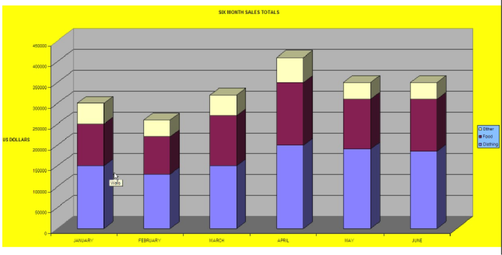
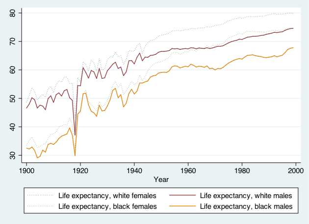

Introduction
============

Download workshop materials<span class="tag" data-tag-name="setup"></span>
--------------------------------------------------------------------------

-   Lab computer log in:
    -   USERNAME: dataclass
    -   PASSWORD: on the board to your left
-   Download materials from <http://tutorials.iq.harvard.edu/Stata/StataStatGraph.zip>
-   Extract materials from the `StataStatGraph.zip` file
-   Launch Stata and open the `StataStatGraph.do` file

Materials and setup<span class="tag" data-tag-name="mitsetup"></span>
---------------------------------------------------------------------

Laptop users: you will need a copy of Stata installed on your machine

Lab computer users: log in using your Athena user name and password

Everyone:

-   Open a web browser and download class materials from <http://tutorials.iq.harvard.edu/Stata/StataStatGraph.zip>.
-   Extract the downloaded zip file and move the `StataStatistics` folder to your Desktop.
-   Start the Stata program and open the `StataStatistics.do` file.

Organization
------------

-   Please feel free to ask questions at any point if they are relevant to the current topic (or if you are lost!)
-   There will be a Q&A after class for more specific, personalized questions
-   Collaboration with your neighbors is encouraged
-   If you are using a laptop, you will need to adjust paths accordingly
-   Make comments in your Do-file rather than on hand-outs
-   Save on flash drive or email to yourself

Fitting models in Stata
=======================

Today's Dataset
---------------

-   We have data on a variety of variables for all 50 states
-   Population, density, energy use, voting tendencies, graduation rates, income, etc.
-   We're going to be predicting SAT scores
-   Univariate Regression: SAT scores and Education Expenditures
-   Does the amount of money spent on education affect the mean SAT score in a state?
-   Dependent variable: csat
-   Independent variable: expense

Opening Files in Stata
----------------------

-   Look at bottom left hand corner of Stata screen
    -   This is the directory Stata is currently reading from
-   Files are located in the StataStatistics folder on the Desktop
-   Start by telling Stata where to look for these

``` stata
  // change directory
  cd "~/tutorials/Stata/StataStatGraph"
```

``` example
set more off

cd "~/tutorials/Stata/StataStatGraph"
/nfs/www/edu-harvard-iq-tutorials/Stata/StataStatGraph
```

-   Use dir to see what is in the directory:

``` stata
  dir
  cd dataSets
  dir
  cd ..
```

``` example
dir

total 8
drwxr-sr-x. 2 izahn tutorwww 4096 Oct 22 21:59 dataSets/
drwxr-sr-x. 3 izahn tutorwww 4096 Oct 22 21:59 images/
cd dataSets
/nfs/www/edu-harvard-iq-tutorials/Stata/StataStatGraph/dataSets
dir

total 21008
-rwxr-xr-x. 1 izahn tutorwww 21103444 Oct 22 21:59 NatNeighCrimeStudy.dta*
-rwxr-xr-x. 1 izahn tutorwww     8977 Oct 22 21:59 states.dta*
-rwxr-xr-x. 1 izahn tutorwww   298191 Oct 22 21:59 TimePollPubSchools.dta*
cd ..
/nfs/www/edu-harvard-iq-tutorials/Stata/StataStatGraph
```

-   Load the data

``` stata
  // use the states data set
  use dataSets/states.dta
```

``` example

use dataSets/states.dta
(U.S. states data 1990-91)
```

Steps for Running Regression
----------------------------

1.  Examine descriptive statistics
2.  Look at relationship graphically and test correlation(s)
3.  Run and interpret regression
4.  Test regression assumptions

Univariate regression
---------------------

### Univariate Regression: Preliminaries

-   We want to predict csat scores from expense
-   First, let's look at some descriptives

``` stata
  // generate summary statistics for csat and expense
  sum csat expense
```

``` example

sum csat expense

    Variable |        Obs        Mean    Std. Dev.       Min        Max
-------------+---------------------------------------------------------
        csat |         51     944.098    66.93497        832       1093
     expense |         51    5235.961    1401.155       2960       9259
```

### Univariate Regression Preliminaries

-   We want to predict csat scores from expense
-   First, let's look at some descriptives

``` stata
  // look at codebok
  codebook csat expense
```

``` example

codebook csat expense

-------------------------------------------------------------------------------
csat                                                   Mean composite SAT score
-------------------------------------------------------------------------------

                  type:  numeric (int)

                 range:  [832,1093]                   units:  1
         unique values:  45                       missing .:  0/51

                  mean:   944.098
              std. dev:    66.935

           percentiles:        10%       25%       50%       75%       90%
                               874       886       926       997      1024

-------------------------------------------------------------------------------
expense                                         Per pupil expenditures prim&sec
-------------------------------------------------------------------------------

                  type:  numeric (int)

                 range:  [2960,9259]                  units:  1
         unique values:  51                       missing .:  0/51

                  mean:   5235.96
              std. dev:   1401.16

           percentiles:        10%       25%       50%       75%       90%
                              3782      4351      5000      5865      6738
```

### Univariate Regression Preliminaries

-   Next, view relationship graphically
-   Scatterplots work well for univariate relationships

``` stata
  // graph expense by csat
  twoway scatter expense csat
```

### Univariate Regression Preliminaries

-   Next look at the correlation matrix

``` stata
  // correlate csat and expense
  pwcorr csat expense, star(.05)
```

``` example

pwcorr csat expense, star(.05)

             |     csat  expense
-------------+------------------
        csat |   1.0000 
     expense |  -0.4663*  1.0000
```

-   Not very interesting with only one predictor

### Univariate Regression: SAT scores and Education Expenditures

``` stata
  regress csat expense
```

``` example
regress csat expense

      Source |       SS           df       MS      Number of obs   =        51
-------------+----------------------------------   F(1, 49)        =     13.61
       Model |  48708.3001         1  48708.3001   Prob > F        =    0.0006
    Residual |   175306.21        49  3577.67775   R-squared       =    0.2174
-------------+----------------------------------   Adj R-squared   =    0.2015
       Total |   224014.51        50   4480.2902   Root MSE        =    59.814

------------------------------------------------------------------------------
        csat |      Coef.   Std. Err.      t    P>|t|     [95% Conf. Interval]
-------------+----------------------------------------------------------------
     expense |  -.0222756   .0060371    -3.69   0.001    -.0344077   -.0101436
       _cons |   1060.732    32.7009    32.44   0.000     995.0175    1126.447
------------------------------------------------------------------------------
```

### Linear Regression Assumptions

-   Assumption 1: Normal Distribution
-   The errors of regression equation are normally distributed
-   Assumption 2: Homoscedasticity (The variance around the regression line is the same for all values of the predictor variable)
-   Assumption 3: Errors are independent
-   Assumption 4: Relationships are linear

### Homoscedasticity

### Testing Assumptions: Normality

-   A simple histogram of the residuals can be informative

``` stata
  // graph the residual values of csat
  predict resid, residual
  histogram resid, normal 
```

``` example

predict resid, residual
histogram resid, normal
(bin=7, start=-131.81111, width=38.329487)
```

### Testing Assumptions: Homoscedasticity

``` stata
  rvfplot
```

``` example
rvfplot
```

Multiple regression
-------------------

### Multiple Regression

-   Just keep adding predictors
-   Let's try adding some predictors to the model of SAT scores
-   income :: % students taking SATs
-   percent :: % adults with HS diploma (high)

### Multiple Regression Preliminaries

-   As before, start with descriptive statistics and correlations

``` stata
  // descriptive statistics and correlations
  sum income percent high
  pwcorr csat expense income percent high
```

``` example

sum income percent high

    Variable |        Obs        Mean    Std. Dev.       Min        Max
-------------+---------------------------------------------------------
      income |         51    33.95657    6.423134     23.465     48.618
     percent |         51    35.76471    26.19281          4         81
        high |         51    76.26078    5.588741       64.3       86.6
pwcorr csat expense income percent high

             |     csat  expense   income  percent     high
-------------+---------------------------------------------
        csat |   1.0000 
     expense |  -0.4663   1.0000 
      income |  -0.4713   0.6784   1.0000 
     percent |  -0.8758   0.6509   0.6733   1.0000 
        high |   0.0858   0.3133   0.5099   0.1413   1.0000
```

### Multiple Regression

-   regress csat on exense, income, percent, and high

``` stata
  regress csat expense income percent high
```

``` example
regress csat expense income percent high

      Source |       SS           df       MS      Number of obs   =        51
-------------+----------------------------------   F(4, 46)        =     51.86
       Model |  183354.603         4  45838.6508   Prob > F        =    0.0000
    Residual |  40659.9067        46  883.911016   R-squared       =    0.8185
-------------+----------------------------------   Adj R-squared   =    0.8027
       Total |   224014.51        50   4480.2902   Root MSE        =    29.731

------------------------------------------------------------------------------
        csat |      Coef.   Std. Err.      t    P>|t|     [95% Conf. Interval]
-------------+----------------------------------------------------------------
     expense |   .0045604    .004384     1.04   0.304    -.0042641     .013385
      income |   .4437858   1.138947     0.39   0.699    -1.848795    2.736367
     percent |  -2.533084   .2454477   -10.32   0.000    -3.027145   -2.039024
        high |   2.086599   .9246023     2.26   0.029     .2254712    3.947727
       _cons |   836.6197   58.33238    14.34   0.000     719.2027    954.0366
------------------------------------------------------------------------------
```

### Exercise 1: Multiple Regression

Open the datafile, states.dta.

1.  Select a few variables to use in a multiple regression of your own. Before running the regression, examine descriptive of the variables and generate a few scatterplots.
2.  Run your regression
3.  Examine the plausibility of the assumptions of normality and homogeneity

Interactions
------------

### Interactions

-   What if we wanted to test an interaction between percent & high?
-   Option 1: generate product terms by hand

``` stata
  // generate product of percent and high
  gen percenthigh = percent*high 
  regress csat expense income percent high percenthigh
```

``` example

gen percenthigh = percent*high
regress csat expense income percent high percenthigh

      Source |       SS           df       MS      Number of obs   =        51
-------------+----------------------------------   F(5, 45)        =     46.11
       Model |  187430.401         5  37486.0801   Prob > F        =    0.0000
    Residual |  36584.1091        45  812.980201   R-squared       =    0.8367
-------------+----------------------------------   Adj R-squared   =    0.8185
       Total |   224014.51        50   4480.2902   Root MSE        =    28.513

------------------------------------------------------------------------------
        csat |      Coef.   Std. Err.      t    P>|t|     [95% Conf. Interval]
-------------+----------------------------------------------------------------
     expense |   .0045575   .0042044     1.08   0.284    -.0039107    .0130256
      income |   .0887856    1.10374     0.08   0.936    -2.134261    2.311832
     percent |  -8.143002   2.516509    -3.24   0.002    -13.21151   -3.074493
        high |   .4240906   1.156545     0.37   0.716    -1.905311    2.753492
 percenthigh |   .0740926   .0330909     2.24   0.030     .0074441    .1407411
       _cons |    972.525    82.5457    11.78   0.000     806.2695    1138.781
------------------------------------------------------------------------------
```

### Interactions

-   What if we wanted to test an interaction between percent & high?
-   Option 2: Let Stata do your dirty work

``` stata
  // use the # sign to represent interactions 
  regress csat percent high c.percent#c.high
  // same as . regress csat c.percent##high
```

``` example

regress csat percent high c.percent#c.high

      Source |       SS           df       MS      Number of obs   =        51
-------------+----------------------------------   F(3, 47)        =     77.39
       Model |  186302.091         3  62100.6971   Prob > F        =    0.0000
    Residual |  37712.4186        47  802.391885   R-squared       =    0.8317
-------------+----------------------------------   Adj R-squared   =    0.8209
       Total |   224014.51        50   4480.2902   Root MSE        =    28.327

------------------------------------------------------------------------------
        csat |      Coef.   Std. Err.      t    P>|t|     [95% Conf. Interval]
-------------+----------------------------------------------------------------
     percent |   -8.15717   2.488388    -3.28   0.002    -13.16316   -3.151179
        high |   .6674578   1.082615     0.62   0.541    -1.510482    2.845398
             |
   c.percent#|
      c.high |   .0764271   .0324919     2.35   0.023     .0110619    .1417924
             |
       _cons |   974.9354   81.98078    11.89   0.000     810.0113    1139.859
------------------------------------------------------------------------------
```

### Categorical Predictors

-   For categorical variables, we first need to dummy code
-   Use region as example
    -   Option 1: create dummy codes before fitting regression model

``` stata
  // create region dummy codes using tab 
  tab region, gen(region)

  //regress csat on region
  regress csat region1 region2 region3
```

``` example

tab region, gen(region)

Geographica |
   l region |      Freq.     Percent        Cum.
------------+-----------------------------------
       West |         13       26.00       26.00
    N. East |          9       18.00       44.00
      South |         16       32.00       76.00
    Midwest |         12       24.00      100.00
------------+-----------------------------------
      Total |         50      100.00


regress csat region1 region2 region3

      Source |       SS           df       MS      Number of obs   =        50
-------------+----------------------------------   F(3, 46)        =      9.61
       Model |  82049.4719         3   27349.824   Prob > F        =    0.0000
    Residual |  130911.908        46  2845.91105   R-squared       =    0.3853
-------------+----------------------------------   Adj R-squared   =    0.3452
       Total |   212961.38        49  4346.15061   Root MSE        =    53.347

------------------------------------------------------------------------------
        csat |      Coef.   Std. Err.      t    P>|t|     [95% Conf. Interval]
-------------+----------------------------------------------------------------
     region1 |  -63.77564   21.35592    -2.99   0.005    -106.7629    -20.7884
     region2 |  -120.5278   23.52385    -5.12   0.000    -167.8788   -73.17672
     region3 |  -80.08333   20.37225    -3.93   0.000    -121.0906   -39.07611
       _cons |   1010.083   15.39998    65.59   0.000     979.0848    1041.082
------------------------------------------------------------------------------
```

### Categorical Predictors

-   For categorical variables, we first need to dummy code
-   Use region as example
    -   Option 2: Let Stata do it for you

``` stata
  // regress csat on region using fvvarlist syntax
  // see help fvvarlist for details
  regress csat i.region
```

``` example


regress csat i.region

      Source |       SS           df       MS      Number of obs   =        50
-------------+----------------------------------   F(3, 46)        =      9.61
       Model |  82049.4719         3   27349.824   Prob > F        =    0.0000
    Residual |  130911.908        46  2845.91105   R-squared       =    0.3853
-------------+----------------------------------   Adj R-squared   =    0.3452
       Total |   212961.38        49  4346.15061   Root MSE        =    53.347

------------------------------------------------------------------------------
        csat |      Coef.   Std. Err.      t    P>|t|     [95% Conf. Interval]
-------------+----------------------------------------------------------------
      region |
    N. East  |  -56.75214   23.13285    -2.45   0.018    -103.3161   -10.18813
      South  |  -16.30769   19.91948    -0.82   0.417    -56.40353    23.78814
    Midwest  |   63.77564   21.35592     2.99   0.005      20.7884    106.7629
             |
       _cons |   946.3077   14.79582    63.96   0.000     916.5253    976.0901
------------------------------------------------------------------------------
```

### Exercise 2: Regression, Categorical Predictors, & Interactions

Open the datafile, states.dta.

1.  Add on to the regression equation that you created in exercise 1 by generating an interaction term and testing the interaction.
2.  Try adding a categorical variable to your regression (remember, it will need to be dummy coded). You could use region or generate a new categorical variable from one of the continuous variables in the dataset.

Exporting and saving results
----------------------------

### Saving and exporting regression tables

-   Usually when we're running regression, we'll be testing multiple models at a time
-   Can be difficult to compare results
-   Stata offers several user-friendly options for storing and viewing regression output from multiple models
-   First, download the necessary packages:

``` stata
  // install outreg2 package
  findit outreg2
```

### Saving and replaying

-   You can store regression model results in Stata

``` stata
  // fit two regression models and store the results
  regress csat expense income percent high
  estimates store Model1
  regress csat expense income percent high i.region
  estimates store Model2
```

``` example

regress csat expense income percent high

      Source |       SS           df       MS      Number of obs   =        51
-------------+----------------------------------   F(4, 46)        =     51.86
       Model |  183354.603         4  45838.6508   Prob > F        =    0.0000
    Residual |  40659.9067        46  883.911016   R-squared       =    0.8185
-------------+----------------------------------   Adj R-squared   =    0.8027
       Total |   224014.51        50   4480.2902   Root MSE        =    29.731

------------------------------------------------------------------------------
        csat |      Coef.   Std. Err.      t    P>|t|     [95% Conf. Interval]
-------------+----------------------------------------------------------------
     expense |   .0045604    .004384     1.04   0.304    -.0042641     .013385
      income |   .4437858   1.138947     0.39   0.699    -1.848795    2.736367
     percent |  -2.533084   .2454477   -10.32   0.000    -3.027145   -2.039024
        high |   2.086599   .9246023     2.26   0.029     .2254712    3.947727
       _cons |   836.6197   58.33238    14.34   0.000     719.2027    954.0366
------------------------------------------------------------------------------
estimates store Model1
regress csat expense income percent high i.region

      Source |       SS           df       MS      Number of obs   =        50
-------------+----------------------------------   F(7, 42)        =     51.07
       Model |  190570.293         7  27224.3275   Prob > F        =    0.0000
    Residual |  22391.0874        42  533.121128   R-squared       =    0.8949
-------------+----------------------------------   Adj R-squared   =    0.8773
       Total |   212961.38        49  4346.15061   Root MSE        =    23.089

------------------------------------------------------------------------------
        csat |      Coef.   Std. Err.      t    P>|t|     [95% Conf. Interval]
-------------+----------------------------------------------------------------
     expense |   -.004375   .0044603    -0.98   0.332    -.0133763    .0046263
      income |   1.306164    .950279     1.37   0.177    -.6115765    3.223905
     percent |  -2.965514   .2496481   -11.88   0.000    -3.469325   -2.461704
        high |   3.544804   1.075863     3.29   0.002     1.373625    5.715983
             |
      region |
    N. East  |   80.81334    15.4341     5.24   0.000     49.66607    111.9606
      South  |   33.61225   13.94521     2.41   0.020     5.469676    61.75483
    Midwest  |   32.15421   10.20145     3.15   0.003     11.56686    52.74157
             |
       _cons |   724.8289   79.25065     9.15   0.000     564.8946    884.7631
------------------------------------------------------------------------------
estimates store Model2
```

### Saving and replaying

-   Stored models can be recalled

``` stata
  // Display Model1
  estimates replay Model1
```

``` example

estimates replay Model1

-------------------------------------------------------------------------------
Model Model1
-------------------------------------------------------------------------------

      Source |       SS           df       MS      Number of obs   =        51
-------------+----------------------------------   F(4, 46)        =     51.86
       Model |  183354.603         4  45838.6508   Prob > F        =    0.0000
    Residual |  40659.9067        46  883.911016   R-squared       =    0.8185
-------------+----------------------------------   Adj R-squared   =    0.8027
       Total |   224014.51        50   4480.2902   Root MSE        =    29.731

------------------------------------------------------------------------------
        csat |      Coef.   Std. Err.      t    P>|t|     [95% Conf. Interval]
-------------+----------------------------------------------------------------
     expense |   .0045604    .004384     1.04   0.304    -.0042641     .013385
      income |   .4437858   1.138947     0.39   0.699    -1.848795    2.736367
     percent |  -2.533084   .2454477   -10.32   0.000    -3.027145   -2.039024
        high |   2.086599   .9246023     2.26   0.029     .2254712    3.947727
       _cons |   836.6197   58.33238    14.34   0.000     719.2027    954.0366
------------------------------------------------------------------------------
```

### Saving and replaying

-   Stored models can be compared

``` stata
  // Compare Model1 and Model2 coefficients
  estimates table Model1 Model2
```

``` example

estimates table Model1 Model2

----------------------------------------
    Variable |   Model1       Model2    
-------------+--------------------------
     expense |  .00456044   -.00437502  
      income |  .44378583    1.3061642  
     percent | -2.5330843   -2.9655142  
        high |  2.0865991    3.5448038  
             |
      region |
    N. East  |               80.813342  
      South  |               33.612251  
    Midwest  |               32.154215  
             |
       _cons |  836.61966    724.82886  
----------------------------------------
```

### Exporting into Excel

-   Avoid human error when transferring coefficients into tables
-   Excel can be used to format publication-ready tables

``` stata
  outreg2 [Model1 Model2] using csatprediction.xls, replace
```

``` example
outreg2 [Model1 Model2] using csatprediction.xls, replace
~/ado/plus/o/outreg2.ado
csatprediction.xls
dir : seeout
```

Graphing in Stata
=================

Graphing Strategies
-------------------

-   Keep it simple
-   Labels, labels, labels!!
-   Avoid cluttered graphs
-   Every part of the graph should be meaningful
-   Avoid:
    -   Shading
    -   Distracting colors
    -   Decoration
-   Always know what you’re working with before you get started
    -   Recognize scale of data
    -   If you’re using multiple variables – how do their scales align?
-   Before any graphing procedure review variables with `codebook`, `sum`, `tab`, etc.
-   HELPFUL STATA HINT: If you want your command to go on multiple lines use `///` at end of each line

### Terrible Graph



##### Much Better Graph


Univariate Graphics
-------------------

### Our First Dataset

-   Time Magazine Public School Poll
    -   Based on survey of 1,000 adults in U.S.
    -   Conducted in August 2010
    -   Questions regarding feelings about parental involvement, teachers union, current potential for reform
-   Open Stata and call up the datafile for today

``` stata
  // Step 1: tell Stata where to find data:
  cd "~/StataGraphics/dataSets"
  // Step 2: call up our dataset:
  use TimePollPubSchools.dta
```

### Single Continuous Variables

Example: Histograms

-   Stata assumes you’re working with continuous data
-   Very simple syntax:
    -   `hist varname`
-   Put a comma after your varname and start adding options
    -   `bin(#)` : change the number of bars that the graph displays
    -   `normal` : overlay normal curve
    -   `addlabels` : add actual values to bars

### Histogram Options

-   To change the numeric depiction of your data add these options after the comma
    -   Choose one: density fraction frequency percent
-   Be sure to properly describe your histogram:
    -   `title(insert name of graph)`
    -   `subtitle(insert subtitle of graph)`
    -   `note(insert note to appear at bottom of graph)`
    -   `caption(insert caption to appear below notes)`

### Histogram Example

``` stata
  hist F1, bin(10) percent title(TITLE) ///
    subtitle(SUBTITLE) caption(CAPTION) note(NOTES)
```


### Axis Titles and Labels

Example: Histograms

-   Axis title options (default is variable label):
    -   `xtitle(insert x axis name)`
    -   `ytitle(insert y axis name)`
-   Don’t want axis titles?
    -   `xtitle("")`
    -   `ytitle("")`
-   Add labels to X or Y axis:
    -   xlabel(insert x axis label)
    -   ylabel(insert y axis label)
-   Tell Stata how to scale each axis
    -   xlabel(start\#(increment)end\#)
    -   xlabel(0(5)100)
-   This would label x-axis from 0-100 in increments of 5

### Axis Labels Example

``` stata
  hist F1, bin(10) percent title(TITLE) subtitle(SUBTITLE) ///
      caption(CAPTION) note(NOTES) ///
      xtitle(Here's your x-axis title) ///
  ytitle(here's your y-axis title)
```


### Basic Graphing: Single Categorical Variables

-   We can also use the `hist` command for bar graphs
    -   Simply specify "discrete" with options
-   Stata will produce one bar for each level (i.e. category) of variable
-   Use `xlabel` command to insert names of individual categories

``` stata
  hist F4, title(Racial breakdown of Time Poll Sample) xtitle(Race) ///
  ytitle(Percent) xlabel(1 "White" 2 "Black" 3 "Asian" 4 "Hispanic" ///
   5 "Other") discrete percent addlabels
```


### Exercise 1: Histograms Bar Graphs

1.  Open the datafile, NatNeighCrimeStudy.dta.
2.  Create a histogram of the tract-level poverty rate (variable name: `T_POVRTY`).
3.  Insert the normal curve over the histogram
4.  Change the numeric representation on the Y-axis to "percent"
5.  Add appropriate titles to the overall graph and the x axis and y axis. Also, add a note that states the source of this data.
6.  Open the datafile, TimePollPubSchools.dta
7.  Create a histogram of the question, "What grade would you give your child’s school" (variable name: Q11). Be sure to tell Stata that this is a categorical variable.
8.  Format this graph so that the axes have proper titles and labels. Also, add an appropriate title to the overall graph that goes onto two lines. Add a note stating the source of the data.

### Next Dataset:

-   National Neighborhood Crime Study (NNCS)
    -   N=9,593 census tracts in 2000
    -   Explore sources of variation in crime for communities in the United States
    -   Tract-level data: crime, social disorganization, disadvantage, socioeconomic inequality
    -   City-level data: labor market, socioeconomic inequality, population change

Bivariate Graphics
------------------

### The Twoway Family

-   `twoway` is basic Stata command for all twoway graphs
-   Use `twoway` anytime you want to make comparisons among variables
-   Can be used to combine graphs (i.e., overlay one graph with another
    -   e.g., insert line of best fit over a scatter plot
-   Some basic examples:

``` stata
  use NatNeighCrimeStudy.dta
  twoway scatter T_PERCAP T_VIOLNT
  twoway dropline T_PERCAP T_VIOLNT
  twoway  lfitci T_PERCAP T_VIOLNT
```

### Twoway and the "by" Statement

``` stata
  twoway scatter T_PERCAP T_VIOLNT, by(DIVISION)
```


### Twoway Title Options

-   Same title options as with histogram
    -   `title(insert name of graph)`
    -   `subtitle(insert subtitle of graph)`
    -   `note(insert note to appear at bottom of graph)`
    -   `caption(insert caption to appear below notes)`

### Twoway Title Options Example

``` stata
  twoway scatter T_PERCAP T_VIOLNT, ///
      title(Comparison of Per Capita Income ///
            and Violent Crime Rate at Tract level) ///
  xtitle(Violent Crime Rate) ytitle(Per Capita Income) ///
      note(Source: National Neighborhood Crime Study 2000) 

```

-   The title is a bit cramped--let's fix that:

``` stata
  twoway scatter T_PERCAP T_VIOLNT, ///
      title("Comparison of Per Capita Income" ///
  "and Violent Crime Rate at Tract level") ///
  xtitle(Violent Crime Rate) ytitle(Per Capita Income) ///
  note(Source: National Neighborhood Crime Study 2000) 

```

### Twoway Symbol Options

-   A variety of symbol shapes are available: use `palette symbolpalette` to seem them and `msymbol()` to set them


### Twoway Symbol Options

``` stata
  twoway scatter T_PERCAP T_VIOLNT, ///
      title("Comparison of Per Capita Income" ///
  "and Violent Crime Rate at Tract level") ///
  xtitle(Violent Crime Rate) ytitle(Per Capita Income) ///
  note(Source: National Neighborhood Crime Study 2000) ///
  msymbol(Sh) mcolor("red")
```


### Overlaying Twoway Graphs

-   Very simple to combine multiple graphs…just put each graph command in parentheses
    -   `twoway (scatter var1 var2) (lfit var1 var2)`
-   Add individual options to each graph within the parentheses
-   Add overall graph options as usual following the comma
    -   `twoway (scatter var1 var2) (lfit var1 var2), options`

### Overlaying Points and Lines

``` stata
  twoway (scatter T_PERCAP T_VIOLNT) ///
      (lfit T_PERCAP T_VIOLNT), ///
      title("Comparison of Per Capita Income" ///
            "and Violent Crime Rate at Tract level") ///
      xtitle(Violent Crime Rate) ytitle(Per Capita Income) ///
      note(Source: National  Neighborhood Crime Study 2000)
```

### Overlaying Points and Labels

``` stata
  twoway (scatter T_PERCAP T_VIOLNT if T_VIOLNT==1976, ///
          mlabel(CITY)) (scatter T_PERCAP T_VIOLNT), ///
      title("Comparison of Per Capita Income" ///
            "and Violent Crime Rate at Tract level") ///
      xlabel(0(200)2400) note(Source: National Neighborhood ///
                              Crime Study 2000) legend(off)
```

### Exercise 2: The TwoWay Family

Open the datafile, NatNeighCrimeStudy.dta.

1.  Create a basic twoway scatterplot that compares the city unemployment rate (`C_UNEMP`) to the percent secondary sector low-wage jobs (`C_SSLOW`)
2.  Generate the same scatterplot, but this time, divide the plot by the dummy variable indicating whether the city is located in the south or not (`C_SOUTH`)
3.  Change the color of the symbol that you use in this scatter plot
4.  Change the type of symbol you use to a marker of your choice
5.  Notice in your scatterplot that is broken down by `C_SOUTH` that there is an outlier in the upper right hand corner of the "Not South" graph. Add the city name label to this marker.
6.  Review the options available under "help twoway<sub>options</sub>" and change one aspect of your graph using an option that we haven’t already reviewed

More Fun with Twoway Line Graphs
--------------------------------

### Line Graphs

-   Line graphs helpful for a variety of data
    -   Especially any type of time series data
-   We’ll use data on US life expectancy from 1900-1999
    -   `webuse uslifeexp, clear`

### Line Graphs

``` stata
  webuse uslifeexp, clear
  twoway (line le_wm year, mcolor("red")) ///
      (line le_bm year, mcolor("green"))
```


``` stata
  twoway (line (le_wfemale le_wmale le_bf le_bm) year, ///
      lpattern(dot solid dot solid))
```



### Stata Graphing Lines

``` stata
  palette linepalette
```


### Exporting Graphs

-   From Stata, right click on image and select "save as" or try syntax:
    -   `graph export myfig.esp, replace`
-   In Microsoft Word: insert &gt; picture &gt; from file
    -   Or, right click on graph in Stata and copy and paste into Word

Wrap-up
=======

Help Us Make This Workshop Better
---------------------------------

-   Please take a moment to fill out a very short feedback form
-   These workshops exist for you--tell us what you need!
-   <http://tinyurl.com/StataRegressionFeedback>

Additional resources
--------------------

-   training and consulting
    -   IQSS workshops: <http://projects.iq.harvard.edu/rtc/filter_by/workshops>
    -   IQSS statistical consulting: <http://dss.iq.harvard.edu>
-   Stata resources
    -   UCLA website: <http://www.ats.ucla.edu/stat/Stata/>
    -   Great for self-study
    -   Links to resources
-   Stata website: <http://www.stata.com/help.cgi?contents>
-   Email list: <http://www.stata.com/statalist/>

